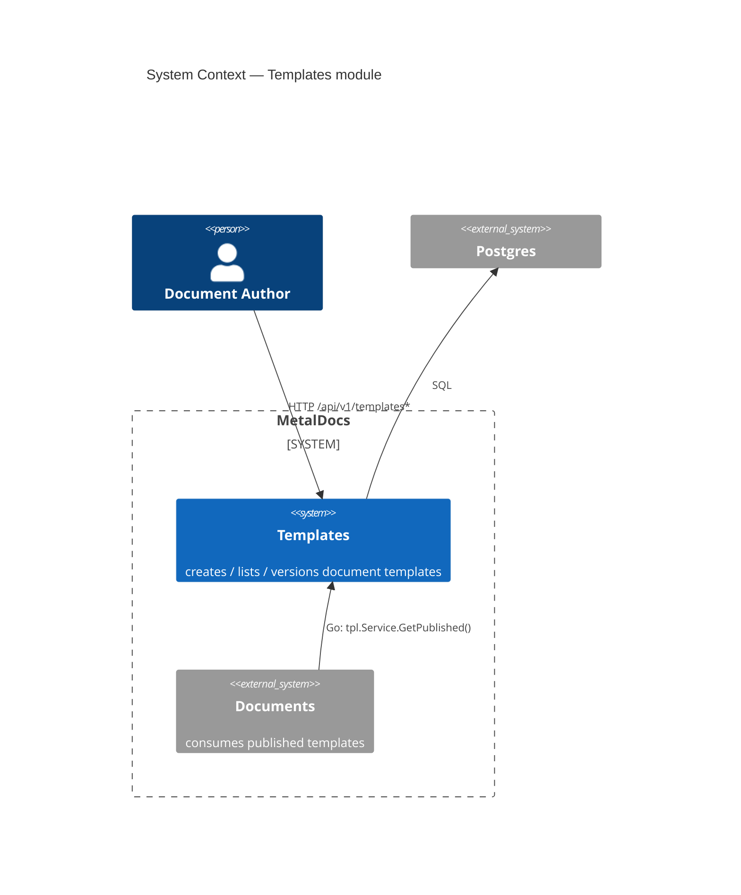
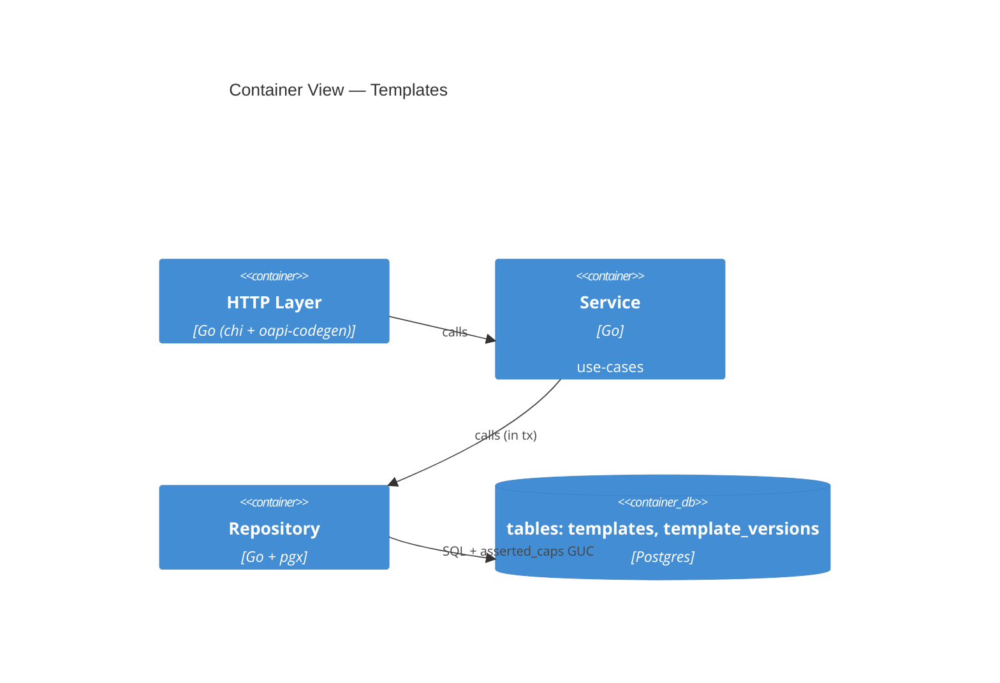
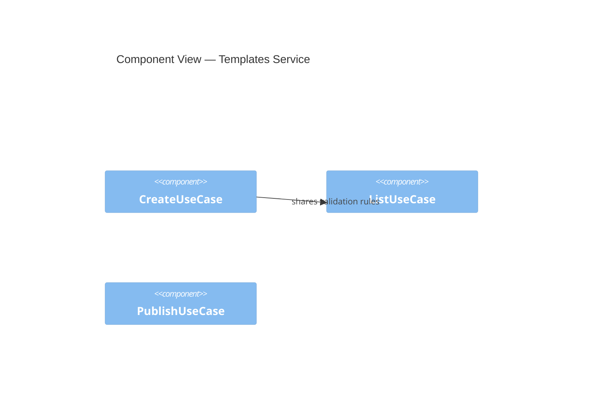
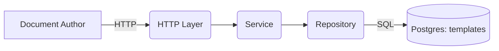

# C4 + Mermaid Cheatsheet

Use Mermaid's native `C4Context` / `C4Container` / `C4Component` blocks. They render in GitHub, VS Code, and most wiki viewers. Fallback `flowchart` syntax included for environments that choke on C4 blocks.

## Levels (pick by audience)

| Level | Name | Boxes | Use when |
|---|---|---|---|
| 1 | Context | People + external systems + THIS system | §3 of module doc |
| 2 | Container | Apps, services, datastores INSIDE this system | §5 of module doc (default zoom) |
| 3 | Component | Major code components inside one container | only when §5 Container is too coarse |
| 4 | Code | Class / function level | almost never — code itself is the doc |

For a module doc: §3 = Level 1, §5 = Level 2. Skip Level 3 unless the module has ≥4 internal containers.

## Mermaid C4 syntax (cheat)

### Context (Level 1)

### Container (Level 2)

### Component (Level 3) — rarely needed

## Allowed primitives

| Primitive | Use |
|---|---|
| `Person(id, label, descr?)` | a human |
| `System(id, label, descr?)` | THIS system (or peer) |
| `System_Ext(id, label, descr?)` | third-party / external system |
| `System_Boundary(id, label) { ... }` | logical grouping at Level 1 |
| `Container(id, label, tech?, descr?)` | runtime container at Level 2 |
| `ContainerDb(id, label, tech?, descr?)` | datastore container at Level 2 |
| `Container_Boundary(id, label) { ... }` | grouping at Level 2 |
| `Component(id, label, tech?, descr?)` | code component at Level 3 |
| `Rel(from, to, label, tech?)` | relationship (directed) |

## Fallback (when C4 block fails to render)

If a renderer rejects `C4Container`, fall back to `flowchart LR` with the same box labels — readers still get the gist.

## Anti-patterns

| Anti-pattern | Fix |
|---|---|
| 20-box diagram at Level 1 | Promote groups to `System_Boundary`; move detail to Level 2 |
| Same module shown at Level 1 AND Level 2 with same boxes | Levels are zooms — they must show different scopes |
| `Rel` arrows without labels | Always label: "HTTP /…", "SQL", "Go call", "publishes event" |
| Boxes for things never explained in §5 text | Coverage gate (b) fails — name them or remove them |
| Mixing tech labels (Postgres) and abstract labels (Database) | Pick one register and keep it consistent across the doc |

## References

- C4 Model: https://c4model.com/
- Mermaid C4 docs: https://mermaid.js.org/syntax/c4.html
