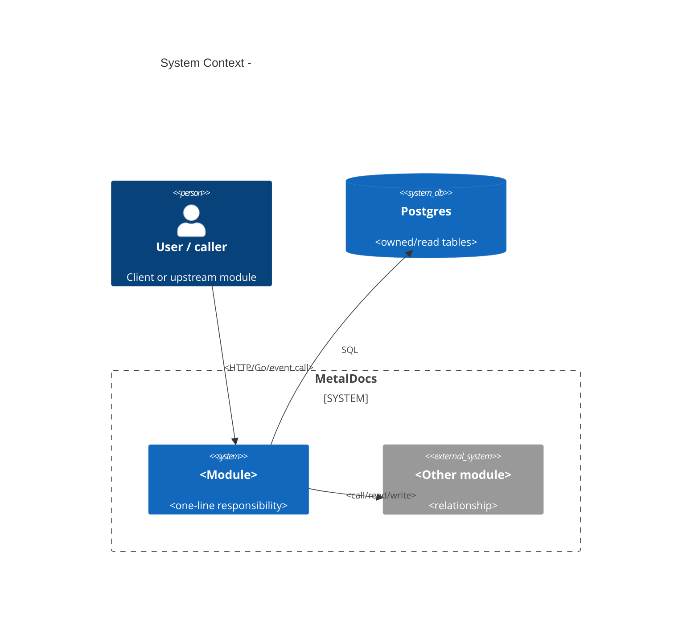
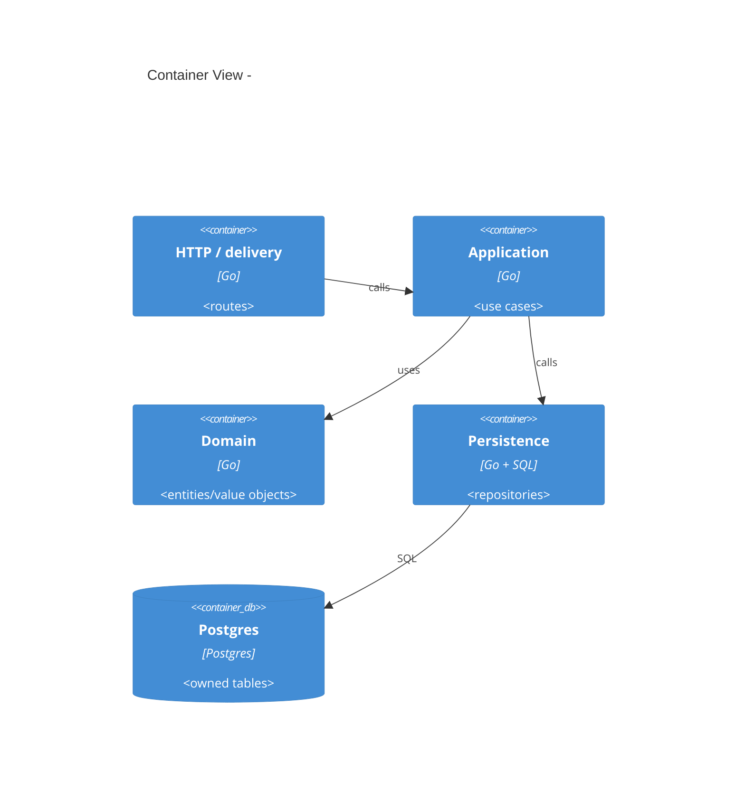
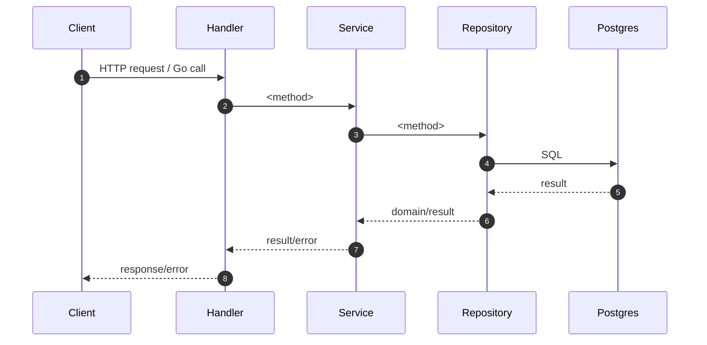

# Module: <Name>

> Mature module wiki. Shape: Arc42 + C4 + API route truth table + runtime flows + persistence/cross-dep/debt links.
> Replace every `<placeholder>`. If a section does not apply, keep a short `n/a - <evidence>` note and record the skip in the changelog.

**Last verified:** YYYY-MM-DD | **Owner:** <code-owner or "unassigned"> | **Status:** active | deprecated | partial | **Maturity:** L0 | L1 | L2 | L3 | L4

> **Key files:**
> - `path/to/file.go:LL` - <why this file matters>
> - `api/openapi/v1/openapi.yaml:LL` - <API contract anchor, if applicable>
> - `migrations/NNNN_*.sql:LL` - <schema/trigger/constraint anchor, if applicable>

---

## 1. Introduction & Goals

One paragraph: what this module owns, why it exists, who calls it, and what business outcome depends on it.

### 1.1 Requirements Overview

- <Requirement> - source: `<ADR/spec/wiki link/code anchor>`

### 1.2 Quality Goals

Rank the top goals. Each must be verifiable from tests, lint, migration constraints, runtime checks, or explicit gaps.

| Rank | Goal | How verified |
|---|---|---|
| 1 | <correctness/authz/isolation/etc> | <test/check/artifact> |
| 2 | <goal> | <test/check/artifact> |
| 3 | <goal> | <test/check/artifact> |

### 1.3 Stakeholders

| Role | Expectation |
|---|---|
| End user | <what they need from this module> |
| Operator | <ops/audit/recovery concerns> |
| Developer / LLM agent | <contracts, extension points, hazards> |

---

## 2. Architecture Constraints

Constraints that bind design choices, not preferences.

- Language/runtime:
- Persistence:
- Authn/authz:
- API contract/codegen:
- Error envelope:
- Tenant isolation:
- Module-specific constraints:

---

## 3. System Scope & Context (C4 Level 1)

### 3.1 Business Context

Plain English: what stakeholders rely on this module to do.

### 3.2 Technical Context

Inbound interfaces:
- HTTP:
- Go imports/callers:
- Jobs/events:

Outbound interfaces:
- Go imports/callees:
- DB tables:
- External/platform services:

---

## 4. Solution Strategy

3-5 bullets explaining core design choices. Link ADRs or name the constraint.

- <Choice> - driver: <ADR/constraint/evidence>

---

## 5. Building Block View (C4 Level 2)

### 5.1 Whitebox - <Module>

### 5.2 Public Surface

Group by file. Include exported symbols, public ports, route handlers, jobs, generated API interfaces, and intentional exclusions.

| File | Symbol | Kind | Purpose / implementation relevance |
|---|---|---|---|
| `internal/modules/<m>/<file>.go:LL` | `<Symbol>` | type / func / iface / const | <one line> |

### 5.3 HTTP Operations

| Method | Path | OperationID | Handler | Authz / capability | Notes |
|---|---|---|---|---|---|
| GET | `/api/v1/<path>` | `<operationId or ->` | `<Handler.method>` | `<capability/role/n/a>` | <note> |

### 5.4 API Route Truth Table

Reconcile runtime routing, OpenAPI, generated code, and permission mapping. Use `-` only after checking the source.

| Method | Path | Runtime owner (file:line) | Handler method | Spec path | operationId | Codegen method | Authz / capability | Status | Notes |
|---|---|---|---|---|---|---|---|---|---|
| GET | `/api/v1/<path>` | `internal/modules/<m>/delivery/http/routes.go:LL` | `<handler>` | `<spec path or ->` | `<id or ->` | `<method or ->` | `<cap or ->` | Aligned / Spec missing / Runtime missing / Bootstrap only / Legacy/manual | <note> |

- Module contract status: Contracted | Spec missing | Runtime missing | Bootstrap only | Legacy/manual
- Owner: <owner>

---

## 6. Runtime View

One subsection per traced operation. Prefer one read, one write, and one state transition when applicable.

### 6.1 <Operation / Flow Name>

Source: `_artifacts/02-flow-<name>.md`.

Transaction boundary:
- <where tx starts/commits/rolls back or n/a>

Authz/audit/idempotency:
- <tier-1/tier-2/tripwire/audit/idempotency facts or n/a>

### State Transitions

| Entity | From | To | Trigger | Authz / guard | Persistence effect |
|---|---|---|---|---|---|
| <entity> | <state> | <state> | `<route/method>` | <guard> | <tables/rows> |

### Failure Modes

| Condition | HTTP / error | Body / error type | Source |
|---|---|---|---|
| <condition> | <status/error> | <shape/type> | `<file:line>` |

---

## 7. Deployment View

- Binary/process:
- Composition root:
- Migrations:
- Jobs/workers:
- Environment/config:
- Local/dev differences:

---

## 8. Cross-cutting Concepts

### 8.1 Authentication & Authorization

- Tier 1 / edge:
- Tier 2 / in-transaction:
- DB tripwire / GUC:
- System/admin bypasses:

### 8.2 Error Envelope

- Current shape:
- Target contract:
- Gaps:

### 8.3 Idempotency

- Keys/store/replay behavior:
- Gaps:

### 8.4 Pagination / Filtering

- Strategy:
- Limits:
- Gaps:

### 8.5 Logging / Audit / Observability

- Audit sink:
- Governance events:
- Trace/log fields:
- Gaps:

### 8.6 Concurrency / Transactions

- Transaction ownership:
- Locking/constraints:
- Race/idempotency behavior:

### 8.7 Persistence And Data Ownership

- Owned tables:
- Read tables:
- Migrations:
- Tenant keys:
- Triggers / tripwire / GUC:
- Retention / archive behavior:
- Cross-module data contracts:

### 8.8 Cross-dependencies

Inbound edges:
- `<package/file>` - <why it imports/calls this module>

Outbound edges:
- `<package/file>` - <why this module imports/calls it>

---

## 9. Architecture Decisions

Every load-bearing decision either links an ADR or is logged as `missing-ADR` in tech debt.

| Decision | Link / Status |
|---|---|
| <decision> | `wiki/decisions/<adr>.md` or `tech-debt: missing-ADR` |

---

## 10. Quality Requirements

Specific scenarios that prove the quality goals.

| Goal | Scenario | Pass criteria |
|---|---|---|
| <goal> | <scenario> | <observable pass/fail> |

---

## 11. Risks & Technical Debt

Pointer-only. Body lives in `wiki/modules/<m>-tech-debt.md`. Compute counts from the register; do not eyeball.

- Critical: <N>
- Major: <N>
- Minor: <N>
- Decisions without ADR link: <N or n/a>

Top 3 by severity, then blast radius:
1. <T-NNN - one-liner> - see `wiki/modules/<m>-tech-debt.md`
2. <T-NNN - one-liner> - see `wiki/modules/<m>-tech-debt.md`
3. <T-NNN - one-liner> - see `wiki/modules/<m>-tech-debt.md`

Refactor backlog: `wiki/backlog/<m>-refactor.md`

---

## 12. Glossary

| Term | Definition |
|---|---|
| <term> | <plain English definition> |

---

## Cross-links

- Related ADRs:
- Related concepts:
- Related architecture docs:
- Related modules:
- Backlog: `wiki/backlog/<m>-refactor.md`
- Tech debt: `wiki/modules/<m>-tech-debt.md`
- Source artifacts: `wiki/modules/<m>/_artifacts/00-context.md` through `06-selfreview.md`

## Changelog

- YYYY-MM-DD - Initial mature module wiki publish; maturity <Lx> -> <Ly>.
