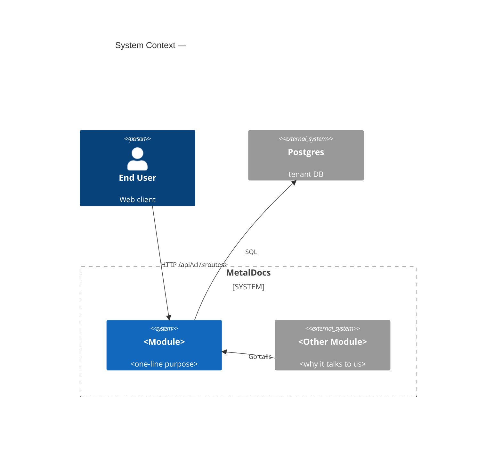
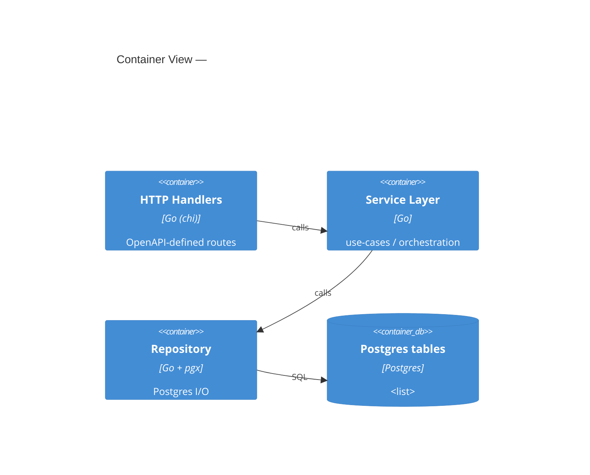
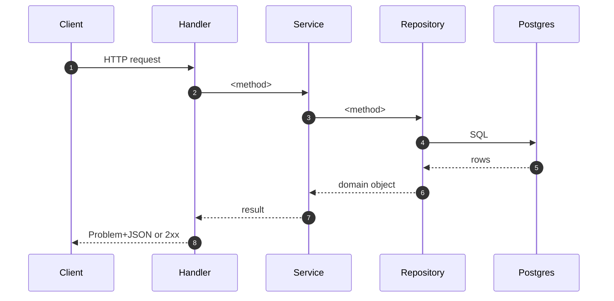

# Module: <Name>

> Living architecture doc. Shape: Arc42 (12 sections) + C4 (Context/Container/Component) Mermaid diagrams + ADR links.
> Replace every `<placeholder>`. Delete any section that genuinely does not apply, but note the deletion in the changelog at the bottom.

**Last verified:** YYYY-MM-DD · **Owner:** <code-owner or "unassigned"> · **Status:** active | deprecated | partial

---

## 1. Introduction & Goals

One paragraph: what this module is responsible for, why it exists, who uses it.

### 1.1 Requirements overview

Bullet the top 3–5 functional requirements the module satisfies. Reference the originating spec / RFC / ADR where possible.

- <Requirement> — source: `docs/superpowers/specs/<file>.md` or `<external>`

### 1.2 Quality Goals

Top 3, ranked. Each goal must be testable.

| Rank | Goal | How verified |
|---|---|---|
| 1 | <e.g. correctness> | <test/check> |
| 2 | <e.g. authz isolation> | <tripwire/lint> |
| 3 | <e.g. latency P95 < N ms> | <metric/SLO> |

### 1.3 Stakeholders

| Role | Expectation |
|---|---|
| End user | <what they need from this module> |
| Operator | <ops/SRE concerns> |
| Developer | <DX/contract guarantees> |

---

## 2. Architecture Constraints

Constraints that BIND design choices — not preferences.

- Language / runtime: Go 1.25
- Persistence: Postgres (per `wiki/architecture/persistence.md`)
- Authz: two-tier per `wiki/decisions/0007-two-tier-authz.md`
- API contract: OpenAPI 3.0.3 generated via oapi-codegen (per `wiki/architecture/api-contract.md`)
- Error envelope: RFC 9457 Problem Details
- <module-specific constraints>

---

## 3. System Scope & Context (C4 Level 1)

Who/what touches this module from outside?



### 3.1 Business Context

Plain-English: what stakeholders rely on this module to do. No code.

### 3.2 Technical Context

Inbound interfaces:
- HTTP routes (list from §4)
- Go function exports consumed by other modules (list from cross-deps artifact)

Outbound interfaces:
- DB tables touched (list from persistence artifact)
- Other Go modules called

---

## 4. Solution Strategy

3–5 bullets explaining the core design choices. Each bullet links to an ADR or names the constraint that forced the choice.

- <Choice> — driver: <constraint or ADR link>

---

## 5. Building Block View (C4 Level 2 — Container)

### 5.1 Whitebox — <Module>



### 5.2 Public surface

Every exported symbol from the surface-scan artifact. Group by file.

| File | Symbol | Kind | Purpose |
|---|---|---|---|
| `internal/modules/<m>/<file>.go:LL` | `TypeOrFunc` | type / func / iface | <one line> |

### 5.3 HTTP operations

| Method | Path | OperationID | Handler | Authz area |
|---|---|---|---|---|
| GET | `/api/v1/<path>` | `listX` | `Handler.ListX` | `<area>` or `custom` |

---

## 6. Runtime View (selected scenarios)

One subsection per traced operation (from data-flow artifacts).

### 6.1 <OperationID>



State transitions, if any:

| From | To | Trigger | Authz cap |
|---|---|---|---|
| draft | submitted | `POST .../submit` | `docs.submit` |

Failure modes — reference `wiki/concepts/error-ux.md`:

| Condition | HTTP | Problem `type` |
|---|---|---|
| missing capability | 403 | `metaldocs.authz.forbidden` |
| validation | 422 | `metaldocs.validation` |

---

## 7. Deployment View

How this module ships and runs. Usually short.

- Binary: single Go server (`cmd/<name>`)
- Process: one container, port `:8081`
- Migrations: applied by <tool> at startup; files in `<path>`
- Environment: secrets / config envs the module reads

---

## 8. Cross-cutting Concepts

Concepts that span building blocks. One subsection each, no fluff.

### 8.1 Authentication & Authorization
- Tier 1 (HTTP edge): `CapabilityService` — see `wiki/architecture/authz.md`
- Tier 2 (in-tx): `authz.Require(ctx, tx, cap, area)` — see `wiki/decisions/0007-two-tier-authz.md`
- Postgres tripwire enforcer: `metaldocs.asserted_caps` GUC

### 8.2 Error envelope
- All non-2xx responses: RFC 9457 Problem+JSON
- `errors[]` extension for validation field errors

### 8.3 Idempotency (if applicable)
- `Idempotency-Key` header, raw-byte SHA-256 hashing, store: `internal/platform/idempotency`

### 8.4 Pagination (if applicable)
- Cursor-based, `cursor` + `limit` query params, `page.next_cursor` + `page.has_more` response fields

### 8.5 Logging & Observability
- <relevant log keys, trace IDs, metrics>

### 8.6 Concurrency / Transactions
- Repository methods accept `pgx.Tx` and `context.Context`
- Service-layer enforces tx boundary

---

## 9. Architecture Decisions

Every load-bearing decision either points to an ADR or is logged as missing-ADR in `<module>-tech-debt.md`.

| Decision | Link / Status |
|---|---|
| Two-tier authz | `wiki/decisions/0007-two-tier-authz.md` |
| <decision> | <ADR link> or `tech-debt: missing-ADR` |

---

## 10. Quality Requirements

Specific scenarios that prove §1.2 quality goals.

| Goal | Scenario | Pass criteria |
|---|---|---|
| Authz isolation | An authn'd user without `<cap>` calls `<route>` | 403 with Problem `metaldocs.authz.forbidden`; no DB write |

---

## 11. Risks & Technical Debt

Pointer-only. Body lives in `wiki/modules/<m>-tech-debt.md`. Severity rubric (concrete triggers) lives in the same file; do not invent local definitions.

**Summary counts — compute from the register, do NOT eyeball.** Phase 6.5 `tally_check.sh` will fail the publish gate if these disagree with the register. Quick recipe before filling in:

```bash
grep -cE '^- \*\*Severity:\*\* critical' wiki/modules/<m>-tech-debt.md
grep -cE '^- \*\*Severity:\*\* major'    wiki/modules/<m>-tech-debt.md
grep -cE '^- \*\*Severity:\*\* minor'    wiki/modules/<m>-tech-debt.md
```

- Critical: <N>
- Major: <N>
- Minor: <N>

Top 3 (by severity, then by blast-radius — not authorship order):
1. <one-liner> — see tech-debt §<id>
2. ...
3. ...

---

## 12. Glossary

| Term | Definition |
|---|---|
| <module-specific term> | <plain English> |

---

## Cross-links

- Related ADRs: `wiki/decisions/...`
- Related concepts: `wiki/concepts/...`
- Backlog: `wiki/backlog/<module>-refactor.md`
- Tech debt: `wiki/modules/<module>-tech-debt.md`

## Changelog (this doc)

- YYYY-MM-DD — initial publish
- <date> — <what changed and why>
