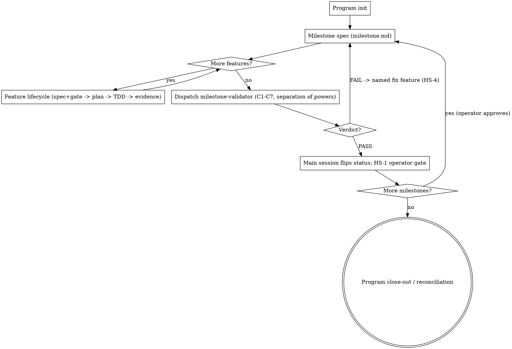

# Milestone Workflow

Run a big program as a chain of **Milestones**. Each milestone is a bounded slice of the program that
is **specced up front**, **executed one feature at a time** (each feature contract-specced and gated
before code), and then **validated by an independent judge** before a human gate lets the next
milestone start. The point is evidence and control: nothing is "done" by assertion, the actor who
builds a milestone never rules on it, and the operator can stop, replan, or redirect at every boundary.

This skill owns the layer *above* per-feature implementation: the milestone spec, the per-feature
contract gate, the folder structure, the **rigid milestone-close validator**, and the hard-stops.
Where the `superpowers:writing-plans` and `superpowers:subagent-driven-development` skills are
installed, use them as the per-feature plan/execute engine (Phase 3). **Where they are not installed,
run the inline lifecycle in Phase 3 directly** — the lifecycle is the contract, the skills are one
way to execute it. Do not block on a skill that isn't present.

**Canonical worked example:** `docs/superpowers/specs/2026-06-14-grade-a-architecture-remediation-design.md`
(the Grade-A remediation program — Milestones M0..M5, Features, per-milestone gates, hard-stop
catalog HS-1..6). Read it for a fully-worked instance.

## Core principles

- **Milestone = bounded slice with its own spec and its own gate.** Big enough to be a coherent
  deliverable, small enough to validate in one pass. Waves/phases/stages are milestones by another name.
- **Feature = the atomic unit of work inside a milestone.** One feature at a time, in order. Each
  feature gets one home: `spec.md` (contract), `plan.md` (how), `evidence.md` (proof).
- **Spec the milestone up front — execution comes later.** Before the first feature, author
  `milestone.md`: what the milestone *is*, which features it contains, per-feature *what to implement*
  and *what to validate*, and the milestone validation definition. **`milestone.md` contains no
  execution steps.** It is a stable contract you validate against — it cannot drift into "whatever we
  ended up doing".
- **Consumer-contract-first.** A feature's `spec.md` defines the **consumer's** required shape
  *before* the producer is built. Read the contract from the consumer; never invent it, never build
  the producer first and back-fill the contract. This is the defect the workflow exists to kill:
  producers before consumer contracts, code before approved specs.
- **Spec before code; gate before done.** A feature's `spec.md` (consumer contract + non-goals +
  concrete Validation Gate) is **approved before any code**. TDD: failing test first, then implement
  to green.
- **Fail closed.** Missing or ambiguous contract → **interview the operator, one question at a time,
  before speccing** (B1.5). Never guess a contract to keep moving.
- **Separation of powers at the milestone gate.** The milestone-close gate is run by a dedicated
  `milestone-validator` subagent that **judges and writes the verdict only**. It never edits code,
  never fixes findings, never flips status. The **main session** flips milestone/program status — and
  only on the validator's PASS. A judge that closes its own milestone is forbidden.
- **Evidence, not adjectives — honestly.** `done` / `green` / `looks good` is never closure. Record
  commands run and real output. **Fixture/mock proof is labeled as such — it is not real-provider
  proof.** A suite-level "all green" without per-feature acceptance mapped to evidence is a **FAIL**,
  not a pass.
- **Human-in-the-loop at every boundary.** A milestone never flows into the next automatically; the
  operator reviews the gate result and explicitly approves (HS-1). Off-track work is a hard-stop.

## Folder convention

Scaffold one tree per program under `docs/superpowers/milestones/<program-slug>/`:

```
docs/superpowers/milestones/<program-slug>/
  README.md                       # program index: governing spec link, milestone list + status
  milestone-<n>-<slug>/
    milestone.md                  # the milestone SPEC (intent + features + per-feature
                                  #   implement/validate + milestone validation def + hard-stops).
                                  #   Authored BEFORE any feature. No execution detail.
    <feature-id>-<slug>/          # one home per feature, e.g. f1.1-bare-405-sweep/
      spec.md                     #   consumer-contract-first contract + non-goals + Validation Gate
                                  #     (approved BEFORE code); interview record; ADR? decision
      plan.md                     #   the "how" (writing-plans output or inline plan)
      evidence.md                 #   close-out proof (gates, TDD, runtime, review/QA, defers)
    qa/
      milestone-qa.md             # the milestone-validator's PASS/FAIL verdict (C1–C7).
                                  #   Written by the subagent, NOT the main session.
  milestone-<n+1>-<slug>/
    ...
```

Feature ids mirror the governing spec (e.g. `f1.1`, `f4.2`). Slugs are short kebab-case. Templates for
every file live in `templates/`; the binding close-gate checklist is `references/milestone-end-validation.md`.

## Workflow



### Phase 1 — Program init
Do this once, when a program is first organized into milestones.
1. Identify the **governing spec** (the design doc that defines the program). If none exists, stop and
   create one first (brainstorming → spec; use `superpowers:brainstorming` if installed, else
   interview the operator one question at a time and write the spec). The milestone tree is downstream
   of a spec, never a substitute for one.
2. Pick a `<program-slug>`; create `docs/superpowers/milestones/<program-slug>/`.
3. Copy `templates/program-README.md` → `README.md`; fill the milestone list (titles + one-line
   objectives + status `planned`) and link the governing spec.
4. Do **not** scaffold every milestone's internals up front — scaffold each milestone's folder when
   you reach it (Phase 2).

### Phase 2 — Milestone spec (before any feature)
1. Create `milestone-<n>-<slug>/`; copy `templates/milestone.md` into it.
2. Fill it: milestone objective; the feature list; per feature *what to implement* and *what to
   validate* (acceptance); the **milestone validation definition** (what the close gate checks,
   including any quality-bar / root-cause criteria); applicable hard-stops.
3. **Write no execution steps.** Catching yourself describing *how* a feature will be built means it
   belongs in that feature's `spec.md`/`plan.md`, not here.
4. Get operator agreement on `milestone.md` before executing features if the milestone is large or risky.

### Phase 3 — Feature lifecycle (one feature at a time, in order)
For each feature in `milestone.md`, run this lifecycle. One home: `f<n>.x-<slug>/`.

```
spike? → interview (B1.5) → spec.md (+approval gate) → ADR? → plan.md → TDD → gate verify → evidence.md → done
```

1. **Spike? (optional)** If unknowns are large, do a throwaway spike to learn — then discard the code
   and spec for real. A spike never ships.
2. **Interview (B1.5) — fail-closed.** If scope, approach, or the **consumer contract** is ambiguous,
   or a better solution may exist → interview the operator **one question at a time** (brainstorming
   style) **before** writing the spec. Record Q&A in `spec.md`. Never guess a contract.
3. **spec.md (+ approval gate).** Copy `templates/feature-spec.md`. Define the **consumer contract
   first**, then non-goals (mandatory), then a concrete **Validation Gate** (acceptance + named tests
   + proof commands). **Approve it before any code** (fill the approval line).
4. **ADR?** If the feature makes a durable decision, record an ADR under `wiki/decisions/` and link it.
5. **plan.md.** Write the "how" (use `superpowers:writing-plans` if installed; else write the plan
   inline into `plan.md`).
6. **TDD.** Failing test first → implement → green. Execute with
   `superpowers:subagent-driven-development` if installed (fresh implementer, then spec-compliance and
   code-quality review, fixing by root-cause family); else implement directly under the same review
   discipline.
7. **evidence.md.** Copy `templates/feature-evidence.md`: commands + real output, TDD proof, runtime
   proof for every observable change, fixture-vs-real labeled, review/QA disposition, bounded defers
   with triggers. A feature closes only when its evidence row is complete.
8. Respect mid-feature hard-stops (HS-2/HS-3/HS-6) the moment they trip.

### Phase 4 — Milestone validation gate (dispatch the validator)
After every feature is closed:
1. **Dispatch the `milestone-validator` subagent** (separation of powers). It runs the binding C1–C7
   checklist in `references/milestone-end-validation.md`: per-feature spec/plan conformance, re-runs
   each gate from clean state, senior review of the **aggregate** milestone diff, workflow-class QA +
   **regression against all prior milestones**, quality-bar re-measure (root cause fixed, not
   symptom-patched), forbidden-list, verdict.
2. The validator **writes `qa/milestone-qa.md`** (its verdict) and returns `VERDICT: PASS|FAIL`.
3. **The main session does not judge and does not pre-flip status.** On **FAIL** → HS-4: open the
   named fix feature the validator specified, re-run that feature's lifecycle, then re-dispatch the
   validator. The milestone stays active. On **PASS** → proceed to Phase 5.

> Why a subagent: the actor that built the milestone is biased toward passing it. A fresh judge with
> its own prompt, that can only write a verdict (never fix or flip status), is the structural
> guarantee that "green" is earned, not asserted.

### Phase 5 — Human-in-the-loop gate + program close-out
1. On a PASS verdict, the **main session** flips the milestone/README status, then presents the gate
   result to the operator (HS-1). **Do not start the next milestone, and do not merge, without
   explicit approval.**
2. On approval, return to Phase 2 for the next milestone.
3. When the last milestone passes: write a **program close-out / reconciliation** in `README.md` —
   every planned feature has an evidence row, zero unplanned scope, every defer has a written trigger,
   and the program's terminal acceptance (e.g. an independent re-audit) has passed.

## Hard-stop catalog (generalize per program)

| ID | Trigger | Action |
|----|---------|--------|
| HS-1 | Every milestone boundary | Operator review gate; no next milestone and no merge without approval |
| HS-2 | A fix implies redesign outside the assigned boundary (shared API, cross-module auth model, storage/provider, workflow semantics) | Stop; report the boundary + minimum prerequisite plan; do not symptom-patch |
| HS-3 | A prerequisite boundary fails (build / runnable / auth-session / route / contract truth) | Repair the prerequisite (e.g. `runtime-contract-prereq`), rerun the failed checkpoint, then resume the feature |
| HS-4 | Validator returns FAIL (symptom-patch, unmet criterion, forbidden-list hit) | Stop; open the named fix feature; re-run its lifecycle; re-dispatch the validator |
| HS-5 | Terminal program acceptance (e.g. re-audit) misses its bar | Bounded remediation micro-milestone, then re-run acceptance; operator decides continue vs replan |
| HS-6 | Scope drift / off-plan discovery mid-milestone | Stop; surface the deviation; replan before continuing |

The IDs are a template — a program may add its own (the Grade-A program uses exactly this set). Always
make the hard-stops explicit in each `milestone.md`.

## Templates & references

In `templates/` (copy and fill):
- `program-README.md` — program index + milestone status table + close-out section
- `milestone.md` — the up-front milestone spec (no execution detail)
- `feature-spec.md` — consumer-contract-first feature contract + interview record + Validation Gate
- `feature-plan.md` — the feature's "how" (writing-plans output or inline plan)
- `feature-evidence.md` — the per-feature close-out proof row
- `milestone-qa.md` — the validator's C1–C7 verdict (written by the `milestone-validator` subagent)

In `references/`:
- `milestone-end-validation.md` — the **binding** C1–C7 close-gate checklist the validator runs

Agent: `.claude/agents/milestone-validator.md` — the independent close-out judge.
