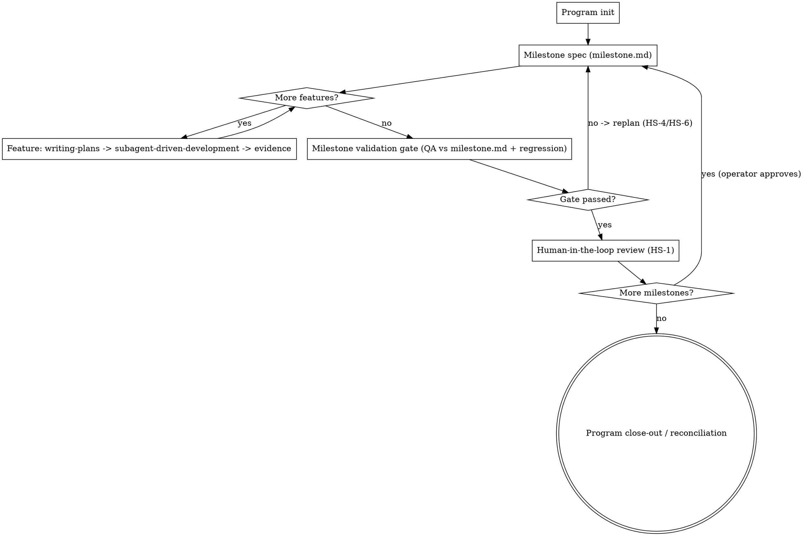

# Milestone Workflow

Run a big program as a chain of **Milestones**. Each milestone is a bounded slice of
the program that is **specced up front**, **executed feature by feature**, and then
**validated against its own up-front spec** before a human gate lets the next
milestone start. The point is evidence and control: nothing is "done" by assertion,
and the operator can stop, replan, or redirect at every boundary.

This skill **orchestrates** the existing planning/execution skills — it does not
replace them. Per-feature execution uses `superpowers:writing-plans` then
`superpowers:subagent-driven-development`. This skill owns the layer *above* those:
the milestone spec, the folder structure, the milestone QA gate, and the hard-stops.

**Canonical worked example:** `docs/superpowers/specs/2026-06-14-grade-a-architecture-remediation-design.md`
(the Grade-A remediation program — Milestones M0..M5, Features, per-milestone gates,
hard-stop catalog HS-1..6). Read it when you want a fully-worked instance of every
concept below.

## Core principles

- **Milestone = bounded slice with its own spec and its own gate.** Big enough to be
  a coherent deliverable, small enough to validate in one pass. Waves/phases/stages
  are milestones by another name.
- **Feature = the atomic unit of work inside a milestone.** Each feature gets its own
  folder, its own execution plan, and its own evidence row.
- **Spec the milestone up front — execution comes later.** Before touching the first
  feature, author `milestone.md`: what the milestone *is*, which features it contains,
  for each feature *what should be implemented* and *what should be validated*, and the
  milestone-level validation definition. **`milestone.md` contains no execution steps.**
  Execution (the how) is decided per-feature, during the feature, in the feature folder.
  This separation keeps the milestone spec a stable contract you validate against — it
  cannot quietly drift into "whatever we ended up doing."
- **Validate against the up-front spec.** The end-of-milestone QA checks that the
  milestone delivered exactly what `milestone.md` said it would, by the validation
  criteria `milestone.md` declared — plus regression against previously-completed
  milestones. If a milestone touches a quality bar (e.g. an architecture grade), the
  gate re-checks that bar and confirms root cause is fixed, not symptom-patched.
- **Human-in-the-loop at every boundary.** A milestone does not flow into the next one
  automatically. The operator reviews the milestone gate result and explicitly approves.
  Anything that must be replanned or has gone off-track is a hard-stop (see catalog).
- **Evidence, not adjectives.** `done` / `green` / `looks good` is never closure.
  Every feature and every milestone records commands run, runtime proof, review/QA
  disposition, and any bounded defers with written triggers.

## Folder convention

Scaffold one tree per program under `docs/superpowers/milestones/<program-slug>/`:

```
docs/superpowers/milestones/<program-slug>/
  README.md                       # program index: governing spec link, milestone list + status
  milestone-<n>-<slug>/
    milestone.md                  # the milestone SPEC (intent + features + per-feature
                                  #   implement/validate + milestone validation def + hard-stops).
                                  #   Authored BEFORE any feature. No execution detail.
    <feature-id>-<slug>/          # one folder per feature, e.g. f1.1-bare-405-sweep/
      plan.md                     #   feature execution plan (from writing-plans)
      evidence.md                 #   close-out evidence row (gates, runtime proof, review/QA, defers)
    qa/
      milestone-qa.md             # end-of-milestone full QA + verification result vs milestone.md
  milestone-<n+1>-<slug>/
    ...
```

Feature ids mirror the governing spec (e.g. `f1.1`, `f4.2`). Slugs are short kebab-case.
Templates for every file live in `templates/` next to this skill — copy and fill them in.

## Workflow



### Phase 1 — Program init
Do this once, when a program is first organized into milestones.
1. Identify the **governing spec** (the design doc that defines the program). If none
   exists, stop and create one first (`superpowers:brainstorming` → spec). The milestone
   tree is downstream of a spec, never a substitute for one.
2. Pick a `<program-slug>`; create `docs/superpowers/milestones/<program-slug>/`.
3. Copy `templates/program-README.md` → `README.md`; fill the milestone list (titles +
   one-line objectives + status `planned`) and link the governing spec.
4. Do **not** scaffold every milestone's internals up front — scaffold each milestone's
   folder when you reach it (Phase 2), so the spec reflects what you actually know then.

### Phase 2 — Milestone spec (before any feature)
For the milestone you are about to start:
1. Create `milestone-<n>-<slug>/`; copy `templates/milestone.md` into it.
2. Fill it in: milestone identity/objective; the feature list; for **each feature**,
   *what to implement* and *what to validate* (acceptance); the **milestone validation
   definition** (what the end-of-milestone QA will check, including any quality-bar /
   root-cause-fixed criteria); applicable hard-stops.
3. **Write no execution steps.** If you catch yourself describing *how* a feature will be
   built, that belongs in the feature's `plan.md` (Phase 3), not here.
4. This is a planning artifact — get operator agreement on `milestone.md` before
   executing features if the milestone is large or risky. (For the program as a whole,
   the operator already approved the governing spec.)

### Phase 3 — Feature execution (per feature, in order)
For each feature listed in `milestone.md`:
1. Create the feature folder `<feature-id>-<slug>/`.
2. `superpowers:writing-plans` → write `plan.md` (the feature's execution plan).
3. `superpowers:subagent-driven-development` → execute: fresh implementer subagent,
   then spec-compliance review, then code-quality review, fixing by root-cause family.
4. Record `evidence.md` (copy `templates/feature-evidence.md`): commands + results,
   runtime proof for every observable change, review/QA disposition, bounded defers
   with triggers. A feature is closed only when its evidence row is complete.
5. Respect mid-feature hard-stops (HS-2/HS-3/HS-6) the moment they trip.

### Phase 4 — Milestone validation gate
After every feature in the milestone is closed:
1. Copy `templates/milestone-qa.md` → `qa/milestone-qa.md`.
2. Run **full QA + verification against `milestone.md`**: confirm each feature delivered
   what the spec said and meets its declared validation criteria; run the canonical QA
   checklist for the milestone's workflow class; run **regression against all
   previously-completed milestones**.
3. If the milestone carried a quality bar (e.g. a grade, a closed defect class), re-check
   it here and confirm **root cause fixed, not symptom-patched**.
4. Record pass/fail per criterion with evidence. Any fail → HS-4 (replan the feature) or
   HS-6 (replan the milestone).

### Phase 5 — Human-in-the-loop gate + program close-out
1. Present the milestone gate result to the operator (HS-1). **Do not start the next
   milestone, and do not merge, without explicit approval.**
2. On approval, return to Phase 2 for the next milestone.
3. When the last milestone passes: write a **program close-out / reconciliation** in
   `README.md` — every planned feature has an evidence row, zero unplanned scope, every
   defer has a written trigger, and the program's terminal acceptance (e.g. an
   independent re-audit) has passed.

## Hard-stop catalog (generalize per program)

| ID | Trigger | Action |
|----|---------|--------|
| HS-1 | Every milestone boundary | Operator review gate; no next milestone and no merge without approval |
| HS-2 | A fix implies redesign outside the assigned boundary (shared API, cross-module auth model, storage/provider, workflow semantics) | Stop; report the boundary + minimum prerequisite plan; do not symptom-patch |
| HS-3 | A prerequisite boundary fails (build / runnable / auth-session / route / contract truth) | Repair the prerequisite (e.g. `runtime-contract-prereq`), rerun the failed checkpoint, then resume the feature |
| HS-4 | Milestone QA finds a symptom-patch or unmet validation criterion | Stop; replan the offending feature; re-run its close-out |
| HS-5 | Terminal program acceptance (e.g. re-audit) misses its bar | Bounded remediation micro-milestone, then re-run acceptance; operator decides continue vs replan |
| HS-6 | Scope drift / off-plan discovery mid-milestone | Stop; surface the deviation; replan before continuing |

The IDs are a template — a program may add its own (the Grade-A program uses exactly
this set). Always make the hard-stops explicit in each `milestone.md`.

## Templates

Copy these from `templates/` (next to this skill) and fill in:
- `program-README.md` — program index + milestone status table + close-out section
- `milestone.md` — the up-front milestone spec
- `feature-plan.md` — pointer/wrapper for the feature execution plan (writing-plans output)
- `feature-evidence.md` — the per-feature close-out evidence row
- `milestone-qa.md` — the end-of-milestone QA + verification record
