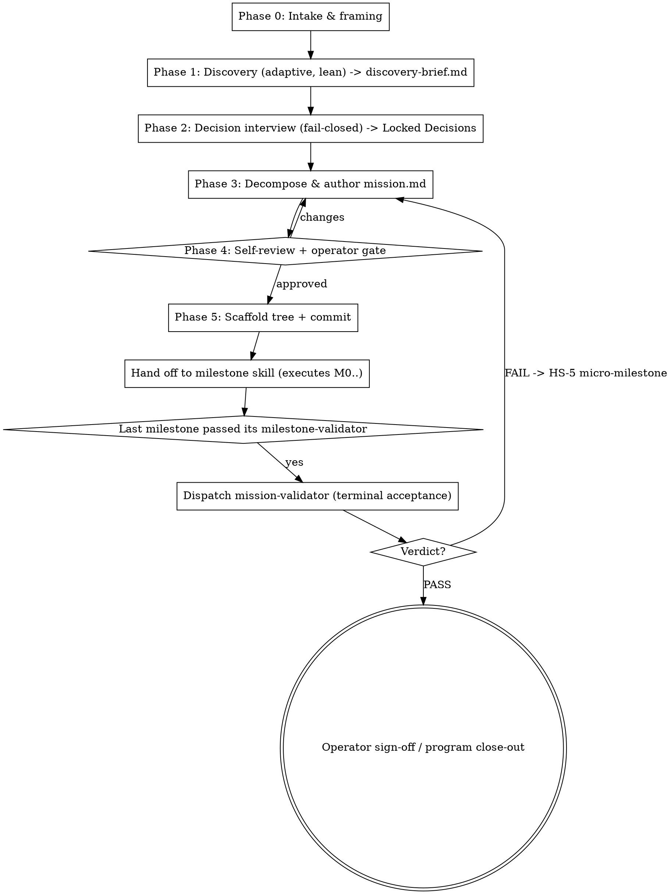

# Mission Workflow

Turn a raw intent into a **mission**: an evidence-backed governing spec (`mission.md`) whose own
definition-of-done is written **up front**, plus a scaffolded program tree, then hand off to the
`milestone` skill to execute. A mission decomposes into **milestones**; milestones into **features**.

This skill owns the layer *above* execution. The `milestone` skill's Phase 1 ("Program init") says:
*"identify the governing spec; if none exists, stop and create one first."* **This skill is that missing
front-end.** It researches, locks the strategy with the operator, decomposes, and produces precisely the
inputs `milestone` expects — then gets out of the way. It does **not** execute milestones.

**Canonical worked example of the output:** `docs/superpowers/milestones/grade-a-architecture-remediation/`
— a mission built by hand (governing spec + program README + M0–M5 + an independent re-audit as terminal
acceptance). `/mission` automates the construction of that front matter. Read it to see a finished mission.

**Governing design for this skill:** `docs/superpowers/specs/2026-06-15-mission-skill-design.md`.

## Core principles

- **Plan, then hand off.** A mission does research → decision-gate → `mission.md` → scaffold, then invokes
  `milestone`. It never runs a milestone itself. The seam is the guardrail: if the mission starts executing,
  it has overstepped. Each milestone still runs in its own fresh session with its own gates.
- **Evidence, not vibes.** Decomposition stands on a written, cited `discovery-brief.md`. Every claim in
  `mission.md` — every defect, every requirement, every milestone — traces back to a discovery finding.
  Decomposing on assumptions is the failure mode this skill exists to kill.
- **Definition-of-done, up front.** `mission.md` states what the end-state *shall be*, what to validate, and
  how — **before any milestone runs**. This is consumer-contract-first discipline lifted to program scale:
  you cannot judge "done" against a bar you write afterward.
- **Strategy is the operator's, and it is locked.** The load-bearing strategic choices (scope, sequencing,
  proof-of-done) are decided **with** the operator through a fail-closed interview and recorded as a
  **Locked Decisions** table. Never guess strategy to keep moving.
- **Separation of powers at the terminal gate.** The mission's terminal acceptance is judged by an
  independent `mission-validator` subagent that **judges and writes the verdict only** — never edits code,
  never flips status. A mission is never "done" by self-assertion.
- **Adapt to the kind of mission.** One skill, four playbooks — `remediation | greenfield-build |
  enhancement | migration`. The discovery shape, the spec emphasis, and the validation strategy adapt; the
  `mission.md` template is shared.
- **Token-efficient by construction.** Discovery is sized to the mission (a few agents, not a fleet).
  Per-feature and per-milestone machinery is **referenced** from `milestone`, never duplicated here.
- **Don't force the structure.** If the work is small enough that milestones are overkill, say so and
  recommend a single `writing-plans` plan instead. A mission is for programs that need more than one gate.

## Output layout (reuses the `milestone` tree — zero-friction seam)

Scaffold one tree per mission under `docs/superpowers/milestones/<mission-slug>/`:

```
docs/superpowers/milestones/<mission-slug>/
  mission.md            # ★ the governing spec + Terminal Acceptance (definition-of-done, up front)
  discovery-brief.md    # the cited evidence base every claim in mission.md traces to
  README.md             # program index (from milestone's templates/program-README.md)
  milestone-0-<slug>/   # the FIRST milestone, scaffolded; milestone skill executes from here
    milestone.md
  qa/
    mission-validation.md  # the mission-validator's terminal PASS/FAIL verdict (written at the very end)
```

`README.md`'s "Governing spec:" line points to `./mission.md`. The `milestone` skill operates on this tree
**unchanged** — `mission.md` *is* the governing spec it looks for.

## Workflow



### Phase 0 — Intake & framing (cheap; no fan-out)
1. Capture the mission statement — the intent in the operator's words.
2. **Classify the mission type:** `remediation | greenfield-build | enhancement | migration`. If it's
   ambiguous, ask **one** question. The type selects the Phase-1 discovery playbook.
3. **Load house context cheaply** so the plan respects the rules: `CLAUDE.md`, `wiki/README.md`,
   `wiki/references/current-agent-handoff.md`, the skill-routing table, and any relevant memories. A mission
   that violates house rules (skill routing, DB/FE/BE boundaries, hard-stops) is dead on arrival.
4. Pick a `<mission-slug>` (short kebab-case); verify it doesn't collide with an existing program tree.
5. Output a **one-screen framing**: intent · type · slug · success-in-one-sentence. No files yet.

### Phase 1 — Discovery (mandatory, adaptive depth, token-efficient)
Read `references/mission-discovery.md` for the per-type playbooks and the model/token policy.

1. Fan out a **small** set of parallel agents **sized to the mission** — default **3–6**, never a large
   fleet unless the mission is genuinely huge and the operator opts in. Model policy: **sonnet** for
   analysis/judgement, **haiku** for mechanical sweeps, **never fable** for workers, **≤15 concurrent**.
2. Run the playbook for the mission type (audit / requirements+prior-art / impact scan / site census).
3. Run **one cheap skeptic pass** over the findings so the evidence base isn't hallucinated. Scale rigor to
   risk; if you skip verification for a trivially-checkable finding, say so.
4. Write **`discovery-brief.md`** (template in `templates/discovery-brief.md`) — the cited evidence base.
   Include a **coverage statement**: what was *not* swept. No silent caps.

### Phase 2 — Decision interview (fail-closed)
1. Present **2–3 strategic approaches** with trade-offs and a clear recommendation (scope: full vs bounded;
   sequencing; what counts as proof-of-done).
2. Interview the operator **one question at a time** on the load-bearing choices. Record each answer in the
   **Locked Decisions (D1..Dn)** table of `mission.md`.
3. **Fail closed.** If scope, approach, or the terminal bar is ambiguous, interview — never guess.

### Phase 3 — Decompose & author `mission.md`
Read `references/mission-decomposition.md` for the decomposition heuristics and anti-patterns, and
`references/mission-terminal-acceptance.md` for how to write §8.

1. Decompose intent → **milestones → features**. Each milestone is a bounded slice **validatable in one
   pass**; each feature is the atomic unit with *what to implement* + *what to validate* (objective
   acceptance). Order dependencies first and **risk-isolating work last** (the grade-a mission put the
   systemic ports last "so it cannot regress the grade").
2. Author `mission.md` from `templates/mission.md`. You may draft genuinely-independent sections in parallel
   (milestone table / hard-stop catalog / terminal acceptance) and reconcile in the main session — only
   where it actually saves time.
3. **No execution detail in `mission.md`.** The milestones say *what* and *what-to-validate*, never *how*.
   The "how" lives downstream in each `milestone.md` and feature `spec.md`/`plan.md`. `mission.md` is a
   stable contract you validate against — it must not drift into "whatever we ended up doing".

### Phase 4 — Self-review + operator gate
1. Self-review `mission.md` with fresh eyes:
   - **Placeholders** — no TBD/TODO/empty sections.
   - **Consistency** — milestones, decisions, and terminal acceptance don't contradict each other.
   - **Scope** — each milestone is validatable in one pass; none is secretly two milestones.
   - **Ambiguity** — every acceptance criterion is objectively checkable.
   - **Traceability** — every milestone/feature maps to a discovery finding, and every discovery finding
     maps to a milestone **or** an explicit out-of-scope note. Orphans on either side are a defect.
2. Present `mission.md` to the operator for review. Iterate until approved. **This is a hard gate** — do not
   scaffold or hand off without approval.

### Phase 5 — Scaffold + hand off to `milestone`
1. Scaffold the tree: copy `milestone`'s `templates/program-README.md` → `README.md` and fill the milestone
   table; create `milestone-0-<slug>/milestone.md` for the **first** milestone (copy `milestone`'s
   `templates/milestone.md`). Do **not** scaffold every milestone's internals up front — `milestone` does
   that as it reaches each one.
2. **Commit** the mission artifacts (standing authorization, `CLAUDE.md §5.0`). **Never push.**
3. **Hand off:** invoke the `milestone` skill (its Phase 2 onward). It sees the governing spec = `mission.md`
   and runs M0. Tell the operator the handoff is happening and that the next operator gate is HS-1 at the M0
   boundary.

### Terminal acceptance (after the LAST milestone)
This is the one thing the mission adds beyond `milestone`'s machinery. After the last milestone passes its
own `milestone-validator` **and** the operator approves it (HS-1):
1. **Dispatch the `mission-validator` subagent** (`.claude/agents/mission-validator.md`). It reads
   `mission.md` §8 Terminal Acceptance, **executes the declared validation** (re-audit / E2E / acceptance
   suite — whatever the mission declared), and writes `qa/mission-validation.md` (PASS/FAIL + per-criterion
   evidence). Separation of powers: it judges only.
2. On **FAIL** → **HS-5**: open a bounded remediation micro-milestone for the missed criteria, run it through
   `milestone`, then re-dispatch the `mission-validator`. The operator decides continue vs replan at each loop.
3. On **PASS** → the main session presents it to the operator for the final sign-off and writes the program
   close-out / reconciliation in `README.md`.

## Hard-stop catalog (defaults; each mission generalizes them in `mission.md` §9)

| ID | Trigger | Action |
|----|---------|--------|
| HS-1 | Every milestone boundary (inherited from `milestone`) | Operator review gate; no next milestone and no merge without approval |
| HS-5 | The terminal `mission-validator` misses the §8 pass bar | Bounded remediation micro-milestone, then re-dispatch; operator decides continue vs replan |
| HS-6 | Scope drift surfaces during discovery or decomposition | Stop; surface the deviation; re-interview before authoring/continuing `mission.md` |
| HS-2 / HS-3 / HS-4 | During execution, inherited from `milestone` | As defined by the `milestone` skill |

Always make the in-force hard-stops explicit in `mission.md`.

## Templates & references

In `templates/` (copy and fill at runtime):
- `mission.md` — the governing spec + up-front Terminal Acceptance (the mission's definition-of-done)
- `discovery-brief.md` — the cited evidence base discovery produces

In `references/` (read when you reach the relevant phase):
- `mission-discovery.md` — the adaptive discovery playbooks (by type) + model/token policy
- `mission-decomposition.md` — intent → milestones → features heuristics + anti-patterns
- `mission-terminal-acceptance.md` — how to author §8 + the `mission-validator` charter

Reused from the `milestone` skill (referenced, not copied):
- `.claude/skills/milestone/templates/program-README.md` — the program index
- `.claude/skills/milestone/templates/milestone.md` — the first milestone's up-front spec

Agent: `.claude/agents/mission-validator.md` — the independent, program-scale terminal-acceptance judge.
