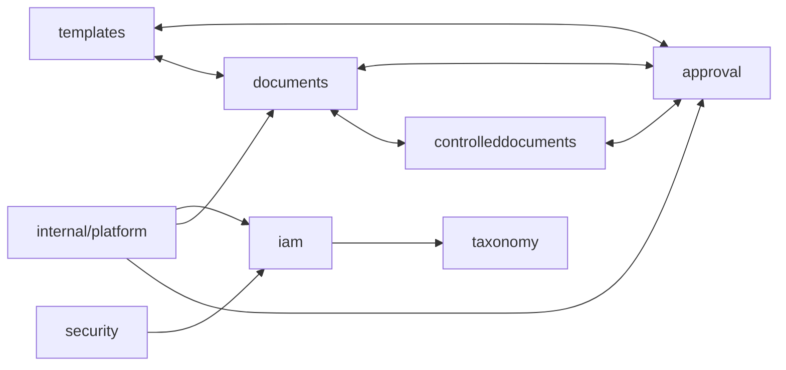
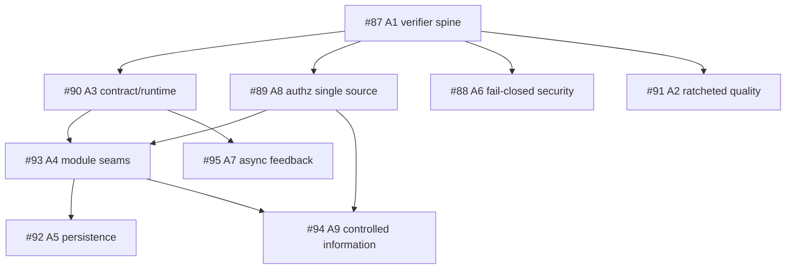

# MetalDocs Architecture — Current-State Evidence Map

**Date:** 2026-08-09
**Status:** initial evidence snapshot; descriptive, not a target-architecture decision.

## 1. Repository/runtime shape

MetalDocs currently operates as a mixed-language monorepo centered on a Go modular monolith. The documented runtime shape contains:

- `metaldocs-api` — synchronous data/control plane;
- `metaldocs-worker` — asynchronous outbox/worker plane;
- `metaldocs-jobs` — scheduled/River jobs plane;
- `apps/docx-renderer` — separate Node.js rendering service;
- Postgres, Redis and MinIO as state/supporting infrastructure.

The Go backend uses a single module (`module metaldocs`) with business code under `internal/modules/` and cross-cutting code under `internal/platform/`.

## 2. Declared business modules

The current topology documentation lists the following major business modules:

- `audit`
- `auth`
- `controlleddocuments`
- `documents`
- `iam`
- `jobs`
- `render`
- `search`
- `security`
- `taxonomy`
- `templates`
- `approval` (first-class after ADR 0082)

The existence of a directory/module in this list is evidence of current implementation topology only. It is not evidence that each entry is a correct bounded context.

## 3. Current coupling model — initial hotspot view

The already-sized August evidence supports the following hotspot model:



**Important:** this is a hotspot diagram, not the final mechanically enumerated graph. Issue #93 establishes 7 known module cycles and states that four of the seven run through the Controlled Information / Approval cluster. The workstation pass must replace this qualitative view with an exact directed graph and SCC list.

## 4. Coupling dimensions that must be kept separate

### 4.1 Go-import coupling (`G`)

The current boundary checker catches imports into forbidden implementation layers but permits cross-module imports into `domain`, `application`, `api`, and specific published packages. It does not reject reciprocal legal edges and therefore is not a cycle detector.

### 4.2 SQL/data coupling (`S`)

Issue #93 records 17+ foreign-table reads, including Approval reading Documents and Controlled Documents data directly. These dependencies bypass Go package boundaries and are invisible to import-only guards.

### 4.3 Error identity coupling (`E`)

Issue #93 records 62 `errors.Is` sites that depend on foreign domain sentinels across six modules. Sentinel identity therefore acts as an undeclared integration contract.

### 4.4 Foreign type / persistence leakage (`T`)

Nine of fifteen domain packages are reported to expose persistence concepts such as `*sql.Tx`, `sql.NullTime`, or platform DB types in signatures. These ports are not infrastructure-neutral even when package-layer rules are technically satisfied.

### 4.5 Platform inversion (`P`)

The target architecture requires `internal/platform` to remain domain-free. Issue #93 records at least 20 platform→module import edges across six platform packages, plus further edges outside `tenantdata`. This is a direct mismatch between target layering and current runtime structure.

### 4.6 Composition-only wiring (`W`)

Dependencies located exclusively in the API/worker/jobs composition roots are not automatically architectural coupling defects. The audit must avoid counting explicit adapter wiring as a domain dependency.

## 5. Controlled Information boundary

ADR 0093 and issue #94 supersede the assumption that `documents`, `templates`, and `controlleddocuments` are three peer bounded contexts.

Current implementation topology:

```text
documents
controlleddocuments
templates
approval
```

Target domain ruling already made:

```text
Controlled Information
├── ControlledDocument
├── DocumentRevision
├── NumberSeries
└── TemplateUsePolicy

Approval & Evidence
└── subject-generic approval lifecycle/evidence
```

The audit must map the current three-module implementation into this target ownership model without using current table/module separation as justification for preserving it.

## 6. Current architecture guard blind spots

### `scripts/check-module-boundaries.ps1`

Proves:

- a cross-module import does not target prohibited layers such as `repository`, `infrastructure`, `delivery`, `http`, or `jobs`, subject to the explicit published-package list.

Does not prove:

- the module graph is acyclic;
- the dependency is semantically owned by the consumer;
- a producer-declared interface is a healthy seam;
- foreign SQL/table access is absent;
- foreign error/sentinel identity is absent;
- platform is domain-free;
- a published `application` package is a minimal stable contract.

This is a concrete example of a valid mechanical guard scoped to only one property.

## 7. Existing root-cause programs

| Program | Root cause | Architecture-audit relation |
|---|---|---|
| #87 / A1 | verifier is not one trusted product | any new guard must become part of one reproducible verifier with bad fixtures |
| #91 / A2 | no ratcheted whole-repo quality baseline | architecture metrics should ratchet regressions, not force count-driven rewrites |
| #90 / A3 | API contract stops before runtime behaviour | error/type/validation drift belongs here, not in module-boundary cleanup |
| #93 / A4 | module seams expose implementations, not capabilities | primary owner of cross-module contracts, cycles, SQL ownership and platform inversions |
| #92 / A5 | persistence correctness maintained by visual agreement | owns transaction/query/scan/driver-mechanics problems that surface during seam cleanup |
| #88 / A6 | security properties are configuration-contingent | owns fail-closed runtime security preconditions, not generic module structure |
| #95 / A7 | async operations have no closed feedback loop | owns worker/jobs observability and trace/liveness closure |
| #89 / A8 | authorization grant model is dual-source | must precede migrations that depend on access semantics |
| #94 / A9 | Controlled Information implemented as three peer contexts | owns domain consolidation after access semantics settle |

## 8. Preliminary sequencing

The current issue program already implies a non-flat dependency structure:



This is a working dependency map based on issue bodies, not a new execution ruling. The final remediation plan must preserve explicit sequencing statements from the owning issues/ADRs.

## 9. Findings already supported strongly enough not to rediscover

### F-AUD-01 — Module cycles are a real architecture property missing from the current checker

**Evidence:** #93 records 7 known module cycles; `check-module-boundaries.ps1` checks target layer visibility but does not construct SCCs.

**Root-cause owner:** #93 / A4.

**Desired acceptance property:** the future verifier consumes the actual Go package graph, collapses packages to module identity, computes SCCs, and fails on any non-approved cross-module SCC. Prefer zero exception list; if a temporary transition exception exists, it must expire and identify the target program.

### F-AUD-02 — Import boundaries alone cannot enforce module ownership

**Evidence:** 17+ foreign-table reads in #93.

**Root-cause owner:** #93 / A4.

**Desired acceptance property:** a machine-readable table-ownership catalog plus SQL identifier scanning/parsing makes foreign table reads visible at verification time.

### F-AUD-03 — Error sentinels currently form undeclared integration APIs

**Evidence:** 62 cross-module foreign-sentinel checks in #93.

**Root-cause owner:** #93 / A4, coordinated with #90 / A3 for HTTP translation.

**Desired acceptance property:** consumer-owned stable result/error contracts at module seams; no module reaches into another bounded context's raw sentinel vocabulary.

### F-AUD-04 — Platform/domain direction is not consistently inward

**Evidence:** platform→module edges sized in #93; target REQ-TOP-2 forbids them.

**Root-cause owner:** #93 / A4.

**Desired acceptance property:** the Go dependency verifier rejects `internal/platform/** -> internal/modules/**` except composition roots, which should not live under platform.

### F-AUD-05 — Wiki maturity labels are stale relative to August evidence

The existing backend blueprint labels module architecture, authorization, error model and observability as industry-grade, while the August findings establish material open defects in each concern.

**Root-cause family:** wiki-memory drift.

**Disposition:** do not open a separate implementation program yet. Update maturity claims as part of the audit/wiki sync so documentation distinguishes target design, historical milestone completion, and current residual debt.

## 10. Workstation measurements still required

The next mechanical pass should produce checked-in or reproducible artifacts for:

1. exact module dependency adjacency matrix;
2. exact SCC/cycle membership;
3. per-edge package/file evidence;
4. table ownership catalog and foreign SQL consumers;
5. foreign sentinel/type imports and call sites;
6. platform→module edges;
7. consumer-owned vs producer-owned port inventory;
8. domain APIs leaking SQL/transaction types;
9. composition-root-only edges excluded from defect counts;
10. mapping of every material edge family to #87–#95.

These measurements may change counts. They may not use current topology as evidence that a target boundary is correct.

## 11. Issue creation policy

Do not create a new issue merely because a new call site is found. Create a new issue only when at least one of these is true:

- the finding has a distinct root cause not owned by #87–#95;
- the required target property conflicts with an existing program;
- the finding blocks sequencing but has no owner;
- the acceptance mechanism cannot fit the owning issue without changing its charter materially.

Otherwise, append evidence to the owning program during implementation planning rather than fragmenting the backlog.