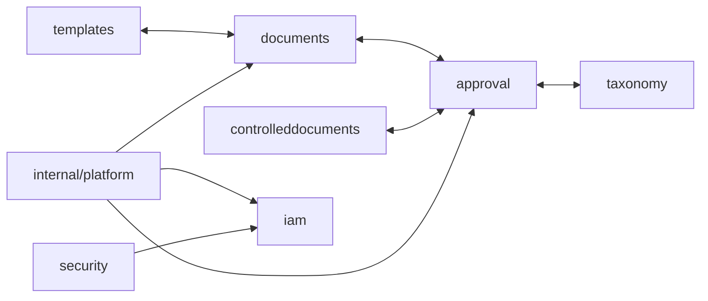
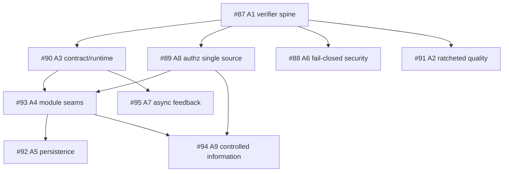

# MetalDocs Architecture — Current-State Evidence Map

**Date:** 2026-08-09  
**Baseline `main`:** `418070bf38a9f358f9131bcc36b7a6bcbc069273`  
**Status:** current-state evidence snapshot; descriptive, not a target-architecture decision.

## 0. Evidence provenance

This audit is pinned to `main` commit `418070bf38a9f358f9131bcc36b7a6bcbc069273`, which includes merged PR #99 (`only-new-issues` removed; golangci whole-tree burn-down).

Evidence classes:

- **runtime/repository direct:** current files and directory topology read from GitHub at the baseline SHA;
- **mechanically reproduced inventory:** checked-in `docs/superpowers/analysis/inventory/*` outputs whose commands include `go list`, grep, fan-in/fan-out and Tarjan SCC analysis;
- **issue/ADR finding:** prior measured evidence that remains useful but must be checked for staleness against the baseline before execution;
- **historical wiki artifact:** useful for evolution/history only when it conflicts with current runtime topology.

The current session cannot clone GitHub into its local terminal because that environment cannot resolve `github.com`; therefore no claim is labeled as a fresh local rerun unless it is already represented by checked-in mechanical evidence. Static source inspection and GitHub-index evidence remain available directly.

## 1. Repository/runtime shape

MetalDocs currently operates as a mixed-language monorepo centered on a Go modular monolith. The documented runtime shape contains:

- `metaldocs-api` — synchronous data/control plane;
- `metaldocs-worker` — asynchronous outbox/worker plane;
- `metaldocs-jobs` — scheduled/River jobs plane;
- `apps/docx-renderer` — separate Node.js rendering service;
- Postgres, Redis and MinIO as state/supporting infrastructure.

The Go backend uses a single module (`module metaldocs`) with business code under `internal/modules/`, technical platform code under `internal/platform/`, and composition-specific wiring also present under executable roots and `internal/composition/`.

## 2. Actual current module inventory

At the pinned baseline, `internal/modules/` contains **15** directories:

- `approval`
- `audit`
- `auth`
- `controlleddocuments`
- `distribution`
- `documents`
- `iam`
- `jobs`
- `notifications`
- `render`
- `search`
- `security`
- `taxonomy`
- `templates`
- `tokens`

Older topology documents that report 11/12 modules are stale on this fact. The existence of a current module directory is implementation evidence only; it does not prove that the directory is the correct long-term bounded context.

## 3. Current coupling model — hotspot view

The measured August evidence supports this qualitative hotspot view:



This diagram is intentionally not presented as the complete adjacency matrix. The checked-in mechanical layering inventory reports:

- 136 Go packages analyzed;
- zero multi-node package-level SCCs;
- seven reciprocal relationships after collapsing package paths to module identity *(reproduction adds: these sit inside **one module SCC of size 9**, §16)*;
- zero same-module `domain -> infrastructure/delivery` and `application -> delivery` import inversions;
- multiple cross-module producer-owned seams, foreign-table SQL reads, foreign sentinel contracts and platform→module edges.

## 4. Coupling dimensions that must be kept separate

### 4.1 Go-import coupling (`G`)

The current boundary checker catches imports into forbidden implementation layers but permits cross-module imports into selected published layers/packages. It does not reject reciprocal legal edges and therefore is not a module cycle detector.

### 4.2 SQL/data coupling (`S`)

The layering inventory reproduces 17+ cross-context table reads across Approval/Documents/ControlledDocuments *(historical figure — superseded by the full reproduction: **55 foreign reads + 12 foreign writes**, §16)*. These bypass Go package boundaries and are invisible to import-only guards.

### 4.3 Error identity coupling (`E`)

The layering inventory reports 62 `errors.Is` call sites depending on another module's raw domain sentinel across six modules *(historical figure — reproduction narrows this to **19 true cross-module sites**, §16)*. Sentinel identity therefore behaves as an undeclared integration contract.

### 4.4 Foreign type / persistence leakage (`T`)

Nine of fifteen domain packages import `database/sql` and/or `internal/platform/db` in port signatures. This does not mean SQL is executed in domain — the same inventory found no literal domain SQL — but persistence vocabulary leaks into the domain API surface.

### 4.5 Platform inversion (`P`)

The target architecture requires `internal/platform` to be domain-free. Reproduced-current state (§16): **4 platform packages carry 9 module-specific package edges — `authn`, `bootstrap`, `docgenv2`, `tripwire`** — separate from legitimate composition wiring (`tripwire` is the documented legitimate exception; `docgenv2` is the hidden S-edge). *Superseded historical note: the original measured inventory listed 5 packages including `worker`; `worker` is NOT among the reproduced violators — do not act on the 5-package list.*

### 4.6 Composition-only wiring (`W`)

Dependencies located exclusively in executable/composition roots are not automatically architectural coupling defects. Composition is expected to know implementations so that business modules do not have to.

## 5. Current positive exemplar: consumer-owned port

`documents/application` declares `DictionaryValueReader`, a Documents-owned capability requiring only `Lookup(...)`.

The API composition root implements an adapter backed by Tokens and translates `tokensdomain.ErrNotFound` into `(found=false)` at the boundary. Documents therefore imports no Tokens domain type/error.

This is the local exemplar for A4:

```text
Documents application (consumer-owned port)
            ^
            |
composition adapter
            |
Tokens producer
```

## 6. Current counter-exemplar: producer-owned seams

Current `approval/application/decision_service.go` directly imports:

- `controlleddocuments/domain`;
- `documents/application`;
- `documents/domain`;
- `iam/domain`.

`PinInvoker` currently carries `docapp.ApproverContext`, and other Approval seams consume producer-declared readers/types. The finding is not that any cross-module collaboration is forbidden; it is that the contract is shaped by producer internals rather than by the consumer's minimum capability.

## 7. Controlled Information boundary

ADR 0093 and issue #94 supersede the assumption that `documents`, `templates`, and `controlleddocuments` are three peer bounded contexts.

Current implementation topology:

```text
documents
controlleddocuments
templates
approval
```

Target domain ruling already made:

```text
Controlled Information
├── ControlledDocument
├── DocumentRevision
├── NumberSeries
└── TemplateUsePolicy

Approval & Evidence
└── subject-generic approval lifecycle/evidence
```

The audit maps the current implementation into this target without using current tables/directories as evidence for preserving the split.

## 8. Current architecture guard blind spots

### `scripts/check-module-boundaries.ps1`

Proves:

- a cross-module import does not target prohibited implementation layers subject to its configured published surface.

Does not prove:

- the collapsed module graph is acyclic;
- the dependency is semantically owned by the consumer;
- a producer-declared interface is a healthy seam;
- foreign SQL/table access is absent;
- foreign error/sentinel identity is absent;
- platform is domain-free;
- a published `application`/`domain` type is a minimal stable contract.

This is a valid guard for one property, not an architecture-completeness proof.

## 9. Transaction/persistence finding

`internal/platform/db.TxRunner` explicitly states that it owns begin/commit/rollback and exposes live `*sql.Tx` in the callback as a bounded concession required by current authz/catalogue behavior.

That concession does **not** justify spreading driver/persistence types into business-domain APIs. Current policy direction captured in the rulebook is:

- application/infrastructure transaction seams may use the shared transaction abstraction where atomicity requires it;
- new `domain` APIs do not gain `*sql.Tx`, `sql.Null*`, `sql.Row`, `sql.Result`, or platform DB types without an explicit ruling;
- A5 owns migration toward one transaction lifecycle mechanism and typed query machinery.

The persistence inventory also records 82 direct `BeginTx` sites across 25 files *(historical figure — reproduced-current is **84 sites / 26 files**, §16)* and 242 hand-maintained scan sites; both remain A5 evidence at this baseline.

## 10. Existing root-cause programs

| Program | Root cause | Architecture-audit relation |
|---|---|---|
| #87 / A1 | verifier is not one trusted product | architecture guards must join one reproducible verifier with negative fixtures |
| #91 / A2 | no ratcheted whole-repo quality baseline | architecture metrics should ratchet regressions, not trigger count-driven rewrites |
| #90 / A3 | API contract stops before runtime behaviour | owns error/validation/generated-contract runtime convergence |
| #93 / A4 | module seams expose implementations, not capabilities | primary owner of cross-module contracts, module cycles, SQL ownership and platform inversions |
| #92 / A5 | persistence correctness maintained by visual agreement | owns transaction/query/scan/driver mechanics |
| #88 / A6 | security properties are configuration-contingent | owns fail-closed runtime/deployment security preconditions |
| #95 / A7 | async operations have no closed feedback loop | owns worker/jobs observability and trace/liveness closure |
| #89 / A8 | authorization grant model is dual-source | must settle access semantics before migrations depending on them |
| #94 / A9 | Controlled Information implemented as three peer contexts | owns the ruled domain consolidation |

## 11. Staleness correction: A1/A2 evidence after PR #97/#99

The original issue bodies are findings at filing time, not immutable current-state facts.

At baseline `418070bf...`:

- workflow topology has already been collapsed substantially (current `.github/workflows/` contains `ci.yml`, `docx-renderer.yml`, `nightly.yml`, `release.yml`, `smoke.yml`, not the earlier 20-workflow layout);
- `tools/verify/` now exists as a significant Go verifier/registry with tests;
- PR #99 removed `only-new-issues` and reports a whole-tree golangci burn-down to zero for its configured scope.

Therefore those specific A1/A2 symptoms must not be re-implemented. The remaining work should be evaluated against #87/#91 **acceptance properties**, not the stale counts in their original bodies.

## 12. Preliminary sequencing



This is dependency guidance derived from owning issue/ADR constraints; it is not a mega-PR instruction.

> **Superseded (2026-08-09 post-review):** the canonical, corrected sequencing
> lives in `audit-2026-08-09/final-synthesis.md` §D/§I/§J. Material deltas vs
> the preliminary graph above: a docs-only governance reconciliation gate
> precedes everything; A5 is split (`A5-spine` after A1 does not wait for A4;
> only typed-query/sqlc adoption waits for the affected A4 seams); A7
> health/metrics starts after A1 while trace propagation waits for A3 +
> A5-spine. This preliminary graph is kept as filed for history.

## 13. Findings already supported strongly enough not to rediscover

### F-AUD-01 — Module cycles are an architecture property missing from the legacy checker

**Evidence:** mechanically reproduced module-pair analysis reports seven reciprocal relationships (inside one module SCC of size 9, §16) while package SCC count is zero.

**Owner:** #93 / A4.

**Acceptance property:** future verifier derives the Go package graph, collapses paths to module identity, and rejects prohibited reciprocal/SCC relationships mechanically.

### F-AUD-02 — Import boundaries alone cannot enforce data ownership

**Evidence:** **55 foreign reads + 12 foreign writes** (67 statements, full reproduction §16). *Superseded historical figure: "17+ foreign-table SQL reads" — read-only and undercounted ~4×; do not act on it.*

**Owner:** #93 / A4 — and #93/A4 only. ADR 0093 (#94/A9) absorbs **none** of these seams: **0 of the 67 foreign-SQL statements become intra-context** under the ruled consolidation; approval stays subject-generic permanently (§16). *(Corrected 2026-08-09: an earlier revision of this row claimed A9 would absorb seams that become intra-context — superseded; do not act on it.)*

**Acceptance property:** a single machine-readable table-ownership catalog plus SQL identifier analysis makes foreign-table coupling visible at verification time.

### F-AUD-03 — Raw foreign sentinels currently form undeclared integration APIs

**Evidence:** 62 `errors.Is` sites in the measured layering inventory, of which **19 are true cross-module** (§16).

**Owner:** #93 / A4, coordinated with #90 / A3 for HTTP translation.

**Acceptance property:** consumer-owned stable result/error contracts at module seams; producer raw sentinels are translated at adapters/boundaries.

### F-AUD-04 — Platform/domain direction is not consistently inward

**Evidence:** platform→module edges reproduced in the layering lane; target REQ-TOP-2 forbids them.

**Owner:** #93 / A4.

**Acceptance property:** platform remains generic/domain-free; module-specific wiring moves to explicit composition/module locations.

### F-AUD-05 — Wiki topology/maturity contains stale claims

Evidence includes old dependency artifacts that still describe nested `documents/approval` and deny the existence of top-level Approval, plus architecture docs carrying older module counts/maturity labels.

**Class:** wiki-memory drift.

**Disposition:** update as part of audit/module-doc sync; do not use stale wiki as target evidence.

## 14. Issue creation policy

Do not create a new root-cause issue merely because another call site is found. Create one only when:

- the finding has a distinct root cause not owned by #87-#95;
- the required target property conflicts with an existing program;
- the finding blocks sequencing but has no owner;
- or the acceptance mechanism materially exceeds the owning issue's charter.

Implementation sub-slices may be planned under the owning issue without pretending each symptom is a new architectural cause.

## 15. Companion rulebook

Engineering rules for module ownership, consumer-owned ports, data ownership, layering, platform/composition, transaction spine, API/errors and architecture verification live in:

`docs/superpowers/analysis/2026-08-09-metaldocs-architecture-engineering-rulebook.md`

## 16. Workstation reproduction addendum (2026-08-09 local session)

A full local reproduction pass (15 audit passes, fresh `go list`-derived graph, Tarjan SCC,
SQL/sentinel scans) was executed at the same baseline SHA in an isolated worktree. Canonical
detailed artifacts: `docs/superpowers/analysis/audit-2026-08-09/` (PASS 1–14 +
`final-synthesis.md`). Where this document and the reproduction disagree, the reproduction
wins. Material corrections to the numbers above:

| Claim above | Reproduced-current correction | Evidence |
|---|---|---|
| "7 known module cycles" (F-AUD-01) | 7 reciprocal pairs confirmed **plus one module SCC of size 9** {approval, auth, controlleddocuments, documents, iam, render, security, taxonomy, templates} — the property to break is the SCC, not just the pairs | PASS 2 |
| "17+ foreign-table SQL reads" (F-AUD-02) | **55 foreign reads + 12 foreign writes** (67 statements, 10 directed pairs); approval issues 10 raw `UPDATE documents`; iam deletes audit-owned `governance_events`. Historical count was read-only and undercounted ~4× | PASS 5 |
| "62 cross-module `errors.Is`" (F-AUD-03) | **19 true cross-module sites** — the 62 included same-module aliased imports; iam→auth alone is 10 of 19 | PASS 6-8 |
| "20 platform→module edges / 6 packages" (F-AUD-04) | **9 package edges across 4 platform packages** (authn, bootstrap, docgenv2, tripwire); docgenv2 additionally raw-SQLs templates-owned tables (S-edge invisible to import graph); tripwire is a documented legitimate exception | PASS 2 / PASS 9 |
| ADR 0093 absorption note (F-AUD-02 owner) | **0 of the 67 foreign-SQL statements become intra-context** under ADR 0093 — approval stays subject-generic forever; A9 does not absorb approval seams | PASS 5 |
| §12 sequencing | refined in `audit-2026-08-09/final-synthesis.md` §D (governance reconciliation gate first, A1 first executable phase with the write-scan as its first registered guard, A5 split into spine vs typed-query adoption) | synthesis §D/§I/§J |

New findings from the reproduction (all subsumed, zero new issues): `jobs` module is
composition-shaped orchestration mis-filed under `internal/modules` (→ #93); security module
raw-SQLs auth/audit-owned tables portlessly (→ #93); 8 periodic jobs exist, not 7 (→ #95);
ADR 0092 is referenced by issues/wiki but has no file under `wiki/decisions/` (→ F-AUD-05);
3 parallel tx abstractions, not 2 (→ #92). On `db.Tx` in domain ports: ADR 0044's sanction
is scoped to its domain-event args/enqueuer boundary only; non-event domain-port
`db.Tx`/`db.DB` usage is classified **current architecture, unresolved pending explicit
ruling** (no migration triggered by the audit), and raw `database/sql` in
`auth/domain/session_admin.go` stays confirmed debt (synthesis §B.6, PASS 6-8 §6.2).
`governance_events` stays audit-owned per ADR 0044; approval's INSERT and iam's DELETE are
foreign writes to be re-routed through audit-owned ports (PASS 5 §7).
