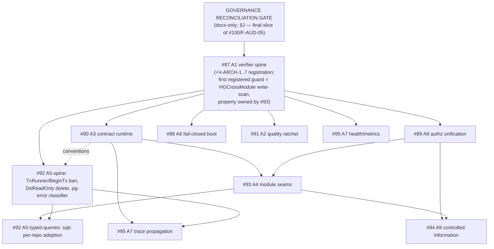

# MetalDocs Architecture Audit — Final Synthesis (PASS 15 + Layer B)

**Date:** 2026-08-09
**Baseline:** `main@418070bf38a9f358f9131bcc36b7a6bcbc069273` · Go 1.26.5 · clean worktree
**Status:** canonical synthesis over PASS 1–14 artifacts in this directory.
**Authority note:** every count below is `reproduced-current` unless marked `historical`. Where this file and a PASS file disagree, the PASS file's file:line evidence wins.

---

## A. Current architecture (as measured)

Modular monolith, 1 Go module, 158 first-party packages, 4 binaries
(`metaldocs-api`, `metaldocs-worker`, `metaldocs-jobs`, `docx-renderer`) +
`metaldocs-e2e-seed` test utility. 15 module directories, 37 platform
packages, 1 composition root (`tenantdata`), OpenAPI-first HTTP, transactional
outbox + River, pooled multi-tenant Postgres, Redis, MinIO.

Structural truth in one paragraph: **the package graph is clean and the module
graph is not.** Zero package-level SCCs, zero intra-module layer inversions,
no SQL in domain — but after collapsing packages to module identity, **9 of 15
modules form one strongly connected component** (approval, auth,
controlleddocuments, documents, iam, render, security, taxonomy, templates),
held together by 7 reciprocal pairs plus longer cycles. Below the import
graph, data ownership is broken more severely than any import metric shows:
**55 foreign-table read statements and 12 foreign-table writes** across 10
directed module pairs, the worst being approval issuing **10 raw
`UPDATE documents`** from application code. Contract ownership at seams is
mostly producer-shaped (foreign domain types, 19 true cross-module sentinel
checks, 2 confirmed producer-declared reader-interface inversions), with a
handful of healthy consumer-owned exemplars proving the target shape already
works in this repo. The platform layer is domain-free except 4 packages;
composition wiring is healthy. Below the HTTP contract, error emission,
validation, actor extraction, pagination and idempotency are parallel
hand dialects. Async planes (worker/jobs) have no health/metrics surface and
no trace propagation. Enforcement: 4 of 8 architecture properties have **no
firing guard at all**.

## B. Target architecture (already ruled; nothing new invented here)

Per the engineering rulebook (R-MOD/R-DATA/R-LAYER/R-PLAT/R-TX/R-API/R-ERR +
V-ARCH-1..7) and ratified ADRs:

1. **Module graph acyclic** at bounded-context level; collaboration through
   consumer-owned capability ports + composition-root adapters
   (exemplar: `documents/application.DictionaryValueReader` +
   `apps/api/cmd/metaldocs-api/dictionary_reader_adapter.go`).
2. **One owner per table**; cross-context data access only via ports, producer
   query services, deliberate projections, or events (R-DATA-1/2/3).
   Cross-context *writes* via provided writer ports — in-repo exemplar:
   `TemplateCompletionWriter` (approval-owned port, templates-implemented).
3. **Controlled Information = one context, two aggregates**
   (`ControlledDocument`, `DocumentRevision`, + `NumberSeries`,
   `TemplateUsePolicy`) per ADR 0093; Approval & Evidence stays separate and
   subject-generic (ADR 0082/0083) — **permanent** seam, not transitional.
4. **One authorization grant source** (`capability_bindings`, one query
   builder, generated catalogs) per #89's design spec.
5. **One problem writer, runtime-validated ingress, one fail-closed actor
   helper, generated types end-to-end** (#90).
6. **One transaction spine** (TxRunner-only lifecycle; sqlc-style typed
   queries adopted incrementally) (#92). **ADR 0044's `db.Tx` sanction is
   scoped to the domain-event args/enqueuer boundary it rules on — it is not
   a repo-wide ratification.** All other `db.Tx`/`db.DB` in domain ports is
   classified **current architecture / unresolved pending explicit ruling**
   (per R-LAYER-2: new domain ports must not introduce `db.Tx` without a
   ruling; application-owned ports carry only the transitional concession).
   Raw `database/sql` in `auth/domain/session_admin.go` remains **confirmed
   debt**. No migration is triggered by this audit.
7. **Contract taxonomy at module seams** (binding classification):
   - *synchronous capability ports* → **consumer-owned by default**
     (R-MOD-4; exemplar `DictionaryValueReader`);
   - *integration/domain-event schemas* → **producer-owned published
     contracts are legitimate** (ADR 0044);
   - *deliberately published DB views/projections* → **producer-owned read
     contracts are legitimate** (ADR 0039 family).
8. **Platform never imports modules** (REQ-TOP-2); composition may.
9. **Async planes observable and fail-closed** (#95, #88).
10. **Every architecture property enforced by a guard with a negative fixture
    inside one verifier product** (#87, V-ARCH-7).

## C. Gap matrix

| ID | Current (reproduced) | Root cause | Target property | Owner | Depends on | Mechanical acceptance |
|---|---|---|---|---|---|---|
| G-01 | 1 module SCC of size 9; 7 reciprocal pairs (PASS 2) | seams shaped by producer internals | acyclic module graph via consumer-owned ports | #93/A4 | A8 (vocab), A3 (contract patterns) | V-ARCH-1 SCC check in verifier, negative fixture |
| G-02 | 55 foreign reads + **12 foreign writes**; approval→documents 10× `UPDATE`; approval INSERT + iam DELETE on audit-owned `governance_events` (PASS 5) | no data-ownership enforcement; writer ports never generalized | R-DATA-1/2; `DocumentCompletionWriter` mirroring templates' pattern; `governance_events` access via audit-owned capability/tenant-data port (owner stays **audit** per ADR 0044) | #93/A4 | A1 minimum spine (the write-scan guard must land inside the trusted verifier) | V-ARCH-4: extend `HGCrossModule` to UPDATE/INSERT/DELETE (today it is **write-blind**) + ownership catalog as data — registered as the **first guard inside the A1 spine** |
| G-03 | 19 true cross-module `errors.Is` (historical 62 = ~3× overcount); iam→auth = 10 (PASS 6-8) | sentinel identity as undeclared contract | consumer-owned error vocabulary; adapter translation | #93/A4 + #90/A3 (HTTP) | — | V-ARCH-5 ratchet to zero |
| G-04 | producer-owned ports: security←4×`iamdomain.*Reader`; iam←`taxonomydomain.AreaCatalogReader` (ADR-0039-ratified); notifications' workers typed by producer job-arg structs (PASS 3b/3c) | interface placed on producer side | R-MOD-4 consumer-owned defaults | #93/A4 | — | port-ownership check in V-ARCH-5; ADR-0039 D3(b) re-ruled or adapter added |
| G-05 | 4 platform→module packages: bootstrap (composition mis-filed), authn/config.go (composition), docgenv2 (adapter **+ raw SQL into templates' tables** — S-edge invisible to import graph), tripwire (documented legitimate exception) (PASS 2/9) | composition code filed under platform | REQ-TOP-2 without package exemptions | #93/A4 | — | V-ARCH-3 with exemption list burned to ≤ tripwire |
| G-06 | `jobs` module = composition-shaped orchestration (no domain, fan-in 0, 7 janitor subpkgs over 4 producers) (PASS 3c) | folder ≠ context | move under composition/explicit orchestration home | #93/A4 (sub-finding, subsumed) | G-05 pattern | V-ARCH-1 node classification |
| G-07 | 12 `writeProblem` clones (none log the error), 227 `problem.New` vs 11 `NewFor`, some 500s produce zero server log (PASS 6-8/10) | parallel error dialects below contract | one RFC 9457 writer + trace-correlated logging | #90/A3 | A1 | cilint ban on local writers + inline decode |
| G-08 | `GetSwagger()` defined 16×, called 0× — runtime validation unreachable (PASS 10) | validation never wired at ingress | openapi3filter at composed ingress | #90/A3 | A1 | negative fixture: invalid request → 400 problem |
| G-09 | 17 fail-open `UserIDFromContext` sites; fail-closed twin exists; `ActorFromContext` 1 infra caller (PASS 10) | duplicate helpers, opposite semantics | one fail-closed actor helper | #90/A3 (IAM routes coordinate with #89) | — | cilint ban on fail-open helper |
| G-10 | dual grant sources pinned: tier-1 `capability_service.go:48-81` (iam_user_roles+groups) vs tier-2 `authz.go:144-156` (role_capabilities×user_process_areas, no groups) (PASS 3b) | unfinished ADR-0007 migration | one `capability_bindings` relation, one builder | #89/A8 | A1 spine | unrepresentable: FKs + generated catalogs |
| G-11 | 84 `BeginTx` sites/26 files; **3** parallel tx abstractions (auth, iam, taxonomy) risking lost GUC seeding; `DoReadOnly` dead-but-offered (PASS 6-8) | no single tx spine enforced | TxRunner sole lifecycle | #92/A5 | A1 | cilint ban `BeginTx` outside `platform/db`; delete `DoReadOnly` |
| G-12 | ~242 hand scans, ~14 twin pairs (3 byte-identical), 17 hand 23505 checks (4 in delivery), dead lib/pq fallbacks (PASS 6-8) | persistence by visual agreement | typed query derivation (sqlc spike), central pg error mapping | #92/A5 | pg-error classifier + lib/pq cleanup: A1 only; **sqlc/typed-query adoption per repository: the A4 seams touching that repository must settle first** | compile-time scan mismatch for adopted repos |
| G-13 | 3-way Controlled Information split; templates' `Placeholder` schema natively consumed by documents (~50 sites); byte-identical objectstore switch; twin status validators (PASS 3a) | decomposition by artifact kind | ADR 0093 single context, 2 aggregates | #94/A9 | A8, A4 | migration + parity suite; **note: 0 of the 67 foreign-SQL statements become intra-context** — A9 does *not* absorb approval seams |
| G-14 | worker/jobs: no HTTP listener, no healthcheck; bare `TraceID` string; 0 async spans; 0 alert rules; JSON metrics hardcode 0; **8 periodic jobs not 7** (render/fanout/retention uncatalogued); ADR-0068 watchdog has nothing to page (PASS 12) | API instrumented as the only observable centre | closed async feedback loop | #95/A7 | health after A1; traces after A3/A5 | runtime assertions + alert rules in repo |
| G-15 | security properties config-contingent (no boot assertion on role, KEK optional, no edge headers) — not re-measured this session, #88 body stands | preconditions never proven at boot | fail-closed boot | #88/A6 | A1 | superuser connection cannot reach ready |
| G-16 | guards: **no** firing check for module acyclicity, foreign sentinels, consumer-owned ports, error-writer uniqueness; HGCrossModule write-blind; gosec/govulncheck outside `ci.yml` required closure; domain-purity guard alias-bypassable (PASS 13) | checks accumulated outside one product | one verifier, negative fixtures. **Ownership rule: #87/A1 owns verifier trust/registry/reachability/negative-fixture capability — the *property* each guard proves stays with its issue** (error-writer + runtime validation → #90/A3; seam/sentinel/port/data-ownership → #93/A4) | #87/A1 | first | V-ARCH-7: every guard demonstrably fails on bad input |
| G-17 | frontend: ts-eslint/react-hooks registered-not-enabled; 29 dead files (undercounted as 13); 5 files >400 LOC; stale allowlist entries; 1 shared→feature inversion; 1 query-key violation (PASS 11) | rules never switched on | ratcheted baseline | #91/A2 | A1 | red build on regression only |
| G-18 | wiki drift, 10 material items: blueprint claims REQ-TOP-2 "MET"; governing target spec describes retired lease-reaper as live; REQ-TOP-1 contradicts ADR 0093; **ADR 0092 referenced but absent as a file**; module counts stale ×3; distribution undocumented (PASS 14) | hand-synced docs | wiki reconciled to code truth | audit program (F-AUD-05) | — | docs-only sync commits in this program |

## D. Dependency / order graph (technical, not preference)

Why these edges (technical, each): the governance reconciliation gate (§J)
comes before everything because PASS 14 proved the mandatory read-order feeds
executors contradictory instructions until it runs. A1 first among executable
axes because every other axis must land its guard inside the verifier or its
closure claim is untrustworthy (#87 charter) — this is also why the
HGCrossModule write-scan is the **first guard registered inside the A1
spine**, not a pre-A1 phase: a guard introduced before the trusted
verifier/negative-fixture spine exists is not a trustworthy closure mechanism.
A8 before A4/A9 because access semantics and document-visibility queries must
not be migrated twice (binding in #89). A3 before A4 because seam error
translation targets the canonical problem surface. **A5 is split:** the
transaction/persistence spine (TxRunner ownership, `BeginTx` ban, parallel-tx
abstraction migration, `DoReadOnly` deletion, central pg-error classifier +
dead lib/pq cleanup) depends only on A1 (with A3 informing conventions) and
must NOT wait for A4; only **typed-query/sqlc adoption** waits, per
repository, for the A4 seams touching that repository to settle — so codegen
never targets soon-to-move shapes. A4+A8 before A9 because the Controlled
Information merge rides on settled seam patterns and settled access
semantics. A7 trace work after A3/A5-spine so propagation conventions aren't
rebuilt.

## E. Remediation packages (single-cause units)

- **A1.1** verifier manifest profiles (fast/changed/pr/full/release), CI thin-wrapper; **A1.2** negative fixtures for all blocking guards; **A1.3** toolchain/digest pinning; **A1.4** reachability fixes (gosec/govulncheck into PR closure).
- **A4.0** HGCrossModule write-scan + ownership catalog as data — **executed as the first guard registered inside the A1 spine** (needs at minimum A1's registry + negative-fixture capability; property owned by #93, guard infrastructure by #87); **A4.1** V-ARCH-1 module SCC check (report-only→blocking ratchet); **A4.2** approval→documents writer port (`DocumentCompletionWriter`) + `governance_events` writes re-routed through an audit-owned capability port (approval INSERT) and audit's tenant-data port (iam DELETE) — audit stays owner per ADR 0044; **A4.3** sentinel translation (iam→auth pair first, 10 of 19 sites); **A4.4** producer-owned port inversions (security, iam/taxonomy); **A4.5** platform evictions (bootstrap→composition, authn/config split, docgenv2 port); **A4.6** jobs module re-homing; **A4.7** V-ARCH-5 ratchets.
- **A3.1** single problem writer + logging; **A3.2** openapi3filter ingress; **A3.3** actor helper unification; **A3.4** generated request types (11 anonymous structs); **A3.5** pagination/idempotency contract declaration in spec.
- **A8.1** `capability_bindings` schema+backfill; **A8.2** query builder; **A8.3** generated role catalogs + tripwire repoint; **A8.4** remove role-identity bypasses.
- **A5-spine** (after A1; A3 informs conventions — does NOT wait for A4): **A5.1** BeginTx ban + migrate 26 files to TxRunner (kills the 3 parallel abstractions, closes GUC-seed risk); **A5.2** delete `DoReadOnly`; **A5.3** pg error classifier (delete dead lib/pq). **A5-typed-queries** (per repository, after the A4 seams touching that repository settle): **A5.4** sqlc spike then per-repo adoption.
- **A9.1** aggregate boundary spec inside merged context; **A9.2** Placeholder schema ownership; **A9.3** twin validator/objectstore unification; **A9.4** module merge + table re-homing (which makes documents↔controlleddocuments/templates G/T edges intra-context; approval edges stay and use A4 ports).
- **A7.1** worker/jobs listeners + compose healthchecks; **A7.2** W3C context in outbox + consumer spans; **A7.3** context-aware slog handler; **A7.4** alert rules + retire JSON metrics surface; **A7.5** Dockerfile unification/pinning (+ catalog the 8th periodic job).
- **A6.1** boot role assertion; **A6.2** app role provisioning in compose; **A6.3** KEK required in regulated profiles; **A6.4** edge headers; **A6.5** re-auth timing path.
- **A2.1** frontend lint enable-one-at-a-time with baselines; **A2.2** dead-file deletion (29); **A2.3** knip/jscpd annotate→block-new.
- **F-AUD-05** wiki sync package (docs-only): fix the 10 drift items, restore/author ADR 0092 file from the authz design spec, module docs for distribution/security.

## F. Mechanical enforcement ladder (per preserved rule)

| Rule | Mechanism | Level |
|---|---|---|
| module acyclicity | V-ARCH-1 in tools/verify | build-time (verifier) |
| table ownership incl. writes | V-ARCH-4 (catalog-driven scan) | build-time |
| platform domain-freedom | V-ARCH-3, exemptions ≤ tripwire | build-time |
| foreign sentinel/type | V-ARCH-5 ratchet | build-time |
| domain persistence purity | V-ARCH-6 (close alias bypass) | build-time |
| one tx lifecycle | cilint `BeginTx` ban | lint-time |
| one problem writer | cilint local-writer ban | lint-time |
| contract constraints | openapi3filter | runtime assertion |
| authz single-source | FK schema + generated catalogs | unrepresentable |
| scan/column safety | sqlc generation | compile-time |
| async liveness/lag | health endpoints + alert rules | runtime + alert |
| boot security preconditions | pg_roles assertion, boot-fatal | runtime assertion |
| every guard proves failure | negative fixtures (V-ARCH-7) | test-time |

## G. Issue reconciliation (#87–#95) — open vs already-done at this baseline

| Issue | Still open (evidence) | Already done / stale in body | Body updates needed |
|---|---|---|---|
| #87/A1 | no single manifest; negative fixtures partial; gosec/govulncheck unreachable from PR; @latest pins | 20-workflow layout collapsed to 5; tools/verify exists (40 checks); golangci whole-tree + only-new-issues removed (PR #99) | strike workflow-topology + golangci evidence; keep acceptance |
| #91/A2 | frontend lint off; 29 dead files; tsconfig strict-only; clone debt | CSS token gate **green** (claim stale); Go lint burn-down done | update counts (dead files 13→29; drop CSS-red) |
| #90/A3 | writer dialects (12 clones/227 New); validation unreachable; 11 anon structs; 17 fail-open actor sites; pagination 5+ policies; 4 idempotency impls | frontend generated-client adoption strong (62 consumer files, 1 legacy call site) — frontend scope shrinks | correct frontend claim; pagination 4→5+; ActorFromContext 0→1 caller |
| #93/A4 | SCC-9 (worse than "7 cycles"); 55+12 foreign SQL (worse than "17+", writes previously invisible); producer ports confirmed; approval hotspot grew (9.3k LOC, 4.3k delivery) | platform→module edges 20→9 (4 pkgs); foreign sentinels 62→19 true | re-scope: cycles→SCC framing; SQL→writes-first; sentinels→19 with iam→auth dominant |
| #92/A5 | 84 BeginTx/26 files; 3 parallel tx abstractions (not 2); twins; 242 scans; DoReadOnly deletion | lib/pq checks = dead code not live bug; N+1 in release_coordinator is deliberate ADR-0085 lock ordering — **drop from scope** | +1 tx abstraction; strike N+1 item; reframe lib/pq as cleanup |
| #88/A6 | body stands (not re-measured this session — no counter-evidence found) | — | none |
| #95/A7 | every claim reproduced exactly | — | add: 8th periodic job (render/fanout/retention); watchdog has no pager |
| #89/A8 | dual sources pinned to exact files; 4 modules still zero tier-2 | — | note: **ADR 0092 file does not exist in wiki/decisions/** — restore from design spec (docs-only) |
| #94/A9 | strongest evidence yet (approval writes documents; shared Placeholder schema) | — | add nuance: 0 foreign-SQL statements become intra-context; approval seam permanent |

**Nenhuma issue é fechável hoje.** Todas mantêm root cause aberto; apenas os corpos precisam de correção de evidência.

## H. New issues

**Zero.** Every new finding is subsumed: jobs-as-composition, security's
portless foreign SQL, docgenv2's hidden S-edge, writer-blind guard → #93/A4;
8th periodic job + unpageable watchdog → #95/A7; parallel tx abstraction #3 +
dead tables → #92/A5; ADR 0092 missing file + all wiki drift → F-AUD-05
(this program, docs-only). No finding met the issue-creation bar (novel root
cause not owned by #87–#95).

## I. Final execution roadmap (prepared, NOT executed)

| Phase | Issue | Exact scope | Prereqs | Acceptance | Rollback/risk |
|---|---|---|---|---|---|
| G | #100/F-AUD-05 | **Governance reconciliation gate (§J)** — docs/governance only | audit accepted by operator | §J checklist complete; zero runtime code touched | docs-only; revert = git revert |
| 1 | #87 | A1.1–A1.4 verifier product; **first registered guard = A4.0 write-scan** (property owner #93) once the minimum registry + negative-fixture spine exists | Phase G | CI runs manifest only; every blocking guard has failing fixture; write-scan fixture red on synthetic `UPDATE documents` from approval | wrappers keep old jobs until parity proven; write-scan report-only first |
| 2a | #90 | A3.1–A3.5 | Phase 1 | cilint bans firing; invalid-request fixture red | per-route rollout, problem-writer adapter keeps old shape |
| 2b | #89 | A8.1–A8.4 | Phase 1 | dual-source unrepresentable; tripwire parity suite green | backfill reversible until old relations dropped |
| 2c | #88 | A6.1–A6.5 | Phase 1 | superuser conn cannot reach ready | gated by env profile; dev compose keeps working |
| 2d | #91 | A2.1–A2.3 | Phase 1 | red build on *new* regressions only | baselines expire on dates, not silently |
| 2e | #95 (part) | A7.1 health/metrics | Phase 1 | worker/jobs /healthz+/metrics live; compose healthchecks | additive endpoints, no behavior change |
| 2f | #92 (spine) | A5.1–A5.3 transaction/persistence spine | Phase 1 (A3 informs conventions; does NOT wait for A4) | BeginTx ban green; parallel tx abstractions gone; DoReadOnly deleted; central pg-error classifier adopted | mechanical migration file-by-file; each step compiles |
| 3 | #93 | A4.1–A4.7 | 2a+2b | SCC count monotonically ↓ under ratchet; foreign writes = 0 (incl. `governance_events` via audit-owned ports) | seam-by-seam, adapters keep old callers compiling |
| 4a | #92 (typed queries) | A5.4 sqlc spike + per-repo adoption | 2f + the A4 seams touching each target repository settled (Phase 3, per-repo not global) | adopted repos compile-checked | per-repo adoption, never flag-day |
| 4b | #95 (rest) | A7.2–A7.5 | 2a, 2f | trace continuity across outbox proven in test | metadata additive |
| 5 | #94 | A9.1–A9.4 | 2b, 3 | ADR 0093 target shape; parity suite; approval seams via ports | phased by aggregate; migration size is execution detail, never target evidence |

## J. Pre-implementation governance reconciliation gate (Phase G — binding)

Runs **after this mapping is accepted by the operator and before any runtime
remediation begins**. Docs/governance only — zero product/runtime code. It is
the final slice of #100 / F-AUD-05. Rationale: PASS 14 proves the mandatory
executor read-order (target spec, blueprint, module docs, ADRs, issue bodies)
currently contains contradictions that would feed structural implementation
wrong instructions.

Checklist (all items must complete before Phase 1 starts):

1. **Fix the dangerous wiki drift from PASS 14**: governing target spec's
   retired-runtime claims (lease-reaper described as live), blueprint's false
   "REQ-TOP-2 MET + CI-locked" claim, stale module counts/indexes (15 modules
   everywhere), missing module docs entries (distribution; topology table
   gaps), REQ-TOP-1 vs ADR 0093 contradiction resolved by cross-reference.
2. **Reconcile issue bodies #87–#95** to the reproduced-current evidence
   (§G's per-issue "body updates needed" column) — preserving each issue's
   root cause and history; corrections are appended/annotated, not rewritten
   as if the original filing never existed.
3. **Restore/materialize ADR 0092** as a decision artifact from the
   already-approved authz design/ruling (`2026-08-06` authz-grant-unification
   docs) — recorded, not re-litigated; the decision is not reopened.
4. **Add missing status-history/cross-links**: ADR 0007 → the dual-source
   finding and its successor ruling; ADR 0039 D3(b) noted as pending re-rule
   or adapter (G-04).
5. **Historical artifacts stay historical**: prior analysis/inventory docs
   get superseded-by banners where needed (as already done for the
   reproduced-inventory doc); they are never rewritten in place.

Exit criterion: an executor following the repo's mandatory read-order
encounters zero known-contradictory instructions about current runtime truth,
ownership, or issue evidence.
