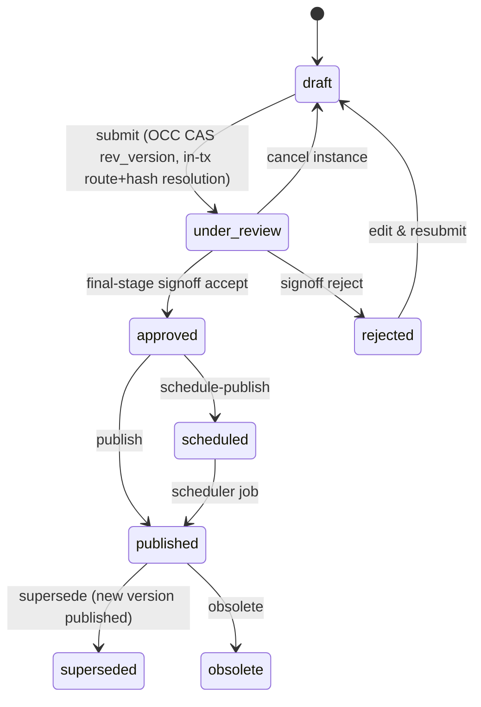
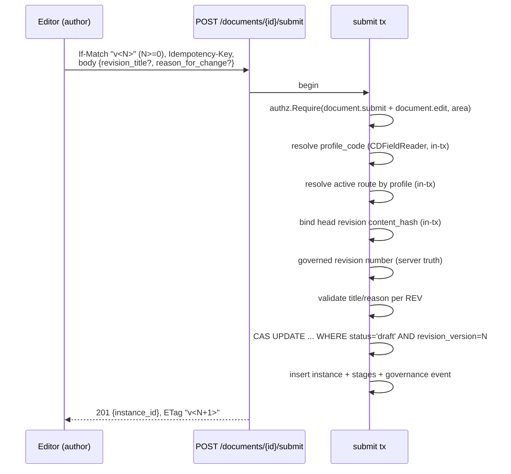

# Lifecycle & UX Coherence — Governing Spec

> **Status:** Draft for operator ratification — 2026-07-06
> **Program:** `docs/superpowers/milestones/lifecycle-ux-coherence/`
> **Origin:** Live E2E QA (post-GMR terminal acceptance) found the document submit
> journey broken end-to-end and a class of surface-duplication / journey-gap defects
> across documents and templates. Three read-only investigations (templates lifecycle,
> document surfaces + navigation graph, backend contract consistency) produced the
> evidence base; every claim below carries a file:line anchor.
> **Related:** ADR 0073 (remove `/finalize`; canonical `/submit` in-tx resolution),
> ADR 0022 (capabilities), ADR 0072 (`documents/approval` nested exception).

---

## 1. Reference model — how a professional system of this class works

Evidence base: operating patterns of validated eQMS/DMS platforms (Veeva Vault
QualityDocs, MasterControl, Qualio, SharePoint/Confluence approvals), NN/g usability
heuristics, and regulated-industry constraints (ISO 9001 document control,
21 CFR Part 11 electronic signatures). Five principles, each independently attested:

| # | Principle | Evidence / why it works |
|---|---|---|
| R1 | **The author submits from the authoring context.** Submit lives on the editor/detail screen where the draft is finished — never on an approval screen. | Veeva/Qualio/Confluence all trigger "send for approval" from the document view. NN/g: minimize interaction cost — the trigger sits where intent forms. MetalDocs already does this for templates (`TemplateEditorPage.tsx:149`). |
| R2 | **The approval workflow is governance configuration, not an author choice.** Routing (who approves, in what order) is bound to the document *type/profile* by an administrator; the author only fires the trigger. | Veeva "lifecycle bound to document type"; MasterControl route templates; ISO 9001 §7.5 controlled-document approval must be defined, not ad-hoc. Security corollary: the author never needs admin-tier read capability (route listing) — the server resolves the route. UX and AuthZ point at the same design = global-maximum signal. |
| R3 | **The approver has one worklist.** Every artifact awaiting the actor's decision appears in a single inbox; the decision screen is the approver's, with sign/reject/timeline — not a second submit surface. | Universal worklist pattern (Vault "My Tasks", ServiceNow, Jira). Split worklists (documents in inbox, templates only via memorized URL) measurably lose tasks. |
| R4 | **Events deep-link to the action.** "Your document was approved" must land the author on the screen where the next step (publish) is available. Status without a path to action violates NN/g #1 (visibility of system status). | All reference platforms make approval notifications clickable into the artifact. |
| R5 | **One implementation, N entry points.** A lifecycle transition has exactly one client implementation (one API fn, one dialog/component); screens differ only in where the trigger renders. | Internal proof both ways: `SupersedePublishDialog` (1 component, mounted from detail + cockpit, zero defects) vs. submit (2 independent implementations → 4 defects). |

### 1.1 Canonical surface-ownership model

```mermaid
flowchart LR
  subgraph Author
    LIB[Library /documents] --> DET[Detail /documents/:id]
    DET --> EDT[Editor /documents/:id/edit]
    EDT -- "Submit (R1)\nshared dialog" --> DET
    DET -- "Ver aprovação (when instance)" --> CKP
    DET -- "Publish/Schedule\nSupersedePublishDialog" --> DET
  end
  subgraph Approver
    INB[Inbox /approvals\n(docs + templates, R3)] --> CKP[Cockpit /approvals/:id]
    CKP -- "sign / reject / cancel\ntimeline" --> CKP
    CKP -- "breadcrumb → document" --> DET
  end
  subgraph System
    NTF[Notification\napproved/rejected] -- "deep link (R4)" --> DET
  end
```

Ownership rule: **editor/detail = author's screens (submit, publish); cockpit = approver's
screen (decide); inbox = discovery**. The cockpit never submits; the editor never signs.

### 1.2 Canonical document state machine (already implemented backend-side)



Single 9-status transition function (GMR M4 versioning kernel) — the state machine is
sound; the defects are all in the *surfaces and contracts around it*.

### 1.3 Canonical submit sequence (target, ADR 0073)



Everything the wrapper resolved off-tx (TOCTOU) moves inside the transaction. Client
optionally overrides `route_id`/`content_hash` (additive, integrations only).

### 1.4 Template lifecycle (reference conformance already high)

Templates already satisfy R1 (submit from editor) and R2 (reviewer/approver roles
resolved server-side from `approval_config` — `lifecycle.go:50-56`). Violations:
R3 (absent from inbox), R5 (second submit trigger on `TemplateApprovalRoute.tsx:77-79`).

---

## 2. Current implementation map (evidence-consolidated)

### 2.1 Backend endpoints — documents approval module

| Endpoint | If-Match domain | Returns ETag | Idempotency | Capability (in-tx) |
|---|---|---|---|---|
| POST /documents/{id}/submit | revision_version (v0 = fresh draft) | yes "v(N+1)" | platform middleware | document.submit + document.edit @area |
| POST .../signoff (×2 variants) | revision_version | **no** | bespoke store | document.signoff @area |
| POST /documents/{id}/publish, /schedule-publish | revision_version | **no** | middleware | document.publish + edit @area |
| POST /documents/{id}/cancel (×2) | revision_version | **no** | middleware | document.edit @area |
| POST /documents/{id}/obsolete, /supersede | revision_version | **no** | middleware | document.obsolete / supersede + edit @area |
| POST /documents/{id}/mark-reviewed | revision_version | yes | **NONE** | document.review @tenant |
| GET instance (×2) | — | yes | — | document.view @tenant |
| PUT /approval-routes/{id} (+deactivate) | **approval_routes.version** (different domain) | no (body NewVersion) | bespoke store | route.manage @tenant |
| POST /documents/{id}/finalize | revision_version, rejects v0 | no | bespoke copy | (wrapper) — **removal in flight (ADR 0073)** |

### 2.2 Backend endpoints — templates module

| Endpoint | CAS | Idempotency | Capability |
|---|---|---|---|
| POST /templates | — | middleware | template.create |
| POST .../versions | server-generated numbers | none (spec-consistent) | template.edit |
| PUT .../schema | body `expected_lock_version` (0 valid for fresh) | none | template.edit |
| POST .../submit /review /approve | status-machine + internal row CAS | middleware | template.submit/review/approve |
| POST .../publish | — | middleware | template.publish — **no FE caller** |
| POST /templates/{id}/archive | — | **NONE** | template.archive — **no FE caller** |
| PUT .../approval-config | — | **NONE** | template.edit (+manage elevation) |

No If-Match anywhere in templates — different (valid) consistency model; no v0-class bug possible.

### 2.3 Frontend surfaces × transitions

| Transition | Surfaces today | R5 conformance |
|---|---|---|
| Document submit | Editor dialog (`documents.ts:44` manual headers) **and** cockpit route-picker (`approvalApi.ts:63` via mutationClient) | ✗ two implementations |
| Publish/schedule/supersede | `SupersedePublishDialog` from detail + cockpit | ✓ model case |
| Cancel instance | cockpit only (`CancelInstanceDialog`) | ✓ |
| Create revision | detail only | ✓ |
| Obsolete / archive | **no UI** (dead client fns `approvalApi.ts:117`, `documents.ts:52`) | dead code |
| Template submit | template editor **and** `TemplateApprovalRoute:79` | ✗ two triggers |
| Template review/approve | `TemplateApprovalRoute` | ✓ |

### 2.4 Navigation & feedback graph — holes

- Cockpit → document detail: **no link** (breadcrumb only → inbox) — dead end.
- Detail → cockpit: **no link** even when instance exists.
- Editor post-submit: returns via `onDone()`, no path to tracking.
- Notification rows: `resource_type`/`resource_id` on the wire, **never read** by production components (`NotificationRow.tsx`) — not clickable.
- Detail "Abrir Fanout" CTA: `navigate('/distribution')` → route doesn't exist → wildcard → dashboard (`DocumentDetailRoute.tsx:270`). Working relative tab exists in parallel.
- Inbox: documents only; templates invisible (no backend inbox source).
- Library "···" button: stub (stopPropagation only). ActivityPanel: mounted, permanently disabled placeholder.

---

## 3. Gap register (23 findings → disposition)

P0 (journey-blocking): 1–6 → **M1/M2**. P1 (duplication/journey): 7–15 → **M2/M3/M4**.
P2 (hygiene): 16–17 → M1 (3-line fix); 18–19, 21–23 → **deferred with triggers** (below).

| # | Finding | Fix milestone |
|---|---|---|
| 1 | /submit requires route_id+content_hash author cannot supply; no in-tx resolution (`contracts/submit.go:34`; repo lacks `LoadActiveRouteByProfile`; head-hash read only in off-tx `GetFinalizePrereqs` `repository.go:1801-1828`) | M1 |
| 2 | `contracts/submit.go` lacks `revision_title` → REV≥1 unfixable | M1 |
| 3 | `ErrRevisionTitleRequired` unmapped in approval `errors.go` → 500 | M1 |
| 4 | finalize chain still alive in Go (spec already removed) | M1 |
| 5 | `TestParseIfMatch/zero_version_rejected` pins the v0 bug as spec (currently failing) | M1 |
| 6 | Editor dialog doesn't collect reason_for_change for REV≥1 | M2 |
| 7 | Cockpit inherited submit + route.manage-gated route-picker + seeded '"v0"' | M2 |
| 8 | Two FE submit implementations (documents.ts manual vs approvalApi/mutationClient) | M2 |
| 9 | Cockpit → detail: no link | M3 |
| 10 | Detail → cockpit: no link when instance exists | M3 |
| 11 | Notifications not clickable (resource_id ignored) | M3 |
| 12 | "Abrir Fanout" → nonexistent route → dashboard | M3 |
| 13 | Editor submit: no isSubmitting guard; stale "finalizar" toast; success toast styled error | M2 |
| 14 | TemplateApprovalRoute duplicate submit trigger | M2 |
| 15 | Templates absent from approval inbox | M4 |
| 16 | mark-reviewed: zero idempotency | M1 |
| 17 | templates archive + approval-config: not in idempotentRoutes | M1 |
| 18 | 7 mutation endpoints return no ETag | defer — trigger: external API consumer chaining mutations |
| 19 | route-admin ETag domain switch, version only in body | defer — same trigger |
| 20 | Dead FE: obsolete(), archiveDocument(), ActivityPanel, "···" stub | M3 (delete) |
| 21 | template /publish + /archive endpoints: no FE caller | defer — trigger: archive/direct-publish product decision (endpoints stay, contract valid) |
| 22 | 3 bespoke idempotency stores (signoff ×2, route-admin) outside middleware | defer — working + tested; trigger: next signoff contract change |
| 23 | Templates submit/review/approve: no contract-level OCC | defer — internal row CAS suffices; trigger: concurrent-editor complaints |

## 4. YAGNI refusals (named, binding)

- No new "submission tracking" screen — detail + cockpit + clickable notification cover it.
- No ETag uniformity sweep now (#18/#19).
- No speculative obsolete/archive UI — delete dead FE fns, keep backend contract.
- No template OCC addition (#23).
- No idempotency-store consolidation refactor (#22).

## 5. Milestones

| M | Slug | Objective (outcome) | Findings |
|---|---|---|---|
| M1 | canonical-submit-backend | An author's fresh-draft AND REV≥1 submit succeeds against /submit with zero client-supplied governance data; finalize chain deleted; idempotency map complete | 1,2,3,4,5,16,17 |
| M2 | fe-surface-ownership | Exactly one submit implementation per artifact kind, rendered only on author surfaces; cockpit is approver-only | 6,7,8,13,14 |
| M3 | journey-closure | Every lifecycle event/screen links to the next action; zero dead FE affordances | 9,10,11,12,20 |
| M4 | template-inbox | A template review appears in the approver's single worklist (contract-first) | 15 |

Dirty-tree note: OpenAPI edit + regen + ADR 0073 + partial agent edits (parseIfMatch,
editor→/submit) already on disk — M1/M2 absorb and finish them; nothing is reverted.
