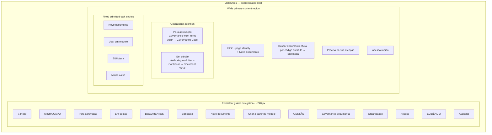
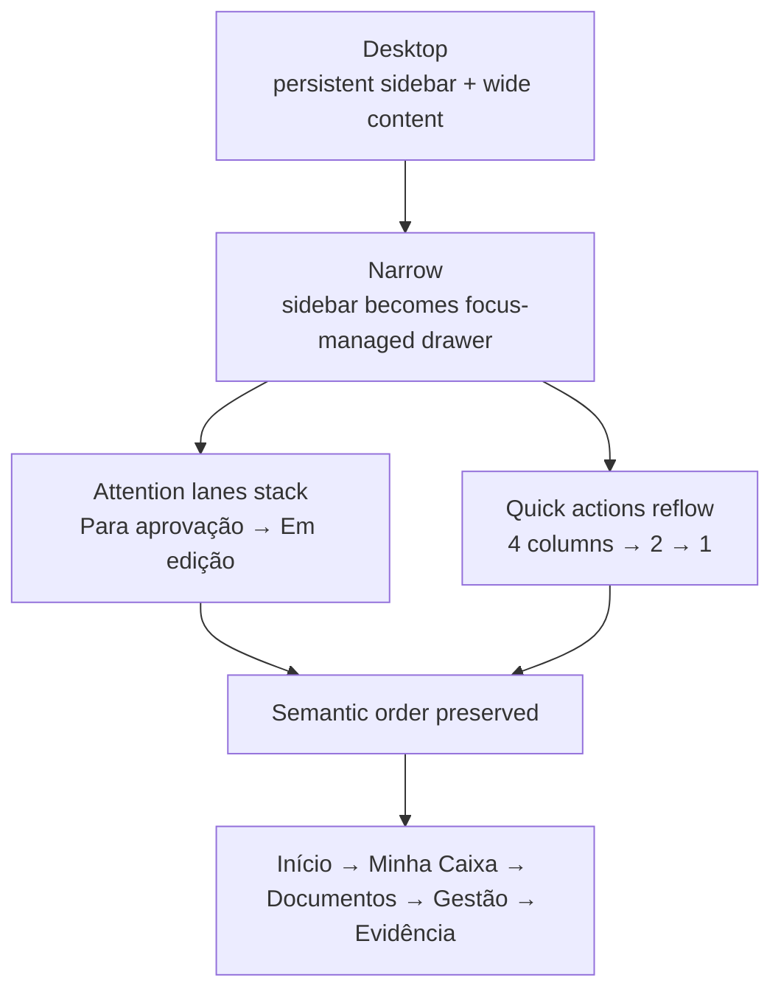

# T11 — B01 rendered structural wireframe

> **Status:** LOCKED / OPERATOR-RATIFIED on 2026-08-22.  
> **Block:** B01 — App Shell + Global Information Architecture.  
> **Selected direction:** Home A — Central operacional.

This file is the repository-safe rendered structural record of the B01 candidate the operator visually reviewed and approved. It preserves the locked information architecture, first-fold hierarchy, navigation grouping and responsive transformation without becoming production frontend code or final visual design.

## Desktop structural frame



## Locked reading order

```text
1. global shell / current session
2. Início identity + primary create entry
3. official-document search entry
4. Precisa da sua atenção
   4a. Para aprovação
   4b. Em edição
5. fixed quick actions
```

`Início` is the default presentation of the accepted `/work` lens. It does not create `/home`.

```text
listGovernanceWork → Para aprovação
listAuthoringWork  → Em edição
```

The Home search is only an entry into admitted Library discovery:

```text
q entered on Home
→ /documents?q=<q>
→ listDocuments(q)
```

## Navigation meaning

```text
INÍCIO
  current actor attention + continuation

MINHA CAIXA
  Para aprovação
  Em edição

DOCUMENTOS
  Biblioteca
  Novo documento
  Criar a partir de modelo

GESTÃO
  Governança documental
  Organização
  Acesso

EVIDÊNCIA
  Auditoria
```

These are human-facing IA/grouping decisions. They do not create semantic owners called Home, Inbox, Approval, Templates, Management or Evidence.

## Responsive transformation



Material destinations remain keyboard reachable. No primary action depends on hover-only disclosure. Drawer close returns focus plausibly to its opener; grouping is structural/labelled rather than color-only.

## Deliberate absences

The locked B01 baseline does **not** introduce:

```text
home KPI cards / totals
favorites
recently accessed documents
personalized persisted shortcuts
configurable dashboard widgets
standalone Template browse page
global body/full-text/vector search
frontend permission matrix
new stable Product path
new application operation
operation 79
```

Fixed shortcuts are permitted because they navigate to already-admitted tasks. Persisted user-configurable shortcuts remain outside current authority until a concrete durable-preference consumer is admitted.

## Scope fence

This rendered record freezes only B01. It does not pre-design Library, Document Official, Document Work/editor, Governance Case, History/Audit detail or Administration detail. Those remain owned by later blocks and must go through their own operator visual cycles.
