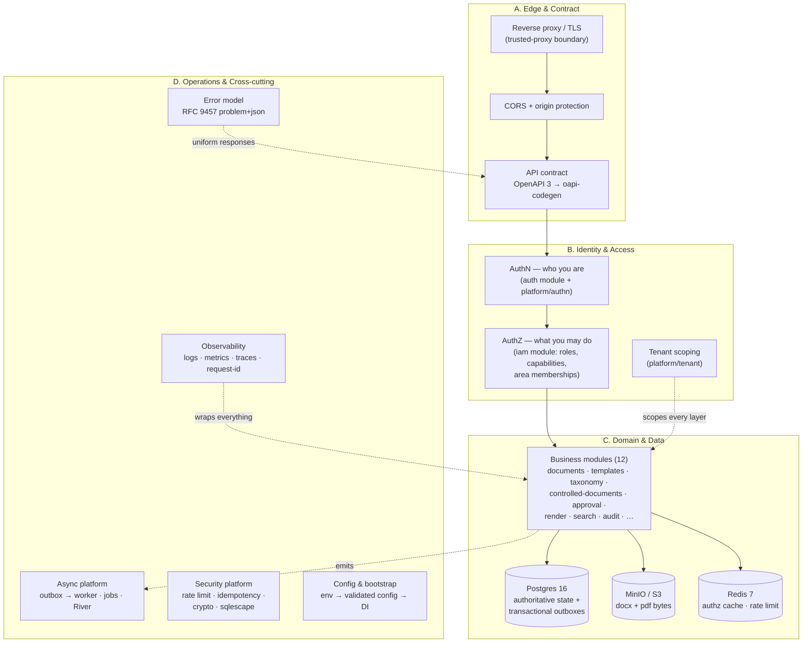
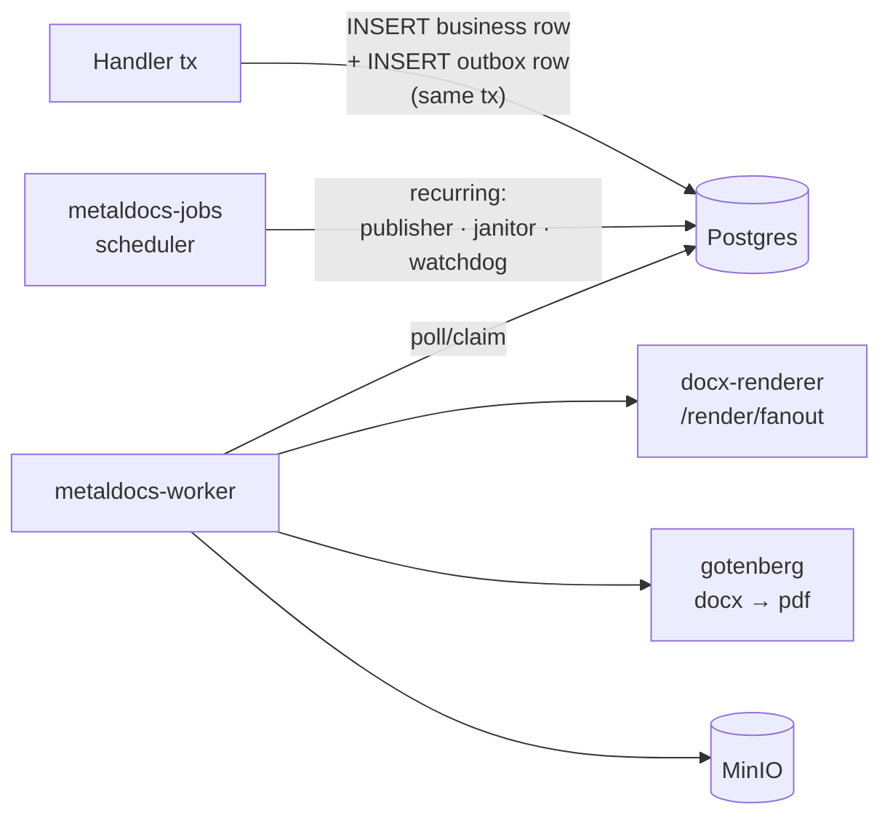

# Backend Blueprint — Composition, Standards, Maturity

> **Last verified:** 2026-06-13 (Wave Z all-green re-score — see §7)
> **Scope:** The canonical answer to "what is the MetalDocs backend composed of". Defines every backend concern, maps it to our implementation, names the industry standard it must satisfy, and grades maturity. This is the reference for the industry-grade refactoring program.
> **Out of scope:** Runtime topology ([system-overview.md](system-overview.md)), route truth ([backend-api-structure.md](backend-api-structure.md)), per-module deep dives (`wiki/modules/*`).
> **Definition layer:** The implementation-independent canon this blueprint maps against is [../standards/backend-canon.md](../standards/backend-canon.md) — read it first if you want the universal model before our specifics.
> **Target layer:** How the system MUST behave in the end state (normative REQ-* spec + refactoring register) is [backend-target-architecture.md](backend-target-architecture.md).
> **Key files:**
> - `apps/api/cmd/metaldocs-api/main.go` — composition root (all wiring)
> - `internal/modules/` — 12 business modules
> - `internal/platform/` — 28 cross-cutting platform packages
> - `api/openapi/v1/openapi.yaml` — contract source of truth

---

## 1. How to read this document

A production SaaS backend is not "an API". It is a **stack of concerns**, each with its own industry standard, failure modes, and ownership boundary. This document enumerates those concerns in four groups:

| Group | Question it answers |
|---|---|
| **A. Edge & contract** | How do requests enter, and what shape are they? |
| **B. Identity & access** | Who is calling, and what are they allowed to do? |
| **C. Domain & data** | Where does business logic live, and where does state live? |
| **D. Operations & cross-cutting** | How does it stay observable, reliable, and secure? |

Each concern gets: **definition → industry standard → what we have → maturity grade**.

Grades: ✅ industry-grade · 🟡 present but with known gaps · 🔴 missing or ad hoc.

---

## 2. The composition model

---

## 3. Request lifecycle (synchronous path)

> **Wave 1 (2026-06-11, F-01):** Chain reordered and extracted to `apps/api/cmd/metaldocs-api/chain.go` (declarative `apiChain`/`buildChain`). Recovery and observability are now outermost; pre-auth login rate limit added. Order asserted by `chain_test.go` (REQ-MW-7).

The middleware chain as wired in `apps/api/cmd/metaldocs-api/chain.go` via `apiChain(...)` (outermost first):

```mermaid
flowchart LR
    REQ([Request]) --> M0[Panic recovery<br/>platform/middleware.Recovery]
    M0 --> M1[HTTP observability<br/>metrics + request trace]
    M1 --> M2[CORS]
    M2 --> M3[Origin protection<br/>CSRF-class defense]
    M3 --> M35[Pre-auth login rate limit<br/>IP-keyed, login path only]
    M35 --> M4[AuthN middleware<br/>session/JWT → identity in ctx]
    M4 --> M5[IAM middleware<br/>capabilities → authz ctx]
    M5 --> M6[Presence bump<br/>needs UserID from M5]
    M6 --> M7[Rate limiter<br/>identity-keyed]
    M7 --> MUX[Router mux]
    MUX --> H[Module handler<br/>delivery/http]
    H --> APP[Application service<br/>use case]
    APP --> DOM[Domain rules]
    APP --> REPO[Repository<br/>infrastructure]
    REPO --> DB[(Postgres)]
    H -. error .-> P[problem+json<br/>RFC 9457 envelope]
```

Ordering invariants:

1. **Recovery and observability outermost** — panics produce measured 500s; 401s and CORS rejects appear in RED metrics (REQ-MW-1/4).
2. **AuthN before AuthZ before anything identity-keyed.** Presence bump and rate limiting both depend on identity in context.
3. **CORS and origin protection before authn** — reject cross-origin requests before spending auth work on them.
4. **Pre-auth IP rate limit on login** — runs before authn so brute-force is bounded even before session validation (REQ-MW-5).
5. **Per-route idempotency** (`platform/idempotency`) applies on mutating routes, inside the chain, after identity.

## 4. Write path (asynchronous)

State changes that have side effects (PDF render, docx materialization, notifications) never call external services in the request transaction. Pattern: **transactional outbox** (ADR 0009, ADR 0015).

---

## 5. Concern catalog

### A. Edge & contract

#### A1. Transport & trust boundary — ✅
- **Definition:** Where TLS terminates, which proxy headers are trusted, what network is assumed hostile.
- **Industry standard:** Explicit trusted-proxy allowlist; never trust `X-Forwarded-For` blindly.
- **We have:** [trusted-proxy.md](trusted-proxy.md); compose topology in [deployment.md](deployment.md).

#### A2. CORS & origin protection — ✅
- **Definition:** Browser-enforced cross-origin policy + server-side origin checks for state-changing requests.
- **Industry standard:** Fetch spec CORS; OWASP CSRF prevention (origin/referer validation for cookie-session APIs).
- **We have:** `platform/config/cors.go`, `platform/security/cors.go`, `originProtection` wrapper in main.go. Outermost in chain — correct.

#### A3. API contract — ✅
- **Definition:** Machine-readable source of truth for every route, parameter, schema, and error.
- **Industry standard:** OpenAPI 3.x, contract-first, generated server stubs, CI lint gate, no undocumented routes.
- **We have:** `api/openapi/v1/openapi.yaml` + partials → oapi-codegen; policy in [api-contract.md](api-contract.md); `scripts/api-lint` CI gate; snake_case params/templates done (2026-06). `api/openapi/spec2.yaml` + `internal/api/v2/` **deleted Wave 1 (F-03)** — parallel surface closed, RF-4 resolved.
- **Z-20 (promotion-by-verification, 2026-06-08):** api-contract-hardening Phase-F closeout — 0 CRITICAL / 0 HIGH findings; api-lint 0 blocking / 0 reported. All phases A–F complete.

#### A4. API behavior conventions — ✅
- **Definition:** Pagination, filtering, casing, envelope, versioning, ETag/concurrency rules — uniform across modules.
- **Industry standard:** Consistent resource naming, cursor pagination for unbounded lists, `If-Match`/ETag for optimistic concurrency, RFC 9457 for errors.
- **We have:** [api-design-system.md](api-design-system.md); `platform/pagination` (cursor + offset); approval module uses ETag mutation client; canonical error vocabulary landed 2026-06 (`ef696a177`).

### B. Identity & access

#### B1. Authentication (AuthN) — ✅
- **Definition:** Establishing *who* is calling. Credentials, sessions/tokens, lifecycle (login, refresh, logout, re-auth).
- **Industry standard:** Argon2/bcrypt password hashing; short-lived tokens (JWT, RFC 7519) or server-side sessions; re-auth for sensitive ops; rate-limited login.
- **We have:** `internal/modules/auth` (login, credentials, JWT) + `platform/authn` (validation, session context) + re-auth flow (`apps/api/cmd/metaldocs-api/reauth*.go`). Two-tier model documented in [../concepts/authz-tiers.md](../concepts/authz-tiers.md).

#### B2. Authorization (AuthZ / IAM) — 🟡
- **Definition:** Establishing *what* an identity may do. Roles, capabilities, resource scoping.
- **Industry standard:** Single source of truth for permission decisions; deny-by-default; resource-level scoping (not just endpoint-level); decisions auditable.
- **We have:** `internal/modules/iam` (users, roles, capabilities, area memberships, `authz/` package), Redis-backed capability cache, Postgres tripwire ([../concepts/authz-tiers.md](../concepts/authz-tiers.md)), permission table in `apps/api/cmd/metaldocs-api/permissions*.go`.
- **Gap:** ADR 0022 authz-coherence program — area-scoped admin semantics and single-source-of-truth consolidation in flight. This is the largest known identity gap; do not symptom-patch around it.

#### B3. Multi-tenancy — ✅
- **Definition:** Hard isolation of tenant data through every layer.
- **Industry standard:** Tenant ID resolved once at the edge, carried in context, enforced in every query; no cross-tenant identifiers leak.
- **We have:** `platform/tenant` + [tenant-context.md](tenant-context.md); S3 keys namespaced `tenants/{tenant_id}/...`.
- **Z-2/Z-3 (ad70f6415, 2026-06-13):** RLS enforced on all 27 remaining tenant tables + idempotency tenant FK — REQ-TEN-1 fully met; ADR 0027 executed in full.

### C. Domain & data

#### C1. Module architecture — ✅
- **Definition:** Business logic partitioned by bounded context, each module layered.
- **Industry standard:** Hexagonal/clean layering — `domain` (pure rules) ← `application` (use cases) ← `infrastructure`/`repository` (adapters) ← `delivery/http` (transport). Dependencies point inward only.
- **We have:** 12 modules under `internal/modules/`, all following the layer convention with `module.go` DI wiring. Largest: documents (184 files), iam (62), templates (54).
- **Watch item:** `main.go` is a ~37KB monolithic composition root. Acceptable for a modular monolith, but module `Dependencies` structs are the seam to keep clean.

#### C2. Relational persistence — ✅
- **Definition:** Authoritative state, schema migrations, transactional integrity.
- **Industry standard:** Versioned forward-only migrations, schema ownership per module, parameterized queries only, constraints/triggers guard invariants in the DB itself.
- **We have:** Postgres 16, pgx pool (`platform/db/postgres`), `platform/migrate` + `platform/bootstrap`, curated baseline + dictionary governance in [../database/](../database/index.md). DB-level invariant enforcement exists (e.g. migration 0152 snapshot trigger).

#### C3. Blob storage — ✅
- **Definition:** Large binary artifacts outside the RDBMS.
- **Industry standard:** S3-compatible store, presigned URLs so bytes never proxy through the API, content hashing for integrity.
- **We have:** `platform/objectstore` (MinIO), browser ↔ MinIO direct via presigned PUT/GET, content hashes persisted at freeze.

#### C4. Caching — ✅
- **Definition:** Derived state with explicit invalidation and TTL story.
- **Industry standard:** Cache-aside with bounded TTL; cache failure degrades to source of truth, never to wrong answers.
- **We have:** Redis for authz capability cache + rate-limit state. `platform/cache` **deleted Wave 1 (F-08/REQ-TOP-3)** — empty scaffold removed.
- **Z-29 (79f946df9, 2026-06-13):** cache contracts + invalidation-path verification — RF-3 closed, REQ-CACHE-1 MET. Invalidation paths documented and verified.

#### C5. Search — ✅
- **Definition:** Full-text/cross-module query surface, decoupled from transactional reads.
- **We have:** `internal/modules/search` with PG-backed reader (`infrastructure/v2documents/reader.go`).

#### C6. Async & background processing — ✅
- **Definition:** Everything that must not run inside a request: renders, scheduled publishes, reminders, janitors.
- **Industry standard:** Transactional outbox for exactly-once-ish dispatch; idempotent consumers; dead-letter/stuck-job detection; dedicated worker binaries.
- **We have:** Outbox pattern (ADR 0009, 0015), `metaldocs-worker` + `metaldocs-jobs` binaries, River queue client (`platform/jobs/river`), watchdog + idempotency janitor jobs (`internal/modules/jobs`).
- **Z-10 (3367570c6, 2026-06-13):** generic staging outbox repo/worker, dead restart loop deleted, idemp-store dedup — F-04 closed. **Z-6 (c7b10f3d6 + abc9afa48):** membership governance in-tx via LogTx — T-007, REQ-ASYNC-1 MET.

### D. Operations & cross-cutting

#### D1. Error model — ✅
- **Definition:** One machine-readable error shape for every failure on every route.
- **Industry standard:** RFC 9457 `application/problem+json` with a closed error-code vocabulary.
- **We have:** `platform/problem`, canonical vocabulary completed 2026-06 (commits `ef696a177`, `2369a02bf`).

#### D2. Observability — ✅
- **Definition:** Structured logs, RED metrics, distributed traces, request correlation, health/readiness probes.
- **Industry standard:** OpenTelemetry semantic conventions; every log line carries request-id + tenant-id; `/healthz` (liveness) vs `/readyz` (readiness, checks dependencies).
- **We have:** `platform/observability` (metrics, tracing, structured logging), `platform/requesttrace` (request-id propagation), `httpObs` middleware, `slog` structured logging.
- **Z-1 (c787ddfa1, 2026-06-13):** minimal OTel — `otelhttp` + W3C `traceparent` + autoexport, env-gated inert — F-17, RF-1, REQ-OBS-1/2/3 MET. **Z-21 (12a752d05 + bfe1e0e2a):** `log.Printf` → `slog` sweep — F-02, REQ-OBS-1 MET. **Z-22 (e7449e830):** WS presence drain on shutdown — F-16B, RF-9, REQ-REL-2 MET. **Z-23 (8a99124c0):** concurrent readiness checks (errgroup, shared budget) — F-16C, RF-9.

#### D3. Security platform — ✅
- **Definition:** Cross-cutting defenses independent of business logic.
- **Industry standard:** OWASP ASVS as checklist — rate limiting, input validation at the boundary, secrets from env/secret manager only, SQL injection impossible by construction, idempotency keys on payments-grade mutations.
- **We have:** `platform/ratelimit` (token bucket, [rate-limiting.md](rate-limiting.md)), `platform/idempotency` (request dedup middleware — rare and good), `platform/security` (CORS, crypto, policy), `platform/sqlescape` (identifier escaping; values always parameterized via pgx), `platform/formval`, service-to-service `X-Service-Token` on docx-renderer.

#### D4. Configuration & bootstrap — ✅
- **Definition:** 12-factor config: env in, validated typed config out, fail-fast on missing secrets.
- **We have:** `platform/config` (env, YAML, secrets, CORS config), `platform/bootstrap` (DB setup, init sequence), canonical startup script (`scripts/start-api.ps1`) per script-truth policy.

#### D5. Audit & compliance — ✅
- **Definition:** Immutable record of who did what when — a product feature for ISO 9001 QMS, not just ops logging.
- **We have:** `internal/modules/audit` (event logging, trail), `audit_integrity_validator` job, audit-export wiring (2026-06). Distinct from observability logs by design.
- **Z-4 (0a578446a, 2026-06-13):** audit export writer hard-required, allow-dualmode retired — T-012. **Z-5 (6075c82a3, 2026-06-13):** freeze service tx-mandatory, ADR 0015 amended, allow-dualmode retired — T-013. Zero `allow-dualmode` paths remain.

#### D6. Internal service-to-service calls — ✅
- **Definition:** Tuned HTTP clients for intra-cluster fanout; retries owned by callers with outbox semantics, not buried in the client.
- **We have:** `platform/httpclient.NewInternalClient` (timeouts, HTTP/2, no embedded retry — retry owned by `PDFOutboxWorker`, ADR 0009).

#### D7. Feature flags — ✅
- **We have:** `platform/featureflags` (2 files).
- **Z-30 (bcab41710, 2026-06-13):** feature-flag lifecycle standard documented — `wiki/standards/feature-flag-lifecycle.md` + index — RF-8 closed. Naming, ramp, and cleanup-date conventions now canonical.

#### D8. Messaging/eventing — ✅
- **We have:** `platform/messaging` with noop/outbox/servicebus adapters, `platform/servicebus`.
- **Z-31 (bcab41710, 2026-06-13):** messaging/servicebus fenced — servicebus is the sync Gotenberg adapter, not a broker — RF-7 closed. Speculative-generality drift resolved; production story documented.

#### D9. Quality gates & testing — ✅
- **Definition:** CI enforces the contract: unit + integration + race detector + API lint.
- **We have:** `go test -race`, `scripts/api-lint` exit-code gated, module-level `*_test.go` throughout, `internal/test` + `internal/testsupport` fixtures. `tools/cilint` custom analyzers (**7 analyzers**, all exit 0 at Wave F: `txownership`, `legacyvocab`, `outboxpair`, `platformboundary` [REQ-TOP-2, Wave 1], `postcommitaudit` [REQ-ASYNC-1, Wave 2.2], `nosqltxindomain` + `nodualmode` [Wave 2.13]) plus the `chain_test.go` order test and gitleaks secret-scan — 6 program CI guards. QA operating system in [../quality/qa-operating-system.md](../quality/qa-operating-system.md).

---

## 6. Standards register

The named external standards this backend is held to. Cite these in reviews instead of "best practice".

| Standard | Applies to | Status |
|---|---|---|
| **OpenAPI 3.x** + contract-first codegen | A3 contract | Adopted (oapi-codegen) |
| **RFC 9457** Problem Details | D1 errors | Adopted, closed vocabulary |
| **RFC 7519** JWT (+ RFC 8725 JWT BCP) | B1 authn | Adopted; BCP audit = part of authz program |
| **OWASP ASVS / Top 10** | B*, D3 | Working checklist for security review |
| **12-Factor App** (config, processes, logs) | D4, binaries | Adopted |
| **Transactional Outbox** (microservices.io) | C6 | Adopted (ADR 0009, 0015) |
| **OpenTelemetry** semantic conventions | D2 | Adopted — Z-1 (c787ddfa1): otelhttp + W3C traceparent + autoexport (env-gated inert); REQ-OBS-1/2/3 MET |
| **C4 model** (Simon Brown) | architecture docs | Adopted (`wiki/diagrams/c4-*.md`) |
| **ADR practice** (Nygard) | decisions | Adopted (`wiki/decisions/`) |
| **ISO 9001** controlled-document semantics | domain itself | Product requirement, drives freeze/audit design |

---

## 7. Maturity scoreboard & open programs

| Concern | Grade | Owning program |
|---|---|---|
| A1 transport, A2 CORS, A4 conventions | ✅ | — |
| A3 contract | ✅ | Z-20: api-contract-hardening Phase-F closed 2026-06-08; 0 CRITICAL/0 HIGH; api-lint 0 blocking |
| B1 authn, B3 tenancy | ✅ | — |
| B2 authz | 🟡 | ADR 0022 authz-coherence — area-scoped admin semantics still in flight (qa/iam-area-membership) |
| C1 modules, C2 persistence, C3 blobs, C5 search, C6 async | ✅ | — |
| C4 caching | ✅ | Z-29 (79f946df9): cache contracts + invalidation-path verification — RF-3 closed, REQ-CACHE-1 MET |
| D1 errors, D3 security, D4 config, D5 audit, D6 internal HTTP, D9 quality | ✅ | backend-standardization complete |
| D2 observability | ✅ | Z-1 (c787ddfa1): minimal OTel — otelhttp + W3C traceparent + autoexport, env-gated inert — REQ-OBS-1/2/3 MET; Z-21: log.Printf→slog sweep; Z-22: WS drain REQ-REL-2 MET; Z-23: concurrent readiness |
| D7 feature flags | ✅ | Z-30 (bcab41710): feature-flag lifecycle standard — RF-8 closed |
| D8 messaging | ✅ | Z-31 (bcab41710): servicebus fenced as sync Gotenberg adapter — RF-7 closed |
| **F-18 git-history** | ⏳ **(at-release only — intentional exception)** | Z-32 runbook: closes physically at Sunday 2026-06-14 v1 re-baseline. **This is the single intentional non-✅ line permitted by the Wave Z DONE gate.** |

**Rule:** a 🟡 → ✅ promotion requires evidence (commands run, QA outcome) per the close-out loop in `CLAUDE.md` §4, recorded in the owning program doc.

### Wave F re-score (2026-06-12)

The backend-professionalization program (Waves 0–2) fixed **defects within** concerns more than it promoted grades — several concerns were graded ✅ while harboring open correctness/compliance defects; those defects are now closed, so the ✅ is genuinely earned. Grade deltas:

| Concern | Before | After | Why |
|---|---|---|---|
| C6 async | ✅ (with F-19 silent failure) | ✅ (earned) | F-19 fully closed (jobs Dockerfile+compose, single River-migration owner, lease_reaper JOIN bug) — Wave 0.5/1.6/1.7; **runtime-verified Wave F F.3** (live jobs host claims+executes `scheduled_publish_cutover`; worker relays `pdf_dispatch_outbox`→`outbox_events`) |
| D5 audit | ✅ (with F-07 atomicity gap) | ✅ (earned) | Post-commit audit/governance writes moved in-transaction across 5 modules (F-07/D-01, Wave 2.2); `PostCommitAudit` cilint guard blocks regression; **runtime-verified Wave F F.3** (in-tx `family.created` row) |
| D3 security | ✅ | ✅ (strengthened) | F-18 credentials scrubbed + gitleaks CI (Wave 0); F-05 domain-importing limiter deleted, `platform/ratelimit` activated (Wave 2.8); F-20e in-memory→Postgres auth-failure counter (Wave 2.10) |
| D2 observability | 🟡 "unowned — needs audit" | 🟡 (owned, deferred) | No grade change (OTel still absent **by design**), but the gap is now an audited, trigger-gated defer (D-1), not an unknown |
| C4 caching, D7 flags, D8 messaging | 🟡 | 🟡 (clarified) | No code-level change; each now carries a written RF/trigger (RF-3, RF-8, RF-7) instead of an open question |

**Deliberately NOT promoted (honest):** **B2 authz** stays 🟡 — Wave 2.4 closed the capability-literal correctness defect (F-11) and added the `no-rawstring-tier1-authz` lint, ADR 0022 phases 1–13 are done and Phase 6 (wiki sync) closed by Z-28, but area-scoped admin semantics remain in flight on the current branch (qa/iam-area-membership). **A3 contract** promoted to ✅ by Z-20 (api-contract-hardening Phase-F closure, 2026-06-08): 0 CRITICAL/0 HIGH; api-lint 0 blocking/0 reported.

### Wave Z all-green re-score (2026-06-13)

All Wave Z concerns resolved. Grade deltas from Wave F → Wave Z:

| Concern | Before (Wave F) | After (Wave Z) | Commit(s) |
|---|---|---|---|
| A3 contract | 🟡 | ✅ | Z-20 (promotion-by-verification): api-contract-hardening Phase-F closed, 0 CRITICAL/0 HIGH, api-lint 0 blocking |
| C4 caching | 🟡 | ✅ | Z-29 (79f946df9): cache contracts + invalidation-path verification, RF-3, REQ-CACHE-1 MET |
| D2 observability | 🟡 | ✅ | Z-1 (c787ddfa1): otelhttp + W3C traceparent + autoexport; Z-21: log.Printf→slog; Z-22: WS drain REQ-REL-2; Z-23: concurrent readiness |
| D5 audit (dual-mode) | ✅ (with allow-dualmode) | ✅ (zero dual-mode) | Z-4 (0a578446a): audit export hard-required; Z-5 (6075c82a3): freeze tx-mandatory, ADR 0015 amended |
| D7 feature flags | 🟡 | ✅ | Z-30 (bcab41710): feature-flag lifecycle standard, RF-8 closed |
| D8 messaging | 🟡 | ✅ | Z-31 (bcab41710): servicebus fenced as sync Gotenberg adapter, RF-7 closed |
| B3 tenancy / REQ-TEN-1 | ✅ (2/29 tables) | ✅ (all tables) | Z-2/Z-3 (ad70f6415): RLS on all 27 remaining tables + idempotency FK; ADR 0027 in full |
| C6 async / REQ-ASYNC-1 | ✅ | ✅ (strengthened) | Z-6 (c7b10f3d6 + abc9afa48): membership governance in-tx; Z-10 (3367570c6): outbox generic staging |
| ADR registry | — | ✅ | Z-27: canonical Status headers, stubs → Historical/0028, index rebuilt; Z-28 (c82dadfb1): ADR 0022 Phase 6 wiki sync |
| REQ-REL-2 (WS drain) | DEFERRED | ✅ | Z-22 (e7449e830): WS presence drain on shutdown |

**G10 regression review:** ZERO Wave-Z-caused regressions. Two critical claims raised and both refuted with evidence (RLS templates `::uuid` cast — refuted by migration 0213 having converted those columns post-baseline; presence `CloseAll` race — refuted as pre-existing). Pre-existing finds parked in `wiki/backend/post-v1-backlog.md`.

**Intentional exception (single):** F-18 git-history residual closes physically at the Sunday 2026-06-14 v1 re-baseline via Z-32 runbook. Not a defer — a physical at-release action. No other non-✅ lines remain.

### REQ-* compliance (Wave Z check against `backend-target-architecture.md`)

| REQ-* | Finding(s) | State | Evidence |
|---|---|---|---|
| REQ-MW-1/2/4/5/7 (middleware chain) | F-01 | **MET** | Wave 1.1 reorder + `chain_test.go`; F.3 live (panic→500 problem+json, 401s in RED metrics, pre-auth 429) |
| REQ-TOP-1 (no cross-module SQL/infra) | F-06b/c/d | **MET (4/9); residual next-touch** | Wave 2.5/2.6/2.7; F-06e + security-JOIN + standalone-CD-repo deferred |
| REQ-TOP-2 (platform domain-free) | F-06a, F-05 | **MET + CI-locked** | Wave 0.6/2.8; `platformboundary` analyzer exit 0 (F.1) |
| REQ-TOP-3 (no dead platform pkgs) | F-08 | **MET** | Wave 1.9/2.13 |
| REQ-ASYNC-1 (in-tx audit + membership governance) | F-07, D-01, T-007 | **MET + CI-locked** | Wave 2.2; `PostCommitAudit` analyzer exit 0 (F.1); F.3 live; Z-6 (c7b10f3d6 + abc9afa48): membership governance in-tx via LogTx |
| REQ-ASYNC-4 (jobs deployment) | F-19 | **MET** | Wave 0.5/1.6/1.7; F.3 live |
| REQ-REL-1/2 (server timeouts + WS drain) | F-16 | **MET** | Wave 1.2 (timeouts); Z-22 (e7449e830): WS presence drain on shutdown — F-16B MET; Z-23 (8a99124c0): concurrent readiness checks — F-16C MET |
| REQ-REL-3 (durable auth-failure limit) | F-20e | **MET** | Wave 2.10 live PG probe |
| REQ-AUTHZ-2/5/6 (typed caps, registry, batch) | F-11, F-10 | **MET + CI-locked** | Wave 2.4/2.9; `no-rawstring-tier1-authz` api-lint rule |
| REQ-TEN-1 / REQ-DATA-2 (DB-layer isolation) | F-12 | **MET** | Wave 2.3 RLS on controlled_documents+audit_events; Z-2/Z-3 (ad70f6415): RLS on all 27 remaining tenant tables + idempotency tenant FK; ADR 0027 executed in full; F.3 live NOSUPERUSER probe |
| REQ-SEC-1 (no secrets in VCS) | F-18 | **MET (working tree); history→D-4b re-baseline** | Wave 0; gitleaks CI |
| REQ-API-2 (single contract surface) | F-03 | **MET** | Wave 1.3; RF-4 closed |
| REQ-H-1/H-2 (repo boundary, problem+json everywhere) | F-06b, F-09, D-03 | **MET** | Wave 1.4/1.5/2.5 |
| REQ-OBS-1/2/3 (OTel, W3C trace) | F-17 | **MET** | Z-1 (c787ddfa1): otelhttp + W3C traceparent + autoexport, env-gated inert; Z-21 (12a752d05 + bfe1e0e2a): log.Printf→slog sweep; full OTel stack active |
| REQ-CACHE-1 (cache contract) | D-05 | **MET** | Z-29 (79f946df9): cache contracts + invalidation-path verification; RF-3 closed |

---

## 8. Cross-references

- Runtime topology + C4: [system-overview.md](system-overview.md)
- Route truth + OpenAPI structure: [backend-api-structure.md](backend-api-structure.md)
- Contract policy: [api-contract.md](api-contract.md) · behavior: [api-design-system.md](api-design-system.md)
- AuthZ tiers: [../concepts/authz-tiers.md](../concepts/authz-tiers.md)
- Tenancy: [tenant-context.md](tenant-context.md) · proxy trust: [trusted-proxy.md](trusted-proxy.md) · throttling: [rate-limiting.md](rate-limiting.md)
- Database governance: [../database/index.md](../database/index.md)
- ADRs: `wiki/decisions/`
- Sequence diagrams: `wiki/diagrams/sequence-*.md`
