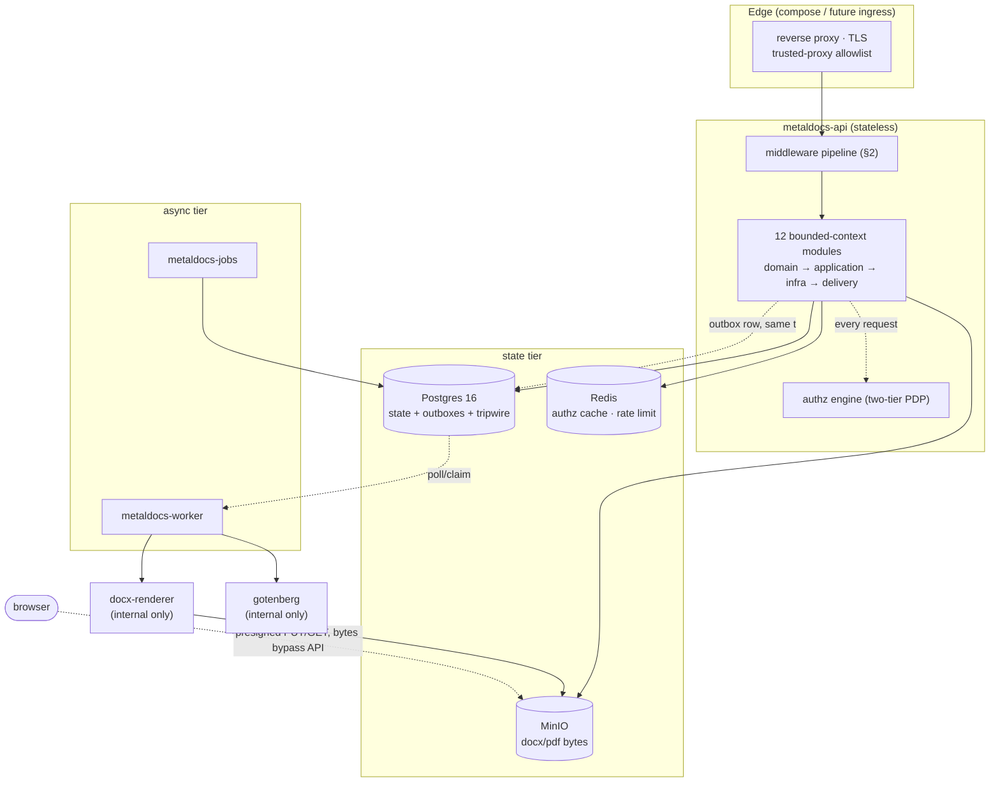
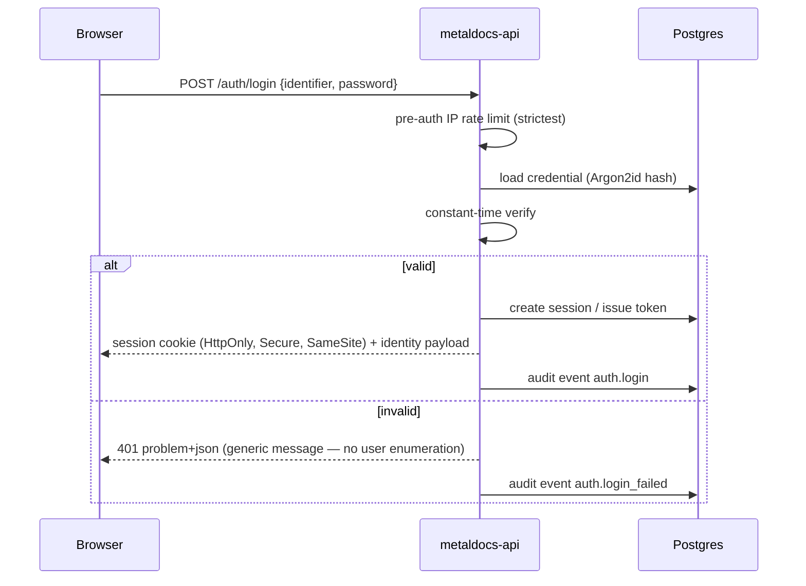
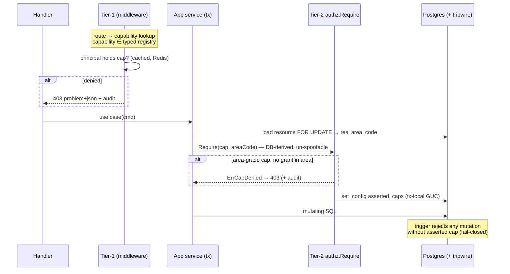
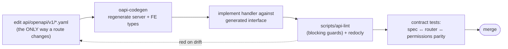
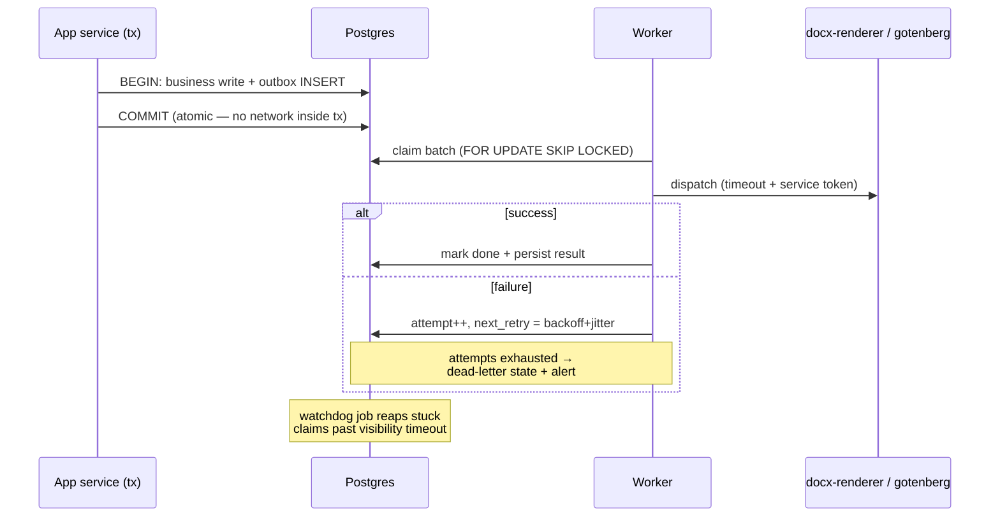

# Backend Target Architecture — How MetalDocs MUST Behave

> **Last verified:** 2026-06-11 (Wave 1)
> **Scope:** Normative specification. Maps the universal model in [../standards/backend-canon.md](../standards/backend-canon.md) onto MetalDocs and states how each concern **must behave** in the end state. This is the reference for the industry-grade refactoring program: every refactor PR cites the requirement IDs it advances; every review defends them.
> **Relation to siblings:** [backend-canon.md](../standards/backend-canon.md) defines the universal model · [backend-blueprint.md](backend-blueprint.md) grades the current state · **this doc defines the target** · ADRs record decisions · backlog programs execute.
> **Language:** RFC 2119 — **MUST** (non-negotiable, review-blocking), **SHOULD** (deviate only with written reason), **MAY** (optional).

---

## 1. Target topology

MetalDocs is and remains a **modular monolith** with plane separation expressed at the binary level:

| Binary | Plane | Behavior contract |
|---|---|---|
| `metaldocs-api` | data + control plane | Stateless. All synchronous business logic + authz. No precious local state. Also hosts the 4 leader-elected janitors (stuck-instance-watchdog, idempotency-janitor, audit-integrity-validator, lease-reaper) via an in-process scheduler with DB-backed lease/heartbeat single-runner semantics. |
| `metaldocs-worker` | async data plane | Consumes outboxes/queues. Every consumer idempotent. |
| `metaldocs-jobs` | management plane | Async schedules via River — scheduled-publish (approval) + notifications fanout. |
| `docx-renderer` | internal service | Reached only via authenticated internal calls; never exposed at the edge. |

- **REQ-TOP-1** Modules under `internal/modules/` are bounded contexts. Cross-module access goes through a module's application service or published Go interface — never another module's repository, SQL, or domain internals. (MUST)
- **REQ-TOP-2** `internal/platform/` packages are domain-free. A platform package importing a module is a layering violation. (MUST)
- **REQ-TOP-3** Every platform package either has production consumers or does not exist. Empty scaffolds (`platform/cache`, `platform/storage`) are deleted or implemented — speculative directories are banned. (MUST — `platform/cache` deleted Wave 1 (F-08); `platform/storage` still open.)
- **REQ-TOP-4** Module extraction to a separate service is a non-goal. Boundaries are kept extraction-clean (REQ-TOP-1) but no network split happens without an ADR. (SHOULD)

---

## 2. Target request lifecycle

### 2.1 Normative middleware chain

Canon-aligned target order (outermost → innermost):

```mermaid
flowchart LR
    R([request]) --> M0["panic recovery"]
    M0 --> M1["request ID +<br/>trace context (W3C)"]
    M1 --> M2["access log + RED metrics"]
    M2 --> M3["CORS + origin protection"]
    M3 --> M4["pre-auth rate limit<br/>(IP-keyed; login hardest)"]
    M4 --> M5["authn → principal in ctx"]
    M5 --> M6["tier-1 authz<br/>(route → capability)"]
    M6 --> M7["post-auth rate limit<br/>(principal-keyed)"]
    M7 --> M8["presence / identity-keyed<br/>side effects"]
    M8 --> M9["idempotency (mutating routes)<br/>body limit · timeout"]
    M9 --> H["handler"]
```

- **REQ-MW-1** Panic recovery and trace-context middleware are outermost. A panicked request still produces a request-ID-tagged log line, a 500 `problem+json`, and a metric. (MUST)
- **REQ-MW-2** Every request gets a request ID; it propagates into every log line, error response (`trace_id` extension member), and outbound internal call. (MUST)
- **REQ-MW-3** AuthN strictly precedes any authz, presence, or principal-keyed limiting. (MUST)
- **REQ-MW-4** Unauthenticated traffic is observable: metrics/logging sit outside authn so 401s and CORS rejects appear in RED metrics. (MUST — **satisfied Wave 1 (F-01):** `httpObs` and panic recovery are now outermost. RF-2 closed.)
- **REQ-MW-5** Login and credential endpoints carry the strictest pre-auth IP-keyed rate limit. (MUST)
- **REQ-MW-6** Fine-grained (resource/area-level) authorization never lives in middleware — it lives at tier-2 inside the owning transaction (§3.3). Middleware does route-level tier-1 only. (MUST)
- **REQ-MW-7** The chain order is asserted by a test against the composed handler; reordering breaks the build, not production. (SHOULD — **satisfied Wave 1 (F-01):** `chain_test.go` asserts composed execution order.)

### 2.2 Handler discipline

- **REQ-H-1** Handlers (delivery layer) do: decode → validate at boundary → call one application service → map result/error to contract. No business rules, no SQL, no authz beyond mapping `ErrCapDenied`→403. (MUST)
- **REQ-H-2** Every error path returns RFC 9457 `problem+json` with a code from the closed vocabulary. No bare `http.Error`, no ad hoc JSON. (MUST)
- **REQ-H-3** Authz failures on existence-probing routes return 404 where revealing existence is itself a leak (cross-tenant), 403 otherwise. The choice is deliberate per route, not accidental. (MUST)

---

## 3. Target identity behavior

### 3.1 Authentication (tier-0)

- **REQ-AUTHN-1** Passwords hashed with a memory-hard KDF (Argon2id family); verification constant-time; failure responses identical for unknown-user vs wrong-password. (MUST)
- **REQ-AUTHN-2** Sessions/tokens are revocable, carry tenant + principal, and expire. Sensitive operations require step-up re-authentication (existing reauth flow is the pattern). (MUST)
- **REQ-AUTHN-3** Session tokens are opaque and carry no self-asserted authorization claims; token material is CSPRNG-generated with at least 256 bits of entropy; the server-side-persisted form is a one-way hash of the token, never the raw token; presented-token verification uses a constant-time comparison; sessions have a bounded TTL (absolute and/or sliding); sessions are revocable server-side (single-session and bulk-by-user) without cooperation from the bearer. RFC 8725 (JWT Best Current Practices) does not apply — there is no JWT in this codebase and adopting one for sessions would be a downgrade (loses cheap server-side revocation); see ADR 0094 for the clause-by-clause disposition. (MUST — see ADR [0094](../decisions/0094-session-tokens-opaque-rfc8725-not-applicable.md))
- **REQ-AUTHN-4** Login, logout, failed login, session revocation, and re-auth all emit audit events. (MUST)

### 3.2 Authorization — the single PDP (per ADR 0022, end state)

The two-tier capability model **is** the PDP. There is exactly one decision engine and one vocabulary:

| Element | Authoritative home |
|---|---|
| Capability registry (the permission atoms) | `iam/domain/model.go` `validCapabilities` — typed consts only |
| Scope classification (tenant-grade vs area-grade) | `iam/domain/capability_scope.go` typed map |
| Tier-1 PEP (route → capability) | `permissions.go` route table |
| Tier-2 PEP (capability × area, in-tx) | `authz.Require(ctx, tx, cap, areaCode)` |
| Last line of defense | DB trigger tripwire `enforce_capability_asserted` |
| Role → capability grants | `role_capabilities` seed (CI-bound to registry) |

- **REQ-AUTHZ-1** Code checks capabilities, never role names. Zero role-string literals in delivery/application code. (MUST — achieved for IAM in ADR 0022 Phases 3-4; CI guard `no-rolestring-in-delivery` keeps it.)
- **REQ-AUTHZ-2** Every capability referenced anywhere is a typed registry const; raw strings and inline `Capability("…")` are CI-rejected (`no-inline-capability`, raw-string guard). (MUST)
- **REQ-AUTHZ-3** Area-grade capabilities always receive the resource's **real, DB-derived** area at tier-2; `"tenant"` on an area-grade cap is a red build (`authz-area-scope-binding`). Missing/empty area fails **closed**. (MUST)
- **REQ-AUTHZ-4** Deny by default. `system_admin` tenant-wide bypass is the only inheritance short-circuit; the background bypass is reachable only from background composition roots, never from an HTTP request context. (MUST)
- **REQ-AUTHZ-5** All five declaration surfaces (Go registry, route table, DB seed, OpenAPI annotations, wiki) are CI-bound; drift is a red build, not a doc. (MUST)
- **REQ-AUTHZ-6** List/query endpoints enforce scope **in SQL** (subquery/JOIN), never by post-fetch filtering. (MUST)
- **REQ-AUTHZ-7** Every deny (tier-1 and tier-2) emits an audit event with principal, capability, resource, decision. (MUST)
- **REQ-AUTHZ-8** The authz capability cache has a written contract: TTL, invalidation triggers (role grant/revoke, membership change), and the staleness bound a grant change may exhibit. Cache outage degrades to DB lookup, never to allow. (MUST — contract doc is refactor item RF-3.)

### 3.3 IAM (control plane)

- **REQ-IAM-1** Identity lifecycle (create, deactivate, role grants, area memberships) is admin-surface only, fully audited, and area-scoped per ADR 0022 decision 4: `area_admin` administers only their managed areas; `system_admin` is tenant-wide. (MUST)
- **REQ-IAM-2** Roles are the admin-facing bundling; the product never requires code changes to define which role can do what — only seed/grant changes. (SHOULD)

### 3.4 Multi-tenancy

- **REQ-TEN-1** Pooled model: every tenant-owned table carries `tenant_id`; every query path filters by it; tenant resolved once at the edge and carried in context (see [tenant-context.md](tenant-context.md)). (MUST)
- **REQ-TEN-2** Cross-tenant references in URLs resolve to 404, never 403. (MUST)
- **REQ-TEN-3** Tx-local GUCs (`set_config(..., true)`) for any identity the DB layer consumes — session-level GUCs are banned (PgBouncer leak). (MUST — regression-locked already.)
- **REQ-TEN-4** Blob keys are tenant-namespaced (`tenants/{tenant_id}/…`); presigned URLs are short-lived and single-purpose. (MUST)

---

## 4. Target API contract behavior

### 4.1 Contract-first workflow

- **REQ-API-1** The OpenAPI spec is the only source of route truth. A route reachable at runtime but absent from the spec (or vice versa) is a defect; CI parity checks make it a red build. Undocumented "raw" routes are eliminated or documented (e.g. `POST /documents`). (MUST)
- **REQ-API-2** One API surface. The `spec2.yaml` / `internal/api/v2` parallel surface is converged into v1 or formally fenced with an ADR and a sunset plan. No third option. (MUST — **satisfied Wave 1 (F-03):** both deleted. RF-4 closed.)
- **REQ-API-3** Breaking changes require a version bump per the versioning policy in [api-contract.md](api-contract.md); additive evolution is the default. (MUST)
- **REQ-API-4** Conventions are uniform: snake_case params, cursor pagination on unbounded collections (every list endpoint has a `limit` ceiling — unbounded lists are banned), ETag/`If-Match` on read-modify-write resources, RFC 9457 errors with the closed vocabulary. (MUST)
- **REQ-API-5** Mutating endpoints that clients may retry accept an idempotency key and replay the original result. Approval/freeze-class operations are in scope by default. (MUST)
- **REQ-API-6** Request validation happens at the boundary against the contract schema; application services receive only typed, validated input. (MUST)

---

## 5. Target data behavior

### 5.1 Relational state

- **REQ-DATA-1** Migrations are versioned, forward-only, idempotent-safe to re-run, and mirrored into the curated baseline per [../database/](../database/index.md) policy. Destructive changes follow expand → migrate → contract across releases. (MUST)
- **REQ-DATA-2** Invariants that must never break (state-machine transitions, uniqueness, tenant/area integrity, snapshot completeness) are enforced **in the database** — triggers/constraints — with app-layer checks as the friendly first line. The tripwire model is the canonical example. (MUST)
- **REQ-DATA-3** Values always parameterized (pgx); identifiers via `sqlescape` only where parameters can't apply. String-built SQL is review-blocking. (MUST)
- **REQ-DATA-4** The application DB role is `NOSUPERUSER` and cannot set `session_replication_role` — the tripwire's only bypass axis. Asserted in the deployment runbook. (MUST)

### 5.2 Caching

- **REQ-CACHE-1** Every cache has a one-page contract: what's cached, key shape, TTL, invalidation events, staleness bound, and failure behavior. No contract, no cache. (MUST)
- **REQ-CACHE-2** Cache failure degrades to source of truth (slower, correct). A cache that can produce a wrong *allow* (authz) fails closed to DB lookup. (MUST)

### 5.3 Blobs & derived stores

- **REQ-BLOB-1** Bytes never proxy through the API when a presigned URL can carry them; artifacts are content-hashed at freeze and the hash persisted. (MUST)
- **REQ-SEARCH-1** Search indexes are derived and rebuildable; a full reindex procedure exists and is tested. Search is never consulted for authz decisions. (MUST)

---

## 6. Target async behavior

- **REQ-ASYNC-1** Any operation that writes state **and** has an external side effect uses the transactional outbox. Direct network calls inside a business transaction are banned. (MUST)
- **REQ-ASYNC-2** Every consumer is idempotent — replay of any message/job is harmless. (MUST)
- **REQ-ASYNC-3** Retry = exponential backoff + jitter + attempt cap; exhaustion lands in an inspectable dead-letter state that pages someone. Silent infinite retry and silent drop are both banned. (MUST)
- **REQ-ASYNC-4** Every async pipeline has a watchdog for stuck work and a metric for queue depth + oldest-item age. (MUST)
- **REQ-ASYNC-5** Retry ownership is declared once per pipeline (worker owns it; internal HTTP client stays retry-free per ADR 0009). (MUST)
- **REQ-ASYNC-6** Background jobs needing authz use the fail-closed background bypass bridge — never a synthetic HTTP principal. (MUST)

---

## 7. Target observability behavior

- **REQ-OBS-1** Structured logs (slog) only; every line in a request path carries `request_id`, `tenant_id`, `principal_id` (when authenticated). No PII, secrets, or credentials in logs. (MUST)
- **REQ-OBS-2** RED metrics per route (rate, error count by class, duration histogram); USE metrics for pools (DB conns, worker concurrency, queue depth). Alerts fire on p99/SLO burn, not averages. (MUST)
- **REQ-OBS-3** One trace context propagates edge → api → outbox → worker → docx-renderer via W3C `traceparent`, carried through the outbox row so async hops join the originating trace. OpenTelemetry is the export standard. (MUST — edge→api→outbox→worker leg met via Z-1 `SetupOTel`; the worker→docx-renderer leg closed 2026-07-03 (TST-05): `Client.Fanout` injects `traceparent` via `otel.GetTextMapPropagator()`, and `docx-renderer` now runs its own env-gated OTel tracer provider parenting a `docx_renderer.render_fanout` span on the inbound header — see `wiki/modules/editor-ui-eigenpal-tech-debt.md` T-010.)
- **REQ-OBS-4** Distinct liveness (`process up`) and readiness (`DB + Redis + MinIO reachable`) endpoints; readiness gates traffic during deploys. (MUST)
- **REQ-OBS-5** Audit events (product/compliance) and ops logs are separate streams with separate retention; audit is append-only with integrity validation (existing `audit_integrity_validator` is the pattern). (MUST)

---

## 8. Target reliability behavior

- **REQ-REL-1** Every outbound call (DB, Redis, MinIO, renderer, gotenberg) has an explicit timeout. Unbounded waits are review-blocking. (MUST)
- **REQ-REL-2** `metaldocs-api` drains gracefully on SIGTERM: stop accepting, finish in-flight within a deadline, close pools. Workers finish or release their claimed batch. (MUST)
- **REQ-REL-3** Overload sheds load early: 429/503 + `Retry-After` from the rate/concurrency limiters rather than queue collapse. (MUST)
- **REQ-REL-4** A dependency outage degrades, not cascades: cache → DB fallback; renderer down → outbox accumulates + alert, API stays up; MinIO down → uploads fail with a clear problem code, reads of cached metadata continue. Each dependency's degradation mode is written down. (SHOULD)
- **REQ-REL-5** Internal calls to repeatedly-failing dependencies back off (circuit-breaker behavior in the worker dispatch path). (SHOULD)

---

## 9. Target security behavior

- **REQ-SEC-1** Secrets only from env/secret manager; startup fails fast on missing secrets; no secret ever in VCS, logs, or error responses. (MUST)
- **REQ-SEC-2** All internal service-to-service calls authenticate (service token today; platform identity/mTLS when infra allows). "Inside the compose network" is not a trust boundary. (MUST)
- **REQ-SEC-3** OWASP ASVS is the review checklist for any change touching auth, input handling, file paths, crypto, or queries. (MUST)
- **REQ-SEC-4** Inbound webhooks (if/when added) verify signatures + replay protection before any processing; outbound webhooks sign payloads. (MUST)
- **REQ-SEC-5** Dependency updates are scanned; a known-critical vulnerability in a direct dependency blocks release. (SHOULD)

---

## 10. Refactoring register — gap → requirement → owner

The actionable bridge. Every item is a bounded program; no symptom-patching across these boundaries (CLAUDE.md hard-stop applies).

| ID | Gap (from blueprint scoreboard) | Target requirements | Owner / program | Status |
|---|---|---|---|---|
| **RF-1** | Observability depth unverified: exporter wiring, cross-binary trace propagation, readiness probe depth | REQ-OBS-1..4, REQ-MW-1/2 | **unowned — first candidate program** | open |
| **RF-2** | Middleware chain vs canon: no panic-recovery/trace outermost; metrics inside auth; no pre-auth IP rate limit tier | REQ-MW-1, REQ-MW-2, REQ-MW-4, REQ-MW-5, REQ-MW-7 | fold into RF-1 or standalone | **CLOSED Wave 1 (F-01)** |
| **RF-3** | Authz cache invalidation contract unwritten | REQ-AUTHZ-8, REQ-CACHE-1/2 | ADR 0022 residual | open |
| **RF-4** | Parallel contract surface (`spec2.yaml`, `internal/api/v2`) unfenced | REQ-API-2 | api-contract-hardening | **CLOSED Wave 1 (F-03)** |
| **RF-5** | Contract drift residue (~397 reported-only lint hits; undocumented raw routes) | REQ-API-1 | api-contract-hardening C–F | in flight |
| **RF-6** | Authz coherence final close (Phase 6 wiki sync; `authz-call-present` call-graph rewrite) | REQ-AUTHZ-3/5 | ADR 0022 | in flight |
| **RF-7** | Empty platform scaffolds (`cache`, `storage`); messaging/servicebus undocumented | REQ-TOP-3 | backend-standardization | open (`cache` deleted Wave 1; `storage` remains) |
| **RF-8** | Feature-flag lifecycle discipline undefined | canon §2.11 | small standalone doc | open |
| **RF-9** | Graceful shutdown / timeout / degradation audit (verify REQ-REL-1/2/4 hold everywhere) | REQ-REL-* | unowned | open |
| **RF-10** | Idempotency coverage audit: which mutating routes accept keys vs should | REQ-API-5 | backend-standardization | open |

Sequencing recommendation: **RF-6 → RF-5/RF-4** (finish in-flight programs first) → **RF-1+RF-2** (observability + chain, one program — same wiring surface) → **RF-3, RF-9, RF-10** → **RF-7, RF-8** (hygiene).

---

## 11. Acceptance — the litmus tests, bound

Canon §5 litmus tests become release-gate questions. Target answers:

| # | Litmus | Target answer | Bound by |
|---|---|---|---|
| 1 | One place for authz decisions? | Yes — two-tier engine, typed registry | REQ-AUTHZ-1..5, CI guards |
| 2 | Safe client retries? | Yes on all retry-prone mutations | REQ-API-5 (RF-10) |
| 3 | Follow one request ID across hops? | Yes, edge→worker→renderer | REQ-OBS-3 (RF-1) |
| 4 | State write + network in one op without outbox? | Never | REQ-ASYNC-1 |
| 5 | DB rejects invalid transitions itself? | Yes — tripwire + transition triggers | REQ-DATA-2 |
| 6 | Any query path without tenant_id? | None | REQ-TEN-1 |
| 7 | Cache outage → errors, never wrong data? | Yes, fail to source | REQ-CACHE-2 |
| 8 | Deploy Friday noon? | Yes — graceful drain + expand/contract migrations + readiness gating | REQ-REL-2, REQ-DATA-1, REQ-OBS-4 (RF-9) |
| 9 | Permissions, never role names? | Yes — CI-enforced | REQ-AUTHZ-1 |
| 10 | Spec vs router disagreement caught in CI? | Yes — parity guards blocking | REQ-API-1 (RF-5) |

**Promotion rule:** a blueprint 🟡 → ✅ flip, or an RF item closing, requires the evidence package per `CLAUDE.md` §4 (commands, QA outcome, review disposition) recorded in the owning program doc — and the corresponding requirement IDs cited.

---

## 12. Governance

- New backend work is reviewed against this doc: reviewers cite REQ IDs, authors cite which IDs a PR advances or risks.
- Deviating from a MUST requires an ADR; deviating from a SHOULD requires a written reason in the PR.
- When a requirement changes, this doc changes first (contract-first applies to architecture too), then code follows.
- Drift policy: code changes that affect a REQ behavior bump this doc's `Last verified` in the same change.
