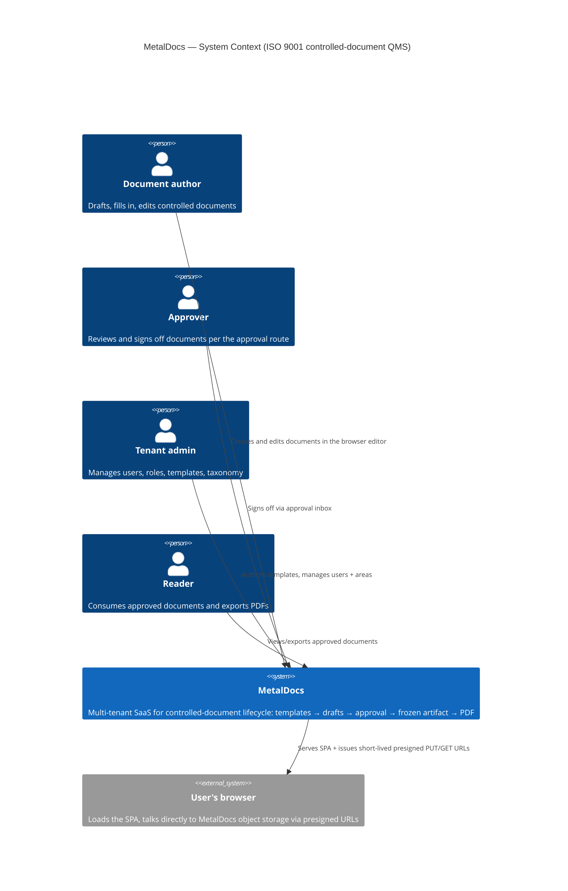
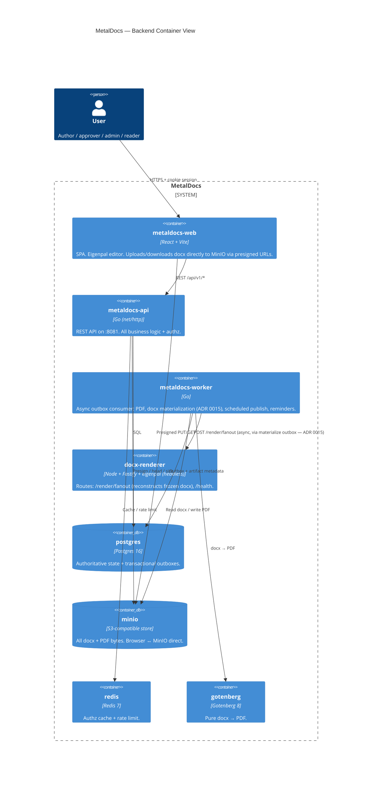

# System Overview

> **Last verified:** 2026-06-01 (async freeze refactor — ADR 0015)
> **Scope:** Services, ports, data flow, infra at a glance.
> **Out of scope:** Per-module deep dives (see `modules/*`), DB schema details (see `data-model.md`).
> **Key files:**
> - `deploy/compose/docker-compose.yml` - service topology
> - `apps/api/cmd/metaldocs-api/main.go` - Go entry point
> - `frontend/apps/web/vite.config.ts` - frontend dev server
> - `internal/platform/bootstrap/` - service wiring
> - `internal/platform/httpclient/internal_client.go:12` - `NewInternalClient` factory; tuned `*http.Client` for service-to-service HTTP (M1 fix)

> **New to the codebase?** Read [`wiki/ONBOARDING.md`](../ONBOARDING.md) first — this page is one of seven docs in the 30-minute mental model there.

---

## At a glance

> Full version with notes: [`wiki/diagrams/c4-context.md`](../diagrams/c4-context.md).

> Full version with notes and known coupling callouts: [`wiki/diagrams/c4-container-backend.md`](../diagrams/c4-container-backend.md).

## End-to-end flows

For each load-bearing user journey, see the canonical sequence diagram. These are the "what really happens" maps; module pages are the depth.

| Flow | Diagram |
|---|---|
| **Create document** (template → controlled doc → editor opens) | [sequence-create-document.md](../diagrams/sequence-create-document.md) |
| **Edit + autosave** (browser ↔ MinIO direct; scalability pattern) | [sequence-edit-autosave.md](../diagrams/sequence-edit-autosave.md) |
| **Approval signoff + freeze** (compliance moment; async since ADR 0015) | [sequence-signoff-freeze.md](../diagrams/sequence-signoff-freeze.md) |
| **PDF export** (transactional outbox → worker → Gotenberg) | [sequence-pdf-export.md](../diagrams/sequence-pdf-export.md) |

---

## Services

| Service | Port | Tech | Purpose |
|---------|------|------|---------|
| **metaldocs-api** | 8081 | Go | REST API. All business logic. |
| **metaldocs-web** | 4174 | React + Vite | SPA. Talks to api. |
| **postgres** | 5432 | Postgres 16 | Primary datastore |
| **minio** | 9000 (s3), 9001 (console) | MinIO | S3-compat blob store: DOCX bodies, final artifacts |
| **gotenberg** | 3000 (internal) | Gotenberg 8 | DOCX -> PDF rendering |

All run in Docker compose: `make up` -> `docker compose -f deploy/compose/docker-compose.yml up -d`.

## Module topology (backend)

Each module under `internal/modules/` is self-contained:
- `domain/` - types, value objects
- `application/` - services (use cases)
- `delivery/http/` - HTTP handlers + routes
- `repository/` or `infrastructure/` - Postgres adapters
- `module.go` - DI wiring

Modules:
- `templates` - template authoring + schema versioning
- `documents` - document instances, creation-time snapshots, freeze, view, approval (renamed from `documents_v2`)
- `taxonomy` - profiles, areas, departments, subjects
- `iam` - users, roles, capabilities, area memberships
- `auth` - authn (token validation)
- `approval` - approval routes and signoffs (separate module boundary; integrated with documents flows)
- `render/fanout` + `render/resolvers` - substitution + DOCX/PDF generation
- `controlled-documents` - controlled-document codes, sequence counters (module path remains `internal/modules/controlleddocuments`)
- `jobs/*` - background jobs (effective-date publisher, idempotency janitor, scheduler, watchdog)
- `platform/httpclient` - `NewInternalClient()`     tuned `*http.Client` for intra-cluster service fanout; `Timeout: 60s`, `ResponseHeaderTimeout: 10s`, `MaxIdleConnsPerHost: 20`, `ForceAttemptHTTP2: true`. No retry logic embedded; retry is owned by `PDFOutboxWorker`. See `internal/platform/httpclient/internal_client.go:12-30` and `wiki/decisions/0009-pdf-dispatch-outbox.md`.
- `search` - cross-module document search index; `infrastructure/v2documents/reader.go` queries `public.documents LEFT JOIN controlled_documents` to populate `DocumentCode`/`DocumentSequence` (fixed 2026-04-27: was reading `d.code` which is always empty for v2 docs; now reads `COALESCE(cd.code, '')` from the join)

## Frontend topology

`frontend/apps/web/src/`:
- `app/AppRouter.tsx` - route tree composition
- `app/RootProviders.tsx` - app-level provider tree
- `features/` - one folder per feature area
  - `templates/` - template list, creation wizard, and template editor routes (`/templates`, `/templates/new`, `/templates/{id}/versions/{n}`)
  - `documents/` - document library, create wizard, published/detail views, distribution, and editor routes (`/documents/*`)
  - `documents/pages/DocumentsHubPage.tsx` - hub-style document lists for library, mine, recent, area, type, and selected-document views.
  - `taxonomy/` - profile/area admin
  - `iam/` - user/membership admin
  - `approval/` - inbox, etag/mutation client
  - `auth/` - session
  - `notifications/` - bell + toasts
  - `documents/runtime/` - schema runtime adapters
- `components/` - shared UI
- `editor-adapters/` - eigenpal integration glue
- `lib/api/` - shared API client/fetch wrappers

Shared packages:
- `packages/editor-ui/` - `MetalDocsEditor` wrapper around eigenpal
- `packages/shared-tokens/` - shared utilities (parser, OOXML, grammar, diff) - used by frontend + spike

## Data flow: template authoring -> document -> freeze

1. **Author** opens `TemplateEditorPage` -> loads schema + body DOCX
2. Edits in eigenpal editor -> autosave (1500ms debounce) -> `PUT /templates/{id}/versions/{v}/body` (DOCX bytes) + schema PUT
3. Author submits -> `POST /templates/{id}/versions/{v}/submit` -> status=in_review
4. Reviewer approves -> `POST /approve` -> status=approved
5. **Document creation:** end user picks a controlled doc -> wizard creates the `documents` row. `application.SnapshotService`, wired via `documents.Dependencies.SnapshotReader`/`SnapshotWriter`, populates `placeholder_schema_snapshot`, `placeholder_schema_hash`, `composition_config_snapshot`, `composition_config_hash`, `body_docx_snapshot_s3_key`, and `body_docx_hash`.
6. For catalog-only templates, `composition_config_snapshot` stores `{}`. (composition deprecated 2026-04-27     see wiki/concepts/placeholders.md#composition-system-deprecated-2026-04-27     column still written as `{}` for back-compat)
7. Submit -> `POST /documents/{id}/submit` -> `under_review`. Migration `0152`'s `enforce_snapshot_on_submit_trg` trigger requires all six snapshot columns to be non-NULL before draft -> under_review.
8. Approves -> `POST /documents/{id}/approve` -> triggers `Pin` (in-tx, no network) + async `Materialize` (via materialize_dispatch_outbox — ADR 0015):
   - Use the creation-time snapshots as the immutable render inputs
   - Go calls docx-renderer `POST /render/fanout` with `X-Service-Token`; docx-renderer validates the token
   - Go sends `tenant_id`, `revision_id`, `body_docx_s3_key`, `placeholder_values`, `composition_config` (always empty     deprecated 2026-04-27     see wiki/concepts/placeholders.md#composition-system-deprecated-2026-04-27), and `resolved_values`
   - docx-renderer computes the final DOCX S3 key internally as `tenants/{tenant_id}/revisions/{revision_id}/frozen.docx`
   - docx-renderer runs eigenpal `processTemplateDetailed` for token substitution
   - docx-renderer returns `content_hash`, `final_docx_s3_key`, and `unreplaced_vars`
   - Persist `final_docx_s3_key`, hashes
9. **View:** `GET /documents/{id}/view` -> returns signed URL for PDF

## Cross-refs

- Per-module deep dives: `modules/*.md`
- Workflow walkthroughs: `workflows/*.md`
- DB schema: `architecture/data-model.md` (TBD)

