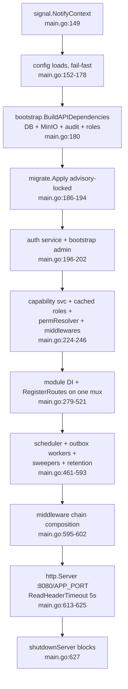
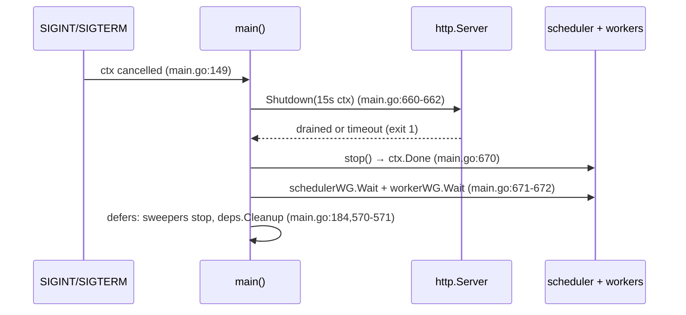

# Stage-1 Audit Artifact — HTTP Kernel (apps/api)

> Stage-1 truth map. Facts only; flags are factual observations, not redesign proposals.
> Audited: 2026-06-10. Spot-verified and extended: 2026-06-10. Docker DOWN during audit — all claims are code-read; runtime-only behavior tagged `[runtime-unverified]`.

## 1. Identity & purpose

`apps/api` is the composition root of the MetalDocs HTTP backend. It contains two binaries: `metaldocs-api` (the API server) and `metaldocs-e2e-seed` (a one-shot E2E test-account seeder). The API binary owns the full startup sequence — config load, Postgres connect, startup migrations, dependency injection of every domain module, route mounting on a single `http.ServeMux`, middleware chain composition, background goroutine launch — and the graceful shutdown path. It also owns the **tier-1 authorization truth table** (`permissions.go`): the single ordered rule list that classifies every route as public / session-required / permission-guarded and binds it to an IAM capability. No business logic lives here; everything is wiring plus boundary adapters between modules that must not import each other directly. Sibling binaries `metaldocs-jobs` (apps/jobs) and `metaldocs-worker` (apps/worker) are separate areas.

## 2. File inventory

### apps/api/cmd/metaldocs-api (the API server binary)

| File | Role |
|---|---|
| `apps/api/cmd/metaldocs-api/main.go` | Composition root: config → DB → migrations → DI of all modules → route mounts → middleware chain → server lifecycle → shutdown. Also defines 12 in-file types: 9 cross-module boundary adapters, 2 utility types (`realClock`, `realUUIDGen`), 1 struct grouping (`fanoutComponents`) (943 lines). |
| `apps/api/cmd/metaldocs-api/permissions.go` | Tier-1 route → capability/visibility truth table (`routeRules`, 286 lines); `newPermissionResolver` + `newPublicPathChecker` shared by both auth and IAM middleware. |
| `apps/api/cmd/metaldocs-api/reauth.go` | Sign-off e-signature re-auth wiring: adapts auth identity repo to the approval signature port; builds the password-reauth provider registry with in-memory failure rate limiter. |
| `apps/api/cmd/metaldocs-api/main_test.go` | Shutdown-path unit tests (server error joins scheduler, ErrServerClosed → exit 0, ctx-cancel drains workers) + guard tests for postgres-mode/fanout-URL/capability-service preconditions. |
| `apps/api/cmd/metaldocs-api/permissions_test.go` | Resolver lock tests: per-route cap/visibility table, fail-closed defaults, route-coverage fixture vs `routeRules`, methodless-write-shadowing guard, registry/seed cross-checks against `db/reference-data/0001_product_reference_data.sql`. |
| `apps/api/cmd/metaldocs-api/permissions_authz_scope_test.go` | Binds `routeRules` to the OpenAPI spec: every area-grade capability with a documented HTTP surface must declare `x-authz-area` / justified `x-authz-skip-area` (ADR 0022 Phase 7). |
| `apps/api/cmd/metaldocs-api/e2e_gate_test.go` | Locks the `METALDOCS_E2E=1` gate: only literal `"1"` mounts `/internal/test/*` handlers. |
| `apps/api/cmd/metaldocs-api/metaldocs-api.exe` | Untracked local build artifact (gitignored at `.gitignore:4`). |

### apps/api/cmd/metaldocs-e2e-seed (one-shot seeder binary)

| File | Role |
|---|---|
| `apps/api/cmd/metaldocs-e2e-seed/main.go` | Creates/resets the `e2e-admin` user with `system_admin` role and ensures the `po` profile→template default binding exists (raw SQL upsert). Postgres-mode only. |

### apps/api/internal/wiring

| File | Role |
|---|---|
| `apps/api/internal/wiring/documents.go` | `NewCapabilityChecker`: adapts `*iamapp.CapabilityService` (string capability) to `docsapp.CapabilityChecker` (typed `iamdomain.Capability`). Sole package under `apps/api/internal/`. |

### apps/api/.gocache-build

Untracked Go build cache directory (gitignored at `.gitignore:2`); not source.

## 3. Public surface

`apps/api` exports nothing importable by other modules — both `cmd` packages are `package main`, and `metaldocs/apps/api/internal/wiring` is imported only by `apps/api/cmd/metaldocs-api/main.go:40` (verified by grep; no other importer in the repo).

Routes registered **directly by the kernel** (everything else is mounted by module `RegisterRoutes` calls — owned by the respective module areas):

| Method | Path | Tier-1 binding | Registered at |
|---|---|---|---|
| GET | `/api/v1/metrics` | `metrics.view`, permission-guarded (`permissions.go:96`) | `main.go:572` |
| POST | `/internal/test/seed`, `/internal/test/reset`; GET `/internal/test/governance-events`; POST `/internal/test/advance-clock` | **Not in `routeRules`** → fail-closed session-required default; mounted only when `METALDOCS_E2E=1` (`main.go:519-521`, `internal/test/e2e_seed.go:82-97`) | `main.go:139-146` |

Note: `/internal/test/trigger-scheduler-tick` is registered only when a non-nil `runSchedulerTick` is passed (`internal/test/e2e_seed.go:95-97`); the API binary passes `nil` (`main.go:520`), so that route never exists in this binary.

The kernel's real "public surface" is the **route truth table** (`permissions.go:82-248`) consumed by both middlewares:

- **Public (no session):** `GET /api/v1/health/*`, `/healthz`, `POST /api/v1/auth/login`, `GET /api/v1/feature-flags` (`permissions.go:84-87`).
- **Session-required (no capability):** `GET /auth/me`, `POST /auth/change-password`, `POST /auth/logout` (`permissions.go:90-92`), plus *every unmatched route* via the fail-closed fallback (`permissions.go:270-279`).
- **Permission-guarded:** 95 rules binding documents, templates, taxonomy, controlled-documents, IAM (users, area-memberships, roles-capabilities, presence, observability usage/KPI), approval, audit, search, sessions/security, and metrics routes to typed capabilities (`permissions.go:94-248`). Includes PR-8 observability routes: `GET /api/v1/iam/usage` and `GET /api/v1/iam/kpi` (both `CapMetricsView`, `permissions.go:121-122`). Full table: 102 rules (95 permission-guarded + 4 public + 3 session-required). First-match-wins ordered scan (`permissions.go:261-268`); matching is string-based: exact / prefix / suffix / contains / not-suffix per rule (`permissions.go:35-55`).

## 4. Logic flows

### Flow A — Full startup sequence (metaldocs-api)

1. Install SIGINT/SIGTERM-cancelled root context — `apps/api/cmd/metaldocs-api/main.go:149-150`.
2. Load + validate config, fail-fast on each: repository mode (must be `postgres`, `main.go:152-158`, enforced by `requirePostgresRepositoryMode` at `main.go:677-682`), rate limit (`main.go:159-162`), CORS (`main.go:163-166`), attachments (`main.go:167-170`), auth runtime (`main.go:171-174`), feature flags (`main.go:175-178`).
3. Build shared dependencies via `bootstrap.BuildAPIDependencies` (`main.go:180-184`): opens Postgres (`internal/platform/bootstrap/api.go:80-82`), builds auth/IAM/audit repositories, outbox publisher, optional MinIO clients + Gotenberg PDF converter, runtime status provider (`internal/platform/bootstrap/api.go:107-125`). `deps.Cleanup` deferred (`main.go:184`).
4. Apply startup migrations unless `METALDOCS_SKIP_STARTUP_MIGRATIONS=true`; dir defaults to `db/migrations`, overridable via `METALDOCS_MIGRATIONS_DIR` (`main.go:186-194`). The applier takes a Postgres advisory lock, reads `public.schema_migrations`, executes unapplied `NNNN_*.sql` files in lexical order, and requires explicit BEGIN/COMMIT per file (`internal/platform/migrate/migrate.go:31-95`).
5. Construct auth service and bootstrap the local admin account (`main.go:196-202`).
6. Construct audit service; wire export pipeline if counters/exports exist (`main.go:204-212`); set the global tier-2 bypass audit sink so `system_admin` short-circuits are recorded (`main.go:218`, adapter at `main.go:732-771`).
7. Build the authz spine: `CapabilityService` (`main.go:224-230`, also wired as capability-hint provider into auth responses at `main.go:229`), TTL-cached role provider (`main.go:231`, TTL from `authn.CacheTTL()` = `METALDOCS_AUTHZ_CACHE_TTL_SECONDS`, default 30s — `internal/platform/authn/config.go:25-35`), the shared permission resolver (`main.go:236`), auth middleware with injected public-path checker (`main.go:237-238`), IAM middleware with injected resolver (`main.go:239-240`), origin protection (`main.go:241-246`).
8. Mount module routes on one `http.ServeMux` (`main.go:279-294`): auth, health, feature-flags, audit, search, IAM admin, sessions (nil-guarded), security (nil-guarded), observability/`ObservabilityHandler` for PR-8 usage+KPI (nil-guarded, `main.go:267-273, 292-294`); then presence hub + handler (`main.go:302-312`), taxonomy (`main.go:314-315`), controlled-documents (`main.go:317-318`), area-membership service with role-cache invalidator (`main.go:321-327`, from `b576951e2`), people handler (`main.go:334-339`), membership handler (`main.go:345`), roles-caps matrix (`main.go:348-352`).
9. Build the documents/fanout stack: presigner (`main.go:356`), fanout client gated on `METALDOCS_FANOUT_URL` + `METALDOCS_DOCX_RENDERER_SERVICE_TOKEN` (`main.go:360-369`; missing fanout URL is fatal via `requireApprovalRuntimeSupport`, `main.go:363-365` / `717-722`), freeze service + PDF dispatch adapter (`main.go:370-395`), documents `Dependencies` struct with capability checker from `apps/api/internal/wiring/documents.go:28-30` (`main.go:397-427`).
10. Build approval services before the documents module so `SubmitSvc` can be injected into finalize→submit (`main.go:429-433, 498`): River schema migration + insert-only client bundle for scheduled publish (`main.go:438-451`), freeze-service presence is mandatory (`main.go:452-454`), PDF + materialize outbox repos/workers (`main.go:455-492`), decision service with PDF outbox, pin invoker and the sign-off re-auth registry from `apps/api/cmd/metaldocs-api/reauth.go:44-52` (`main.go:494-497`).
11. Mount documents module (`main.go:500-501`); close the modular cycle by injecting the documents-side initializer back into controlled-documents for atomic CD-create (`main.go:507`); mount templates (`main.go:509-513`), approval handler with idempotency stores (`main.go:514-518`), gated E2E handlers (`main.go:519-521`).
12. Register leased scheduler jobs gated per `ENABLE_JOB_*` env (`main.go:523-559`); start scheduler goroutine (`main.go:561-566`); start documents session/orphan sweepers (`main.go:568-571`); mount `/api/v1/metrics` (`main.go:572`); start optional audit-retention purge loop (`main.go:574-593`).
13. Compose the middleware chain (`main.go:595-602`), resolve listen address (`:8080` default, `APP_PORT` override — `main.go:604-611`; the canonical dev script sets `APP_PORT=8081`, `scripts/start-api.ps1:241`), build `http.Server` with `ReadHeaderTimeout: 5s` only (`main.go:613-617`), log startup summary (`main.go:619-620`), serve in a goroutine feeding `serverErr` (`main.go:622-625`), then block in `shutdownServer` (`main.go:627`).



### Flow B — Request path through the middleware chain

Composition (`main.go:598-602`), outermost → innermost:

```
cors → originProtection → authMiddleware (authn) → iamMiddleware (tier-1 authz) → presenceBump → httpObs → rateLimiter → mux
```



```mermaid
flowchart LR
    REQ([Request]) --> CORS[CORS<br/>security/cors.go:50]
    CORS --> ORIG[Origin protection<br/>origin_protection.go:47]
    ORIG --> AUTHN[AuthN: session cookie → identity<br/>auth/delivery/http/middleware.go:49]
    AUTHN --> IAM[IAM tier-1: visibility + capability<br/>iam/delivery/http/middleware.go:53]
    IAM --> BUMP[Presence bump last_seen_at<br/>presence/middleware.go:67]
    BUMP --> OBS[HTTP observability<br/>observability/http.go:59]
    OBS --> RL[Rate limiter identity-keyed<br/>security/ratelimit.go:88]
    RL --> MUX[ServeMux → module handler]
```

1. **CORS** (`internal/platform/security/cors.go:50-95`): no-op when `METALDOCS_CORS_ENABLED` ≠ true or no `Origin` header; disallowed origin → 403 `problem+json`; OPTIONS preflight answered with 204 and never reaches inner layers.
2. **Origin protection** (`internal/platform/security/origin_protection.go:47-83`): applies only to POST/PUT/PATCH/DELETE carrying the session cookie; validates `Origin`/`Referer` against same-origin (X-Forwarded-Proto honored only from `METALDOCS_TRUSTED_PROXY_CIDRS`, `origin_protection.go:110-128`) or `METALDOCS_AUTH_TRUSTED_ORIGINS`; failure → 403. Enabled by `METALDOCS_AUTH_ORIGIN_PROTECTION_ENABLED` (defaults to `authn.Enabled()`, `internal/platform/authn/config.go:141`).
3. **AuthN** (`internal/modules/auth/delivery/http/middleware.go:49-89`): whole layer is identity (no-op when `authn.Enabled()` is false — permitted only with `APP_ENV=local`, `internal/platform/authn/config.go:39-41`). Public paths (per the kernel's resolver, injected at `main.go:237-238`) skip straight through. Otherwise: session cookie required (`middleware.go:60-64`), `ResolveSession` (`middleware.go:66-75`), must-change-password fence (`middleware.go:76-79`), then context enriched with CurrentUser + IAM auth context + tenant ID, and the client-supplied `X-Tenant-ID` header stripped (`middleware.go:81-87`).
4. **IAM tier-1 authz (PEP)** (`internal/modules/iam/delivery/http/middleware.go:53-130`): strips `X-User-ID`/`X-User-Roles` (`:59-60`), fails closed on nil resolver (`:63-66`); resolves `(capability, visibility)` from the kernel table; public → pass; userID/tenantID must come from session context only (`:85-98`); session-required → role enrichment only (`:102-109`); permission-guarded → `CapabilityService.CanDo` (PDP) else 403 `AUTH_FORBIDDEN` (`:114-122`). Tier-2 (area-scoped) authz happens inside module transactions, not here (per `wiki/standards/backend-canon.md` vocabulary).
5. **Presence bump** (`internal/modules/iam/presence/middleware.go:67-99`): if a user ID is in context, fire-and-forget goroutine updates `iam_users.last_seen_at`, debounced 60s/user (`presence/model.go:27`), 2s DB timeout (`middleware.go:47-49`). Wrapped into the chain only when SQL DB exists (`main.go:599-601`).
6. **HTTP observability** (`internal/platform/observability/http.go:59-107`): resolves/creates `X-Trace-Id` into context, measures status + duration, aggregates per-route RED metrics with p50/p95/p99 ring buffers (`http.go:266-301`), emits one JSON `http_request` log line per request.
7. **Rate limiter** (`internal/platform/security/ratelimit.go:88-109`): skips health endpoints (`:177-179`); identity = session user, else client IP via trusted-proxy resolution (`:181-192`); fixed-window counters in-memory, 100k-entry cap that **denies new identities when full** (fail-closed, `:23, :121-127`); over-limit → 429 + `Retry-After`.
8. **Mux dispatch** to module handlers; module errors surface as RFC 9457 `application/problem+json` (`internal/platform/problem/problem.go:76-83`).

Consequence of order (factual, matches RF-2 in `wiki/architecture/backend-target-architecture.md:296`): requests rejected by CORS, origin protection, or authn are **never counted** by httpObs metrics nor rate-limited, because those layers sit outside both. Rate limiting is identity-keyed and post-auth; `/auth/login` has no pre-auth IP-keyed limit tier (login throttling exists separately as account lockout: `METALDOCS_AUTH_LOGIN_MAX_FAILED_ATTEMPTS`/`_LOCK_MINUTES`, `internal/platform/authn/config.go:88-104`).

### Flow C — Tier-1 permission resolution (the kernel's own logic)

1. Both middlewares share one resolver instance created at `main.go:236` — single source of truth, by design (`main.go:232-235`).
2. `newPermissionResolver` (`permissions.go:250-259`) scans `routeRules` (`permissions.go:82-248`) in declared order; first match wins (`permissions.go:261-268`). Rule fields AND-ed: method, pathExact, pathPrefix, pathSuffix, contains, notSuffix (`permissions.go:24-55`).
3. Order is load-bearing: e.g. approval route-admin rules (`CapRouteManage`, `permissions.go:221-223`) MUST precede the generic `/api/v1/approval/` block (`permissions.go:226-229`) to avoid the F4 tier-1/tier-2 divergence; PeopleHandler exact rules precede the `PATCH /iam/users/` prefix rule (`permissions.go:104-115`).
4. No match → `resolvePermissionFallback` returns `("", VisibilitySessionRequired)` — fail-closed; a forgotten route 401s instead of going public (`permissions.go:270-279`).
5. `newPublicPathChecker` derives the authn bypass list from the same table: public ⇔ `VisibilityPublic` (`permissions.go:281-286`).
6. CI locks: per-route expectations (`permissions_test.go:17-144`), registered-route coverage (`permissions_test.go:193-315`), no methodless write shadowing (`permissions_test.go:336-389`), every cap in the typed registry (`permissions_test.go:503-515`), every cap seeded or deferred against `db/reference-data/0001_product_reference_data.sql` (`permissions_test.go:610-632`), viewer holds no area-grade cap (`permissions_test.go:589-602`), and spec `x-authz-area` annotations for area-grade caps (`permissions_authz_scope_test.go:102-142`).

### Flow D — Graceful shutdown

1. `shutdownServer` (`main.go:643-675`) blocks on either a `ListenAndServe` error or root-context cancellation (SIGINT/SIGTERM) (`main.go:651-658`). A genuine listen error (non-`ErrServerClosed`) sets exit code 1.
2. Both paths run the same teardown: `server.Shutdown` with a fresh 15s timeout context (`main.go:660-669`); incomplete drain → exit code 1.
3. `stop()` cancels the root context (`main.go:670`), which terminates: scheduler loop, both outbox workers, presence hub Run/RunHeartbeat, bump cleanup, sweepers, retention ticker.
4. Join order: `schedulerWG.Wait()` then `workerWG.Wait()` (`main.go:671-672`). Sweeper stop functions run via defers (`main.go:570-571`); `deps.Cleanup()` (DB close) via defer at `main.go:184`.
5. Non-zero exit calls `deps.Cleanup()` explicitly before `os.Exit` because `os.Exit` skips defers (`main.go:628-635`).
6. Regression locks: server-error path must still join the scheduler (C3, `main_test.go:19-56`); `ErrServerClosed` → exit 0 (`main_test.go:61-76`); ctx-cancel drains workers (`main_test.go:80-108`).



### Flow E — metaldocs-e2e-seed (one-shot)

1. Requires postgres mode (`apps/api/cmd/metaldocs-e2e-seed/main.go:32-38`).
2. `ensurePODefaultTemplateBinding`: opens its **own** DB connection, verifies `metaldocs.document_template_versions` has `po/po-default-canvas/v1`, then `INSERT ... ON CONFLICT DO NOTHING` into `metaldocs.document_profile_template_defaults` (`main.go:97-156`).
3. Rebuilds full API dependencies (second DB pool) (`main.go:52-56`), creates or resets the `e2e-admin` user with password from `METALDOCS_E2E_ADMIN_PASSWORD` (default `E2eAdmin123!`) (`main.go:63-88`, `158-166`), and ensures the `system_admin` role (`main.go:90-92`).

## 5. Dependencies

### Outbound (what apps/api imports and why)

Verified from import blocks `apps/api/cmd/metaldocs-api/main.go:20-81`, `permissions.go:7-9`, `reauth.go:7-8`, `wiring/documents.go:6-8`, `cmd/metaldocs-e2e-seed/main.go:10-18`.

| Import group | Packages | Why |
|---|---|---|
| Domain modules — documents | `internal/modules/documents{,/application,/repository,/jobs}`, `documents/approval/{application,http,infrastructure,jobs,repository}`, `documents/approval/infrastructure/signature` | Documents + approval DI, sweepers, sign-off re-auth registry |
| Domain modules — IAM/auth/security | `internal/modules/iam/{application,authz,delivery/http,domain,infrastructure/postgres,presence}`, `internal/modules/auth/{application,delivery/http,domain,infrastructure/postgres}`, `internal/modules/security/{application,delivery/http,infrastructure/postgres}` | Authn middleware, tier-1 PEP, capability PDP, presence, sessions/security tabs |
| Domain modules — others | `internal/modules/{audit/...,search/...,taxonomy/...,controlleddocuments/...,templates/...}` | Module DI + route mounting |
| Jobs | `internal/modules/jobs/{scheduler,idempotency_janitor,stuck_instance_watchdog,audit_integrity_validator}` | Leased recurring jobs |
| Render | `internal/modules/render/{fanout,resolvers}` | Freeze/fanout/PDF-dispatch + placeholder resolvers |
| Platform | `internal/platform/{authn,bootstrap,config,docgenv2,featureflags,formval,httpclient,jobs/river,migrate,objectstore,observability,requesttrace,security,db/postgres,tenant}` | Config, DI bootstrap, migrations, middleware primitives, trace IDs, presigners |
| Test | `internal/test` (`e2etest`) | Gated E2E handlers |
| External | `github.com/google/uuid` (main), `gopkg.in/yaml.v3` (spec test), `github.com/riverqueue/river` (transitively via config/jobs) | IDs, spec parsing, job queue config |

### Inbound (who imports apps/api)

None. Both binaries are `package main`; `metaldocs/apps/api/internal/wiring` is imported solely by `apps/api/cmd/metaldocs-api/main.go:40` (grep-verified across all `*.go` in the repo).

## 6. Persistence

The kernel is mostly persistence-free wiring, with these direct touches:

- **Migrations ledger:** `migrate.Apply` reads `public.schema_migrations` and executes files from `db/migrations` under advisory lock `0x4D444D4947528000` (`internal/platform/migrate/migrate.go:24, 41-48, 101-119`), invoked at `main.go:191`.
- **River schema:** `bootstrap.MigrateRiverSchema` migrates the River job-queue schema (`METALDOCS_JOBS_RIVER_SCHEMA`) at `main.go:439` (`internal/platform/bootstrap/jobs.go:68`).
- **Audit retention (raw SQL in the kernel):** daily `DELETE FROM metaldocs.audit_events WHERE occurred_at < $1` when `AUDIT_RETENTION_DAYS > 0` (`main.go:585-587`).
- **e2e-seed raw SQL:** SELECT on `metaldocs.document_template_versions`, INSERT-on-conflict into `metaldocs.document_profile_template_defaults` (`apps/api/cmd/metaldocs-e2e-seed/main.go:117-153`).
- Everything else goes through module repositories constructed here but owned elsewhere (e.g. `iam_users.last_seen_at` via presence repo, `main.go:302-312`; job leases via `metaldocs.job_leases`, `internal/modules/jobs/scheduler/integration_test.go:127`).

## 7. Config & environment

All consumed by the API binary at startup; parse sites anchored.

| Variable | Default | Parsed at | Effect |
|---|---|---|---|
| `METALDOCS_REPOSITORY` | `memory` (but API **requires** `postgres`) | `internal/platform/config/repository.go:15`; enforced `main.go:156-158` | Repo mode; non-postgres is fatal |
| `DATABASE_URL` / `PGHOST,PGPORT,PGDATABASE,PGUSER,PGPASSWORD,PGSSLMODE` | — | `internal/platform/config/postgres.go:16-29` | Postgres DSN |
| `METALDOCS_SKIP_STARTUP_MIGRATIONS` | false | `main.go:186` | Skip startup migrations |
| `METALDOCS_MIGRATIONS_DIR` | `db/migrations` | `main.go:187-190` | Migrations dir |
| `METALDOCS_AUTH_ENABLED` | true | `internal/platform/authn/config.go:17-23` | Master authn/authz switch; false only allowed with `APP_ENV=local` (`config.go:39-41`) |
| `METALDOCS_AUTH_SESSION_SECRET` | required when auth on | `authn/config.go:48-51` | Session HMAC secret |
| `METALDOCS_AUTH_SESSION_COOKIE_NAME` | `metaldocs_session` | `authn/config.go:53-56` | Cookie name (also used by origin protection) |
| `METALDOCS_AUTH_SESSION_TTL_HOURS` / `_IDLE_MINUTES` | 12h / 0 (idle disabled) | `authn/config.go:58-77` | Absolute + sliding session expiry |
| `METALDOCS_AUTH_PASSWORD_MIN_LENGTH`, `_LOGIN_MAX_FAILED_ATTEMPTS`, `_LOGIN_LOCK_MINUTES` | 8 / 5 / 15 | `authn/config.go:79-104` | Password + lockout policy |
| `METALDOCS_BOOTSTRAP_ADMIN_{ENABLED,USER_ID,USERNAME,DISPLAY_NAME,EMAIL,PASSWORD}` | enabled iff `APP_ENV=local`; `admin-local`/`admin`/`Administrator` | `authn/config.go:106-118,136-137,145-147` | Local admin bootstrap (`main.go:200-202`) |
| `METALDOCS_AUTH_COOKIE_SECURE` | true unless `APP_ENV=local` | `authn/config.go:139` | Cookie Secure flag |
| `METALDOCS_AUTH_TRUSTED_ORIGINS` | — | `authn/config.go:140` | Origin-protection allowlist |
| `METALDOCS_AUTH_ORIGIN_PROTECTION_ENABLED` | `authn.Enabled()` | `authn/config.go:141` | Origin-protection switch |
| `METALDOCS_TRUSTED_PROXY_CIDRS` | empty (trust nobody) | `internal/platform/config/trusted_proxy.go:14` | X-Forwarded-* trust |
| `METALDOCS_AUTHZ_CACHE_TTL_SECONDS` | 30 | `authn/config.go:25-35` | Cached role provider TTL (`main.go:231`) |
| `METALDOCS_RATE_LIMIT_{ENABLED,WINDOW_SECONDS,MAX_REQUESTS}` | disabled | `internal/platform/config/ratelimit.go:22-34` | Fixed-window limiter |
| `METALDOCS_CORS_{ENABLED,ALLOWED_ORIGINS,ALLOWED_METHODS,ALLOWED_HEADERS,EXPOSED_HEADERS,ALLOW_CREDENTIALS,MAX_AGE_SECONDS}` | disabled | `internal/platform/config/cors.go:20-35` | CORS layer |
| `METALDOCS_STORAGE_PROVIDER`, `METALDOCS_MINIO_*`, `METALDOCS_ATTACHMENTS_*`, `APP_ENV` | — | `internal/platform/config/attachments.go:43-93` | Object storage |
| `METALDOCS_GOTENBERG_URL` | disabled | `internal/platform/config/gotenberg.go:18` | PDF converter + health check |
| `METALDOCS_FANOUT_URL` | **required** (fatal if empty) | `main.go:362-365, 717-722` | docx-renderer fanout; freeze support |
| `METALDOCS_DOCX_RENDERER_SERVICE_TOKEN` | required when fanout set | `main.go:366-369` | Service-to-service token |
| `METALDOCS_JOBS_RIVER_SCHEMA`, `METALDOCS_JOBS_ENABLED`, `METALDOCS_JOBS_TEMPORAL_MAX_WORKERS` | —/true/10 | `internal/platform/config/jobs.go:19-40` | River queue config (`main.go:434-451`) |
| `ENABLE_JOB_STUCK_INSTANCE_WATCHDOG`, `ENABLE_JOB_IDEMPOTENCY_JANITOR`, `ENABLE_JOB_AUDIT_INTEGRITY_VALIDATOR`, `ENABLE_JOB_LEASE_REAPER` | **enabled unless explicitly `false`** | `main.go:528-559, 835-837` | Scheduler job gates |
| `AUDIT_RETENTION_DAYS` | 0 (disabled) | `main.go:575` | Daily audit purge |
| `APP_PORT` | 8080 | `main.go:604-611` | Listen port (dev script sets 8081, `scripts/start-api.ps1:241`) |
| `METALDOCS_E2E` | unset; only literal `"1"` enables | `main.go:135-137` | Mounts `/internal/test/*` |
| `METALDOCS_MDDM_NATIVE_EXPORT_ROLLOUT_PCT` | — | `internal/platform/config/feature_flags.go:24` | Feature-flag payload |
| `METALDOCS_DEV_USER_ROLES` | — | `authn/config.go:153-158` | Memory-mode role map (not used by API binary; used by bootstrap memory branch) |
| `METALDOCS_E2E_ADMIN_{USER_ID,USERNAME,EMAIL,DISPLAY_NAME,PASSWORD}` | `e2e-admin`/…/`E2eAdmin123!` | `apps/api/cmd/metaldocs-e2e-seed/main.go:158-166` | Seeder identity |

## 8. Concurrency & async

All goroutines launched by the kernel, with lifecycle:

| Goroutine | Started at | Cadence / trigger | Stops via |
|---|---|---|---|
| Presence hub `Run` | `main.go:306` | room tick 15s (`presence/model.go:43`) | root ctx |
| Presence hub `RunHeartbeat` | `main.go:307` | 30s (`presence/model.go:33`, `presence/hub.go:237-238`) | root ctx |
| Presence bump cleanup | `main.go:310` → `presence/middleware.go:108-129` | every 5min, TTL 10min | root ctx |
| Per-request presence bump | `presence/middleware.go:92-98` | fire-and-forget per debounced user | 2s timeout ctx |
| PDF outbox worker | `main.go:488-489` | `fanout.NewPDFOutboxWorker.Run`; restart wrapper with 1s→1min exponential backoff (`main.go:461-486`) | root ctx; joined by `workerWG` |
| Materialize outbox worker | `main.go:491-492` | same harness | root ctx; `workerWG` |
| Job scheduler | `main.go:561-566` | leased jobs: stuck-instance-watchdog 5min, idempotency-janitor 15min, audit-integrity-validator 1h, lease-reaper 10min; all `SkipOnPressure` (`main.go:528-559`); leader ID = `hostname:pid` (`main.go:839-845`) | root ctx; `schedulerWG` |
| Documents session sweeper | `main.go:568` | 60s | returned stop func (deferred `main.go:570`) |
| Orphan pending sweeper | `main.go:569` | 1h interval, 24h max age | stop func (deferred `main.go:571`) |
| Audit retention purge | `main.go:576-592` | 24h ticker | root ctx |
| `server.ListenAndServe` | `main.go:622-625` | — | `server.Shutdown` via `serverErr` channel |

Synchronization: `workerWG` (`main.go:461`), `schedulerWG` (`main.go:561`), buffered `serverErr` channel (`main.go:622`); shutdown join order in Flow D. Outbox **writes** happen in module transactions; the kernel only hosts the relay workers (`main.go:488-492`).

## 9. Error handling & observability

- **Startup:** every config/wiring failure is `log.Fatalf` — fail-fast, no degraded boot (`main.go:154-201, 364-368, 437-453, 511, 526`). Hard invariants panic in constructors (`main.go:94-95, 737-739, 778-780`).
- **Request errors:** all middleware rejections are RFC 9457 `application/problem+json` (`internal/platform/problem/problem.go:76-83`) with stable codes: `AUTH_UNAUTHORIZED`, `AUTH_PASSWORD_CHANGE_REQUIRED` (auth middleware), `AUTH_FORBIDDEN`, `INTERNAL_ERROR` (IAM middleware), `FORBIDDEN_ORIGIN` (CORS/origin), `RATE_LIMITED` + `Retry-After` (limiter).
- **Tracing:** `X-Trace-Id` normalized or generated per request and stored in context (`internal/platform/observability/http.go:61-65`); the kernel's audit adapters propagate it into audit rows via `requesttrace.Resolve` (`main.go:768, 801, 824, 831-833`).
- **Metrics:** in-process per-route RED aggregation with p50/p95/p99, exposed as JSON at `GET /api/v1/metrics` (`main.go:572`, `observability/http.go:109-124`). No Prometheus/OTLP exporter is wired in this binary (matches RF-1 in `wiki/architecture/backend-target-architecture.md:295`).
- **Logging:** mixed — `log.Printf/Fatalf` during startup (`main.go:619, 154-201`), `slog` for runtime events (`main.go:141-144, 472, 588, 668-673`), and a dedicated JSON `slog` handler inside httpObs (`observability/http.go:53`).
- **Health:** `/api/v1/health/live`, `/api/v1/health/ready`, `/healthz` (alias of live) via the runtime status provider (`internal/platform/observability/health.go:16-20`); readiness delegates to the Postgres-backed provider with dependency checks incl. Gotenberg (`internal/platform/bootstrap/api.go:118, 187-216`).
- **Audit:** kernel adapters write document and authz-bypass audit events, in-tx where available (`main.go:743-771, 784-829`); fire-and-forget `Write` logs failures and continues (`main.go:826-828`).

## 10. Legacy / duplication / smell flags

- **God file:** `apps/api/cmd/metaldocs-api/main.go` is 943 lines — composition root + 12 in-file type declarations (9 boundary adapter types, 2 utility types, 1 struct grouping, `main.go:83-128, 713-943`) + inline background loops; exceeds the >500-line threshold for a single file. (medium)
- **Middleware order vs canon (known RF-2):** `httpObs` and `rateLimiter` are innermost (`main.go:598-602`) — 401/403/CORS rejects are invisible to RED metrics and rate limiting; no pre-auth IP-keyed limit tier for `/api/v1/auth/login`. Matches REQ-MW-4/REQ-MW-5 deviations registered as RF-2 (`wiki/architecture/backend-target-architecture.md:85-88, 296`). (high — already registered)
- **No panic-recovery or request-ID middleware at the outermost layer** (REQ-MW-1/REQ-MW-2; trace ID is created only inside httpObs at `observability/http.go:61-65`, inside auth): a panic in any middleware or handler crashes the connection with no problem+json or tagged log line. Part of RF-2. (medium)
- **No chain-order test:** the composed handler order (`main.go:598-602`) is not asserted by any test (REQ-MW-7, `backend-target-architecture.md:88`); reordering compiles and ships silently. (medium)
- **Server timeouts incomplete:** `http.Server` sets only `ReadHeaderTimeout: 5s` (`main.go:613-617`); no `ReadTimeout`, `WriteTimeout`, or `IdleTimeout` — slow-body/slow-read clients hold connections indefinitely. Matches RF-9 (timeout audit) in `backend-target-architecture.md:303`. (medium)
- **Stale security comments contradicting current fail-closed behavior:** `main.go:130-137` and `e2e_gate_test.go:9-13` claim an accidental `/internal/test/*` mount would be "treated as fully public by newPublicPathChecker" — but the resolver's unmatched default is `VisibilitySessionRequired` (`permissions.go:270-279`) and `newPublicPathChecker` returns true only for `VisibilityPublic` (`permissions.go:281-286`), so such routes would require a session, not be public. Comments describe the pre-C2 world. (low)
- **Stale `file:line` anchors in test comments:** `permissions_test.go:202-298` cites `main.go:212/213/214/215/216/217/224/231/238/379/393/396/447` for `RegisterRoutes` call sites; actual sites are `main.go:280-294, 315, 318, 345, 501, 513, 518, 572`. `permissions_test.go:428` cites `permissions.go:225-233` for area-membership rules; actual `permissions.go:202-206`. (info)
- **Vestigial control flow:** `resolvePermissionFallback` is a `switch` with only `default` and a discarded `path` parameter (`permissions.go:270-279`) — leftover scaffolding from removed path-based fallbacks (table moved into composition root 2026-03-18, commit 78e0aea12). (info)
- **Raw SQL + module responsibility in the composition root:** the audit retention loop embeds `DELETE FROM metaldocs.audit_events` directly in `main.go:585-587` instead of the audit module owning its retention; env var `AUDIT_RETENTION_DAYS` also lacks the `METALDOCS_` prefix (`main.go:575`). (low)
- **Env naming/semantics drift:** `ENABLE_JOB_*` gates lack the `METALDOCS_` prefix and are *enabled by default unless explicitly `false`* (`main.go:835-837`) — the `ENABLE_` name suggests opt-in but the semantic is opt-out; inconsistent with the `METALDOCS_*`-prefixed rest of the config surface. (low)
- **Duplicate repository construction:** `docrepo.NewSnapshotRepository(deps.SQLDB)` is constructed three times in one function (`main.go:372, 398, 420`). (info)
- **Public-path fallback duplication:** `defaultPublicPaths` in the auth middleware (`internal/modules/auth/delivery/http/middleware.go:94-105`) is a second, drifted copy of the kernel's public list — it treats `POST /api/v1/auth/logout` as public while `routeRules` classifies it session-required (`permissions.go:92`), and omits `/healthz` + `/feature-flags`. Reachable only when `WithPublicPathChecker` is not injected (tests/other composition roots). (low)
- **Legacy-labeled route block still live:** the generic `/api/v1/approval/` rules are commented "Approval (legacy mount)" (`permissions.go:225-229`) yet remain the live tier-1 classification for approval instance routes. (info)
- **Self-acknowledged temporary coupling:** `routeRules` "intentionally couples startup route registration and authz classification until the app has generated route metadata" (`permissions.go:58-63`) — a TODO-grade marker on the central authz surface; the table is order-sensitive string matching (prefix/suffix/contains) guarded only by tests. (medium)
- **e2e-seed opens two DB pools:** `ensurePODefaultTemplateBinding` opens its own connection (`apps/api/cmd/metaldocs-e2e-seed/main.go:104-114`) before `BuildAPIDependencies` opens a second (`main.go:52-56`). (info)
- **Build artifacts inside the source tree:** `apps/api/cmd/metaldocs-api/metaldocs-api.exe` and `apps/api/.gocache-build/` exist on disk (untracked; gitignored at `.gitignore:2,4`). (info)

## 11. Wiki drift

No existing doc. No wiki page is dedicated to the HTTP kernel/composition root. Cross-checks performed against passing references:

- `wiki/architecture/backend-blueprint.md:78` anchors the chain at `main.go:595-602` and its §3 Mermaid order (CORS → origin → authn → IAM → presence → httpObs → rate limiter → mux) — verified **accurate** against `main.go:598-602`.
- `wiki/architecture/backend-target-architecture.md:85, 296` (RF-2 claims about current wiring) — verified accurate.

## 12. Open questions

- `[runtime-unverified]` Readiness probe depth: `Ready` delegates to `observability.NewPostgresRuntimeStatusProvider` with the Gotenberg dependency check (`internal/platform/bootstrap/api.go:118, 187-216`); actual probe payload/status codes under dependency failure were not exercised (Docker down).
- `[runtime-unverified]` Outbox worker restart behavior under sustained DB failure (backoff loop `main.go:466-484`) — code-read only; the 1s→1min cap was not observed live.
- `[runtime-unverified]` Whether `server.Shutdown`'s 15s budget suffices for the presence WebSocket stream (`/api/v1/iam/presence/stream`) — long-lived connections are not tracked by `Shutdown`'s graceful drain semantics for hijacked conns; behavior at SIGTERM with open sockets unobserved.
- Genuine unknown: the `metaldocs-jobs` binary (`apps/jobs/cmd/metaldocs-jobs/main.go`) also registers scheduler jobs ("scheduled publish ownership lives in metaldocs-jobs", `scripts/start-api.ps1:332`). Which leased jobs are intended to run in the API process vs the jobs process is not declared anywhere in `apps/api`; the API registers watchdog/janitor/validator/reaper (`main.go:528-559`) gated only by env defaults that are ON. Cross-binary lease contention is resolved at the `job_leases` table level, but the intended ownership split is undocumented in this area.
- Genuine unknown: whether any deployment sets `METALDOCS_RATE_LIMIT_ENABLED=true` / `METALDOCS_CORS_ENABLED=true` — both default off (`internal/platform/config/ratelimit.go:22`, `cors.go:20`), so in a default environment the outermost two layers and the innermost layer of the chain are no-ops.
