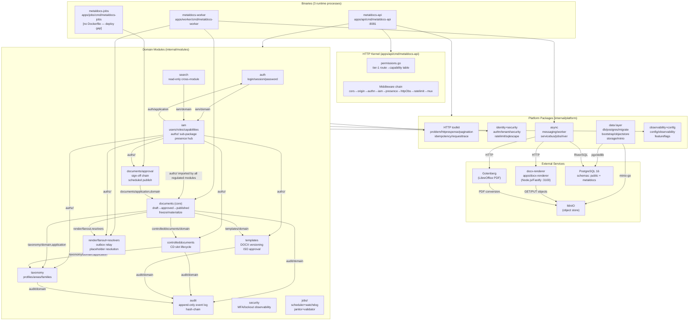
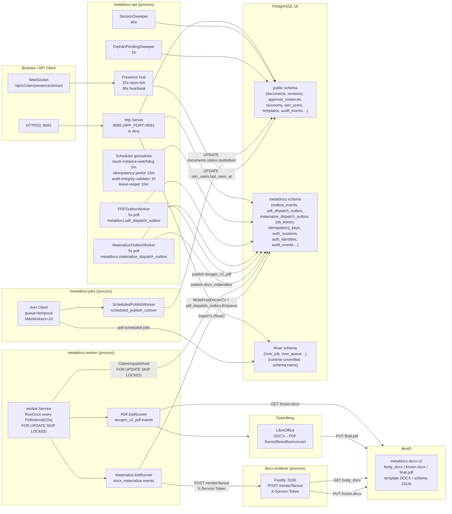

# Stage-1 Synthesis — Backend Composition Map

> **Produced:** 2026-06-10
> **Author:** Stage-1 composition-synthesis agent
> **Source artifacts:** 19 Stage-1 audit artifacts under `wiki/backend/_artifacts/stage1/`
> **Status:** Read-only truth map. Every factual claim carries a file:line anchor derived from the source artifacts or verified by grep. Runtime-only behavior tagged `[runtime-unverified]`.

---

## 1. Full Dependency Matrix: Domain Modules × Platform Packages

Each cell is `Y` (confirmed import), `-` (no import), or `(test)` (test-only). Verification method: direct artifact reading plus targeted grep spot-checks against the live codebase.

### 1.1 Platform HTTP Toolkit

| Module | `authn` | `tenant` | `httpresponse` | `problem` | `pagination` | `idempotency` | `requesttrace` | `useragent` | `httpclient` | `formval` |
|---|---|---|---|---|---|---|---|---|---|---|
| audit | Y | Y | Y | Y | Y | - | - | - | - | - |
| auth | Y | Y | Y | Y | - | - | Y | - | - | - |
| controlleddocuments | Y | Y | Y | Y | - | Y | - | - | - | - |
| documents (core+approval) | Y | Y | Y | Y | Y | Y | - | - | - | Y |
| iam | Y | Y | Y | Y | - | - | - | Y | - | - |
| search | Y | Y | Y | - | - | - | - | - | - | - |
| security | - | Y | Y | Y | - | - | - | - | - | - |
| taxonomy | Y | Y | Y | Y | - | - | - | - | - | - |
| templates | - | Y | Y | Y | - | Y | - | - | - | - |

**Anchor evidence (representative cells):**
- `audit` × `authn`: `module-audit.md §5` lists `authn` in platform deps; confirmed grep `audit/delivery/http/handler.go` imports `platform/authn`
- `audit` × `pagination`: `module-audit.md §5`; `audit/infrastructure/postgres/writer.go` uses `pagination.DecodeCursor`
- `controlleddocuments` × `idempotency`: `module-controlled-documents.md §5`; `controlleddocuments/delivery/http/routes.go` wires `idempotency.Require`
- `documents` × `formval`: `http-kernel.md §5`; injected as `documents.Dependencies.FormVal` (`main.go:397-427`)
- `iam` × `useragent`: `platform-http-toolkit.md §5`; `iam/delivery/http/sessions_handler.go` only consumer
- `security` × `authn`: no import — confirmed by `module-security.md §5` ("no imports from other domain modules"); `security` reads shared DB tables directly, skips `authn` context
- `templates` × `pagination`: no import — `platform-http-toolkit.md §10` flags templates uses legacy offset-based pagination with a `TODO(pagination)` comment at `templates/delivery/http/routes_query.go:222`

### 1.2 Platform Identity, Tenancy & Security

| Module | `security` (platform) | `ratelimit` (platform) | `sqlescape` |
|---|---|---|---|
| audit | - | - | Y |
| auth | Y (ClientIP) | - | - |
| controlleddocuments | - | - | - |
| documents | - | Y (RegisterRoutesWithRateLimit, unactivated) | - |
| iam | - | - | - |
| search | - | - | - |
| security (module) | - | - | - |
| taxonomy | - | - | - |
| templates | - | - | - |

**Notes:**
- `sqlescape` has exactly one production consumer: `audit/infrastructure/postgres/writer.go` (`platform-identity-tenancy.md §5`)
- `platform/ratelimit` wiring in `documents/module.go:118-119` passes `nil, nil` to `buildLegacyMux` — not activated in production (`platform-identity-tenancy.md §10`)
- `platform/security.RateLimiter` is used by `main.go` as the global mux wrapper, but imports `auth/domain` and `iam/domain` — a platform→domain layering violation (`platform-identity-tenancy.md §10`)

### 1.3 Platform Data Layer

| Module | `db/postgres` | `migrate` | `bootstrap` | `objectstore` | `storage/minio` | `messaging` |
|---|---|---|---|---|---|---|
| Any module | - | - | - | - | - | - |
| apps/api | - | Y (via main) | Y | Y | - | - |
| apps/worker | - | - | Y | - | Y (via bootstrap) | Y |
| apps/jobs | - | - | Y | - | - | - |

**Note:** Domain modules do NOT import data-layer platform packages directly. All Postgres and MinIO wiring flows through `bootstrap`, which is imported only by the three binary `main` packages. (`platform-data-layer.md §5`)

### 1.4 Platform Async / Messaging

| Module/Binary | `platform/messaging` | `platform/worker` | `platform/servicebus` | `platform/jobs/river` | `platform/render/gotenberg` |
|---|---|---|---|---|---|
| render/fanout | Y | - | - | - | - |
| documents/application | Y (export_service) | - | - | - | - |
| apps/api | Y (via bootstrap) | - | Y (via bootstrap) | Y | Y (via bootstrap) |
| apps/worker | Y | Y | Y | - | Y (via bootstrap) |
| apps/jobs | - | - | - | Y | - |

---

## 2. Inter-Module Dependency Graph and Direction Violations

### 2.1 Established import edges (production, non-test, verified by artifact reading and grep)

```
auth  ──imports──► iam/domain         (roles, RoleProvider, WithAuthContext)
auth  ──imports──► audit/domain       (write login events)
iam   ──imports──► auth/application   (session resolution for sessions tab)
iam   ──imports──► auth/domain        (CurrentUser type)
iam   ──imports──► auth/infrastructure/postgres  ◄── VIOLATION (delivery layer crosses to infra)
documents ──imports──► iam/authz      (35 production files; verified grep)
documents ──imports──► iam/domain     (UserID, Role types)
documents ──imports──► iam/application (CapabilityService)
documents ──imports──► controlleddocuments/domain  (CD slot reference in documents)
documents ──imports──► taxonomy/domain (profile/area FK)
documents ──imports──► taxonomy/application (area lookup)
documents ──imports──► templates/domain (template snapshot)
documents ──imports──► render/fanout  (freeze, reconstruct)
documents ──imports──► render/resolvers (context builder, freeze)
documents ──imports──► audit/domain   (governance event)
approval ──imports──► iam/authz       (all approval application services)
approval ──imports──► iam/domain
approval ──imports──► documents/application (LoadDocumentAreaCode, PinInvoker)
approval ──imports──► documents/domain
controlleddocuments ──imports──► iam/authz
controlleddocuments ──imports──► iam/domain
controlleddocuments ──imports──► taxonomy/domain
controlleddocuments ──imports──► taxonomy/application
controlleddocuments ──imports──► audit/domain
templates ──imports──► iam/authz      (35-file authz list includes templates)
templates ──imports──► iam/domain
templates ──imports──► audit/domain
taxonomy  ──imports──► iam/authz
taxonomy  ──imports──► iam/domain
taxonomy  ──imports──► audit/domain
search    ──imports──► iam/domain     (UserIDFromContext only)
security (module) ──imports──► (none — reads shared DB tables directly)
audit     ──imports──► (none — leaf module, no domain imports)
jobs/stuck_instance_watchdog ──imports──► documents/approval/application
jobs/audit_integrity_validator ──imports──► audit/domain
render/fanout ──imports──► documents/domain
render/fanout ──imports──► iam/authz  (ReconstructionService authz check)
platform/docgenv2 ──imports──► documents/application (SnapshotTemplateReader interface)
platform/docgenv2 ──imports──► documents/domain
platform/objectstore ──imports──► documents/domain (ErrUploadMissing)
platform/objectstore ──imports──► templates/domain (ErrUploadMissing)
platform/authn ──imports──► auth/application (assembles authapp.Config)
platform/authn ──imports──► iam/domain (Role, UserIDFromContext)
platform/security ──imports──► auth/domain (CurrentUserFromContext for rate limit)
platform/security ──imports──► iam/domain  (UserIDFromContext fallback)
platform/observability ──imports──► auth/domain (CurrentUserFromContext for access log)
```

### 2.2 Dependency direction violations

| # | Violation | Evidence | Severity |
|---|---|---|---|
| V-01 | `iam/delivery/http/sessions_handler.go` imports `auth/infrastructure/postgres` directly — delivery layer of one module crossing into infrastructure layer of another | `module-iam.md §5 FLAG-08`; grep confirms `internal/modules/iam/delivery/http/sessions_handler.go` | HIGH |
| V-02 | `auth` imports `iam/domain` (auth is supposed to be a lower-level concern than IAM per ADR 0007) | `module-auth.md §5`; creates circular coupling: auth imports iam/domain, iam imports auth/application | HIGH |
| V-03 | `platform/security` imports `auth/domain` and `iam/domain` — platform package imports module domain | `platform-identity-tenancy.md §10`; `ratelimit.go:12-13` | MEDIUM |
| V-04 | `platform/observability` imports `auth/domain` — platform package imports module domain | `platform-ops-config.md §10`; `http.go:15` | MEDIUM |
| V-05 | `platform/authn` imports `auth/application` — platform package imports module application layer | `platform-identity-tenancy.md §5`; `authn/config.go` | MEDIUM |
| V-06 | `platform/objectstore` imports `documents/domain` and `templates/domain` for error types | `platform-data-layer.md §5` | LOW (error type coupling only) |
| V-07 | `platform/docgenv2` imports `documents/application` and `documents/domain` | `render-pipeline.md §5` | MEDIUM (platform imports module application layer) |

---

## 3. Mermaid Component Diagram (Binaries → Kernel → Modules → Platform → Storage)



---

## 4. Mermaid Runtime Topology Diagram



**Runtime topology notes:**
- `metaldocs-api` is the only process that serves HTTP traffic. It also hosts 7 in-process async goroutines.
- `metaldocs-worker` is stateless between ticks; it has no HTTP server. It interacts only with Postgres (`outbox_events`) and external services (Gotenberg, docx-renderer, MinIO).
- `metaldocs-jobs` is a River worker host. It has no HTTP server. Its deployment status is a high-severity open gap: no Dockerfile, no compose service (`async-runtime.md §10`; `repo-topology.md §10`).
- `docx-renderer` is a separate Node.js process. Worker calls it over HTTP; no direct DB access from docx-renderer.
- Two outbox staging tables (`pdf_dispatch_outbox`, `materialize_dispatch_outbox`) exist inside the API process. The API `PDFOutboxWorker`/`MaterializeOutboxWorker` relay rows into `metaldocs.outbox_events`, which `metaldocs-worker` then consumes. This is a two-stage outbox chain (`async-runtime.md §10`).

---

## 5. Orphan Analysis

### 5.1 Platform packages with ZERO inbound production imports

| Package | Evidence | Severity |
|---|---|---|
| `internal/platform/cache/` | Contains only `.gitkeep`; zero Go source files; zero imports anywhere (`platform-data-layer.md §1`, grep confirms no `"metaldocs/internal/platform/cache"` import) | HIGH — dead placeholder, REQ-TOP-3 violation |
| `internal/platform/ratelimit/` (production activation) | Package has production-quality code and tests. `platform-identity-tenancy.md §10` confirms `main.go:501` calls `docMod.RegisterRoutes(mux)` — the nil-limiter path. The `New(ctx, cfg)` constructor is never called in `apps/api/cmd/metaldocs-api/main.go`. Zero runtime activation. (`platform-identity-tenancy.md §3` lists 8 files but all production wiring passes `nil`) | HIGH — implemented but never instantiated |

**Grep evidence for `platform/cache`:**
```
grep -r "\"metaldocs/internal/platform/cache\"" . --include="*.go" → (no output)
```
Confirmed zero inbound imports.

**Grep evidence for `platform/ratelimit` non-activation:**
- `platform-identity-tenancy.md §10`: "`RegisterRoutesWithRateLimit` entry points on the documents module are fully implemented but the production startup path calls `docMod.RegisterRoutes(mux)` — `apps/api/cmd/metaldocs-api/main.go:501`"

### 5.2 Modules wired into no binary (or functionally dead paths)

| Item | Evidence | Severity |
|---|---|---|
| `cmd/seed-test-document/` legacy binary | `repo-topology.md §10`: hardcoded DSN with password, no CI reference, no canonical script. Dead. | MEDIUM — should be deleted |
| `api/openapi/spec2.yaml` + `internal/api/v2/` | `contract-surface.md §10` and `repo-topology.md §10`: spec2.yaml not consumed by any `//go:generate` invocation; `internal/api/v2/types_gen.go` is test-only import by 3 contract test files. No runtime handler implements the spec2 shape as a primary surface. RF-4 open item (`wiki/architecture/backend-target-architecture.md:200`). | HIGH — parallel unfenced spec |
| `api/openapi/v1/partials/` (3 files) | `contract-surface.md §10`: none of the three partial files are referenced by any `cfg.yaml` or `go:generate` invocation. Dead from a pipeline perspective. | MEDIUM — dead files causing schema confusion |
| `platform/ratelimit.Middleware.DefaultConfig()` routes | `platform-identity-tenancy.md §10`: `DefaultConfig` quotas never reach production; `New(ctx, cfg)` is never called outside tests. | HIGH — see §5.1 |
| `FreezeService.Freeze` (legacy synchronous path) | `render-pipeline.md §10`: annotated "New code should use Pin + Materialize instead" at `freeze_service.go:300`. Remains exported. No confirmed active callsite. `[runtime-unverified]` | MEDIUM — candidate for deletion after callsite audit |
| `approval/application.CutoverService` | `module-approval.md §10 F-02`: "dead code". | MEDIUM |
| `approval.PDFDispatchInvoker` deprecated path | `module-approval.md §10 F-01`: still compiled; deprecated. | LOW |
| `iam.MembershipGovernanceLogger` | `module-iam.md §10 FLAG-03`: wired as `nil` in production (`main.go:325`). Logger type exists; production instance is nil. | HIGH — governance events never written for IAM membership |
| `taxonomy.AreaService.SetParent` (cycle-safe) | `module-taxonomy.md §10 F-02`: HTTP `updateArea` bypasses it; dead code. | LOW |
| `internal/test/` E2E handlers | Gated by `METALDOCS_E2E=1`; not dead per se but only reachable in test deployments. | INFO |

### 5.3 Additional orphan / zero-consumer flags (verified by artifact)

| Item | Evidence |
|---|---|
| `METALDOCS_WORKER_REVIEW_REMINDER_DAYS` env var | `async-runtime.md §10`: loaded, logged at startup, never consumed downstream. Dead config field. |
| `ops/CAPABILITY_CATALOG.sha256` | `repo-topology.md §10`: contains placeholder string; referenced file `sql/seeds/capabilities_v2.sql` does not exist; CI check silently passes — capability catalog integrity gate is a no-op. |
| `bin/metaldocs-api.exe` | `repo-topology.md §10`: committed binary from initial commit; stale; not excluded by `.gitignore` at `bin/` path. |
| `DOCX_RENDERER_GOTENBERG_URL` env var in `apps/docx-renderer/src/env.ts:13` | `render-pipeline.md §10`: declared but not consumed by any route handler. Dead config. |
| `platform/cache/.gitkeep` | Zero Go files; zero imports. See §5.1. |

---

## 6. Key Cross-Cutting Observations

### 6.1 `iam/authz` is the true backbone of the authorization system

`iam/authz` is imported by 35 production Go files across 6 domain modules (confirmed by grep). It is the only package that enforces tier-2 in-transaction capability checks and the `trg_require_cap_asserted` Postgres tripwire pairing. All regulated modules (documents, approval, controlleddocuments, taxonomy, templates, and render/fanout) depend on it. `auth` and `search` do NOT import it — auth owns sessions/credentials only; search is read-only with only tier-1 protection.

Source: `module-iam.md §5`; grep result (35 production files verified above).

### 6.2 Governance event dual-sink is broken

Two paths write governance events:
1. **DBGovernanceLogger** → legacy `public.governance_events` table (still active when `AuditGovernanceAdapter` is nil)
2. **AuditGovernanceAdapter** → canonical `metaldocs.audit_events` table

Both exist simultaneously. `taxonomy` writes governance events AFTER `tx.Commit` (no outbox), making them losable on crash (`module-taxonomy.md §10 F-03`). `iam.MembershipGovernanceLogger` is wired as `nil` in `main.go:325`, meaning IAM membership governance events are never written (`module-iam.md §10 FLAG-03`). The `audit/delivery/http` read path reads from `audit_events`; the write path varies by module. `templates` has an explicit read/write split: writes go to `audit_events`, reads go to legacy `templates_audit_log` (`module-templates.md §10 SMELL-05`).

### 6.3 `metaldocs-jobs` binary has no container image and is likely not deployed

`deploy/docker/` has `api.Dockerfile` and `worker.Dockerfile` but no `jobs.Dockerfile`. `deploy/compose/docker-compose.yml` has `api` and `worker` services but no `jobs` service. The scheduled-publish cutover feature (approved documents with a future `ScheduledAt`) depends on River jobs being consumed by this binary. Without it running, River rows accumulate and scheduled documents never become published (`async-runtime.md §10`; `repo-topology.md §10`). `[runtime-unverified]`

### 6.4 Auth/IAM circular coupling is a structural constraint

`auth` imports `iam/domain` (for Role types, RoleProvider, WithAuthContext) and `iam` imports `auth/application` (for session management in the sessions tab) and `auth/infrastructure/postgres` directly from `iam/delivery/http/sessions_handler.go`. ADR 0007 established the auth/IAM separation but the implementation has accumulated cross-boundary couplings. This is not circular at the Go compiler level (they import different layers) but creates a bidirectional dependency between the two modules that constrains refactoring (`module-auth.md §5`; `module-iam.md §5 FLAG-08`).

### 6.5 The outbox architecture is a three-table two-stage chain

The PDF and DOCX materialization pipeline crosses three outbox tables and two processes:

1. API process: domain write enqueues into `pdf_dispatch_outbox` or `materialize_dispatch_outbox` (staging)
2. API process: `PDFOutboxWorker`/`MaterializeOutboxWorker` goroutines relay staging rows into `metaldocs.outbox_events` (generic outbox)
3. `metaldocs-worker` process: `worker.Service.RunOnce` claims from `outbox_events` and dispatches to Gotenberg/docx-renderer

`pdf_outbox_repository.go` and `materialize_outbox_repository.go` are near-identical clones; same for their worker files. This is four files of structural duplication (`async-runtime.md §10`; `render-pipeline.md §10`).

---

## 7. Source References (Key File:Line Anchors)

| Claim | Anchor |
|---|---|
| `iam/authz` imported by 35 production files | grep result; `module-iam.md §5` |
| `platform/cache` zero imports | grep result (empty); `platform-data-layer.md §1` |
| `iam/delivery/http/sessions_handler.go` imports `auth/infrastructure/postgres` | `module-iam.md §10 FLAG-08`; `module-auth.md §10 F-08`; grep confirms single importer |
| `MembershipGovernanceLogger` nil in production | `module-iam.md §10 FLAG-03`; `main.go:325` |
| `metaldocs-jobs` no Dockerfile | `async-runtime.md §10`; `repo-topology.md §3` |
| `platform/ratelimit` never activated | `platform-identity-tenancy.md §10`; `main.go:501` |
| Three-table outbox chain | `async-runtime.md §2 Flow 2`; `render-pipeline.md §4 Flow 1` |
| Auth/IAM bidirectional coupling | `module-auth.md §5`; `module-iam.md §5 FLAG-08` |
| `ops/CAPABILITY_CATALOG.sha256` is a no-op | `repo-topology.md §10` |
| Governance event dual-sink | `module-taxonomy.md §10 F-03,F-04`; `module-iam.md §10 FLAG-03`; `module-templates.md §10 SMELL-05` |
| `platform/observability` imports `auth/domain` | `platform-ops-config.md §10`; `observability/http.go:15` |
| `platform/security` imports `auth/domain` + `iam/domain` | `platform-identity-tenancy.md §10`; `ratelimit.go:12-13` |
| `FreezeService.Freeze` legacy synchronous path | `render-pipeline.md §10`; `freeze_service.go:300` |
| `spec2.yaml` unfenced parallel surface | `contract-surface.md §10`; `repo-topology.md §10` |
| `templates` audit read/write path split | `module-templates.md §10 SMELL-05` |
| `METALDOCS_WORKER_REVIEW_REMINDER_DAYS` dead config | `async-runtime.md §10` |
| DB pool hard-coded 25/25 max conns, 30m lifetime | `platform-data-layer.md §7`; `db/postgres/connect.go:17-21` |
| Migration advisory lock key `0x4D444D4947528000` | `platform-data-layer.md §6`; `migrate.go:24` |
| `platform/ratelimit` constructor never called in API binary | `platform-identity-tenancy.md §10`; `main.go:501` |
