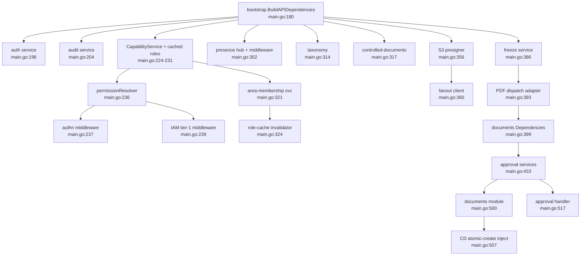

# Binary: metaldocs-api

> **Last verified:** 2026-06-10 [runtime-unverified: live server not started; all claims verified by static source read]
> **Scope:** The `metaldocs-api` server binary: entrypoint, responsibilities, config consumed, lifecycle, and runtime constraints. Sister binary `metaldocs-e2e-seed` is covered at the end. For the full middleware chain detail see [../http-kernel.md](../http-kernel.md); for the request flow see [../flows/request-lifecycle.md](../flows/request-lifecycle.md).
> **Key files:**
> - `apps/api/cmd/metaldocs-api/main.go` — entrypoint and composition root (943 lines)
> - `apps/api/cmd/metaldocs-api/permissions.go` — tier-1 route → capability/visibility truth table
> - `apps/api/cmd/metaldocs-api/reauth.go` — re-auth wiring for sign-off e-signatures
> - `apps/api/internal/wiring/documents.go` — capability-checker adapter (only non-main internal package)
> - `internal/platform/bootstrap/api.go` — shared `BuildAPIDependencies` constructor
> - `scripts/start-api.ps1` — canonical dev startup script (script-truth policy per `CLAUDE.md §1`)

---

## 1. Binary identity

| Property | Value |
|---|---|
| Module path | `metaldocs/apps/api/cmd/metaldocs-api` |
| Entry package | `package main` (`apps/api/cmd/metaldocs-api/main.go`) |
| Build artifact (dev, Windows) | `apps/api/cmd/metaldocs-api/metaldocs-api.exe` (untracked; gitignored at `.gitignore:4`) |
| Default listen address | `:8080`; dev override: `APP_PORT=8081` set by `scripts/start-api.ps1:241` |
| Topology plane | Data + control plane: stateless synchronous business logic + authz (target: `wiki/architecture/backend-target-architecture.md` §1) |
| Sibling binaries | `metaldocs-jobs` (`apps/jobs`) — management plane; `metaldocs-worker` (`apps/worker`) — async data plane |

---

## 2. Responsibilities

The API binary owns exactly:

1. **Composition root** — instantiates and wires every module. No business logic lives here; all behavior is delegated to the module whose package it constructs.
2. **Startup sequence** — config validation (fail-fast), DB connection, advisory-locked migrations, module DI, route mounting on a single `http.ServeMux`, middleware chain composition, background goroutine launch. Full detail: [../http-kernel.md §4](../http-kernel.md).
3. **Tier-1 authorization truth table** (`permissions.go`) — the single ordered rule list that maps every HTTP route to a visibility class (public / session-required / permission-guarded) and a typed IAM capability. This table is consumed by both the authn and IAM middlewares; they share one resolver instance (`main.go:236`).
4. **Cross-module boundary adapters** — 9 in-file adapter types (`controlledDocumentDuplicatorAdapter` at `main.go:83`; `bypassAuditAdapter` at `main.go:732`; `documentsAuditAdapter` at `main.go:773`; `controlledDocumentsReaderAdapter` at `main.go:849`; `searchRevisionReaderAdapter` at `main.go:863`; `searchWorkflowReaderAdapter` at `main.go:883`; `searchDocumentReaderAdapter` at `main.go:898`; `profileDefaultsAdapter` at `main.go:909`; `mfaCoveragePctAdapter` at `main.go:930`) that allow domain modules to call each other through Go interfaces without importing each other's concrete packages. Note: `realClock` (`main.go:713`), `realUUIDGen` (`main.go:724`), and `fanoutComponents` (`main.go:87`) are co-located utility/grouping types, not adapters. The sole external adapter package: `apps/api/internal/wiring/documents.go`.
5. **Graceful shutdown** — `server.Shutdown` (15s budget), worker/scheduler join, deferred DB close. Full detail: [../http-kernel.md §7](../http-kernel.md).
6. **Background goroutines** — outbox workers, job scheduler, presence hub, session/orphan sweepers, optional audit retention purge. Full inventory: [../http-kernel.md §8](../http-kernel.md).

What the binary does **not** own: business rules, domain entities, repository SQL, module-level application logic — all of that lives in `internal/modules/`.

---

## 3. Config consumed at startup

All environment variables are parsed and validated before any module is constructed. Non-fatal absence is the exception, not the rule — see the fail-fast column.

| Variable | Default | Fail-fast? | Parsed at | Effect |
|---|---|---|---|---|
| `METALDOCS_REPOSITORY` | `memory` | **Yes** — must be `postgres` | `internal/platform/config/repository.go:15`; enforced `main.go:152-158` | Selects repository backend; any non-postgres value aborts startup |
| `DATABASE_URL` / `PG*` vars | — | Yes (pgx open) | `internal/platform/config/postgres.go:16-29` | Postgres DSN |
| `METALDOCS_SKIP_STARTUP_MIGRATIONS` | false | — | `main.go:186` | Skip advisory-locked migration apply |
| `METALDOCS_MIGRATIONS_DIR` | `db/migrations` | — | `main.go:187-190` | Migrations directory |
| `METALDOCS_AUTH_ENABLED` | true | — | `authn/config.go:17-23` | Master authn/authz switch; false only allowed with `APP_ENV=local` (`config.go:39-41`) |
| `METALDOCS_AUTH_SESSION_SECRET` | — | Yes (when auth on) | `authn/config.go:48-51` | Session HMAC secret |
| `METALDOCS_AUTH_SESSION_COOKIE_NAME` | `metaldocs_session` | — | `authn/config.go:53-56` | Session cookie name (also used by origin protection) |
| `METALDOCS_AUTH_SESSION_TTL_HOURS` | 12h | — | `authn/config.go:58-68` | Absolute session expiry |
| `METALDOCS_AUTH_SESSION_IDLE_MINUTES` | 0 (disabled) | — | `authn/config.go:70-77` | Sliding idle expiry |
| `METALDOCS_AUTH_PASSWORD_MIN_LENGTH` | 8 | — | `authn/config.go:79-86` | Password policy |
| `METALDOCS_AUTH_LOGIN_MAX_FAILED_ATTEMPTS` | 5 | — | `authn/config.go:88-96` | Account lockout threshold |
| `METALDOCS_AUTH_LOGIN_LOCK_MINUTES` | 15 | — | `authn/config.go:98-104` | Account lockout duration |
| `METALDOCS_BOOTSTRAP_ADMIN_{ENABLED,USER_ID,USERNAME,DISPLAY_NAME,EMAIL,PASSWORD}` | enabled iff `APP_ENV=local`; defaults `admin-local`/`admin`/`Administrator` | — | `authn/config.go:106-147` | Local admin bootstrap |
| `METALDOCS_AUTH_COOKIE_SECURE` | true unless `APP_ENV=local` | — | `authn/config.go:139` | Cookie `Secure` flag |
| `METALDOCS_AUTH_TRUSTED_ORIGINS` | — | — | `authn/config.go:140` | Origin-protection allowlist |
| `METALDOCS_AUTH_ORIGIN_PROTECTION_ENABLED` | `authn.Enabled()` | — | `authn/config.go:141` | Origin-protection switch |
| `METALDOCS_TRUSTED_PROXY_CIDRS` | empty (trust nobody) | — | `internal/platform/config/trusted_proxy.go:14` | X-Forwarded-* trust boundary |
| `METALDOCS_AUTHZ_CACHE_TTL_SECONDS` | 30 | — | `authn/config.go:25-35` | Cached-role provider TTL |
| `METALDOCS_RATE_LIMIT_{ENABLED,WINDOW_SECONDS,MAX_REQUESTS}` | disabled | — | `internal/platform/config/ratelimit.go:22-34` | Fixed-window rate limiter (no-op in default env) |
| `METALDOCS_CORS_{ENABLED,ALLOWED_ORIGINS,...}` | disabled | — | `internal/platform/config/cors.go:20-35` | CORS layer (no-op in default env) |
| `METALDOCS_STORAGE_PROVIDER`, `METALDOCS_MINIO_*`, `METALDOCS_ATTACHMENTS_*` | — | — | `internal/platform/config/attachments.go:43-93` | Object storage |
| `METALDOCS_GOTENBERG_URL` | disabled | — | `internal/platform/config/gotenberg.go:18` | PDF converter (Gotenberg) |
| `METALDOCS_FANOUT_URL` | — | **Yes** — empty is fatal | `main.go:362-365, 717-722` | docx-renderer fanout endpoint; freeze requires it |
| `METALDOCS_DOCX_RENDERER_SERVICE_TOKEN` | — | Yes (when fanout set) | `main.go:366-369` | Service-to-service auth token |
| `METALDOCS_JOBS_RIVER_SCHEMA` | — | — | `internal/platform/config/jobs.go:19-29` | River job-queue DB schema |
| `METALDOCS_JOBS_ENABLED` | true | — | `internal/platform/config/jobs.go:31-34` | River client enable gate |
| `METALDOCS_JOBS_TEMPORAL_MAX_WORKERS` | 10 | — | `internal/platform/config/jobs.go:36-40` | River worker concurrency |
| `ENABLE_JOB_STUCK_INSTANCE_WATCHDOG` | **enabled unless `false`** | — | `main.go:528-540, 835-837` | Leased job gate (opt-out semantics) |
| `ENABLE_JOB_IDEMPOTENCY_JANITOR` | **enabled unless `false`** | — | `main.go:541-548, 835-837` | Leased job gate |
| `ENABLE_JOB_AUDIT_INTEGRITY_VALIDATOR` | **enabled unless `false`** | — | `main.go:549-555, 835-837` | Leased job gate |
| `ENABLE_JOB_LEASE_REAPER` | **enabled unless `false`** | — | `main.go:556-559, 835-837` | Leased job gate |
| `AUDIT_RETENTION_DAYS` | 0 (disabled) | — | `main.go:575` | Daily audit-events purge; 0 = no purge |
| `APP_PORT` | `8080` | — | `main.go:604-611` | Listen port (`scripts/start-api.ps1:241` sets `8081` for dev) |
| `APP_ENV` | — | — | `authn/config.go:39, 139` | Governs auth-disabled allowance and cookie security defaults |
| `METALDOCS_E2E` | unset | — | `main.go:135-137` | Only literal `"1"` mounts `/internal/test/*` handlers |
| `METALDOCS_MDDM_NATIVE_EXPORT_ROLLOUT_PCT` | — | — | `internal/platform/config/feature_flags.go:24` | Feature-flag payload |

---

## 4. Module DI topology

The binary constructs every domain module in dependency order inside `main()`. The high-level construction graph (simplified; exact call sites in `main.go:180-521`):



The cyclic dependency between `documents` and `controlled-documents` (atomic CD-create requires the documents initializer) is broken by a post-construction injection at `main.go:507` rather than a circular import.

---

## 5. Lifecycle

### Normal startup (happy path)

```
script: scripts/start-api.ps1 [-Build]
  │
  ├─ [optional] go build → metaldocs-api.exe
  │
  └─ metaldocs-api.exe
       │
       ├─ 1. SIGINT/SIGTERM context  main.go:149
       ├─ 2. config validate (fail-fast per variable)  main.go:152-178
       ├─ 3. bootstrap.BuildAPIDependencies  main.go:180
       ├─ 4. migrate.Apply (advisory lock)  main.go:186-194
       ├─ 5. auth service + bootstrap admin  main.go:196-202
       ├─ 6. audit service  main.go:204-218
       ├─ 7. authz spine (CapabilityService + cache + middlewares)  main.go:224-246
       ├─ 8. module DI + RegisterRoutes  main.go:279-521
       ├─ 9. background goroutines  main.go:523-593
       ├─ 10. middleware chain  main.go:595-602
       └─ 11. http.Server.ListenAndServe → block in shutdownServer  main.go:613-627
```

### Shutdown

On SIGINT/SIGTERM or listen error:
1. `server.Shutdown(15s ctx)` — drain in-flight requests.
2. `stop()` — cancel root context → terminates all background goroutines.
3. `schedulerWG.Wait()` then `workerWG.Wait()` — join background workers.
4. Deferred sweeper stops, `deps.Cleanup()` (DB pool close).

Non-zero exit explicitly calls `deps.Cleanup()` before `os.Exit` because `os.Exit` skips defers (`main.go:628-635`).

---

## 6. Server configuration

| Parameter | Value | Source |
|---|---|---|
| `ReadHeaderTimeout` | 5s | `main.go:613-617` |
| `ReadTimeout` | **not set** | `main.go:613-617` |
| `WriteTimeout` | **not set** | `main.go:613-617` |
| `IdleTimeout` | **not set** | `main.go:613-617` |
| Handler | `http.ServeMux` wrapped in middleware chain | `main.go:595-617` |

The absence of `ReadTimeout`, `WriteTimeout`, and `IdleTimeout` means slow-body or slow-read clients hold connections indefinitely. This is a registered flag (RF-9, `wiki/architecture/backend-target-architecture.md:303`).

---

## 7. Sister binary: metaldocs-e2e-seed

Entrypoint: `apps/api/cmd/metaldocs-e2e-seed/main.go`. One-shot; not part of normal startup.

**Purpose:** create or reset a known E2E test account and ensure the `po` profile→template default binding exists.

**Sequence:**
1. Requires postgres mode (`main.go:32-38`).
2. `ensurePODefaultTemplateBinding`: opens its own DB connection, verifies `metaldocs.document_template_versions` has `po/po-default-canvas/v1`, then `INSERT ... ON CONFLICT DO NOTHING` into `metaldocs.document_profile_template_defaults` (`main.go:97-156`). Note: this opens a separate DB connection before `BuildAPIDependencies` opens a second pool (`main.go:52-56`) — two pools in one binary is a minor anomaly.
3. Rebuilds full API dependencies (second DB pool), creates or resets the `e2e-admin` user with password from `METALDOCS_E2E_ADMIN_PASSWORD` (default `E2eAdmin123!`) (`main.go:63-88, 158-166`), and ensures the `system_admin` role (`main.go:90-92`).

Identity config for the seeder:

| Variable | Default |
|---|---|
| `METALDOCS_E2E_ADMIN_USER_ID` | `e2e-admin` |
| `METALDOCS_E2E_ADMIN_USERNAME` | `e2e-admin` |
| `METALDOCS_E2E_ADMIN_EMAIL` | (derived) |
| `METALDOCS_E2E_ADMIN_DISPLAY_NAME` | (derived) |
| `METALDOCS_E2E_ADMIN_PASSWORD` | `E2eAdmin123!` |

---

## 8. Legacy and open flags

| Flag | Severity | RF link |
|---|---|---|
| `main.go` is 943 lines with 12 in-file type declarations — exceeds the 500-line single-file threshold | medium | (RF-COMP) |
| `ENABLE_JOB_*` env vars lack the `METALDOCS_` prefix and use opt-out semantics despite an opt-in name | low | — |
| `AUDIT_RETENTION_DAYS` lacks the `METALDOCS_` prefix; raw `DELETE` SQL lives in the composition root rather than the audit module | low | — |
| No `ReadTimeout`, `WriteTimeout`, or `IdleTimeout` on `http.Server` | medium | RF-9 |
| e2e-seed opens two DB pools | info | — |
| Both `METALDOCS_RATE_LIMIT_ENABLED` and `METALDOCS_CORS_ENABLED` default off — outermost two middleware layers are no-ops in the default environment | low (documented trade-off) | — |

See also: [../legacy-register.md](../legacy-register.md).

---

## 9. Cross-references

- Full middleware chain and tier-1 authz detail: [../http-kernel.md](../http-kernel.md)
- Request lifecycle flow: [../flows/request-lifecycle.md](../flows/request-lifecycle.md)
- Strategic composition model: [../../architecture/backend-blueprint.md](../../architecture/backend-blueprint.md)
- Target requirements and RF register: [../../architecture/backend-target-architecture.md](../../architecture/backend-target-architecture.md)
- Canonical dev startup: [../../references/local-dev-startup.md](../../references/local-dev-startup.md)

---

## Sources

Stage-1 artifact: `wiki/backend/_artifacts/stage1/http-kernel.md`
