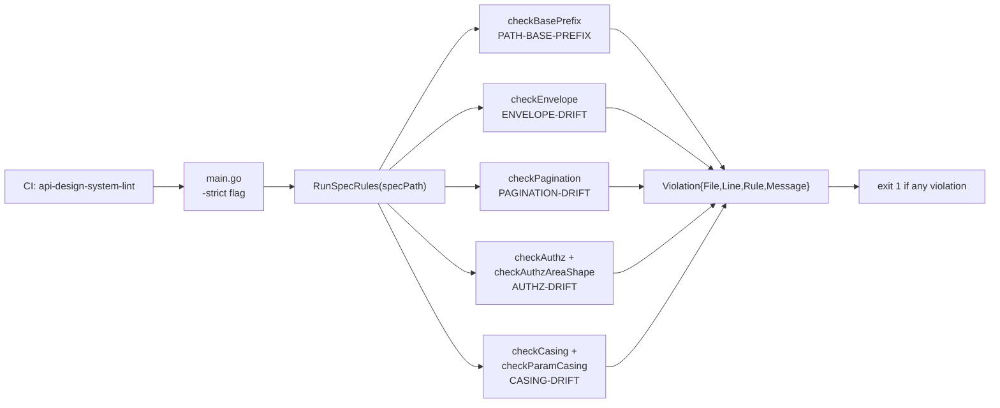
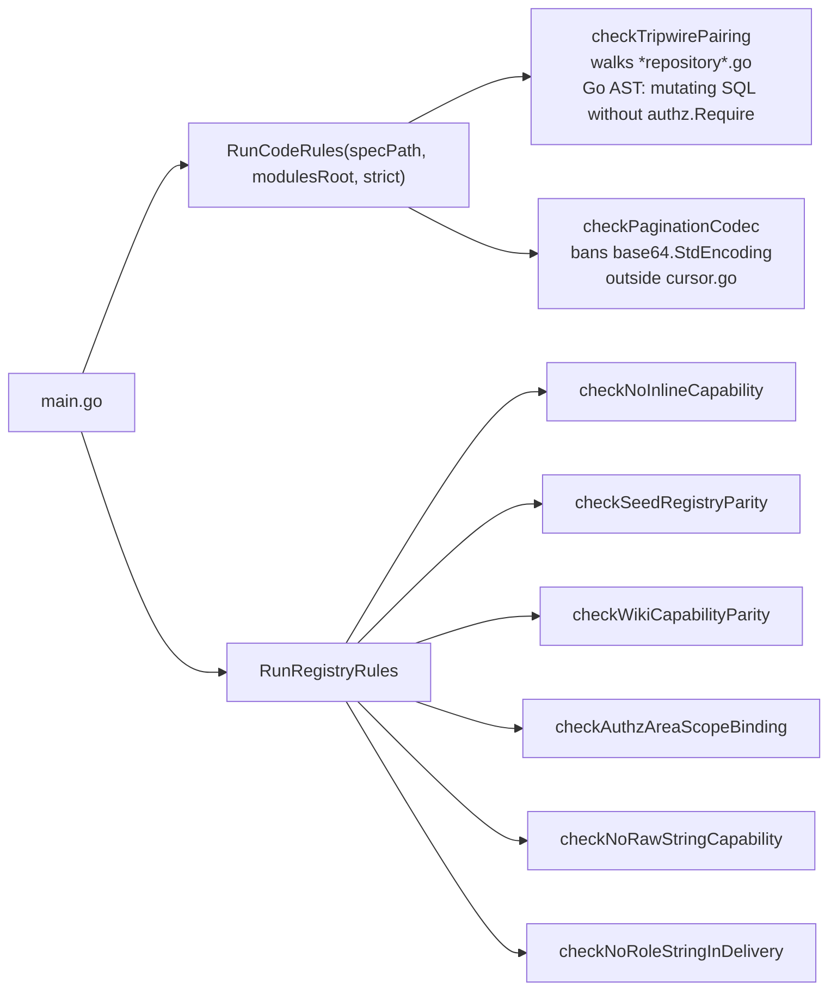

# Contract Surface — OpenAPI v1, spec2/v2, Codegen Pipeline, api-lint

> **Last verified:** 2026-06-10
> **Scope:** API contract surface for MetalDocs: the canonical OpenAPI v1 spec, the parallel spec2/v2 surface (RF-4), the oapi-codegen backend pipeline, the openapi-typescript frontend type pipeline, and the api-lint guard system. Runtime topology and per-module handler detail are in [../architecture/backend-api-structure.md](../architecture/backend-api-structure.md). Strategic stack and current maturity grades are in [../architecture/backend-blueprint.md](../architecture/backend-blueprint.md). Normative requirements referenced here originate from [../architecture/backend-target-architecture.md](../architecture/backend-target-architecture.md).
> **Key files:**
> - `api/openapi/v1/openapi.yaml` — canonical v1 contract (5 333 lines)
> - `api/openapi/spec2.yaml` — parallel approval-only spec (RF-4; 1 061 lines)
> - `api/openapi/v1/partials/` — three legacy partial files (not consumed by any codegen config)
> - `internal/modules/*/api/cfg.yaml` + `api.gen.go` — per-module oapi-codegen config and generated stubs
> - `internal/api/v2/types_gen.go` — hand-maintained legacy type package (misnomer; not generated)
> - `frontend/apps/web/src/lib/api-types/index.d.ts` — generated TypeScript types
> - `scripts/api-lint/` — bespoke contract-guard binary
> - `.github/workflows/api-contract.yml` — CI enforcement jobs

---

## 1. Identity and purpose

The contract surface is the machine-readable boundary that describes every public HTTP operation MetalDocs exposes. It consists of:

1. **One canonical v1 spec** (`api/openapi/v1/openapi.yaml`, 5 333 lines) — single source of truth for all oapi-codegen runs and frontend type generation.
2. **Three legacy partial files** (`api/openapi/v1/partials/`) — not consumed by any codegen config; camelCase schemas and `/api/v1/` path prefixes that conflict with the canonical spec's snake_case conventions.
3. **One parallel approval-only spec** (`api/openapi/spec2.yaml`, 1 061 lines) — RF-4 "fence or converge" item; covers 13 approval state-machine routes with its own non-Problem error schema.
4. **One pre-codegen contract package** (`internal/api/v2/`) — hand-maintained types that predate the v1 pipeline; now consumed only by contract tests.

The canonical pipeline generates per-module Go server stubs with `oapi-codegen v2.7.0`, driven by per-module `cfg.yaml` config files; each stub is committed as `api.gen.go`. Frontend TypeScript types are generated from the same v1 spec with `openapi-typescript`. A bespoke Go lint binary (`scripts/api-lint/`) guards the spec and codebase against six contract-drift families. All lint rules are CI-blocking with zero allowed violations.

---

## 2. Contract sources

### Canonical spec

| File | Lines | Role |
|---|---|---|
| `api/openapi/v1/openapi.yaml` | 5 333 | Canonical v1 contract — source of truth for all oapi-codegen runs and FE type generation; `servers.url = /api/v1` |

### Legacy partial files (not consumed by codegen)

| File | Lines | Status |
|---|---|---|
| `api/openapi/v1/partials/controlled-documents.yaml` | 306 | Dead from pipeline perspective — camelCase schemas, `/api/v1/` path prefix, not referenced by any `cfg.yaml` |
| `api/openapi/v1/partials/documents.yaml` | 247 | Dead from pipeline perspective — PascalCase response fields (`DocumentID`, `InitialRevisionID`, `SessionID`), no `operationId` on most ops |
| `api/openapi/v1/partials/templates.yaml` | 108 | Dead from pipeline perspective — `/api/v1/` path prefix |

### Parallel surface (RF-4)

| File | Lines | Status |
|---|---|---|
| `api/openapi/spec2.yaml` | 1 061 | Parallel approval-only spec; 13 approval routes; non-Problem error schema; no `//go:generate` consumes it; not linted by api-lint; no global or per-operation `security:` declarations |

---

## 3. oapi-codegen pipeline

### Per-module codegen configs

| Config file | Gen file | Package | Tags included |
|---|---|---|---|
| `internal/modules/controlleddocuments/api/cfg.yaml` | `api/gen.go` | `controlleddocumentsapi` | `controlled-documents` |
| `internal/modules/documents/api/cfg.yaml` | `api/gen.go` | `documentsapi` | `documents` |
| `internal/modules/documents/approval/api/cfg.yaml` | `api/gen.go` | `approvalapi` | `approval` |
| `internal/modules/iam/api/cfg.yaml` | `api/gen.go` | `iamapi` | `iam`, `audit`, `security` (three tags, one package — see Legacy flags) |
| `internal/modules/taxonomy/api/cfg.yaml` | `api/gen.go` | `taxonomyapi` | `taxonomy` |
| `internal/modules/templates/api/cfg.yaml` | `api/gen.go` | `templatesapi` | `templates` |

All configs set `strict-server: true`, `embedded-spec: true`, `models: true`, `std-http-server: true`. (`internal/modules/controlleddocuments/api/cfg.yaml:1-9`)

### Generated backend stubs

| Generated file | Lines | Covers |
|---|---|---|
| `internal/modules/controlleddocuments/api/api.gen.go` | 2 149 | `controlled-documents` tag ops |
| `internal/modules/documents/api/api.gen.go` | 6 213 | `documents` tag ops (largest single gen file) |
| `internal/modules/documents/approval/api/api.gen.go` | 4 631 | `approval` tag ops |
| `internal/modules/iam/api/api.gen.go` | 5 691 | `iam` + `audit` + `security` tag ops |
| `internal/modules/taxonomy/api/api.gen.go` | 2 959 | `taxonomy` tag ops |
| `internal/modules/templates/api/api.gen.go` | 4 487 | `templates` tag ops |

Each `api.gen.go` exports:
- A `ServerInterface` declaring one method per operation, typed with strict request/response envelope structs.
- A `ServerInterfaceWrapper` that decodes path/query parameters and calls the interface.
- `HandlerWithOptions` / `Handler` registration helpers that mount the handler onto `*http.ServeMux`.
- A gzip-compressed embedded copy of the spec slice for runtime request validation. (`internal/modules/documents/approval/api/api.gen.go:1-26`)

### Frontend type generation

| File | Role |
|---|---|
| `frontend/apps/web/src/lib/api-types/index.d.ts` | Generated TypeScript types; consumed by FE via `openapi-fetch` |
| `frontend/apps/web/package.json` script `gen:api` | Invokes `openapi-typescript ../../../api/openapi/v1/openapi.yaml -o src/lib/api-types/index.d.ts` |

### Pre-codegen legacy package

| File | Lines | Role |
|---|---|---|
| `internal/api/v2/types_gen.go` | 60 | Hand-maintained response types: `ProfileResponse`, `AreaResponse`, `ControlledDocumentResponse`, `MembershipResponse`, `APIError`; predates v1 pipeline (first commit `53060b957`) |
| `internal/api/v2/contract_test.go` | 65 | JSON round-trip tests for `apiv2.APIError` and `apiv2.ProfileResponse` |

---

## 4. api-lint guard system

### Tooling files

| File | Role |
|---|---|
| `scripts/api-lint/main.go` | Entry point; parses `-strict` / `-only` flags; calls `RunSpecRules` then `RunCodeRules`; exits 1 on any violation (`scripts/api-lint/main.go:18-81`) |
| `scripts/api-lint/spec_rules.go` | Spec-side rules: `checkBasePrefix`, `checkEnvelope`, `checkPagination`, `checkAuthz` + `checkAuthzAreaShape`, `checkCasing` + `checkParamCasing` |
| `scripts/api-lint/code_rules.go` | Code-side rules: `checkTripwirePairing`, `checkPaginationCodec` |
| `scripts/api-lint/registry_rules.go` | Registry-binding rules: `checkNoInlineCapability`, `checkSeedRegistryParity`, `checkWikiCapabilityParity`, `checkAuthzAreaScopeBinding`, `checkNoRawStringCapability`, `checkNoRoleStringInDelivery` |
| `scripts/api-lint/tripwire-allowlist.txt` | 23 frozen allow-list entries for tripwire-pairing false positives |
| `scripts/api-lint/main_test.go` | Rule unit tests with spec fixture scenarios |
| `scripts/api-lint/registry_rules_test.go` | Registry rule tests |
| `scripts/api-lint/code_rules_pagination_test.go` | Pagination codec rule tests |
| `scripts/api-lint/e2e_test.go` | End-to-end lint tests |
| `scripts/api-lint/exit_code_test.go` | Exit-code contract tests (Windows-Defender-safe) |
| `scripts/api-lint/api-lint.exe` | Pre-built Windows binary committed to repo (see Legacy flags) |
| `scripts/api-lint/testdata/` | YAML fixtures for each rule (good/bad pairs) |

### Rule catalog

| Rule family | ID | Enforces |
|---|---|---|
| Spec: base prefix | PATH-BASE-PREFIX | Rejects any path key starting with `/api/`; double-prefix forbidden because `servers.url` already carries `/api/v1` |
| Spec: error envelope | ENVELOPE-DRIFT | Every response `>= 400` must have `application/problem+json` content with `$ref: '#/components/schemas/Problem'` |
| Spec: pagination shape | PAGINATION-DRIFT | Unbounded list ops must carry `cursor`+`limit` query params and `page.next_cursor`+`page.has_more` in the 200 response; `x-pagination-exempt: true` is valid only with a non-empty `x-pagination-exempt-reason` |
| Spec: authz declarations | AUTHZ-DRIFT | Every op must declare `security` or inherit global security; every state-transition POST must carry `x-authz-area`, `x-authz-area-none`, or `x-authz-custom` |
| Spec: naming conventions | CASING-DRIFT | All property keys and query/path param names must match `^[a-z][a-z0-9]*(_[a-z0-9]+)*$`; one explicit exemption for `MDDM_NATIVE_EXPORT_ROLLOUT_PCT` |
| Code: tripwire pairing | (code-side) | Functions in `*repository*.go` files with mutating SQL (`INSERT INTO`, `UPDATE`, `DELETE FROM`) must also call `authz.Require` / `authz.RequireAll`; allow-listed exceptions in `tripwire-allowlist.txt` |
| Code: pagination codec | (code-side) | `base64.StdEncoding` banned outside `internal/platform/pagination/cursor.go` |
| Registry: capability inline | (registry) | No `Capability("literal")` conversion outside the registry file |
| Registry: seed parity | (registry) | Every seeded capability in `db/reference-data/0001_product_reference_data.sql` must exist in the registry and vice versa |
| Registry: wiki parity | (registry) | Every `` `cap:<name>` `` marker in three wiki files must exist in the registry |
| Registry: area-scope binding | (registry) | No area-grade capability called with literal `"tenant"` as area arg |
| Registry: raw-string capability | (registry) | No raw string literal capability to `authz.Require` |
| Registry: role-string delivery | (registry) | No role-name string literal in delivery/http authz gates |

Violations format: `<file>:<line>: <RULE>: <message>` on stdout; exit code 1 on any violation, 2 on argument error. (`scripts/api-lint/main.go:74-81`)

---

## 5. CI enforcement

| Job | File | What it asserts |
|---|---|---|
| `backend-codegen-drift` | `.github/workflows/api-contract.yml:33-34` | `go generate ./...` + `git diff --exit-code -- '**/api.gen.go'`; stale committed stubs fail the build |
| `frontend-codegen-drift` | `.github/workflows/api-contract.yml:47-48` | `npm run gen:api` + `git diff --exit-code -- src/lib/api-types/`; stale TS types fail the build |
| `openapi-lint` | `.github/workflows/api-contract.yml` | Redocly lint against v1 spec |
| `spec-base-path-gate` | `.github/workflows/api-contract.yml` | PATH-BASE-PREFIX check only (fast gate) |
| `api-design-system-lint` | `.github/workflows/api-contract.yml:95` | Full `go run ./scripts/api-lint/ -strict api/openapi/v1/openapi.yaml .` |

---

## 6. Public HTTP route surface

`servers.url = /api/v1`. All paths below are relative to that prefix.

### auth (4 routes)

| Method | Path | operationId | AuthN |
|---|---|---|---|
| POST | `/auth/login` | `login` | public (`security: []`) |
| POST | `/auth/logout` | `logout` | session cookie |
| GET | `/auth/me` | `getCurrentUser` | session cookie |
| POST | `/auth/change-password` | `changePassword` | session cookie |

### health (2 routes)

| Method | Path | operationId | AuthN |
|---|---|---|---|
| GET | `/health/live` | `checkLiveness` | public |
| GET | `/health/ready` | `checkReadiness` | public |

### observability (1 route)

| Method | Path | operationId | AuthN |
|---|---|---|---|
| GET | `/metrics` | `getMetrics` | session cookie |

### iam (22 routes)

| Method | Path | operationId | Notes |
|---|---|---|---|
| GET | `/iam/users` | `listUsers` | cursor-paginated, filterable |
| POST | `/iam/users` | `createManagedUser` | legacy path; description marks it as prefer `inviteUser`; no OpenAPI `deprecated: true` marker |
| PATCH | `/iam/users/{user_id}` | `patchUser` | atomic metadata + role update |
| POST | `/iam/users/{user_id}/reset-password` | `resetPassword` | — |
| POST | `/iam/users/{user_id}/unlock` | `unlockUser` | — |
| GET | `/iam/admin/overview` | `getIamAdminOverview` | composed KPI + presence |
| POST | `/iam/users/invite` | `inviteUser` | preferred invite path |
| POST | `/iam/users/bulk` | `bulkUsers` | activate/deactivate/unlock/force-logout |
| GET | `/iam/users/{user_id}/memberships` | `listMemberships` | `x-pagination-exempt` (bounded) |
| GET | `/iam/roles` | `listRoles` | `x-pagination-exempt` (fixed catalog) |
| GET | `/iam/capabilities` | `listCapabilities` | `x-pagination-exempt` (fixed catalog) |
| GET | `/iam/role-capabilities` | `listRoleCapabilities` | `x-pagination-exempt` (fixed catalog) |
| GET | `/iam/kpi` | `getKpi` | — |
| GET | `/iam/usage` | `getUsage` | — |
| GET | `/iam/presence/snapshot` | `getPresenceSnapshot` | HTTP fallback for WebSocket |
| POST | `/iam/users/{user_id}/roles` | `upsertUserRole` | — |
| PUT | `/iam/users/{user_id}/roles` | `replaceUserRoles` | — |
| GET | `/auth/sessions` | `listSessions` | cursor-paginated |
| DELETE | `/auth/sessions/{session_id}` | `revokeSession` | — |
| GET | `/iam/area-memberships` | `listAreaMemberships` | `x-pagination-exempt`; `x-authz-area` enforcement |
| POST | `/iam/area-memberships` | `grantAreaMembership` | `x-authz-area: {source: body, field: area_code}` |
| DELETE | `/iam/area-memberships/{user_id}/{area_code}` | `revokeAreaMembership` | `x-authz-area: {source: path, field: area_code}` |

### audit (4 routes)

| Method | Path | operationId |
|---|---|---|
| GET | `/audit/events` | `listAuditEvents` |
| POST | `/audit/events/export` | `exportAuditEvents` |
| GET | `/audit/events/export/{export_id}` | `getAuditExportStatus` |
| GET | `/audit/events/export/{export_id}/download` | `downloadAuditExport` |

### security (3 routes)

| Method | Path | operationId |
|---|---|---|
| GET | `/security/mfa-coverage` | `getMfaCoverage` |
| GET | `/security/lockouts` | `listLockouts` |
| GET | `/security/signals` | `listSecuritySignals` |

### configuration (1 route)

| Method | Path | operationId | AuthN |
|---|---|---|---|
| GET | `/feature-flags` | `getFeatureFlags` | public (`security: []`) |

### templates (~20 routes)

| Method | Path | operationId |
|---|---|---|
| GET | `/templates` | `listTemplates` |
| POST | `/templates` | `createTemplate` |
| GET | `/templates/system/blank` | `getSystemBlankTemplate` |
| GET | `/templates/{id}` | `getTemplate` |
| GET | `/templates/{id}/versions/{n}` | `getTemplateVersion` |
| POST | `/templates/{id}/versions` | `createTemplateVersion` |
| POST | `/templates/{id}/versions/{n}/docx-upload-url` | `presignTemplateDocxUploadUrl` |
| POST | `/templates/{id}/versions/{n}/schema-upload-url` | `presignTemplateSchemaUploadUrl` |
| PUT | `/templates/{id}/versions/{n}/draft` | `saveTemplateDraft` |
| PUT | `/templates/{id}/versions/{n}/schema` | `updateTemplateSchema` |
| POST | `/templates/{id}/versions/{n}/autosave/presign` | `presignTemplateAutosave` |
| POST | `/templates/{id}/versions/{n}/autosave/commit` | `commitTemplateAutosave` |
| POST | `/templates/{id}/versions/{n}/submit` | `submitTemplateVersion` |
| POST | `/templates/{id}/versions/{n}/review` | `reviewTemplateVersion` |
| POST | `/templates/{id}/versions/{n}/approve` | `approveTemplateVersion` |
| POST | `/templates/{id}/versions/{n}/publish` | `publishTemplateVersion` |
| POST | `/templates/{id}/archive` | `archiveTemplate` |
| PUT | `/templates/{id}/approval-config` | `upsertTemplateApprovalConfig` |
| GET | `/templates/{id}/versions/{n}/docx-url` | (url download) |
| GET | `/signed` | `redirectSignedUrl` | public (`security: []`) |

### taxonomy, controlled-documents, documents, approval

Routes for these tags are declared in `api/openapi/v1/openapi.yaml` under their respective tags. Codegen produces `taxonomyapi`, `controlleddocumentsapi`, `documentsapi`, and `approvalapi` packages. The `approval` tag routes in v1 overlap in HTTP path with the 13 routes in `api/openapi/spec2.yaml` — this is the RF-4 surface.

### search (1 route)

| Method | Path | operationId |
|---|---|---|
| GET | `/search/documents` | `searchDocuments` |

---

## 7. Key shared schemas

- **`Problem`** — RFC 9457 error shape; `required: [title, status, code]`; `type` optional per §3.1. All error responses `>= 400` in the v1 spec must use this shape (ENVELOPE-DRIFT rule).
- **`FieldError`** — per-field validation error; nested in `Problem.errors`.
- **`FeatureFlagsResponse`** — contains the SCREAMING_SNAKE flag key `MDDM_NATIVE_EXPORT_ROLLOUT_PCT` (explicitly exempted from CASING-DRIFT).
- **`ControlledDocument`, `TemplateDTO`, `VersionDTO`, `RouteSummary`, `InstanceResponse`** — core domain shapes.
- **`apiv2.APIError`** (`internal/api/v2/types_gen.go:55-60`) — flat `{Code, Message, Details, TraceID}` shape; imported only by contract tests; structurally different from the spec-declared `Problem`. `json.Unmarshal` tolerates missing fields, so tests pass but do not faithfully assert the `application/problem+json` contract.

---

## 8. Logic flows

### Flow 1 — backend codegen regeneration

```mermaid
sequenceDiagram
    participant Dev as Developer / CI
    participant Gen as go generate ./...
    participant Cfg as cfg.yaml
    participant Spec as api/openapi/v1/openapi.yaml
    participant Out as api.gen.go

    Dev->>Gen: invoke (or CI job backend-codegen-drift)
    Gen->>Cfg: read package name, flags, include-tags
    Gen->>Spec: read filtered by tag
    Spec-->>Gen: operations + schemas for tag
    Gen->>Out: emit ServerInterface, wrappers, embedded spec, enum Valid() methods
    Note over Out: committed; CI asserts git diff --exit-code
```

Steps:
1. Developer or CI calls `go generate ./...` from repo root. (`wiki/references/oapi-codegen.md:8-15`)
2. For each module, Go executes the `//go:generate` directive in `internal/modules/<x>/api/gen.go`, e.g. `go run github.com/oapi-codegen/oapi-codegen/v2/cmd/oapi-codegen --config=cfg.yaml ../../../../api/openapi/v1/openapi.yaml`. (`internal/modules/controlleddocuments/api/gen.go:3`)
3. oapi-codegen reads `cfg.yaml` for package name, generation flags, and `include-tags` filter. (`internal/modules/controlleddocuments/api/cfg.yaml:1-9`)
4. oapi-codegen reads `api/openapi/v1/openapi.yaml`, filters by declared tags, and emits typed structs, `ServerInterface`, `ServerInterfaceWrapper`, `HandlerWithOptions`, and the embedded spec slice.
5. The generated file includes a gzip-compressed embedded copy of the spec slice for runtime validation. (`internal/modules/documents/approval/api/api.gen.go:1`)
6. CI job `backend-codegen-drift` runs `go generate ./...` and asserts `git diff --exit-code -- '**/api.gen.go'`. Stale stubs fail the build. (`.github/workflows/api-contract.yml:33-34`)

### Flow 2 — frontend TypeScript type generation

```mermaid
sequenceDiagram
    participant Dev as Developer / CI
    participant NPM as npm run gen:api
    participant Spec as api/openapi/v1/openapi.yaml
    participant Types as src/lib/api-types/index.d.ts

    Dev->>NPM: invoke (or CI job frontend-codegen-drift)
    NPM->>Spec: openapi-typescript reads spec (3-level relative path)
    Spec-->>NPM: paths + operations + schemas
    NPM->>Types: emit paths/operations/schemas interfaces
    Note over Types: committed; CI asserts git diff --exit-code
```

Steps:
1. `cd frontend/apps/web && npm run gen:api`. (`frontend/apps/web/package.json` script `gen:api`)
2. `openapi-typescript` reads `api/openapi/v1/openapi.yaml` and emits a `paths` interface, `operations` interface, and `schemas`/`parameters` namespaces into `src/lib/api-types/index.d.ts`.
3. FE code accesses types via `openapi-fetch` using the `paths` interface as a generic parameter.
4. CI job `frontend-codegen-drift` asserts `git diff --exit-code -- src/lib/api-types/`. (`.github/workflows/api-contract.yml:47-48`)

### Flow 3 — api-lint spec rules



Steps:
1. CI calls `go run ./scripts/api-lint/ -strict api/openapi/v1/openapi.yaml .`. (`.github/workflows/api-contract.yml:95`)
2. `main.go` calls `RunSpecRules(specPath)`. (`scripts/api-lint/main.go:49`)
3. `RunSpecRules` reads the spec with `gopkg.in/yaml.v3` and for each path/operation runs all five spec-side checkers. (`scripts/api-lint/spec_rules.go:24-68`)
4. `checkCasing` does a full tree walk over all `properties:` and `parameters:` nodes, asserting `^[a-z][a-z0-9]*(_[a-z0-9]+)*$` with one hardcoded exemption. (`scripts/api-lint/spec_rules.go:96-157`)
5. Zero violations → exit 0; any violations → print all and exit 1. (`scripts/api-lint/main.go:74-81`)

### Flow 4 — api-lint code rules



Steps:
1. `RunCodeRules(specPath, modulesRoot, strict)` is called from `main` when a repo root arg is provided. (`scripts/api-lint/main.go:55-62`)
2. `checkTripwirePairing` walks `internal/modules/**/*repository*.go`, parses with `go/parser`, and flags any function that has mutating SQL but no `authz.Require` / `authz.RequireAll` call — unless the `<rel-path>|<FuncName>` key is in `tripwire-allowlist.txt`. Stale allow-list entries are also flagged. (`scripts/api-lint/code_rules.go:133-225`)
3. `RunRegistryRules` parses `internal/modules/iam/domain/model.go` to extract the canonical `Capability` and `Role` const maps, then runs the six registry-binding checkers against the codebase and wiki files. (`scripts/api-lint/registry_rules.go:61-104`)
4. `checkPaginationCodec` walks all non-generated non-test `.go` files for `base64.StdEncoding` outside the canonical cursor file. (`scripts/api-lint/code_rules.go:79-131`)

### Flow 5 — runtime request validation (embedded spec)

[runtime-unverified] When a module registers its handler using `HandlerWithOptions`, the generated `ServerInterfaceWrapper` has access to the embedded spec bytes (decompressed from flate-compressed base64) and `github.com/getkin/kin-openapi/openapi3` for validating incoming requests against the spec fragment. The `embedded-spec: true` flag is set in all `cfg.yaml` files, so the spec bytes are present in every generated stub. However, whether `RequestValidatorOptions` is actually passed to `HandlerWithOptions` in the composition root (`apps/api/cmd/metaldocs-api/main.go`) cannot be confirmed by static analysis: oapi-codegen emits the capability but the caller can opt out. (`internal/modules/documents/approval/api/api.gen.go:1-26`)

---

## 9. Dependencies

### Outbound (what the contract surface imports)

| Dependency | Used by | Purpose |
|---|---|---|
| `github.com/oapi-codegen/oapi-codegen/v2` | `//go:generate` invocations | Code generator binary; not imported at runtime |
| `github.com/oapi-codegen/runtime` | Every `api.gen.go` | Parameter binding helpers (`runtime.BindQueryParameter`, etc.) |
| `github.com/getkin/kin-openapi/openapi3` | Every `api.gen.go` | Spec validation in `HandlerWithOptions` |
| `gopkg.in/yaml.v3` | `scripts/api-lint/spec_rules.go` | YAML spec parsing |
| `go/ast`, `go/parser`, `go/token` | `scripts/api-lint/code_rules.go`, `registry_rules.go` | Go AST analysis for tripwire and registry rules |
| `metaldocs/internal/modules/iam/domain` | `scripts/api-lint/registry_rules.go` | `IsValidCapability`, `AllCapabilities`, `IsAreaGrade` |

### Inbound (who imports the generated packages)

| Importer | Imported package |
|---|---|
| `internal/modules/controlleddocuments/delivery/http/` | `controlleddocumentsapi` |
| `internal/modules/documents/delivery/http/` | `documentsapi` |
| `internal/modules/documents/approval/http/` | `approvalapi` |
| `internal/modules/iam/delivery/http/` | `iamapi` |
| `internal/modules/taxonomy/delivery/http/` | `taxonomyapi` |
| `internal/modules/templates/delivery/http/` (presumed) | `templatesapi` |
| Contract test files (`routes_contract_test.go`, `routes_memberships_contract_test.go`, `routes_profiles_contract_test.go`) | `apiv2 "metaldocs/internal/api/v2"` — `APIError` assertion only |

`apps/api/cmd/metaldocs-api/` does NOT directly import generated api packages; it wires handlers, not the generated interfaces themselves.

---

## 10. Config and environment

| Component | Configuration |
|---|---|
| oapi-codegen | No env vars; driven by per-module `cfg.yaml` and spec path on the CLI via `//go:generate` |
| api-lint | Two positional args (`<spec-path>` and `[<repo-root>]`); flags `-strict`, `-only`; no env vars; `-strict` converts missing core files into hard errors (`scripts/api-lint/main.go:18-42`) |
| Frontend type generation (`gen:api`) | No env vars; fixed relative path `../../../api/openapi/v1/openapi.yaml` baked into `package.json` |
| CI (`api-contract.yml`) | No secrets; `actions/setup-go@v5` with `go-version: 1.25.x`; `actions/setup-node@v4` with `node-version: 20.11.0` |

---

## 11. Error handling in the contract layer

**api-lint**: violations written to `os.Stdout` as `<file>:<line>: <RULE>: <message>`; errors to `os.Stderr`; exit code 1 on any violation, 2 on argument error. No structured logging or metrics. (`scripts/api-lint/main.go:74-81`)

**Generated `api.gen.go` parameter binding failures**: the generated `ServerInterfaceWrapper` calls `http.Error` on decode failure, returning HTTP 400 with a plain text body. [runtime-unverified: whether all parameter error paths actually produce `application/problem+json` or bare `http.Error` — conformance with REQ-API-4 (RFC 9457 errors with closed vocabulary) cannot be confirmed by static analysis alone.]

**spec2.yaml error schema divergence**: `api/openapi/spec2.yaml` uses `ErrorResponse { error: { code, message, details }, request_id }` rather than the v1 `Problem` shape. (`api/openapi/spec2.yaml:596-606`) This diverges from the v1 contract's RFC 9457 requirement.

---

## 12. Legacy and open flags

The following flags relate to this area. Each one is catalogued in [legacy-register.md](legacy-register.md).

| Flag | Location | Detail |
|---|---|---|
| **CASING-DRIFT: partials camelCase** | `api/openapi/v1/partials/controlled-documents.yaml:207-305` | All property names camelCase (`tenantId`, `profileCode`, `ownerUserId`, etc.); contradicts snake_case in canonical spec at `api/openapi/v1/openapi.yaml:5000-5031`. CASING-DRIFT rule does not run against partials. |
| **CASING-DRIFT: partials PascalCase fields** | `api/openapi/v1/partials/documents.yaml:47-51` | `DocumentID`, `InitialRevisionID`, `SessionID` response fields. |
| **PATH-BASE-PREFIX: all three partials** | `api/openapi/v1/partials/controlled-documents.yaml:2`, equivalents in documents.yaml and templates.yaml | All use `/api/v1/...` path keys; PATH-BASE-PREFIX check does not run against partials. |
| **RF-4: parallel spec2.yaml surface** | `api/openapi/spec2.yaml:1-30`; `wiki/architecture/backend-target-architecture.md:200` | 13 approval routes in spec2.yaml overlap in HTTP path with v1 `approval` tag ops; non-Problem error schema; no global security declarations; not linted. No ADR and no sunset date as of this audit. Requires "converge or formally fence" per REQ-API-2. |
| **`types_gen.go` filename misnomer** | `internal/api/v2/types_gen.go:1` | File is hand-maintained but named with `_gen.go` suffix, which by Go convention implies machine generation. Tools and linters (including the api-lint pagination-codec check at `scripts/api-lint/code_rules.go:97`) skip `*.gen.go` files, silently exempting this hand-maintained file from those checks. |
| **`apiv2.APIError` parallel error type** | `internal/api/v2/types_gen.go:55-60`; `internal/modules/iam/delivery/http/routes_memberships_contract_test.go:109-114` | Flat `{Code, Message, Details, TraceID}` shape differs from `Problem {title, status, code, detail, instance, errors}`. Contract tests pass because `json.Unmarshal` tolerates missing fields, but the type does not faithfully represent the `application/problem+json` contract. |
| **`iamapi` cfg.yaml bundles three tags** | `internal/modules/iam/api/cfg.yaml:9-11` | Tags `[iam, audit, security]` generate a single 5 691-line `api.gen.go`. Three distinct domains share one generated package; couples their regeneration. |
| **`POST /iam/users` undeclared deprecation** | `api/openapi/v1/openapi.yaml:213` | Description marks `createManagedUser` as "legacy; prefer inviteUser" but no OpenAPI `deprecated: true` marker exists; machine-readable consumers have no signal. |
| **spec2.yaml missing security declarations** | `api/openapi/spec2.yaml:1-30` | No global or per-operation `security:` block; AUTHZ-DRIFT rule does not run against spec2.yaml. |
| **Partial schema divergence** | `api/openapi/v1/partials/controlled-documents.yaml:221` | Defines `ControlledDocumentVisibility` with camelCase `areaCodes`/`userIds`; canonical spec defines the same schema with snake_case `area_codes`/`user_ids` at `api/openapi/v1/openapi.yaml:5020-5030`. Two divergent wire representations of the same resource. |
| **`api-lint.exe` committed binary** | `scripts/api-lint/api-lint.exe` | Pre-built Windows binary in the repository. CI rebuilds from source so the binary is unused in CI. Whether it diverges from source or is ever invoked locally is [runtime-unverified]. |
| **Blueprint claim inaccuracy** | `wiki/architecture/backend-blueprint.md:138` | Blueprint states "api/openapi/v1/openapi.yaml + partials → oapi-codegen" — the three partial files are not consumed by any `//go:generate` or `cfg.yaml`. Codegen reads only `api/openapi/v1/openapi.yaml` directly. |
| **Wiki artifact stale path** | `wiki/modules/controlled-documents/_artifacts/02-flow-atomic-create.md:9` | References `api/openapi/v1/partials/registry.yaml` which does not exist; correct path is `api/openapi/v1/partials/controlled-documents.yaml` (module renamed from "registry" per commit `86fd8885f`). |

### Open questions

1. **[runtime-unverified]** Whether `HandlerWithOptions` is called with a non-nil `RequestValidatorOptions` in the composition root. Without confirming this, the embedded-spec validation claim cannot be treated as an enforced runtime gate (REQ-API-6).

2. **[runtime-unverified]** Whether parameter binding errors in generated `ServerInterfaceWrapper` methods produce `application/problem+json` or bare `http.Error` text responses.

3. **RF-4 resolution** — `api/openapi/spec2.yaml` and `internal/api/v2/types_gen.go` are explicitly flagged in the target architecture under REQ-API-2. As of this audit there is no ADR and no sunset date. The practical question — whether approval handlers implement the spec2.yaml shape, the v1 shape, or a mix — cannot be answered by static analysis alone.

4. **Partial file consumers** — Whether the three partial files feed any non-codegen tooling (documentation portal, external consumer) cannot be confirmed by static analysis. If genuinely dead they should be deleted; if live they must be converged with the canonical spec.

---

## Sources

Stage-1 artifact: `wiki/backend/_artifacts/stage1/contract-surface.md`
