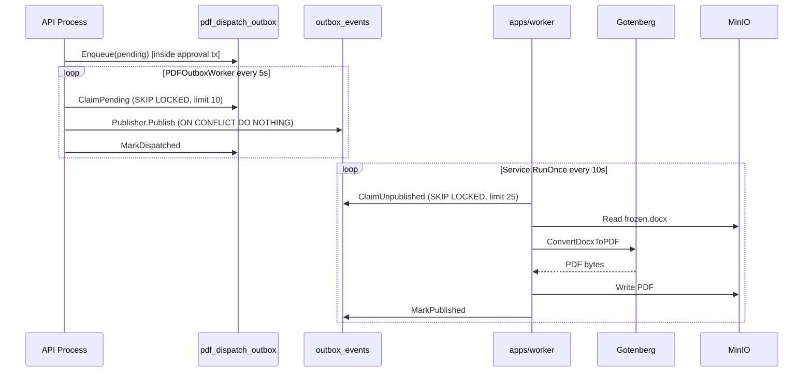
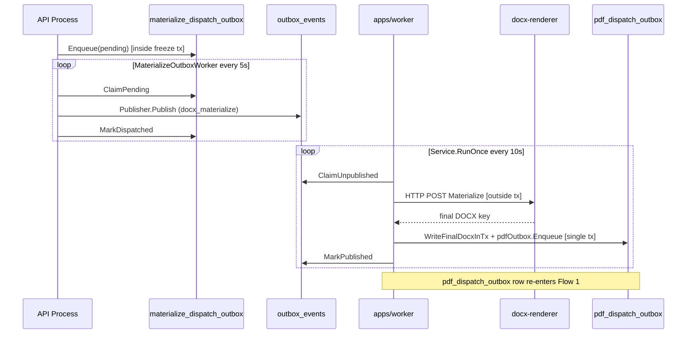
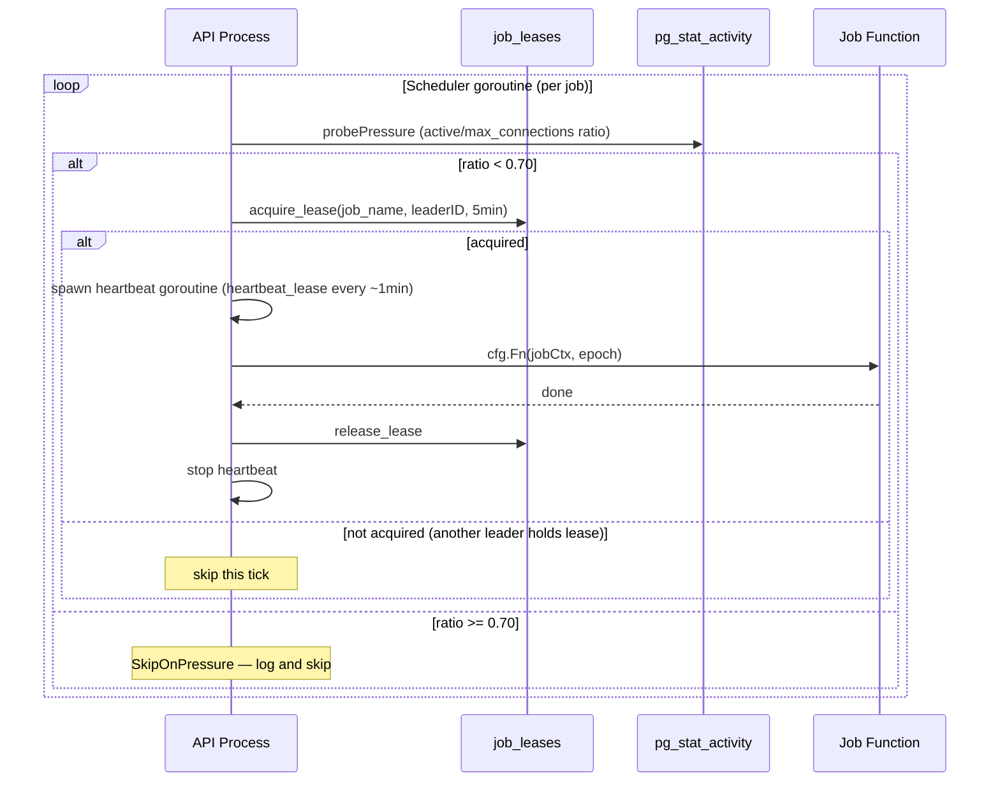

# Flow: Async Job Pipeline

> **Last verified:** 2026-06-11
> **Scope:** End-to-end async flows for all five async subsystems — PDF generation, DOCX materialization, scheduled-publish cutover, in-API maintenance jobs, and in-API sweepers — with Mermaid sequence diagrams. Includes a jobs-vs-worker comparison table answering why both binaries exist.
> **Key files:**
> - `apps/worker/cmd/metaldocs-worker/main.go`
> - `apps/jobs/cmd/metaldocs-jobs/main.go`
> - `internal/platform/worker/service.go`
> - `internal/platform/messaging/outbox/postgres/consumer.go`
> - `internal/modules/documents/approval/jobs/scheduled_publish_job.go`
> - `internal/modules/jobs/scheduler/scheduler.go`
> - `internal/modules/render/fanout/pdf_outbox_worker.go`

---

## 1. Why two binaries?

| Dimension | `apps/worker` | `apps/jobs` |
|-----------|--------------|-------------|
| **Trigger model** | Event-driven — polls `metaldocs.outbox_events` on a ticker | Time-driven — River fires jobs at `ScheduledAt` |
| **Queue storage** | `metaldocs.outbox_events` (custom outbox table) | River Postgres tables (managed by River framework) |
| **Queue protocol** | Homegrown: `FOR UPDATE SKIP LOCKED` CTE, manual backoff, manual DLQ | River: framework-managed retry, snooze, DLQ |
| **Work performed** | Heavy I/O: Gotenberg PDF conversion, docx-renderer HTTP call, MinIO read/write | Lightweight domain transaction: Postgres UPDATE + governance INSERT |
| **Business jobs** | `docgen_v2_pdf` (PDF generation), `docx_materialize` (DOCX fanout) | `scheduled_publish_cutover` (scheduled document publish) |
| **Concurrency** | Sequential within batch (no goroutine-per-event) | River worker pool, up to `MaxWorkers=10` |
| **Graceful shutdown** | Context cancellation — no explicit timeout | `Client.Stop(15 s timeout)` |
| **Deployment** | `deploy/docker/worker.Dockerfile` + compose `worker` service | **No Dockerfile, absent from compose** — local dev only |
| **Shares code with the other** | None | None |
| **In-process equivalent** | Outbox relay workers in API process (staging tables → `outbox_events`) | `RiverScheduledPublishEnqueuer` in API process (enqueue side only) |

**Summary:** The worker binary exists because PDF and DOCX generation require heavy external I/O that must not run in the API process. The jobs binary exists because River provides durable, transactionally-atomic future scheduling that a simple ticker cannot. The two binaries are completely independent at every layer: different queue storage, different protocol, different work.

---

## 2. Flow 1 — PDF generation

Three stages across two binaries and the API process.

### Stage A — Domain write to staging outbox (in API process)

When an approval decision triggers PDF dispatch:

1. `DecisionService` calls `s.pdfOutbox.Enqueue` (`fanout.StagingOutboxRepository`, `decision_service.go:535`) inside the approvals transaction, inserting a row into `metaldocs.pdf_dispatch_outbox` with `status='pending'` (APP-01 2026-07-01: the former `PDFDispatchAdapter` post-commit path is deleted — outbox is the only dispatch path).
2. A `fanout.StagingOutboxWorker` goroutine (PDF instance wired at `apps/api/cmd/metaldocs-api/main.go:930`; poll interval/batch from `config.StagingOutboxWorkerConfig`) polls `pdf_dispatch_outbox`. It claims rows with `FOR UPDATE SKIP LOCKED`, then calls `messaging.Publisher.Publish` for each row, inserting into `metaldocs.outbox_events` with `idempotency_key = "docgen_v2_pdf:{tenantID}:{revisionID}"` (ON CONFLICT DO NOTHING).

### Stage B — Outbox claim and PDF execution (in worker binary)

3. `platform/worker.Service.RunOnce` (`service.go:42`) calls `consumer.ClaimUnpublished` (`outbox/postgres/consumer.go:25`) — CTE claims up to `batchSize` rows from `outbox_events` with `FOR UPDATE SKIP LOCKED`, bumps `attempt_count`, sets `next_attempt_at = now() + claimLease` as in-flight lock.
4. For each `docgen_v2_pdf` event, `service.go:62` calls `pdfRunner.Handle` (`pdf_job_runner.go:68`): extracts payload, derives DOCX S3 key, calls `GotenbergPDFClient.ConvertPDF` (`servicebus/gotenberg_pdf.go:70`), then `persister.WritePDF`.
5. On success: `consumer.MarkPublished` sets `outbox_events.published_at = now()`. On failure: `markFailure` applies exponential backoff or dead-letters at `attempt_count >= MaxAttempts`.



---

## 3. Flow 2 — DOCX materialization (ADR 0015)

Three stages; the materialize worker re-enters the PDF pipeline at the end.

### Stage A — Freeze to materialize staging outbox (in API process)

1. When `FreezeService.Pin` is called (approval decision), the freeze service writes the snapshot and then calls `materializeOutboxRepo.Enqueue` inside the freeze transaction, inserting into `metaldocs.materialize_dispatch_outbox` (migration `db/migrations/0215_materialize_dispatch_outbox.sql`).
2. `MaterializeOutboxWorker` (started at `apps/api/main.go:491`) polls `materialize_dispatch_outbox` every 5 s, claims pending rows, calls `Publisher.Publish` with `EventTypeMaterializeFanout`, inserting into `outbox_events`.

### Stage B — Materialize execution (in worker binary)

3. `Service.RunOnce` claims `docx_materialize` events from `outbox_events`.
4. `MaterializeJobRunner.Handle` (`materialize_job_runner.go:58`): extracts payload, calls `MaterializeInvoker.Materialize` (HTTP POST to docx-renderer) — **outside any transaction**.
5. Opens a new Postgres transaction: calls `WriteFinalDocxInTx` (persists final DOCX S3 key) and `pdfOutbox.Enqueue` (inserts into `pdf_dispatch_outbox`) atomically.
6. The new `pdf_dispatch_outbox` row re-enters Flow 1 Stage A.



---

## 4. Flow 3 — Scheduled-publish cutover (River, `apps/jobs` binary)

```mermaid
sequenceDiagram
    participant User
    participant API as API Process
    participant PG_RV as River Postgres tables
    participant JOBS as apps/jobs (River client)
    participant PG_DOC as documents table

    User->>API: Schedule document (effectiveDate)
    API->>PG_RV: InsertTx(ScheduledPublishArgs, ScheduledAt=effectiveDate) [inside approval tx]
    Note over API,PG_RV: Atomic with document row update
    JOBS->>PG_RV: River scheduler fires at ScheduledAt
    JOBS->>PG_DOC: BEGIN tx; SELECT FOR UPDATE (stale-job guard)
    alt generation/version current
        JOBS->>PG_DOC: UPDATE status='published'
        JOBS->>PG_DOC: INSERT governance_events row
        JOBS->>PG_DOC: COMMIT
    else stale job (already published/withdrawn)
        JOBS->>PG_DOC: ROLLBACK (no-op)
    end
    JOBS->>PG_RV: Mark job complete
```

Key facts:

- Enqueue is atomic with the approval transaction (`scheduled_publish_job.go:57` — `client.InsertTx` inside `EnqueueScheduledPublishTx` which starts at line 56).
- Execution calls `authz.WithBackgroundBypass(ctx)` — no HTTP session context.
- Stale-job guard: `FOR UPDATE` + generation check at `internal/modules/documents/approval/application/scheduler_service.go:62-64` (`scheduledJobMatchesState` call in `RunScheduledPublishJob`).
- **The jobs binary has no Dockerfile and is absent from Docker Compose** — this flow is non-functional in containerised deployments.

---

## 5. Flow 4 — In-API maintenance scheduler



Registered jobs and intervals:

| Job | Interval | What it does |
|-----|---------|-------------|
| `stuck-instance-watchdog` | 5 min | Lists approval instances stuck > 7 days; auto-cancels or emits governance alert |
| `idempotency-janitor` | 15 min | Batched DELETE of expired `idempotency_keys` rows (batch=5000, max 10 iterations) |
| `audit-integrity-validator` | 1 h | Calls `auditdomain.IntegrityValidator.ValidateIntegrity` |
| `lease-reaper` | 10 min | Reclaims expired `job_leases` rows; inserts `governance_events` per reclaim |

Flag: `lease_reaper.go:37` joins `public.documents` by `job_name` to find a `tenant_id`. For the four scheduler jobs (whose names are strings like `"stuck-instance-watchdog"`), this query always returns NULL. Governance rows for reaped scheduler leases are never written. [runtime-unverified: confirmed as a code-reading finding; live behavior not checked.]

---

## 6. Flow 5 — Lightweight sweepers

Two fire-and-forget goroutines, no distributed coordination:

| Sweeper | Goroutine start | Interval | SQL action |
|---------|----------------|---------|-----------|
| `StartSessionSweeper` | `apps/api/main.go:568` | 60 s | `repo.ExpireStaleSessions(ctx, now)` |
| `StartOrphanPendingSweeper` | `apps/api/main.go:569` | 1 h | `repo.DeleteExpiredPending(ctx, now-24h)` |

Both use `authz.WithBackgroundBypass`. No restart logic — if the goroutine exits (context cancel only), it does not restart. Stopped via deferred stop functions.

---

## 7. Retry and failure model

### Worker outbox (`outbox_events`)

| Outcome | Action | Location |
|---------|--------|---------|
| Handler success | `MarkPublished` — sets `published_at = now()` | `service.go:84` |
| Handler failure, attempts < MaxAttempts | `MarkFailed` — sets `next_attempt_at = now() + backoffDuration(attempt)` | `service.go` `markFailure` |
| Handler failure, attempts >= MaxAttempts | `MarkFailed` — sets `dead_lettered_at = now()` | `service.go` `markFailure` |
| Worker crash (in-flight at claim time) | `next_attempt_at` elapses after `claimLease = max(RetryMaxSeconds, 5min)`; row becomes claimable again | `consumer.go:25` |

**Worker outbox backoff** (`service.go:130-151`): `backoffDuration(attempt) = min(base * 2^(attempt-1), max)`. The loop iterates `attempt-1` times, so attempt=1 yields `base` (no doubling), attempt=2 yields `base*2`, etc. Default: base=10s, max=300s.

**PDF outbox worker backoff** (`pdf_outbox_worker.go:89`): uses a separate formula — `min(30min, 30s * 2^attempts)` — where `attempts` is the current `r.Attempts` value (0-based, capped at 30). This is an entirely distinct implementation from the worker-service backoff above.

### River scheduled jobs (`apps/jobs`)

River manages retries internally. A `ScheduledPublishWorker.Work` returning an error triggers River's built-in retry with configurable backoff. Stale-job no-ops return `nil` and are counted as success.

### Staging outbox tables

`pdf_dispatch_outbox` and `materialize_dispatch_outbox` use a `status` enum (`pending` → `processing` → `dispatched` / `failed`). `ResetStaleClaims` recovers rows stuck in `processing` status after a worker crash (rows where `claimed_at < now() - threshold`). These tables do not have a DLQ concept.

---

## 8. Open flags

| Flag | Severity | Area |
|------|----------|------|
| `apps/jobs` absent from Docker Compose — scheduled-publish non-functional in containers | High | [../binaries/jobs.md](../binaries/jobs.md) |
| `lease_reaper` governance writes silently fail for all scheduler jobs (wrong JOIN) | High | [../binaries/worker.md](../binaries/worker.md) |
| Two-stage outbox chaining with duplicate claim/retry logic across three tables | Medium | [../platform/async-messaging.md](../platform/async-messaging.md) |
| `METALDOCS_WORKER_REVIEW_REMINDER_DAYS` loaded but never consumed | Medium | [../binaries/worker.md](../binaries/worker.md) |
| `startOutboxWorker` restart loop is dead code | Low | [../binaries/worker.md](../binaries/worker.md) |
| No tenant predicate in `pdf_dispatch_outbox` claim (`TODO(render)`) | Low | [../platform/async-messaging.md](../platform/async-messaging.md) |
| Outbox claim lease vs. materialization duration: 5-min claimLease may allow duplicate materialization execution for slow docx-renderer calls [runtime-unverified] | Low | Flow 2, Stage B |

Full flag registry: [../legacy-register.md](../legacy-register.md).

---

## Sources

Stage-1 artifact: [../_artifacts/stage1/async-runtime.md](../_artifacts/stage1/async-runtime.md).
Strategic context: [../../architecture/backend-blueprint.md](../../architecture/backend-blueprint.md).
Target normative spec: [../../architecture/backend-target-architecture.md](../../architecture/backend-target-architecture.md).
