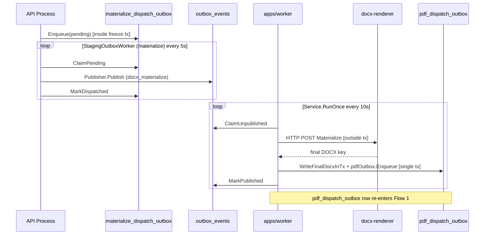
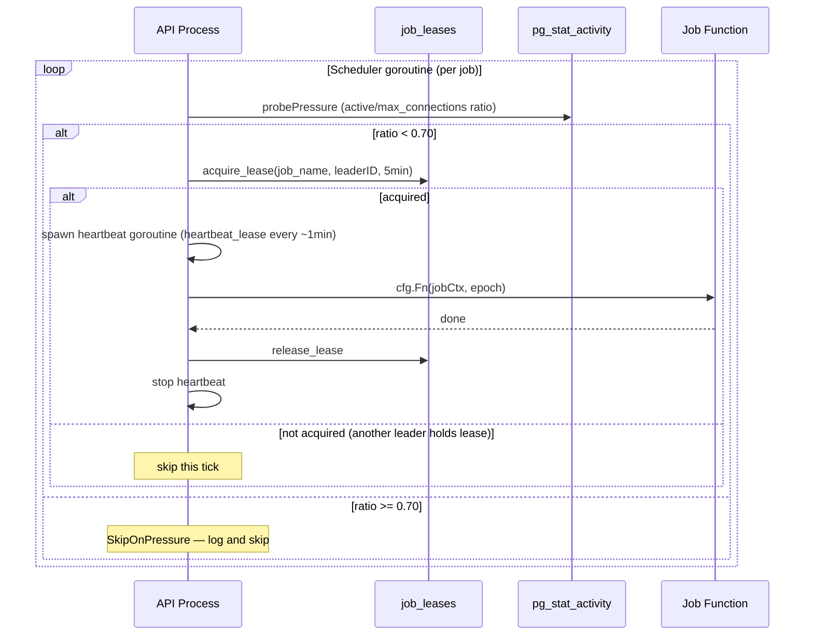

# Flow: Async Job Pipeline

> **Last verified:** 2026-07-29 (outbox-events retention — §5's drift notice updated from 6 to 7 live River periodic jobs, adding `outbox-events-retention` (24 h, purges terminal `metaldocs.outbox_events` rows: published >7 d, dead-lettered >90 d) and noting that `staging-outbox-purge` is defined by `retention.PeriodicJob()` in the render module rather than by `maintenance.PeriodicJobs()`. Retention semantics: [`wiki/backend/platform/async-messaging.md`](../platform/async-messaging.md) §3.1.) | prior: 2026-07-29 (ADR 0085 Stage C — §5 gained a note flagging that its table (and the Mermaid diagram above it) narrates the retired pre-ADR-0067 lease scheduler, not the current River periodic-job set, and now lists the 6 live periodic jobs including the new `release_hold_reconciler` alert-only sweep; see [`wiki/modules/jobs.md`](../../modules/jobs.md).) | prior: 2026-07-28 (ADR 0085 Stage B — Flow 3 rewritten: `scheduled_publish_cutover` is DELETED, replaced by the release coordinator's `release_evaluate` job kind, triggered by fact writes and an effective-date timer instead of a client-invoked schedule-publish call. See [`wiki/modules/approval.md`](../../modules/approval.md) and [ADR 0085](../../decisions/0085-release-coordinator-approval-driven-publication.md).) | prior: 2026-07-02
> **Scope:** End-to-end async flows for all five async subsystems — PDF generation, DOCX materialization, release-coordinator evaluation (ADR 0085), in-API maintenance jobs, and in-API sweepers — with Mermaid sequence diagrams. Includes a jobs-vs-worker comparison table answering why both binaries exist.
> **Key files:**
> - `apps/worker/cmd/metaldocs-worker/main.go`
> - `apps/jobs/cmd/metaldocs-jobs/main.go`
> - `internal/platform/worker/service.go`
> - `internal/platform/messaging/outbox/postgres/consumer.go`
> - `internal/modules/approval/jobs/release_evaluate_job.go`
> - `internal/modules/approval/application/release_coordinator.go`
> - `internal/modules/jobs/scheduler/scheduler.go`
> - `internal/modules/render/fanout/staging_outbox_worker.go`

---

## 1. Why two binaries?

| Dimension | `apps/worker` | `apps/jobs` |
|-----------|--------------|-------------|
| **Trigger model** | Event-driven — polls `metaldocs.outbox_events` on a ticker | Time-driven — River fires jobs at `ScheduledAt` |
| **Queue storage** | `metaldocs.outbox_events` (custom outbox table) | River Postgres tables (managed by River framework) |
| **Queue protocol** | Homegrown: `FOR UPDATE SKIP LOCKED` CTE, manual backoff, manual DLQ | River: framework-managed retry, snooze, DLQ |
| **Work performed** | Heavy I/O: Gotenberg PDF conversion, docx-renderer HTTP call, MinIO read/write | Lightweight domain transaction: Postgres UPDATE + governance INSERT |
| **Business jobs** | `docgen_v2_pdf` (PDF generation), `docx_materialize` (DOCX fanout) | `release_evaluate` (ADR 0085 release-coordinator evaluation — supersedes deleted `scheduled_publish_cutover`) |
| **Concurrency** | Sequential within batch (no goroutine-per-event) | River worker pool, up to `MaxWorkers=10` |
| **Graceful shutdown** | Context cancellation — no explicit timeout | `Client.Stop(15 s timeout)` |
| **Deployment** | `deploy/docker/worker.Dockerfile` + compose `worker` service | `deploy/docker/jobs.Dockerfile` + compose `jobs` service (`deploy/compose/docker-compose.yml:291-294`) |
| **Shares code with the other** | None | None |
| **In-process equivalent** | Outbox relay workers in API process (staging tables → `outbox_events`) | `RecordApprovalFactTx`/`RecordArtifactFactTx` enqueue `release_evaluate` in the fact-writing process (enqueue side only) |

**Summary:** The worker binary exists because PDF and DOCX generation require heavy external I/O that must not run in the API process. The jobs binary exists because River provides durable, transactionally-atomic future scheduling that a simple ticker cannot. The two binaries are completely independent at every layer: different queue storage, different protocol, different work.

---

## 2. Flow 1 — PDF generation

Three stages across two binaries and the API process.

### Stage A — Domain write to staging outbox (in API process)

When an approval decision triggers PDF dispatch:

1. `DecisionService` calls `s.pdfOutbox.Enqueue` (`fanout.StagingOutboxRepository`, `decision_service.go:535`) inside the approvals transaction, inserting a row into `metaldocs.pdf_dispatch_outbox` with `status='pending'` (APP-01 2026-07-01: the former `PDFDispatchAdapter` post-commit path is deleted — outbox is the only dispatch path).
2. A `fanout.StagingOutboxWorker` goroutine (PDF instance wired at `apps/api/cmd/metaldocs-api/main.go:960` via `startOutboxWorkers`, `main.go:945`; poll interval/batch from `config.StagingOutboxWorkerConfig`) polls `pdf_dispatch_outbox`. It claims rows with `FOR UPDATE SKIP LOCKED`, then calls `messaging.Publisher.Publish` for each row, inserting into `metaldocs.outbox_events` with `idempotency_key = "docgen_v2_pdf:{tenantID}:{revisionID}"` (ON CONFLICT DO NOTHING).

### Stage B — Outbox claim and PDF execution (in worker binary)

3. `platform/worker.Service.RunOnce` (`service.go:42`) calls `consumer.ClaimUnpublished` (`outbox/postgres/consumer.go:25`) — CTE claims up to `batchSize` rows from `outbox_events` with `FOR UPDATE SKIP LOCKED`, bumps `attempt_count`, sets `next_attempt_at = now() + claimLease` as in-flight lock.
4. For each `docgen_v2_pdf` event, `service.go:62` calls `pdfRunner.Handle` (`pdf_job_runner.go:68`): extracts payload, derives DOCX S3 key, calls `GotenbergPDFClient.ConvertPDF` (`servicebus/gotenberg_pdf.go:70`), then `persister.WritePDF`.
5. On success: `consumer.MarkPublished` sets `outbox_events.published_at = now()`. On failure: `markFailure` applies exponential backoff or dead-letters at `attempt_count >= MaxAttempts`.


---

## 3. Flow 2 — DOCX materialization (ADR 0015)

Three stages; the materialize worker re-enters the PDF pipeline at the end.

### Stage A — Freeze to materialize staging outbox (in API process)

1. When `FreezeService.Pin` is called (approval decision), the freeze service writes the snapshot and then calls `materializeOutboxRepo.Enqueue` inside the freeze transaction, inserting into `metaldocs.materialize_dispatch_outbox` (migration `db/migrations/0215_materialize_dispatch_outbox.sql`).
2. The materialize `StagingOutboxWorker` instance (wired at `apps/api/cmd/metaldocs-api/main.go:976` via `startOutboxWorkers`, `main.go:945`) polls `materialize_dispatch_outbox` every 5 s (default), claims pending rows, calls `Publisher.Publish` with `EventTypeMaterializeFanout`, inserting into `outbox_events`.

### Stage B — Materialize execution (in worker binary)

3. `Service.RunOnce` claims `docx_materialize` events from `outbox_events`.
4. `MaterializeJobRunner.Handle` (`materialize_job_runner.go:58`): extracts payload, calls `MaterializeInvoker.Materialize` (HTTP POST to docx-renderer) — **outside any transaction**.
5. Opens a new Postgres transaction: calls `WriteFinalDocxInTx` (persists final DOCX S3 key) and `pdfOutbox.Enqueue` (inserts into `pdf_dispatch_outbox`) atomically.
6. The new `pdf_dispatch_outbox` row re-enters Flow 1 Stage A.



---

## 4. Flow 3 — Release-coordinator evaluation (River, `apps/jobs` binary, ADR 0085)

Supersedes the deleted scheduled-publish cutover flow: there is no client-invoked publish call. A document reaches `published` only when a `release_evaluate` job evaluates its generation as ready and wins the release transaction.

```mermaid
sequenceDiagram
    participant Fact as Fact writer (approval/artifact)
    participant PG_RV as River Postgres tables (temporal queue)
    participant JOBS as apps/jobs (ReleaseEvaluateWorker)
    participant PG_GEN as release_generations
    participant PG_DOC as documents table

    Fact->>PG_GEN: RecordApprovalFactTx / RecordArtifactFactTx [same tx as the fact]
    Fact->>PG_RV: EnqueueReleaseEvaluationTx(key, runAt) [inside the same fact tx]
    Note over Fact,PG_RV: runAt=now (fact just landed) OR runAt=planned_effective_from (future timer)
    JOBS->>PG_RV: River fires ReleaseEvaluateWorker.Work at ScheduledAt
    JOBS->>PG_GEN: BEGIN tx; lock generation + document row
    JOBS->>JOBS: EvaluateRelease(facts, now) -> hold | schedule | release | no-op
    alt release
        JOBS->>PG_DOC: source CAS UPDATE approved|scheduled -> published; supersede target(s)
        JOBS->>PG_GEN: mark released; COMMIT
    else lost CAS (concurrent evaluation already won)
        JOBS->>PG_GEN: ROLLBACK (benign no-op)
    else hold (materializing / awaiting_effective_date / supersede_conflict / plan_invalid)
        JOBS->>PG_GEN: record hold reason; COMMIT
    end
    JOBS->>PG_RV: Mark job complete
```

Key facts:

- Enqueue is atomic with the triggering fact write (`RecordArtifactFactTx`, `internal/modules/approval/application/release_facts.go:302`) via `ReleaseEvaluationEnqueuer.EnqueueReleaseEvaluationTx` (`internal/modules/approval/jobs/release_evaluate_job.go:131`) — same-tx transactional outbox, one job kind serves both the immediate-reevaluation trigger and the future effective-date timer.
- Execution calls `authz.WithBackgroundBypass(ctx)` — no HTTP session context; events are emitted under the system principal `application.ReleaseSystemPrincipal` ("system:release-coordinator").
- Idempotent by construction: the job payload IS the release generation key, not a cached decision — `ReleaseCoordinator.Evaluate` (`internal/modules/approval/application/release_coordinator.go:123`) re-reads every input, so a stale/delayed delivery decides on current state, not enqueue-time state.
- Source-CAS guard: the `approved|scheduled -> published` UPDATE inside `releaseTx` (`release_coordinator.go:452,468-501`) is a compare-and-swap; zero rows affected means a concurrent evaluation already won — `errLostReleaseCAS`/`IsLostReleaseCAS` (`release_coordinator.go:534,538`) turns that into a benign no-op, not a retried error.
- **Corrected 2026-07-28:** the "jobs has no Dockerfile / is absent from compose" claim previously made here and in §8 was stale. `deploy/docker/jobs.Dockerfile` and the compose `jobs` service (`deploy/compose/docker-compose.yml:291-294`) both exist — verified in-tree, not merely assumed.

---

## 5. Flow 4 — In-API maintenance scheduler

> **Drift notice (2026-07-29):** the diagram and table below narrate the pre-ADR-0067 custom Postgres-lease scheduler (`job_leases`, advisory locks), which ADR 0067 (M5 F5.1) retired. All maintenance jobs are now River periodic jobs on the `maintenance` queue — full current list, intervals, and behavior in [`wiki/modules/jobs.md`](../../modules/jobs.md) §"Registered maintenance jobs" / §"River job: ..." sections. There are now 7: `stuck-instance-watchdog` (5m), `idempotency-janitor` (15m), `audit-integrity-validator` (1h), `document-review-surfacer` (1h, ADR 0069), `approval-sla-surfacer` (1h, F8), `release-hold-reconciler` (15m, alert-only, ADR 0085/0068), `outbox-events-retention` (24h, terminal-row purge of `metaldocs.outbox_events`). An eighth periodic job, `staging-outbox-purge` (24h), is defined alongside them by `internal/modules/render/fanout/retention.PeriodicJob()` rather than by `maintenance.PeriodicJobs()`, and runs on the same queue. Retained here as historical context pending a full rewrite of this flow.



Registered jobs and intervals:

| Job | Interval | What it does |
|-----|---------|-------------|
| `stuck-instance-watchdog` | 5 min | Lists approval instances stuck > 7 days; auto-cancels or emits governance alert |
| `idempotency-janitor` | 15 min | Batched DELETE of expired `idempotency_keys` rows (batch=5000, max 10 iterations) |
| `audit-integrity-validator` | 1 h | Calls `auditdomain.IntegrityValidator.ValidateIntegrity` |
| `lease-reaper` | 10 min | Reclaims expired `job_leases` rows; inserts `governance_events` per reclaim |

> **Retired (annotation 2026-08-09):** this job table and the flag below describe the pre-ADR-0067 lease scheduler, **retired (M5)** — the jobs above now run via River (enqueued by the API leader, executed by `metaldocs-jobs`). The `lease_reaper` JOIN bug was separately fixed in Wave 1.7 before retirement (see `wiki/backend/legacy-register.md` F-19). History only.

Flag: `lease_reaper.go:37` joins `public.documents` by `job_name` to find a `tenant_id`. For the four scheduler jobs (whose names are strings like `"stuck-instance-watchdog"`), this query always returns NULL. Governance rows for reaped scheduler leases are never written. [runtime-unverified: confirmed as a code-reading finding; live behavior not checked.]

---

## 6. Flow 5 — Lightweight sweepers

Two fire-and-forget goroutines, no distributed coordination:

| Sweeper | Goroutine start | Interval | SQL action |
|---------|----------------|---------|-----------|
| `StartSessionSweeper` | `apps/api/main.go:568` | 60 s | `repo.ExpireStaleSessions(ctx, now)` |
| `StartOrphanPendingSweeper` | `apps/api/main.go:569` | 1 h | `repo.DeleteExpiredPending(ctx, now-24h)` |

Both use `authz.WithBackgroundBypass`. No restart logic — if the goroutine exits (context cancel only), it does not restart. Stopped via deferred stop functions.

---

## 7. Retry and failure model

### Worker outbox (`outbox_events`)

| Outcome | Action | Location |
|---------|--------|---------|
| Handler success | `MarkPublished` — sets `published_at = now()` | `service.go:84` |
| Handler failure, classified non-retryable (see below), any attempt | `MarkFailed` — sets `dead_lettered_at = now()` immediately, skipping remaining retry budget | `service.go` `markFailure` |
| Handler failure, attempts < MaxAttempts (retryable or unclassified) | `MarkFailed` — sets `next_attempt_at = now() + backoffDuration(attempt)` | `service.go` `markFailure` |
| Handler failure, attempts >= MaxAttempts | `MarkFailed` — sets `dead_lettered_at = now()` | `service.go` `markFailure` |
| Worker crash (in-flight at claim time) | `next_attempt_at` elapses after `claimLease = max(RetryMaxSeconds, 5min)`; row becomes claimable again | `consumer.go:25` |

**Worker outbox backoff** (`service.go:130-151`): `backoffDuration(attempt) = min(base * 2^(attempt-1), max)`. The loop iterates `attempt-1` times, so attempt=1 yields `base` (no doubling), attempt=2 yields `base*2`, etc. Default: base=10s, max=300s.

**Permanent-failure fast path** (`service.go` `markFailure`, added commit `9aab29c5`): before computing backoff, `markFailure` does a structural match — `errors.As(handleErr, &interface{ Retryable() bool })` — unwrapping through any `fmt.Errorf("...: %w", err)` chain. If the matched error reports `Retryable() == false` (e.g. `*fanout.RenderError` for a `template_parse` defect: a permanent, non-retriable template/composition bug from the docx-renderer, as opposed to a transient 5xx/network failure), `markFailure` forces `attempt = MaxAttempts` so the event dead-letters on the very first observed failure instead of burning the full retry budget on a defect that can never succeed. The match is structural rather than a direct import of `fanout.RenderError` so `internal/platform/worker` stays decoupled from the `render` module (no platform→module import inversion). This only applies to the `docx_materialize` (`EventTypeMaterializeFanout`) path, which is the only worker-routed consumer of `fanout.Client.Fanout`; `render/fanout/reconstruction.go`'s `ReconstructService.Reconstruct` (manual/forensic re-render) is not driven by the outbox retry loop and does not need this classification. Covered by `internal/platform/worker/service_test.go` (`TestWorkerService_NonRetryableRenderError_DeadLettersOnFirstAttempt`, `TestWorkerService_RetryableRenderError_SchedulesBackoffLikeBefore`).

**Staging outbox worker backoff** (`staging_outbox_worker.go:102-104`, shared by both instances): uses a separate formula — `min(30min, 30s * 2^attempts)` — where `attempts` is the current `r.Attempts` value (0-based, capped at 30). This is an entirely distinct implementation from the worker-service backoff above.

### River scheduled jobs (`apps/jobs`)

River manages retries internally. A `ReleaseEvaluateWorker.Work` returning an error triggers River's built-in retry with configurable backoff. A `application.ErrReleaseGenerationNotFound` result and a lost release CAS (`IsLostReleaseCAS`) both return `nil` and are counted as success, not retried.

### Staging outbox tables — retry/terminal contract (APP-07)

`pdf_dispatch_outbox` and `materialize_dispatch_outbox` (`db/baseline/0001_current_schema.sql:1484-1498`) share one schema and are driven by the generic `fanout.StagingOutboxRepository` (`internal/modules/render/fanout/staging_outbox.go`) through the generic `fanout.StagingOutboxWorker` (`staging_outbox_worker.go`). Both tables are wired with the **same** `config.StagingOutboxWorkerConfig` instance (`apps/api/cmd/metaldocs-api/main.go:526,947,963`), so poll interval, batch size, `MaxAttempts`, and stale-claim threshold are identical for PDF and materialize dispatch.

**State machine.** `status` is a DB-checked enum: `pending → processing → dispatched | failed` (`pdf_dispatch_outbox_status_check`). Columns: `attempts`, `next_retry_at`, `claimed_at`, `dispatched_at`, `dead_lettered_at`, `last_error`.

| Transition | Trigger | Repo call | Effect |
|---|---|---|---|
| (insert) → `pending` | Caller enqueues inside its own business tx (approval/freeze tx) | `Enqueue(ctx, tx, tenantID, revisionID, contentHash)` | `INSERT ... ON CONFLICT (tenant_id, revision_id) DO NOTHING` — idempotent enqueue; tx MUST be non-nil (fails loud otherwise) so the row is atomic with the domain write |
| `pending` → `processing` | Worker tick, before dispatch | `ClaimPending(ctx, limit, maxAttempts)` | `FOR UPDATE SKIP LOCKED` CTE selects `status='pending' AND next_retry_at <= NOW() AND attempts < maxAttempts`, order by `next_retry_at ASC`, sets `status='processing', claimed_at=NOW()` |
| `processing` → `dispatched` | `Publisher.Publish` into `outbox_events` succeeds | `MarkDispatched(ctx, id)` | Sets `status='dispatched', dispatched_at=NOW()`. Terminal success state — no further claim possible (`status != 'pending'`) |
| `processing` → `pending` (retry) | `Publish` fails, OR `Publish` succeeds but `MarkDispatched` itself errors (F-R4 fallback) | `MarkFailed(ctx, id, errStr, nextRetryAt, finalize=false)` | Sets `status='pending', last_error=$2, attempts=attempts+1, next_retry_at=$3, claimed_at=NULL` — row becomes reclaimable once `next_retry_at` elapses |
| `processing` → `failed` (dead-letter) | `Publish` fails and the **worker**, not the repo, decides `r.Attempts+1 >= maxAttempt` | `MarkFailed(ctx, id, errStr, nextRetryAt, finalize=true)` | Sets `status='failed', last_error=$2, attempts=attempts+1, dead_lettered_at=NOW()` — terminal; `next_retry_at`/`claimed_at` untouched, `ClaimPending`'s `attempts < maxAttempts` predicate excludes it going forward even if `status` were reset |
| `processing` → `pending` (crash recovery) | Periodic, every tick, before claiming | `ResetStaleClaims(ctx, olderThan)` | `UPDATE ... SET status='pending', claimed_at=NULL WHERE status='processing' AND claimed_at < NOW() - olderThan` — only rows still `processing`; never touches `pending`, `dispatched`, or `failed` rows |

**Choreography (who decides what).** The repository is a dumb CAS/state-transition layer — it never decides retry-vs-finalize itself; every `MarkFailed` call site passes an explicit `finalize` bool computed by the caller. The only caller is `StagingOutboxWorker.dispatchOne` (`staging_outbox_worker.go:85-114`):

1. `tick()` calls `ResetStaleClaims` first, then `ClaimPending`, then loops `dispatchOne` per row.
2. `dispatchOne` computes `finalize := r.Attempts+1 >= w.maxAttempt` — the **worker**, not the repo, owns the finalize decision, using the row's pre-claim `Attempts` snapshot (not a re-read).
3. Backoff formula (`staging_outbox_worker.go:93-95,103-105`): `min(30min, 30s * 2^cappedAttempts)`, where `cappedAttempts = min(max(r.Attempts, 0), 30)` (0-based, capped to prevent overflow). This is a distinct formula from the platform worker-service backoff in §7 above (`min(base * 2^(attempt-1), max)`, base=10s/max=300s) — the two outbox layers do not share retry-timing code.
4. `MaxAttempts` source: `config.StagingOutboxWorkerConfig.MaxAttempts`, default 5, overridable via `METALDOCS_STAGING_OUTBOX_MAX_ATTEMPTS` (`internal/platform/config/staging_outbox_worker.go`). Same value gates both `ClaimPending`'s `attempts < maxAttempts` predicate (belt) and the worker's `finalize` decision (suspenders) — a row that reaches `attempts == maxAttempts` without having been explicitly finalized (e.g. a crash between `MarkFailed` and the next tick) is still excluded from future claims by the `ClaimPending` predicate, so it cannot be reprocessed past the limit even if `status` were somehow left as `pending`.
5. Stale-claim reset: `w.staleAfter` from `StagingOutboxWorkerConfig.StaleAfterSeconds`, default 300 s / `METALDOCS_STAGING_OUTBOX_STALE_AFTER_SECONDS`. `ResetStaleClaims` runs unconditionally at the top of every tick (not a separate janitor) — same worker goroutine that claims and dispatches also reclaims its own (or a crashed sibling's) stuck rows.

**Dead-letter visibility.** `CountDeadLettered(ctx)` (`staging_outbox.go:165-175`) returns `COUNT(*) WHERE dead_lettered_at IS NOT NULL` — mirrors the `dead_lettered_at` visibility pattern of the platform consumer (`internal/platform/messaging/outbox/postgres/consumer.go`). No dedicated alerting/dashboard consumer of this count exists yet in the module; it is a query primitive only. Unlike `outbox_events`, these staging tables have no separate DLQ table — `failed` rows stay in place with `dead_lettered_at` set.

**Idempotency expectations.** `Enqueue`'s `ON CONFLICT (tenant_id, revision_id) DO NOTHING` makes re-enqueue from the same domain event a no-op. Downstream, `MarkDispatched`'s `Publish` call writes to `outbox_events` with a content-derived `IdempotencyKey` (`"docgen_v2_pdf:{tenantID}:{revisionID}"` / `"materialize_fanout:{tenantID}:{revisionID}"`, `ON CONFLICT DO NOTHING` on insert — see `buildPDFEvent`/`buildMaterializeEvent`, `pdf_outbox_worker_test.go:73-101`), so a row that gets claimed twice (e.g. after `ResetStaleClaims` reclaims a row whose `Publish` actually landed before a worker crash) cannot double-insert into `outbox_events`. Consumers reading `outbox_events` (worker binary, Flow 1 Stage B) rely on that same idempotency key, not on staging-outbox state, for exactly-once effect.

**Tenancy (ADR 0054).** `ClaimPending` intentionally selects across **all tenants** with no `tenant_id` predicate — sanctioned by [ADR 0054](../../decisions/0054-cross-tenant-outbox-claim.md), which mirrors the platform `outbox_events` consumer (`internal/platform/messaging/outbox/postgres/consumer.go`). Compensating rules binding on this contract: (1) `ClaimPending` returns `OutboxRow.TenantID` on every row; (2) all per-row processing after claim (dispatch payload, blob access) is scoped to that row's tenant; (3) the tenant-unscoped claim shape is permitted only inside this worker-internal code path, never a request path; (4) consumers stay idempotent regardless of claim scoping. `MarkDispatched`/`MarkFailed`/`ResetStaleClaims` operate by row `id` (already tenant-resolved at claim time) and do not themselves re-check tenant — that is by design under ADR 0054, not a gap.

**Table allowlist.** `StagingOutboxRepository` is constructed only via `NewPDFOutboxRepository`/`NewMaterializeOutboxRepository`, which bind to a table name validated against `stagingOutboxAllowlist` (`metaldocs.pdf_dispatch_outbox`, `metaldocs.materialize_dispatch_outbox`) at construction time — `NewStagingOutboxRepository` panics on an unlisted table, closing the `fmt.Sprintf` table-name injection surface for any third table added later without updating the allowlist.

Test coverage: `internal/modules/render/fanout/pdf_outbox_repository_test.go` (repo-level, sqlmock) and `internal/modules/render/fanout/pdf_outbox_worker_test.go` (worker-level, fake repo) pin the transitions and choreography above — see file for the current matrix.

---

## 8. Open flags

| Flag | Severity | Area |
|------|----------|------|
| ~~`apps/jobs` absent from Docker Compose~~ | **Closed 2026-07-28** — `jobs.Dockerfile` + compose `jobs` service verified present | [../binaries/jobs.md](../binaries/jobs.md) |
| `lease_reaper` governance writes silently fail for all scheduler jobs (wrong JOIN) | High | [../binaries/worker.md](../binaries/worker.md) |
| Two-stage outbox chaining with duplicate claim/retry logic across three tables | Medium | [../platform/async-messaging.md](../platform/async-messaging.md) |
| `METALDOCS_WORKER_REVIEW_REMINDER_DAYS` loaded but never consumed | Medium | [../binaries/worker.md](../binaries/worker.md) |
| Outbox claim lease vs. materialization duration: 5-min claimLease may allow duplicate materialization execution for slow docx-renderer calls [runtime-unverified] | Low | Flow 2, Stage B |

Closed flags:
- Tenant-unscoped `pdf_dispatch_outbox`/`materialize_dispatch_outbox` claim is no longer an open flag as of ADR 0054 (2026-07-02) — the cross-tenant `ClaimPending` shape is sanctioned by design; see §7 "Staging outbox tables" above.
- `startOutboxWorker` restart-loop dead code: closed — the restart loop was deleted with the `StagingOutboxWorker` consolidation; `startOutboxWorkers` (`apps/api/cmd/metaldocs-api/main.go:945`) starts each instance's `Run` in a WaitGroup-tracked goroutine.

Full flag registry: [../legacy-register.md](../legacy-register.md).

---

## Sources

Stage-1 artifact: [../_artifacts/stage1/async-runtime.md](../_artifacts/stage1/async-runtime.md).
Strategic context: [../../architecture/backend-blueprint.md](../../architecture/backend-blueprint.md).
Target normative spec: [../../architecture/backend-target-architecture.md](../../architecture/backend-target-architecture.md).
