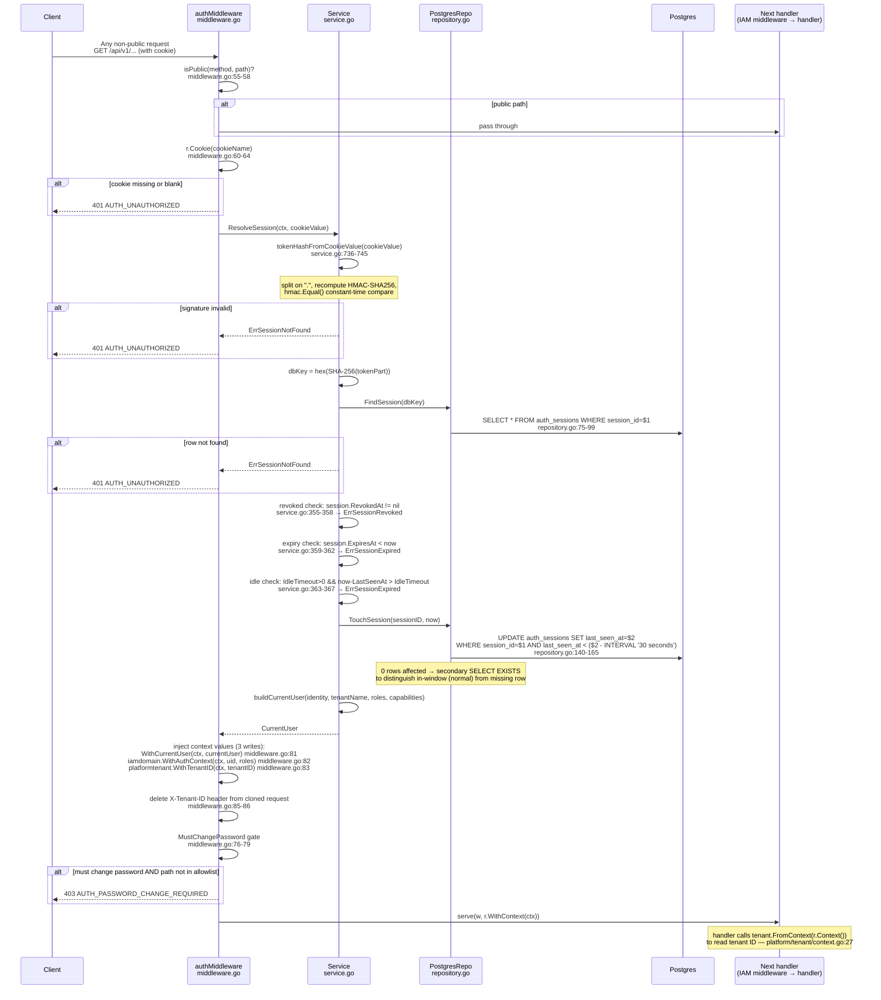

# Flow — Login & Session Resolution

> **Last verified:** 2026-06-11
> **Scope:** End-to-end walkthrough of two flows: (1) credential submission at `POST /api/v1/auth/login` — from HTTP request through credential verification, advisory-lock critical section, session token creation, and cookie response; (2) per-request session resolution — from cookie extraction through token verification, DB lookup, expiry/idle checks, context injection, and downstream handler receipt. Covers every platform package and module involved: `platform/authn`, `platform/tenant`, `platform/security`, `modules/auth/delivery/http`, `modules/auth/application`, `modules/auth/infrastructure/postgres`.
> **Key files:**
> - `internal/modules/auth/delivery/http/handler.go` — login, logout, me, change-password handlers
> - `internal/modules/auth/delivery/http/middleware.go` — session enforcement middleware
> - `internal/modules/auth/application/service.go` — all credential and session use cases (779 lines)
> - `internal/modules/auth/infrastructure/postgres/repository.go` — DB operations against `auth_identities` + `auth_sessions` (667 lines)
> - `internal/platform/authn/config.go` — auth config assembly
> - `internal/platform/authn/context.go` — `UserIDFromContext`
> - `internal/platform/tenant/context.go` — `WithTenantID`, `FromContext`
> - `internal/platform/security/origin_protection.go` — CSRF-class middleware upstream of auth

---

## 1. Middleware pipeline context

Both flows operate inside the `metaldocs-api` binary's middleware chain. The full chain, from outermost to innermost, as wired in `apps/api/cmd/metaldocs-api/main.go:598-602`:

```
cors.Wrap
  → originProtection.Wrap
    → authMiddleware.Wrap           ← session enforcement (this document)
      → iamMiddleware.Wrap          ← authz (IAM module)
        → presenceBump.Wrap         ← iam_users.last_seen_at bump (optional; omitted when nil)
          → httpObs.Wrap            ← observability (REQ-MW-4 gap: auth rejections not counted here)
            → rateLimiter.Wrap      ← global fixed-window rate limit
              → mux                ← routed handlers
```

`presenceBump` is conditionally applied: `main.go:598` builds `presenceWrapped = httpObs.Wrap(rateLimiter.Wrap(mux))`; `main.go:599-601` wraps that with `presenceBump.Wrap(presenceWrapped)` only when `presenceBump != nil`. `httpObs` is therefore always inside (downstream of) `presenceBump`, never between `iamMiddleware` and `presenceBump`.

The login handler (`POST /api/v1/auth/login`) and logout handler (`POST /api/v1/auth/logout`) are in `defaultPublicPaths` (`middleware.go:94-105`). The auth middleware fast-paths these through the `isPublic` check without requiring a session cookie.

---

## 2. Flow 1 — Login (`POST /api/v1/auth/login`)

### 2.1 Sequence diagram

```mermaid
sequenceDiagram
    participant C as Client
    participant MW as authMiddleware<br/>middleware.go
    participant H as Handler<br/>handler.go
    participant S as Service<br/>service.go
    participant R as PostgresRepo<br/>repository.go
    participant PG as Postgres

    C->>MW: POST /api/v1/auth/login<br/>{identifier, password}
    MW->>MW: isPublic(method, path) = true<br/>middleware.go:55-58
    MW->>H: pass through (no session required)
    H->>H: json.Decode body<br/>handler.go:70-73
    Note over H: malformed JSON → 400 VALIDATION_ERROR
    H->>S: Authenticate(ctx, identifier, password, r)
    S->>S: blank guard — empty identifier or password<br/>service.go:205-208 → ErrInvalidCredentials
    S->>R: FindIdentityByIdentifier(identifier)
    R->>PG: SELECT from auth_identities<br/>LOWER(username)=$1 UNION LOWER(email)=$1<br/>repository.go:31-49
    alt identity not found
        S->>S: constant-time bcrypt compare against dummyHash<br/>service.go:215-217
        S-->>H: ErrInvalidCredentials
    end
    S->>R: WithinLoginLock(userID, fn)
    R->>PG: BEGIN + pg_advisory_xact_lock(hashtextextended(userID,0))<br/>repository.go:341-362
    Note over PG: serializes concurrent attempts on same identity
    S->>R: tx.LoadLoginState(userID)
    R->>PG: SELECT password_hash, is_active, locked_until<br/>repository.go (inside tx)
    S->>S: bcrypt.CompareHashAndPassword (always runs)<br/>service.go:239
    alt locked_until > now
        S-->>H: ErrIdentityLocked
    else !isActive
        S-->>H: ErrIdentityInactive
    else password mismatch
        S->>R: tx.RecordFailedLogin(userID)
        R->>PG: UPDATE auth_identities incr failed_attempts,<br/>conditionally set locked_until
        S-->>H: ErrInvalidCredentials
    end
    Note over S: outcome = loginOK
    S->>R: GetUserTenants(userID)
    R->>PG: SELECT DISTINCT tenant_id FROM iam_user_roles<br/>repository.go:101-122
    S->>S: resolveLoginTenant(tenants, X-Tenant-ID claim)<br/>service.go:316-338
    Note over S: single-tenant auto-assign; multi-tenant requires X-Tenant-ID;<br/>zero-tenant + AllowDevTenantFallback → DevTenantID
    S->>R: RecordSuccessfulLogin(userID)
    R->>PG: UPDATE auth_identities reset failed_attempts,<br/>locked_until=NULL, last_login_at=now
    S->>R: RecordLastLoginContext(userID, ip, userAgent) [best-effort]
    R->>PG: UPDATE iam_users last_login_ip, last_login_at<br/>repository.go:211-235 (swallowed on error)
    S->>S: newSessionToken() — 32 random bytes → token, HMAC sig<br/>service.go:725-756
    Note over S: cookie value = token.sig<br/>DB key = SHA-256(token)
    S->>R: CreateSession(session row with tenant_id)
    R->>PG: INSERT auth_sessions
    S->>S: buildCurrentUser(identity, tenantName, roles, capabilities)
    S-->>H: AuthenticatedSession{CurrentUser, ExpiresAt}
    H->>H: Set-Cookie: metaldocs_session=token.sig<br/>HttpOnly, SameSite=Strict, Secure=(cfg)<br/>handler.go:89-93
    H->>H: emit audit event auth.login<br/>handler.go:94
    H-->>C: 200 {user: CurrentUser, expires_at}
```

### 2.2 Step-by-step reference

| Step | Location | Detail |
|---|---|---|
| Public-path bypass | `middleware.go:55-58` | `/api/v1/auth/login` is in `defaultPublicPaths`; no session check |
| JSON decode | `handler.go:70-73` | `{identifier, password}`; malformed → 400 `VALIDATION_ERROR` |
| Blank guard | `service.go:205-208` | Empty identifier or password → `ErrInvalidCredentials` without DB touch |
| Identity lookup | `repository.go:31-49` | `LOWER(username) = $1 UNION ALL LOWER(email) = $1 AND username != $1` |
| Unknown-identity timing equalization | `service.go:215-217` | `bcrypt.CompareHashAndPassword` against `s.dummyHash` (precomputed at startup, `service.go:131-134`) |
| Advisory lock | `repository.go:341-362` | `pg_advisory_xact_lock(hashtextextended(userID, 0))`; serializes concurrent login attempts per identity |
| Lockout check | `service.go:240-242` | `locked_until > now()` → `outcome = loginLocked` |
| Inactive check | `service.go:244-246` | `!isActive` → `outcome = loginInactive` |
| Password failure | `service.go:248-254` | `RecordFailedLogin` increments counter; sets `locked_until` if `attempts >= MaxFailedAttempts` |
| Tenant resolution | `service.go:316-338` | `GetUserTenants` query (`repository.go:101`); applies `X-Tenant-ID` claim matching |
| Successful login recording | `service.go:274-281` | `RecordSuccessfulLogin` + best-effort `RecordLastLoginContext` (writes `iam_users` directly — cross-module SQL) |
| Token generation | `service.go:725-756` | 32 random bytes; cookie = `base64RawURL(rand)` + `"."` + `base64RawURL(HMAC-SHA256(secret, token))`; DB key = `hex(SHA-256(token))` |
| Session insert | `repository.go` (CreateSession) | Row in `auth_sessions` with `tenant_id NOT NULL` (migration 0184) |
| `buildCurrentUser` | `service.go:300-313` | Loads identity, tenant name (`tenants` table), roles (`roleProvider.RolesByUserID`), capabilities (`capProvider`) |
| Cookie flags | `handler.go:89-93` | `HttpOnly`, `SameSite=Strict`, `Secure` per `cfg.CookieSecure` |
| Audit emission | `handler.go:94` | `auth.login` event with hashed identifier (`hashIdentifier` at `handler.go:80`, SHA-256 before logging) |
| Error → RFC 9457 | `handler.go:165-184` | `writeAuthError` maps 7 domain-error cases to typed `application/problem+json` 4xx responses |

### 2.3 Token cryptography detail

```
rand32   = crypto/rand.Read(32 bytes)
token    = base64RawURL(rand32)           ← bearer secret; never stored
sig      = base64RawURL(HMAC-SHA256(sessionSecret, token))
cookie   = token + "." + sig             ← sent to client
db_key   = hex(SHA-256(token))           ← stored as auth_sessions.session_id
```

The DB column `session_id` never holds a usable bearer token. If the DB is compromised, `session_id` values cannot be used to impersonate sessions without also knowing `sessionSecret`.

---

## 3. Flow 2 — Per-request session resolution (middleware)

### 3.1 Sequence diagram



### 3.2 Step-by-step reference

| Step | Location | Detail |
|---|---|---|
| Public-path check | `middleware.go:55-58` | `isPublic` is the `PublicPathChecker` injected from composition root; auth and IAM share one list |
| Cookie extraction | `middleware.go:60-64` | Missing or blank cookie → 401 immediately |
| Signature verification | `service.go:736-745` | Split `token.sig` on `.`; recompute `HMAC-SHA256(sessionSecret, token)`; `hmac.Equal` constant-time compare |
| Session DB lookup | `repository.go:75-99` | `SELECT * FROM auth_sessions WHERE session_id = $1` (SHA-256 hash) |
| Revoke check | `service.go:355-358` | `session.RevokedAt != nil` → `ErrSessionRevoked` → 401 |
| Expiry check | `service.go:359-362` | `session.ExpiresAt.Before(now)` → `ErrSessionExpired` → 401 |
| Idle timeout check | `service.go:363-367` | `SessionIdleTimeout > 0 && now - session.LastSeenAt > IdleTimeout` → `ErrSessionExpired` → 401; disabled when `SessionIdleTimeout = 0` |
| TouchSession | `repository.go:140-165` | 30-second grace window suppresses write on in-window requests; secondary `SELECT EXISTS` on 0-rows-affected to distinguish no-op from missing row (see flag TS-1 in §4) |
| `buildCurrentUser` | `service.go:371` | Re-reads identity + tenant name + roles + capabilities on every non-grace-window request |
| Context injection | `middleware.go:81-83` | Three context writes in sequence; all downstream code depends on this ordering |
| Header stripping | `middleware.go:85-86` | `X-Tenant-ID` deleted; downstream handlers cannot read a client-supplied tenant ID |
| MustChangePassword gate | `middleware.go:76-79` | 403 `AUTH_PASSWORD_CHANGE_REQUIRED` unless path is in `isPasswordChangeAllowedPath` allowlist |
| Tenant read by handlers | `platform/tenant/context.go:27` | `tenant.FromContext(r.Context())` returns `(tenantID, nil)` or `(_, ErrTenantMissing)`; 92 call sites |

---

## 4. Persistence

The login and session-resolution flows touch three tables.

**Owned by `auth` module:**

| Table | Key columns relevant to these flows |
|---|---|
| `metaldocs.auth_identities` | `user_id PK`, `username`, `email`, `password_hash`, `is_active`, `must_change_password`, `failed_login_attempts`, `locked_until`, `last_login_at`, `last_failed_login_ip` (migration 0222) |
| `metaldocs.auth_sessions` | `session_id PK` (SHA-256 hex of token), `user_id FK → auth_identities`, `tenant_id NOT NULL` (migration 0184), `expires_at`, `revoked_at`, `last_seen_at`, `ip_address`, `user_agent` |

**Cross-module reads (auth reads IAM tables):**

| Table | Query | File:line |
|---|---|---|
| `metaldocs.iam_user_roles` | `SELECT DISTINCT tenant_id WHERE user_id = $1` (tenant resolution at login) | `repository.go:101` |
| `metaldocs.tenants` | `SELECT name, slug WHERE tenant_id = $1` (build CurrentUser at login and session resolve) | `repository.go:124` |

**Cross-module write (auth writes IAM table):**

| Table | Operation | File:line | Notes |
|---|---|---|---|
| `metaldocs.iam_users` | `UPDATE last_login_ip, last_login_at` | `repository.go:211-235` | Direct SQL in auth repo; best-effort; error swallowed at `service.go:281`; no port abstraction |

---

## 5. Observability

| Concern | Current state |
|---|---|
| Structured logging | **Gap.** Auth handler and middleware use `log.Printf` (stdlib, unstructured) — `handler.go:81,106,149,192,211,217`; `middleware.go:72`. No `request_id`, `tenant_id`, or structured fields. Rest of the API uses `slog`. |
| Audit events emitted | `auth.login` (success, `handler.go:94`), `auth.login.failed` (failure, `handler.go:83`), `auth.logout` (success, `handler.go:112`), `auth.password.changed` (`handler.go:162`) |
| PII protection in logs | Identifier is hashed (SHA-256) before logging at `handler.go:80` |
| Metrics / traces | None. No OpenTelemetry spans emitted by the auth module. |
| 401/CORS rejection visibility | REQ-MW-4 gap: `httpObs` sits inside auth in the chain (`main.go:598-602`); 401 responses from session check bypass the observability layer |
| TraceID | `requesttrace.Resolve(r.Context())` at `handler.go:195`; server-generated UUID, does not echo `X-Trace-Id` |

---

## 6. Legacy & open flags

> See also [`../legacy-register.md`](../legacy-register.md) for the cross-cutting register.

**LS-1 — `log.Printf` across all auth handler and middleware error paths (unstructured logging)**
WHERE: `handler.go:81,106,149,192,211,217`; `middleware.go:72`. Unstructured log lines cannot be correlated with request traces or filtered by `tenant_id`/`request_id`. Not a functional bug; a measurable gap in structured observability. RF-7 hygiene candidate.

**LS-2 — `RecordLastLoginContext` is a direct cross-module SQL write without a port**
WHERE: `repository.go:211-235`. The auth postgres repository writes directly to `metaldocs.iam_users` (`last_login_ip`, `last_login_at`). This means any schema change to those columns in `iam_users` requires updating the auth repository. Error is swallowed at `service.go:281`. Not tracked in the T-register. REQ-TOP-1 violation candidate.

**LS-3 — No key-id in session cookie; HMAC key rotation invalidates all active sessions**
WHERE: `service.go:725-756`. Cookie format `token.sig` carries no key identifier. Rotating `METALDOCS_AUTH_SESSION_SECRET` invalidates every active session simultaneously. A two-key rolling window would allow graceful rotation. Tracked as T-010.

**LS-4 — `OriginProtection` / `TrustedOrigins` fields declared in `authapp.Config` but unused by auth middleware**
WHERE: `application/service.go:50,54`; `platform/authn/config.go:140-141`; `delivery/http/middleware.go`. The fields are loaded into `authapp.Config` and stored, but `delivery/http/middleware.go` never reads them. Enforcement is in `platform/security/origin_protection.go`, wired at `main.go:241-244` using the same config values. The fields on `authapp.Config` are vestigial. Tracked as T-012.

**LS-5 — `AllowDevTenantFallback` not configurable via env var**
WHERE: `application/service.go:53`; `platform/authn/config.go` (no load site). `authn.LoadRuntimeConfig()` never sets this field — defaults to `false`. Only toggleable in tests or memory-mode bootstrap. Cannot be enabled in dev without code changes.

**LS-6 — `TouchSession` secondary existence SELECT on every grace-window no-op (potential hot path)**
WHERE: `repository.go:141-165`. TODO comment at line 141. When `last_seen_at` is within the 30-second window, the UPDATE affects 0 rows, triggering a second `SELECT EXISTS`. At high QPS this doubles DB round-trips per in-window request. Partially addressed by T-006 (grace window added); secondary SELECT overhead remains.

**LS-7 — Wiki drift: `wiki/modules/auth.md` carries stale claims for T-001, T-002, T-003, T-006**
- T-001 (`LegacyHeaderEnabled` / `X-User-Id` bypass): field and code removed in commit `554c4007d`; wiki still marks it open/critical.
- T-002 (audit-trail gap): marked CLOSED in tech-debt register but module doc critical count not adjusted.
- T-003 (legacy error envelope): marked CLOSED; `auth.md §6.4` still says RFC 9457 "not used".
- T-006 (TouchSession amplification): marked CLOSED but secondary SELECT still runs.

**Open questions:**

- [runtime-unverified] `METALDOCS_AUTH_SESSION_IDLE_MINUTES` defaults to `0` (idle timeout disabled). Whether any deployed environment sets this to the 30-minute target is unknown.
- [runtime-unverified] Whether `auth_identities` and `auth_sessions` are excluded from the `enforce_capability_asserted` Postgres tripwire (migration 0188) cannot be confirmed without reading migration 0188.
- [runtime-unverified] The `sessions_admin.go` / `SessionsHandler` cross-boundary pattern (IAM handler + auth persistence type for `/api/v1/auth/sessions*`) is not formally documented in an ADR.

---

## Sources

Stage-1 audit artifacts: `wiki/backend/_artifacts/stage1/module-auth.md` · `wiki/backend/_artifacts/stage1/platform-identity-tenancy.md`

Related: [`../architecture/backend-blueprint.md`](../../architecture/backend-blueprint.md) · [`../architecture/backend-target-architecture.md`](../../architecture/backend-target-architecture.md) · [`../platform/identity-tenancy.md`](../platform/identity-tenancy.md)
