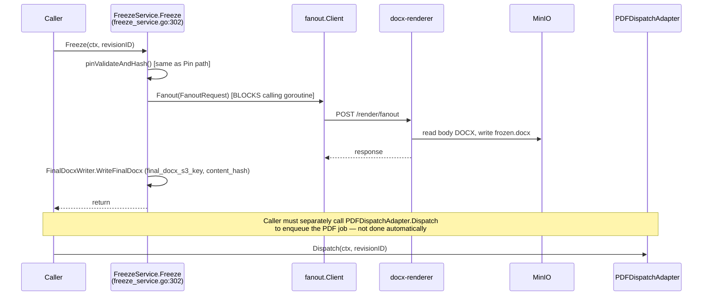
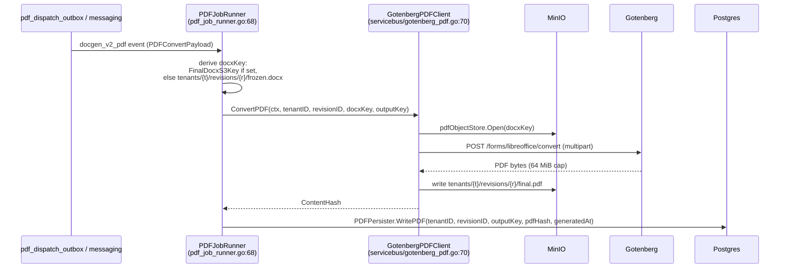
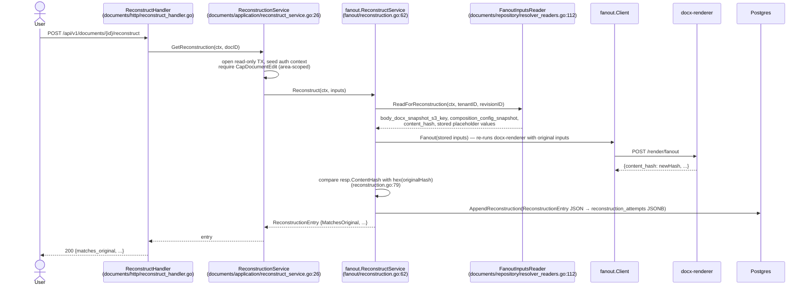
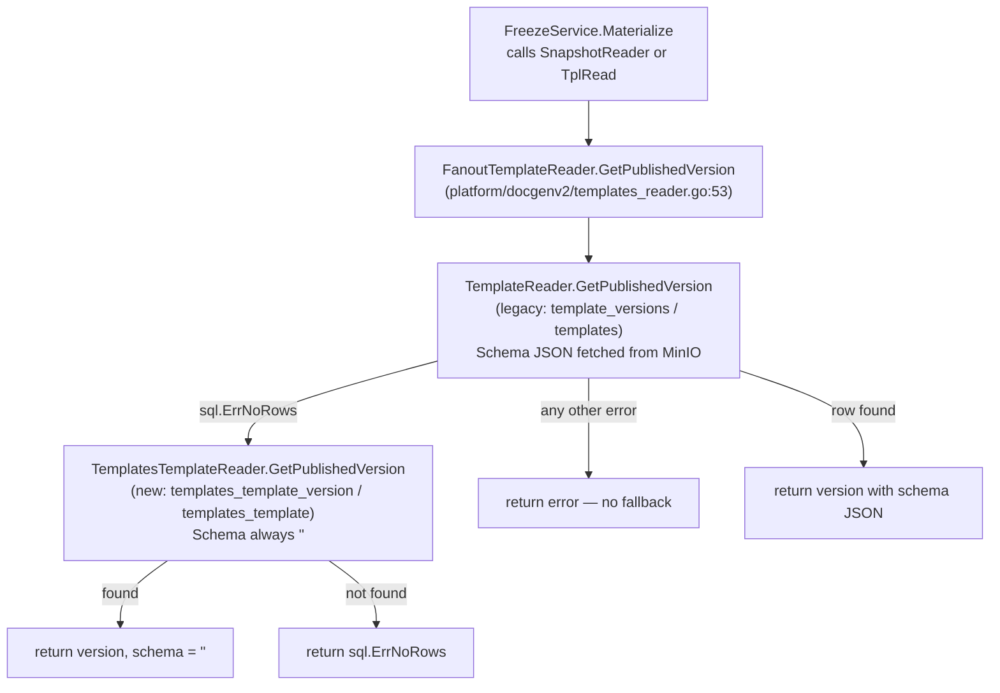

# Document Render Pipeline — End-to-End Flow

> **Last verified:** 2026-06-11
> **Scope:** The complete render pipeline: from approval trigger through placeholder resolution (Pin), async DOCX materialization (Materialize), PDF conversion, to frozen artifact storage. Covers all five flows: primary async freeze, legacy synchronous freeze, PDF conversion, forensic reconstruction, and template reader fallback. Includes all actors: Go API binary, Go worker binary, docx-renderer sidecar, Gotenberg, and MinIO.
> **Key files:**
> - `internal/modules/documents/application/freeze_service.go`
> - `internal/modules/render/fanout/materialize_outbox_worker.go`
> - `internal/modules/render/fanout/pdf_outbox_worker.go`
> - `internal/platform/worker/materialize_job_runner.go`
> - `internal/platform/worker/pdf_job_runner.go`
> - `internal/modules/render/fanout/client.go`
> - `internal/platform/render/gotenberg/client.go`
> - `apps/docx-renderer/src/routes/fanout.ts`

---

## 1. Pipeline overview

The render pipeline converts a document revision's DOCX template and resolved placeholder values into two immutable frozen artifacts: a `frozen.docx` and a `final.pdf`. It spans two processes (API and worker) and two external services (docx-renderer and Gotenberg), with MinIO as the artifact store.

The pipeline is split into two asynchronous phases, following ADR 0015:

| Phase | Name | Boundary | Description |
|---|---|---|---|
| Phase 1 | **Pin** | Inside the approval transaction | Resolve and hash placeholder values; enqueue materialize job in same transaction |
| Phase 2 | **Materialize** | Async — worker process | Call docx-renderer HTTP → MinIO write → enqueue PDF job |
| Phase 3 | **PDF** | Async — worker process | Call Gotenberg → MinIO write → persist PDF key |

This design means no external HTTP calls are made from within the approval database transaction, protecting the transaction from network latency and failure.

---

## 2. Actors and components

| Actor | Binary | Language | Responsibility |
|---|---|---|---|
| `FreezeService` | `metaldocs-api` | Go | Pin (resolve + hash + enqueue) and Materialize (call docx-renderer, write DB) |
| `MaterializeOutboxWorker` | `metaldocs-api` | Go | Polls `materialize_dispatch_outbox`; publishes `docx_materialize` events |
| `MaterializeJobRunner` | `metaldocs-worker` | Go | Handles `docx_materialize` events; calls `FreezeService.Materialize`; commits DOCX key + enqueues PDF |
| `PDFOutboxWorker` | `metaldocs-api` | Go | Polls `pdf_dispatch_outbox`; publishes `docgen_v2_pdf` events |
| `PDFJobRunner` | `metaldocs-worker` | Go | Handles `docgen_v2_pdf` events; calls Gotenberg; writes PDF to MinIO |
| `fanout.Client` | `metaldocs-api` / `metaldocs-worker` | Go | HTTP client — `POST /render/fanout` to docx-renderer |
| `docx-renderer` | standalone sidecar | TypeScript/Node | DOCX token substitution + sub-block injection; reads/writes MinIO directly |
| `GotenbergPDFClient` | `metaldocs-worker` | Go | Opens DOCX from MinIO; calls Gotenberg; writes PDF to MinIO |
| Gotenberg | external service | — | LibreOffice-based DOCX→PDF conversion |
| MinIO | external store | — | Body DOCX (input), frozen DOCX (output), final PDF (output) |

---

## 3. Primary flow: approval-triggered async freeze (Pin → Materialize → PDF)

This is the production path for every document that completes an approval workflow.

```mermaid
sequenceDiagram
    actor Approver
    participant ApprovalSvc as DecisionService<br/>(approval/application)
    participant FreezePin as FreezeService.Pin<br/>(documents/application)
    participant MatOutbox as materialize_dispatch_outbox<br/>(Postgres)
    participant MatWorker as MaterializeOutboxWorker<br/>(metaldocs-api goroutine)
    participant Messaging as messaging.Publisher
    participant MatRunner as MaterializeJobRunner<br/>(metaldocs-worker)
    participant FreezeMAT as FreezeService.Materialize<br/>(documents/application)
    participant FanoutCli as fanout.Client<br/>(Go HTTP)
    participant DocxRend as docx-renderer<br/>POST /render/fanout
    participant MinIO
    participant PdfOutbox as pdf_dispatch_outbox<br/>(Postgres)
    participant PdfWorker as PDFOutboxWorker<br/>(metaldocs-api goroutine)
    participant PdfRunner as PDFJobRunner<br/>(metaldocs-worker)
    participant Gotenberg

    Approver->>ApprovalSvc: submit signoff
    ApprovalSvc->>FreezePin: Pin(ctx, revisionID) [in same TX]
    note over FreezePin: ReadSnapshotWithFreezeAt<br/>already pinned? → return (idempotent)
    FreezePin->>FreezePin: pinValidateAndHash()<br/>validate required placeholders<br/>resolve computed placeholders present in schema<br/>(catalog has exactly 7 tokens per ADR 0008;<br/>only tokens detected in the DOCX are in schema)<br/>upsert resolved values<br/>compute values_hash (SHA-256)
    FreezePin->>FreezePin: WriteFreeze (freeze marker in DB)
    FreezePin->>MatOutbox: INSERT into materialize_dispatch_outbox<br/>ON CONFLICT DO NOTHING
    note over ApprovalSvc,MatOutbox: TX commits — approval + pin + outbox row atomic

    loop every 5 s
        MatWorker->>MatOutbox: ClaimPending (FOR UPDATE SKIP LOCKED, batch 10)
        MatWorker->>Messaging: publish docx_materialize event
    end

    Messaging->>MatRunner: handle docx_materialize event
    MatRunner->>FreezeMAT: Materialize(ctx, payload) [outside TX]
    FreezeMAT->>FreezeMAT: ReadSnapshotWithFreezeAt<br/>load resolved placeholder values<br/>map placeholder IDs → names
    FreezeMAT->>FanoutCli: Fanout(FanoutRequest)
    FanoutCli->>DocxRend: POST /render/fanout<br/>X-Service-Token header
    DocxRend->>MinIO: getObjectBuffer(bodyDocxS3Key)
    DocxRend->>DocxRend: fanout(): render sub-blocks<br/>merge with placeholderValues<br/>processTemplateDetailed (eigenpal)<br/>SHA-256 result
    DocxRend->>MinIO: putObjectBuffer(tenants/{t}/revisions/{r}/frozen.docx)
    DocxRend-->>FanoutCli: {content_hash, final_docx_s3_key, unreplaced_vars}
    FanoutCli-->>FreezeMAT: FanoutResponse

    MatRunner->>MatRunner: open DB TX
    MatRunner->>MatRunner: WriteFinalDocxInTx (final_docx_s3_key, content_hash)
    MatRunner->>PdfOutbox: INSERT into pdf_dispatch_outbox<br/>ON CONFLICT DO NOTHING
    MatRunner->>MatRunner: COMMIT

    loop every 5 s
        PdfWorker->>PdfOutbox: ClaimPending (FOR UPDATE SKIP LOCKED, batch 10)
        PdfWorker->>Messaging: publish docgen_v2_pdf event
    end

    Messaging->>PdfRunner: handle docgen_v2_pdf event
    PdfRunner->>MinIO: Open frozen.docx (via pdfObjectStore)
    PdfRunner->>Gotenberg: POST /forms/libreoffice/convert (multipart DOCX)
    Gotenberg-->>PdfRunner: PDF bytes
    PdfRunner->>MinIO: write tenants/{t}/revisions/{r}/final.pdf
    PdfRunner->>PdfRunner: WritePDF (final_pdf_s3_key, pdf_hash, generated_at)
```

### Key implementation anchors

| Step | File:line |
|---|---|
| `FreezeService.Pin` entry | `internal/modules/documents/application/freeze_service.go:191` |
| Already-pinned idempotency guard | `freeze_service.go:197-199` |
| `pinValidateAndHash` — resolver loop | `freeze_service.go:144` |
| Values hash computation | `freeze_service.go:166-174` |
| Materialize outbox enqueue | `freeze_service.go:218` |
| `MaterializeOutboxWorker.Run` goroutine start | `apps/api/cmd/metaldocs-api/main.go:491-492` |
| Worker poll interval | `materialize_outbox_worker.go:34` / `pdf_outbox_worker.go:34` (5 s ticker, set in constructors) |
| `MaterializeJobRunner.Handle` | `internal/platform/worker/materialize_job_runner.go:59` |
| `FreezeService.Materialize` entry | `freeze_service.go:225` |
| `fanout.Client.Fanout` HTTP call | `freeze_service.go:278` |
| docx-renderer MinIO read | `apps/docx-renderer/src/routes/fanout.ts:52-56` |
| docx-renderer MinIO write (frozen.docx) | `apps/docx-renderer/src/routes/fanout.ts:65-70` |
| Atomic WriteFinalDocx + PDF outbox enqueue | `materialize_job_runner.go:74-87` |
| `PDFOutboxWorker.Run` goroutine start | `apps/api/cmd/metaldocs-api/main.go:488-489` |
| `PDFJobRunner.Handle` | `internal/platform/worker/pdf_job_runner.go:68` |
| Gotenberg DOCX-to-PDF call | `servicebus/gotenberg_pdf.go:70` |
| PDF MinIO write + persist | `pdf_job_runner.go` → `PDFPersister.WritePDF` |

---

## 4. Flow 2: legacy synchronous freeze

This path is **explicitly superseded** by Pin+Materialize. The comment at `freeze_service.go:300` reads: "New code should use Pin (in-tx) + Materialize (async worker) instead." It remains exported and callable.



[runtime-unverified]: Confirm whether any live callsite still invokes `FreezeService.Freeze` in production, or whether it can be removed.

---

## 5. Flow 3: PDF conversion (Gotenberg direct path)

This flow is triggered by `docgen_v2_pdf` events in the outbox, produced either by `PDFOutboxWorker` (async path) or directly by `PDFDispatchAdapter` (legacy path).



---

## 6. Flow 4: forensic reconstruction

Triggered by `POST /api/v1/documents/{id}/reconstruct`. Re-renders the document using stored inputs and compares the resulting hash to the original frozen DOCX hash. Result is appended to `documents.reconstruction_attempts` (JSONB column).



**AuthZ:** `CapDocumentEdit` (area-grade) checked in `ReconstructionService.GetReconstruction` (`reconstruct_service.go:26`). Failure surfaces as `authz.ErrCapDenied` → HTTP 403.

**`EngineVersions` flag:** `ReconstructService` is constructed with `EngineVersions{EigenpalVer: "local", DocxtemplaterVer: "local"}` (`apps/api/cmd/metaldocs-api/main.go:424`). The forensic record always carries `"local"` version strings, rendering cross-version hash comparison meaningless. `ReconstructionService` is wired only in the API binary; `apps/worker/cmd/metaldocs-worker/main.go` does not construct it.

---

## 7. Flow 5: template reader fallback (docgenv2 dual-reader)

This is not a user-visible flow but an infrastructure-layer branching path used each time a materialize job needs the template DOCX.



This fallback exists because the codebase is mid-migration between two template schemas. Once the legacy `template_versions`/`templates` tables are fully migrated, `TemplateReader` and the `FanoutTemplateReader` chain should be removed.

---

## 8. Outbox pattern — concurrency and reliability

Both outbox workers follow the same pattern (ADR 0009, ADR 0015):

| Property | Value | Source |
|---|---|---|
| Poll interval | 5 s | `pdf_outbox_worker.go` / `materialize_outbox_worker.go` |
| Batch size | 10 rows | same |
| Max attempts | 5 | same |
| Stale-claim reset threshold | 5 minutes in `processing` | `pdf_outbox_repository.go:147` |
| Backoff base | 30 s | outbox worker |
| Backoff cap | 30 m | outbox worker |
| Claim query | `FOR UPDATE SKIP LOCKED` | `pdf_outbox_repository.go:48-57` |
| Deduplication | `ON CONFLICT (tenant_id, revision_id) DO NOTHING` | both outbox repos |

The `FOR UPDATE SKIP LOCKED` claim pattern makes the outbox workers safe to run as multiple concurrent instances without coordination.

**Cross-tenant claim:** the `pdf_dispatch_outbox` claim query is currently cross-tenant (drains across all tenants). The TODO at `pdf_outbox_repository.go:43` documents this as a known future multi-tenant concern.

**Idempotency on retry:** the frozen DOCX is written to a deterministic MinIO key (`tenants/{t}/revisions/{r}/frozen.docx`). If the worker is killed after the docx-renderer HTTP call succeeds but before the DB transaction commits, the outbox row remains in `processing` until `ResetStaleClaims` resets it after 5 minutes, and the next retry writes to the same MinIO key. Whether this produces an idempotent re-run depends on MinIO PUT semantics (unconditional overwrite at the same key) — [runtime-unverified: confirm that MinIO PUT at the same key is unconditionally overwriting; no MetalDocs code or config verifies this property].

---

## 9. Persistence map

### Tables

| Table | Schema | Written by | Read by |
|---|---|---|---|
| `pdf_dispatch_outbox` | `metaldocs` | `PDFOutboxRepository.Enqueue` | `PDFOutboxRepository.ClaimPending`, `ReadState` |
| `materialize_dispatch_outbox` | `metaldocs` | `MaterializeOutboxRepository.Enqueue` | `MaterializeOutboxRepository.ClaimPending` |
| `documents` (freeze columns) | `metaldocs` | `FreezeFinalizer.WriteFreeze`, `FinalDocxWriter.WriteFinalDocx`, `PDFPersister.WritePDF` | `FanoutInputsReader.ReadForReconstruction`, `RevisionReader`, `DocumentContextBuilder` |
| `documents.reconstruction_attempts` (JSONB) | `metaldocs` | `ReconstructionWriter.AppendReconstruction` | (read by forensics/audit consumers) |
| `approval_signoffs`, `approval_instances` | `metaldocs` | approval module | `WorkflowReader.GetApprovers`, `GetFinalApprovalDate` (`resolver_readers.go:66-103`) |
| `template_versions`, `templates` | legacy | templates module (legacy) | `TemplateReader.GetPublishedVersion` |
| `templates_template_version`, `templates_template` | new | templates module (new) | `TemplatesTemplateReader`, `TemplatesSnapshotReader` |

### MinIO object keys

| Key pattern | Created by | Consumed by |
|---|---|---|
| `<bodyDocxS3Key>` (from snapshot) | templates module (upload time) | docx-renderer (read) |
| `tenants/{t}/revisions/{r}/frozen.docx` | docx-renderer (`routes/fanout.ts:65-70`) | `GotenbergPDFClient` (read) |
| `tenants/{t}/revisions/{r}/final.pdf` | `GotenbergPDFClient` | browser presigned GET |

---

## 10. Error handling

| Boundary | Behavior |
|---|---|
| `fanout.Client.Fanout` non-200 response | Returns error with status code and body; no RFC 9457 parsing (`client.go:58`) |
| Outbox worker dispatch error (< 5 attempts) | `MarkFailed` with exponential backoff; `slog.Warn` |
| Outbox worker dispatch error (attempt 5, terminal) | `MarkFailed` with `finalize=true`; `slog.Error` |
| `MaterializeJobRunner.Handle` error before TX | Returned to `worker.Service.markFailure` → retry or dead-letter |
| `ApprovalDateResolver` with zero date | Hard error — `approval_date.go:30`; not a blank fallback |
| `FreezeService.Materialize` when not pinned | Hard error — `freeze_service.go:235` |
| `ReconstructionService` authz denied | `authz.ErrCapDenied` → HTTP 403 |
| `TemplatesSnapshotReader` not found | `sql.ErrNoRows` mapped to `domain.ErrSnapshotTemplateNotFound` |
| Gotenberg body size cap | [runtime-unverified] 64 MiB PDF response cap; 4 KiB error response cap — these are Gotenberg service defaults, not configurable from MetalDocs code; no cap is set in `gotenberg_pdf.go` or `config/gotenberg.go` |

---

## 11. Observability

All observability in this pipeline is log-based. No metrics or traces instrumentation is present in the render pipeline code [runtime-unverified: whether the `platform/observability` HTTP middleware captures render-related request metrics at the API layer].

| Component | Log approach |
|---|---|
| `PDFOutboxWorker` / `MaterializeOutboxWorker` | `slog.Warn` / `slog.Error` with `id`, `revision_id`, `tenant_id` fields |
| `MaterializeJobRunner` | `slog.InfoContext` on success |
| `DocumentContextBuilder` approval lookup | `slog.WarnContext` on failure (best-effort, non-fatal) |
| docx-renderer | Fastify built-in logger at `LOG_LEVEL`; request/response logged automatically |
| `worker.Service` batch outcomes | `slog.InfoContext` / `slog.ErrorContext` |

---

## 12. Legacy and open flags

| Flag | Location | Description | RF ref |
|---|---|---|---|
| `PDFOutboxWorker` and `MaterializeOutboxWorker` are near-identical clones | `fanout/pdf_outbox_worker.go`, `fanout/materialize_outbox_worker.go` | Same tick/claim/dispatch/backoff algorithm with identical constants; bug fixes and tuning changes must be applied twice | — |
| `PDFOutboxRepository` and `MaterializeOutboxRepository` are near-identical clones | `fanout/pdf_outbox_repository.go`, `fanout/materialize_outbox_repository.go` | All six methods identical except table name and row type; classic copy-paste duplication | — |
| `FreezeService.Freeze` is a legacy synchronous path | `freeze_service.go:302` | Comment-marked "use Pin+Materialize instead"; remains exported; blocks calling goroutine on docx-renderer HTTP | — |
| `EngineVersions` hardcoded to `"local"` | `main.go:424` | Reconstruction records always carry `eigenpal_ver="local"` and `docxtemplater_ver="local"`; cross-version forensics is currently meaningless | — |
| `GetFinalApprovalDate` not deterministic for multiple approval cycles | `resolver.go:70-72`, `resolver_readers.go:93-101` | Returns `MAX(signed_at)` across all approval instances for a revision; rework cycles produce non-deterministic approval date | — |
| `pdf_dispatch_outbox` claim is cross-tenant | `pdf_outbox_repository.go:43` | Intentional today; documented as a future multi-tenant concern; no tenant predicate in claim query | — |
| Hardcoded Portuguese fallback in `approvers` resolver | `approvers.go:34` | `"[aguardando aprovação]"` baked into resolver; no i18n mechanism | — |
| `controlled_by_area` is resolver version 2 while all others are version 1 | `controlled_by_area.go:14` | No resolver versioning/migration policy; registry silently takes last-registered version per key | — |

See also [../_artifacts/stage1/synthesis-legacy.md](../_artifacts/stage1/synthesis-legacy.md) for the full cross-cutting legacy register.

---

## 13. Related documents

- Platform rendering packages: [../platform/rendering.md](../platform/rendering.md)
- docx-renderer sidecar binary: [../binaries/docx-renderer.md](../binaries/docx-renderer.md)
- Strategic async tier: [../../architecture/backend-blueprint.md](../../architecture/backend-blueprint.md) concern C6
- Transactional outbox pattern: ADR 0009, ADR 0015 (`wiki/decisions/`)
- Target architecture binary contracts: [../../architecture/backend-target-architecture.md](../../architecture/backend-target-architecture.md) §1 (target topology)

---

## Sources

Stage-1 artifact: `wiki/backend/_artifacts/stage1/render-pipeline.md` (all sections — §1 identity, §3 public surface, §4 logic flows, §5 dependencies, §6 persistence, §7 config, §8 concurrency, §9 error handling, §10 legacy flags, §11 wiki drift).
