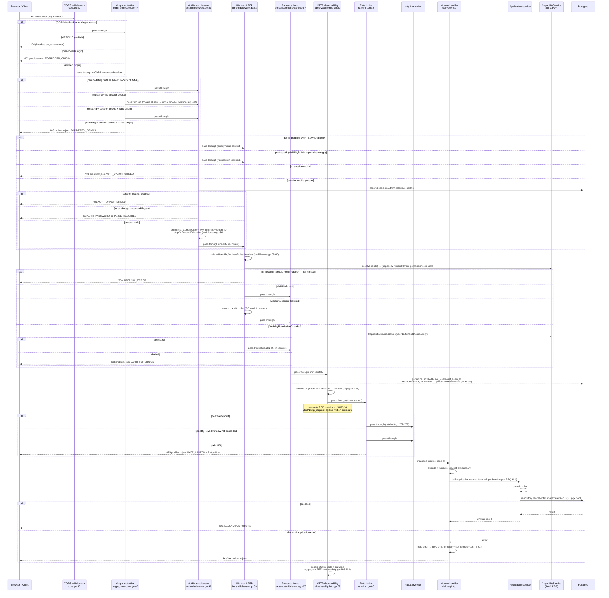

# Request Lifecycle — One HTTP Request End-to-End

> **Last verified:** 2026-06-11
> **Scope:** The complete synchronous path of a single HTTP request through the `metaldocs-api` binary: from network arrival through every middleware layer to the module handler and back to the response, including authn, tier-1 authz (PEP/PDP), error paths, and RFC 9457 problem envelope. Async side-effects (outbox dispatch, presence write) are noted but not traced here.
> **Key files:**
> - `apps/api/cmd/metaldocs-api/main.go:595-602` — middleware chain composition
> - `apps/api/cmd/metaldocs-api/permissions.go` — tier-1 route → capability/visibility truth table
> - `internal/platform/security/cors.go:50` — CORS layer
> - `internal/platform/security/origin_protection.go:47` — origin protection layer
> - `internal/modules/auth/delivery/http/middleware.go:49` — authn layer
> - `internal/modules/iam/delivery/http/middleware.go:53` — tier-1 authz PEP layer
> - `internal/modules/iam/presence/middleware.go:67` — presence bump layer
> - `internal/platform/observability/http.go:59` — HTTP observability layer
> - `internal/platform/security/ratelimit.go:88` — rate limiter layer
> - `internal/platform/problem/problem.go:76` — RFC 9457 error envelope

---

## 1. Sequence diagram



---

## 2. Middleware chain composition

Composed at `main.go:595-602`, outermost → innermost:

```
cors → originProtection → authMiddleware → iamMiddleware → presenceBump → httpObs → rateLimiter → mux
```

The chain is built by wrapping: each middleware receives the next handler as its argument and calls it if the request passes its check. The outermost handler is what `http.Server` receives.

---

## 3. Layer details

### Layer 1 — CORS (`internal/platform/security/cors.go:50`)

- No-op when `METALDOCS_CORS_ENABLED` ≠ `true` or when the request carries no `Origin` header.
- Preflight `OPTIONS` responses are 204 and never reach inner layers.
- Disallowed origin → 403 with code `FORBIDDEN_ORIGIN`.
- In the default environment (`METALDOCS_CORS_ENABLED` defaults to `false`), this layer is a pass-through for all non-OPTIONS requests.

### Layer 2 — Origin protection (`internal/platform/security/origin_protection.go:47`)

- Applies only to state-changing methods (`POST`, `PUT`, `PATCH`, `DELETE`) carrying the session cookie.
- Validates `Origin` or `Referer` against the same origin (X-Forwarded-Proto honored only from `METALDOCS_TRUSTED_PROXY_CIDRS`, `origin_protection.go:110-128`) or the `METALDOCS_AUTH_TRUSTED_ORIGINS` allowlist.
- Failure → 403 `FORBIDDEN_ORIGIN`.
- Enabled by `METALDOCS_AUTH_ORIGIN_PROTECTION_ENABLED`; defaults to `authn.Enabled()` (`authn/config.go:141`).
- This is the CSRF-class defense for a cookie-session API (no separate CSRF token is used).

### Layer 3 — Authentication / AuthN (`internal/modules/auth/delivery/http/middleware.go:49`)

- Whole layer is a no-op when `authn.Enabled()` is false — only allowed with `APP_ENV=local` (`authn/config.go:39-41`).
- Public paths are identified by the kernel's shared `publicPathChecker` injected at `main.go:237-238` — they pass with no session.
- Session cookie required for all other paths; its absence → 401 `AUTH_UNAUTHORIZED`.
- `ResolveSession` (`middleware.go:66-75`): validates cookie, loads session record, checks expiry.
- Must-change-password fence → 403 `AUTH_PASSWORD_CHANGE_REQUIRED`.
- On success: enriches context with `CurrentUser`, IAM auth context, tenant ID; strips `X-Tenant-ID` header from the request (`middleware.go:86`) so downstream handlers cannot be spoofed.

### Layer 4 — Tier-1 AuthZ PEP (`internal/modules/iam/delivery/http/middleware.go:53`)

- Strips `X-User-ID` and `X-User-Roles` headers (`:59-60`) — these can never be caller-supplied.
- Fails closed on a nil resolver (`:63-66`) — should never happen; guards against incorrect composition.
- Resolves `(capability, visibility)` for the request from the kernel's `permissions.go` table via the injected resolver.
- Public → pass through.
- Session-required → enriches context with user roles; passes through.
- Permission-guarded → calls `CapabilityService.CanDo` (the PDP); allowed → enriches authz context and passes; denied → 403 `AUTH_FORBIDDEN`.
- **Tier-2 (area-scoped) authorization does not happen here.** It happens inside the owning module's application service, inside the transaction. This layer does route-level tier-1 only (REQ-MW-6; see `wiki/concepts/authz-tiers.md`).

### Layer 5 — Presence bump (`internal/modules/iam/presence/middleware.go:67`)

- Reads user ID from context (written by layers 3/4).
- If a user ID is present, launches a **fire-and-forget goroutine** to update `iam_users.last_seen_at`; updates are debounced per user at 60s (`presence/model.go:27`); the goroutine uses a 2s DB timeout (`middleware.go:47-49`).
- The goroutine is not joined — the response path does not wait for it. A DB failure here is silently dropped (logged by the goroutine).
- Wrapped into the chain only when an SQL DB exists (`main.go:599-601`).

### Layer 6 — HTTP observability (`internal/platform/observability/http.go:59`)

- Resolves an existing `X-Trace-Id` request header or generates a new UUID; stores in context (`http.go:61-65`).
- Wraps the inner handler call; measures response status code and duration.
- Aggregates per-route RED metrics with p50/p95/p99 ring buffers (`http.go:266-301`).
- Emits one structured JSON `http_request` log line per request.

**Known gap:** because `httpObs` sits *inside* the authn and CORS layers, requests rejected by CORS (403), origin protection (403), or authn (401) are **not counted in RED metrics**. This is a documented deviation against REQ-MW-4; see RF-2 in `wiki/architecture/backend-target-architecture.md:296`.

### Layer 7 — Rate limiter (`internal/platform/security/ratelimit.go:88`)

- Skips health endpoints (`:177-179`).
- Identity key: session user ID if available (set by authn); otherwise client IP resolved via trusted-proxy logic (`:181-192`).
- Fixed-window counters in memory; 100k-entry cap. When the cap is full, **new identities are denied** (fail-closed, `:23, :121-127`).
- Over limit → 429 `RATE_LIMITED` with `Retry-After` header.
- In the default environment (`METALDOCS_RATE_LIMIT_ENABLED` defaults to `false`) this layer is a pass-through. There is no pre-auth IP-keyed limit tier for `/api/v1/auth/login` at the middleware layer (account lockout handles login brute-force separately via `authn/config.go:88-104`).

### Layer 8 — Handler dispatch (`http.ServeMux`)

- Standard Go `http.ServeMux` pattern matching.
- All routes registered by module `RegisterRoutes` calls during startup (§8 of `../http-kernel.md`).
- Handlers follow the delivery pattern: decode → validate at boundary → call one application service → map result to contract (REQ-H-1).
- All error responses use RFC 9457 `application/problem+json` via `internal/platform/problem/problem.go:76-83` (REQ-H-2).

---

## 4. Key context values set by the chain

By the time a module handler is reached, the request context carries:

| Key | Set by | Notes |
|---|---|---|
| `CurrentUser` | AuthN middleware (`middleware.go:81`) | `nil` on public routes |
| IAM auth context | AuthN middleware (`middleware.go:82`) | Contains session info |
| Tenant ID | AuthN middleware (`middleware.go:83`) | Stripped from `X-Tenant-ID` header |
| User roles | IAM middleware (`resolveRoles :157`) | Loaded from DB for session-required+ routes; `resolveRoles` is triggered at `:102-109` (session-required) and `:124` (permission-guarded) |
| AuthZ decision context | IAM middleware (`CanDo :119-122`) | Capability check; pass means `next` is called with enriched role context from `resolveRoles :157` |
| Trace ID | HTTP observability (`http.go:61-65`) | UUID string; propagated into log lines and audit rows |

---

## 5. Error code reference

| Code | HTTP status | Emitted by |
|---|---|---|
| `FORBIDDEN_ORIGIN` | 403 | CORS layer, origin protection layer |
| `AUTH_UNAUTHORIZED` | 401 | AuthN middleware |
| `AUTH_PASSWORD_CHANGE_REQUIRED` | 403 | AuthN middleware |
| `AUTH_FORBIDDEN` | 403 | IAM tier-1 PEP |
| `INTERNAL_ERROR` | 500 | IAM middleware (nil resolver guard) |
| `RATE_LIMITED` | 429 | Rate limiter (+ `Retry-After` header) |
| Module-specific codes | 4xx/5xx | Module handlers via `platform/problem` |

All codes are from the closed vocabulary in `internal/platform/problem/` (canonical vocabulary completed 2026-06 per commits `ef696a177`, `2369a02bf`).

---

## 6. Async side-effects triggered per request

These do not block the synchronous response:

| Side-effect | Trigger | Mechanism |
|---|---|---|
| `iam_users.last_seen_at` update | Any authenticated request (debounced 60s) | Goroutine in presence bump middleware |
| PDF render outbox | Document freeze in module transaction | `INSERT` into outbox table (same tx); relay worker picks up asynchronously |
| Materialize outbox | Document materialization in module transaction | Same pattern |
| Audit event | Document/authz-bypass writes in module handler | Kernel adapter at `main.go:743-771, 784-829`; fire-and-forget for some paths |

---

## 7. Known deviations from the target lifecycle

These are factual observations, not redesign proposals. Each maps to a registered item in `wiki/architecture/backend-target-architecture.md`.

| Deviation | Target requirement | Registered as |
|---|---|---|
| No panic-recovery middleware at the outermost layer — a panicking handler crashes the connection with no `problem+json` or tagged log line | REQ-MW-1 | RF-2 |
| Request ID / trace ID created inside `httpObs` (layer 6), not at the outermost layer — unavailable in CORS/origin/authn rejections | REQ-MW-2 | RF-2 |
| `httpObs` (metrics + logging) sits *inside* authn — 401/403/CORS rejects invisible to RED metrics | REQ-MW-4 | RF-2 |
| No pre-auth IP-keyed rate limit tier for `/api/v1/auth/login` at the middleware layer | REQ-MW-5 | RF-2 |
| Middleware chain order not asserted by any test | REQ-MW-7 | — |

---

## 8. Legacy and open flags

| Flag | Severity |
|---|---|
| Middleware ordering (CORS/authn outside metrics/rate-limit) — see §7 | high (RF-2, already registered) |
| No panic recovery in the chain | medium (RF-2) |
| No chain-order test | medium |
| `defaultPublicPaths` in `auth/middleware.go:94-105` is a drifted copy of the kernel's public list; misclassifies `POST /auth/logout` as public and omits `/healthz` | low (reachable only when `WithPublicPathChecker` is not injected) |

See also: [../legacy-register.md](../legacy-register.md).

---

## Sources

Stage-1 artifact: `wiki/backend/_artifacts/stage1/http-kernel.md`

Strategic context: `wiki/architecture/backend-blueprint.md §3` · `wiki/architecture/backend-target-architecture.md §2`
