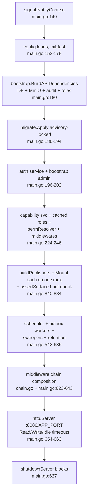
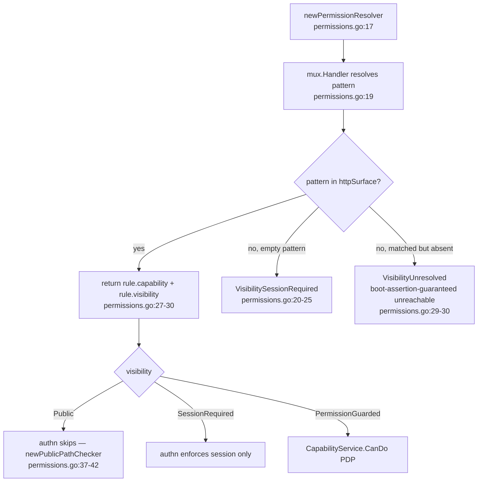
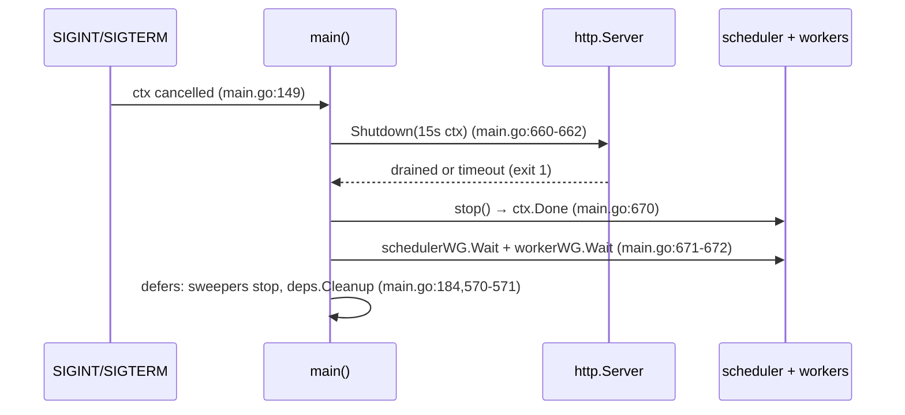

# HTTP Kernel — Composition Root, Middleware Chain, and Startup

> **Last verified:** 2026-08-06 (http-surface-protocol program close-out — scoped to §2 file inventory, §3 public surface, §4 step 8, §6 tier-1 resolution, §11 flags: `permissions.go`'s `routeRules` table deleted (Task 18), tier-1 now reads the generated `httpSurface` table, and per-module `RegisterRoutes` was replaced by `SurfacePublisher.Mount`; see ADR [`0090`](../decisions/0090-tier1-pdp-generated-from-spec.md) and ADR [`0091`](../decisions/0091-http-surface-protocol.md). §5, §7–§10, §12 were **not** reverified this pass — they carry the prior verification date below and may contain unrelated drift (e.g. the scheduler/River description in §8 predates this program).) | **Prior:** 2026-07-16 (ROADMAP unit 4.5 — e2e-seed raw-SQL bullet removed, `ensurePODefaultTemplateBinding` deleted and `document_profile_template_defaults` dropped by migration 0308) | **Prior:** 2026-07-02 (§8 outbox relay rows updated for the StagingOutboxWorker consolidation; other §8 anchors verified 2026-06-11) | **Prior:** 2026-06-11 (Wave 1)
> **Scope:** The `apps/api` composition root: startup sequence, dependency injection, middleware chain, routing, server lifecycle, graceful shutdown, and tier-1 authorization data source. Does not cover per-module business logic or persistence owned by domain modules.
> **Key files:**
> - `apps/api/cmd/metaldocs-api/main.go` — composition root (config → DI → publisher mount → lifecycle); 1290 lines
> - `apps/api/cmd/metaldocs-api/chain.go` — declarative middleware chain (`apiChain`/`buildChain`/`loginRateLimit`); Wave 1
> - `apps/api/cmd/metaldocs-api/chain_test.go` — order assertion (REQ-MW-7); Wave 1
> - `apps/api/cmd/metaldocs-api/permissions.go` — tier-1 pattern lookup into the generated `httpSurface` table (63 lines; `routeRules` deleted Task 18)
> - `apps/api/cmd/metaldocs-api/httpsurface_gen.go` — generated `map[string]surfaceRule` (147 entries), produced by `cmd/gen-http-surface` from the OpenAPI spec's `x-authz-*` extensions
> - `apps/api/cmd/metaldocs-api/surface.go` — `assertSurface`, the boot assertion (4 checks) that proves mounted routes and declared routes coincide
> - `apps/api/cmd/metaldocs-api/publishers.go` — `publisherDeps`/`buildPublishers`, the composition root's publisher list (replaces the old `routeHandlers{...}` struct)
> - `internal/platform/httprouter/publisher.go` — `SurfacePublisher` interface every route owner implements
> - `apps/api/cmd/metaldocs-api/reauth.go` — sign-off e-signature re-auth wiring
> - `apps/api/internal/wiring/documents.go` — capability-checker adapter (the only non-main package exported by this binary)
> - `internal/platform/bootstrap/api.go` — shared dependency construction (`BuildAPIDependencies`)
> - `internal/platform/middleware/recovery.go` — panic-recovery middleware (`platformmw.Recovery`); Wave 1
> - `internal/platform/migrate/migrate.go` — advisory-locked startup migration applier
> - `internal/platform/authn/config.go` — authn/authz config (session TTL, cache TTL, origin protection)

---

## 1. Identity and purpose

`apps/api` is the **composition root** of the MetalDocs HTTP backend. It contains two binaries:

- **`metaldocs-api`** — the API server. It owns the full startup sequence: config load, Postgres connect, startup migrations, DI of every domain module, route mounting via each module's `SurfacePublisher.Mount` on a single `http.ServeMux`, a boot assertion that the mounted surface matches the declared one, middleware chain composition, background goroutine launch, and the graceful shutdown path. Tier-1 authorization is a **pattern lookup into the generated `httpSurface` table** (`permissions.go`, ADR [`0090`](../decisions/0090-tier1-pdp-generated-from-spec.md)) — the table itself is generated from the OpenAPI spec by `cmd/gen-http-surface`, not hand-typed in this binary.
- **`metaldocs-e2e-seed`** — a one-shot E2E test-account seeder (separate binary, same source tree).

No business logic lives in `apps/api`. Everything is wiring and boundary adapters between domain modules that must not import each other directly. The kernel sits above the module layer; it is never imported by modules.

Sibling binaries `metaldocs-jobs` (`apps/jobs`) and `metaldocs-worker` (`apps/worker`) are separate areas.

---

## 2. File inventory

### apps/api/cmd/metaldocs-api

| File | Role |
|---|---|
| `apps/api/cmd/metaldocs-api/main.go` | Composition root. 1290 lines. Config → DB → migrations → DI of all modules → publisher construction + `Mount` on one mux + `assertSurface` boot check → middleware chain → server lifecycle → shutdown. |
| `apps/api/cmd/metaldocs-api/permissions.go` | Tier-1 pattern lookup into the generated `httpSurface` table (63 lines; the hand-typed `routeRules` table and its `resolveRoutePermission` walker were deleted Task 18, commit `cc35b5f8`). `newPermissionResolver` + `newPublicPathChecker` + `newPasswordChangeAllowedChecker` share the same table lookup, used by the authn and IAM middlewares. |
| `apps/api/cmd/metaldocs-api/httpsurface_gen.go` | Generated `map[string]surfaceRule` (147 entries), keyed by mux pattern; produced by `cmd/gen-http-surface` from the OpenAPI spec's `x-authz-capability`/`x-authz-visibility` extensions. Committed, never hand-edited. |
| `apps/api/cmd/metaldocs-api/httpsurface_e2e_gen.go` | Same generation, for the optional E2E-only spec; merged into `httpSurface` only when `METALDOCS_E2E=1`. |
| `apps/api/cmd/metaldocs-api/surface.go` | `assertSurface` (152 lines): the boot assertion. Four checks — tag coverage, mounted ⊆ declared, declared ⊆ mounted, per-publisher tag ownership — aggregated into one fatal error. |
| `apps/api/cmd/metaldocs-api/publishers.go` | `publisherDeps` struct + `buildPublishers` (50 lines): the composition root's route inventory as an ordered list of 16 `SurfacePublisher`s (17 with E2E), replacing the old keyed-struct pattern. |
| `apps/api/cmd/metaldocs-api/httpsurface_e2e_publisher.go` / `httpsurface_e2e_publisher_stub.go` | Build-tag-gated E2E publisher (`e2ePublisher`), appended to the publisher list only under `METALDOCS_E2E=1`. |
| `apps/api/cmd/metaldocs-api/reauth.go` | Sign-off e-signature re-auth wiring: adapts auth identity repo to the approval signature port; builds the password re-auth provider registry with an in-memory failure rate limiter. |
| `apps/api/cmd/metaldocs-api/main_test.go` | Shutdown-path unit tests (server error joins scheduler, `ErrServerClosed` → exit 0, ctx-cancel drains workers) + guard tests for postgres-mode / fanout-URL / capability-service preconditions. |
| `apps/api/cmd/metaldocs-api/permissions_test.go` | Resolver lock tests: per-route cap/visibility lookup against `httpSurface`, fail-closed default on an unmatched-but-mounted pattern, methodless-write-shadowing guard, registry/seed cross-checks against `db/reference-data/0001_product_reference_data.sql`. |
| `apps/api/cmd/metaldocs-api/permissions_authz_scope_test.go` | Binds the generated `httpSurface` table to the OpenAPI spec: every area-grade capability with a documented HTTP surface must declare `x-authz-area` or a justified `x-authz-skip-area` (ADR 0022 Phase 7). |
| `apps/api/cmd/metaldocs-api/surface_conformance_test.go` | The per-operation conformance suite: walks every declared operation and asserts its capability is genuinely enforced at tier-1. Includes `TestNoDeclaredOperationIsUnreachable`, **red by design** — see §6. |
| `apps/api/cmd/metaldocs-api/surface_test.go`, `surface_edge_test.go`, `httpsurface_parity_test.go` | Unit coverage for `assertSurface`'s four checks and edge cases. |
| `apps/api/cmd/metaldocs-api/e2e_gate_test.go` | Locks the `METALDOCS_E2E=1` gate: only the literal `"1"` value mounts `/internal/test/*` handlers. |

### apps/api/cmd/metaldocs-e2e-seed

| File | Role |
|---|---|
| `apps/api/cmd/metaldocs-e2e-seed/main.go` | Creates/resets the `e2e-admin` user with `system_admin` role and ensures the `po` profile→template default binding exists (raw SQL upsert). Postgres mode only. |

### apps/api/internal/wiring

| File | Role |
|---|---|
| `apps/api/internal/wiring/documents.go` | `NewCapabilityChecker`: adapts `*iamapp.CapabilityService` (string capability) to `docsapp.CapabilityChecker` (typed `iamdomain.Capability`). The sole non-main package in the binary tree; imported only by `main.go:40`. |

---

## 3. Public surface

`apps/api` exports nothing importable by other modules. Both `cmd` packages are `package main`, and `metaldocs/apps/api/internal/wiring` is imported solely by `apps/api/cmd/metaldocs-api/main.go` (grep-verified, no other importer in the repo).

Every public route is mounted by a `httprouter.SurfacePublisher.Mount` call (`internal/platform/httprouter/publisher.go:19`) — there is no route registered directly by kernel code outside a publisher, with one deliberate exception: the Prometheus scrape endpoint below, which is not part of the public API surface at all.

| Method | Path | Tier-1 binding | Mounted by |
|---|---|---|---|
| `GET` | `/api/v1/metrics` (JSON, per-route RED aggregation) | `metrics.view`, permission-guarded; tag `observability` (`httpsurface_gen.go:276-280`) | the `observability` publisher, via the publisher list (`main.go:840-857`) |
| `GET` | `/metrics` (Prometheus text exposition) | Not in the OpenAPI spec, not authn/iam-gated — served on a **dedicated listener** (`METRICS_ADDR`, default `:9090`), never the public API server, so exposure is a process-topology fact and cannot depend on ingress discipline (F-R1) | `metricsMux` on `metricsServer`, constructed directly in `main` (`main.go:990-997`) |
| `POST` | `/internal/test/seed`, `/internal/test/reset` | Fail-closed session-required default (unmatched pattern would hit the boot-assertion-guaranteed-unreachable branch — but these patterns ARE in the E2E surface table when mounted); mounted only when `METALDOCS_E2E=1`, via the `internal-e2e` publisher | `e2ePublisher` (`httpsurface_e2e_publisher.go:37-38`), appended to the publisher list at `main.go:863-866` |
| `GET` | `/internal/test/governance-events` | Same gate | same |
| `POST` | `/internal/test/advance-clock` | Same gate | same |

Note: `/internal/test/trigger-scheduler-tick` is registered only when a non-nil `runSchedulerTick` is passed to `internal/test.RegisterE2EHandlers`; `e2ePublisherImpl` never sets that field (`httpsurface_e2e_publisher.go:25-31`), so that route is never reachable in this binary. In builds without the e2e build tag, `e2ePublisher` returns `nil` (`httpsurface_e2e_publisher_stub.go:17`) and the whole family is absent — Mount-is-total still holds because the publisher itself is absent from the list, not silently skipped.

### Tier-1 route classification summary

The kernel's real "public surface" is the **generated `httpSurface` table** (`httpsurface_gen.go`, `map[string]surfaceRule`, 147 entries) consumed by both middlewares through `permissions.go`'s pattern lookup — see ADR [`0090`](../decisions/0090-tier1-pdp-generated-from-spec.md). The table is produced by `cmd/gen-http-surface` from the OpenAPI spec's `x-authz-capability`/`x-authz-visibility` extensions; it is not hand-maintained in this binary, so classification counts by tier live in the spec annotations and the generated file, not in prose here — see `docs/superpowers/analysis/2026-08-05-annotation-review.md` for the row-by-row review of all 147 entries.

- **Public (no session):** e.g. `GET /api/v1/health/*`, `POST /api/v1/auth/login`, `GET /api/v1/feature-flags` — any entry with `visibility: iamdelivery.VisibilityPublic`. `/healthz` no longer exists as a route (deleted, not exempted — see `health_delta_test.go`).
- **Session-required (no capability check):** e.g. `GET /auth/me`, `POST /auth/change-password`, `POST /auth/logout` — `visibility: VisibilitySessionRequired` with no `capability`.
- **Permission-guarded:** every entry carrying a non-empty `capability` — documents, templates, taxonomy, controlled-documents, IAM, approval, audit, search, security, observability, notifications, distribution, tokens.
- **Unresolved (boot-unreachable):** a matched mux pattern with no `httpSurface` entry returns `VisibilityUnresolved`, not a guessed fallback — `assertSurface`'s four boot checks (§6, ADR 0091) make that branch structurally unreachable at a boot that succeeds.

Resolution algorithm: `newPermissionResolver` (`permissions.go:17-35`) does one map lookup — `httpSurface[pattern]` — against the pattern the stdlib `http.ServeMux` already matched. There is no ordered scan, no rule-field AND-ing, and no first-match-wins semantics to reason about; those existed only under the deleted `routeRules` table.

---

## 4. Startup sequence



Step-by-step:

1. **Signal context** — install SIGINT/SIGTERM-cancelled root context (`main.go:149-150`).
2. **Config, fail-fast** — load and validate in order: repository mode (must be `postgres`, enforced by `requirePostgresRepositoryMode` at `main.go:677-682`), rate limit, CORS, attachments, auth runtime, feature flags (`main.go:152-178`).
3. **Shared dependencies** — `bootstrap.BuildAPIDependencies` (`main.go:180-184`): opens Postgres (`internal/platform/bootstrap/api.go:80-82`), builds auth/IAM/audit repositories, outbox publisher, optional MinIO clients + Gotenberg PDF converter, runtime status provider (`internal/platform/bootstrap/api.go:107-125`). `deps.Cleanup` is deferred.
4. **Startup migrations** — unless `METALDOCS_SKIP_STARTUP_MIGRATIONS=true`; directory defaults to `db/migrations`, overridable via `METALDOCS_MIGRATIONS_DIR` (`main.go:186-194`). The applier takes a Postgres advisory lock (`0x4D444D4947528000`), reads `public.schema_migrations`, executes unapplied `NNNN_*.sql` files in lexical order, and requires explicit `BEGIN/COMMIT` per file (`internal/platform/migrate/migrate.go:31-95`).
5. **Auth service** — construct + bootstrap local admin account (`main.go:196-202`).
6. **Audit service** — construct; wire export pipeline if counters/exports exist; set the global tier-2 bypass audit sink so `system_admin` short-circuits are recorded (`main.go:204-218`; adapter at `main.go:732-771`).
7. **AuthZ spine** — build `CapabilityService` (`main.go:224-230`, also wired as capability-hint provider into auth responses), TTL-cached role provider (`main.go:231`; TTL from `METALDOCS_AUTHZ_CACHE_TTL_SECONDS`, default 30s via `authn/config.go:25-35`), shared permission resolver (`main.go:236`), auth middleware with injected public-path checker (`main.go:237-238`), IAM middleware with injected resolver (`main.go:239-240`), origin protection (`main.go:241-246`).
8. **Route mounting** — `buildPublishers` (`publishers.go`) assembles the ordered list of 16 `httprouter.SurfacePublisher`s from the already-constructed module handlers (auth, health, observability, featureFlags, audit, search, security, taxonomy, tokens, controlledDocuments, iam, documents, templates, approval, distribution, notifications — `main.go:840-857`); the `internal-e2e` publisher is appended as a 17th only when `METALDOCS_E2E=1` and the e2e build tag are both present (`main.go:837-866`). Each publisher gets its own `httprouter.Recorder` wrapping the shared `mux`, so `Mount` calls are attributed per-publisher (`main.go:868-873`) — the input `assertSurface`'s per-publisher tag-ownership check (§6, check 4) needs. `assertSurface(mounted, surface, expectedTags, publishers)` (`surface.go`) then runs its four checks against the generated `httpSurface` table; any failure is `slog.Error` + `os.Exit(1)` (`main.go:880-884`) — a boot fatal, not a degraded start. `RegisterRoutes` does not exist anywhere in this codebase; every module's HTTP delivery seam implements `SurfacePublisher` (ADR [`0091`](../decisions/0091-http-surface-protocol.md)).
9. **Documents/fanout stack** — presigner, fanout client gated on `METALDOCS_FANOUT_URL` + `METALDOCS_DOCX_RENDERER_SERVICE_TOKEN` (missing fanout URL is fatal via `requireApprovalRuntimeSupport`, `main.go:363-365, 717-722`), freeze service, PDF dispatch adapter, documents `Dependencies` struct with capability checker from `apps/api/internal/wiring/documents.go` (`main.go:356-427`).
10. **Approval services** — River schema migration + insert-only client bundle for scheduled publish (`main.go:438-451`); freeze-service presence is mandatory (`main.go:452-454`); PDF + materialize outbox repos/workers (`main.go:455-492`); decision service with PDF outbox, pin invoker, and sign-off re-auth registry from `reauth.go:44-52` (`main.go:494-497`).
11. **Module cycle close** — mount documents module (`main.go:500-501`); inject documents-side initializer back into controlled-documents for atomic CD-create (`main.go:507`); mount templates (`main.go:509-513`); mount approval handler with idempotency stores (`main.go:514-518`); mount gated E2E handlers (`main.go:519-521`).
12. **Background goroutines** — register leased scheduler jobs gated per `ENABLE_JOB_*` env (`main.go:523-559`); start scheduler goroutine (`main.go:561-566`); start documents session/orphan sweepers (`main.go:568-571`); start optional audit-retention purge loop (`main.go:574-593`). `[not reverified 2026-08-06 — out of scope this pass]`. `GET /api/v1/metrics` (JSON) is no longer mounted directly here — it is the `observability` `SurfacePublisher`'s route, mounted with every other publisher in step 8 (`httpsurface_gen.go:276-280`).
13. **HTTP server** — compose the middleware chain via `buildChain(mux, apiChain(...))` (`chain.go` + `main.go:633-643`), resolve listen address (`:8080` default, `APP_PORT` override — the canonical dev script sets `APP_PORT=8081` at `scripts/start-api.ps1:241`), build `http.Server` with `ReadHeaderTimeout: 5s`, `ReadTimeout: 30s`, `WriteTimeout: 60s`, `IdleTimeout: 90s` (`main.go:654-663`), log startup summary, serve in a goroutine feeding a `serverErr` channel, then block in `shutdownServer` (`main.go:674`). (Wave 1: F-01 chain reorder, F-16 timeouts)

---

## 5. Middleware chain

> **Wave 1 (2026-06-11, F-01):** Chain reordered and moved to `chain.go`. Recovery and observability are now outermost (REQ-MW-1/4); pre-auth login rate limit added before authn (REQ-MW-5); order asserted by `chain_test.go` (REQ-MW-7).

Composition via `buildChain(mux, apiChain(...))` (`chain.go:38`, called from `main.go:633`), outermost → innermost:

```
panicRecovery → httpObs → cors → originProtection → preAuthLoginLimit → authMiddleware (authn) → iamMiddleware (tier-1 authz) → presenceBump → rateLimiter → mux
```



```mermaid
flowchart LR
    REQ([Request]) --> REC[Panic recovery<br/>platform/middleware/recovery.go]
    REC --> OBS[HTTP observability<br/>observability/http.go:59]
    OBS --> CORS[CORS<br/>security/cors.go:50]
    CORS --> ORIG[Origin protection<br/>origin_protection.go:47]
    ORIG --> PRE[Pre-auth login rate limit<br/>chain.go:53 — IP-keyed, login only]
    PRE --> AUTHN[AuthN: session cookie → identity<br/>auth/delivery/http/middleware.go:49]
    AUTHN --> IAM[IAM tier-1: visibility + capability<br/>iam/delivery/http/middleware.go:53]
    IAM --> BUMP[Presence bump last_seen_at<br/>presence/middleware.go:67]
    BUMP --> RL[Rate limiter identity-keyed<br/>security/ratelimit.go:88]
    RL --> MUX[ServeMux → module handler]
```

Each layer:

1. **Panic recovery** (`internal/platform/middleware/recovery.go`): outermost; catches any panic in inner layers; writes a 500 `problem+json` response, records `INTERNAL_ERROR` in RED metrics, and emits a structured log line tagged with request-ID and principal. Process survives panics. (REQ-MW-1; Wave 1)
2. **HTTP observability** (`internal/platform/observability/http.go:59-107`): second-outermost — outside authn so 401s, CORS rejects, and panics all appear in RED metrics (REQ-MW-4). Resolves or creates `X-Trace-Id` into context; measures status + duration; aggregates per-route RED metrics with p50/p95/p99 ring buffers (`http.go:266-301`); emits one JSON `http_request` log line per request. (Wave 1)
3. **CORS** (`internal/platform/security/cors.go:50-95`): no-op when `METALDOCS_CORS_ENABLED` ≠ `true` or no `Origin` header; disallowed origin → 403 `problem+json`; OPTIONS preflight answered with 204 and never reaches inner layers.
4. **Origin protection** (`internal/platform/security/origin_protection.go:47-83`): applies only to `POST`/`PUT`/`PATCH`/`DELETE` carrying the session cookie; validates `Origin`/`Referer` against same-origin (X-Forwarded-Proto honored only from `METALDOCS_TRUSTED_PROXY_CIDRS`, `origin_protection.go:110-128`) or `METALDOCS_AUTH_TRUSTED_ORIGINS`; failure → 403 `FORBIDDEN_ORIGIN`. Enabled by `METALDOCS_AUTH_ORIGIN_PROTECTION_ENABLED` (defaults to `authn.Enabled()`, `authn/config.go:141`).
5. **Pre-auth login rate limit** (`apps/api/cmd/metaldocs-api/chain.go:53-64`): applies only to `POST /api/v1/auth/login`; keys by trusted-proxy-resolved client IP (no user identity available yet); 10 requests/min per IP; over-limit → 429 + `Retry-After`. Every other path passes through untouched. (REQ-MW-5; Wave 1)
6. **AuthN** (`internal/modules/auth/delivery/http/middleware.go:49-89`): whole layer is a no-op when `authn.Enabled()` is false — permitted only with `APP_ENV=local` (`authn/config.go:39-41`). Public paths (per the kernel's resolver injected at `main.go:237-238`) skip straight through. Otherwise: session cookie required (`middleware.go:60-64`), `ResolveSession` (`middleware.go:66-75`), must-change-password fence (`middleware.go:76-79`), then context enriched with CurrentUser + IAM auth context + tenant ID; `X-Tenant-ID` header stripped from the request (`middleware.go:81-87`).
7. **IAM tier-1 authz (PEP)** (`internal/modules/iam/delivery/http/middleware.go:53-130`): strips `X-User-ID`/`X-User-Roles` (`:59-60`); fails closed on nil resolver (`:63-66`); resolves `(capability, visibility)` from the kernel's truth table; public → pass; user/tenant IDs must come from session context (`:85-98`); session-required → role enrichment only (`:102-109`); permission-guarded → `CapabilityService.CanDo` (PDP) else 403 `AUTH_FORBIDDEN` (`:114-122`). Tier-2 area-scoped authz happens inside module transactions, never here (see `wiki/concepts/authz-tiers.md`).
8. **Presence bump** (`internal/modules/iam/presence/middleware.go:67-99`): if a user ID is in context, fire-and-forget goroutine updates `iam_users.last_seen_at`, debounced 60s/user (`presence/model.go:27`), 2s DB timeout (`middleware.go:47-49`). Wrapped into the chain only when an SQL DB exists (skipped with nil guard in `main.go`).
9. **Rate limiter** (`internal/platform/security/ratelimit.go:88-109`): skips health endpoints (`:177-179`); identity = session user, else client IP via trusted-proxy resolution (`:181-192`); fixed-window counters in-memory, 100k-entry cap that **denies new identities when full** (fail-closed, `:23, :121-127`); over-limit → 429 + `Retry-After`.
10. **ServeMux dispatch** to module handlers; module errors surface as RFC 9457 `application/problem+json` (`internal/platform/problem/problem.go:76-83`).

### Middleware ordering properties (Wave 1)

- **Panic recovery and observability are outermost** — all rejections (CORS, origin, authn 401s, login 429s) appear in RED metrics; a middleware panic produces a measured 500, not a silent dead connection (REQ-MW-1/4 satisfied; RF-2 closed).
- **Pre-auth IP rate limit targets login only** — runs before authn, keys by trusted-proxy client IP at 10/min per IP; sits between origin protection and authn so IP resolution uses the same trusted-proxy config as the rest of the chain.
- **Chain order is test-locked** — `chain_test.go` asserts the composed execution order; reordering `apiChain(...)` breaks the build (REQ-MW-7).
- **Account lockout** (separate from the middleware rate limit) remains in `authn/config.go:88-104` via `METALDOCS_AUTH_LOGIN_MAX_FAILED_ATTEMPTS`/`_LOCK_MINUTES`.

---

## 6. Tier-1 permission resolution

Tier-1's data source moved from a hand-typed rule table to a generated one — full rationale in ADR [`0090`](../decisions/0090-tier1-pdp-generated-from-spec.md). What's below is the mechanism as it stands after that change, plus the boot assertion (ADR [`0091`](../decisions/0091-http-surface-protocol.md)) that makes its unreachable branch actually unreachable.



- Both middlewares share one resolver instance created at `main.go:350` — single source of truth.
- Resolution is a **map lookup**, not a scan: `httpSurface[pattern]` against the pattern `http.ServeMux` itself already matched (`permissions.go:17-30`). There is no rule ordering to reason about — the ordering hazards that used to matter under `routeRules` (approval route-admin rules preceding the generic `/api/v1/approval/` block, `PeopleHandler` exact rules preceding a `PATCH /iam/users/` prefix rule) do not exist for a keyed table.
- `newPublicPathChecker` and `newPasswordChangeAllowedChecker` derive from the same table (`permissions.go:37-42, 51-63`) — one authoritative source for all three questions tier-1 answers, not three hand-maintained ones that could drift from each other.
- **A matched-pattern miss is a wiring bug, not a tier to guess at.** Under the old `routeRules`, no match meant "nobody wrote a rule for this path" — a plausible, if bad, steady state, handled by a fail-closed default. Under the generated table, that branch (`VisibilityUnresolved`, `permissions.go:29-30`) means `assertSurface`'s boot checks (§4 step 8; ADR 0091's four checks — tag coverage, mounted ⊆ declared, declared ⊆ mounted, per-publisher tag ownership) either didn't run or were bypassed, because a genuinely mounted-but-undeclared route is a startup fatal (`main.go:880-884`), not a runtime possibility on a boot that succeeded.
- CI locks: per-route expectations against `httpSurface`, no methodless-write shadowing, every capability in the typed registry, every capability seeded against `db/reference-data/0001_product_reference_data.sql`, viewer holds no area-grade capability, and spec `x-authz-area` annotations for area-grade capabilities (`permissions_test.go`, `permissions_authz_scope_test.go`).

### The one deliberately red test

`surface_conformance_test.go`'s `TestNoDeclaredOperationIsUnreachable` is **red by design** and stays red until a separate, later program lands. It asserts every permission-guarded operation's declared capability is grantable to at least one assignable role, and finds several that are not — because tier-1's `CapabilityService.CanDo` and tier-2's `authz.Require` read **disjoint grant tables** (`iam_user_roles`/groups vs. `user_process_areas`; full finding in `docs/superpowers/analysis/2026-08-06-authz-grant-unification-decisions.md`, commit `8cdb66ac`). This is a grant-*assignment* defect, one level below what §3–§6 above describe: those sections are about which capability a route *declares* (proved coherent by `assertSurface` and the generated table); the red test is about which principals *hold* that capability through the tier-1 grant path, which this program does not touch. It is not weakened, skipped, or excluded to make any checklist look clean.

---

## 7. Graceful shutdown



1. `shutdownServer` (`main.go:643-675`) blocks on either a `ListenAndServe` error or root-context cancellation (SIGINT/SIGTERM) (`main.go:651-658`). A genuine listen error (non-`ErrServerClosed`) sets exit code 1.
2. Both paths run the same teardown: `server.Shutdown` with a fresh 15s timeout context (`main.go:660-669`); incomplete drain → exit code 1.
3. `stop()` cancels the root context (`main.go:670`), which terminates: scheduler loop, both outbox workers, presence hub `Run`/`RunHeartbeat`, bump cleanup, sweepers, retention ticker.
4. Join order: `schedulerWG.Wait()` then `workerWG.Wait()` (`main.go:671-672`). Sweeper stop functions run via defers (`main.go:570-571`); `deps.Cleanup()` (DB close) via defer at `main.go:184`.
5. Non-zero exit calls `deps.Cleanup()` explicitly before `os.Exit` because `os.Exit` skips defers (`main.go:628-635`).

`[runtime-unverified]` Whether the 15s `server.Shutdown` budget suffices for the presence WebSocket stream (`/api/v1/iam/presence/stream`) — long-lived connections are not tracked by `Shutdown`'s graceful drain semantics for hijacked conns; behavior at SIGTERM with open sockets was not observed (Docker down during audit).

---

## 8. Concurrency and background goroutines

All goroutines launched by the kernel:

| Goroutine | Started at | Cadence / trigger | Stops via |
|---|---|---|---|
| Presence hub `Run` | `main.go:306` | room tick 15s (`presence/model.go:43`) | root ctx |
| Presence hub `RunHeartbeat` | `main.go:307` | 30s (`presence/model.go:33`, `presence/hub.go:237-238`) | root ctx |
| Presence bump cleanup | `main.go:310` → `presence/middleware.go:108-129` | every 5min, TTL 10min | root ctx |
| Per-request presence bump | `presence/middleware.go:92-98` | fire-and-forget per debounced user | 2s timeout ctx |
| PDF staging outbox worker | `main.go:960-974` | `fanout.StagingOutboxWorker.Run` (generic worker, PDF instance; wired via `startOutboxWorkers`, `main.go:945`); no restart wrapper — `Run` returns nil only on ctx cancel | root ctx; `workerWG` |
| Materialize staging outbox worker | `main.go:976-989` | same generic worker, materialize instance | root ctx; `workerWG` |
| ~~Job scheduler~~ *(retired M5/ADR 0067 — annotation 2026-08-09)* | — | Former ticker scheduler (watchdog/janitor/validator/lease-reaper) retired; API now joins River leader election to enqueue the periodic maintenance jobs, executed by `metaldocs-jobs` | — |
| Documents session sweeper | `main.go:568` | 60s | returned stop func (deferred `main.go:570`) |
| Orphan pending sweeper | `main.go:569` | 1h interval, 24h max age | stop func (deferred `main.go:571`) |
| Audit retention purge | `main.go:576-592` | 24h ticker | root ctx |
| `server.ListenAndServe` | `main.go:622-625` | — | `server.Shutdown` via `serverErr` channel |

Synchronization: `workerWG` (`main.go:542`), `schedulerWG` (`main.go:561`), buffered `serverErr` channel (`main.go:622`). Shutdown join order in §7 above. Outbox **writes** happen in module transactions; the kernel only hosts the relay workers.

---

## 9. Error handling and observability

- **Startup:** every config/wiring failure is `log.Fatalf` — fail-fast, no degraded boot (`main.go:154-201, 364-368, 437-453, 511, 526`). Hard invariants panic in constructors (`main.go:94-95, 737-739, 778-780`).
- **Request errors:** all middleware rejections are RFC 9457 `application/problem+json` (`internal/platform/problem/problem.go:76-83`) with stable codes: `AUTH_UNAUTHORIZED`, `AUTH_PASSWORD_CHANGE_REQUIRED` (auth middleware), `AUTH_FORBIDDEN`, `INTERNAL_ERROR` (IAM middleware), `FORBIDDEN_ORIGIN` (CORS/origin), `RATE_LIMITED` + `Retry-After` (limiter).
- **Tracing:** `X-Trace-Id` is normalized or generated per request and stored in context (`observability/http.go:61-65`); kernel audit adapters propagate it into audit rows via `requesttrace.Resolve` (`main.go:768, 801, 824, 831-833`).
- **Metrics:** in-process per-route RED aggregation with p50/p95/p99, exposed at `GET /api/v1/metrics` (JSON; now the `observability` publisher's route, see §3/§4 step 8) and `GET /metrics` (Prometheus text exposition, on a dedicated `metricsServer` listener — `METRICS_ADDR`, default `:9090` — never the public API server, `main.go:990-997`; `[verified 2026-08-06]`, corrects the prior "no Prometheus/OTLP exporter" claim). See RF-1 in `../architecture/backend-target-architecture.md` for any remaining gap.
- **Logging:** mixed — `log.Printf/Fatalf` during startup, `slog` for runtime events, and a dedicated JSON `slog` handler inside httpObs (`observability/http.go:53`).
- **Health:** `/api/v1/health/live`, `/api/v1/health/ready`, `/healthz` (alias of live) via the runtime status provider (`internal/platform/observability/health.go:16-20`); readiness delegates to the Postgres-backed provider with dependency checks including Gotenberg (`internal/platform/bootstrap/api.go:118, 187-216`). `[runtime-unverified]` Actual probe payload and status codes under dependency failure were not exercised (Docker down during audit).
- **Audit:** kernel adapters write document and authz-bypass audit events, in-transaction where available (`main.go:743-771, 784-829`); fire-and-forget `Write` logs failures and continues (`main.go:826-828`).

---

## 10. Persistence owned by the kernel

The kernel is mostly persistence-free wiring. Direct database touches:

- **Migrations ledger:** `migrate.Apply` reads `public.schema_migrations` and executes files from `db/migrations` under advisory lock `0x4D444D4947528000` (`internal/platform/migrate/migrate.go:24, 41-48, 101-119`), invoked at `main.go:191`.
- **River schema:** `bootstrap.MigrateRiverSchema` migrates the River job-queue schema (`METALDOCS_JOBS_RIVER_SCHEMA`) at `main.go:460` (`internal/platform/bootstrap/jobs.go:69`). The API binary is the sole owner; `BuildJobsDependencies` no longer calls `MigrateRiverSchema` — `jobs` compose service has `depends_on: api(healthy)` so the schema exists before `metaldocs-jobs` starts. (Wave 1, F-19)
- **Audit retention (raw SQL in the kernel):** daily `DELETE FROM metaldocs.audit_events WHERE occurred_at < $1` when `AUDIT_RETENTION_DAYS > 0` (`main.go:585-587`).
- Everything else goes through module repositories constructed here but owned by their respective modules.

**Removed 2026-07-16 (ROADMAP unit 4.5):** the e2e-seed raw-SQL bullet that previously stood here (`SELECT` on `metaldocs.document_template_versions`, `INSERT ON CONFLICT DO NOTHING` into `metaldocs.document_profile_template_defaults`) no longer applies — `ensurePODefaultTemplateBinding` was deleted from `apps/api/cmd/metaldocs-e2e-seed/main.go` and `metaldocs.document_profile_template_defaults` was dropped by migration `0308` (see `wiki/database/tables/document_profile_template_defaults.md`). See `wiki/backend/binaries/api.md` §7 for the current e2e-seed sequence.

---

## 11. Legacy and open flags

The flags below are factual observations from the Stage-1 audit. Each maps to a registered refactoring item or is flagged for later evaluation.

| Flag | Severity | RF link |
|---|---|---|
| **God file:** `main.go` is 1290 lines (was 943; grew with publisher construction + boot assertion wiring) — composition root + type declarations + inline background loops | medium | (RF-COMP) |
| ~~**Middleware order deviation**~~ | ~~high~~ | **CLOSED Wave 1 (F-01, 2026-06-11):** Chain moved to `chain.go`; `httpObs`/recovery outermost; pre-auth login limit added; RF-2 closed |
| ~~**No panic-recovery middleware outermost**~~ | ~~medium~~ | **CLOSED Wave 1 (F-01):** `platformmw.Recovery` is now the outermost chain link (REQ-MW-1) |
| ~~**No chain-order test**~~ | ~~medium~~ | **CLOSED Wave 1 (F-01):** `chain_test.go` asserts composed execution order (REQ-MW-7) |
| ~~**Server timeouts incomplete**~~ | ~~medium~~ | **CLOSED Wave 1 (F-16):** `ReadTimeout 30s / WriteTimeout 60s / IdleTimeout 90s` added (REQ-REL-1) |
| ~~**Self-acknowledged temporary coupling:** `routeRules` intentionally coupled startup route registration and authz classification until route metadata is generated~~ | ~~medium~~ | **CLOSED 2026-08-06 (http-surface-protocol program, Task 18/19):** `routeRules` deleted; tier-1 now reads the generated `httpSurface` table — the exact route-metadata generation this flag anticipated. See ADR [`0090`](../decisions/0090-tier1-pdp-generated-from-spec.md). This row is the "drifted public-path list" this document's own prior audit named as the program's opening problem statement. |
| ~~**Vestigial `switch` with only `default`** in `resolvePermissionFallback`~~ | ~~info~~ | **CLOSED 2026-08-06:** `resolvePermissionFallback` deleted with `routeRules`; the unresolved branch is now `VisibilityUnresolved`, guaranteed unreachable at boot by `assertSurface` (§6). |
| ~~**Stale `file:line` anchors** in `permissions_test.go:202-298`~~ | ~~info~~ | **CLOSED 2026-08-06:** `permissions.go` and its test file were rewritten against the generated table; the anchors this row complained about no longer exist to be stale about. |
| ~~**"Legacy mount" comment on live routes:** the generic `/api/v1/approval/` block annotated "Approval (legacy mount)"~~ | ~~info~~ | **CLOSED 2026-08-06:** the annotated block was part of `routeRules`, deleted with it. |
| ~~**Public-path fallback duplication:** `defaultPublicPaths` in `auth/delivery/http/middleware.go`~~ | ~~low~~ | **CLOSED 2026-08-06:** `defaultPublicPaths` deleted repo-wide (grep-verified absent); `newPublicPathChecker` is the sole public-path authority, derived from `httpSurface` (§6). |
| **Stale security comment** at `e2e_gate_test.go:9-13` — **re-checked 2026-08-06, NOT actually stale:** the comment's terms match current names; this row itself was the drift, now corrected | low | — |
| **Raw SQL + module responsibility in the kernel:** audit retention `DELETE` lives in `main.go:585-587`; `AUDIT_RETENTION_DAYS` lacks the `METALDOCS_` prefix | low | — |
| **`ENABLE_JOB_*` env naming drift:** prefix inconsistency + opt-out semantics contradict the opt-in `ENABLE_` name | low | — |
| **Duplicate `SnapshotRepository` construction:** `docrepo.NewSnapshotRepository(deps.SQLDB)` called three times in one function (`main.go:372, 398, 420`) — **not reverified 2026-08-06, out of scope this pass** | info | — |
| **e2e-seed opens two DB pools** (`main.go:52-56` + `main.go:104-114`) — **not reverified 2026-08-06, out of scope this pass** | info | — |

See also: [./legacy-register.md](./legacy-register.md) (full cross-area legacy register).

---

## 12. Open questions

- `[runtime-unverified]` Readiness probe depth: actual payload/status codes from `observability.NewPostgresRuntimeStatusProvider` under Gotenberg failure were not exercised (Docker down during audit).
- Outbox worker restart wrapper: no longer exists — removed with the `StagingOutboxWorker` consolidation. `Run` returns only nil on ctx cancellation; there is no restart path to verify.
- `[runtime-unverified]` `server.Shutdown` 15s budget vs. open WebSocket presence streams (see §7).
- **Genuine unknown:** `metaldocs-jobs` binary (`apps/jobs`) also registers scheduler jobs. Which leased jobs are intended to run in the API process vs. the jobs process is not declared anywhere in `apps/api`; API registers watchdog/janitor/validator/reaper (`main.go:528-559`) gated only by env defaults that are ON. Cross-binary lease contention is resolved at the `metaldocs.job_leases` table, but the intended ownership split is undocumented.
- **Genuine unknown:** whether any deployment sets `METALDOCS_RATE_LIMIT_ENABLED=true` or `METALDOCS_CORS_ENABLED=true` — both default off, making the outermost two layers and the innermost layer of the chain effective no-ops in the default environment.

---

## Sources

Stage-1 artifact: `wiki/backend/_artifacts/stage1/http-kernel.md`

Strategic context: `wiki/architecture/backend-blueprint.md` · `wiki/architecture/backend-target-architecture.md`

ADRs: `wiki/decisions/0090-tier1-pdp-generated-from-spec.md` (tier-1's data source) · `wiki/decisions/0091-http-surface-protocol.md` (`SurfacePublisher`, the generated surface table, Mount-is-total, the boot assertion)
