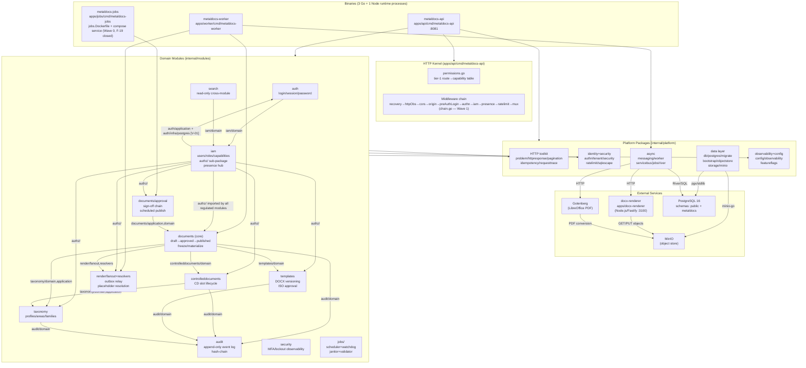
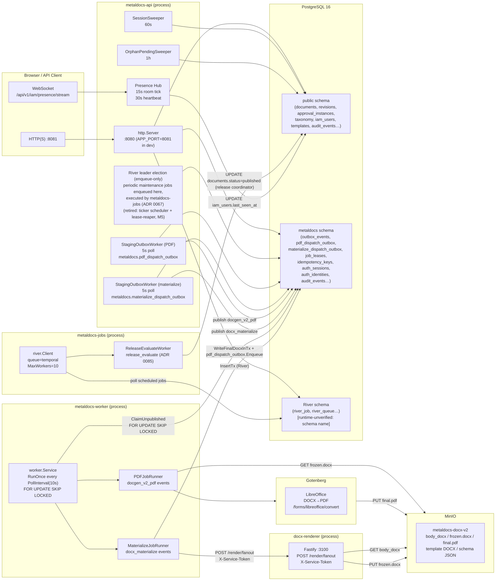

# MetalDocs Backend Atlas

> **Last verified:** 2026-07-28 (ADR 0085 Stage B — §5 runtime topology diagram: `ScheduledPublishWorker`/`scheduled_publish_cutover` node renamed to `ReleaseEvaluateWorker`/`release_evaluate`, the deleted job's replacement; see [`wiki/modules/approval.md`](../modules/approval.md)) | prior: 2026-07-02 (StagingOutboxWorker consolidation: outbox relay references updated — `PDFOutboxWorker`/`MaterializeOutboxWorker` are now two instances of generic `fanout.StagingOutboxWorker`) | **Prior:** 2026-06-12 (Wave F coherence pass)
> **Scope:** Atlas entrypoint for the MetalDocs backend Stage-1 truth map. Covers every binary, domain module, platform package, contract surface, and cross-cutting concern. Every behavioral claim carries a `file:line` anchor derived from Stage-1 audit artifacts. Runtime-only behavior tagged `[runtime-unverified]`.
> **Key files:**
> - `apps/api/cmd/metaldocs-api/main.go` — composition root (all wiring)
> - `internal/modules/` — 15 business modules
> - `internal/platform/` — 37 cross-cutting platform packages
> - `api/openapi/v1/openapi.yaml` — contract source of truth
> - `wiki/backend/_artifacts/stage1/` — 21 Stage-1 audit artifacts (19 mappers + 2 syntheses)

---

## Stage-1 Goal Statement

> Produce a complete, evidence-backed map of how the MetalDocs backend ACTUALLY works today — every binary, domain module, platform package, contract surface and cross-cutting concern — with file:line references, real logic flows, Mermaid diagrams, and explicit legacy/duplication flags. This map enables Stage 2: evaluating the backend against professional SaaS and industry standards (Go conventions, PostgreSQL practice, ISO/RFC-grade references) so it can be restructured for scale, maintainability, and production use in the user's company.
> Stage 1 maps TRUTH ONLY: no redesigns, no fixes, no opinions beyond factual flagging of legacy/duplication/smells.

---

## Strategic Stack

This atlas is the **detail layer** under the following strategic documents. Read the strategic stack first for framing; consult the atlas for evidence.

| Document | Role |
|---|---|
| [`../architecture/backend-blueprint.md`](../architecture/backend-blueprint.md) | Composition model, maturity grades (✅ / 🟡 / 🔴) |
| [`../architecture/backend-target-architecture.md`](../architecture/backend-target-architecture.md) | Normative REQ-* spec and RF-* refactoring register |
| [`../standards/backend-canon.md`](../standards/backend-canon.md) | Vocabulary and universal implementation-independent model |

Domain module deep dives: [`../modules/index.md`](../modules/index.md)

---

## Table of Contents

| Doc | What it maps |
|---|---|
| **[index.md](index.md)** (this file) | Atlas entrypoint, full composition map, Mermaid diagrams, dependency matrix |
| [binaries/api.md](binaries/api.md) | `metaldocs-api` binary — startup, wiring, in-process goroutines |
| [binaries/worker.md](binaries/worker.md) | `metaldocs-worker` binary — outbox polling, job runners |
| [binaries/jobs.md](binaries/jobs.md) | `metaldocs-jobs` binary — River scheduler host; `jobs.Dockerfile` + compose service added Wave 0 (F-19 closed) |
| [binaries/docx-renderer.md](binaries/docx-renderer.md) | `docx-renderer` Node.js sidecar — Fastify, MinIO, render fanout |
| [platform/identity-tenancy.md](platform/identity-tenancy.md) | `platform/authn`, `platform/tenant`, `platform/security`, `platform/ratelimit`, `platform/sqlescape` |
| [platform/http-toolkit.md](platform/http-toolkit.md) | `platform/problem`, `platform/httpresponse`, `platform/pagination`, `platform/idempotency`, `platform/requesttrace`, `platform/useragent`, `platform/httpclient`, `platform/formval` |
| [platform/data-layer.md](platform/data-layer.md) | `platform/db`, `platform/migrate`, `platform/bootstrap`, `platform/objectstore`, `platform/storage/minio`, `platform/messaging` |
| [platform/ops-config.md](platform/ops-config.md) | `platform/config`, `platform/observability`, `platform/featureflags` |
| [platform/async-messaging.md](platform/async-messaging.md) | `platform/messaging`, `platform/worker`, `platform/servicebus`, `platform/jobs/river` |
| [platform/rendering.md](platform/rendering.md) | `platform/docgenv2`, `platform/render/gotenberg` |
| [flows/request-lifecycle.md](flows/request-lifecycle.md) | Full HTTP request path: edge → middleware chain → handler → response |
| [flows/login-session.md](flows/login-session.md) | Login, session creation, token validation, session sweep |
| [flows/async-job-pipeline.md](flows/async-job-pipeline.md) | Domain write → outbox staging → relay → worker dispatch |
| [flows/render-pipeline.md](flows/render-pipeline.md) | Materialize (DOCX) and PDF generation end-to-end |
| [http-kernel.md](http-kernel.md) | Middleware chain composition, `permissions.go` tier-1 table, route registration |
| [contract-surface.md](contract-surface.md) | OpenAPI v1 spec, codegen, v2 parallel surface, contract tests |
| [repo-topology.md](repo-topology.md) | Repository layout, module graph, build targets, dead artifacts |
| [legacy-register.md](legacy-register.md) | All 20 legacy/duplication families (F-01..F-20) with severity, RF mapping, and evidence |

---

## 1. Full Composition Map

### 1.1 Binaries

Three Go binaries and one Node.js sidecar constitute the MetalDocs backend runtime.

| Binary | Entrypoint | Port | Deployment status |
|---|---|---|---|
| `metaldocs-api` | `apps/api/cmd/metaldocs-api/` | :8081 (dev) | `api.Dockerfile`; compose service `api` |
| `metaldocs-worker` | `apps/worker/cmd/metaldocs-worker/` | none | `worker.Dockerfile`; compose service `worker` |
| `metaldocs-jobs` | `apps/jobs/cmd/metaldocs-jobs/` | none | `jobs.Dockerfile` + compose service added in Wave 0 (F-19). Depends on `api` service healthy. |
| `docx-renderer` | `apps/docx-renderer/` (Node.js/Fastify) | :3100 | separate container |

Sources: `repo-topology.md §3`; `async-runtime.md §10`

### 1.2 Domain Modules

Twelve domain modules live under `internal/modules/`.

| Module | Sub-path | Primary concern |
|---|---|---|
| `auth` | `internal/modules/auth/` | Login, sessions, password, JWT, identity |
| `iam` | `internal/modules/iam/` | Users, roles, capabilities, area memberships, presence hub, authz sub-package |
| `audit` | `internal/modules/audit/` | Append-only event log with hash-chain |
| `taxonomy` | `internal/modules/taxonomy/` | Profiles, areas, families |
| `controlleddocuments` | `internal/modules/controlleddocuments/` | CD slot lifecycle, sequence counters |
| `documents` (core) | `internal/modules/documents/` | Draft→approved→published lifecycle, freeze/materialize |
| `documents/approval` | `internal/modules/documents/approval/` | Sign-off chain, scheduled publish, route administration |
| `templates` | `internal/modules/templates/` | DOCX versioning, ISO approval workflow |
| `search` | `internal/modules/search/` | Read-only cross-module document search |
| `security` | `internal/modules/security/` | MFA, account lockout observability |
| `render/fanout` + `render/resolvers` | `internal/modules/render/` | Outbox relay, placeholder resolution, DOCX assembly |
| `jobs` | `internal/modules/jobs/` | Scheduler, stuck-instance watchdog, janitor, audit validator |

### 1.3 Platform Packages

Twenty-eight cross-cutting platform packages live under `internal/platform/`. Domain modules import platform; platform must not import domain modules (REQ-TOP-2). Confirmed violations are listed in the dependency matrix (§2) and the legacy register ([legacy-register.md](legacy-register.md)).

| Package group | Sub-paths | Role |
|---|---|---|
| HTTP toolkit | `problem`, `httpresponse`, `pagination`, `idempotency`, `requesttrace`, `useragent`, `httpclient`, `formval` | Response shaping, RFC 9457 errors, cursor pagination, idempotency middleware |
| Identity & security | `authn`, `tenant`, `security`, `ratelimit`, `sqlescape` | Token validation, tenant context injection, rate limiting, SQL injection escape |
| Data layer | `db/postgres`, `migrate`, `bootstrap`, `objectstore`, `storage/minio`, `messaging` | DB pool, migration, MinIO I/O, outbox messaging |
| Observability & config | `config`, `observability`, `featureflags` | Env config, structured HTTP logging, feature flags |
| Async | `worker`, `servicebus`, `jobs/river` | Outbox worker, Gotenberg PDF HTTP adapter (see §7.8), River job host |
| Rendering | `docgenv2`, `render/gotenberg` | DOCX template reader, Gotenberg HTTP client |
| Middleware | `middleware/` | `Recovery` — outermost panic-recovery middleware (Wave 1, REQ-MW-1) |
| ~~Cache~~ | ~~`cache/`~~ | **DELETED Wave 1 (F-08/REQ-TOP-3)** — empty scaffold removed |

---

## 2. Dependency Matrix: Domain Modules × Platform Packages

### 2.1 HTTP Toolkit

`Y` = confirmed production import, `-` = no import, `(test)` = test-only.

| Module | `authn` | `tenant` | `httpresponse` | `problem` | `pagination` | `idempotency` | `requesttrace` | `useragent` | `httpclient` | `formval` |
|---|---|---|---|---|---|---|---|---|---|---|
| audit | Y | Y | Y | Y | Y | - | - | - | - | - |
| auth | Y | Y | Y | Y | - | - | Y | - | - | - |
| controlleddocuments | Y | Y | Y | Y | - | Y | - | - | - | - |
| documents (core+approval) | Y | Y | Y | Y | Y | Y | - | - | - | Y |
| iam | Y | Y | Y | Y | - | - | - | Y | - | - |
| search | Y | Y | Y | - | - | - | - | - | - | - |
| security | - | Y | Y | Y | - | - | - | - | - | - |
| taxonomy | Y | Y | Y | Y | - | - | - | - | - | - |
| templates | - | Y | Y | Y | - | Y | - | - | - | - |

Key evidence: `audit` × `pagination` — `internal/modules/audit/infrastructure/postgres/writer.go` uses `pagination.DecodeCursor` (`module-audit.md §5`). `iam` × `useragent` — `iam/delivery/http/sessions_handler.go` is the only consumer (`platform-http-toolkit.md §5`). `templates` does NOT import `pagination` — uses legacy offset-based pagination with a `TODO(pagination)` comment at `templates/delivery/http/routes_query.go:222`.

### 2.2 Identity, Tenancy & Security Platform

| Module | `platform/security` | `platform/ratelimit` | `platform/sqlescape` |
|---|---|---|---|
| audit | - | - | Y |
| auth | Y (ClientIP) | - | - |
| controlleddocuments | - | - | - |
| documents | - | Y (unactivated) | - |
| iam | - | - | - |
| search | - | - | - |
| security (module) | - | - | - |
| taxonomy | - | - | - |
| templates | - | - | - |

Notes:
- `sqlescape` has exactly one production consumer: `internal/modules/audit/infrastructure/postgres/writer.go` (`platform-identity-tenancy.md §5`).
- `platform/ratelimit` wiring in `internal/modules/documents/module.go:118-119` passes `nil, nil` — never activated in production (`platform-identity-tenancy.md §10`). See F-05.
- `platform/security.RateLimiter` is used by `main.go` as the global mux wrapper but imports `auth/domain` and `iam/domain` — a platform→domain layering violation (V-03).

### 2.3 Data Layer

Domain modules do NOT import data-layer platform packages directly. All Postgres and MinIO wiring flows through `bootstrap`, imported only by the three binary `main` packages (`platform-data-layer.md §5`).

| Consumer | `db/postgres` | `migrate` | `bootstrap` | `objectstore` | `storage/minio` | `messaging` |
|---|---|---|---|---|---|---|
| Any domain module | - | - | - | - | - | - |
| `apps/api` | - | Y (via main) | Y | Y | - | - |
| `apps/worker` | - | - | Y | - | Y (via bootstrap) | Y |
| `apps/jobs` | - | - | Y | - | - | - |

### 2.4 Async / Messaging

| Consumer | `platform/messaging` | `platform/worker` | `platform/servicebus` | `platform/jobs/river` | `platform/render/gotenberg` |
|---|---|---|---|---|---|
| `render/fanout` | Y | - | - | - | - |
| `documents/application` | Y (export_service) | - | - | - | - |
| `apps/api` | Y (via bootstrap) | - | Y (via bootstrap) | Y | Y (via bootstrap) |
| `apps/worker` | Y | Y | Y | - | Y (via bootstrap) |
| `apps/jobs` | - | - | - | Y | - |

---

## 3. Inter-Module Dependency Graph and Direction Violations

### 3.1 Confirmed Import Edges (production, non-test)

```
auth  ──imports──► iam/domain         (roles, RoleProvider, WithAuthContext)
auth  ──imports──► audit/domain       (write login events)
iam   ──imports──► auth/application   (session resolution for sessions tab)
iam   ──imports──► auth/domain        (CurrentUser type)
iam   ──imports──► auth/infrastructure/postgres  ◄── VIOLATION V-01
documents ──imports──► iam/authz      (35 production files; verified grep)
documents ──imports──► iam/domain     (UserID, Role types)
documents ──imports──► iam/application (CapabilityService)
documents ──imports──► controlleddocuments/domain  (CD slot reference)
documents ──imports──► taxonomy/domain (profile/area FK)
documents ──imports──► taxonomy/application (area lookup)
documents ──imports──► templates/domain (template snapshot)
documents ──imports──► render/fanout  (freeze, reconstruct)
documents ──imports──► render/resolvers (context builder, freeze)
documents ──imports──► audit/domain   (governance event)
approval ──imports──► iam/authz       (all approval application services)
approval ──imports──► iam/domain
approval ──imports──► documents/application (LoadDocumentAreaCode, PinInvoker)
approval ──imports──► documents/domain
controlleddocuments ──imports──► iam/authz
controlleddocuments ──imports──► iam/domain
controlleddocuments ──imports──► taxonomy/domain
controlleddocuments ──imports──► taxonomy/application
controlleddocuments ──imports──► audit/domain
templates ──imports──► iam/authz
templates ──imports──► iam/domain
templates ──imports──► audit/domain
taxonomy  ──imports──► iam/authz
taxonomy  ──imports──► iam/domain
taxonomy  ──imports──► audit/domain
search    ──imports──► iam/domain     (UserIDFromContext only)
security (module) ──imports──► (none — reads shared DB tables directly)
audit     ──imports──► (none — leaf module, no domain imports)
jobs/stuck_instance_watchdog ──imports──► documents/approval/application
jobs/audit_integrity_validator ──imports──► audit/domain
render/fanout ──imports──► documents/domain
render/fanout ──imports──► iam/authz  (ReconstructionService authz check)
platform/docgenv2 ──imports──► documents/application (SnapshotTemplateReader interface)
platform/docgenv2 ──imports──► documents/domain
platform/objectstore ──imports──► documents/domain (ErrUploadMissing)
platform/objectstore ──imports──► templates/domain (ErrUploadMissing)
platform/authn ──imports──► auth/application (assembles authapp.Config)
platform/authn ──imports──► iam/domain (Role, UserIDFromContext)
platform/security ──imports──► auth/domain (CurrentUserFromContext for rate limit)
platform/security ──imports──► iam/domain  (UserIDFromContext fallback)
~~platform/observability ──imports──► auth/domain~~ (CLOSED Wave 0 F-06a: import removed, user injected via constructor)
```

Sources: `synthesis-composition.md §2.1`

### 3.2 Dependency Direction Violations

| # | Violation | Evidence | Severity |
|---|---|---|---|
| ~~V-01~~ | ~~`iam/delivery/http/sessions_handler.go` imports `auth/infrastructure/postgres` directly~~ | **CLOSED Wave 2.7 (F-06d):** `SessionAdminQuery`/`SessionListItem` promoted to `auth/domain`; `sessions_handler.go` now depends on `authdomain` only — zero `auth/infrastructure` imports under `iam/`. | ~~HIGH~~ |
| V-02 | `auth` imports `iam/domain`; `iam` imports `auth/application` — bidirectional coupling between the two lowest-level modules | `module-auth.md §5`; `module-iam.md §5` | HIGH |
| ~~V-03~~ | ~~`platform/security` imports `auth/domain` and `iam/domain`~~ | **CLOSED Wave 2.8 (F-05):** `internal/platform/security/ratelimit.go` deleted entirely; `platform/security` no longer imports any module domain. | ~~MEDIUM~~ |
| ~~V-04~~ | ~~`platform/observability` imports `auth/domain`~~ | **CLOSED Wave 0 (F-06a):** import removed; user attribution now injected via constructor param. | ~~MEDIUM~~ |
| V-05 | `platform/authn` imports `auth/application` — platform package imports module application layer | `platform-identity-tenancy.md §5` | MEDIUM |
| V-06 | `platform/objectstore` imports `documents/domain` and `templates/domain` for error types | `platform-data-layer.md §5` | LOW |
| V-07 | `platform/docgenv2` imports `documents/application` and `documents/domain` | `render-pipeline.md §5` | MEDIUM |

All V-03, V-04, V-05, V-07 violations are instances of REQ-TOP-2 (platform packages must be domain-free).

---

## 4. Mermaid Component Diagram



---

## 5. Mermaid Runtime Topology Diagram



**Runtime topology notes:**

- `metaldocs-api` is the only process that serves HTTP traffic. It also hosts in-process async goroutines: two `StagingOutboxWorker` instances (PDF + materialize relay), `SessionSweeper`, `OrphanPendingSweeper`, and the Presence Hub. *(Corrected 2026-08-09: the in-process ticker scheduler and its `lease-reaper` are retired — M5/ADR 0067; the API now joins River leader election to enqueue the periodic maintenance jobs, which `metaldocs-jobs` executes.)*
- `metaldocs-worker` is stateless between ticks; it has no HTTP server. It interacts only with Postgres (`outbox_events`) and external services (Gotenberg, docx-renderer, MinIO).
- `metaldocs-jobs` is a River worker host. It has no HTTP server. Its deployment status is a high-severity open gap: no Dockerfile, no compose service (`async-runtime.md §10`; `repo-topology.md §10`).
- `docx-renderer` is a separate Node.js process. The worker calls it over HTTP; no direct DB access from docx-renderer.
- Two outbox staging tables (`pdf_dispatch_outbox`, `materialize_dispatch_outbox`) exist inside the API process. The API's two `StagingOutboxWorker` instances relay rows into `metaldocs.outbox_events`, which `metaldocs-worker` then consumes. This is a two-stage outbox chain (`async-runtime.md §10`).

---

## 6. Orphan and Dead-Code Inventory

### 6.1 Platform packages with zero inbound production imports

| Package | Evidence | Severity |
|---|---|---|
| ~~`internal/platform/cache/`~~ | **DELETED Wave 1 (F-08).** Was a `.gitkeep`-only scaffold. | CLOSED |
| `internal/platform/ratelimit/` (production activation) | Package has production-quality code and tests but `apps/api/cmd/metaldocs-api/main.go:501` calls `RegisterRoutes(mux)` not `RegisterRoutesWithRateLimit`; the `New(ctx, cfg)` constructor is never called outside tests (`platform-identity-tenancy.md §10`) | HIGH — implemented but never instantiated |

### 6.2 Dead binaries and artifacts

| Artifact | Evidence | Severity |
|---|---|---|
| `cmd/seed-test-document/` | Hardcoded DSN with plaintext password (`cmd/seed-test-document/main.go:25-30`); no CI reference; binary convention mismatch (root `cmd/` vs canonical `apps/*/cmd/`) | CRITICAL (F-18) |
| ~~`api/openapi/spec2.yaml` + `internal/api/v2/`~~ | **DELETED Wave 1 (F-03).** Parallel spec surface and orphan type package removed. | CLOSED |
| `api/openapi/v1/partials/` (3 files) | None of the three partial files referenced by any `cfg.yaml` or `go:generate` invocation; dead from pipeline perspective (`contract-surface.md §10`) | MEDIUM |
| ~~`bin/metaldocs-api.exe`~~ | **DELETED Wave 0 (F-18).** Was never git-tracked; on-disk deleted. | CLOSED |
| ~~`ops/CAPABILITY_CATALOG.sha256`~~ | **DELETED Wave 1 (F-03).** Placeholder SHA; CI gate was a no-op. Removed with its CI job. | CLOSED |

### 6.3 Dead application code

| Artifact | Evidence | Severity |
|---|---|---|
| ~~`approval/application.CutoverService`~~ | **DELETED Wave 2.11 (F-14):** zero non-test callers confirmed; `cutover_service.go` + test file removed. | ~~MEDIUM~~ |
| ~~`approval.PDFDispatchInvoker` deprecated path~~ | **DELETED Wave 2.11 (F-14):** `NewDecisionService` panics if `pdfDispatcher` non-nil; composition root updated to pass nil; field + dead assignment removed. | ~~LOW~~ |
| `FreezeService.Freeze` synchronous path | Annotated "New code should use Pin + Materialize instead" at `freeze_service.go:300`; no confirmed active callsite `[runtime-unverified]` | MEDIUM |
| ~~`iam.MembershipGovernanceLogger` wired as nil~~ | **FIXED Wave 2.13:** `newMembershipGovernanceLogger` is a required port; wired at `apps/api/cmd/metaldocs-api/main.go:363`; fails loud on nil writer. IAM membership governance events are now written. | ~~HIGH~~ |
| ~~`taxonomy.AreaService.SetParent` (cycle-safe)~~ | **DELETED Wave 2.11 (F-14):** zero non-test callers; method + 3 tests + `areaCodePtr` helper removed. | ~~LOW~~ |
| ~~`METALDOCS_WORKER_REVIEW_REMINDER_DAYS` env var~~ | **DELETED Wave 2.11 (F-14):** field + env-var parse block + startup log token removed from `WorkerConfig`; variable removed from `.env.example` and `docker-compose.yml`. | ~~LOW~~ |
| ~~`resolvePermissionFallback` function~~ | **DELETED Wave 2.11 (F-14):** logic inlined at call site (single-default switch); `permissions.go:270-279` no longer exists. | ~~INFO~~ |

---

## 7. Key Cross-Cutting Observations

### 7.1 `iam/authz` is the true backbone of the authorization system

`iam/authz` is imported by 35 production Go files across 6 domain modules (documents, approval, controlleddocuments, taxonomy, templates, render/fanout). It is the only package that enforces tier-2 in-transaction capability checks and the `trg_require_cap_asserted` Postgres tripwire pairing. `auth` and `search` do NOT import it — `auth` owns sessions/credentials only; `search` is read-only with tier-1 protection only.

Sources: `module-iam.md §5`; grep (35 production files confirmed)

### 7.2 Governance event dual-sink — CLOSED (Waves 2.2/2.11/2.12/2.13)

The dual-sink gap described in the Stage-1 audit has been resolved across the program:

- **Wave 2.2 (F-07):** `GovernanceLogger.LogTx` added; taxonomy/templates/documents/controlleddocuments governance calls moved inside the mutation transaction (`RecordTx`/`LogTx`). Post-commit audit-drop window eliminated. `PostCommitAudit` cilint analyzer enforces the pattern.
- **Wave 2.11 (F-14):** `DBGovernanceLogger` nil-fallback in `controlleddocuments/module.go` replaced with a fail-loud panic.
- **Wave 2.12 (F-07-sub):** `taxonomy/application/governance_logger.go` (`DBGovernanceLogger`) deleted entirely. `taxonomy/module.go` now requires `AuditWriter` at construction (panics on nil).
- **Wave 2.13 (ADR-0022 / F-07-sub):** `iam.MembershipGovernanceLogger` promoted to a required port (`apps/api/cmd/metaldocs-api/main.go:363`); `newMembershipGovernanceLogger` panics on nil writer. IAM membership governance events are now written.
- **Templates audit sink split:** `ListAudit` reads `metaldocs.audit_events` (resource_type='template') since Wave 1 (F-07-sub-split). Historical `templates_audit_log` rows are an accepted seam.

Remaining open item: `FreezeService` optional-tx enlistment branches at `freeze_service.go:175/308/370` carry `//cilint:allow-dualmode` (ADR-0015 dual-path by design — both branches write; deferred per Wave 2.13 disposition). Full classification: F-07 in [legacy-register.md](legacy-register.md).

### 7.3 `metaldocs-jobs` binary container image — CLOSED (Wave 0, F-19)

`jobs.Dockerfile` and the `jobs` compose service were added in Wave 0. River schema migration ownership was moved exclusively to the API binary (Wave 1, F-19/F-19-River-single-owner): `BuildJobsDependencies` no longer calls `MigrateRiverSchema`; the jobs compose service has `depends_on: api(healthy)`. Runtime-verified: container stays Up, logs "MetalDocs Jobs running".

### 7.4 Auth/IAM circular coupling is a structural constraint

`auth` imports `iam/domain` (roles, RoleProvider, WithAuthContext) and `iam` imports `auth/application` (session management) and `auth/infrastructure/postgres` directly from `iam/delivery/http/sessions_handler.go:19`. ADR 0007 established the auth/IAM separation but the implementation has accumulated cross-boundary couplings that constrain refactoring. This is not circular at the Go compiler level but creates a bidirectional dependency (`module-auth.md §5`; `module-iam.md §5 FLAG-08`). Classified as V-01 and V-02 above.

### 7.5 The outbox architecture is a three-table two-stage chain

The PDF and DOCX materialization pipeline crosses three outbox tables and two processes:

1. API process: domain write enqueues into `pdf_dispatch_outbox` or `materialize_dispatch_outbox` (staging tables)
2. API process: two `StagingOutboxWorker` instances (PDF + materialize) relay staging rows into `metaldocs.outbox_events`
3. `metaldocs-worker` process: `worker.Service.RunOnce` claims from `outbox_events` and dispatches to Gotenberg/docx-renderer

The former four-file clone duplication (`pdf_outbox_repository.go`/`materialize_outbox_repository.go` + worker files) is resolved: consolidated into generic `StagingOutboxRepository` (`internal/modules/render/fanout/staging_outbox.go:33`) + `StagingOutboxWorker` (`staging_outbox_worker.go:23`). Full classification: F-04 (resolved) in [legacy-register.md](legacy-register.md).

### 7.6 No OpenTelemetry or distributed tracing

There is no OpenTelemetry instrumentation in the Go codebase: no OTLP exporter, no Prometheus endpoint, no W3C `traceparent` propagation, no span creation. RED metrics are produced as structured log aggregates only. `internal/platform/observability/http.go` creates a process-local trace ID (`http.go:61-65`) with no W3C propagation. REQ-OBS-3 is fully open. Classified as F-17 in [legacy-register.md](legacy-register.md).

### 7.7 Hard-coded credentials committed to VCS

`cmd/seed-test-document/main.go:25-30` contains a plaintext DSN password and MinIO credentials. This is the highest-severity finding in the legacy register. Classified as F-18 (critical). See [legacy-register.md](legacy-register.md) for the pre-Stage-2 prerequisite action.

### 7.8 Messaging/servicebus package fence (RF-7)

**`platform/servicebus` is NOT a message broker.** Despite its name, it is the synchronous Gotenberg PDF HTTP adapter. `GotenbergPDFClient` reads a DOCX from MinIO, calls Gotenberg (LibreOffice route) over HTTP, and writes the resulting PDF back to MinIO — all synchronously within a single function call (`internal/platform/servicebus/gotenberg_pdf.go`). There is no Azure Service Bus, no AMQP client, no queue polling, and no broker connection in this package. The name predates the current implementation; the misleading "Azure Service Bus" label in earlier wiki passes has been corrected here.

**`platform/messaging` is outbox + noop only.** It provides:
- `messaging.Event` envelope, `Publisher` and `Consumer` interfaces (`events.go`, `consumer.go`)
- `messaging/outbox/postgres` — Postgres-backed `Consumer` / `Publisher` against `metaldocs.outbox_events`
- `messaging/noop` — no-op `Publisher` for test/in-memory contexts

There is no broker client, no AMQP/Kafka/Service Bus SDK, and no network call in `platform/messaging`. All async dispatch is local-Postgres-outbox only.

**Future broker rule:** any real message broker (AMQP, Kafka, Azure Service Bus, etc.) requires a new ADR before introduction. The outbox pattern is the current and only sanctioned async delivery mechanism at v1.

Sources: `internal/platform/servicebus/gotenberg_pdf.go`; `internal/platform/messaging/events.go`; `internal/platform/messaging/noop/publisher.go`; `platform/async-messaging.md §2.1, §2.6`

---

## 8. Legacy & Open Flags

See [legacy-register.md](legacy-register.md) for the complete 20-family register (F-01..F-20) with severity, RF mapping, and file:line evidence.

Summary of severity distribution:

| Severity | Count | Families |
|---|---|---|
| Critical | 1 | F-18 ✅ Wave 0 + history residual resolved-by-plan at re-baseline |
| High | 7 | F-01 ✅ Wave 1, F-03 ✅ Wave 1, F-07 ✅ Waves 2.2/2.11/2.12/2.13 (in-tx + DBGovernanceLogger deleted + MembershipGovernanceLogger wired), F-11 ✅ Wave 2.4, F-17 ➖ deferred (trigger: OTel adoption), F-19 ✅ Wave 0/1 |
| Medium | 10 | F-04 ➖ deferred (trigger: generics/simplification), F-05 ✅ Wave 2.8, F-06 ✅ Waves 2.5/2.6/2.7, F-08 ✅ Wave 1, F-09 🟡 Wave 1 half (finalize-handler inline deferred), F-10 ✅ Wave 2.9, F-12 ✅ Wave 2.3, F-13 ✅ Wave 1, F-14 ✅ Wave 2.11, F-16 ✅ Wave 1 |
| Low | 2 | F-02, F-15 |
| Info | 1 | F-20 (correlated SQL performance patterns) |

RF-* register references: `wiki/architecture/backend-target-architecture.md §10`

---

## Sources

All factual claims in this document derive from the 21 Stage-1 audit artifacts at:
`wiki/backend/_artifacts/stage1/`

The two synthesis artifacts used directly for this index:
- `wiki/backend/_artifacts/stage1/synthesis-composition.md`
- `wiki/backend/_artifacts/stage1/synthesis-legacy.md`
