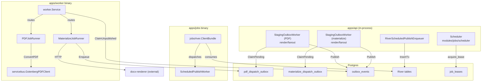

# Platform: Async Messaging

> **Last verified:** 2026-07-29 (new §3.1 "Retention — who deletes what": `metaldocs.outbox_events` had NO retention job — nothing ever deleted published or dead-lettered rows. Added the `outbox-events-retention` River periodic job (`internal/modules/jobs/outbox_retention`, 24 h, `maintenance` queue, ADR 0067 dual-define) purging published rows after 7 days and dead-lettered rows after 90 days, with the SQL in the new `internal/platform/messaging/outbox/postgres/retention.go` so that package stays the sole owner of SQL against the table. §2.2 gained the `retention.go` entry and a **Known defect** note: `Publish` returns `nil` on `ON CONFLICT DO NOTHING`, so while a terminal row pins its `idempotency_key` every re-publish on that key is silently swallowed — retention bounds the window, it does not make the swallow observable. Grant added by `db/migrations/0314_outbox_events_retention_grant.sql`.) | prior: 2026-07-02
> **Scope:** The four platform packages that form the async execution substrate — `internal/platform/jobs/river`, `internal/platform/worker`, `internal/platform/messaging`, and `internal/platform/servicebus` — plus the in-module staging outbox relay under `internal/modules/render/fanout`. This document covers responsibilities, inter-package relationships, and explicit overlap facts. It does not cover the in-API scheduler jobs (`internal/modules/jobs/scheduler`), which are documented in [../binaries/worker.md](../binaries/worker.md) under the in-API async subsystems section.
> **Key files:**
> - `internal/platform/jobs/river/client.go` — River client factory
> - `internal/platform/worker/service.go` — outbox-poll dispatch loop
> - `internal/platform/worker/pdf_job_runner.go` — PDF event handler
> - `internal/platform/worker/materialize_job_runner.go` — DOCX materialize event handler
> - `internal/platform/messaging/events.go` — canonical event envelope and type constants
> - `internal/platform/messaging/consumer.go` — Consumer interface
> - `internal/platform/messaging/outbox/postgres/consumer.go` — Postgres claim/mark implementation
> - `internal/platform/messaging/outbox/postgres/publisher.go` — Postgres publish implementation
> - `internal/platform/servicebus/gotenberg_pdf.go` — Gotenberg/MinIO PDF converter adapter
> - `internal/modules/render/fanout/staging_outbox_worker.go` — staging outbox relay worker (PDF + DOCX instances)
> - `internal/modules/render/fanout/staging_outbox.go` — staging outbox repository (both staging tables)

---

## 1. Package map

MetalDocs separates async concerns across four platform packages and one module-level relay layer. Each package has a single responsibility; they compose at the binary and bootstrap levels rather than directly importing one another.

| Package | Role | Used by |
|---------|------|---------|
| `internal/platform/messaging` | Core types and interfaces: `Event`, `EventType`, `Publisher`, `Consumer`, payload codecs | `platform/worker`, `platform/bootstrap`, `modules/render/fanout` |
| `internal/platform/messaging/outbox/postgres` | Postgres-backed implementations of `Consumer` and `Publisher` against `metaldocs.outbox_events` | `bootstrap/worker.go`, `bootstrap/api.go` |
| `internal/platform/messaging/noop` | No-op `Publisher` for in-memory and test contexts | test/integration builds |
| `internal/platform/worker` | Poll-and-dispatch service: claims events, routes by `EventType`, calls handlers, manages retry/DLQ | `apps/worker/cmd/metaldocs-worker/main.go` |
| `internal/platform/jobs/river` | River client factory (`ClientBundle`) wrapping `github.com/riverqueue/river` | `apps/jobs/cmd/metaldocs-jobs/main.go`, `apps/api/cmd/metaldocs-api/main.go`, `bootstrap/jobs.go` |
| `internal/platform/servicebus` | External I/O adapters: `GotenbergPDFClient` (reads DOCX from MinIO, calls Gotenberg, writes PDF back to MinIO) | `platform/worker/pdf_job_runner.go`, `bootstrap/worker.go`, `bootstrap/api.go` |
| `internal/modules/render/fanout` | Domain-level staging outbox: generic `StagingOutboxRepository` + generic `StagingOutboxWorker` (one type, two instances — PDF and materialize) | `apps/api/cmd/metaldocs-api/main.go` (started as goroutines via `startOutboxWorkers`, `main.go:945`), `apps/worker/cmd/metaldocs-worker/main.go` (`NewPDFOutboxRepository`, `main.go:111`) |

---

## 2. Package responsibilities in detail

### 2.1 `internal/platform/messaging`

Defines the canonical async contract:

- `events.go`: `EventID`, `EventType` (string alias), `AggregateType`, `AggregateID`, `IdempotencyKey`, `TraceID` (all string aliases), `Event` envelope (`EventID`, `EventType`, `AggregateType`, `AggregateID`, `OccurredAtRFC3339 string`, `Version int`, `AttemptCount int`, `IdempotencyKey`, `Producer string`, `TraceID`, `Payload`) (`events.go:42–54`), `Publisher` interface (`Publish(ctx context.Context, event Event) error`), `FailedEvent` struct. `TenantID` does not appear on the envelope — it is a field on the typed payload structs (`PDFConvertPayload`, `MaterializeFanoutPayload`). Two named event types: `EventTypePDFConvert = "docgen_v2_pdf"` and `EventTypeMaterializeFanout = "docx_materialize"`.
- `consumer.go`: `Consumer` interface — `ClaimUnpublished(ctx context.Context, limit int) ([]Event, error)`, `MarkPublished(ctx context.Context, eventIDs []EventID) error` (takes a slice of `EventID`, not a single id), `MarkFailed(ctx context.Context, failure FailedEvent) error` (takes a `FailedEvent` struct, not individual parameters) (`consumer.go:15–19`).
- `payloads.go`: typed payload extractors `PDFConvertPayloadFrom`, `MaterializeFanoutPayloadFrom` and a `DecodePayload` switch.

This package has no Postgres or network imports. It is the vocabulary shared by all other async packages.

### 2.2 `internal/platform/messaging/outbox/postgres`

Implements the `Consumer` and `Publisher` interfaces against `metaldocs.outbox_events`:

- `publisher.go`: `INSERT INTO metaldocs.outbox_events ... ON CONFLICT (idempotency_key) DO NOTHING` — idempotent publish.
- `consumer.go`: `ClaimUnpublished` executes a CTE with `FOR UPDATE SKIP LOCKED`, bumps `attempt_count`, sets `next_attempt_at = now() + claimLease` as an in-flight lock, returns up to `limit` rows (file:line `outbox/postgres/consumer.go:25–126`). `MarkPublished` sets `published_at = now()`. `MarkFailed` updates `next_attempt_at` with exponential backoff or sets `dead_lettered_at` when `attempt_count >= MaxAttempts`.
- `retention.go`: `Retention.PurgePublished` / `Retention.PurgeDeadLettered` — the terminal-row purge (see §3.1). This package is the sole owner of SQL against `outbox_events`; the River job that ticks the purge holds none.

Two open `TODO(phase11)` markers at `outbox/postgres/consumer.go:37–38` (heartbeat configurability and partial-index alignment) and one at `outbox/postgres/publisher.go:29` (TEXT-backed idempotency key).

**Known defect — silent dedup swallow.** `Publish` returns `nil` whether it inserted or hit `ON CONFLICT DO NOTHING`, so a caller can never tell that its event was dropped. While a terminal row holding key *K* is retained, every re-publish on *K* is silently swallowed. Generation-aware keys (`dispatchIdempotencyKey`, ADR 0085) removed the common case for approval-driven renders, but generation-less legacy render keys (`internal/modules/render/fanout/dispatchjobs/workers.go:46-52`) still collide on revision alone. Retention (§3.1) bounds how long a key stays pinned; it does not make the swallow observable. Fixing that means the publisher reporting the conflict rather than returning `nil` — an open item, not covered by the retention job.

### 2.3 `internal/platform/worker`

The poll-and-dispatch engine consumed exclusively by `apps/worker`:

- `service.go`: `Service.RunOnce` claims a batch from `Consumer.ClaimUnpublished`, routes each event by `EventType` to the registered handler, calls `MarkPublished` on success or `markFailure` (exponential backoff / dead-letter) on error. Logs `worker_event` and `worker_batch` lines with structured fields including `trace_id` (`service.go:88,93`).
- `pdf_job_runner.go`: `PDFJobRunner.Handle` — extracts `PDFConvertPayload`, derives S3 key, delegates to `PDFConverter.ConvertPDF` (satisfied by `servicebus.GotenbergPDFClient`) and `PDFPersister.WritePDF`.
- `materialize_job_runner.go`: `MaterializeJobRunner.Handle` — extracts `MaterializeFanoutPayload`, calls `MaterializeInvoker.Materialize` (HTTP to docx-renderer — **outside** any transaction), then opens a new transaction to call `WriteFinalDocxInTx` and `pdfOutbox.Enqueue` atomically. This enqueue re-enters the PDF staging outbox (Flow 2, Stage A).

The `worker` package does not import `servicebus` or `messaging/outbox/postgres` directly. It accepts them as interface values wired at the binary level.

### 2.4 `internal/platform/jobs/river`

Thin factory package:

- `client.go`: `ClientBundle` — wraps `github.com/riverqueue/river` client and `riverdatabasesql` driver; exposes `Client *river.Client[*sql.Tx]` and `Driver`. Used by `bootstrap/jobs.go` and directly by `apps/api/cmd/metaldocs-api/main.go` for the River schema migration and enqueuer construction.
- `client_test.go`: integration test verifying transactional `InsertTx` visibility.

This package has no dependency on `platform/messaging`, `platform/worker`, or `platform/servicebus`. It is orthogonal to the outbox subsystem.

### 2.5 `internal/platform/servicebus`

Single file, single type:

- `gotenberg_pdf.go`: `GotenbergPDFClient.ConvertPDF` — reads the DOCX blob from MinIO, calls `converter.ConvertDocxToPDFWithOptions` (Gotenberg HTTP), writes the resulting PDF back to MinIO, returns `ConvertPDFResult{OutputKey, ContentHash, SizeBytes}`.

No MetalDocs imports — depends only on stdlib, crypto, and the MinIO/Gotenberg converter. This makes it a pure external I/O adapter.

### 2.6 `internal/modules/render/fanout` — staging outbox relay

This layer sits between domain writes and `outbox_events`. It is technically a module package, not a platform package, but it is architecturally part of the async substrate.

A single generic worker type, `StagingOutboxWorker` (`internal/modules/render/fanout/staging_outbox_worker.go:23`), runs as **two instances** inside the API process — one per staging table. The only per-instance difference is the `buildEvent` closure (event type, idempotency-key prefix, payload shape) supplied at construction in `startOutboxWorkers` (`apps/api/cmd/metaldocs-api/main.go:945`). Both instances share a generic repository, `StagingOutboxRepository` (`internal/modules/render/fanout/staging_outbox.go:33`), bound to its table via the allowlist-validated constructors `NewPDFOutboxRepository` / `NewMaterializeOutboxRepository`:

| Instance (repo constructor) | Source table | Event type published |
|-----------------------------|-------------|---------------------|
| `NewPDFOutboxRepository` | `metaldocs.pdf_dispatch_outbox` | `docgen_v2_pdf` |
| `NewMaterializeOutboxRepository` | `metaldocs.materialize_dispatch_outbox` | `docx_materialize` |

Both instances share one `StagingOutboxWorkerConfig` (defaults: 5 s poll, batch 10, max attempts 5, stale-after 300 s; overridable via `METALDOCS_STAGING_OUTBOX_*` env vars). The dispatch pattern is: `ClaimPending` with `FOR UPDATE SKIP LOCKED`, call `Publisher.Publish` for each row inserting into `outbox_events`, then `MarkDispatched`. A `ResetStaleClaims` call at the start of each tick recovers rows stuck in `processing` status after a crash.

**Tenancy (ADR 0054).** `ClaimPending` intentionally selects across **all tenants** with no `tenant_id` predicate — sanctioned by [ADR 0054](../../decisions/0054-cross-tenant-outbox-claim.md), mirroring the platform `outbox_events` consumer (`internal/platform/messaging/outbox/postgres/consumer.go`). The code comment at `internal/modules/render/fanout/staging_outbox.go:68-72` cites the ADR directly. Tenancy is enforced at processing time: every claimed row carries its `tenant_id`, all per-row work after claim is scoped to that row's tenant, and the unscoped claim shape is permitted only inside this worker-internal path — never a request path. Closed as SEC-13 (commit b4302dbf); full contract in [async-job-pipeline.md §7](../flows/async-job-pipeline.md).

---

## 3. Overlap facts

The presence of three distinct outbox tables is the principal structural overlap in this area:

| Table | Written by | Consumed by | Purpose |
|-------|-----------|-------------|---------|
| `metaldocs.pdf_dispatch_outbox` | Domain code (approval handler, `MaterializeJobRunner`) inside transactions | `StagingOutboxWorker` PDF instance (API goroutine) | Staging: durably capture PDF dispatch intent within the domain transaction |
| `metaldocs.materialize_dispatch_outbox` | `FreezeService.Pin` inside the freeze transaction | `StagingOutboxWorker` materialize instance (API goroutine) | Staging: durably capture materialize intent within the domain transaction |
| `metaldocs.outbox_events` | `outbox/postgres/publisher.go` (called by the relay workers above) | `outbox/postgres/consumer.go` (called by `apps/worker`) | Generic relay: the `apps/worker` binary's actual input queue |

This is a **two-stage outbox chain**: domain write → staging table → relay worker → `outbox_events` → external worker binary. The two `StagingOutboxWorker` instances exist solely to bridge the staging tables into `outbox_events`. The two staging tables now share one generic claim/fail/retry implementation (`StagingOutboxRepository`); residual duplication remains between that implementation and the platform consumer (`outbox/postgres/consumer.go`).

### 3.1 Retention — who deletes what

Both stages of the chain are purged by River periodic jobs on the `maintenance` queue. Both follow the ADR 0067 dual-define topology: the periodic definition is on the River client config of **both** `metaldocs-api` and `metaldocs-jobs` (whichever wins leader election enqueues the tick), but only `metaldocs-jobs` subscribes `maintenance` and registers the Worker, so only it executes.

| Job (`Kind` / periodic ID) | Table | Eligible rows | Window | Worker |
|---|---|---|---|---|
| `staging-outbox-purge` | `pdf_dispatch_outbox`, `materialize_dispatch_outbox` | `status = 'dispatched'` and `dispatched_at < cutoff` | 7 days | `internal/modules/render/fanout/retention.PurgeWorker` |
| `outbox-events-retention` | `outbox_events` | `published_at IS NOT NULL AND dead_lettered_at IS NULL` and `published_at < cutoff` | 7 days | `internal/modules/jobs/outbox_retention.Worker` |
| `outbox-events-retention` | `outbox_events` | `dead_lettered_at IS NOT NULL` and `dead_lettered_at < cutoff` | 90 days | same worker, second pass |

Both jobs tick every 24 h, delete in bounded batches (`ctid IN (SELECT ctid … LIMIT n)` looped, breaking on a zero-row batch) capped at `BatchSize × MaxIterations` = 5000 × 10 rows per table per class per tick, and are idempotent — a partial purge simply re-matches nothing on the next attempt.

**Fail-closed.** A row that was never published and never dead-lettered is ineligible at any age. The two `outbox-events-retention` passes are separate statements with separate cutoffs precisely so the short published window can never reach the DLQ; neither predicate can match a `NULL` terminal timestamp. Pinned by `TestOutboxRetention_Integration_NeverPurgesUnpublishedHoweverOld` and `TestOutboxRetention_Integration_PurgesOnlyAgedTerminalRows`.

**Why the dead-letter window is 13× longer.** A dead-lettered row is the only durable record that a domain event never reached its consumer, so it is forensic evidence first. It is not kept forever because it also pins its `idempotency_key` against the UNIQUE constraint the publisher dedupes on. Note the asymmetry with the staging tables, which have **no** dead-letter retention at all — their dead-lettered rows (`status = 'failed'`) are excluded from the purge by construction and are cleared only by the operator replay runbook (`docs/runbooks/replay-materialize-pdf-deadletters.md`).

**Why `outbox_events` retention exists.** Before this job the table had none: it grew without bound, and every terminal row pinned its idempotency key forever, so any legitimate later re-publish on that key was silently swallowed (see §2.2, *Known defect*). `db/migrations/0314_outbox_events_retention_grant.sql` adds the `DELETE` grant the purge needs — `metaldocs_app` previously held only `INSERT`/`SELECT`/`UPDATE` on this table.

The `platform/jobs/river` package and the `platform/worker` + `platform/messaging` stack are **completely independent subsystems**:

- River (`apps/jobs` binary) uses its own Postgres schema with River-managed tables.
- The outbox consumer (`apps/worker` binary) uses `metaldocs.outbox_events`.
- There is no shared code path, no shared table, and no shared queue between the two binaries.

---

## 4. Dependency graph

---

## 5. Legacy and open flags

| Flag | Severity | RF reference |
|------|----------|-------------|
| Two-stage outbox chain; claim/retry logic duplicated between the staging repo (`StagingOutboxRepository`) and the platform consumer (`outbox/postgres/consumer.go`) | Medium | RF-OB1 candidate |
| `TODO(phase11)` markers in outbox consumer and publisher | Low | — |

Closed flags:
- Tenant-unscoped `pdf_dispatch_outbox`/`materialize_dispatch_outbox` claim is no longer an open flag as of [ADR 0054](../../decisions/0054-cross-tenant-outbox-claim.md) (2026-07-02) — the cross-tenant `ClaimPending` shape is sanctioned by design (closed as SEC-13, commit b4302dbf); see §2.6 above.
- `startOutboxWorker` dead-code restart loop: closed. The restart loop was removed when the workers were consolidated into the generic `StagingOutboxWorker`; the current `startOutboxWorkers` (`apps/api/cmd/metaldocs-api/main.go:945`) just starts each instance's `Run` in a WaitGroup-tracked goroutine — `Run` returns only nil on context cancellation, and shutdown joins the goroutines cleanly.

Full flag registry: [../legacy-register.md](../legacy-register.md).

---

## Sources

Stage-1 artifact: [../_artifacts/stage1/async-runtime.md](../_artifacts/stage1/async-runtime.md).
Strategic context: [../../architecture/backend-blueprint.md](../../architecture/backend-blueprint.md) (Async concern, section D).
Target normative spec: [../../architecture/backend-target-architecture.md](../../architecture/backend-target-architecture.md).
