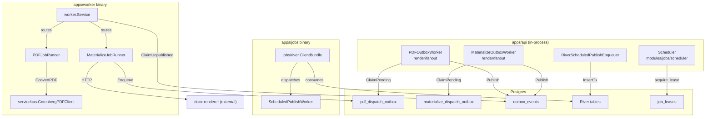

# Platform: Async Messaging

> **Last verified:** 2026-06-10
> **Scope:** The four platform packages that form the async execution substrate — `internal/platform/jobs/river`, `internal/platform/worker`, `internal/platform/messaging`, and `internal/platform/servicebus` — plus the in-module staging outbox relay under `internal/modules/render/fanout`. This document covers responsibilities, inter-package relationships, and explicit overlap facts. It does not cover the in-API scheduler jobs (`internal/modules/jobs/scheduler`), which are documented in [../binaries/worker.md](../binaries/worker.md) under the in-API async subsystems section.
> **Key files:**
> - `internal/platform/jobs/river/client.go` — River client factory
> - `internal/platform/worker/service.go` — outbox-poll dispatch loop
> - `internal/platform/worker/pdf_job_runner.go` — PDF event handler
> - `internal/platform/worker/materialize_job_runner.go` — DOCX materialize event handler
> - `internal/platform/messaging/events.go` — canonical event envelope and type constants
> - `internal/platform/messaging/consumer.go` — Consumer interface
> - `internal/platform/messaging/outbox/postgres/consumer.go` — Postgres claim/mark implementation
> - `internal/platform/messaging/outbox/postgres/publisher.go` — Postgres publish implementation
> - `internal/platform/servicebus/gotenberg_pdf.go` — Gotenberg/MinIO PDF converter adapter
> - `internal/modules/render/fanout/pdf_outbox_worker.go` — staging outbox relay (PDF)
> - `internal/modules/render/fanout/materialize_outbox_worker.go` — staging outbox relay (DOCX)

---

## 1. Package map

MetalDocs separates async concerns across four platform packages and one module-level relay layer. Each package has a single responsibility; they compose at the binary and bootstrap levels rather than directly importing one another.

| Package | Role | Used by |
|---------|------|---------|
| `internal/platform/messaging` | Core types and interfaces: `Event`, `EventType`, `Publisher`, `Consumer`, payload codecs | `platform/worker`, `platform/bootstrap`, `modules/render/fanout` |
| `internal/platform/messaging/outbox/postgres` | Postgres-backed implementations of `Consumer` and `Publisher` against `metaldocs.outbox_events` | `bootstrap/worker.go`, `bootstrap/api.go` |
| `internal/platform/messaging/noop` | No-op `Publisher` for in-memory and test contexts | test/integration builds |
| `internal/platform/worker` | Poll-and-dispatch service: claims events, routes by `EventType`, calls handlers, manages retry/DLQ | `apps/worker/cmd/metaldocs-worker/main.go` |
| `internal/platform/jobs/river` | River client factory (`ClientBundle`) wrapping `github.com/riverqueue/river` | `apps/jobs/cmd/metaldocs-jobs/main.go`, `apps/api/cmd/metaldocs-api/main.go`, `bootstrap/jobs.go` |
| `internal/platform/servicebus` | External I/O adapters: `GotenbergPDFClient` (reads DOCX from MinIO, calls Gotenberg, writes PDF back to MinIO) | `platform/worker/pdf_job_runner.go`, `bootstrap/worker.go`, `bootstrap/api.go` |
| `internal/modules/render/fanout` | Domain-level staging outbox repositories and relay workers: `PDFOutboxWorker`, `MaterializeOutboxWorker` | `apps/api/cmd/metaldocs-api/main.go` (started as goroutines), `apps/worker/cmd/metaldocs-worker/main.go` (PDFOutboxRepository) |

---

## 2. Package responsibilities in detail

### 2.1 `internal/platform/messaging`

Defines the canonical async contract:

- `events.go`: `EventID`, `EventType` (string alias), `AggregateType`, `AggregateID`, `IdempotencyKey`, `TraceID` (all string aliases), `Event` envelope (`EventID`, `EventType`, `AggregateType`, `AggregateID`, `OccurredAtRFC3339 string`, `Version int`, `AttemptCount int`, `IdempotencyKey`, `Producer string`, `TraceID`, `Payload`) (`events.go:42–54`), `Publisher` interface (`Publish(ctx context.Context, event Event) error`), `FailedEvent` struct. `TenantID` does not appear on the envelope — it is a field on the typed payload structs (`PDFConvertPayload`, `MaterializeFanoutPayload`). Two named event types: `EventTypePDFConvert = "docgen_v2_pdf"` and `EventTypeMaterializeFanout = "docx_materialize"`.
- `consumer.go`: `Consumer` interface — `ClaimUnpublished(ctx context.Context, limit int) ([]Event, error)`, `MarkPublished(ctx context.Context, eventIDs []EventID) error` (takes a slice of `EventID`, not a single id), `MarkFailed(ctx context.Context, failure FailedEvent) error` (takes a `FailedEvent` struct, not individual parameters) (`consumer.go:15–19`).
- `payloads.go`: typed payload extractors `PDFConvertPayloadFrom`, `MaterializeFanoutPayloadFrom` and a `DecodePayload` switch.

This package has no Postgres or network imports. It is the vocabulary shared by all other async packages.

### 2.2 `internal/platform/messaging/outbox/postgres`

Implements the `Consumer` and `Publisher` interfaces against `metaldocs.outbox_events`:

- `publisher.go`: `INSERT INTO metaldocs.outbox_events ... ON CONFLICT (idempotency_key) DO NOTHING` — idempotent publish.
- `consumer.go`: `ClaimUnpublished` executes a CTE with `FOR UPDATE SKIP LOCKED`, bumps `attempt_count`, sets `next_attempt_at = now() + claimLease` as an in-flight lock, returns up to `limit` rows (file:line `outbox/postgres/consumer.go:25–126`). `MarkPublished` sets `published_at = now()`. `MarkFailed` updates `next_attempt_at` with exponential backoff or sets `dead_lettered_at` when `attempt_count >= MaxAttempts`.

Two open `TODO(phase11)` markers at `outbox/postgres/consumer.go:37–38` (heartbeat configurability and partial-index alignment) and one at `outbox/postgres/publisher.go:29` (TEXT-backed idempotency key).

### 2.3 `internal/platform/worker`

The poll-and-dispatch engine consumed exclusively by `apps/worker`:

- `service.go`: `Service.RunOnce` claims a batch from `Consumer.ClaimUnpublished`, routes each event by `EventType` to the registered handler, calls `MarkPublished` on success or `markFailure` (exponential backoff / dead-letter) on error. Logs `worker_event` and `worker_batch` lines with structured fields including `trace_id` (`service.go:88,93`).
- `pdf_job_runner.go`: `PDFJobRunner.Handle` — extracts `PDFConvertPayload`, derives S3 key, delegates to `PDFConverter.ConvertPDF` (satisfied by `servicebus.GotenbergPDFClient`) and `PDFPersister.WritePDF`.
- `materialize_job_runner.go`: `MaterializeJobRunner.Handle` — extracts `MaterializeFanoutPayload`, calls `MaterializeInvoker.Materialize` (HTTP to docx-renderer — **outside** any transaction), then opens a new transaction to call `WriteFinalDocxInTx` and `pdfOutbox.Enqueue` atomically. This enqueue re-enters the PDF staging outbox (Flow 2, Stage A).

The `worker` package does not import `servicebus` or `messaging/outbox/postgres` directly. It accepts them as interface values wired at the binary level.

### 2.4 `internal/platform/jobs/river`

Thin factory package:

- `client.go`: `ClientBundle` — wraps `github.com/riverqueue/river` client and `riverdatabasesql` driver; exposes `Client *river.Client[*sql.Tx]` and `Driver`. Used by `bootstrap/jobs.go` and directly by `apps/api/cmd/metaldocs-api/main.go` for the River schema migration and enqueuer construction.
- `client_test.go`: integration test verifying transactional `InsertTx` visibility.

This package has no dependency on `platform/messaging`, `platform/worker`, or `platform/servicebus`. It is orthogonal to the outbox subsystem.

### 2.5 `internal/platform/servicebus`

Single file, single type:

- `gotenberg_pdf.go`: `GotenbergPDFClient.ConvertPDF` — reads the DOCX blob from MinIO, calls `converter.ConvertDocxToPDFWithOptions` (Gotenberg HTTP), writes the resulting PDF back to MinIO, returns `ConvertPDFResult{OutputKey, ContentHash, SizeBytes}`.

No MetalDocs imports — depends only on stdlib, crypto, and the MinIO/Gotenberg converter. This makes it a pure external I/O adapter.

### 2.6 `internal/modules/render/fanout` — staging outbox relay

This layer sits between domain writes and `outbox_events`. It is technically a module package, not a platform package, but it is architecturally part of the async substrate.

Two symmetric relay workers run inside the API process:

| Worker | Source table | Event type published | Poll interval | Claim batch |
|--------|-------------|---------------------|---------------|-------------|
| `PDFOutboxWorker` | `metaldocs.pdf_dispatch_outbox` | `docgen_v2_pdf` | 5 s | 10 |
| `MaterializeOutboxWorker` | `metaldocs.materialize_dispatch_outbox` | `docx_materialize` | 5 s | (symmetric) |

Both workers follow the identical pattern: `ClaimPending` with `FOR UPDATE SKIP LOCKED`, call `Publisher.Publish` for each row inserting into `outbox_events`, then `MarkDispatched`. A `ResetStaleClaims` call recovers rows stuck in `processing` status after a crash.

The `pdf_dispatch_outbox` table has an open `TODO(render)` at `pdf_outbox_repository.go:43`: the claim query lacks a tenant predicate, meaning tenant isolation at the outbox claim layer is absent.

---

## 3. Overlap facts

The presence of three distinct outbox tables is the principal structural overlap in this area:

| Table | Written by | Consumed by | Purpose |
|-------|-----------|-------------|---------|
| `metaldocs.pdf_dispatch_outbox` | Domain code (approval handler, `MaterializeJobRunner`) inside transactions | `PDFOutboxWorker` (API goroutine) | Staging: durably capture PDF dispatch intent within the domain transaction |
| `metaldocs.materialize_dispatch_outbox` | `FreezeService.Pin` inside the freeze transaction | `MaterializeOutboxWorker` (API goroutine) | Staging: durably capture materialize intent within the domain transaction |
| `metaldocs.outbox_events` | `outbox/postgres/publisher.go` (called by the relay workers above) | `outbox/postgres/consumer.go` (called by `apps/worker`) | Generic relay: the `apps/worker` binary's actual input queue |

This is a **two-stage outbox chain**: domain write → staging table → relay worker → `outbox_events` → external worker binary. The relay workers (`PDFOutboxWorker`, `MaterializeOutboxWorker`) exist solely to bridge the staging tables into `outbox_events`. The claim/fail/retry logic is partially duplicated across all three tables.

The `platform/jobs/river` package and the `platform/worker` + `platform/messaging` stack are **completely independent subsystems**:

- River (`apps/jobs` binary) uses its own Postgres schema with River-managed tables.
- The outbox consumer (`apps/worker` binary) uses `metaldocs.outbox_events`.
- There is no shared code path, no shared table, and no shared queue between the two binaries.

---

## 4. Dependency graph

---

## 5. Legacy and open flags

| Flag | Severity | RF reference |
|------|----------|-------------|
| Two-stage outbox chain with duplicate claim/retry logic across three tables | Medium | RF-OB1 candidate |
| `pdf_dispatch_outbox` claim lacks tenant predicate (`TODO(render)`) | Low | — |
| `TODO(phase11)` markers in outbox consumer and publisher | Low | — |
| `startOutboxWorker` restart loop is dead code (workers never return non-nil) | Low | — |

Full flag registry: [../legacy-register.md](../legacy-register.md).

---

## Sources

Stage-1 artifact: [../_artifacts/stage1/async-runtime.md](../_artifacts/stage1/async-runtime.md).
Strategic context: [../../architecture/backend-blueprint.md](../../architecture/backend-blueprint.md) (Async concern, section D).
Target normative spec: [../../architecture/backend-target-architecture.md](../../architecture/backend-target-architecture.md).
