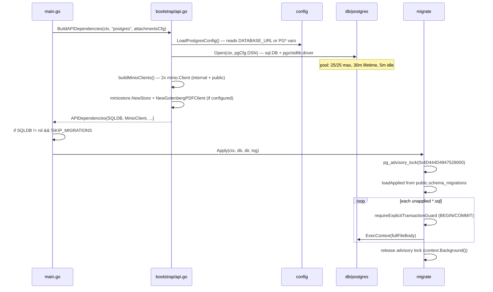
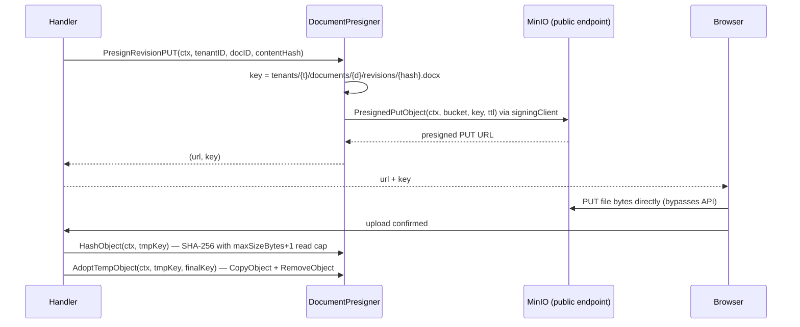
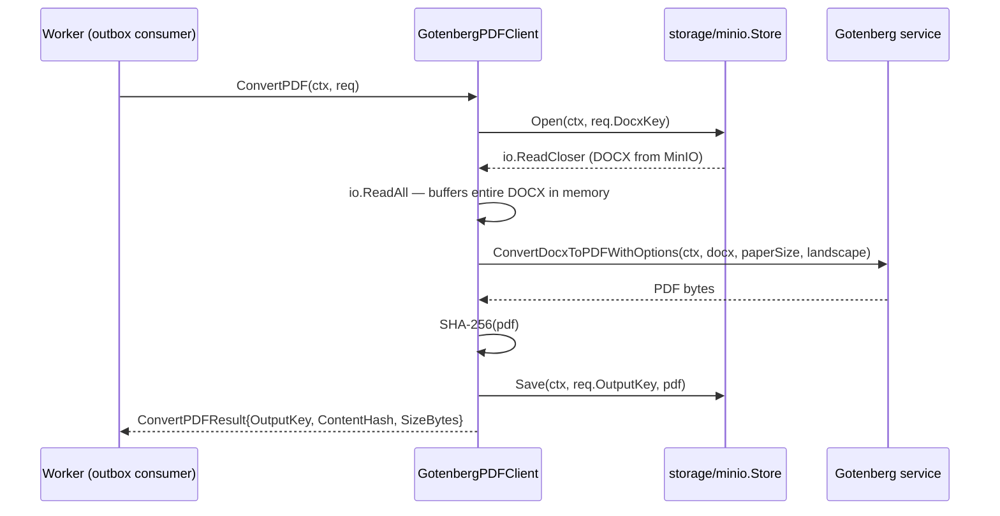

# Platform Data Layer

> **Last verified:** 2026-08-03 (DB baseline fold f1910ac1/557a6af4: `migrate.go` gained `ApplyGrants` for the new `db/grants/` bootstrap stage; `db/migrations/` forward tail is now empty post-fold) | **Prior:** 2026-06-11 (Wave 1: `platform/cache` deleted F-08; River migration single-owner F-19)
> **Scope:** Packages `internal/platform/db`, `internal/platform/migrate`, `internal/platform/bootstrap`, `internal/platform/objectstore`, `internal/platform/storage`. Covers Postgres connectivity, schema migration, DI bootstrap factories, MinIO presigning, and raw blob storage. `platform/cache` was deleted in Wave 1 (F-08/REQ-TOP-3 — was a `.gitkeep`-only empty scaffold).
> **Key files:**
> - `internal/platform/db/postgres/connect.go` — sole Postgres connection factory
> - `internal/platform/migrate/migrate.go` — forward-only SQL migration runner
> - `internal/platform/bootstrap/api.go` — API dependency bundle + MinIO client wiring
> - `internal/platform/bootstrap/jobs.go` — River schema migration (`MigrateRiverSchema`); API binary is the sole owner (Wave 1, F-19)
> - `internal/platform/bootstrap/worker.go` — outbox + PDF converter dependency bundle
> - `internal/platform/objectstore/document_presigner.go` — document presign / adopt / hash
> - `internal/platform/objectstore/templates_presigner.go` — template presign / head
> - `internal/platform/objectstore/template_keys.go` — canonical MinIO key helpers
> - `internal/platform/storage/minio/store.go` — raw blob store for PDF byte I/O

---

## 1. Identity and purpose

The platform data layer is the set of cross-cutting packages that establish database connectivity, run schema migrations at startup, wire all module-level dependencies into a single dependency bundle passed to the composition root, manage blob-storage presigning and download for documents and templates, and provide the raw MinIO object-store adapter consumed by the PDF conversion pipeline.

The layer owns five distinct concerns:

1. A thin Postgres connection factory (`db/postgres`) that opens a `database/sql` pool backed by the pgx stdlib driver.
2. A forward-only SQL migration runner keyed on `public.schema_migrations` (`migrate`).
3. Three dependency-injection bootstrap factories — for the API server, the outbox worker, and the River jobs worker — that assemble every concrete infrastructure adapter and return it as a typed struct (`bootstrap`).
4. Two MinIO presigner value objects for tenant-namespaced presigned PUT/GET URLs, plus helper functions for canonical object-key construction (`objectstore`).
5. A raw MinIO blob-store adapter that satisfies the `pdfObjectStore` interface consumed by `platform/servicebus.GotenbergPDFClient` (`storage/minio`).

~~`platform/cache`~~ — **DELETED Wave 1 (F-08/REQ-TOP-3).** Was a `.gitkeep`-only empty scaffold with no Go code.

---

## 2. File inventory

### `internal/platform/db`

| File | Role |
|---|---|
| `internal/platform/db/.gitkeep` | Empty directory marker; no Go package declared here |
| `internal/platform/db/postgres/connect.go` | Package `postgres`. Exports `Open(ctx, dsn) (*sql.DB, error)` — the sole connection factory. Hard-codes pool settings: 25 max open, 25 max idle, 30-minute lifetime, 5-minute idle timeout. |

### `internal/platform/migrate`

| File | Role |
|---|---|
| `internal/platform/migrate/migrate.go` | Package `migrate`. Exports `Apply(ctx, db, dir, log)` — reads `*.sql` files from `dir`, skips versions already in `public.schema_migrations`, enforces explicit `BEGIN`/`COMMIT` guard, executes under `pg_advisory_lock`. |
| `internal/platform/migrate/migrate_test.go` | Unit tests using `go-sqlmock` covering skip logic, advisory lock, explicit transaction guard, and schema_migrations missing-table tolerance. |
| `internal/platform/migrate/revision_number_zero_based_integration_test.go` | Integration test (`integration` build tag) validating the two-phase zero-based revision number shift migration logic against a live DB. Skips when `DATABASE_URL`/`METALDOCS_DATABASE_URL` are unset. |

### `internal/platform/bootstrap`

| File | Role |
|---|---|
| `internal/platform/bootstrap/api.go` | `APIDependencies` struct bundles all module repos, audit, messaging publisher, Gotenberg, MinIO clients, and cleanup. `BuildAPIDependencies` switches on `repoMode` (postgres vs memory) to wire concrete adapters or in-memory stubs. `buildMinioClients` creates two separate MinIO client instances: one for internal signed ops, one for browser-reachable presigning. |
| `internal/platform/bootstrap/jobs.go` | `JobsDependencies` struct + `BuildJobsDependencies`: opens its own Postgres connection, builds a River client bundle. **Wave 1 (F-19):** `BuildJobsDependencies` no longer calls `MigrateRiverSchema`; the API binary is the sole owner. `MigrateRiverSchema` is still exported and called only from `main.go`. |
| `internal/platform/bootstrap/worker.go` | `WorkerDependencies` struct + `BuildWorkerDependencies`: opens Postgres, wires the outbox consumer, optionally wires the Gotenberg PDF converter, reads `METALDOCS_FANOUT_URL` and `METALDOCS_DOCX_RENDERER_SERVICE_TOKEN` from env directly. |
| `internal/platform/bootstrap/api_test.go` | Tests for Gotenberg health-check status (up/skipped/down), MinIO invalid public endpoint error. |
| `internal/platform/bootstrap/worker_test.go` | Tests for `workerClaimLease` floor enforcement. |

### `internal/platform/objectstore`

| File | Role |
|---|---|
| `internal/platform/objectstore/.gitkeep` | Residual empty-directory marker; superfluous since Go files exist in the package. |
| `internal/platform/objectstore/document_presigner.go` | `DocumentPresigner` struct. Methods: `PresignRevisionPUT`, `PresignObjectGET`, `AdoptTempObject` (copy + delete), `DeleteObject`, `HashObject` (streaming SHA-256 with size cap), `Exists`. Holds dual MinIO clients: `client` for data ops, `signingClient` for URL generation. |
| `internal/platform/objectstore/document_presigner_export.go` | Adds `HeadObject` and `SizeObject` methods to `DocumentPresigner` via stat-only calls. File was appended rather than merged; `_export` suffix is non-standard (see Legacy flags). |
| `internal/platform/objectstore/templates_presigner.go` | `TemplatesPresigner` struct. Methods: `PresignPUT`, `PresignGET`, `HeadContentHash`, `Delete`. Mirrors the dual-client pattern from `DocumentPresigner`. |
| `internal/platform/objectstore/template_keys.go` | Pure key-generation helpers: `TemplateDocxKey(tenantID, templateID, versionNum)` and `TemplateSchemaKey(...)`. |
| `internal/platform/objectstore/document_presigner_test.go` | Unit test asserting that `PresignRevisionPUT` and `PresignObjectGET` use the public (browser-reachable) MinIO client endpoint. |
| `internal/platform/objectstore/templates_presigner_test.go` | Same dual-endpoint assertion for `TemplatesPresigner`. |
| `internal/platform/objectstore/template_keys_test.go` | Unit tests for canonical key format correctness. |

### `internal/platform/storage`

| File | Role |
|---|---|
| `internal/platform/storage/minio/store.go` | Package `minio`. `Store` struct backed by a single MinIO client. Methods: `EnsureBucket`, `Save`, `Open`, `Delete`. Satisfies the `pdfObjectStore` interface in `platform/servicebus/gotenberg_pdf.go:49-52`. |

### `internal/platform/cache` — DELETED (Wave 1, F-08)

Directory and its `.gitkeep` file removed. Was an empty placeholder with no Go source since the initial commit. Deleted to satisfy REQ-TOP-3 (no speculative empty platform scaffolds).

---

## 3. Public surface

### `internal/platform/db/postgres`

```go
func Open(ctx context.Context, dsn string) (*sql.DB, error)
```

Used by all three bootstrap factories and `apps/api/cmd/metaldocs-e2e-seed/main.go`.

### `internal/platform/migrate`

```go
func Apply(ctx context.Context, db *sql.DB, dir string, log *slog.Logger) error
```

Called once at API startup from `apps/api/cmd/metaldocs-api/main.go:191`.

### `internal/platform/bootstrap`

```go
type APIDependencies struct { ... }
type JobsDependencies struct { ... }
type WorkerDependencies struct { ... }

func BuildAPIDependencies(ctx context.Context, repoMode string, attachmentsCfg config.AttachmentsConfig) (APIDependencies, error)
func BuildJobsDependencies(ctx context.Context, cfg config.JobsConfig, workerFactory JobsWorkerFactory) (JobsDependencies, error)
func BuildWorkerDependencies(ctx context.Context, workerCfg config.WorkerConfig) (WorkerDependencies, error)
func MigrateRiverSchema(ctx context.Context, db *sql.DB, schema string) error
```

**Wave 1 (F-19):** `MigrateRiverSchema` is now called only from `apps/api/cmd/metaldocs-api/main.go` (the API binary is the sole River schema migration owner). `BuildJobsDependencies` no longer calls it — the jobs compose service declares `depends_on: api(healthy)` so the schema exists before `metaldocs-jobs` starts.

### `internal/platform/objectstore`

```go
// DocumentPresigner
func NewDocumentPresigner(client, signingClient *minio.Client, bucket string, ttl time.Duration, maxSizeBytes int64) *DocumentPresigner
func (p *DocumentPresigner) PresignRevisionPUT(ctx, tenantID, docID, contentHash string) (url, key string, err error)
func (p *DocumentPresigner) PresignObjectGET(ctx, storageKey string) (string, error)
func (p *DocumentPresigner) AdoptTempObject(ctx, tmpKey, finalKey string) error
func (p *DocumentPresigner) DeleteObject(ctx, key string) error
func (p *DocumentPresigner) HashObject(ctx, key string) (string, error)
func (p *DocumentPresigner) Exists(ctx, key string) (bool, error)
func (p *DocumentPresigner) HeadObject(ctx, key string) (bool, error)   // document_presigner_export.go
func (p *DocumentPresigner) SizeObject(ctx, key string) (int64, error)  // document_presigner_export.go

// TemplatesPresigner
func NewTemplatesPresigner(client, signingClient *minio.Client, bucket string, maxSizeBytes int64) *TemplatesPresigner
func (p *TemplatesPresigner) PresignPUT(ctx, key string, expires time.Duration) (string, error)
func (p *TemplatesPresigner) PresignGET(ctx, key string, expires time.Duration) (string, error)
func (p *TemplatesPresigner) HeadContentHash(ctx, key string) (string, error)
func (p *TemplatesPresigner) Delete(ctx, key string) error

// Key helpers
func TemplateDocxKey(tenantID, templateID string, versionNum int) string
func TemplateSchemaKey(tenantID, templateID string, versionNum int) string
```

No HTTP routes are registered by any package in this area.

### `internal/platform/storage/minio`

```go
func NewStore(cfg config.AttachmentsConfig) (*Store, error)
func (s *Store) EnsureBucket(ctx context.Context) error
func (s *Store) Save(ctx context.Context, storageKey string, content []byte) error
func (s *Store) Open(ctx context.Context, storageKey string) (io.ReadCloser, error)
func (s *Store) Delete(ctx context.Context, storageKey string) error
```

---

## 4. Logic flows

### Flow 1: API startup — DB connect, migrate, bootstrap



Key references: `apps/api/cmd/metaldocs-api/main.go:180-194`, `internal/platform/bootstrap/api.go:74-155`, `internal/platform/db/postgres/connect.go:12-31`, `internal/platform/migrate/migrate.go:31-95`.

### Flow 2: Jobs binary startup — River schema migration

1. `apps/jobs/cmd/metaldocs-jobs/main.go` calls `bootstrap.BuildJobsDependencies(ctx, cfg, workerFactory)`.
2. `bootstrap/jobs.go:25-66`: opens a dedicated `pgdb.Open` pool; invokes the injected `workerFactory(db)`. **Wave 1 (F-19):** no longer calls `MigrateRiverSchema` — the API binary ran that before the jobs binary started.
3. `MigrateRiverSchema` is called from `apps/api/cmd/metaldocs-api/main.go` only. The dual-caller fragility noted in the legacy register is resolved.

### Flow 3: Document presign flow (browser upload path)



References: `internal/platform/objectstore/document_presigner.go:41-51, 57-90, 99-136`.

### Flow 4: PDF conversion via GotenbergPDFClient



The `pdfObjectStore` interface (`platform/servicebus/gotenberg_pdf.go:49-52`) is satisfied exclusively by `*storage/minio.Store`. No local-storage fallback exists for PDF conversion.

References: `internal/platform/servicebus/gotenberg_pdf.go:70-108`, `internal/platform/storage/minio/store.go:54-75`.

### Flow 5: Bootstrap memory mode (development and testing)

`BuildAPIDependencies(ctx, "memory", ...)` takes the `default` branch in `bootstrap/api.go:127-155`. It wires `authmemory.NewRepository()`, `auditmemory.NewWriter()`, `nooppub.NewPublisher()`, and seeds in-memory user/role state via `authRepo.UpsertUserAndAssignRole`. `SQLDB`, `PDFConverter`, all MinIO fields are nil. `StatusProvider` is `observability.NewStaticRuntimeStatusProvider` (always 200 OK). Callers guard on nil before use.

---

## 5. Dependencies

### Outbound imports

**`internal/platform/db/postgres`**
- `database/sql` (stdlib)
- `github.com/jackc/pgx/v5/stdlib` (blank-import side-effect: registers the `pgx` driver)

**`internal/platform/migrate`**
- `database/sql`, `os`, `path/filepath`, `regexp`, `sort`, `strings`, `log/slog`
- `github.com/jackc/pgx/v5/pgconn` (for `PgError` code check on missing `schema_migrations` table — error code `42P01`)

**`internal/platform/bootstrap`**
- `metaldocs/internal/platform/db/postgres`
- `metaldocs/internal/platform/config` (LoadPostgresConfig, LoadAttachmentsConfig, LoadGotenbergConfig, LoadWorkerConfig, LoadJobsConfig)
- `metaldocs/internal/platform/messaging`, `messaging/noop`, `messaging/outbox/postgres`
- `metaldocs/internal/platform/storage/minio`, `platform/servicebus`, `platform/render/gotenberg`
- `metaldocs/internal/platform/authn`, `tenant`, `observability`, `jobs/river`
- `metaldocs/internal/modules/audit`, `auth`, `iam` infrastructure packages
- `github.com/minio/minio-go/v7` + `credentials`
- `github.com/riverqueue/river`, `riverdriver/riverdatabasesql`, `rivermigrate`

**`internal/platform/objectstore`**
- `github.com/minio/minio-go/v7`
- `metaldocs/internal/modules/documents/domain` (ErrUploadMissing)
- `metaldocs/internal/modules/templates/domain` (ErrUploadMissing)
- `crypto/sha256`, `encoding/hex`, `io`, `log`, `net/url`, `strings`, `time`

**`internal/platform/storage/minio`**
- `github.com/minio/minio-go/v7` + `credentials`
- `metaldocs/internal/platform/config` (AttachmentsConfig)
- `bytes`, `io`, `context`

### Inbound consumers (grep-verified)

| Package | Imported by |
|---|---|
| `platform/db/postgres` | `bootstrap/api.go`, `bootstrap/jobs.go`, `bootstrap/worker.go`, `apps/api/cmd/metaldocs-e2e-seed/main.go` |
| `platform/migrate` | `apps/api/cmd/metaldocs-api/main.go` (only consumer) |
| `platform/bootstrap` | `apps/api/cmd/metaldocs-api/main.go`, `apps/worker/cmd/metaldocs-worker/main.go`, `apps/jobs/cmd/metaldocs-jobs/main.go` |
| `platform/objectstore` | `apps/api/cmd/metaldocs-api/main.go`, `internal/platform/objectstore/template_keys_test.go` |
| `platform/storage/minio` | `bootstrap/api.go`, `bootstrap/worker.go` |
| ~~`platform/cache`~~ | **DELETED Wave 1 (F-08)** |

---

## 6. Persistence

### `internal/platform/migrate`

Reads from and writes to `public.schema_migrations`. The `SELECT version FROM public.schema_migrations` query is the idempotency check (`migrate.go:31-95`). Each migration SQL file must `INSERT INTO public.schema_migrations (version) VALUES ('NNNN')` inside its own `BEGIN`/`COMMIT` block — this is an author convention; the runner enforces only the `BEGIN`/`COMMIT` guard, not the `INSERT`.

Advisory lock key: `0x4D444D4947528000` (named constant at `migrate.go:24`).

Migration files are in `db/migrations/` — **currently empty except `README.md`**; migrations `0257`–`0315` were folded into the baseline 2026-07-29 (see `wiki/database/migration-policy.md`). `migrate.Apply` (`migrate.go:32`) applies only forward-tail files in this directory and tolerates it being empty. Separately, `migrate.ApplyGrants` (`migrate.go:115`) applies `db/grants/0001_role_grants.sql` unconditionally on every API startup, under the same advisory lock, before `Apply` — unlike `Apply` it writes no `schema_migrations` ledger rows. The prerequisite (`db/prerequisites/0001_extensions.sql`), curated baseline (`db/baseline/0001_current_schema.sql`), reference data (`db/reference-data/0001_product_reference_data.sql`), grants (`db/grants/0001_role_grants.sql`), and dev seeds (`db/dev-seeds/0001_local_dev_seed.sql`) are applied separately by `scripts/dev-bootstrap-baseline.ps1`.

### `internal/platform/bootstrap`

`MigrateRiverSchema` writes River's own schema tables via `rivermigrate`. These are separate from the product `public.schema_migrations` ledger.

### Other packages

`objectstore`, `storage/minio`, `db/postgres`, `cache` — no direct table access. `storage/minio` and `objectstore` interact with MinIO only via the `*minio.Client` instances created at bootstrap time.

---

## 7. Config and environment

### `internal/platform/db/postgres` (via `config/postgres.go`)

| Variable | Required | Default | Notes |
|---|---|---|---|
| `DATABASE_URL` | Preferred | — | Full DSN; takes priority over PG* vars |
| `PGHOST` | Required if no DSN | — | |
| `PGPORT` | No | `5432` | |
| `PGDATABASE` | Required if no DSN | — | |
| `PGUSER` | Required if no DSN | — | |
| `PGPASSWORD` | Required if no DSN | — | |
| `PGSSLMODE` | No | `require` | |

Pool settings are hard-coded in `internal/platform/db/postgres/connect.go:17-21`: 25 max open, 25 max idle, 30-minute lifetime, 5-minute idle timeout. Not configurable via environment variable.

### `internal/platform/migrate` (invoked from `main.go`)

| Variable | Required | Default | Notes |
|---|---|---|---|
| `METALDOCS_MIGRATIONS_DIR` | No | `"db/migrations"` | Directory of `*.sql` migration files |
| `METALDOCS_SKIP_STARTUP_MIGRATIONS` | No | `""` (false) | Set to `"true"` to skip `migrate.Apply` at startup |

### `internal/platform/bootstrap` — MinIO/attachments (`config/attachments.go`)

| Variable | Required | Default | Notes |
|---|---|---|---|
| `METALDOCS_STORAGE_PROVIDER` | No | `"local"` | `memory`, `local`, or `minio` |
| `METALDOCS_ATTACHMENTS_SIGNING_SECRET` | Yes | — | Min 32 bytes; required for all storage providers |
| `METALDOCS_ATTACHMENTS_ROOT` | No | `"non_git/attachments"` | Local storage root |
| `METALDOCS_ATTACHMENTS_DOWNLOAD_TTL_SECONDS` | No | `300` | Min 30 |
| `APP_ENV` | No | `"local"` | Guards auth-disabled and MinIO URL logic |
| `METALDOCS_MINIO_ENDPOINT` | If MinIO | — | Internal cluster endpoint |
| `METALDOCS_MINIO_PUBLIC_ENDPOINT` | No | = `ENDPOINT` | Browser-reachable endpoint; defaults to internal |
| `METALDOCS_MINIO_ACCESS_KEY` | If MinIO | — | |
| `METALDOCS_MINIO_SECRET_KEY` | If MinIO | — | |
| `METALDOCS_MINIO_BUCKET` | If MinIO | — | |
| `METALDOCS_MINIO_USE_SSL` | No | `false` | |
| `METALDOCS_MINIO_AUTO_CREATE_BUCKET` | No | `false` | Safe default; see open questions |

### `internal/platform/bootstrap` — Gotenberg

| Variable | Required | Default | Notes |
|---|---|---|---|
| `METALDOCS_GOTENBERG_URL` | No | `""` | Empty = Gotenberg disabled; PDF conversion omitted |

### `internal/platform/bootstrap` — repository mode

| Variable | Required | Default | Notes |
|---|---|---|---|
| `METALDOCS_REPOSITORY` | No | `"memory"` | `"postgres"` or `"memory"` |

### `internal/platform/bootstrap` — worker env (read directly via `os.Getenv`, not config struct)

| Variable | Read in | Notes |
|---|---|---|
| `METALDOCS_FANOUT_URL` | `bootstrap/worker.go:47` | Passed through to `WorkerDependencies.FanoutURL` |
| `METALDOCS_DOCX_RENDERER_SERVICE_TOKEN` | `bootstrap/worker.go:48` | Passed through to `WorkerDependencies.FanoutToken` |

### `internal/platform/bootstrap` — jobs

| Variable | Required | Default | Notes |
|---|---|---|---|
| `METALDOCS_JOBS_RIVER_SCHEMA` | No | `""` (River default) | Postgres schema for River tables |
| `METALDOCS_JOBS_ENABLED` | No | `true` | |
| `METALDOCS_JOBS_TEMPORAL_MAX_WORKERS` | No | `10` | River queue concurrency |

---

## 8. Concurrency and async behavior

**`migrate.Apply`** — single-threaded execution under a Postgres advisory lock. No goroutines. The lock guarantees at-most-one runner across all API instances during startup (`migrate.go:37-48`).

**`db/postgres/connect.go`** — `*sql.DB` is safe for concurrent use. The single pool returned by `Open` is shared by all goroutines in the process.

**`bootstrap`** — each `Build*` function is called once at startup from the main goroutine. The returned `Cleanup` functions are called in `defer deps.Cleanup()` from the main goroutine.

**`objectstore/DocumentPresigner`** — `*minio.Client` is documented as goroutine-safe; the presigner struct is safe for concurrent use after construction.

**`storage/minio.Store`** — same: `*minio.Client` is goroutine-safe; `Store` carries no mutable state after construction.

No goroutines, channels, outbox writes, or timers are present in any file in this area. All background-processing concerns (River jobs, outbox relaying, PDF conversion) are initiated in `main.go` or the worker binary, not inside these platform packages.

---

## 9. Error handling and observability

**`migrate.Apply`** — all errors wrapped with `fmt.Errorf("migrate: ...: %w", err)`. The advisory lock release uses `context.Background()` to survive parent cancellation, and only overwrites `retErr` when the unlock fails and no prior error is in flight (`migrate.go:44-48`).

**`db/postgres/connect.go`** — if `PingContext` fails, `db.Close()` is called (error discarded: `_ = db.Close()`) before returning the wrapped error.

**`objectstore/DocumentPresigner`** — nil-client guard on every method returns a descriptive error. `isNoSuchKeyErr` inspects both `minio.ErrorResponse.Code` and string-contains fallbacks for robustness across MinIO SDK versions (`document_presigner.go:152-168`). `AdoptTempObject` silently logs cleanup failures using the legacy `"log"` package (not `slog`): `log.Printf("objectstore: adopt tmp cleanup failed ...")` (`document_presigner.go:80`).

**`storage/minio/store.go`** — errors wrapped with `fmt.Errorf("... minio: %w", err)`. No nil guards; `Store` is expected to always carry a valid client after `NewStore`.

**RFC 9457** — not applicable; this layer never writes HTTP responses.

**Structured logging** — `migrate.Apply` accepts a `*slog.Logger` and logs `Info("applying migration", ...)` and `Info("migrations done", ...)`. All other packages in this area log nothing, except the `log.Printf` smell in `DocumentPresigner` noted above. No metrics or tracing calls exist anywhere in this area.

---

## 10. Legacy and open flags

| Flag | Location | RF / REQ |
|---|---|---|
| ~~`platform/cache` empty placeholder~~ | **CLOSED Wave 1 (F-08):** directory + `.gitkeep` deleted. | RF-7 partial (closed), REQ-TOP-3 |
| `internal/platform/db` declares no Go package; real package is `internal/platform/db/postgres` | `internal/platform/db/.gitkeep` + `internal/platform/db/postgres/connect.go:1` — one driver, one file; extra nesting adds path depth without namespace value | RF-7, REQ-TOP-3 |
| `document_presigner_export.go` splits `DocumentPresigner` methods across two files | `internal/platform/objectstore/document_presigner_export.go:1-38` — `_export` suffix conventionally signals test-helper export files in Go (`export_test.go`); the split is maintenance friction | — |
| `log.Printf` instead of `slog` in `objectstore` | `internal/platform/objectstore/document_presigner.go:10, 80` — inconsistent with the canonical observability pattern; loses request context | — |
| `DocumentPresigner` and `TemplatesPresigner` duplicate the dual-client MinIO pattern | `document_presigner.go:99-136` vs `templates_presigner.go:47-80` — both embed streaming hash logic; extraction is blocked by different `domain.ErrUploadMissing` types from two module domains | — |
| `bootstrap/api.go` imports module infrastructure directly | `internal/platform/bootstrap/api.go` — 216 lines; largest file in area; transitive dep of 3+ bounded contexts; recompiles on any module infrastructure change | — |
| `METALDOCS_FANOUT_URL` and `METALDOCS_DOCX_RENDERER_SERVICE_TOKEN` read via `os.Getenv`, not config struct | `internal/platform/bootstrap/worker.go:47-48` — breaks the 12-Factor typed-config-at-startup contract for these two values | — |
| Three separate MinIO client instances created under full Gotenberg + MinIO mode | `internal/platform/bootstrap/api.go:85-103` — `buildMinioClients` (two clients for presigning) + `miniostore.NewStore` (one more for PDF byte I/O) | — |
| ~~`MigrateRiverSchema` called from two callers~~| **CLOSED Wave 1 (F-19):** `BuildJobsDependencies` no longer calls it; API binary is sole owner. | — |
| `internal/platform/objectstore/.gitkeep` is superfluous | directory already has Go files | — |
| Stale TODO comment in `migrate.go:30` | the described behavior (`requireExplicitTransactionGuard`) is already implemented | — |
| Blueprint claims "pgx pool (`platform/db/postgres`)" | `wiki/architecture/backend-blueprint.md:175` — the code uses `database/sql` with the pgx stdlib driver, not `pgxpool.Pool`; `pgxpool` is not imported anywhere in `db/postgres` (`internal/platform/db/postgres/connect.go:6, 13`) | — |

For the registry of all open flags, see [../legacy-register.md](../legacy-register.md).

---

## 11. Open questions

- **[runtime-unverified]** Whether Postgres pool settings (25/25 max conns, `connect.go:17-21`) remain appropriate under production load. The values are hard-coded and cannot be tuned without a code change. No documented rationale exists for the specific numbers.
- **[runtime-unverified]** Whether `METALDOCS_MINIO_AUTO_CREATE_BUCKET` is safe to enable in production. `EnsureBucket` in `storage/minio/store.go:37-52` creates the bucket when the flag is true and the bucket is missing. The flag default is `false`, which is the safe default.
- ~~**`MigrateRiverSchema` dual-caller race**~~ — **RESOLVED Wave 1 (F-19):** single caller now; not applicable.
- **[runtime-unverified]** Edge case in `HashObject`/`HeadContentHash`: the `io.LimitReader(obj, limit+1)` reads up to `limit+1` bytes; at exactly `limit` bytes the `n > limit` check passes, at `limit+1` it fails. Correct but untested at the boundary.
- Whether `internal/platform/db/.gitkeep` is permanent drift or intended to eventually hold a package-level file distinct from `db/postgres`.

---

## Sources

Stage-1 artifact: `wiki/backend/_artifacts/stage1/platform-data-layer.md`

This document is part of the Stage-1 truth map. For strategic grading and maturity context see [../../architecture/backend-blueprint.md](../../architecture/backend-blueprint.md). For normative requirements and refactoring items cited above see [../../architecture/backend-target-architecture.md](../../architecture/backend-target-architecture.md).
