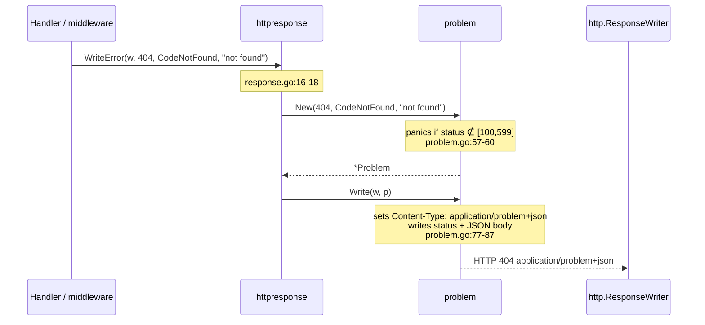
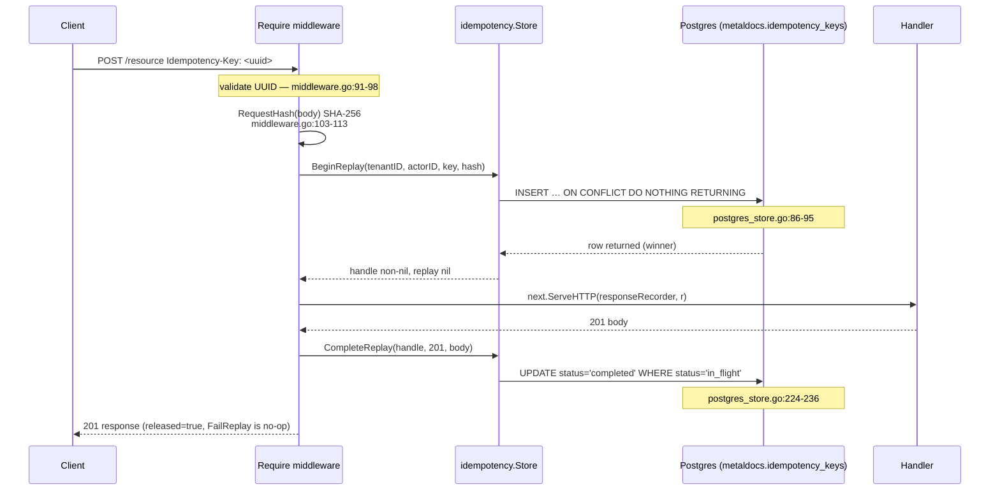
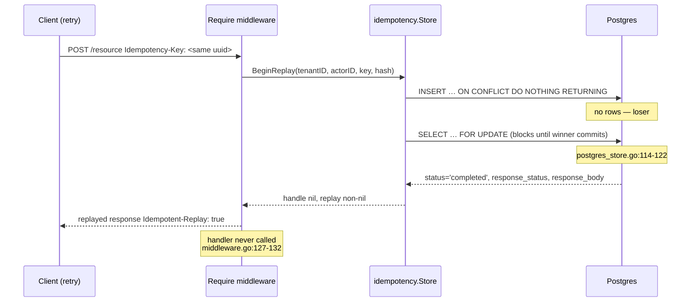
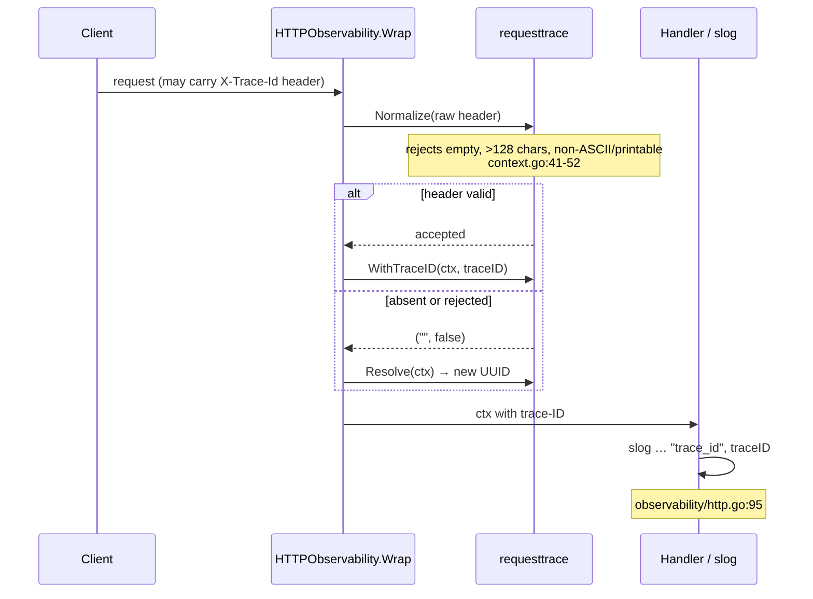

# Platform — HTTP Toolkit

> **Last verified:** 2026-08-04 (ADR 0089 pass: §2.1 rewritten for the closed `Code` type + registry; `codes_catalog_guard_test.go` references removed — file deleted; Flags 1 and 3 marked RESOLVED; `problem.go` panic anchor re-pinned) | **Prior:** 2026-07-06 (F9.4 doc-truth pass)
> **Scope:** The eight shared packages under `internal/platform/` that constitute the API design system's runtime enforcement surface: `httpresponse`, `problem`, `pagination`, `idempotency`, `requesttrace`, `useragent`, `httpclient`, and `formval`. Covers what each package provides, its public surface, the logic flows it implements, which domain modules consume it, and all flags identified in Stage-1 audit.
> **Out of scope:** The higher-level observability and security platform packages (`platform/observability`, `platform/ratelimit`, `platform/security`). Those are adjacent to this layer but warrant their own docs.
> **Key files:**
> - `internal/platform/httpresponse/response.go`
> - `internal/platform/problem/problem.go`
> - `internal/platform/problem/code.go`
> - `internal/platform/problem/codes.go`
> - `internal/platform/pagination/cursor.go`
> - `internal/platform/idempotency/middleware.go`
> - `internal/platform/idempotency/postgres_store.go`
> - `internal/platform/requesttrace/context.go`
> - `internal/platform/useragent/parse.go`
> - `internal/platform/httpclient/internal_client.go`
> - `internal/platform/formval/gojsonschema.go`

---

## 1. Role in the backend stack

The HTTP toolkit packages are domain-free libraries (`internal/platform/`, per REQ-TOP-2 — platform packages must not import modules). Together they enforce three cross-cutting concerns end-to-end:

- **Error shape.** `problem` + `httpresponse` ensure every handler returns RFC 9457 `application/problem+json` with a code from a genuinely closed vocabulary — closed by the type system, so an unregistered code does not compile (ADR 0089).
- **List safety.** `pagination` provides the sole keyset-cursor codec, enforcing that unbounded list endpoints never paginate by offset (REQ-API-4).
- **Mutation safety.** `idempotency` provides a Postgres-backed two-phase middleware that serialises concurrent replays, satisfying REQ-API-5 for all retry-prone mutations.

The remaining packages (`requesttrace`, `useragent`, `httpclient`, `formval`) are narrower utilities: trace-ID injection, User-Agent labelling for the IAM sessions tab, a pre-tuned outbound HTTP client, and JSON Schema validation for document fill-in forms.

No package in this layer registers HTTP routes directly; all are consumed by higher-level modules.

For strategic placement see [../../architecture/backend-blueprint.md](../../architecture/backend-blueprint.md) (concerns D1, D3, D6) and [../../architecture/backend-target-architecture.md](../../architecture/backend-target-architecture.md) (REQ-API-4, REQ-API-5, REQ-H-2, REQ-OBS-3, REQ-REL-1).

---

## 2. Package reference

### 2.1 `problem` — RFC 9457 envelope and closed code catalog

`internal/platform/problem/`

**What it provides.** The `Problem` struct (`problem.go`) implements RFC 9457 Problem Details: `type`, `title`, `status`, `detail`, `instance`, and an `errors` extension for field-level validation failures (`FieldError`). A fluent builder chain (`WithDetail`, `WithInstance`, `WithFieldError`, `WithType`) constructs problems without argument bloat. `Write(w, p)` marshals to `application/problem+json` and writes the HTTP status in one call.

`code.go` defines the vocabulary itself (ADR 0089). `Code` is **`struct{ s string }` with an unexported field** — not a string alias. That single choice is what makes the vocabulary closed: no package outside `problem` can construct a `Code` value, so writing a bare string literal in a code position is a **compile error**, not a lint finding. The predecessor was `type Code string` plus an AST guard test (`codes_catalog_guard_test.go`) that scanned an allowlist of `guardedPackages` for raw literals; both are deleted, because the type system now enforces at compile time what the allowlist only approximated in the packages someone remembered to enroll.

Codes are created by registration, never declared:

| Constructor | Use |
|---|---|
| `Register(module, code, defaultStatus)` | the normal case; status is the family default |
| `RegisterWithStatus(module, code, status, reason)` | a status that departs from the family default — the `reason` argument is **mandatory** and is printed in the generated catalog |
| `RegisterLegacy(module, code, defaultStatus)` | escape hatch for a code that cannot yet fit a family. **Zero uses outside the platform package** |
| `RegisterField(module, code)` | field-level codes for `FieldError.code`, in a separate namespace |

Every name must be `<family>.<snake_case>` in one of the ten closed semantic families (`request` 400 · `validation` 422 · `auth` 401 · `permission` 403 · `notfound` 404 · `state` 409 · `precondition` 412 · `conflict` 409 · `ratelimit` 429 · `internal` 500). A name outside a family, or a duplicate registration, **panics at package init** — the process refuses to start rather than serving an ambiguous vocabulary.

`codes.go` holds the platform + shared block (53 registrations); the remaining codes are registered by their owning module's `errors.go`, which is where they belong — the module that emits a code owns its name and status. `Registrations()` returns the whole runtime catalog, which is what `cmd/problem-codes-dump` reads to generate the FE snapshot and [`wiki/references/problem-codes.md`](../../references/problem-codes.md).

**Key behaviour.** `NewFor(code, title)` is the **default constructor**: the status comes from the code's registration, so the same condition cannot answer 409 on one route and 412 on another (ADR 0089 decision 3). It panics on an unregistered or zero `Code` — a Problem with no status binding has no defensible status to emit (`problem.go:35–45`). `New(status, code, title)` keeps status as an explicit argument precisely so an override is *visible at the call site* for reviewers and the api-lint drift rule; it panics if `status ∉ [100, 599]` (`problem.go:57–60`).

**File inventory:**

| File | Role |
|---|---|
| `problem.go` | `Problem` struct, `NewFor`/`New`, fluent builder, `FromValidation`, `Write`, `Error` interface |
| `code.go` | The closed `Code` type, the ten families, the four `Register*` constructors, `Registrations`/`Lookup`/`StatusFor` |
| `codes.go` | The platform + shared registrations (53) |
| `problem_test.go` | Marshal/unmarshal, fluent chain, `FromValidation`, `Write`, `Error`, panic-on-invalid-status |
| `code_test.go` | Family validation, duplicate-registration panic, separate field namespace, `testdata/` compile-fail fixtures |

---

### 2.2 `httpresponse` — zero-ceremony handler helpers

`internal/platform/httpresponse/`

**What it provides.** Three functions used by every HTTP handler:

- `WriteJSON(w, status, v)` — marshals `v` as `application/json` and writes `status`.
- `WriteError(w, status, code, message)` — constructs a `problem.Problem` and delegates to `problem.Write`.
- `ReadJSON(r, dst)` — decodes the request body into `dst`, returning a typed error on malformed input.

**File inventory:**

| File | Role |
|---|---|
| `response.go` | `WriteJSON`, `WriteError`, `ReadJSON` |
| `response_test.go` | Unit test: `WriteError` emits `application/problem+json` with correct status |

---

### 2.3 `pagination` — keyset cursor codec

`internal/platform/pagination/`

**What it provides.** The sole cursor implementation in the codebase: `EncodeCursor(sortValue, id)` produces a base64 raw-URL-safe string from `sortValue + "|" + id` (`cursor.go:47–49`). `DecodeCursor(cursor)` reverses the encoding, returning `("", "", nil)` for a blank input (first page), or `ErrInvalidCursor` on malformed input. `ClampLimit(n)` enforces `DefaultLimit = 20` and `MaxLimit = 100` (`cursor.go:21–24`) — callers cannot request unbounded pages. The package has no external dependencies (stdlib only).

**File inventory:**

| File | Role |
|---|---|
| `cursor.go` | `EncodeCursor`, `DecodeCursor`, `ClampLimit`, `ErrInvalidCursor`, `DefaultLimit`, `MaxLimit` |
| `cursor_test.go` | Round-trip, URL-safety (B2 guard), blank = first page, malformed, `ClampLimit` boundary tests |

---

### 2.4 `idempotency` — Postgres-backed two-phase replay middleware

`internal/platform/idempotency/`

**What it provides.** A complete idempotency protocol — middleware factory (`Require`) + Postgres store (`Store`/`ReplayHandle`/`Replay`) — for mutating endpoints that must survive client retries without duplicating side effects (REQ-API-5).

The middleware:
- Validates `Idempotency-Key` header (UUID format, `IsValidKey`).
- Hashes the request body via SHA-256 to detect payload changes: `RequestHash` reads body, rewinds with `io.NopCloser`, and returns `SHA-256(method\npath?query\nbody)` (`middleware.go:28–45`).
- Wraps the response writer in a `responseRecorder` to capture status + body.
- Commits the captured response on 2xx; releases the slot on non-2xx or panic.
- Replays a completed response directly to the client with `Idempotent-Replay: true` header when a replay hit is detected (`middleware.go:127–132`).
- Is fail-closed: `Flush()` on the recorder panics with a directive rather than silently buffering streaming responses (`middleware.go:206–210`); `WithStreamingOptOut` allows opt-out for genuinely streaming routes.

The store uses a two-phase Postgres protocol on `metaldocs.idempotency_keys`:
- `BeginReplay`: `INSERT … ON CONFLICT DO NOTHING RETURNING`; if the INSERT wins, the caller proceeds. If the INSERT loses, the loser executes `SELECT … FOR UPDATE`, which blocks until the winner's transaction resolves (`postgres_store.go:114–122`).
- `CompleteReplay`: `UPDATE … SET status='completed'` gated on `AND status='in_flight'`; validates body ≤ 64 KiB and status ∈ `[100, 599]` before committing (`postgres_store.go:206–249`).
- `FailReplay`: `DELETE … WHERE status='in_flight'` — releases the slot for retry (`postgres_store.go:265–277`).

**File inventory:**

| File | Role |
|---|---|
| `middleware.go` | `Require` factory, `IsValidKey`, `RequestHash`, `WithStreamingOptOut`, `responseRecorder`, `writeErrJSON` |
| `postgres_store.go` | `Store`, `ReplayHandle`, `Replay`, `BeginReplay`, `CompleteReplay`, `FailReplay`, `ErrConflict`; `maxBodyBytes = 64 KiB` |
| `middleware_test.go` | Integration: missing header, invalid UUID, first-call record, conflict 422, different-path 422 |
| `middleware_concurrency_test.go` | Same-key executes once (C3 fix), panic releases slot, non-2xx releases slot |
| `middleware_streaming_test.go` | `Flush` without opt-out panics, opt-out bypasses, `false` matcher still enforces |
| `two_phase_test.go` | Round-trip, conflict, fail-releases-slot, double-complete fails, invalid status rejected, concurrent same-hash serialises, concurrent diff-hash gives `ErrConflict` |
| `h11_schema_test.go` | H11 regressions: empty actorID guard, oversized body (>64 KiB) rejected, non-JSON body round-trips |

---

### 2.5 `requesttrace` — request trace-ID injection and normalisation

`internal/platform/requesttrace/`

**What it provides.** Stores and retrieves a request trace-ID from `context.Context` via an unexported key. `Normalize(raw)` validates an inbound `X-Trace-Id` header: rejects values that are empty, longer than 128 characters, or contain non-printable / non-ASCII bytes to prevent header injection (`context.go:41–52`). `Resolve(ctx)` reuses an existing trace-ID or generates a fresh UUID when absent. The package depends on `github.com/google/uuid` for generation; all other concerns are stdlib.

**File inventory:**

| File | Role |
|---|---|
| `context.go` | `WithTraceID`, `FromContext`, `Resolve`, `Normalize` |
| `context_test.go` | Rejects `\r\n` poison, reuses context trace-ID, generates UUID when absent |

---

### 2.6 `useragent` — User-Agent label parser

`internal/platform/useragent/`

**What it provides.** A single exported function `Label(ua string) string` that produces a human-readable browser + OS label (e.g. `"Chrome on Windows"`) from a raw User-Agent string using pure string matching (no external dependencies). Returns `Unknown` constant when no pattern matches.

**File inventory:**

| File | Role |
|---|---|
| `parse.go` | `Label`, `Unknown` constant |
| `parse_test.go` | 10 table-driven cases: Edge, Opera, Firefox, Chrome, Mobile Safari, iOS, curl, OS-only |

---

### 2.7 `httpclient` — pre-tuned internal HTTP client

`internal/platform/httpclient/`

**What it provides.** `NewInternalClient() *http.Client` returns a `*http.Client` with a tuned transport for intra-cluster service fanout (Gotenberg, docx-renderer). All values are compile-time constants; no configuration or environment variables. Transport settings: dial timeout 5 s, TLS handshake timeout 5 s, response header timeout 10 s, idle connection timeout 90 s, HTTP/2 forced, `MaxConnsPerHost 50` (`internal_client.go:13–29`). Retry logic is intentionally absent — retry ownership belongs to the outbox worker per ADR 0009.

**File inventory:**

| File | Role |
|---|---|
| `internal_client.go` | `NewInternalClient` — transport field definitions |
| `internal_client_test.go` | Asserts all transport field values match constants |

---

### 2.8 `formval` — JSON Schema validator for document fill-in data

`internal/platform/formval/`

**What it provides.** `NewGojsonschema()` returns a `*Gojsonschema` that implements `Validate(schemaJSON []byte, formData []byte) (bool, []string, error)` via `github.com/santhosh-tekuri/jsonschema/v6`. `flattenValidationErrors` recursively traverses `ValidationError.Causes` to produce a flat `[]string` of human-readable error messages. The package exposes no interface; the documents module wires it through an unexported interface in `internal/modules/documents/module.go`.

**File inventory:**

| File | Role |
|---|---|
| `gojsonschema.go` | `Gojsonschema` struct, `NewGojsonschema`, `Validate`, `flattenValidationErrors` |

---

## 3. Logic flows

### Flow 1 — RFC 9457 error response assembly



The `CodeNotFound` argument cannot be a string literal: `problem.Code` has an unexported field, so only a registered code type-checks in that position. This used to be a `go test`-time AST scan over an allowlist of packages; since ADR 0089 it is a compile error everywhere, with no allowlist to be absent from.

---

### Flow 2 — Idempotency: winner path (first request)



---

### Flow 3 — Idempotency: replay hit (loser path)



---

### Flow 4 — Keyset cursor encode / decode

```mermaid
sequenceDiagram
    participant H as Handler / repo
    participant P as pagination
    participant C as Client

    Note over H: fetch limit+1 rows; take last item
    H->>P: EncodeCursor(sortValue, id)
    Note over P: base64RawURL(sortValue + "|" + id)<br/>cursor.go:47-49
    P-->>H: cursor string
    H-->>C: { items:[…], next_cursor: "<cursor>" }

    C->>H: GET /resource?cursor=<cursor>&limit=20
    H->>P: DecodeCursor(cursor)
    Note over P: blank → ("","",nil) = first page<br/>bad → ErrInvalidCursor<br/>cursor.go:54-68
    P-->>H: sortValue, id
    H->>H: WHERE (sort_col, id) > (sortValue, id)
```

`ErrInvalidCursor` is mapped to `problem.CodeInvalidCursor` + HTTP 400 at call sites: `internal/modules/documents/delivery/http/handler.go:199`, `internal/modules/controlleddocuments/delivery/http/routes.go:45`.

---

### Flow 5 — Request trace-ID injection



---

## 4. Adoption matrix — which modules consume each package

| Package | Consuming packages / files |
|---|---|
| `httpresponse` | `modules/audit`, `modules/auth`, `modules/controlleddocuments`, `modules/documents`, `modules/iam`, `modules/search`, `modules/security`, `modules/taxonomy`, `modules/templates` — 10 handler files |
| `problem` | All of the above + `platform/idempotency`, `platform/ratelimit`, `platform/security` — 32 files total |
| `pagination` | `modules/audit/delivery/http`, `modules/audit/infrastructure/postgres`, `modules/controlleddocuments/delivery/http`, `modules/controlleddocuments/infrastructure`, `modules/documents/delivery/http`, `modules/documents/infrastructure` — 7 files |
| `idempotency` | `modules/controlleddocuments/delivery/http`, `modules/documents/delivery/http`, `modules/documents/approval/infrastructure`, `modules/documents/approval/application`, `modules/documents/approval/http`, `modules/templates/delivery/http` — 14 files |
| `requesttrace` | `platform/observability/http`, `modules/auth/delivery/http`, `apps/api/cmd/metaldocs-api/main.go` — 4 files |
| `useragent` | `modules/iam/delivery/http/sessions_handler.go` — 1 file only |
| `httpclient` | `apps/api/cmd/metaldocs-api/main.go`, `apps/worker/cmd/metaldocs-worker/main.go` — 2 files |
| `formval` | `apps/api/cmd/metaldocs-api/main.go` (injected as `documents.Dependencies.FormVal`) — 1 file |

---

## 5. Persistence (idempotency only)

All packages except `idempotency` are stateless.

**Table:** `metaldocs.idempotency_keys`

| Column | Type | Notes |
|---|---|---|
| `tenant_id` | TEXT | Part of composite PK (no FK constraint — see flag §6.8) |
| `actor_user_id` | TEXT | Part of composite PK |
| `route_template` | TEXT | Part of composite PK |
| `key` | TEXT | Part of composite PK |
| `payload_hash` | TEXT | SHA-256 of method + path + query + body |
| `status` | TEXT | `in_flight \| completed \| failed` |
| `expires_at` | TIMESTAMPTZ | Hardcoded 24-hour TTL in SQL literal (see flag §6.7) |
| `response_status` | INTEGER NULL | Populated by `CompleteReplay` |
| `response_body` | BYTEA NULL | Max 64 KiB enforced by `CompleteReplay` (`postgres_store.go:17–22`) |

Query patterns:
- `INSERT … ON CONFLICT DO NOTHING RETURNING` — winner detection. `postgres_store.go:86–95`
- `SELECT … FOR UPDATE` — concurrent loser serialisation. `postgres_store.go:114–122`
- `UPDATE … SET status='completed' WHERE status='in_flight'` — atomic completion. `postgres_store.go:224–236`
- `DELETE … WHERE status='in_flight'` — slot release on fail/panic. `postgres_store.go:265–277`

Migration reference: `maxBodyBytes = 64 * 1024` matches a CHECK constraint referenced as "migration 0204" (`postgres_store.go:17`).

Janitor: `idempotency_janitor` sweeps expired rows; registered in `main.go:537–541` when `ENABLE_JOB_IDEMPOTENCY_JANITOR != false`. [runtime-unverified] Sweep query and frequency live in `internal/modules/jobs/idempotency_janitor/` (not audited in Stage 1).

---

## 6. Legacy and open flags

> These flags feed into [../legacy-register.md](../legacy-register.md). RF IDs reference the refactoring register in [../../architecture/backend-target-architecture.md](../../architecture/backend-target-architecture.md).

### Flag 1 — Ad-hoc string codes in `idempotency.Require` — **RESOLVED (ADR 0089)**

Was: `writeErrJSON` took raw string literals cast to `problem.Code` (`"IDEMPOTENCY_KEY_INVALID"`, `"BAD_REQUEST"`, `"INTERNAL"` — three with no catalog entry, and `"INTERNAL"` diverging from `INTERNAL_ERROR`), because the guard test's `guardedPackages` allowlist did not cover `internal/platform/idempotency/`.

Now: the cast is impossible. All six sites take registered codes (`middleware.go:123,126,137,140,148,154`). This flag is the clearest example of why the fix had to be a type rather than a wider allowlist — the codes were wrong precisely in the one package nobody remembered to enroll.

### Flag 2 — Manual inline idempotency on the documents finalize route
`internal/modules/documents/delivery/http/handler.go:440–495`

The documents finalize path calls `store.BeginReplay` / `CompleteReplay` / `FailReplay` inline without using the `Require` middleware, unlike every other idempotency consumer. This creates a second idempotency implementation that must be maintained in parallel and makes it easy to omit the `FailReplay` defer on new code paths. RF-10 (idempotency coverage audit) is the owning program.

### Flag 3 — Two coexisting code vocabularies — **RESOLVED (ADR 0089)**

Was: the guard scanned `documents/delivery/http` and `templates/delivery/http` and explicitly excluded the approval package, which used a `dot.notation` taxonomy while the catalog used `SNAKE_UPPER`. The exclusion comment called it intentional; no ADR recorded it.

Now: `dot.notation` won and is the only vocabulary — ADR 0089 swept all 155 codes into ten semantic families, and the type makes a non-conforming name unconstructible. Note which side won and why: the approval package's convention was better, and the "deviation" was the correct design being kept out of the catalog by an allowlist. An exclusion comment is a poor place to record a contract decision, which is the reason ADR 0089 exists.

### Flag 4 — `pagination` not adopted by the templates list endpoint (RF-10 adjacent)
`internal/modules/templates/delivery/http/routes_query.go:222`

The templates list uses offset-based `limit`/`offset` query parameters with a `TODO(pagination)` comment. All other unbounded list endpoints (`documents`, `controlled-documents`, `audit`) use keyset cursors. This is the only remaining offset-pagination holdout, violating the uniform convention required by REQ-API-4.

### Flag 5 — `formval` creates a new JSON Schema compiler on every call
`internal/platform/formval/gojsonschema.go:17`

`Validate` instantiates a new `jsonschema.Compiler` on each invocation, recompiling the schema from scratch. The package is stateless by design but this means no schema caching. [runtime-unverified] Whether allocation pressure is measurable under concurrent document-fill load has not been profiled.

### Flag 6 — `useragent` has only one consumer
`internal/platform/useragent/parse.go`

`Label` is imported exclusively from `modules/iam/delivery/http/sessions_handler.go`. A package whose sole consumer is a single handler in a single module could be colocated with that module without violating layering rules. Not a correctness issue; a colocation question for a future housekeeping pass (REQ-TOP-2 is not violated by the current placement, but the platform layer gains nothing from hosting this package).

### Flag 7 — Idempotency TTL duplicated as a SQL string literal
`internal/platform/idempotency/postgres_store.go:91,229`

The 24-hour expiry window appears as the string `'24 hours'` in two separate SQL statements. If the TTL needs changing, two edits are required. A named Go constant or a parameter would prevent the duplication.

### Flag 8 — Missing FK on `idempotency_keys.tenant_id`
`internal/platform/idempotency/postgres_store.go:54,87`

An inline TODO acknowledges that `tenant_id` has no foreign-key constraint in the `idempotency_keys` schema and that column type tightening is pending. Application-layer tenant isolation is in place, but the schema-level FK guard against orphaned tenant references is absent. Relates to REQ-DATA-2.

### Flag 9 — `httpresponse.WriteError` silently discards the write error
`internal/platform/httpresponse/response.go:17`

`_ = problem.Write(...)` drops any error from the underlying `http.ResponseWriter.Write`. A failed write (client disconnect, broken pipe) produces no log and is invisible to callers. Contrast with `idempotency.writeErrJSON`, which logs a `slog.Warn` on the same failure path (`middleware.go:216–219`).

### Flag 10 — `normalizeRoute` in `platform/observability/http.go` is a hardcoded prefix-switch
`internal/platform/observability/http.go:178–209`

Although `observability` is outside the eight packages under audit, `requesttrace` feeds into this same file. Route normalisation for metrics grouping uses manual `strings.HasPrefix`/`strings.HasSuffix` checks for a fixed list of path shapes. This is an out-of-band route registry: adding a new parameterised route without updating this function causes RED metrics to report raw paths. Relates to RF-2 (middleware chain refactor, which will touch `observability/http.go`).

---

## 7. Open questions

- **[runtime-unverified]** The idempotency janitor's sweep query and scheduling frequency are not audited. Whether expired `in_flight` rows that outlive TTL without the janitor running cause operational issues (handler receives a stale slot; `BeginReplay` recurses on the orphan-reclaim path — `postgres_store.go:173,195`) is unverified without a live instance.
- **[runtime-unverified]** The `BeginReplay` recursive path (winner rolled back between INSERT and FOR UPDATE) has no explicit depth limit (`postgres_store.go:127`). Deep recursion under high contention with repeated winner rollbacks is theoretically possible; not observed in practice.
- **[runtime-unverified]** Allocation cost of `formval.Gojsonschema.Validate` creating a new `Compiler` per call is not profiled; flag §6.5 is advisory only until load data exists.
- The asymmetric body limits — 1 MiB in `Require` middleware (`middleware.go:19`) vs 64 KiB in `CompleteReplay` (`postgres_store.go:17–22`) — mean a request body between 64 KiB and 1 MiB can be accepted, hashed, have its handler run, and then have `CompleteReplay` reject the body. The 2xx is already written; idempotency is silently lost for that request (error is logged as `slog.ErrorContext` with message `"retry may duplicate"`). The design comment documents this intentionally, but the asymmetry is a future-maintainer hazard.
- Whether the two error-code vocabularies (`SNAKE_UPPER` catalog vs `dot.notation` approval codes) represent an intentional long-term contract boundary or a deferred migration is unclear. No ADR is referenced by the guard exclusion comment.

---

## Sources

Stage-1 audit artifact: `wiki/backend/_artifacts/stage1/platform-http-toolkit.md`
