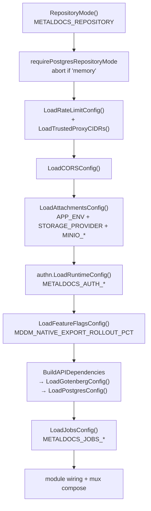
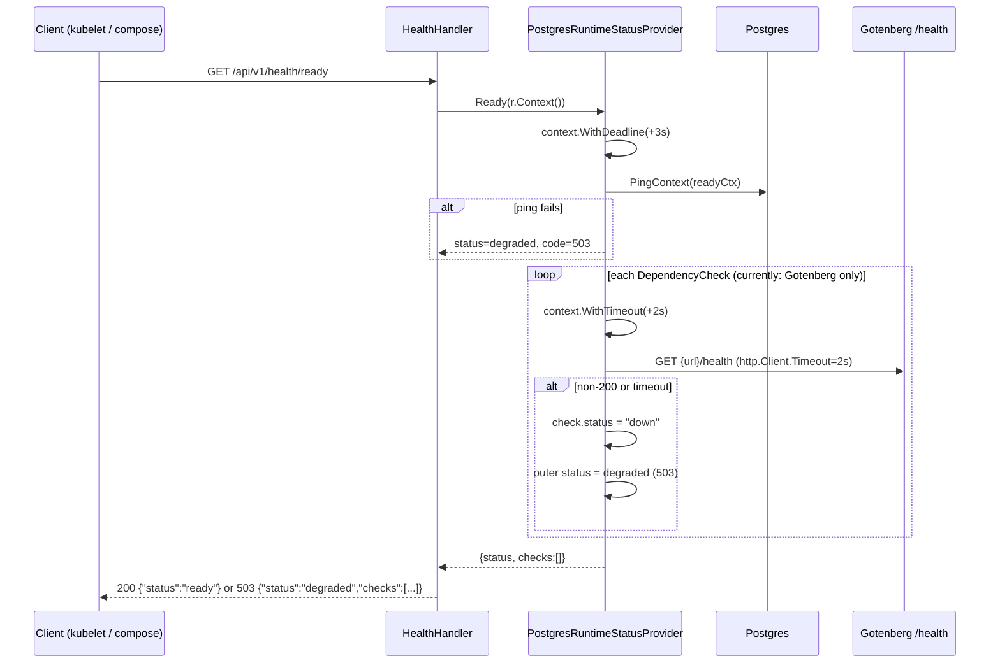
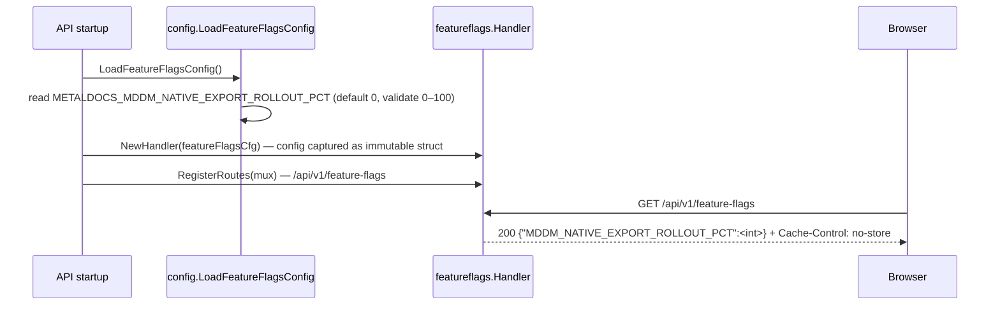

# Platform Ops: Config, Observability, Feature Flags

> **Last verified:** 2026-06-11
> **Scope:** Packages `internal/platform/config`, `internal/platform/observability`, and `internal/platform/featureflags`. Covers the full environment-variable catalog, HTTP access-log and in-process RED metrics middleware, health/readiness probes, and the feature-flag HTTP handler. Observability wiring facts and RF-1/RF-8 lifecycle gaps are documented in full.
> **Key files:**
> - `internal/platform/config/attachments.go` — storage/MinIO config
> - `internal/platform/config/cors.go` — CORS config
> - `internal/platform/config/feature_flags.go` — `FeatureFlagsConfig` + `ErrInvalidPercentage`
> - `internal/platform/config/gotenberg.go` — Gotenberg config
> - `internal/platform/config/jobs.go` — River jobs config
> - `internal/platform/config/postgres.go` — Postgres DSN config
> - `internal/platform/config/ratelimit.go` — rate-limit config
> - `internal/platform/config/repository.go` — repository mode
> - `internal/platform/config/trusted_proxy.go` — trusted-proxy CIDR list
> - `internal/platform/config/worker.go` — worker config
> - `internal/platform/observability/http.go` — HTTP middleware + in-process RED metrics
> - `internal/platform/observability/health.go` — liveness/readiness probe handlers
> - `internal/platform/observability/runtime.go` — `RuntimeStatusProvider` interface + implementations
> - `internal/platform/featureflags/handler.go` — `GET /api/v1/feature-flags` handler

---

## 1. Identity and purpose

These three packages form the startup spine and runtime observability surface of the MetalDocs backend.

`internal/platform/config` is a pure 12-factor config layer: eight standalone `Load*` functions parse environment variables, validate inputs, fail-fast on missing secrets, and return typed structs. It is the primary config abstraction, but it does not have exclusive coverage: several runtime values are read directly via `os.Getenv` at call sites rather than through a typed `Load*` function. Specifically, `internal/platform/bootstrap/worker.go:47-48` reads `METALDOCS_FANOUT_URL` and `METALDOCS_DOCX_RENDERER_SERVICE_TOKEN` directly; `apps/api/cmd/metaldocs-api/main.go` reads `METALDOCS_E2E` (line 136), `METALDOCS_SKIP_STARTUP_MIGRATIONS` and `METALDOCS_MIGRATIONS_DIR` (lines 186-187), `METALDOCS_FANOUT_URL` and `METALDOCS_DOCX_RENDERER_SERVICE_TOKEN` (lines 362-366), `AUDIT_RETENTION_DAYS` (line 575), and `APP_PORT` (line 605) outside the config layer.

`internal/platform/observability` provides the HTTP middleware that wraps the entire request mux, emitting structured JSON access logs and accumulating in-process RED metrics per route. It also owns the health/readiness probe endpoints and the `RuntimeStatusProvider` abstraction, which describes the live state of infrastructure dependencies (Postgres, Gotenberg) to the readiness probe and the `/api/v1/metrics` endpoint.

`internal/platform/featureflags` exposes a single HTTP handler — `GET /api/v1/feature-flags` — that returns server-controlled rollout percentages to the browser client. It holds no state of its own; it reads a `FeatureFlagsConfig` struct loaded at startup by the config layer.

---

## 2. File inventory

### `internal/platform/config` (12 files)

| File | Role |
|---|---|
| `attachments.go` | `LoadAttachmentsConfig()`: storage provider selection (memory/local/MinIO), HMAC signing secret (≥32 bytes required for all providers), download TTL, MinIO credentials, auto-bucket flag. Defines `StorageProvider` and `AppEnv` types; `parseBoolEnv` helper. |
| `cors.go` | `LoadCORSConfig()`: CORS enabled/origins/methods/headers/credentials/max-age. Rejects wildcard origin with credentials. Exports `splitCSV` and `normalizeUpper` helpers. |
| `feature_flags.go` | `LoadFeatureFlagsConfig()`: single rollout percentage key `METALDOCS_MDDM_NATIVE_EXPORT_ROLLOUT_PCT` (0–100). Exports `ErrInvalidPercentage` sentinel. |
| `feature_flags_test.go` | Unit test: out-of-range percentages (-1, 101) return `ErrInvalidPercentage`. |
| `gotenberg.go` | `LoadGotenbergConfig()`: optional absolute `http(s)` URL for Gotenberg. Empty env = disabled. URL validation blocks `ftp` and other schemes. |
| `gotenberg_test.go` | Unit tests: disabled when empty, enabled with valid URL, rejects ftp scheme. |
| `jobs.go` | `LoadJobsConfig()`: River jobs enabled flag, River schema name, temporal queue max-worker count (default 10). Imports `github.com/riverqueue/river` for `river.QueueConfig`. |
| `postgres.go` | `LoadPostgresConfig()`: accepts `DATABASE_URL` (full DSN) or `PGHOST/PGPORT/PGDATABASE/PGUSER/PGPASSWORD/PGSSLMODE` (default sslmode=require). Validates scheme. |
| `ratelimit.go` | `LoadRateLimitConfig()`: window seconds (default 60), max requests (default 120), delegates to `LoadTrustedProxyCIDRs` for IP-source trust. |
| `repository.go` | `RepositoryMode()`: `METALDOCS_REPOSITORY` → `"memory"` or `"postgres"` (default `"memory"`). |
| `trusted_proxy.go` | `LoadTrustedProxyCIDRs()` / `ParseTrustedProxyCIDRs()`: comma-separated CIDR list → `[]netip.Prefix`. Empty = nil (fail-closed: no upstream trusted). |
| `worker.go` | `LoadWorkerConfig()`: poll interval (default 10s), batch size (default 25), review reminder days (default 14), run-once flag, max attempts (default 5), retry base/max seconds (default 10/300). Cross-field validation: `RetryMaxSeconds >= RetryBaseSeconds`. |

### `internal/platform/observability` (5 files including `.gitkeep`)

| File | Role |
|---|---|
| `.gitkeep` | Residual empty-directory scaffold marker; the package now has real files. |
| `http.go` | `HTTPObservability`: HTTP middleware (`Wrap`) + metrics handler (`MetricsHandler`). Emits `slog` JSON access log per request. Maintains per-route `routeMetrics` ring-buffer (200 samples) for p50/p95/p99 percentiles. `normalizeRoute` extracts parameterized route labels for 7 hardcoded path patterns. |
| `health.go` | `HealthHandler`: registers `/api/v1/health/live`, `/api/v1/health/ready`, `/healthz`. Delegates to `RuntimeStatusProvider`; if provider is nil, returns a static "live/ready" response. |
| `runtime.go` | `RuntimeStatusProvider` interface + two concrete implementations: `StaticRuntimeStatusProvider` (memory mode; hardcoded up status) and `PostgresRuntimeStatusProvider` (postgres mode; pings DB; queries `metaldocs.auth_identities`, `metaldocs.auth_sessions`, `metaldocs.outbox_events` for runtime metrics). Pluggable `DependencyCheck` slice runs under a 2-second timeout each. |
| `runtime_test.go` | Unit tests: static provider degrades on dependency failure; postgres provider shares a readiness deadline across checks; runtime metrics omit failed query sections gracefully. |

### `internal/platform/featureflags` (2 files)

| File | Role |
|---|---|
| `handler.go` | `Handler`: `GET /api/v1/feature-flags` returns JSON `{"MDDM_NATIVE_EXPORT_ROLLOUT_PCT": <int>}`. `Cache-Control: no-store`. Returns 405 on non-GET. |
| `handler_test.go` | Unit test: 200 + correct JSON key present. |

---

## 3. Public surface

### `internal/platform/config` — exported symbols

| Symbol | Consumed by |
|---|---|
| `RepositoryMode() (string, error)` | `apps/api/cmd/metaldocs-api/main.go:152` |
| `RepositoryMemory`, `RepositoryPostgres` constants | `bootstrap/api.go`, `apps/api/cmd/metaldocs-api/main.go`, tests |
| `LoadCORSConfig() (CORSConfig, error)` | `apps/api/cmd/metaldocs-api/main.go:163`, `internal/platform/security/cors.go` |
| `LoadRateLimitConfig() (RateLimitConfig, error)` | `apps/api/cmd/metaldocs-api/main.go:159`, `internal/platform/security/ratelimit.go` |
| `LoadAttachmentsConfig() (AttachmentsConfig, error)` | `apps/api/cmd/metaldocs-api/main.go:167`, `bootstrap/api.go`, `storage/minio/store.go` |
| `StorageProvider`, `StorageProviderMemory/Local/MinIO` | `bootstrap/api.go:89` |
| `AppEnv`, `AppEnvLocal/Dev/Staging/Production` | `storage/minio/store.go` (conditional S3 URL logic) |
| `LoadGotenbergConfig() (GotenbergConfig, error)` | `bootstrap/api.go:62` |
| `LoadPostgresConfig() (PostgresConfig, error)` | `bootstrap/api.go:79` |
| `LoadJobsConfig() (JobsConfig, error)` | `apps/api/cmd/metaldocs-api/main.go:434`, `apps/jobs/cmd/metaldocs-jobs/main.go:26` |
| `LoadWorkerConfig() (WorkerConfig, error)` | `apps/worker/cmd/metaldocs-worker/main.go:55`, `bootstrap/worker.go` |
| `LoadTrustedProxyCIDRs()` / `ParseTrustedProxyCIDRs()` | `config/ratelimit.go:42` (indirect), `tests/unit/trusted_proxy_test.go` |
| `LoadFeatureFlagsConfig() (FeatureFlagsConfig, error)` | `apps/api/cmd/metaldocs-api/main.go:175` |
| `ErrInvalidPercentage` | `config/feature_flags_test.go` |

### `internal/platform/observability` — exported symbols

| Symbol | Consumed by |
|---|---|
| `NewHTTPObservability(...RuntimeStatusProvider) *HTTPObservability` | `apps/api/cmd/metaldocs-api/main.go:275` |
| `HTTPObservability.Wrap(next http.Handler) http.Handler` | `apps/api/cmd/metaldocs-api/chain.go` (layer 2 — outermost after panic recovery; Wave 1 F-01) |
| `HTTPObservability.MetricsHandler() http.Handler` | `apps/api/cmd/metaldocs-api/main.go:572` (registered at `/api/v1/metrics`) |
| `NewHealthHandler(RuntimeStatusProvider) *HealthHandler` | via `bootstrap/api.go:118` |
| `HealthHandler.RegisterRoutes(mux)` | via `apps/api/cmd/metaldocs-api/main.go` |
| `RuntimeStatusProvider` interface | `bootstrap/api.go:45` (`APIDependencies.StatusProvider`) |
| `NewStaticRuntimeStatusProvider(...)` | `bootstrap/api.go:152` (memory mode) |
| `NewPostgresRuntimeStatusProvider(db, ...)` | `bootstrap/api.go:118` (postgres mode) |
| `DependencyCheck` struct | `bootstrap/api.go:187` (Gotenberg health-check factory) |
| `DependencyCheckResult` struct | `bootstrap/api.go:188` (returned by check closures) |

### `internal/platform/featureflags` — exported symbols

| Symbol | Consumed by |
|---|---|
| `NewHandler(cfg config.FeatureFlagsConfig) *Handler` | `apps/api/cmd/metaldocs-api/main.go:274` |
| `Handler.RegisterRoutes(mux *http.ServeMux)` | `apps/api/cmd/metaldocs-api/main.go` |

### HTTP routes registered by this area

| Method | Path | Auth | Notes |
|---|---|---|---|
| `GET` | `/api/v1/feature-flags` | None (public) | Returns `FeatureFlagsConfig` as JSON; `Cache-Control: no-store`. |
| `GET` | `/api/v1/health/live` | None (public) | Liveness probe — always 200 when process is up. Alias: `/healthz`. |
| `GET` | `/api/v1/health/ready` | None (public) | Readiness probe — 200 or 503; checks DB ping + registered `DependencyCheck` items. |
| `GET` | `/api/v1/metrics` | `CapMetricsView` (tier-1) | In-process RED metrics + runtime stats from three DB queries. |

---

## 4. Logic flows

### Flow 1: API startup config loading sequence

All `Load*` functions are called sequentially in `apps/api/cmd/metaldocs-api/main.go` before any module wiring. Failure at any step calls `log.Fatalf` — startup aborts immediately.



References: `apps/api/cmd/metaldocs-api/main.go:152-177`, `internal/platform/config/repository.go:14`, `internal/platform/config/ratelimit.go:21`, `internal/platform/config/cors.go:19`, `internal/platform/config/attachments.go:42`, `internal/platform/config/feature_flags.go:22`.

### Flow 2: HTTP request observability path

Every request entering the API mux passes through `HTTPObservability.Wrap` before reaching any handler.

```mermaid
sequenceDiagram
    participant R as Incoming request
    participant OBS as HTTPObservability.Wrap
    participant CTX as requesttrace context
    participant H as Inner handler chain
    participant LOG as slog (stdout JSON)
    participant MTR as routeMetrics ring-buffer

    R->>OBS: request enters
    OBS->>OBS: read X-Trace-Id header
    alt header present and valid (printable ASCII ≤128 chars)
        OBS->>CTX: WithTraceID(existing ID)
    else absent or invalid
        OBS->>CTX: WithTraceID(new UUID)
    end
    OBS->>H: next.ServeHTTP(statusWriter, r)
    H-->>OBS: status code captured in statusWriter
    OBS->>OBS: compute elapsedMs; classify isError = status >= 400
    OBS->>MTR: getMetric(route, method) — double-checked locking; ring-buffer cap 200
    OBS->>MTR: atomic increment requests/errors/durationMs; append sample
    OBS->>OBS: extract userID from auth context (fallback "anonymous")
    OBS->>LOG: slog.Info("http_request", traceID, method, route, status, elapsedMs, userID, ...)
```

**Middleware chain order in production** (outermost → innermost, Wave 1 F-01 — composed via `apps/api/cmd/metaldocs-api/chain.go`):

```
panicRecovery.Wrap(
  httpObs.Wrap(
    cors.Wrap(
      originProtection.Wrap(
        preAuthLoginLimit.Wrap(
          authMiddleware.Wrap(
            iamMiddleware.Wrap(
              presenceBump.Wrap(
                rateLimiter.Wrap(mux)))))))))
```

`httpObs.Wrap` is now **outermost after panic recovery** (layer 2). REQ-MW-4 satisfied (Wave 1, RF-2 CLOSED): 401 responses from authn/iam are counted in RED metrics. Chain order is asserted by `chain_test.go` (REQ-MW-7).

References: `internal/platform/observability/http.go:53-106, 156-176`, `apps/api/cmd/metaldocs-api/chain.go`.

### Flow 3: Readiness probe with Gotenberg dependency check



**Sequential check hazard**: checks run sequentially under individual 2-second sub-deadlines (`observability/runtime.go:286-292`). With N checks, worst-case blocking time is 2N seconds (additive), not capped to 3 seconds. Currently N=1 (Gotenberg only), so this is not a production risk today, but the pattern is misleading — see Legacy flags.

References: `internal/platform/observability/health.go:31`, `internal/platform/observability/runtime.go:113-149, 286-323`, `internal/platform/bootstrap/api.go:197-209`.

### Flow 4: Feature flag request lifecycle



Config is static for the lifetime of the process. There is no hot-reload mechanism. Changing the rollout percentage requires a process restart (RF-8). References: `internal/platform/config/feature_flags.go:22-36`, `internal/platform/featureflags/handler.go:18-40`.

### Flow 5: `/api/v1/metrics` runtime metrics queries

On each `GET /api/v1/metrics` request (gated by `CapMetricsView`), `PostgresRuntimeStatusProvider.RuntimeMetrics` executes three sequential DB queries under individual 3-second timeouts (`observability/runtime.go:183-212`):

| Query | Table | Data collected |
|---|---|---|
| 1 | `metaldocs.auth_identities` | COUNT by active/inactive/locked state |
| 2 | `metaldocs.auth_sessions` | COUNT by active/expired/revoked state |
| 3 | `metaldocs.outbox_events` | COUNT by claimable/pending/dead-lettered state |

These queries run inline on the request goroutine — no background pre-computation. Failed individual queries are omitted from the response JSON rather than returning an error.

---

## 5. Dependencies

### Outbound imports

**`internal/platform/config`**

| Import | Reason |
|---|---|
| `os`, `strconv`, `strings`, `fmt`, `net/url`, `net/netip` | Env-var parsing, CIDR/URL validation |
| `github.com/riverqueue/river` (`river.QueueConfig`) | `config/jobs.go:9` — `JobsConfig.Queues` map uses River's config struct |

**`internal/platform/observability`**

| Import | Reason |
|---|---|
| `log/slog`, `os` | Structured JSON access logging to stdout |
| `sync`, `sync/atomic` | Concurrent metric counter updates and ring-buffer locking |
| `database/sql` | `PostgresRuntimeStatusProvider` holds `*sql.DB` for ping and metric queries |
| `metaldocs/internal/modules/auth/domain` | `authdomain.CurrentUserFromContext` to extract `user_id` for access logs (`http.go:90`) — layering violation; see Legacy flags |
| `metaldocs/internal/platform/requesttrace` | Trace ID propagation in context |

**`internal/platform/featureflags`**

| Import | Reason |
|---|---|
| `encoding/json`, `net/http` | JSON response encoding |
| `metaldocs/internal/platform/config` | Reads `FeatureFlagsConfig` struct |

### Inbound consumers (grep-verified)

**`internal/platform/config`** is imported by 23 files including:
- `apps/api/cmd/metaldocs-api/main.go` — primary consumer of all eight `Load*` functions
- `apps/worker/cmd/metaldocs-worker/main.go` — `LoadWorkerConfig`
- `apps/jobs/cmd/metaldocs-jobs/main.go` — `LoadJobsConfig`
- `internal/platform/bootstrap/api.go`, `bootstrap/worker.go`, `bootstrap/jobs.go` — dependency assembly
- `internal/platform/security/ratelimit.go`, `security/cors.go`
- `internal/platform/authn/config.go` (partial: `RepositoryMemory`, `AttachmentsConfig`)
- `internal/platform/storage/minio/store.go` — `AttachmentsConfig`, `AppEnv`
- `internal/platform/featureflags/handler.go`
- `apps/api/cmd/metaldocs-e2e-seed/main.go`
- Various files under `tests/unit/`

**`internal/platform/observability`** is imported by 2 files:
- `apps/api/cmd/metaldocs-api/main.go`
- `internal/platform/bootstrap/api.go`

**`internal/platform/featureflags`** is imported by 2 files:
- `apps/api/cmd/metaldocs-api/main.go`
- `internal/platform/featureflags/handler_test.go`

---

## 6. Persistence

**`internal/platform/config`** — stateless. Pure env-var parsing; no DB, no file I/O.

**`internal/platform/featureflags`** — stateless. Config loaded at startup; no writes.

**`internal/platform/observability`** — in-process state only. The `byKey` metric map and ring buffers are never persisted; they reset on restart.

`PostgresRuntimeStatusProvider.RuntimeMetrics` queries three tables on every `/api/v1/metrics` GET (see Flow 5 above). `PostgresRuntimeStatusProvider.Ready` runs `db.PingContext` on every `/api/v1/health/ready` GET. No migrations are owned by this area.

---

## 7. Full environment-variable catalog

### `internal/platform/config`

| Variable | Default | Required | Validation | Consumer |
|---|---|---|---|---|
| `METALDOCS_REPOSITORY` | `"memory"` | No | `"memory"` or `"postgres"` | `RepositoryMode()` |
| `METALDOCS_CORS_ENABLED` | `false` | No | `"true"` / other | `LoadCORSConfig()` |
| `METALDOCS_CORS_ALLOWED_ORIGINS` | (empty) | No | CSV | `LoadCORSConfig()` |
| `METALDOCS_CORS_ALLOWED_METHODS` | `GET,POST,PUT,OPTIONS` | No | CSV, uppercased | `LoadCORSConfig()` |
| `METALDOCS_CORS_ALLOWED_HEADERS` | `Content-Type,X-Trace-Id` | No | CSV | `LoadCORSConfig()` |
| `METALDOCS_CORS_EXPOSED_HEADERS` | (empty) | No | CSV | `LoadCORSConfig()` |
| `METALDOCS_CORS_ALLOW_CREDENTIALS` | `false` | No | rejects `*` origin when true | `LoadCORSConfig()` |
| `METALDOCS_CORS_MAX_AGE_SECONDS` | `300` | No | integer ≥ 0 | `LoadCORSConfig()` |
| `METALDOCS_RATE_LIMIT_ENABLED` | `false` | No | `"true"` / other | `LoadRateLimitConfig()` |
| `METALDOCS_RATE_LIMIT_WINDOW_SECONDS` | `60` | No | integer > 0 | `LoadRateLimitConfig()` |
| `METALDOCS_RATE_LIMIT_MAX_REQUESTS` | `120` | No | integer > 0 | `LoadRateLimitConfig()` |
| `METALDOCS_TRUSTED_PROXY_CIDRS` | (empty → fail-closed) | No | comma-separated CIDR list; invalid entry = error | `LoadTrustedProxyCIDRs()` |
| `APP_ENV` | `"local"` | No | any string; guards auth-disabled and MinIO URL logic | `LoadAttachmentsConfig()`, `authn.LoadRuntimeConfig()` |
| `METALDOCS_STORAGE_PROVIDER` | `"local"` | No | `"memory"`, `"local"`, `"minio"` | `LoadAttachmentsConfig()` |
| `METALDOCS_ATTACHMENTS_ROOT` | `"non_git/attachments"` | No | string | `LoadAttachmentsConfig()` |
| `METALDOCS_ATTACHMENTS_SIGNING_SECRET` | — | **Yes (all providers)** | ≥ 32 bytes | `LoadAttachmentsConfig()` |
| `METALDOCS_ATTACHMENTS_DOWNLOAD_TTL_SECONDS` | `300` | No | integer ≥ 30 | `LoadAttachmentsConfig()` |
| `METALDOCS_MINIO_ENDPOINT` | — | Yes (MinIO only) | non-empty | `LoadAttachmentsConfig()` |
| `METALDOCS_MINIO_PUBLIC_ENDPOINT` | = `METALDOCS_MINIO_ENDPOINT` | No | non-empty | `LoadAttachmentsConfig()` |
| `METALDOCS_MINIO_ACCESS_KEY` | — | Yes (MinIO only) | non-empty | `LoadAttachmentsConfig()` |
| `METALDOCS_MINIO_SECRET_KEY` | — | Yes (MinIO only) | non-empty | `LoadAttachmentsConfig()` |
| `METALDOCS_MINIO_BUCKET` | — | Yes (MinIO only) | non-empty | `LoadAttachmentsConfig()` |
| `METALDOCS_MINIO_USE_SSL` | `false` | No | `"true"` / `"1"` / other | `LoadAttachmentsConfig()` |
| `METALDOCS_MINIO_AUTO_CREATE_BUCKET` | `false` | No | `"true"` / `"1"` / other | `LoadAttachmentsConfig()` |
| `METALDOCS_GOTENBERG_URL` | (empty → disabled) | No | absolute `http(s)` URL | `LoadGotenbergConfig()` |
| `DATABASE_URL` | — | Yes (postgres; or PG* set) | postgres/postgresql scheme | `LoadPostgresConfig()` |
| `PGHOST` | — | Yes (if `DATABASE_URL` absent) | non-empty | `LoadPostgresConfig()` |
| `PGPORT` | `5432` | No | any | `LoadPostgresConfig()` |
| `PGDATABASE` | — | Yes (if `DATABASE_URL` absent) | non-empty | `LoadPostgresConfig()` |
| `PGUSER` | — | Yes (if `DATABASE_URL` absent) | non-empty | `LoadPostgresConfig()` |
| `PGPASSWORD` | — | Yes (if `DATABASE_URL` absent) | non-empty | `LoadPostgresConfig()` |
| `PGSSLMODE` | `"require"` | No | any string | `LoadPostgresConfig()` |
| `METALDOCS_JOBS_ENABLED` | `true` | No | `"true"` / `"1"` / other | `LoadJobsConfig()` |
| `METALDOCS_JOBS_RIVER_SCHEMA` | `""` | No | string | `LoadJobsConfig()` |
| `METALDOCS_JOBS_TEMPORAL_MAX_WORKERS` | `10` | No | integer ≥ 1 | `LoadJobsConfig()` |
| `METALDOCS_WORKER_POLL_INTERVAL_SECONDS` | `10` | No | integer ≥ 1 | `LoadWorkerConfig()` |
| `METALDOCS_WORKER_BATCH_SIZE` | `25` | No | integer ≥ 1 | `LoadWorkerConfig()` |
| `METALDOCS_WORKER_REVIEW_REMINDER_DAYS` | `14` | No | integer ≥ 1 | `LoadWorkerConfig()` |
| `METALDOCS_WORKER_RUN_ONCE` | `false` | No | `"true"` / `"1"` / other | `LoadWorkerConfig()` |
| `METALDOCS_WORKER_MAX_ATTEMPTS` | `5` | No | integer ≥ 1 | `LoadWorkerConfig()` |
| `METALDOCS_WORKER_RETRY_BASE_SECONDS` | `10` | No | integer ≥ 1 | `LoadWorkerConfig()` |
| `METALDOCS_WORKER_RETRY_MAX_SECONDS` | `300` | No | integer ≥ `RetryBaseSeconds` | `LoadWorkerConfig()` |
| `METALDOCS_MDDM_NATIVE_EXPORT_ROLLOUT_PCT` | `0` | No | integer 0–100 | `LoadFeatureFlagsConfig()` |

`METALDOCS_AUTH_*`, `METALDOCS_AUTHZ_CACHE_TTL_SECONDS`, and `METALDOCS_BOOTSTRAP_ADMIN_*` are parsed by `internal/platform/authn/config.go`, not by `internal/platform/config`. They are adjacent to this area but out of scope here.

### Out-of-layer env vars (direct `os.Getenv` calls, not covered by `internal/platform/config`)

These variables are read directly via `os.Getenv` at their respective call sites and are not managed by any `Load*` function in `internal/platform/config`. This is a documented coverage gap; see Legacy flags.

| Variable | Default | Required | Validation | Call site |
|---|---|---|---|---|
| `METALDOCS_E2E` | (absent → disabled) | No | `"1"` enables e2e seed/reset handlers; any other value or absence disables | `apps/api/cmd/metaldocs-api/main.go:136` |
| `METALDOCS_SKIP_STARTUP_MIGRATIONS` | `"false"` | No | case-insensitive `"true"` skips migration apply on startup | `apps/api/cmd/metaldocs-api/main.go:186` |
| `METALDOCS_MIGRATIONS_DIR` | `"db/migrations"` | No | string path; empty → default used | `apps/api/cmd/metaldocs-api/main.go:187` |
| `METALDOCS_FANOUT_URL` | (empty → fanout disabled) | No (but fatal if set without token) | non-empty string; empty disables fanout client | `apps/api/cmd/metaldocs-api/main.go:362`, `internal/platform/bootstrap/worker.go:47` |
| `METALDOCS_DOCX_RENDERER_SERVICE_TOKEN` | (empty) | Yes when `METALDOCS_FANOUT_URL` is set | non-empty string; fatal if `METALDOCS_FANOUT_URL` is set and this is empty | `apps/api/cmd/metaldocs-api/main.go:366`, `internal/platform/bootstrap/worker.go:48` |
| `AUDIT_RETENTION_DAYS` | `0` (disabled) | No | integer > 0 enables daily purge goroutine; `0` or unparseable = disabled | `apps/api/cmd/metaldocs-api/main.go:575` |
| `APP_PORT` | `8080` | No | integer 1–65535; fatal on invalid value; absent → default `:8080` | `apps/api/cmd/metaldocs-api/main.go:605` |

---

## 8. Concurrency and async behavior

**`internal/platform/config`** — no goroutines; pure synchronous env parsing.

**`internal/platform/featureflags`** — no goroutines; config is read-only after `NewHandler`.

**`internal/platform/observability`**:

- `HTTPObservability.byKey` map is guarded by `sync.RWMutex`. Hot path takes `RLock`; first-encounter route creation uses double-checked locking under `Lock` (`http.go:156-176`).
- Per-route counters (`requests`, `errors`, `durationMs`) are updated via `sync/atomic` (`http.go:82-86`).
- The 200-sample ring buffer inside each `routeMetrics` is protected by its own `sync.Mutex`, separate from the map lock (`http.go:266-275`).
- No goroutines are spawned; all observability work is done inline on the request goroutine.
- `PostgresRuntimeStatusProvider.Ready` and `RuntimeMetrics` use `context.WithTimeout` (3-second outer deadline; 3-second per sub-query). Execution is sequential — no goroutines.
- `applyDependencyChecks` creates a new `context.WithTimeout(ctx, 2s)` per dependency check; checks run **sequentially**, so total blocking is additive (up to 2N seconds). See Legacy flags.

---

## 9. Error handling and observability

### OTel wiring facts (RF-1)

There is **no OpenTelemetry anywhere in the MetalDocs platform or binary code**. This is confirmed by the absence of `go.opentelemetry.io/*` in `go.mod` and no OTel imports in any file under `internal/platform/` or `apps/`.

| Concern | Actual state | Target (RF-1 / REQ-OBS-3) |
|---|---|---|
| Distributed tracing | Custom `X-Trace-Id` string propagated via context and outbox `trace_id` column; no span creation | W3C `traceparent`; OTel span creation and export |
| Trace export | None | OTLP exporter to tracing backend |
| Metrics exposition | In-process JSON counters at `/api/v1/metrics` (gated by `CapMetricsView`); no Prometheus endpoint | Prometheus and/or OTLP exporter |
| Log format | `slog.JSONHandler(os.Stdout)` — structured JSON to stdout | Compatible with current approach; exporter wiring missing |
| Cross-service trace propagation | `X-Trace-Id` header + outbox `trace_id` column; manual correlation only; not W3C-compatible | W3C `traceparent` edge → api → outbox → worker → docx-renderer |

The `wiki/architecture/backend-blueprint.md` line 207–208 mentions "tracing" as a capability of `platform/observability`. This is misleading: the package provides request-ID correlation, not distributed tracing. The word "tracing" should not be interpreted as OTel-compatible trace instrumentation.

### Error handling per package

**`internal/platform/config`** — all errors returned as descriptive `fmt.Errorf` strings from `Load*` functions. No logging; callers `log.Fatalf` on error (`apps/api/cmd/metaldocs-api/main.go:153-177`).

**`internal/platform/featureflags`** — `json.NewEncoder(w).Encode(...)` error is silently discarded with `_ = ...` (`featureflags/handler.go:38`). Write failures are invisible.

**`internal/platform/observability`**:
- Access log: `slog.Info("http_request", ...)` to stdout on every request.
- Health JSON write errors in `writeJSON` in `health.go:40` are discarded (`observability/health.go:43`).
- `truncateReadinessError` caps error strings at 160 characters (`observability/runtime.go:264-270`).
- RFC 9457 is not used by this area; health/readiness/metrics responses use ad hoc JSON shapes.

---

## 10. Legacy and open flags

| Flag | Location | RF / REQ |
|---|---|---|
| **No OpenTelemetry anywhere in the platform** | Zero OTel imports in `internal/platform/` or `apps/`; custom `X-Trace-Id`, in-process JSON counters, `slog` to stdout | RF-1, REQ-OBS-3 |
| ~~**`httpObs.Wrap` sits inside authN**~~ | CLOSED Wave 1 (F-01, RF-2): `httpObs` moved to layer 2, outside authn/iam. Chain reordered in `chain.go`; REQ-MW-4 satisfied. | RF-2 CLOSED |
| **`observability` imports `auth/domain`** | `internal/platform/observability/http.go:15` — platform package importing a module domain to call `authdomain.CurrentUserFromContext`; solvable via context-key interface | REQ-TOP-2 |
| **`parseBoolEnv` duplicated** | `internal/platform/config/attachments.go:108` and `internal/platform/authn/config.go:213` — identical function in two packages; `splitCSV` duplicated similarly (`cors.go:63` vs `authn/config.go:222`) | — |
| **`normalizeRoute` hardcodes partial route set** | `internal/platform/observability/http.go:178-208` — 6 `if` branches covering 4 route families (`/documents`, `/document-profiles`, `/workflow/documents`, `/iam/users`); the `/documents` branch contains a nested sub-condition for the `/versions` sub-path, yielding 7 distinct normalized output patterns total. All other parameterized routes (templates, taxonomy, approval, etc.) log raw IDs, inflating metric cardinality and leaking IDs into structured logs | — |
| **Feature-flag wire-format key is a string literal** | `internal/platform/featureflags/handler.go:29` — JSON key `"MDDM_NATIVE_EXPORT_ROLLOUT_PCT"` is a string literal with no compile-time tie to the env-var name; rename not caught by compiler | RF-8 |
| **`RepositoryMemory` mode is a dead production path** | `config/repository.go:9-24` — `RepositoryMemory` constant and its handling in `bootstrap/api.go:127-153` are kept alive only by tests; `requirePostgresRepositoryMode` (`main.go:677-680`) fatal-exits if mode is not `"postgres"` in production | REQ-TOP-3 adjacent |
| **Dependency checks in `applyDependencyChecks` are sequential** | `observability/runtime.go:286-323` — total worst-case blocking on `/api/v1/health/ready` is 2N seconds + DB ping, not 3 seconds total; misleading concurrency contract | — |
| **Seven env vars bypass the config layer** | `apps/api/cmd/metaldocs-api/main.go:136,186-187,362-366,575,605` and `internal/platform/bootstrap/worker.go:47-48` — `METALDOCS_E2E`, `METALDOCS_SKIP_STARTUP_MIGRATIONS`, `METALDOCS_MIGRATIONS_DIR`, `METALDOCS_FANOUT_URL`, `METALDOCS_DOCX_RENDERER_SERVICE_TOKEN`, `AUDIT_RETENTION_DAYS`, and `APP_PORT` are read directly via `os.Getenv` rather than via a typed `Load*` function; they are absent from the `internal/platform/config` catalog, invisible to any central validation sweep, and not fail-fast on startup | — |
| **`METALDOCS_ATTACHMENTS_SIGNING_SECRET` required for all storage providers** | `config/attachments.go:63-68` — required even for `StorageProviderMemory` which never uses HMAC-signed URLs; security-conservative but operationally inconvenient; no comment explains the invariant | — |
| **`.gitkeep` in `internal/platform/observability/`** | Residual scaffold; package has real files | REQ-TOP-3 adjacent |

For the registry of all open flags, see [../legacy-register.md](../legacy-register.md).

---

## 11. Open questions

- **[runtime-unverified]** Does `PostgresRuntimeStatusProvider.RuntimeMetrics` (`observability/runtime.go:183-212`) execute its three queries against the correct schema on a live Postgres instance? The query SQL uses `metaldocs.`-prefixed table names; correctness depends on the pool's `search_path` or explicit schema qualification established elsewhere (`platform/db/postgres/connect.go`). Verification requires a live instance (Docker currently down).
- **[runtime-unverified]** Whether the CIDR list from `LoadTrustedProxyCIDRs()` flows correctly through to the rate-limiter's IP extraction logic in `internal/platform/ratelimit/middleware.go`. Not verified in this audit.
- **[design question]** The feature-flag config is frozen at startup with no hot-reload. Changing `METALDOCS_MDDM_NATIVE_EXPORT_ROLLOUT_PCT` requires a process restart; `Cache-Control: no-store` prevents browser caching, but the server-side value does not update without restart. Whether restart-based rollout lifecycle is acceptable for production flag management is undocumented (RF-8).
- **[design question]** `WorkerConfig.ReviewReminderDays` is loaded by the worker binary but the binary passes the full `WorkerConfig` to `bootstrap.BuildWorkerDependencies`. Whether the 14-day default reaches the review-reminder logic downstream has not been verified in this audit.

---

## Sources

Stage-1 artifact: `wiki/backend/_artifacts/stage1/platform-ops-config.md`

This document is part of the Stage-1 truth map. For strategic grading and maturity context see [../../architecture/backend-blueprint.md](../../architecture/backend-blueprint.md). For normative requirements and refactoring items cited above see [../../architecture/backend-target-architecture.md](../../architecture/backend-target-architecture.md).
