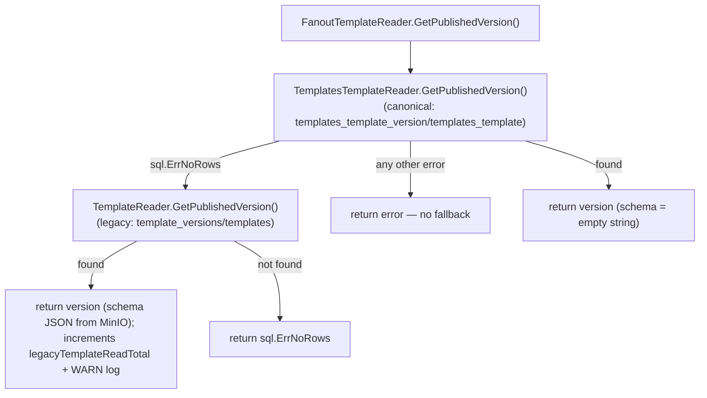

# Platform Rendering — render & docgenv2 Packages

> **Last verified:** 2026-07-01 (ARC-01: `FanoutTemplateReader` flipped from legacy-first to canonical-first — `TemplatesTemplateReader` (`templates_template_version`) is now primary, legacy `TemplateReader` (`template_versions`) is fallback-only on `sql.ErrNoRows`; residual legacy hits are counted via `docgenv2.LegacyTemplateReadCount()` and logged at WARN — pending DB-01 to remove the legacy reader/tables once the counter proves zero across a run window. The former "no interface boundary for unit testing" TODO is resolved: `FanoutTemplateReader` now has dedicated sqlmock-based unit tests in `fanout_template_reader_test.go`.)
> **Prior:** 2026-06-11
> **Scope:** `internal/platform/render/gotenberg/`, `internal/platform/docgenv2/` — the two platform packages that bridge domain-module rendering needs to external infrastructure (Gotenberg, MinIO, and the two template schemas). This page covers only the platform layer; the end-to-end flow lives in [../flows/render-pipeline.md](../flows/render-pipeline.md) and the TypeScript sidecar is documented in [../binaries/docx-renderer.md](../binaries/docx-renderer.md).
> **Key files:**
> - `internal/platform/render/gotenberg/client.go`
> - `internal/platform/docgenv2/template_reader.go`
> - `internal/platform/docgenv2/templates_reader.go`
> - `internal/platform/docgenv2/templates_snapshot_reader.go`

---

## 1. Purpose

These two packages are platform-layer adapters (infrastructure side, in hexagonal terms): they implement interfaces defined by the `documents` and `templates` modules but own no business logic themselves. They exist so that the Gotenberg HTTP API and the two competing template database schemas remain isolated outside the domain modules.

---

## 2. `internal/platform/render/gotenberg/`

### Role

Wraps the [Gotenberg](https://gotenberg.dev/) document-conversion service. Gotenberg is an HTTP microservice that exposes LibreOffice and Chromium conversion routes. The `Client` in this package is the only place in the Go codebase that forms multipart requests to Gotenberg.

### File inventory

| File | Role |
|---|---|
| `client.go` | `Client` struct — `ConvertHTMLToPDF` (Chromium route), `ConvertDocxToPDF`, `ConvertDocxToPDFWithOptions` (LibreOffice route); 30 s timeout; 64 MiB response body cap; A4/Letter paper-size override support |
| `client_test.go` | Unit tests |

### Public surface

```
type Client struct { ... }
func NewClient(baseURL string) (*Client, error)
func (c *Client) ConvertHTMLToPDF(ctx context.Context, htmlBytes []byte, cssBytes []byte) ([]byte, error)
func (c *Client) ConvertDocxToPDF(ctx context.Context, docxContent []byte) ([]byte, error)
func (c *Client) ConvertDocxToPDFWithOptions(ctx context.Context, docxContent []byte, paperSize string, landscape bool) ([]byte, error)
```

- Constructed in `internal/platform/bootstrap/worker.go:83` and `internal/platform/bootstrap/api.go:68`.
- Consumed by `platform/servicebus.GotenbergPDFClient.ConvertPDF` (`servicebus/gotenberg_pdf.go:70`) which wraps it with MinIO open/write and SHA-256 hashing.
- `ConvertDocxToPDF` posts to Gotenberg's `/forms/libreoffice/convert` route as a multipart form.
- Error responses are capped at 4 KiB; non-200 responses are returned as a typed error containing status and body.

### Configuration

| Go env var | Parsed at | Default | Effect |
|---|---|---|---|
| `METALDOCS_GOTENBERG_URL` | `config/gotenberg.go:18` | `""` | Empty → Gotenberg disabled, PDF conversion path inactive. Non-empty → `Client` constructed and wired. |
| `METALDOCS_ATTACHMENTS_PROVIDER` | `config.LoadAttachmentsConfig()` | — | Must be `minio` for the Gotenberg path to activate (`bootstrap/worker.go:76`). |

---

## 3. `internal/platform/docgenv2/`

### Role

Provides template and snapshot readers for use by the `documents` application layer. The package exists because the codebase is mid-migration between two template schemas: the legacy `template_versions`/`templates` tables and the new `templates_template_version`/`templates_template` tables. Both readers are held here so the documents module is insulated from the schema duality.

### Naming note — docgen v1 vs v2

There is no "docgen v1" remnant in the codebase. The package name `docgenv2` is a historical artifact from the naming era when the service was called `docgen v2`. The service it references is now called `docx-renderer`. The event type constant `EventTypePDFConvert = "docgen_v2_pdf"` carries the v2 name string on the wire (`internal/platform/messaging`). The package name itself is flagged as misleading in the legacy register (see §6 below).

### File inventory

| File | Role |
|---|---|
| `template_reader.go` | `TemplateReader` — reads DOCX key and schema JSON from legacy `template_versions`/`templates` tables; fetches schema JSON from MinIO (1 MiB cap); uses `systemTemplateTenantID = "ffffffff-ffff-ffff-ffff-ffffffffffff"` for system-owned templates |
| `templates_reader.go` | `TemplatesTemplateReader` — reads published DOCX key from new `templates_template_version`/`templates_template` tables; schema always returns `""`; `FanoutTemplateReader` chains primary (`TemplatesTemplateReader`, canonical) → secondary (`TemplateReader`, legacy) with `sql.ErrNoRows` fallback (ARC-01, 2026-07-01) |
| `templates_snapshot_reader.go` | `TemplatesSnapshotReader` — implements `documents/application.SnapshotTemplateReader`; loads `placeholder_schema` JSON and DOCX key from `templates_template_version`; `CompositionJSON` hardcoded to `{}` [runtime-unverified: whether this is intentional or a missing feature] |
| `template_reader_test.go` | Unit tests for `TemplateReader` |
| `templates_snapshot_reader_test.go` | Unit tests for `TemplatesSnapshotReader` |
| `fanout_template_reader_test.go` | Unit tests for `FanoutTemplateReader` — canonical-hit, canonical-notfound→legacy-fallback (asserts `LegacyTemplateReadCount` increments), canonical-error (asserts no fallback attempted), both-notfound |

### Public surface

```
type TemplateReader struct { ... }
func NewTemplateReader(db *sql.DB, client *minio.Client, bucket string) *TemplateReader

type TemplatesTemplateReader struct { ... }
func NewTemplatesTemplateReader(db *sql.DB) *TemplatesTemplateReader

type FanoutTemplateReader struct { ... }
func NewFanoutTemplateReader(primary *TemplatesTemplateReader, secondary *TemplateReader) *FanoutTemplateReader

type TemplatesSnapshotReader struct { ... }
func NewTemplatesSnapshotReader(db *sql.DB) *TemplatesSnapshotReader
```

Wired in `apps/api/cmd/metaldocs-api/main.go`:
- `TemplateReader` (legacy) and `TemplatesTemplateReader` (canonical) constructed inline at the `docDeps.TplRead` call site (~`main.go:434-437`).
- `FanoutTemplateReader` assigned as `docDeps.TplRead`, canonical reader passed as `primary`, legacy reader as `secondary`.
- `TemplatesSnapshotReader` assigned as `docSnapshotReader` a few lines above the `docDeps` construction.

### Template reader fallback flow (ARC-01, 2026-07-01: canonical-first)



- Canonical reads first: `TemplatesTemplateReader` is now `primary`; the legacy `TemplateReader` is `secondary`, invoked ONLY when the canonical lookup returns `sql.ErrNoRows`. Any other canonical-side error (a real DB failure) surfaces immediately with no fallback attempt, so a live DB outage can never be silently masked as "check the legacy table."
- Schema JSON is only available through the legacy path (fetched from MinIO). The canonical `TemplatesTemplateReader` always returns `""` for schema.
- **Observability:** every legacy-fallback hit increments a process-wide atomic counter (`docgenv2.LegacyTemplateReadCount()`) and emits a `slog.Warn` structured log line (`tenant_id`, `template_version_id`, running counter value). No Prometheus/metrics-exporter plumbing reaches this reader today (the platform's lightweight-metrics idiom — see `internal/platform/observability/http.go` `routeMetrics` — is scoped to HTTP routes), so the counter is not yet wired into `/api/v1/metrics`; it exists for tests and as the future wiring point. This is the run-window proof gating DB-01 (drop the legacy reader + tables once the counter stays at zero).
- `TemplatesSnapshotReader` maps `sql.ErrNoRows` to `domain.ErrSnapshotTemplateNotFound` (`templates_snapshot_reader.go:40`).

### Persistence — tables accessed

| Table | Schema | Access type | Reader |
|---|---|---|---|
| `template_versions` | legacy | read | `TemplateReader` |
| `templates` | legacy | read | `TemplateReader` |
| `templates_template_version` | new | read | `TemplatesTemplateReader`, `TemplatesSnapshotReader` |
| `templates_template` | new | read | `TemplatesTemplateReader`, `TemplatesSnapshotReader` |

MinIO: schema JSON object fetched by `TemplateReader.GetPublishedVersion` (`template_reader.go:47`); capped at 1 MiB.

---

## 4. Imports

### Outbound

**`internal/platform/render/gotenberg`**
- `net/http`, `mime/multipart` — multipart HTTP to Gotenberg
- No internal MetalDocs imports

**`internal/platform/docgenv2`**
- `github.com/minio/minio-go/v7` — schema file read from MinIO
- `database/sql` — template and snapshot queries
- `metaldocs/internal/modules/documents/application` — `SnapshotTemplateReader` interface
- `metaldocs/internal/modules/documents/domain` — `TemplateSnapshot`, `ErrSnapshotTemplateNotFound`

### Inbound (who imports these packages)

| Importer | Package imported |
|---|---|
| `internal/platform/bootstrap/worker.go` | `platform/render/gotenberg` |
| `internal/platform/bootstrap/api.go` | `platform/render/gotenberg` |
| `internal/platform/worker/pdf_pipeline_test.go` | `platform/render/gotenberg` (test) |
| `apps/api/cmd/metaldocs-api/main.go` | `platform/docgenv2` (via bootstrap) |

---

## 5. Relation to blueprint and target architecture

These packages are domain-free platform adapters (REQ-TOP-2 in [../../architecture/backend-target-architecture.md](../../architecture/backend-target-architecture.md)) and correctly carry no business logic. The import of `documents/application` and `documents/domain` interfaces in `docgenv2` is the correct direction (platform implements a domain-defined port). The reverse (a platform package importing a module and knowing its internal state) would be a layering violation.

**Resolved (2026-07-01, ARC-01):** `FanoutTemplateReader` previously had no interface boundary for unit testing — the two concrete types were directly embedded, and the prior TODO noted the struct was untestable without real DB/S3 deps. It is now covered by `fanout_template_reader_test.go` using sqlmock against both concrete readers (same idiom as `template_reader_test.go`), so the fallback-order semantics are exercised without a live DB. The struct itself is still two concrete types (no formal interface extraction) — that remains a minor design-debt item, but it no longer blocks testing.

---

## 6. Legacy and open flags

| Flag | Location | Description | RF ref |
|---|---|---|---|
| Package name `docgenv2` is misleading | `internal/platform/docgenv2/` | Name reflects the "docgen v2" era; the service it references is now `docx-renderer`; `FanoutTemplateReader` is about template reading, not fanout dispatch | — |
| Magic sentinel UUID for system templates | `template_reader.go:13` | `systemTemplateTenantID = "ffffffff-ffff-ffff-ffff-ffffffffffff"` baked as a package constant; no named domain concept | — |
| `FanoutTemplateReader` has no interface boundary | `templates_reader.go` (struct fields) | Concrete types directly embedded (no port interface); RESOLVED for testability 2026-07-01 via sqlmock unit tests, formal interface extraction still open | — |
| Schema always `""` in new template path | `templates_snapshot_reader.go:48` | `CompositionJSON` hardcoded to `{}` [runtime-unverified: whether composition config is intentionally absent for the templates module] | — |
| Dual-schema fallback is temporary | `templates_reader.go` (`FanoutTemplateReader.GetPublishedVersion`) | `FanoutTemplateReader` exists to bridge the migration; flipped canonical-first 2026-07-01 (ARC-01) with a residual-legacy-hit counter (`LegacyTemplateReadCount`) + WARN log gating removal; once the counter proves zero across a run window, DB-01 deletes `TemplateReader`, the fallback chain, and the legacy `template_versions`/`templates` tables | DB-01 |

See also [../_artifacts/stage1/synthesis-legacy.md](../_artifacts/stage1/synthesis-legacy.md) for the full cross-cutting legacy register.

---

## Sources

Stage-1 artifact: `wiki/backend/_artifacts/stage1/render-pipeline.md` (§2 file inventories, §4 logic flows, §5 dependencies, §6 persistence, §7 config, §10 legacy flags).
Strategic framing: [../../architecture/backend-blueprint.md](../../architecture/backend-blueprint.md) concern C6 (async) and D6 (internal HTTP clients).
