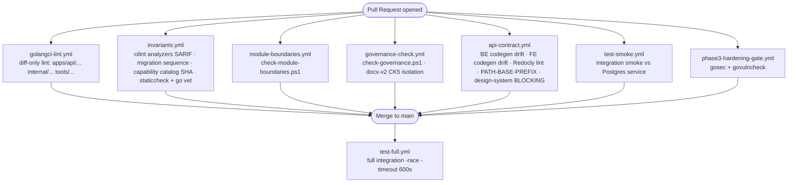

# Repository Topology

> **Last verified:** 2026-06-11 (Wave 1)
> **Scope:** Top-level directory layout, all binaries built and run, Go module configuration, CI pipeline shape, script entry points, and orphan/legacy classification for every top-level directory. Does not descend into `frontend/`, `node_modules/`, `vendor/`, `.worktrees/`, `.clone/`, or `non_git/` beyond identification.
> **Key files:**
> - `apps/api/cmd/metaldocs-api/main.go` — composition root (binary 1)
> - `apps/worker/cmd/metaldocs-worker/main.go` — outbox-poll worker binary
> - `apps/jobs/cmd/metaldocs-jobs/main.go` — River-based scheduled jobs binary
> - `apps/docx-renderer/` — Node.js (Fastify) DOCX/PDF rendering service
> - `scripts/start-api.ps1` — canonical local dev startup (CLAUDE.md §1 policy)
> - `go.mod` — single Go module (`module metaldocs`, Go 1.25)
> - `deploy/compose/docker-compose.yml` — full local stack definition
> - `.github/workflows/` — 15 CI gate workflows

---

## 1. Identity and purpose

MetalDocs is a **Go modular-monolith** with a companion Node.js micro-service. The repository is a single Go module (`module metaldocs`, `go.mod:1`) containing all backend source; there is no `go.work` workspace. The Go module produces **three primary binaries** plus one E2E tooling binary from paths under `apps/`, and one legacy seed tool under `cmd/`. A fifth runtime — `apps/docx-renderer` — is a Node.js (Fastify) service built and containerized separately from the Go build.

The repository is a **mixed-language monorepo**: Go owns all backend logic, TypeScript owns the docx-renderer service and all frontend packages, and SQL owns all schema migrations. Infrastructure is defined in `deploy/compose/docker-compose.yml` and driven in development by PowerShell scripts under `scripts/`. CI is GitHub Actions (`.github/workflows/`), with 15 workflow files enforcing correctness, contract, security, and release readiness gates.

This document is the detail layer underneath the strategic stack; for the architecture composition model see [../architecture/backend-blueprint.md](../architecture/backend-blueprint.md) and [../architecture/backend-target-architecture.md](../architecture/backend-target-architecture.md).

---

## 2. Top-level directory map

```mermaid
graph TD
    ROOT["/ (repo root)"]

    ROOT --> APPS["apps/ — runnable applications"]
    ROOT --> INTERNAL["internal/ — shared Go source"]
    ROOT --> API["api/ — OpenAPI contract source"]
    ROOT --> DB["db/ — DB lifecycle artifacts"]
    ROOT --> SCRIPTS["scripts/ — tooling and dev scripts"]
    ROOT --> DEPLOY["deploy/ — container/infra definitions"]
    ROOT --> TOOLS["tools/ — custom Go tooling"]
    ROOT --> TESTS["tests/ — integration + E2E + contract suites"]
    ROOT --> SHARED["shared/ — cross-language packages"]
    ROOT --> PACKAGES["packages/ — frontend npm packages"]
    ROOT --> OPS["ops/ — operational tooling"]
    ROOT --> DOCKER["docker/ — additional container definitions"]
    ROOT --> CMD["cmd/ — LEGACY root-level command"]
    ROOT --> ARCHIVE["archive/ — historical migration tree"]
    ROOT --> BIN["bin/ — STALE committed binary artifact"]
    ROOT --> SQL["sql/ — supplementary SQL artifacts"]

    APPS --> API_APP["api/cmd/metaldocs-api/ (binary 1)"]
    APPS --> WORKER_APP["worker/cmd/metaldocs-worker/ (binary 2)"]
    APPS --> JOBS_APP["jobs/cmd/metaldocs-jobs/ (binary 3)"]
    APPS --> E2E_SEED["api/cmd/metaldocs-e2e-seed/ (tooling binary)"]
    APPS --> DOCX["docx-renderer/ (Node.js service)"]

    INTERNAL --> MODULES["modules/ — 11 business modules"]
    INTERNAL --> PLATFORM["platform/ — 28 cross-cutting packages"]
    INTERNAL --> TESTSUPP["test/ + testsupport/ — test helpers"]
    INTERNAL --> APIV2["api/v2/ — orphan spec2 surface"]
```



---

## 3. Root-level files

| Path | Role |
|---|---|
| `go.mod` | Single Go module declaration: `module metaldocs`, Go 1.25, all dependency versions pinned |
| `go.sum` | Dependency checksum database |
| `tools.go` | `//go:build tools` file pinning `oapi-codegen` to `go.mod` so `go generate` resolves it |
| `staticcheck.conf` | staticcheck configuration — disables ST1000/ST1003/ST1005/ST1016/ST1020-22; all SA* checks on |
| `redocly.yaml` | Redocly OpenAPI lint config; points to `api/openapi/v1/openapi.yaml`; silences `operation-summary`, `security-defined`, `struct` for pre-existing debt |
| `Makefile` | Thin wrapper: `up/down/logs` via `deploy/compose/docker-compose.yml`, `test`/`test-watch` run frontend Vitest |
| `package.json` | npm workspace root; workspaces: `apps/docx-renderer`, `packages/*`; scripts: `build/test/typecheck:docx-v2` |
| `pnpm-lock.yaml` | pnpm lockfile for the frontend workspace (frontend uses pnpm; root/docx-renderer workspace uses npm) |
| `package-lock.json` | npm lockfile for root/docx-renderer workspace |
| `CLAUDE.md` | Agent operating instructions (not deployed) |
| `AGENTS.md` | Agent routing guide (not deployed) |
| `README.md` | Developer quick-start (not deployed) |

---

## 4. Binaries produced

| Binary | Build path | Canonical build command |
|---|---|---|
| `metaldocs-api.exe` | `./apps/api/cmd/metaldocs-api/...` | `scripts/start-api.ps1` (timestamp-stale check + `go build`) |
| `metaldocs-worker.exe` | `./apps/worker/cmd/metaldocs-worker/...` | `scripts/start-api.ps1` (co-started), `scripts/start-worker.ps1` |
| `metaldocs-jobs.exe` | `./apps/jobs/cmd/metaldocs-jobs/...` | `scripts/start-api.ps1` (co-started), `scripts/start-jobs.ps1` |
| `metaldocs-e2e-seed` (no disk binary) | `./apps/api/cmd/metaldocs-e2e-seed` | `scripts/e2e-seed.ps1` via `go run` |
| `seed-test-document` (no canonical script) | `./cmd/seed-test-document/...` | **No canonical script — dead; see §10 flag** |
| `api-lint` | `./scripts/api-lint/` | `go run ./scripts/api-lint/` in CI; `go test ./scripts/api-lint/...` locally |
| `cilint` | `./tools/cilint/` | `go run ./tools/cilint ./...` in CI |
| `docx-renderer` (Node.js) | `apps/docx-renderer/` | `npm run build:docx-v2` → Docker build |

### Docker images

| Dockerfile | Image purpose |
|---|---|
| `deploy/docker/api.Dockerfile` | API container (EXPOSE 8081, copies `db/migrations/` into image, runs migrations at startup) |
| `deploy/docker/worker.Dockerfile` | Worker container (no migration copy) |
| `docker/gotenberg/Dockerfile` | Custom Gotenberg with Carlito font |
| `apps/docx-renderer/Dockerfile` | docx-renderer Node.js service |

> **Flag:** No `jobs.Dockerfile` exists in `deploy/docker/` and there is no `jobs` service in `deploy/compose/docker-compose.yml`. How `metaldocs-jobs` is deployed in production is [runtime-unverified]. See §10.

---

## 5. Directory inventory

### apps/ — runnable application packages

#### apps/api/cmd/metaldocs-api/ — main API binary

| File | Role |
|---|---|
| `main.go` | Composition root: config load, bootstrap, all module wiring, HTTP server lifecycle |
| `chain.go` | Declarative middleware chain: `apiChain`, `buildChain`, `loginRateLimit` (Wave 1, F-01) |
| `chain_test.go` | Chain-order assertion test (REQ-MW-7; Wave 1) |
| `permissions.go` (286 lines) | `newPermissionResolver()` and `newPublicPathChecker()` — route-to-capability mapping table |
| `reauth.go` (52 lines) | Re-authentication helper adapter wiring for sensitive approval sign-off |
| `main_test.go` | Startup smoke test |
| `permissions_test.go` | Unit tests for permission resolver |
| `permissions_authz_scope_test.go` | Authz scope binding tests |
| `e2e_gate_test.go` | E2E gate assertions |

#### apps/api/cmd/metaldocs-e2e-seed/ — E2E seed binary

| File | Role |
|---|---|
| `main.go` | Seeds a dev/E2E tenant with admin and approver users via `bootstrap.BuildAPIDependencies`; invoked by `scripts/e2e-seed.ps1` |

#### apps/api/internal/wiring/ — API-local wiring helpers

| File | Role |
|---|---|
| `documents.go` | `NewCapabilityChecker` — bridges `iamapp.CapabilityService` to the documents module interface |

#### apps/worker/cmd/metaldocs-worker/ — outbox-poll worker binary

| File | Role |
|---|---|
| `main.go` | Poll-loop worker: loads `workerapp.Service`, wires `PDFJobRunner` (Gotenberg) and `MaterializeJobRunner` (fanout/eigenpal) when deps are configured; exits clean on context cancel |
| `main_test.go` | Unit tests for run-loop helpers |

#### apps/jobs/cmd/metaldocs-jobs/ — River-based jobs binary

| File | Role |
|---|---|
| `main.go` | Starts `river.Client` processing the `temporal` queue; wires `SchedulerService` via `approvaljobs.NewWorkers`; graceful shutdown on SIGTERM with 15-second drain timeout |

#### apps/docx-renderer/ — Node.js DOCX/PDF rendering service

| Path | Role |
|---|---|
| `Dockerfile` | Node.js multi-stage build; owned by CI `ci.yml` (docx-renderer job) |
| `build.mjs` | esbuild bundler script; outputs CJS bundle |
| `package.json` | Fastify app; dependencies: minio (^7.1.3), docxtemplater (eigenpal), @aws-sdk/client-s3 |
| `src/index.ts` | Fastify server entrypoint |
| `src/render/` | Core rendering logic: eigenpal template fill-in + DOCX generation |
| `src/routes/` | HTTP route handlers (`/render/fanout`, `/render/reconstruct`, etc.) |
| `src/s3.ts` | MinIO/S3 client wiring |
| `src/service-auth.ts` | `X-Service-Token` validation middleware |
| `src/env.ts` | Typed env-var config |
| `test/` | Vitest integration tests |
| `vendor/` | Bundled eigenpal tarball (outside Go vendor to avoid confusion) |

### cmd/ — LEGACY root-level command (flag: dead binary)

| Path | Role |
|---|---|
| `cmd/seed-test-document/main.go` | One-shot seed binary: creates a synthetic DOCX file and inserts directly into Postgres + MinIO via hardcoded DSN constants (`dsn = "host=127.0.0.1 port=5433..."`). No CI reference; never invoked by any canonical script. Last git touch: commit `c4a7d9a93` (2026-04). **RF candidate for deletion.** |

### internal/ — shared Go source

#### internal/modules/ — 11 business modules

| Module | Role |
|---|---|
| `audit/` | Immutable audit event log, hash-chain integrity, export jobs |
| `auth/` | Login, session, JWT, credential management, admin bootstrap |
| `controlleddocuments/` | Controlled-document registry lifecycle |
| `documents/` | Core document editing, approval pipeline, freeze/materialize |
| `iam/` | Users, roles, capabilities, area memberships, presence, observability |
| `jobs/` | Scheduler framework, watchdog jobs, idempotency janitor, audit integrity validator |
| `render/` | Fanout client to docx-renderer, PDF outbox, materialize outbox, resolvers |
| `search/` | Cross-module full-text search (PG-backed) |
| `security/` | MFA coverage, security settings service |
| `taxonomy/` | Document profiles, process areas, document families |
| `templates/` | Template CRUD, versioning, DOCX import, publish state |

#### internal/platform/ — 28 cross-cutting packages

| Package | Role |
|---|---|
| `authn/` | JWT/session config, validation, context helpers |
| `bootstrap/` | `BuildAPIDependencies`, `BuildWorkerDependencies`, `BuildJobsDependencies`, `MigrateRiverSchema` |
| `cache/` | **Deleted (Wave 1, F-08/REQ-TOP-3).** Was an empty `.gitkeep`-only scaffold; removed to eliminate speculative-generality drift. |
| `config/` | Typed env-var config loaders for CORS, rate-limit, attachments, feature-flags, jobs, worker |
| `db/postgres/` | pgx pool factory, connection helpers |
| `docgenv2/` | Template/snapshot readers for the fanout pipeline |
| `featureflags/` | Feature-flag config + HTTP handler (`GET /api/v1/feature-flags`) |
| `formval/` | JSON Schema form validation wrapper (gojsonschema) |
| `httpclient/` | `NewInternalClient()` — tuned HTTP/2 client with timeouts; no embedded retry |
| `httpresponse/` | Shared HTTP response helpers |
| `idempotency/` | Idempotency-key middleware and two-phase store |
| `jobs/river/` | River queue client bundle factory (`NewClientBundle`) |
| `messaging/` | `Publisher` interface + `noop/` and `outbox/` implementations; no servicebus adapter wiring in Go |
| `middleware/` | `Recovery` — outermost panic-recovery middleware; emits 500 `problem+json` and survives panics in inner layers (Wave 1, REQ-MW-1) |
| `migrate/` | `migrate.Apply()` — forward-only migration runner reading `db/migrations/*.sql` |
| `objectstore/` | MinIO client factory, `DocumentPresigner` (presigned PUT/GET) |
| `observability/` | Metrics, tracing, structured logging, `NewHealthHandler`, `NewHTTPObservability` |
| `pagination/` | Cursor + offset pagination helpers |
| `problem/` | RFC 9457 `application/problem+json` builder with closed vocabulary |
| `ratelimit/` | Token-bucket rate limiter (wraps `golang.org/x/time/rate`) |
| `render/gotenberg/` | HTTP client for Gotenberg PDF conversion |
| `requesttrace/` | Request-ID propagation middleware |
| `security/` | CORS, origin protection, rate-limiter wiring |
| `servicebus/` | `GotenbergPDFConverter` — Gotenberg HTTP client used as PDF adapter |
| `sqlescape/` | SQL identifier escaping (values always via pgx params; identifiers via this) |
| `storage/minio/` | MinIO object store adapter |
| `tenant/` | `DevTenantID` constant + tenant-context helpers |
| `useragent/` | User-agent parsing helper |
| `worker/` | `workerapp.Service` — outbox-poll loop, PDF runner, materialize runner |

#### internal/test/ — E2E test helpers (build-tag gated)

| File | Role |
|---|---|
| `e2e_seed.go` | `RegisterE2EHandlers` — mounts destructive reset/governance endpoints; gated by `METALDOCS_E2E=1` |
| `e2e_seed_stub.go` | Build-tag stub for non-E2E builds |
| `e2e_clock_offset_nonprod.go` | Controllable clock for E2E (non-prod build tag) |
| `e2e_clock_offset_production.go` | Real clock for production build tag |

#### internal/testsupport/pgtest/

| File | Role |
|---|---|
| `pgtest.go` | `NewTestDB()` — spins up an isolated Postgres database for integration tests via `METALDOCS_DATABASE_URL` |

#### internal/api/v2/ — DELETED (Wave 1, F-03)

The entire `internal/api/v2/` package (`types_gen.go` + `contract_test.go`) was deleted; three contract test files updated to use `problem.Problem` directly. The orphan spec2 surface (RF-4) is now fully removed.

### api/ — OpenAPI contract source

| Path | Role |
|---|---|
| `api/openapi/v1/openapi.yaml` | Primary contract source of truth; assembled by oapi-codegen |
| `api/openapi/v1/partials/` | Partial YAML fragments included by the main spec |
| `api/openapi/spec2.yaml` | **DELETED (Wave 1, F-03).** Was the parallel approval-only spec (1 061 lines, RF-4). Removed to eliminate the duplicate contract surface per REQ-API-2. |

### db/ — database lifecycle artifacts

| Path | Role |
|---|---|
| `db/migrations/` | 31 forward-only SQL migration files (0203–0233); `platform/migrate` applies these at API startup. Migrations 0001–0202 are in `archive/migrations/` and are not applied by the runner. |
| `db/baseline/0001_current_schema.sql` | Curated schema snapshot representing the baseline state |
| `db/prerequisites/0001_extensions.sql` | PG extension setup (run once before migrations) |
| `db/dev-seeds/0001_local_dev_seed.sql` | Local dev seed data |
| `db/reference-data/0001_product_reference_data.sql` | Product reference data applied via bootstrap |

### sql/ — supplementary SQL artifacts

| Path | Role |
|---|---|
| `sql/contracts/state_transitions.yaml` | State-machine contract definitions referenced by `scripts/api-lint` |

### scripts/ — tooling and dev scripts

**Canonical startup scripts** (see CLAUDE.md §1):

| Path | Role |
|---|---|
| `start-api.ps1` | **Canonical API startup** — builds `metaldocs-api.exe`/`metaldocs-worker.exe`/`metaldocs-jobs.exe` if stale; starts all three; tees output to `logs/api.log` |
| `start-worker.ps1` | Standalone worker startup (no freshness check) |
| `start-jobs.ps1` | Standalone jobs host startup with Access Denied fallback to `go run` |

**CI/governance check scripts:**

| Path | Role |
|---|---|
| `scripts/api-lint/` | Custom Go linter: `main.go`, `spec_rules.go`, `code_rules.go`, `registry_rules.go`; invoked by `api-contract.yml` CI |
| `check-governance.ps1` | If `internal/modules/*/delivery/http/*.go` changed, OpenAPI must also have changed |
| `check-module-boundaries.ps1` | Enforces no cross-module imports at wrong layer |
| `check-module-contract-sync.ps1` | Checks OpenAPI/module sync |
| `check-db-bootstrap.ps1` | Validates DB bootstrap state |
| `check-db-dictionary-coverage.ps1` | Validates schema dictionary coverage |
| `check-baseline-equivalence.ps1` | Validates baseline equivalence |
| `check-system-runnable.ps1` | System runnability gate |
| `phase3-hardening-gate.ps1` | gosec + govulncheck gate |
| `phase3-release-readiness.ps1` | Full release readiness gate |

**Dev utility scripts:**

| Path | Role |
|---|---|
| `dev-bootstrap.ps1`, `dev-bootstrap-baseline.ps1` | DB bootstrap helpers for dev |
| `dev-migrate.ps1` | Run migrations against local DB |
| `dev-db-reset.ps1` | Reset local DB |
| `e2e-seed.ps1` | Runs `go run ./apps/api/cmd/metaldocs-e2e-seed` |
| `e2e-smoke.ps1` | Runs E2E smoke against local API |
| `test.ps1` | Runs Go test suite |
| `tidy.ps1` | `go mod tidy` wrapper |
| `backup-postgres.ps1`, `restore-postgres.ps1`, `validate-backup.ps1` | Postgres backup/restore tooling |
| `openapi-lint-local.ps1` | Local Redocly lint runner |
| `contract-baseline.ps1`, `export-schema-baseline.ps1` | Contract/schema baseline capture |
| `seed-system-blank-template.ps1` | Seeds the system blank template |
| `perf/` | k6 performance scripts (`k6-baseline.js`, `k6-light-concurrency.js`, `k6-write-concurrency.js`) |
| `sql/` | SQL utilities: `create-backup-role.sql`, `dev_reset_legacy_document_registry.sql`, `perf_db_query_analysis.sql` |

**Legacy/alternate scripts (flagged):**

| Path | Status |
|---|---|
| `start-api-planc.ps1` | Plan-C variant targeting port 8083 for a specific worktree; last git touch `403ad2eef` (2026-04); not referenced by CI |
| `start-spec1-api.ps1` | **Dead** — contains hardcoded absolute path to a different machine username (`C:\Users\leandro.theodoro.MN-NTB-LEANDROT\...`); cannot function on the current machine; last git touch `9c62bd3a2` (early 2026) |
| `dev-api.ps1`, `dev-api-web.ps1`, `dev-api-perf.ps1` | Alternate dev launch wrappers without the freshness checks of `start-api.ps1`; non-authoritative per CLAUDE.md §1 |
| `start-api-no-build.ps1` | Starts API without build step (no freshness check) |
| `spec2_phase1_smoke.sh` | spec2 phase 1 smoke test (legacy) |
| `w5-preflight-dump.sh`, `w5-rollback.sh` | Phase-5 preflight/rollback helpers |
| `docx-v2-seed-minio.sh`, `docx-v2-verify-migrations.sh` | docx-v2 seeding helpers |

### .github/workflows/ — CI gates

| Workflow | Trigger | Purpose |
|---|---|---|
| `ci.yml` | PR on docx-renderer/templates/featureflags paths | docx-renderer Node.js build + Go test subset |
| `test-smoke.yml` | PR → main/develop | Integration smoke: `TestTriggerBypass`, `TestMembership`, `TestSchemaLockdown`, `TestLegacy`, `TestE2E` with Postgres service |
| `test-full.yml` | Push to main | Full integration suite with race detector (`-tags integration -count=1 -race -timeout 600s`) |
| `test-nightly.yml` | Daily 02:00 UTC | Nightly stress: `INTEGRATION_STRESS_N=500`, 3600s timeout; opens GitHub issue on failure |
| `api-contract.yml` | PR touching API/codegen paths + push to main | Four jobs: backend codegen drift, frontend codegen drift, Redocly OpenAPI lint, api-lint PATH-BASE-PREFIX gate, api-lint design-system (BLOCKING) |
| `invariants.yml` | PR + push to main | cilint custom analyzers (SARIF), migration gapless sequence check, capability catalog SHA-256 integrity, staticcheck + go vet |
| `golangci-lint.yml` | PR + push to main | golangci-lint v2.11 on `apps/api/...` + `internal/...` + `tools/...`, diff-only on PRs |
| `governance-check.yml` | PR → main | Contract governance (`check-governance.ps1`), docx-v2 CK5 isolation guard |
| `module-boundaries.yml` | PR → main | `check-module-boundaries.ps1` cross-module import enforcement |
| `e2e-coverage-gate.yml` | PR touching approval/documents paths + push to main | E2E coverage map check, axe baseline integrity, E2E Playwright smoke |
| `perf.yml` | PR touching approval/jobs paths + push to main | k6 perf benchmarks (reduced on PR, full on main) |
| `phase3-hardening-gate.yml` | PR → main | gosec + govulncheck gate |
| `release-readiness.yml` | Manual dispatch | Full release readiness (`phase3-release-readiness.ps1`) + artifact upload |
| `smoke.yml` | Schedule (every 5/10 min) + manual | Production and staging synthetic smoke probes; PagerDuty P1 alert on prod failure |
| `supply-chain.yml` | Push to main/tags, weekly, PR touching go.mod/package.json | SBOM (Syft, tag-only), CVE scan (Grype fail-build=high), Dependabot label |

### deploy/ — container and infrastructure definitions

| Path | Role |
|---|---|
| `deploy/compose/docker-compose.yml` | Full local stack: postgres:16, redis:7, minio, minio-init, gotenberg:8, docx-renderer (local build) |
| `deploy/docker/api.Dockerfile` | Multi-stage Go build: `./apps/api/cmd/metaldocs-api`; copies `db/migrations/` into image; exposes 8081 |
| `deploy/docker/worker.Dockerfile` | Multi-stage Go build: `./apps/worker/cmd/metaldocs-worker`; no migration copy |
| `deploy/nginx/nginx.conf` | Reverse-proxy / TLS termination config |

### docker/ — additional container definitions

| Path | Role |
|---|---|
| `docker/gotenberg/Dockerfile` | Custom Gotenberg image with Carlito font |
| `docker/gotenberg/verify-carlito.sh` | Font verification script |

### tools/ — custom Go tooling

| Path | Role |
|---|---|
| `tools/cilint/main.go` | Custom Go linter binary; runs `analyzers.go`, `legacyvocab.go`, `outboxpair.go`, `txownership.go`, `platformboundary.go` on `./...`; outputs SARIF; used by `invariants.yml` |
| `tools/cilint/internal/analyzers/` | Six custom AST analyzers enforcing architecture invariants (Wave 1 added `platformboundary` — REQ-TOP-2 guard; Wave 1, F-06a) |
| `tools/perfbench/` | k6 performance benchmark scripts: `submit.js`, `signoff.js`, `publish.js`, `scheduler_tick.js`, `thresholds.json` |

### tests/ — test suites

| Path | Role |
|---|---|
| `tests/integration/scenarios/` | Integration test scenarios (trigger bypass, membership, schema lockdown, e2e happy path, concurrency, idempotency, outbox) |
| `tests/integration/testdb/` | `NewTestDB()` helper (wraps `internal/testsupport/pgtest`) |
| `tests/integration/fixtures/` | `seed.go` — fixture seeding |
| `tests/integration/approval/`, `documents/`, `iam/`, `migrations/` | Module-level integration suites |
| `tests/unit/` | Unit-level test files (cross-cutting: auth, IAM, CORS, origin protection, rate limit) |
| `tests/docx_v2/` | docx-v2 integration tests: documents, exports, templates, scaffold smoke |
| `tests/contract/` | Contract tests (last activity: 2026-06-07 commit `ae8d5e4e5`) |
| `tests/e2e/` | **Empty** — no files present |

### ops/ — operational tooling

| Path | Role |
|---|---|
| `ops/CAPABILITY_CATALOG.sha256` | **DELETED (Wave 1, F-03).** Was a placeholder SHA-256 file whose CI gate (`capability-catalog-hash` job) silently exited 0 because the referenced seed file never existed. Job removed from `invariants.yml`. Real REQ-AUTHZ-5 guard is the api-lint registry rules. |
| `ops/DEPLOY.md` | Deployment runbook |
| `ops/smoke/healthz.sh`, `ops/smoke/approval_roundtrip.sh` | Synthetic smoke probes used by `smoke.yml` |
| `ops/chaos/SCENARIOS.md`, `ops/chaos/kill_scheduler.sh` | Chaos engineering scenarios |
| `ops/incident/RUNBOOK.md`, `ops/incident/freeze.sh` | Incident response runbook |
| `ops/dashboards/approval.json` | Grafana/observability dashboard definition |

### shared/ — cross-language packages

| Path | Role |
|---|---|
| `shared/mddm-layout-tokens/` | TypeScript layout tokens (npm package; used by docx-renderer + frontend) |
| `shared/mddm-pagination-types/` | TypeScript pagination transport types with compile-time contract assertions |
| `shared/schemas/` | MDDM JSON Schema (`mddm.schema.json`) + `embed.go` (embeds the schema into Go for runtime validation) |

### packages/ — frontend npm packages

Outside this document's scope beyond identification.

| Package | Role |
|---|---|
| `packages/docx-editor/` | DOCX editor React component library |
| `packages/editor-ui/` | Editor UI component library |
| `packages/form-ui/` | Form UI component library |
| `packages/shared-tokens/` | Shared design tokens |
| `packages/shared-types/` | Shared TypeScript types |

### archive/ and bin/ — inactive / stale

| Path | Role |
|---|---|
| `archive/migrations/` | 189 SQL files representing the pre-baseline migration tree (0001–0211); archived by commit `266bd4132` (2026-05); not applied by `platform/migrate`. Adjacent to active `db/migrations/` — potential confusion about which migrations are live. |
| `bin/metaldocs-api.exe` | Committed binary artifact; last touched initial commit `912879cba`; stale; `.gitignore` excludes `metaldocs-api.exe` at root but not `bin/metaldocs-api.exe`. See §10. |

---

## 6. Logic flows

### Flow 1: Binary build and startup (local development)

```mermaid
sequenceDiagram
    participant Dev as Developer
    participant Script as scripts/start-api.ps1
    participant Go as go build
    participant API as metaldocs-api.exe
    participant Worker as metaldocs-worker.exe
    participant Jobs as metaldocs-jobs.exe

    Dev->>Script: .\scripts\start-api.ps1
    Script->>Script: Read .env, export vars (start-api.ps1:235-239)
    Script->>Script: Get-BinaryFreshness: compare binary mtime<br/>vs source mtime under apps/, internal/, db/, scripts/ (start-api.ps1:66-91)
    alt binary stale or missing
        Script->>Go: go build -o metaldocs-api.exe ./apps/api/cmd/metaldocs-api/... (start-api.ps1:270-276)
        Script->>Go: go build -o metaldocs-worker.exe (start-api.ps1:279-286)
        Script->>Go: go build -o metaldocs-jobs.exe (start-api.ps1:289-296)
    end
    Script->>Worker: Start in background (start-api.ps1:302-322)
    Script->>Jobs: Start in background (start-api.ps1:302-322)
    Script->>API: Start in foreground, tee stdout/stderr to logs/api.log (start-api.ps1:328-353)
    API->>API: Listen on $APP_PORT (main.go:605, default 8080; script sets 8081)
```

### Flow 2: API binary composition root startup

1. `main()` at `apps/api/cmd/metaldocs-api/main.go:148` — signal context setup.
2. Config is loaded: `config.RepositoryMode()`, `config.LoadRateLimitConfig()`, `config.LoadCORSConfig()`, `config.LoadAttachmentsConfig()`, `authn.LoadRuntimeConfig()`, `config.LoadFeatureFlagsConfig()` (`main.go:152-178`). Any failure calls `log.Fatalf` — no partial startup.
3. `bootstrap.BuildAPIDependencies(ctx, repoMode, attachmentsCfg)` wires all infrastructure: PG pool, MinIO client, Redis (if configured), audit repos (`main.go:180-184`). Failure is fatal.
4. `migrate.Apply(ctx, deps.SQLDB, "db/migrations", slog.Default())` runs all pending migrations forward (`main.go:191-194`). Failure is fatal.
5. All module services instantiated in order: auth → audit → search → IAM → taxonomy → controlled-documents → documents → templates → approval → jobs scheduler (`main.go:196-560`).
6. Background goroutines started:
   - PDF outbox worker (`main.go:488-489`) — exponential backoff restart
   - Materialize outbox worker (`main.go:491-492`) — same
   - Scheduler goroutine (`main.go:563-566`) — `stuck-instance-watchdog`, `idempotency-janitor`, `audit-integrity-validator`, `lease-reaper` on ticker intervals
   - Session sweeper (`main.go:568`) — 60-second interval
   - Orphan pending sweeper (`main.go:569`) — hourly
   - Presence hub Run + RunHeartbeat (`main.go:306-307`) — 30-second heartbeat
   - Audit retention purge (`main.go:578-593`) — 24-hour ticker; only if `AUDIT_RETENTION_DAYS > 0`
7. Middleware chain assembled via `buildChain(mux, apiChain(...))` (`chain.go` + `main.go:633`, outermost first): `panicRecovery → httpObs → CORS → origin protection → preAuthLoginLimit → AuthN → IAM → presenceBump → rateLimiter → mux`. Order asserted by `chain_test.go` (REQ-MW-7, Wave 1 F-01).
8. HTTP server starts on `:8081`; `ReadTimeout 30s / WriteTimeout 60s / IdleTimeout 90s` (Wave 1 F-16); graceful shutdown on SIGTERM drains via `workerWG` and `schedulerWG` (`main.go:674`).

### Flow 3: Docker image build (CI/production)

1. `deploy/docker/api.Dockerfile` uses `golang:1.25-alpine` as builder stage.
2. `go build -o /out/metaldocs-api ./apps/api/cmd/metaldocs-api` produces a static binary (`api.Dockerfile:6`).
3. Final image is `alpine:3.21` + `ca-certificates`; `db/migrations/` is copied into `/app/db/migrations/` so the binary can run migrations at container start (`api.Dockerfile:10-14`).
4. Worker Dockerfile follows the same pattern but without copying migrations (`worker.Dockerfile:1-11`).

### Flow 4: CI gate sequence on a PR



### Flow 5: Outbox worker polling (metaldocs-worker)

1. `metaldocs-worker` starts; loads `config.LoadWorkerConfig()`; calls `bootstrap.BuildWorkerDependencies` (`apps/worker/cmd/metaldocs-worker/main.go:55-63`).
2. `workerapp.NewService(deps.Consumer, workerCfg)` creates the poll-loop service.
3. If `METALDOCS_FANOUT_URL` is configured and SQLDB available, a `MaterializeJobRunner` is wired to call docx-renderer `/render/fanout` and write results back to Postgres (`worker/main.go:73-97`).
4. Ticker fires every `PollIntervalSeconds` seconds; `runWorkerBatch` calls `workerSvc.RunOnce(ctx, batchSize)` each tick (`worker/main.go:106-111`).
5. Worker exits cleanly on context cancellation.

---

## 7. Go module dependencies

| Dependency | Purpose |
|---|---|
| `github.com/jackc/pgx/v5` | Postgres driver (pgx pool) |
| `github.com/lib/pq` | Legacy `database/sql` Postgres driver (used in seed tools) |
| `github.com/minio/minio-go/v7` | MinIO/S3 object store client |
| `github.com/riverqueue/river` + `riverdatabasesql` | Durable job queue (River) for scheduled publish |
| `github.com/oapi-codegen/oapi-codegen/v2` | OpenAPI codegen (pinned via `tools.go`) |
| `github.com/oapi-codegen/runtime` | oapi-codegen runtime types |
| `github.com/getkin/kin-openapi` | OpenAPI spec parsing (used by api-lint) |
| `github.com/santhosh-tekuri/jsonschema/v6` | JSON Schema validation (formval) |
| `golang.org/x/crypto` | Argon2 / bcrypt password hashing |
| `golang.org/x/sync` | `errgroup` / synchronized work |
| `golang.org/x/time` | Rate-limit token bucket |
| `golang.org/x/text` | Text normalization |
| `gopkg.in/yaml.v3` | YAML parsing (config, api-lint) |
| `github.com/google/uuid` | UUID generation |
| `github.com/DATA-DOG/go-sqlmock` | SQL mock for tests |

---

## 8. Configuration and environment

`start-api.ps1` sources `.env` and sets env vars for the process. Canonical env vars consumed by the Go binaries:

| Env Var | Consumer | Effect |
|---|---|---|
| `APP_PORT` | `main.go:605` | HTTP listen port (default 8080; canonical script sets 8081) |
| `METALDOCS_DATABASE_URL` | `platform/bootstrap` | Postgres connection string |
| `METALDOCS_FANOUT_URL` | `main.go:362` | docx-renderer endpoint; if empty, approval runtime disabled |
| `METALDOCS_DOCX_RENDERER_SERVICE_TOKEN` | `main.go:366` | Service-to-service auth token for docx-renderer |
| `METALDOCS_E2E` | `main.go:136` | Gates E2E destructive handlers; must be `"1"` |
| `METALDOCS_SKIP_STARTUP_MIGRATIONS` | `main.go:186` | Bypasses migration runner at startup |
| `METALDOCS_MIGRATIONS_DIR` | `main.go:187` | Override for migration directory (default `db/migrations`) |
| `AUDIT_RETENTION_DAYS` | `main.go:575` | Days to retain audit events; 0 = disabled |
| `ENABLE_JOB_*` | `main.go:528-559` | Feature flags for each scheduler job |

Worker-specific:

| Env Var | Consumer |
|---|---|
| `METALDOCS_FANOUT_URL` | `worker/main.go:73` |
| `METALDOCS_WORKER_*` | `platform/config.LoadWorkerConfig()` |

> [runtime-unverified] `deploy/docker/api.Dockerfile` exposes port 8081 but the Go binary defaults to `:8080` unless `APP_PORT` is set. Whether the Docker entrypoint or compose file sets `APP_PORT=8081` is not confirmed without running the compose stack.

---

## 9. Concurrency model in the API binary

Goroutines started by the composition root (`main.go`):

| Goroutine | Location | Lifecycle |
|---|---|---|
| PDF outbox worker | `main.go:488-489` | Runs until ctx cancels; exponential backoff restart (base 1s, cap 60s) |
| Materialize outbox worker | `main.go:491-492` | Same as above |
| Scheduler | `main.go:563-566` | `s.Start(ctx)` — tick-based job runner; exits on ctx cancel |
| Session sweeper | `main.go:568` | 60-second interval |
| Orphan pending sweeper | `main.go:569` | Hourly, sweeps orphaned pending uploads older than 24h |
| Presence hub Run | `main.go:306` | Exits on ctx cancel |
| Presence hub RunHeartbeat | `main.go:307` | 30-second heartbeat tick |
| Audit retention purge | `main.go:578-593` | 24-hour ticker; only if `AUDIT_RETENTION_DAYS > 0` |
| HTTP server | `main.go:623-625` | `server.ListenAndServe()` — blocked until shutdown |

`workerWG` and `schedulerWG` (`sync.WaitGroup`) drain outbox workers and the scheduler during graceful shutdown (`main.go:627`).

---

## 10. Legacy and open flags

These flags are tracked in [./legacy-register.md](./legacy-register.md).

| ID | Path | Type | Detail |
|---|---|---|---|
| **DEAD-BINARY** | `cmd/seed-test-document/main.go` | Dead binary | Hardcoded DSN and MinIO credentials; no CI reference; no canonical script; `seed-test-document.exe` in `.gitignore`. Last git touch: commit `c4a7d9a93` (2026-04). RF candidate for deletion. |
| **DEAD-SCRIPT-1** | `scripts/start-spec1-api.ps1` | Dead script | Contains hardcoded absolute path to a different machine username (`C:\Users\leandro.theodoro.MN-NTB-LEANDROT\...`). Cannot function on current machine. Last git touch: commit `9c62bd3a2` (early 2026). |
| **LEGACY-SCRIPT** | `scripts/start-api-planc.ps1` | Legacy script | Plan-C variant targeting port 8083 for a specific worktree. Last git touch: `403ad2eef` (2026-04). Not referenced by CI. Retain for context or delete. |
| ~~**EMPTY-PKG**~~ | ~~`internal/platform/cache/`~~ | **CLOSED Wave 1 (F-08)** | Deleted; `.gitkeep` + directory removed (REQ-TOP-3). |
| ~~**ORPHAN-SURFACE**~~ | ~~`api/openapi/spec2.yaml` + `internal/api/v2/`~~ | **CLOSED Wave 1 (F-03)** | Both deleted; contract tests migrated to `problem.Problem`; `capability-catalog-hash` CI job removed (REQ-API-2). |
| ~~**BROKEN-GATE**~~ | ~~`ops/CAPABILITY_CATALOG.sha256`~~ | **CLOSED Wave 1 (F-03)** | File deleted; its CI job removed; real REQ-AUTHZ-5 guard = api-lint registry rules. |
| ~~**STALE-BIN**~~ | ~~`bin/metaldocs-api.exe`~~ | **CLOSED Wave 0 (F-18)** | Deleted (was never git-tracked per `git ls-files`; on-disk delete in Wave 0.1). |
| **ARCHIVE-PROXIMITY** | `archive/migrations/` | Archive adjacent to active tree | 189 SQL files (pre-baseline, 0001–0211); archived by commit `266bd4132` (2026-05). Not applied by `platform/migrate`. Adjacent to `db/migrations/` — potential confusion about which migrations are active for newcomers. |
| **MISSING-DOCKERFILE** | `deploy/docker/` | Missing jobs container | `metaldocs-jobs.exe` has no `jobs.Dockerfile` and no `jobs` service in `docker-compose.yml`. Whether jobs is co-started in the API container, runs as a sidecar, or is simply not in production yet is [runtime-unverified]. |
| **NON-CANONICAL-SCRIPTS** | `scripts/dev-api.ps1` et al. | Alternate startup scripts | Multiple alternate dev startup scripts alongside canonical `start-api.ps1`, without its freshness checks. Non-authoritative per CLAUDE.md §1. |
| **CMD-NAMING-DRIFT** | `cmd/` vs `apps/*/cmd/` | Naming convention drift | Two `cmd/` conventions coexist: the canonical `apps/*/cmd/<binary>/` pattern and the root-level `cmd/` path inherited from pre-refactor. Single dead binary remains at root `cmd/`. |

---

## Sources

Stage-1 artifact: `wiki/backend/_artifacts/stage1/repo-topology.md`
