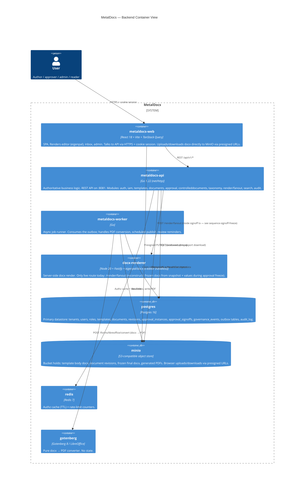

# C4 Level 2 — Container View (Backend)

> **Last verified:** 2026-06-01 (docgen-v2 → docx-renderer rename)
> **Scope:** All runtime processes + their immediate dependencies.
> **Source of truth for:** [`wiki/architecture/system-overview.md`](../architecture/system-overview.md).
> **Code anchors:**
> - [`deploy/compose/docker-compose.yml`](../../deploy/compose/docker-compose.yml) — service topology
> - [`apps/api/cmd/metaldocs-api/main.go`](../../apps/api/cmd/metaldocs-api/main.go) — API entrypoint
> - [`apps/worker/cmd/metaldocs-worker/main.go`](../../apps/worker/cmd/metaldocs-worker/main.go) — worker entrypoint
> - [`internal/platform/bootstrap/`](../../internal/platform/bootstrap/) — DI wiring

## Why each container exists

| Container | Job | Why separate |
|---|---|---|
| **metaldocs-api** | All business logic + authz | Single trust boundary; horizontally scalable; stateless behind a load balancer |
| **metaldocs-worker** | Async side-effects (PDF, scheduled jobs) | Decouples slow/external work from user-facing API. Outbox-driven, at-least-once with retries (ADR 0009) |
| **metaldocs-web** | UI | Vite SPA. No SSR. Editor is heavy (eigenpal), better as a client app |
| **docx-renderer** | Server-side eigenpal render | Eigenpal's docx engine is JavaScript-only. Wrapped behind a stable HTTP contract so the Go side can swap providers later (SuperDoc, etc.) without touching backend logic — anti-corruption layer |
| **postgres** | All persistent state | Single source of truth for facts; transactional outbox lives here too |
| **minio** | Document bytes | API never proxies multi-MB docx — browser ↔ MinIO direct via presigned URLs. The scaling pattern |
| **redis** | Authz cache + rate limit | Hot-path lookups that would otherwise hammer Postgres |
| **gotenberg** | docx → PDF | LibreOffice in a container; stateless; replaceable |

## Known coupling worth knowing

- **API → docx-renderer is synchronous during signoff** (the `/render/fanout` call inside the approval transaction). This is the strongest coupling in the system today. See [sequence-signoff-freeze.md](sequence-signoff-freeze.md) for why this matters and the planned async refactor.
- **Worker → Gotenberg is async + retryable** (PDF outbox, ADR 0009). This is the pattern freeze should eventually adopt.

For external context, see [c4-context.md](c4-context.md). For end-to-end flows, see the sequence diagrams in this folder.
