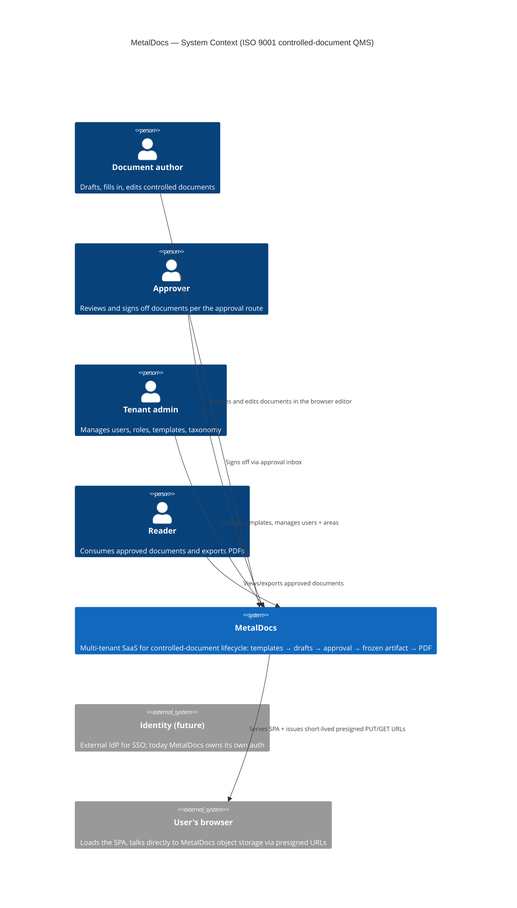

# C4 Level 1 — System Context

> **Last verified:** 2026-06-01
> **Scope:** External actors + MetalDocs as a single system.
> **Source of truth for:** [`wiki/architecture/system-overview.md`](../architecture/system-overview.md).

## What this diagram answers

- **Who uses it?** Four user roles: author, approver, admin, reader.
- **What's outside?** Only the user's browser (which talks to object storage directly via presigned URLs) and a future SSO IdP. Everything else is internal.
- **What's the system's job?** Take a controlled document from draft → approved → archived artifact, with ISO 9001 traceability.

## Key invariants visible here

- **Browser talks to object storage directly.** The API issues presigned URLs; multi-megabyte docx bytes never pass through the API. This is the scaling pattern. See [sequence-edit-autosave.md](sequence-edit-autosave.md).
- **No external IdP today.** MetalDocs is the identity authority for v1.

For the moving parts inside the box, see [c4-container-backend.md](c4-container-backend.md).
