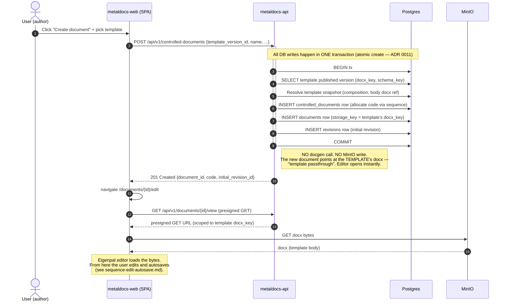

# Sequence — Create Document

> **Last verified:** 2026-06-01
> **Flow:** User picks a template → POST creates a controlled document + document + initial revision in a single transaction → editor opens immediately on the template's docx.
> **Code anchors:**
> - [`internal/modules/controlleddocuments/application/service.go:327`](../../internal/modules/controlleddocuments/application/service.go) — orchestrates the atomic create
> - [`internal/modules/documents/application/cd_initializer.go:50`](../../internal/modules/documents/application/cd_initializer.go) — calls `cloneIntoTx`
> - [`internal/modules/documents/application/service.go:399`](../../internal/modules/documents/application/service.go) — `cloneIntoTx` (template-passthrough)
> - [ADR 0011](../decisions/0011-cd-atomic-create.md) — controlled-document atomic create

## What's important

- **One transaction**, three rows (controlled_document, document, revision). If any step fails, nothing is half-created. See ADR 0011.
- **No docgen, no S3 write at create time.** The new document's `storage_key` *points at the template's docx*. This is called **template passthrough** ([service.go:399 — `cloneIntoTx`](../../internal/modules/documents/application/service.go)). Trade-off accepted: the first edit will fork the docx (a new content-hashed key) on autosave; that's where bytes start to diverge.
- **Editor opens immediately.** No server-side render gate; the user sees their document in the time it takes to fetch the template body from MinIO.

## Failure modes

| Failure | Outcome |
|---|---|
| Template not found / not published | 404 from the lookup; tx never started |
| Code sequence allocation fails | tx rolled back; nothing persisted |
| Postgres unavailable | 5xx; nothing persisted |
| MinIO unavailable at view time | Browser shows load error; the document row exists and will load on retry |

## Related

- [c4-container-backend.md](c4-container-backend.md) — the containers in play here.
- [sequence-edit-autosave.md](sequence-edit-autosave.md) — what happens after the editor opens.
- [`wiki/modules/controlled-documents.md`](../modules/controlled-documents.md), [`wiki/modules/documents.md`](../modules/documents.md).
