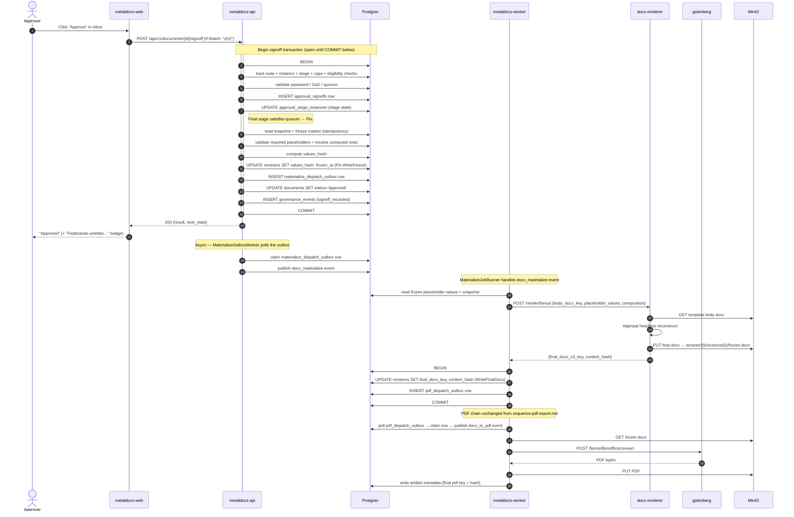

# Sequence — Signoff + Freeze

> **Last verified:** 2026-06-01 (async freeze refactor — ADR 0015)
> **Flow:** Approver clicks "approve" → API pins the document (fast, no network) → commits → worker materializes the frozen DOCX asynchronously.
> **Code anchors:**
> - [`internal/modules/documents/approval/application/decision_service.go`](../../internal/modules/documents/approval/application/decision_service.go) — signoff calls `pinInvoker.Pin` in-tx
> - [`internal/modules/documents/application/freeze_service.go`](../../internal/modules/documents/application/freeze_service.go) — `Pin` + `Materialize`
> - [`internal/modules/render/fanout/materialize_outbox_worker.go`](../../internal/modules/render/fanout/materialize_outbox_worker.go) — outbox relay (API process)
> - [`internal/platform/worker/materialize_job_runner.go`](../../internal/platform/worker/materialize_job_runner.go) — job handler (worker process)

## Current design (as of 2026-06-01 — async freeze, ADR 0015)

## What freeze guarantees (compliance)

| Guarantee | Mechanism |
|---|---|
| **Content immutability at approval** | `values_hash` + `frozen_at` written atomically with the signoff in one tx — **unchanged** |
| **Auditable** | `governance_events` row written same tx; `audit_log` records actor + action |
| **Idempotent** | Second freeze attempt early-returns when `frozen_at` is already set |
| **Deterministic reconstruct** | `final docx = f(body_docx, values, composition)` — re-runnable, content-addressed by hash |

## Failure modes

| Failure | Outcome |
|---|---|
| docx-renderer down | Signoff commits; outbox retries with backoff |
| docx-renderer slow | Worker retries with backoff |
| Reconstruct fails for content reason | Approval committed; artifact retried; `materialize_status=failed` after max_attempts |
| Worker crashes mid-materialize | Outbox claim TTL expires; another worker reclaims |

## Previous design (deprecated 2026-06-01)

The previous design called `FreezeService.Freeze` synchronously inside the signoff
transaction, making an HTTP call to docx-renderer before commit. See ADR 0015 for why
this was problematic and the full before/after analysis.

## Related

- [c4-container-backend.md](c4-container-backend.md)
- [sequence-pdf-export.md](sequence-pdf-export.md)
- [`wiki/decisions/0015-async-freeze-pin-materialize.md`](../decisions/0015-async-freeze-pin-materialize.md)
- [`wiki/decisions/0009-pdf-dispatch-outbox.md`](../decisions/0009-pdf-dispatch-outbox.md)
- [`wiki/modules/approval.md`](../modules/approval.md), [`wiki/concepts/freeze-and-hashing.md`](../concepts/freeze-and-hashing.md)
