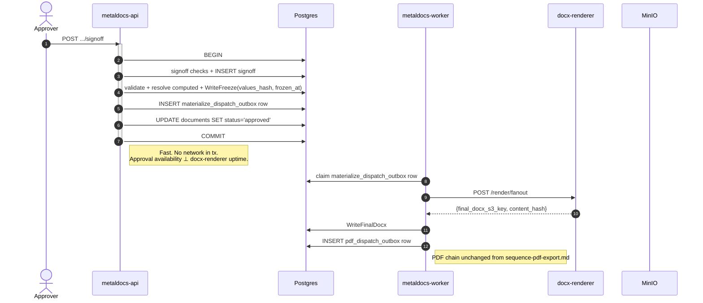

# Sequence — Signoff + Freeze

> **Last verified:** 2026-06-01 (docgen-v2 → docx-renderer rename)
> **Flow:** Approver clicks "approve" on the final stage → API records the signoff, transitions the instance to `approved`, **synchronously** calls docx-renderer to reconstruct the final docx, persists the artifact, and enqueues the PDF job.
> **⚠️ Known design issue:** The reconstruct HTTP call runs **inside** the signoff DB transaction. This couples approval availability to docx-renderer uptime. See [§ Known coupling](#known-coupling) and the planned refactor.
> **Code anchors:**
> - [`internal/modules/documents/approval/application/decision_service.go:349`](../../internal/modules/documents/approval/application/decision_service.go) — signoff calls `freezeInvoker.Freeze` in-tx
> - [`internal/modules/documents/application/freeze_service.go:79`](../../internal/modules/documents/application/freeze_service.go) — `Freeze` orchestrates the whole flow below
> - [`internal/modules/render/fanout/client.go:45`](../../internal/modules/render/fanout/client.go) — `POST {fanoutURL}/render/fanout`
> - [`internal/modules/documents/approval/application/decision_service.go:476`](../../internal/modules/documents/approval/application/decision_service.go) — PDF outbox `Enqueue` (still in tx)

## Current design (as of 2026-06-01)

```mermaid
sequenceDiagram
    autonumber
    actor Approver
    participant Web as metaldocs-web
    participant API as metaldocs-api
    participant PG as Postgres
    participant Docgen as docx-renderer
    participant Worker as metaldocs-worker
    participant Gotenberg as gotenberg
    participant Minio as MinIO

    Approver->>Web: Click "Approve" in inbox
    Web->>API: POST /api/v1/documents/{id}/signoff (If-Match: "v{n}")

    activate API
    Note over API,PG: Begin signoff transaction (open until COMMIT below)
    API->>PG: BEGIN
    API->>PG: load route + instance + stage + caps + eligibility checks
    API->>PG: validate password / SoD / quorum
    API->>PG: INSERT approval_signoffs row
    API->>PG: UPDATE approval_stage_instances (stage state)

    Note right of API: This stage is the FINAL stage and now satisfies quorum →<br/>trigger freeze.

    API->>PG: read snapshot + freeze marker (idempotency)
    API->>PG: validate required placeholders + resolve computed ones
    API->>PG: compute values_hash
    API->>PG: UPDATE revisions SET values_hash, frozen_at (FreezeFinalizer.WriteFreeze)

    rect rgb(255,238,238)
        Note over API,Docgen: ⚠ SYNCHRONOUS HTTP call inside the open DB transaction.<br/>If docx-renderer is slow or down → tx rolls back → signoff fails.
        API->>Docgen: POST /render/fanout {body_docx_key, placeholder_values, composition}
        Docgen->>Minio: GET template body docx
        Docgen->>Docgen: eigenpal headless reconstruct (substitute placeholders, compose subblocks)
        Docgen->>Minio: PUT final docx → tenants/{t}/revisions/{r}/frozen.docx
        Docgen-->>API: {final_docx_s3_key, content_hash}
    end

    API->>PG: UPDATE revisions SET final_docx_key, content_hash (FinalDocxWriter.WriteFinalDocx)
    API->>PG: INSERT pdf_dispatch_outbox row (transactional outbox; ADR 0009)
    API->>PG: UPDATE documents SET status='approved'
    API->>PG: INSERT governance_events (signoff_recorded)
    API->>PG: COMMIT
    deactivate API
    API-->>Web: 200 {result, next_state}
    Web-->>Approver: "Approved"

    Note over Worker: Async, off the transactional outbox<br/>(see sequence-pdf-export.md)
    Worker->>PG: poll pdf_dispatch_outbox → claim row → publish docx_to_pdf event
    Worker->>Minio: GET frozen docx
    Worker->>Gotenberg: POST /forms/libreoffice/convert
    Gotenberg-->>Worker: PDF bytes
    Worker->>Minio: PUT PDF
    Worker->>PG: write artifact metadata (final pdf key + hash)
```

## What freeze guarantees (compliance)

| Guarantee | Mechanism |
|---|---|
| **Content immutability at approval** | `values_hash` + `frozen_at` written atomically with the signoff in one tx |
| **Auditable** | `governance_events` row written same tx; `audit_log` records actor + action |
| **Idempotent** | Second freeze attempt early-returns when `frozen_at` is already set (`freeze_service.go:93`) |
| **Deterministic reconstruct** | `final docx = f(body_docx, values, composition)` — re-runnable, content-addressed by hash |

## Known coupling

The bordered red step is the problem:

1. **Postgres row locks held across an HTTP call.** Under load this serializes signoffs and pressures the connection pool.
2. **docx-renderer down → approval fails.** Approval availability ≤ docx-renderer uptime. Internally inconsistent with the PDF path, which deliberately decoupled this (ADR 0009).
3. **Recovery on transient failure** = the user retries. The frozen marker is rolled back too (it was in the same tx), so the next attempt reruns the whole flow including resolver re-evaluation.

The compliance guarantees above are achieved by steps **before** the reconstruct call. The reconstruct only produces a derived artifact from already-pinned inputs — it doesn't need to be in the tx.

## Planned refactor (async freeze)

Split `Freeze` into two halves:

- **`Pin` (in-tx, fast, no network):** validate + resolve computed + compute `values_hash` + `WriteFreeze` + enqueue a `docx_materialize` outbox job + status → approved. Commit.
- **`Materialize` (async, in worker):** poll outbox → call docx-renderer reconstruct → `WriteFinalDocx` → enqueue PDF job (chains the existing PDF path).



**Trade-off:** A brief "approved → finalizing artifact" window (seconds, normally). UI must represent it. Any consumer that assumes the final docx exists the instant status flips to `approved` must instead read the outbox state.

**Status:** Plan agreed; not yet implemented. See conversation 2026-06-01 / freeze design analysis.

## Failure modes (current design)

| Failure | Outcome (current sync) | Outcome (planned async) |
|---|---|---|
| docx-renderer down | Signoff returns 5xx, full rollback | Signoff commits; outbox retries indefinitely |
| docx-renderer slow (>tx timeout) | Tx aborted by Postgres → 5xx | Worker retries with backoff |
| Reconstruct fails for content reason | Same — full rollback | Approval committed; artifact retried; user sees "finalizing failed — retrying" |
| Worker crashes mid-materialize | N/A | Outbox claim TTL expires; another worker reclaims |

## Related

- [c4-container-backend.md](c4-container-backend.md) — note the **red** API→docgen arrow in the legend.
- [sequence-pdf-export.md](sequence-pdf-export.md) — the async pattern freeze should mirror.
- [`wiki/decisions/0009-pdf-dispatch-outbox.md`](../decisions/0009-pdf-dispatch-outbox.md) — the ADR establishing the async-outbox pattern.
- [`wiki/modules/approval.md`](../modules/approval.md), [`wiki/concepts/freeze-and-hashing.md`](../concepts/freeze-and-hashing.md).
