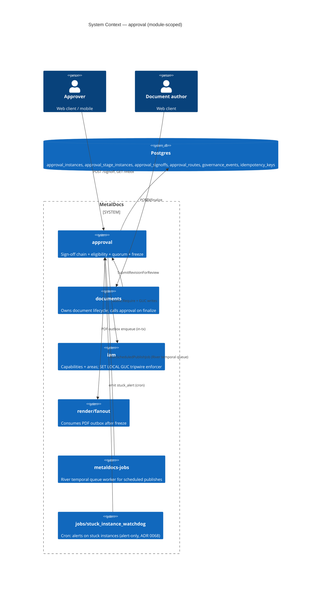
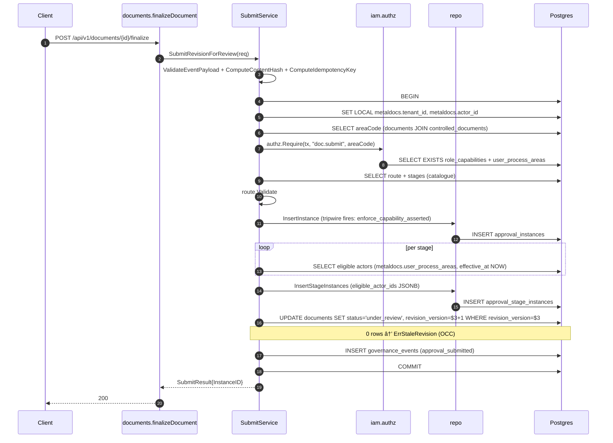
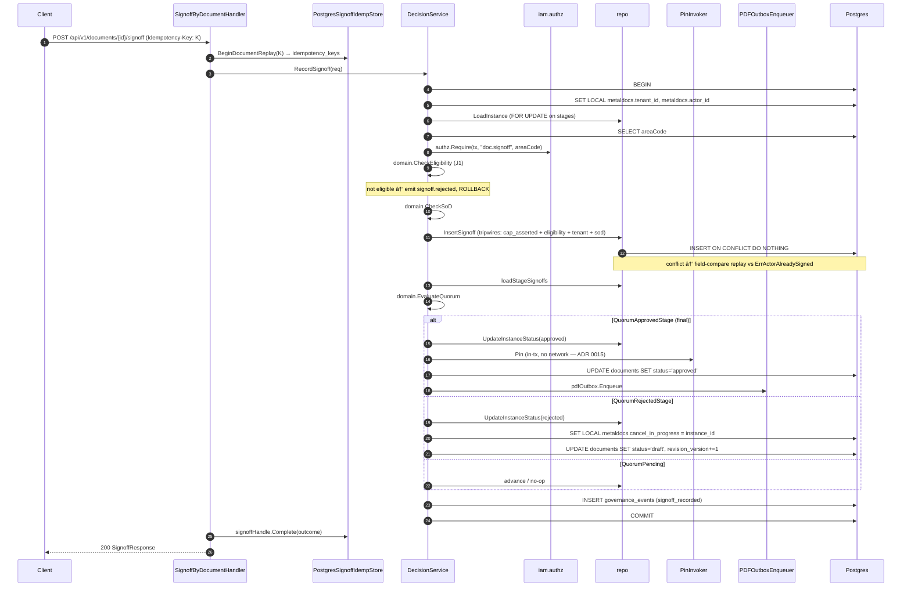
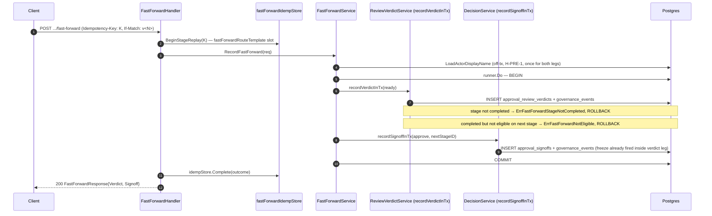

# Module: approval

> Living architecture doc. Shape: Arc42 (12 sections) + C4 (Context/Container/Component) Mermaid diagrams + ADR links.
> Generated by `metaldocs-module-doc` skill. Predecessor stub at git rev `2f11416e:wiki/modules/approval.md` is superseded by this doc.

**Last verified:** 2026-07-14 (Unit 4.2 — template-inbox worklist, no ADR: the single approver worklist (`GET /api/v1/approval/inbox`, `ReadService.ListWorklist`, `application/read_service.go:577`) is now subject-generic, surfacing TEMPLATE reviews alongside document reviews. Previously it only showed document approvals — a document-only filter was in fact baked into the SQL, not just an incidental gap. `ListWorklist` selects the approval instance's OWN `ai.subject_kind`/`ai.subject_key` (`read_service.go:634-636`); document rows keep the pre-existing `LEFT JOIN documents` unchanged (`read_service.go:664-665`); template rows resolve `{templateId, name}` AFTER the query via a new batch method on the approval-owned `TemplateVersionReader` port — `LoadTemplateInboxMeta(ctx, tx, tenantID, versionIDs) -> map[string]domain.TemplateInboxMeta` (port `application/template_submit_service.go` file group; adapter `internal/modules/templates/infrastructure/approval_version_reader.go:93`). This port remains the ONLY approval→templates read seam (module-boundary invariant unchanged). `domain.TemplateInboxMeta{TemplateID, Title}` lives at `internal/modules/approval/domain/subject.go:93` (domain leaf, avoids an approval/application ↔ templates/infrastructure import cycle). **WIRE CONTRACT HARD BREAK** (`api/openapi/v1/openapi.yaml` `ApprovalInboxItem`, mirrored in `http/contracts/instance_read.go:149` `InboxItem`): `document_id`/`document_title` are DROPPED — no relax-to-optional compat — replaced by `subject_kind` (`"document"`\|`"template"`), `subject_key`, `subject_title`, `subject_ref`, plus `controlled_document_id` now required-and-nullable (explicit null for template rows) and `stage_kind` now required (was optional pre-existing). Semantics: `subject_key` = documentId (document instances) \| template VERSION id (template instances); `subject_ref` = the FE navigation id = documentId \| templateId (**not** the version id) — document rows navigate to `/documents/:subject_ref`, template rows to `/templates/:subject_ref/approval` (`frontend/apps/web/src/features/approval/pages/InboxPage.tsx:99` `openDocument`). Document-only quick-decision/approve/reject actions are gated on `subject_kind === 'document' && controlled_document_id != null` (`InboxPage.tsx:112` `openDecisionFlow`); template rows render a single "Abrir revisão do modelo" action (`frontend/apps/web/src/features/approval/components/InboxApprovalCard.tsx`). The deprecated `listInboxItems` (§6.3, `read_service.go:446`) now carries an explicit `AND ai.subject_kind = 'document'` guard (`read_service.go:507`) — migration 0297 relaxed `approval_instances.document_id` to NULLable, so without the guard a template row would crash its bare-`string` scan of `document_id` and, worse, silently mislabel a template instance as a document one. **Named debt, not done:** snapshot columns on `approval_instances` (denormalizing subject title/ref at submit time) are the global-maximum design here but this track could not add the migration for them; the reader-bridge (post-query `TemplateVersionReader.LoadTemplateInboxMeta` fan-out) is a deliberate GM-fork, reopen trigger = the next `approval_instances` migration OR a measured worklist perf regression — rationale in `docs/superpowers/analysis/2026-07-14-unit-4.2-template-inbox-system-impact.md`. §5.2/§5.3/§6.3/§12 updated below. Prior: 2026-07-13 (M4 ActorSelector — ROADMAP unit 3.2, [ADR 0084](../decisions/0084-approval-actor-selector-union.md): a route stage's actors are now a discriminated union of 4 selector kinds (`named_user`, `role_in_fixed_area`, `role_in_document_area`, `submit_choice`) — `domain.ActorSelector{Kind, UserID, Role, AreaCode}` + `Validate()` (`internal/modules/approval/domain/selector.go:18,34`) — persisted one-row-per-selector in a new child table `public.approval_route_stage_selectors` (migration `0303`, `route_stage_id` FK `ON DELETE CASCADE`, `UNIQUE(route_stage_id, selector_order)`, per-kind `CHECK` truth table). Migration `0305` drops the old flat `approval_route_stages.required_role`/`area_code` columns outright (no relax-to-optional compat, standing no-fallback-legacy rule) — selectors are now the SOLE source of truth for stage actors. Route-admin wire (`http/contracts/route.go:103-121,325-346`) carries `selectors: ActorSelector[]` (flat `{kind, user_id?, role?, area_code?}` DTO, deliberately no `oneOf`/discriminator per ADR 0035), `StageRequest.Selectors` REQUIRED `minItems:1`; the ADR 0022 area-role registry binding (`validateAreaRole`, `route.go:236-241,273`) re-homed from the old flat `required_role` onto each selector's `role` for the 3 role-bearing kinds (`role_in_fixed_area`, `role_in_document_area`, `submit_choice`; `named_user` excluded — no role). Mapping both directions lives in `http/route_admin_handler.go` (`mapSelectorsFromWire`/`mapSelectorsToWire`, `:293`/`:311`). New read-only preview endpoints (slice 8a) — `GET /documents/{id}/approval-preview` (`route_preview_handler.go:18`, `DocumentApprovalPreviewHandler`) and `GET /templates/{id}/versions/{n}/approval-preview` (`internal/modules/templates/delivery/http/routes_approval_preview.go:26`, `GetTemplateVersionApprovalPreview`) — gated by the submitter's EXISTING `CapDocumentSubmit`/`CapTemplateSubmit` (no new capability), reuse the same `SubmitService.PreviewRoute`/`resolveActiveRoute` resolution the submit path uses (resolution parity), return `ApprovalRoutePreview{route_id?, route_name?, stages:[{stage_order, label, selectors}]}`. Purpose: let a submitter build a `chosen_actors` picker for `submit_choice` stages before submitting. At submit time, `chosen_actors:[{stage_order, user_ids}]` on the document/template submit requests is validated server-side by `validateChosenActorsTargets` (`application/submit_choice_test.go` pins the contract; domain sentinels `ErrSubmitChoiceRequired`/`ErrSubmitChoiceConstraintViolated`, `domain/errors.go:60,68`) — fails closed 422 if a `submit_choice` stage has no chosen actors or a chosen actor doesn't satisfy the role×area constraint; the FE picker is the friendly first line, the backend 422 is the hard line. §5.1/§5.2/§5.3/Route Truth Table/§8/§9/Glossary updated below. Prior: 2026-07-12 (M3 approval-remediation kernel extraction — [ADR 0082](../decisions/0082-approval-kernel-extraction.md): `internal/modules/documents/approval/` promoted to the top-level 15th module `internal/modules/approval/` via a pure `git mv` (165 files, 111 import paths, zero behavior change, mechanical rename verified — this doc's ~50 `internal/modules/documents/approval/...` anchors globally repointed to `internal/modules/approval/...`). The kernel generalized from document-only to subject-generic `(subject_kind, subject_key)` keying (`domain/subject.go`, `Subject{Kind, Key}`, `SubjectKindDocument`/`SubjectKindTemplate`) — document subject key = `profile_code` (route) / `document_id` (instance), template subject key = `template_id` (route) / `template_version_id` (instance); ADR 0083 hardens the shared-table capability tripwire with a subject discriminator (`enforce_capability_asserted` nested `CASE NEW.subject_kind`, migrations `0299` on `approval_instances`, `0300` on `approval_signoffs` via parent-instance lookup — a flat union of `document.submit`/`template.submit` would have been a security regression letting either capability authorize the other subject's insert). New `application/template_submit_service.go` (`TemplateSubmitService.SubmitTemplateVersionForReview`) is the templates-side thin entry point, asserting `CapTemplateSubmit` (`ScopeTenant`, area-blind); `DecisionService.RecordSignoff` (unchanged file, now subject-aware) serves both document and template signoffs. Two new HTTP consumers live in the `templates` module (`POST /templates/{id}/versions/{n}/submit-for-approval` + `.../signoff`, `internal/modules/templates/delivery/http/routes_approval_kernel.go`) — see [`wiki/modules/templates.md`](templates.md) §5.3. **Retired by ROADMAP unit 3.1a (2026-07-13):** templates' legacy role-based approval path (4 routes, `templates_approval_config`, `domain.ApprovalConfig`) is deleted; the kernel is now the sole template-approval path, called by the rebuilt template frontend. The transitional coexistence this module noted at M3 time has ended. Also found and corrected during this pass: `application/idempotency.go`/`ComputeIdempotencyKey` (§5.2, §8.3) no longer exist in the tree — `submit_service.go` now threads the raw client `Idempotency-Key` header directly (see `wiki/modules/documents.md` §5.2 for the flagged drift); several `router.go:NN`-flagged rows in the Route Truth Table were re-verified still structurally accurate post-move (generated `HandlerWithOptions` mount unchanged by the relocation). Boundary-guard note: `documents` may no longer reach `approval/http`/`approval/infrastructure` (only this module's published `domain`/`application`/`api` layers) — stricter than the retired nested-family exception. Prior: 2026-07-11 (Unit 2.3 G3 — fast-forward "Aprovar já" ([spec R5](../../docs/superpowers/specs/2026-07-10-review-approval-workflow-model.md)): `ReviewVerdictResponse` gains `fast_forward_eligible`/`next_stage_id` (`http/contracts/review_verdict.go:43-45`; application-side `ReviewVerdictResult.FastForwardEligible`/`NextStageID`, `application/review_verdict_service.go:75-78`) — set true only when a `ready` verdict completes its review stage AND the caller is separately eligible on the now-active approval-kind stage (same `ResolveEligibleIdentity` + delegation composition as signoff). New endpoint `POST /api/v1/approval/instances/{instance_id}/stages/{stage_id}/fast-forward` (`recordApprovalFastForward`, `http/fast_forward_handler.go:23`, adapter `http/routes_generated.go:92`) composes `ReviewVerdictService.recordVerdictInTx` (ready) + `DecisionService.recordSignoffInTx` (approve) inside ONE transaction (`application/fast_forward_service.go:60`) — two ledger rows (`approval_review_verdicts` + `approval_signoffs`) and two `governance_events`, never collapsed into one row; fails closed on `domain.ErrFastForwardStageNotCompleted` (409 `state.fast_forward_stage_not_completed`) / `domain.ErrFastForwardNotEligible` (409 `state.fast_forward_not_eligible`, `http/errors.go:101-102,288-302`) with full rollback — a partial fast-forward (verdict written, signoff not, or vice versa) never persists. Freeze boundary (§8.1a) is unchanged — it still fires inside the verdict core at the review→approval transition, and the signoff leg's content-hash check reads the hash frozen in that same tx. Idempotent via its OWN `fastForwardRouteTemplate` (`infrastructure/idempotency/postgres_signoff_idemp_store.go:25`), deliberately distinct from `stageSignoffRouteTemplate` so a fast-forward retry can never collide with or be replayed as a plain signoff. Tier-1 cap is `CapDocumentSignoff` (`apps/api/cmd/metaldocs-api/permissions.go:262` — the signature leg is the more privileged action); tier-2 in-tx enforces both `CapApprovalReview` (verdict leg, inside `recordVerdictInTx`) and `CapDocumentSignoff` (signoff leg, inside `recordSignoffInTx`) — no new authz path, the two composed cores run their own existing `authz.Require` calls unchanged. §5.2/§5.3/Route Truth Table/§8.1/§8.3/§9/§12 updated below. Corrects a prior implicit assumption in §6.2's narrative: verdicts and signoffs are not *always* two separate client round-trips — fast-forward is a third, additive entry point that still writes both ledger rows, just in one request. Prior: 2026-07-10 (G1 per-profile signature policy — ROADMAP 2.1, [ADR 0081](../decisions/0081-per-profile-signature-policy.md): approval now CONSUMES a taxonomy-owned route-signature policy through a NEW narrow published port `application.ProfilePolicyReader` (`RoutePolicy(ctx, tenantID, profileCode) → taxonomydomain.RoutePolicy`), adapter `infrastructure/profile_policy_reader.go` — approval never sees the raw `GovernanceClass` enum, only the 3-valued policy; the read preserves `CapTaxonomyView` in taxonomy's own short tx and is resolved OFF any approval write tx (H-PRE-1). `domain.Route.Validate(policy)` gained the policy parameter (`NoRoutePermitted`→`ErrRouteNotPermittedForProfile`; `RequireApprovalStage`→`ErrApprovalStageRequired` unless a stage has `Kind==approval`, empty Kind counts as approval fail-closed; structural checks still run first). Enforced friendly-first at route-admin `createTx`/`updateTx` (policy hoisted off-tx via `resolvePolicy`/`resolveUpdatePolicy`), authoritative-last by the DB DEFERRABLE trigger (migration 0295, on `approval_route_stages` + `approval_routes` + `document_profiles`). **Submit does STRUCTURAL-ONLY `Validate("")`** and relies on the write-boundary invariant — a recorded deviation from the design's literal "enforce at submit", forced by H-PRE-1 × ADR 0073; option-2 (in-tx taxonomy read at submit) permanently rejected. See ADR 0081 for the full invariant argument. Prior: 2026-07-07 (Milestone 2b F10 wiki-sync — approval-remediation F1-F9 backend kernel work landed: **F1** `stage_kind` enum (`review`/`approval`) on `approval_route_stages`/`approval_stage_instances` + `due_in_days`/`due_at` + `approval_instances.frozen_content_hash`/`cancel_reason` + `approval_signoffs.signature_meaning` (migration `0286`) — see §5.2/§8.1 additions below. **F2** ([ADR 0074](../decisions/0074-approval-route-versioning.md)) in-use routes are now superseded (new versioned row + old row `active=false`), not permanently frozen — supersedes ADR 0018 §1; empty eligible-actor pool at submit is now a 422 (`domain.ErrEmptyEligiblePool`), not a silent stuck instance. **F3** ([ADR 0075](../decisions/0075-approval-oversee-visibility.md)) two new capabilities `approval.review` (area-grade, review-stage acting) + `approval.oversee` (tenant-grade, read-only oversight); tier-1 generic `/api/v1/approval/` prefix-fallback rows deleted, replaced by one explicit row per real registered verb; oversight reads accept `approval.oversee` as an alternative to `document.view`. **F4** new `changes_requested` instance status (5th, non-terminal); `POST /api/v1/approval/instances/{instance_id}/stages/{stage_id}/review-verdict` (`ReviewVerdictHandler`, `review_verdict_handler.go`) — records `ready`/`request_changes` verdicts on review-kind stages, gated by `approval.review`; `SkipStage`/`ErrCannotSkipLastStage` deleted outright (zero call sites); `CancelInstance` reason now actually persists to `cancel_reason` (was SELECTed, never written — closed alongside). **F5** ([ADR 0076](../decisions/0076-approval-freeze-boundary-and-choke-point-concurrency.md)) freeze boundary: `executeFreeze` (`application/freeze.go:44`) pins `frozen_content_hash` at the review→approval transition (or at submit for approval-only routes) — idempotent, instance-scoped unresolved-comments gate (`HasUnresolvedInstanceComments`, `infrastructure/postgres_approval_repository.go:1435`) replaces the old document-wide/no-time-bound gate at both call sites; standalone markup-gate (`application/markup_gate.go`) built and tested but **not wired** to a live byte source (bounded defer — no in-process docx-byte read path exists yet, pending M2c). **F6** no-fallback hash chain: `LoadActiveDocumentContentHash` renamed `LoadFrozenContentHash` (`infrastructure/approval_repository.go`), reads only `approval_instances.frozen_content_hash` for any document with an active/completed instance — never COALESCEs to head-revision hash in that case; publish (`PublishApproved`/`SchedulePublish`) now fails closed (`ErrContentHashMismatch`) if `FrozenContentHash` is nil; only the true no-instance/draft case still falls back to `documents.content_hash_at_submit` (`active_instance_reader.go`, two-step explicit read, no COALESCE). **F7** `signature_meaning` (`approval`/`rejection`) now actually derived from `Decision` in `RecordSignoff` (was silently defaulting every REJECT to `"approval"` — live 21 CFR Part 11 defect, now fixed) + rendered in the read-path manifest (`contracts.SignoffRecord.SignatureMeaning`); SoD unified — single exported `domain.CheckSoD` (`domain/sod.go:38`, 4-parameter signature post-F9) called identically by `decision_service.go:301`-area and `review_verdict_service.go`, mirrored by one shared DB trigger function `enforce_approval_sod()` (migration `0290`) bound to both `approval_signoffs` and the new `approval_review_verdicts` table. **F8** SLA due-by: `due_in_days_snapshot` captured at submit, `due_at` computed by the DB at stage activation (no app-clock dependency, no fallback when snapshot is NULL); new alert-only periodic job `internal/modules/jobs/approval_sla_surfacer/` (ADR 0067 dual-define pattern, hourly); read-path visibility model fixed — `requireInstanceVisible` (`application/read_service.go:661`) grants {author, stage-pool member (current+past), `approval.oversee` holder (tenant-wide), `document.edit` holder (own area only — an area-scope bug was found+fixed here)} → 200, else 404 (never a bare `document.view` consumer); worklist gains `stage_kind`/`due_before`/`scope=oversee` filters via new `ListWorklist` (`application/read_service.go:401`, `InboxFilter` at `:46`) — additive to eligibility scoping, never widening it except under explicit `scope=oversee` (gated by `authz.Require(CapApprovalOversee, "tenant")`). **F9** ([ADR 0077](../decisions/0077-approval-delegation.md)) delegation: new `approval_delegations` table (migration `0293`) — tenant, delegator, delegate, time window, reason; `domain.ResolveEligibleIdentity` widens the eligibility-pool INPUT (tries direct match, falls back to delegator identity) rather than adding a parallel authz branch; `CheckSoD` gained a 4th `onBehalfOfUserID` parameter (rejects if the delegator is the author); dual identity (`on_behalf_of_user_id`, nullable) persisted on both `approval_signoffs` and `approval_review_verdicts`; revocation is a real, in-tx `DELETE` re-queried fresh on every use (no soft flag, no cache) — see `DelegationService` (`application/delegation_service.go`). All nine features' live-DB integration-test runs are **bounded defers** (no `.env`-derived DB credentials obtainable this session per standing rule) — see each feature's own `evidence.md` under `docs/superpowers/milestones/approval-remediation/milestone-2b-approval-kernel-backend/` for the full defer ledger; code/build/unit suites are green throughout. | prior: 2026-07-06 (F9.4 doc-truth pass: F9.5 `repository/`→`infrastructure/` rename anchors fixed — `approval_repository.go` (:68), `postgres_approval_repository.go` (:36, method count 11→27), `postgres_signoff_idemp_store.go` moved under `infrastructure/idempotency/` (:50); `domain/route.go:39`→`:41`; `http/handler.go:56`→`:78`/`NewHandler:96`; `http/router.go` `RegisterRoutes` no longer exists — mounts via generated `HandlerWithOptions`/`Middlewares` (flagged, structural change predates F9.5); `authz_guc.go` and `cutover_service.go` confirmed gone from tree — flagged **verify**, not rewritten (see approval-tech-debt.md T-006/T-011)) | prior: 2026-07-04 (M5 F5.8: stuck-instance watchdog is **alert-only** — the orphaned `auto_cancel` branch + `SystemCancelInstance`/`system` authz-bypass path are removed; watchdog emits one `approval.instance.stuck_alert` and a human decides; user-facing `CancelInstance` (`document.edit`-gated) unchanged, now at `cancel_service.go:46`; see [ADR 0068](../decisions/0068-stuck-instance-watchdog-alert-only.md)) | prior: 2026-07-02 (anchor refresh: PDF outbox dedupe anchor now `render/fanout/staging_outbox.go:57-60` after the StagingOutboxWorker consolidation) | prior: 2026-07-01 (CON-01 grade-A simplification, documents-module side: `POST /documents/{id}/finalize` — the upstream entry referenced throughout §6 below — is now a deprecated convenience wrapper over canonical `POST /documents/{id}/submit` (DEC-01); both still converge on `SubmitRevisionForReview` (`application/submit_service.go:48`) so the approval-side flow and OCC/stale-revision behavior documented here are unchanged. Finalize now requires `If-Match` (previously optional/absent) and threads the client-asserted `revision_version` through instead of a freshly-read one, closing a race window; see `wiki/modules/documents.md` §6.3 for the finalize-specific narrative) | prior: 2026-06-15 (M4/F4.1 — port ADR 0029 cross-link: approval now consumes iam-owned `UserDisplayNameReader` port for cross-module display-name reads; direct `iam_users.display_name` reach in `get_instance_handler.go` closed) | **Prior:** 2026-06-12 (Wave 2.12: approval reauth InMemoryAuthFailureRateLimiter deleted — PostgresAuthFailureRateLimiter wired unconditionally. Wave 2: typed EventTypeRouteConfigCreated/Updated/Deactivated consts; ListPendingForActor batch-loads via LoadInstancesByIDs (3 queries flat); CutoverService+coverage_boost DELETED; PDFDispatchInvoker/pdfDispatcher fully removed — outbox is sole dispatch path; PostgresAuthFailureRateLimiter Postgres-backed. Prior: Phase F F8: CheckReplay/RecordReplay → BeginDocumentReplay/signoffHandle.Complete; postgres_signoff_idemp_store.go line anchors updated; prior: 2026-06-02 Approval route admin QA-fix — preview-QA remediation sweep. **BE:** create-route FK violation on `(tenant_id, profile_code)` no longer falls to a 500 `internal.unknown` — `createTx` translates `repository.ErrFKViolation` → new `application.ErrRouteProfileUnknown`, mapped to `422 validation.profile_unknown` in `errors.go` (PT-BR string added to `errorMessages.ts`; `error-codes.generated.json` regenerated, which also surfaced latent missing mappings `capability_denied` + `idempotency.key_conflict` — both added). Dead `mapStageRequests` default `workflow.sign` removed (capability validated non-empty upstream). `StageSummary`/`ListStageItem` unified to canonical names: `label`→`name`, `quorum_kind`→`quorum`, `order` now emitted (OpenAPI + Go contract + FE codegen regenerated). `start-api.ps1` tees API stdout/stderr to `logs/api.log`. **FE:** `listRoutes` seeds the ETag cache per row from `version` (fixes cold-load Edit/Deactivate 428); all three mutations toast `resolveErrorMessage` on non-412 failure + success toast; profile_code stores lowercase (display-only uppercase via `.profileCodeInput`), fixing the 400 from the old `.toUpperCase()` mutator; optimistic version bump guarded. New tests: Go `TestCreateRoute_ProfileUnknown` + `TestListRoutes_CanonicalStageNames`; FE unmocked `routeAdminApi.test.ts` + `useRouteAdminMutations.test.tsx`. Prior PR-5 entry preserved below. Approval route admin PR-5 — pure wiki/backlog sync closing out the Route Admin canonical conversion sprint. Composite tech-debt row T-015 registered in `approval-tech-debt.md` indexing closures across PR-1..PR-4: FE-1..FE-20 + C-2 (PR-4 commit `5794e4d4e`); BE-1 (PR-1 commit `f57d5525e`, marked resolved as sub-item under T-002 which stays open for signoff/cancel doc-scoped routes); BE-3..BE-6, BE-8, BE-10..BE-12 (PR-2 commit `0d61b7165`); BE-7 (PR-3 follow-up commit `e4e0be399`); ADR 0018 + concept doc landed PR-3 commit `ab7c29539`. BE-9 (Tier-1 `route.view` split / `CapRouteView` on `GET /api/v1/approval/routes`) explicitly carried over to F-001 follow-up per ADR 0018 §6 and `wiki/concepts/authz-tiers.md` Tier-1 rule 4. Backlog row `R-RouteAdmin-Rewrite` added to `wiki/backlog/approval-refactor.md` marked merged 2026-06-02 with the same five commit shas. Bugs-audit `wiki/bugs/audit-2026-05-04.md:98` K2 flipped `wont-fix (deferred to frontend rewrite)` → `fixed` (2026-06-02, PR-4 commit `5794e4d4e`). §11 Risks tally recomputed; §9 ADR 0018 row confirmed (added in PR-3); §12 Glossary "Route" entry confirmed cross-linking concept doc + ADR 0018; `wiki/concepts/authz-tiers.md` "See also" cross-linked to `approval-routes` concept. Pure doc-only PR — zero code change. Prior PR-4 verification preserved below.

**Prior verification — 2026-06-02 (PR-4):** Approval route admin PR-4 — FE rewrite on canonical patterns: `frontend/apps/web/src/features/approval/pages/route-admin/` replaces the monolithic 568-line `RouteAdminPage.tsx`. New thin transport `routeAdminApi.ts` consumes `components['schemas']` from OpenAPI codegen (`RouteSummary`, `ListRoutesResponse`, `CreateRouteRequest`, `UpdateRouteRequest`, `DeactivateRouteRequest`, `RouteResponse`, `StageRequest`); all writes flow through shared `mutationClient.mutate()` for idempotency + If-Match + RFC 9457 `problem.code` decoding. TanStack Query hooks `useRoutesQuery` (seeds ETag cache from `version`), `useCreateRoute`/`useUpdateRoute`/`useDeactivateRoute` (optimistic + cancel/snapshot/rollback + `invalidateQueries`); `useIamRolesQuery` consumes ADR 0018 Option B local catalogue at `lib/iam/roles.ts` until `GET /api/v1/iam/roles` ships. Component tree: `RouteAdminPage` (container) → `RouteListTable` + `RouteEditorDialog` + `DeactivateRouteDialog`. New `components/ui/Dialog` primitive (native `<dialog>` + `showModal()` focus trap, browser-handled Esc + focus restore) — no `@radix-ui` dep added. `QK.approval.routes.{list,detail}` + `QK.iam.roles` registered. FE-1..FE-20 + C-2 closed: stable uuid per stage row (was `stage-${index}`); deactivate reason required (≥4 chars, sent in body per PR-2 contract); 412/409/422/403 each mapped to distinct PT-BR copy via `messageForRouteError(problem.code, status)`; edit-disabled tooltip is cause-based (`Rota inativa — desativada e somente leitura.`); status badge visually distinct (green/slate pills with leading dot); areas use `useAreasQuery` with surfaced error state instead of `fetchAreas().catch(()=>{})`; dead `useMemo` over single boolean dropped; role select labels come from `useIamRolesQuery` (PT-BR), never a frozen import; legacy `getJSON` + 4 route fns deleted from `approvalApi.ts`; route-admin DTOs deleted from `approvalTypes.ts`. `ControlledDocumentDetailPanel.tsx` migrated to `routeAdminApi.listRoutes` + `RouteSummary` (test mock updated). `frontend/apps/web/design-source/route-admin/` adds `index.html` + `NOTES.md` per `metaldocs-screen-implementation` convention. Rewrite of `RouteAdminPage.test.tsx` covers: list render, editor opens, edit disabled when inactive, validation cascade (label→role→area), m_of_n M=0 rejection, optimistic create rollback on 409, deactivate submit gated by reason, Esc closes editor, role options from IAM query. Prior PR-3 follow-up verification preserved below.) | **Owner:** unassigned | **Status:** active | **Maturity:** L2

**Prior verification — 2026-06-01 (PR-3 follow-up):** Approval route admin review follow-up — six backend fixes from `/code-review` of PR-1+PR-2+PR-3 (`3143f8902..ab7c29539`): #1 `DeactivateRouteHandler` swaps ad-hoc `decodeDeactivateReason` for canonical `contracts.Decode` + `DeactivateRouteRequest.Validate` (413/415/400/unknown-field all mapped); #2 `insertRouteStages` batches N stage INSERTs into one multi-row VALUES; #3 `updateTx` skips DELETE+INSERT when `reflect.DeepEqual(currentStages, in.Stages)` via new package-local `loadRouteStagesTx` + `stagesEqual` helpers (version + governance event still emit); #4 `Deactivate` replay slot consulted before reason validation per [ADR 0017](../decisions/0017-signoff-idempotency-fingerprint.md) slot identity — cached outcome wins even with empty reason on retry; #5 four `committer.Fail` sites now `slog.ErrorContext` the unreleased-slot error (op, key, primary_err, fail_err); #8 `ListRoutesResponse.Total` truthful via correlated subquery on `approval_routes` count — no more `len(routes)` lie; `repository.Route` gains `Total int`. ADR 0018 amended with §5b documenting why Update has no `Reason` field. Tech-debt T-014 added: idempotency store wrapper duplication (defer until 3rd store). Prior PR-3 verification preserved below.) | **Owner:** unassigned | **Status:** active | **Maturity:** L2

**Prior verification — 2026-06-01 (PR-3):** Approval route admin PR-3 — architectural docs landed: [ADR 0018](../decisions/0018-approval-route-lifecycle.md) codifies the route lifecycle (terminal-on-deactivate state machine, version OCC + `If-Match`, `route_in_use` deactivate guard, per-stage required-capability pin frozen at submit time, mandatory reason in `governance_events.payload_json`, deferred Tier-1 `route.view` split tracked alongside F-001); new concept doc [`wiki/concepts/approval-routes.md`](../concepts/approval-routes.md) provides plain-language explanation of routes, stages, quorum kinds, drift policies, and selection at submit time; IAM roles source spike concluded: `GET /api/v1/iam/roles` does **not** exist today (catalogue is hard-coded in `internal/modules/iam/domain/model.go:10-16`), spec proposal documented in ADR 0018 §"IAM roles source" with `CapMembershipView` gate and `{code,label}[]` shape — endpoint implementation deferred to PR-4 (or its own micro-PR); §9 Architecture Decisions adds ADR 0018 row; §12 Glossary cross-links concept doc. Prior PR-2 entry preserved below.) | **Owner:** unassigned | **Status:** active | **Maturity:** L2

**Prior verification — 2026-06-01 (PR-2):** Approval route admin PR-2 — backend hardening: idempotency persisted for Create/Update/Deactivate via `PostgresRouteAdminIdempStore` (route templates `POST /api/v1/approval/routes`, `PUT /api/v1/approval/routes/{id}`, `DELETE /api/v1/approval/routes/{id}`); `payload_hash` derived only from client-stable body inputs per [ADR 0017](../decisions/0017-signoff-idempotency-fingerprint.md); `idempotency.ErrConflict` → 409 `idempotency.key_conflict`; replay returns prior 200/201 envelope unchanged. `DeactivateRouteInput` carries `Reason`; empty/whitespace rejected with `application.ErrRouteDeactivateReasonRequired`; reason persisted in `governance_events.payload_json`. `ListRoutesHandler` now opens one tx that owns `setAuthzGUC` + `authz.Require(route.admin, tenant)` + `repo.ListRoutesTx` (TOCTOU closed); typed `contracts.ListRoutesResponse{routes,total}` envelope replaces ad-hoc `map[string]any`. `mapStageRequests` lowercases `required_role` and trim-defaults `required_capability` symmetric with `area_code`. `routeListRepository` field removed from `Handler`; `RouteAdminService.List` is the single read path. Repo `Route`/`RouteStage` projections gained `version` and `quorum_m` to match the OpenAPI `RouteSummary`/`StageSummary` schemas. Prior PR-1 entry preserved below.) | **Owner:** unassigned | **Status:** active | **Maturity:** L2

**Prior verification — 2026-06-01 (PR-1):** Approval route admin PR-1 — `/api/v1/approval/routes` × 4 fully described in OpenAPI; component schemas `CreateRouteRequest`, `UpdateRouteRequest`, `DeactivateRouteRequest`, `RouteResponse`, `ListRoutesResponse`, `RouteSummary`, `StageRequest`, `StageSummary`, `QuorumKind`, `DriftPolicy` added; dead `Members []string` field dropped from list contract + handler mapping + FE `RouteStage.members`; backend `api.gen.go` and FE `lib/api-types/index.d.ts` regenerated; `additionalProperties: true` retained for backward compat — will be tightened in PR-4 after FE rewrite; `reason` field on deactivate body landed in spec but not yet wired in handler — PR-2 scope; F-002 corrected per [ADR 0017](../decisions/0017-signoff-idempotency-fingerprint.md): the document-scoped signoff replay fingerprint is now derived only from client-stable inputs — `sha256(docID, decision, reason, content_hash)` — never the server-resolved instance/stage IDs, which rotate or go terminal between attempts. Replay runs before the instance load; cached outcomes replay even after terminal transition or stage rotation; `idempotency.ErrConflict` maps to `409 idempotency.key_conflict`; clients must rotate `Idempotency-Key` for fresh attempts. The earlier F-002 fix (`aefb23ea8`, `stageIDForHash` mixed into the hash) was merged but returned 500 on the real active→terminal retry — superseded. Stage-scoped handler unchanged. Prior fix: signoff content-pin source aligned with active-document endpoint — fixes pre-existing 412 `precondition.content_hash_mismatch` on every approval; hardened to fail-closed on missing client pin or NULL server hash.

---

## 1. Introduction & Goals

The approval module owns the ISO 9001 sign-off chain for controlled documents. It accepts a document's finalize request, snapshots the eligible approver pool per stage, accumulates per-stage signoffs under quorum rules, freezes the approved revision, and emits the governance audit trail. It was the first MetalDocs module whose mutating SQL was paired with a Postgres tripwire (`enforce_capability_asserted`), and it remains the canonical defense-in-depth showcase. Plan 5 (migration 0188) extended tripwire coverage to 10 additional tables across IAM, documents, controlled-documents, taxonomy, and templates.

### 1.1 Requirements overview

- ISO 9001 segregation of duties: submitter cannot record a signoff on the same revision — source: `wiki/concepts/iso-segregation.md`.
- Two-tier authz with row-level enforcement: `doc.submit` and `doc.signoff` capabilities checked in-tx — source: `wiki/decisions/0007-two-tier-authz.md`.
- Eligibility frozen at submit time (J1): only actors snapshot in `eligible_actor_ids` may sign — source: `wiki/workflows/approval.md`.
- Idempotent signoff replay window of 24h — source: `internal/platform/idempotency` + `db/baseline/0001_current_schema.sql:1433` (table definition; schema constraints aligned by `db/migrations/0212_idempotency_keys_two_phase_schema.sql`).
- Atomic freeze + document state transition: approval and freeze occur in the same tx — source: `wiki/workflows/approval.md` "finalize→submit atomicity".

### 1.2 Quality Goals

| Rank | Goal | How verified |
|---|---|---|
| 1 | SoD + eligibility cannot be bypassed | Unit (`domain/sod_test.go`, `domain/eligibility_test.go`) + DB tripwires `enforce_signoff_eligibility_trg` (`db/baseline/0001_current_schema.sql:678,3744`) and `enforce_capability_asserted` (`db/baseline/0001_current_schema.sql:412`; fail-closed hardening at `db/migrations/0231_db_hardening_tripwire_and_dead_schema.sql:36`) + integration test `application/submit_eligible_actors_test.go` |
| 2 | Audit trail completeness on regulated path | `governance_events` insert in same tx as state transition (`application/events.go:35`) — submit, signoff (approve/reject), eligibility-rejected all emit |
| 3 | Idempotent signoff under retry | Two-layer replay: HTTP `PostgresSignoffIdempStore` (`infrastructure/idempotency/postgres_signoff_idemp_store.go:69,73`) + repository `ON CONFLICT (stage_instance_id, actor_user_id) DO NOTHING` field-compare (`infrastructure/postgres_approval_repository.go:127-173` (**verify** — line range not re-confirmed this pass)) |

### 1.3 Stakeholders

| Role | Expectation |
|---|---|
| End user (approver) | Inbox shows only documents I'm eligible to sign; signoff is one click + password reauth; replay-safe |
| End user (author) | Reject returns my doc to draft with revision_version bumped; no manual recovery |
| Operator | Tripwire + eligibility trigger fail-closed; governance events sufficient for audit reconstruction |
| Developer | Pure-domain rules (`CheckSoD`, `CheckEligibility`, `EvaluateQuorum`) testable without DB; service layer owns tx boundaries |

---

## 2. Architecture Constraints

- Language / runtime: Go 1.25.
- Persistence: Postgres (per `wiki/architecture/persistence.md`).
- Authz: two-tier per `wiki/decisions/0007-two-tier-authz.md`, plus tier-3 Postgres tripwire on `approval_instances` + `approval_signoffs`.
- Error envelope: **RFC 9457** `application/problem+json` via `problem.Write` (T-001 closed Plan 7).
- HTTP routing: `*http.ServeMux` with Go 1.22 method-prefixed patterns, mounted through `approvalapi.ServerInterfaceWrapper` with adapter methods on `approval/http`.
- Migrations: forward-only, append-only (per `wiki/architecture/system-overview.md`).
- Outbox idempotency: PDF dispatch enqueued in same tx as approval; consumer dedupes by `(tenant_id, revision_id)` (`internal/modules/render/fanout/staging_outbox.go:57-60`).

---

## 3. System Scope & Context — module-scoped (C4 Level 1)

> System-level context lives in [`wiki/diagrams/c4-context.md`](../diagrams/c4-context.md). The diagram below is **module-scoped**: it shows approval's view of its immediate collaborators (documents, iam, render/fanout, jobs runtime) and the Postgres tables it owns.



### 3.1 Business Context

The module owns the regulated audit hop. When a document author finalizes a revision, approval freezes the eligible-approver list per stage at that moment (J1 snapshot), drives the per-stage quorum until either all stages clear (instance approved → document approved → freeze + PDF dispatch) or any stage rejects (instance rejected → document reverted to draft, revision bumped). Every transition emits a `governance_events` row in the same tx as the state change, so the audit trail is closed-loop.

### 3.2 Technical Context

Inbound interfaces (16 HTTP routes — see §5.3) plus 5 Go-package consumers per cross-deps artifact §2 (documents, documents/delivery/http, apps/jobs/cmd/metaldocs-jobs, jobs/stuck_instance_watchdog, iam test only).

Outbound: `internal/modules/iam/authz` (`Require`, `RequireAll`), `internal/modules/iam/domain` (User), `internal/modules/documents/domain` (`ErrDocumentNotFound`), `internal/platform/tenant` (`FromContext`), `internal/platform/idempotency` (`Store`, `Key`), `internal/test` (e2e clock offset). (`PDFDispatchInvoker` removed — APP-01 2026-07-01.)

---

## 4. Solution Strategy

- **Pure-domain rules + thin services.** `domain/sod.go`, `domain/eligibility.go`, `domain/quorum.go` are pure functions, no DB. Service layer (`application/`) owns tx boundaries and translates rule sentinels (`ErrActorNotEligible`, `ErrAuthorCannotSign`) into HTTP errors. Driver: testability + reuse across submit/signoff/cancel.
- **Defense-in-depth authz on the regulated path** — driver: `wiki/decisions/0007-two-tier-authz.md` and `wiki/concepts/authz-tiers.md`. Tier-1 capability gate (HTTP middleware), tier-2 `authz.Require(ctx, tx, cap, areaCode)` in-tx, tier-3 Postgres tripwire `enforce_capability_asserted` reading GUC `metaldocs.asserted_caps`. J1 adds a 4th layer on signoff: `enforce_signoff_eligibility_trg`.
- **Snapshots over live joins** — driver: regulated audit. Eligibility (`eligible_actor_ids` JSONB), area code (`area_code_snapshot`), quorum policy (`quorum_snapshot`), required role/cap (`*_snapshot` columns) all frozen at submit time so post-fact role rotations don't retroactively mutate audit context.
- **Two-layer idempotency on signoff** — driver: Stripe IP-002 + the regulated path can never double-sign. HTTP `PostgresSignoffIdempStore` keyed by `Idempotency-Key` header; repository `ON CONFLICT (stage_instance_id, actor_user_id) DO NOTHING` + field-compare distinguishes replay from `ErrActorAlreadySigned`.
  - **Replay fingerprint contract (F-002, corrected 2026-06-01 — [ADR 0017](../decisions/0017-signoff-idempotency-fingerprint.md)):** the replay slot identity is the `idempotency_keys` PK `(tenant, actor, route_template, key)`; `payload_hash` is a *misuse guard* (`postgres_store.go:134` → `ErrConflict`), and **must be derived only from client-stable request inputs**. The document-scoped `SignoffByDocumentHandler` therefore computes `payloadHash = sha256(docID, decision, reason, content_hash)` — `docID` from the path, the rest from the body — and **excludes the server-resolved `inst.ID`/`stageID`**, which rotate or go terminal between attempts (mixing them in is what made the earlier fix return 500 on the real retry). `docID` is retained because the route template has no document ID, so the hash also isolates distinct documents under a reused key. Replay runs **before** the instance load: once a `(tenant, actor, route, key)` slot has a cached outcome, retries return `was_replay: true` even after the instance went terminal or the stage rotated. `idempotency.ErrConflict` (same key, different body) maps to `409 idempotency.key_conflict`. First calls to a terminal-state instance still return `409 state.instance_completed` and the slot is released (`Fail`), not committed. Clients MUST rotate `Idempotency-Key` for a genuinely new attempt. Stage-scoped `SignoffHandler` is unaffected by design — its `instanceID`/`stageID` come from the URL path, so they are client-stable and correctly part of its fingerprint.
- **Transactional outbox for PDF dispatch** — driver: freeze must not double-fire if process crashes between commit and dispatch. `pdfOutbox.Enqueue` runs inside the approval tx; `render/fanout` consumes outbox rows out-of-band.

---

## 5. Building Block View — module-scoped (C4 Level 2 — Container)

> System-level container topology lives in [`wiki/diagrams/c4-container-backend.md`](../diagrams/c4-container-backend.md). The diagram below decomposes the internal Go packages of the approval module (http/application/domain/repository/infrastructure) — not visible at the system C4 Level 2.

### 5.1 Whitebox

```mermaid
C4Container
    title Container View — approval (module-internal packages)
    Container(http, "http/", "Go net/http", "16 routes on *http.ServeMux; legacy error envelope")
    Container(app, "application/", "Go", "16 services: Submit, Decision, Cancel, Publish, Schedule, Read, RouteAdmin, Cutover, Obsolete, Supersede, +helpers (authz_guc, content_hash, idempotency, events)")
    Container(domain, "domain/", "Go (pure)", "Instance, Stage, Signoff, Route + rules (SoD, Eligibility, Quorum, Drift, State)")
    Container(repo, "infrastructure/", "Go + database/sql", "postgresApprovalRepository — 27 methods; pq error mapping (dir renamed from repository/, F9.5)")
    Container(infra1, "infrastructure/signature/", "Go", "Pluggable signature providers (PasswordReauth)")
    Container(infra2, "infrastructure/idempotency/", "Go", "PostgresSignoffIdempStore — Stripe-style idempotency")
    ContainerDb(pg, "Postgres", "5 tables owned + 6 triggers + 4 GUCs")
    ContainerExt(iam, "iam/authz", "Go", "Require, GUC helpers")
    ContainerExt(render, "render/fanout", "Go", "PDF outbox repository")

    Rel(http, app, "calls services")
    Rel(http, infra2, "BeginDocumentReplay/BeginStageReplay")
    Rel(app, domain, "CheckSoD, CheckEligibility, EvaluateQuorum")
    Rel(app, repo, "Insert/Load/Update")
    Rel(app, iam, "authz.Require(tx, cap, area)")
    Rel(app, render, "pdfOutbox.Enqueue (in-tx)")
    Rel(repo, pg, "SQL + tripwires")
```

### 5.2 Public surface

Source: surface scan §2 (~110 exported symbols — most undocumented, see T-010).

| File | Symbol | Kind | Purpose |
|---|---|---|---|
| `internal/modules/approval/domain/sod.go:15` | `CheckSoD` | func | Pure SoD rule (submitter ≠ approver) |
| `internal/modules/approval/domain/eligibility.go:11` | `CheckEligibility` | func | Pure J1 rule against `EligibleActorIDs` snapshot |
| `internal/modules/approval/domain/quorum.go:39` | `EvaluateQuorum` | func | Returns `QuorumApprovedStage` / `QuorumRejectedStage` / `QuorumPending` |
| `internal/modules/approval/domain/subject.go:35` | `Subject{Kind, Key}` + `Validate` (:62) | type/method | M3: generalizes what a route/instance governs beyond document-only (`SubjectKindDocument`/`SubjectKindTemplate`, `:16-17`); constructors `NewDocumentSubject`/`NewTemplateSubject` (:43,:55) |
| `internal/modules/approval/domain/selector.go:18` | `ActorSelector{Kind, UserID, Role, AreaCode}` + `Validate` (:34) | type/method | **M4 (unit 3.2, [ADR 0084](../decisions/0084-approval-actor-selector-union.md)):** discriminated union of 4 stage-actor kinds (`SelectorNamedUser`/`SelectorRoleInFixedArea`/`SelectorRoleInDocumentArea`/`SelectorSubmitChoice`, `:9-13`); `Validate` is the friendly-first-line mirror of the DB `CHECK`. `FlatRoleArea` (:66) is the reverse-lossy helper repopulating audit snapshots from a single `role_in_fixed_area` selector |
| `internal/modules/approval/domain/route.go:69` | `Route` + `Validate` (:103) | type/method | Route + stage structural rules; `Stage.Selectors []ActorSelector` is the sole source of truth for stage actors (M4); `Validate` still takes a `taxonomydomain.RoutePolicy` param (ADR 0081) |
| `internal/modules/approval/application/route_preview.go:20` | `SubmitService.PreviewRoute` | method | **M4 slice 8a:** read-only preview of the resolved active route (stages + selectors) for a document/template subject, reusing the same `resolveActiveRoute` logic the submit path uses (resolution parity) — backs both new `.../approval-preview` GETs |
| `internal/modules/approval/domain/instance.go:78` | `Instance` | type | Aggregate root with `AdvanceStage`/`RejectHere`/`Cancel` |
| `internal/modules/approval/application/template_submit_service.go:80` | `TemplateSubmitService` + `SubmitTemplateVersionForReview` (:125) | type/method | M3: templates-side thin kernel entry point, asserts `CapTemplateSubmit` (`ScopeTenant`, area-blind) |
| `internal/modules/approval/domain/signoff.go:22` | `Signoff` | type | Private fields + getters; `MarshalJSON` |
| `internal/modules/approval/domain/state.go:9` | `DocState` + `IsLegalTransition` | type/func | Document state machine rules |
| `internal/modules/approval/application/submit_service.go:48` | `SubmitRevisionForReview` | method | draft → under_review + instance create + eligibility snapshot |
| `internal/modules/approval/application/decision_service.go:159` | `RecordSignoff` | method | Eligibility + SoD + quorum + freeze + outbox |
| `internal/modules/approval/application/cancel_service.go:46` | `CancelInstance` | method | Operator-initiated cancel (`document.edit`-gated; the `system` bypass path was removed with the watchdog auto-cancel collapse, ADR 0068) |
| `internal/modules/approval/application/publish_service.go:44` | `PublishApproved` | method | approved → published |
| `internal/modules/approval/application/publish_service.go:190` | `SchedulePublish` | method | approved → scheduled with `effective_at`, `schedule_generation`, and one River job enqueue in the same tx |
| `internal/modules/approval/application/scheduler_service.go:34` | `RunScheduledPublishJob` | method | Dedicated jobs-runtime execution path; no-ops stale, mismatched, or early River jobs before mutating document state |
| `internal/modules/approval/application/obsolete_service.go:42` | `MarkObsolete` | method | published\|superseded → obsolete |
| `internal/modules/approval/application/supersede_service.go:40` | `PublishSuperseding` | method | Atomic publish-as-superseder |
| `internal/modules/approval/application/cutover_service.go:39` | `ValidateLegacyCutoverReady` | method | Legacy-state purge guard (**verify** — file not found in current tree; §6 changelog 2026-06-12 entry + approval-tech-debt.md T-006 record `CutoverService` was DELETED, not renamed; flagged, not rewritten this pass) |
| `internal/modules/approval/application/read_service.go:429` | `ListInboxItems` | method | **Deprecated** (doc comment, `:420-428`), document-only wrapper over the private `listInboxItems` helper; retained for existing callers that only need the page. Superseded by `ListWorklist` for the live `/api/v1/approval/inbox` route |
| `internal/modules/approval/application/read_service.go:577` | `ListWorklist` | method | **Unit 4.2: subject-generic** (was F8 filtered-worklist, document-only). Selects `ai.subject_kind`/`ai.subject_key` directly (`:634-636`); document rows keep the `LEFT JOIN documents` title/ref (`:697-702`); template rows resolved post-query via `TemplateVersionReader.LoadTemplateInboxMeta` (`:717-745`). Also carries F8's `stage_kind`/`due_before`/`scope=oversee` filters (`InboxFilter`, `:62`) |
| `internal/modules/approval/application/read_service.go:81` | `TemplateVersionReader` (port, field on `ReadService`) | field/iface | **Unit 4.2** widened this pre-existing M3 port with `LoadTemplateInboxMeta`; wired via `Services.WithTemplateVersionReader` (`application/services.go:158`, sets `s.Read.templateRead` at `:179`) |
| `internal/modules/templates/infrastructure/approval_version_reader.go:93` | `ApprovalVersionReader.LoadTemplateInboxMeta` | method | **Unit 4.2.** Templates-side adapter implementing the port: one set-based query joining `templates_template_version` → `templates_template`, batch-resolves `{templateId, name}` for a set of version ids. The ONLY surface approval's worklist read-model uses to reach templates tables |
| `internal/modules/approval/domain/subject.go:93` | `TemplateInboxMeta{TemplateID, Title}` | type | **Unit 4.2.** Domain-leaf DTO returned by the port; lives in `domain` (not `application`) to avoid an approval/application ↔ templates/infrastructure import cycle |
| `internal/modules/approval/application/read_service.go:827` | `CountPendingForActor` | method | Pagination total (document-only; `ListWorklist`'s own `countWorklist`, `:771`, is the filter-aware/subject-generic sibling used for its empty-page fallback) |
| `internal/modules/approval/application/fast_forward_service.go:60` | `FastForwardService.RecordFastForward` | method | R5 (unit 2.3 G3): composes `recordVerdictInTx` (ready) + `recordSignoffInTx` (approve) in one tx |
| `internal/modules/approval/application/route_admin_service.go:16` | `RouteAdminService` | type | Create/Update/Deactivate routes |
| `internal/modules/approval/application/authz_guc.go:11` | `setAuthzGUC` (private) | func | SET LOCAL `metaldocs.tenant_id` + `metaldocs.actor_id` (**verify** — `authz_guc.go` no longer found in current tree; approval-tech-debt.md T-011 records this was deduplicated to canonical `authz.SeedTxIdentity`; flagged, not rewritten this pass) |
| `internal/modules/approval/application/content_hash.go:35` | `ComputeContentHash` | func | Canonical signoff payload hash |
| `internal/modules/approval/application/submit_service.go:81` | client `Idempotency-Key` trim | inline | **M3 pass: `ComputeIdempotencyKey`/`application/idempotency.go` no longer exist in the tree** — `SubmitRevisionForReview` now threads the raw client `Idempotency-Key` header (`strings.TrimSpace`) directly into `approval_instances.idempotency_key`; flagged runtime-truth drift, not fixed (out of M3 scope) |
| `internal/modules/approval/application/events.go:31` | `EventEmitter` | iface | Same-tx governance event sink; `GovernanceEvent` now carries typed `EventType` constants and explicit `occurred_at` persistence |
| `internal/modules/approval/application/services.go:29` | `Services` | type | Composition root for module services |
| `internal/modules/approval/infrastructure/approval_repository.go:68` | `ApprovalRepository` | iface | Scheduling/publish persistence surface for approval instances, published-head resolution, supersede validation, and OCC status updates |
| `internal/modules/approval/infrastructure/postgres_approval_repository.go:36` | `NewPostgresApprovalRepository` | func | Postgres impl ctor |
| `internal/modules/approval/infrastructure/idempotency/postgres_signoff_idemp_store.go:50` | `PostgresSignoffIdempStore` | type | Stripe-style HTTP idempotency over `metaldocs.idempotency_keys` |
| `internal/modules/approval/infrastructure/signature/password_reauth.go:53` | `PasswordReauthProvider` | type | Pluggable signature provider (rate-limited) |
| `internal/modules/approval/http/route_preview_handler.go:18` | `DocumentApprovalPreviewHandler` | method | **M4 slice 8a:** `GET /documents/{id}/approval-preview` — read-only, gated by the caller's existing `CapDocumentSubmit`; `mapRoutePreviewToWire` (:49) maps `application.RoutePreview` to `contracts.ApprovalRoutePreviewResponse`, reusing `mapSelectorsToWire` |
| `internal/modules/approval/http/handler.go:78` | `Handler` + `NewHandler` (:96) | type/func | Aggregates the HTTP handlers (count stale pre-existing, **verify**) + injected services; M4 adds `DocumentApprovalPreviewHandler` |
| `internal/modules/approval/http/router.go:57` | `Middlewares` closure + `HandlerWithOptions` | func | Mounts the 16-route generated `ServerInterface` onto `*http.ServeMux` (**verify** — router now mounts via generated `HandlerWithOptions`, not a hand-written `RegisterRoutes`; the mounting-pattern change predates and is broader than the F9.5 dir rename, flagged not rewritten this pass) |
| `internal/modules/approval/http/contracts/*.go` | DTOs | types | Request/response shapes; `Decode` (strictjson); validators now wrap a typed `ErrValidation` sentinel; route/read contracts use typed quorum, drift, status, decision, and signature-method aliases |

Remaining symbols enumerated in surface scan §2 (`_artifacts/01-surface.md`).

### 5.3 HTTP operations

Source: `_artifacts/01-surface.md` §3. Wired via `internal/modules/approval/http/router.go` (generated `HandlerWithOptions` mount, see §5.2). Composition root: `apps/api/cmd/metaldocs-api/main.go:331-332` (**verify** — not re-confirmed this pass).

| Method | Path | Handler | Authz area / cap |
|---|---|---|---|
| POST | `/api/v1/documents/{id}/submit` | `SubmitHandler` (`submit_handler.go:14`) | `doc.submit` + areaCode |
| POST | `/api/v1/approval/instances/{instance_id}/stages/{stage_id}/signoffs` | `SignoffHandler` (`signoff_handler.go:18`) | `doc.signoff` + areaCode |
| POST | `/api/v1/documents/{id}/signoff` | `SignoffByDocumentHandler` (`doc_approval_handler.go:87`) | `doc.signoff` + areaCode |
| POST | `/api/v1/documents/{id}/publish` | `PublishHandler` (`publish_handler.go:30`) | `doc.publish` |
| POST | `/api/v1/documents/{id}/schedule-publish` | `SchedulePublishHandler` (`publish_handler.go:69`) | `doc.publish` |
| POST | `/api/v1/documents/{id}/supersede` | `SupersedeHandler` (`supersede_handler.go:21`) | `doc.publish` |
| POST | `/api/v1/documents/{id}/obsolete` | `ObsoleteHandler` (`obsolete_handler.go:21`) | `doc.obsolete` |
| POST | `/api/v1/approval/instances/{instance_id}/cancel` | `CancelHandler` (`cancel_handler.go:21`) | `doc.cancel` |
| POST | `/api/v1/documents/{id}/cancel` | `CancelByDocumentHandler` (`doc_approval_handler.go:207`) | `doc.cancel` |
| GET | `/api/v1/approval/instances/{instance_id}` | `GetInstanceHandler` (`get_instance_handler.go:14`) | tier-1 only |
| GET | `/api/v1/documents/{id}/approval-instance` | `GetInstanceByDocumentHandler` (`doc_approval_handler.go:45`) | tier-1 only; modern consumers use this on the editor `under_review` path and on canonical `/documents/:id` to render approval metadata (`approved`/`published` timestamps + signoff chain) |
| GET | `/api/v1/approval/inbox` | `InboxHandler` (`inbox_handler.go:15`) | tier-1 only (JSONB `@>` actor scoping) |
| POST | `/api/v1/approval/routes` | `CreateRouteHandler` (`route_admin_handler.go:16`) | `route.admin` |
| PUT | `/api/v1/approval/routes/{id}` | `UpdateRouteHandler` (`route_admin_handler.go:59`) | `route.admin` |
| POST | `/api/v1/approval/routes/{id}/deactivate` | `DeactivateRouteHandler` (`route_admin_handler.go:108`) | `route.admin` |
| GET | `/api/v1/approval/routes` | `ListRoutesHandler` (`route_admin_handler.go:144`) | `route.admin` |
| POST | `/api/v1/approval/instances/{instance_id}/stages/{stage_id}/review-verdict` | `ReviewVerdictHandler` (`review_verdict_handler.go`, adapter `routes_generated.go:49`) | `approval.review` (F4; [ADR 0075](../decisions/0075-approval-oversee-visibility.md)) |
| POST | `/api/v1/approval/instances/{instance_id}/stages/{stage_id}/fast-forward` | `FastForwardHandler` (`fast_forward_handler.go:23`, adapter `routes_generated.go:92`) | tier-1 `CapDocumentSignoff`; tier-2 `CapApprovalReview` + `CapDocumentSignoff` in-tx (R5, unit 2.3 G3) |
| POST | `/api/v1/approval/delegations` | `CreateApprovalDelegation` (`delegation_handler.go:20`) | `document.signoff` tier-1 (F9; [ADR 0077](../decisions/0077-approval-delegation.md)); tier-2 ownership (delegator-derived server-side) in `DelegationService` |
| DELETE | `/api/v1/approval/delegations/{id}` | `RevokeApprovalDelegation` (`delegation_handler.go:72`) | `document.signoff` tier-1; tier-2 delegator-or-`approval.oversee` in `DelegationService.RevokeDelegation` |
| GET | `/api/v1/documents/{id}/approval-preview` | `DocumentApprovalPreviewHandler` (`route_preview_handler.go:18`, adapter `routes_generated.go:98`) | tier-1 `CapDocumentSubmit` (**new M4, unit 3.2 slice 8a** — no new capability, read-only) |
| GET | `/api/v1/templates/{id}/versions/{n}/approval-preview` | `GetTemplateVersionApprovalPreview` (`internal/modules/templates/delivery/http/routes_approval_preview.go:26`) | tier-1 `CapTemplateSubmit` (**new M4, unit 3.2 slice 8a**; lives in `templates` module, calls into this module's `SubmitService.PreviewRoute`) |

## API Route Truth Table (Plan 8 Baseline)

> **Structural note (F9.5+):** `router.go` no longer hand-registers routes with fixed line numbers — it
> mounts the full generated `ServerInterface` via `approvalapi.HandlerWithOptions` in one call
> (`RegisterRoutes`, see §5.2). The `router.go:NN` "Runtime owner" column below predates that mount-pattern
> change and is **stale for every row** (flagged, not fabricated — see approval-tech-debt.md T-011-adjacent).
> Route existence/shape truth is the OpenAPI spec (`api/openapi/v1/openapi.yaml`) + the `Handler` method
> listed in the Method/Notes columns; treat the `router.go` column as historical only until re-derived.

| Method | Path | Runtime owner (file:line) | Handler method | Spec path | operationId | Codegen method | Status | Notes |
|---|---|---|---|---|---|---|---|---|
| GET | `/api/v1/approval/inbox` | `internal/modules/approval/http/router.go` (**verify** — line no longer stable, see note above) | `wrapper.ListApprovalInbox` → `h.InboxHandler` | `/api/v1/approval/inbox` | `listApprovalInbox` | `ListApprovalInbox` | Aligned | F8: dispatches through `ReadService.ListWorklist` (`read_service.go:577`); gains `stage_kind`/`due_before`/`scope=oversee` query filters. **Unit 4.2:** `ListWorklist` is now subject-generic — response items carry `subject_kind`/`subject_key`/`subject_title`/`subject_ref` (document OR template rows); `document_id`/`document_title` dropped from the wire (hard break, see header) |
| GET | `/api/v1/approval/instances/{instance_id}` | `internal/modules/approval/http/router.go` (**verify**) | `wrapper.GetApprovalInstance` → `h.GetInstanceHandler` | `/api/v1/approval/instances/{instance_id}` | `getApprovalInstance` | `GetApprovalInstance` | Aligned | F8: visibility now `requireInstanceVisible` (`read_service.go:661`) — author/pool/oversee/edit-own-area → 200, else 404 |
| POST | `/api/v1/approval/instances/{instance_id}/cancel` | `internal/modules/approval/http/router.go` (**verify**) | `wrapper.CancelApprovalInstance` → `h.CancelHandler` | `/api/v1/approval/instances/{instance_id}/cancel` | `cancelApprovalInstance` | `CancelApprovalInstance` | Aligned | F4: `Cancel(reason)` now persists to `cancel_reason` (`UpdateInstanceStatusWithReason`) |
| POST | `/api/v1/approval/instances/{instance_id}/stages/{stage_id}/signoffs` | `internal/modules/approval/http/router.go` (**verify**) | `wrapper.RecordApprovalStageSignoff` → `h.SignoffHandler` | `/api/v1/approval/instances/{instance_id}/stages/{stage_id}/signoffs` | `recordApprovalStageSignoff` | `RecordApprovalStageSignoff` | Aligned | |
| POST | `/api/v1/approval/instances/{instance_id}/stages/{stage_id}/review-verdict` | `internal/modules/approval/http/routes_generated.go:49` | `h.ReviewVerdictHandler` | `/api/v1/approval/instances/{instance_id}/stages/{stage_id}/review-verdict` | `recordApprovalReviewVerdict` | `RecordApprovalReviewVerdict` | Aligned | **New F4.** Body `ReviewVerdictRequest{Verdict, Comment}` (`ready`/`request_changes`); gated `approval.review` (F3/[ADR 0075](../decisions/0075-approval-oversee-visibility.md)); `Idempotency-Key` + `If-Match` required |
| GET | `/api/v1/approval/routes` | `internal/modules/approval/http/router.go` (**verify**) | `wrapper.ListApprovalRoutes` → `h.ListRoutesHandler` | `/api/v1/approval/routes` | `listApprovalRoutes` | `ListApprovalRoutes` | Aligned | Returns `ListRoutesResponse` (`{routes: RouteSummary[], total: int}`); PR-1 dropped dead `members` field from `RouteSummary.stages[]` (`StageSummary`); QA-fix unified `StageSummary` to canonical names (`name`/`quorum`/`order`, was `label`/`quorum_kind`); FE seeds the per-row ETag from `version` on read |
| POST | `/api/v1/approval/routes` | `internal/modules/approval/http/router.go` (**verify**) | `wrapper.CreateApprovalRoute` → `h.CreateRouteHandler` | `/api/v1/approval/routes` | `createApprovalRoute` | `CreateApprovalRoute` | Aligned | Body = `CreateRouteRequest` (profile_code/name/stages[]); `Idempotency-Key` header required; returns `RouteResponse {route_id}`. **M4 (unit 3.2):** `StageRequest.Selectors []ActorSelector` (REQUIRED, `minItems:1`) is the sole source of truth for stage actors — flat `required_role`/`area_code` wire fields are gone (`http/contracts/route.go:103-121`) |
| POST | `/api/v1/approval/routes/{id}/deactivate` | `internal/modules/approval/http/router.go` (**verify**) | `wrapper.DeactivateApprovalRoute` → `h.DeactivateRouteHandler` | `/api/v1/approval/routes/{id}/deactivate` | `deactivateApprovalRoute` | `DeactivateApprovalRoute` | Aligned | Body = `DeactivateRouteRequest {reason}` (wired in PR-2); `Idempotency-Key` + `If-Match: v<N>` required; **unaffected by F2** — its OCC UPDATE bumps `version` too, so it never qualifies for ADR 0074's column-scoped trigger exemption and stays blocked while in-use |
| PUT | `/api/v1/approval/routes/{id}` | `internal/modules/approval/http/router.go` (**verify**) | `wrapper.UpdateApprovalRoute` → `h.UpdateRouteHandler` | `/api/v1/approval/routes/{id}` | `updateApprovalRoute` | `UpdateApprovalRoute` | Aligned | Body = `UpdateRouteRequest`; returns `RouteResponse {route_id, new_version}`; `Idempotency-Key` + `If-Match: v<N>` required. **F2/[ADR 0074](../decisions/0074-approval-route-versioning.md):** on an in-use route, transparently supersedes — creates a new versioned row, marks the old row `active=false, superseded_at=now()`; response `route_id` may differ from the path `{id}` |
| GET | `/api/v1/documents/{id}/approval-instance` | `internal/modules/approval/http/router.go` (**verify**) | `wrapper.GetApprovalInstanceByDocument` → `h.GetInstanceByDocumentHandler` | `/api/v1/documents/{id}/approval-instance` | `getApprovalInstanceByDocument` | `GetApprovalInstanceByDocument` | Aligned | Shared contract repaired on 2026-05-18 for editor sidebar consumers; F8 adds `frozen_content_hash`/`stage_kind`/`due_at` to the response shape |
| POST | `/api/v1/documents/{id}/cancel` | `internal/modules/approval/http/router.go` (**verify**) | `wrapper.CancelDocumentApproval` → `h.CancelByDocumentHandler` | `/api/v1/documents/{id}/cancel` | `cancelDocumentApproval` | `CancelDocumentApproval` | Aligned | |
| POST | `/api/v1/documents/{id}/obsolete` | `internal/modules/approval/http/router.go` (**verify**) | `wrapper.ObsoleteDocument` → `h.ObsoleteHandler` | `/api/v1/documents/{id}/obsolete` | `obsoleteDocument` | `ObsoleteDocument` | Aligned | |
| POST | `/api/v1/documents/{id}/publish` | `internal/modules/approval/http/router.go` (**verify**) | `wrapper.PublishDocument` → `h.PublishHandler` | `/api/v1/documents/{id}/publish` | `publishDocument` | `PublishDocument` | Aligned | F6: fails closed (`ErrContentHashMismatch`) if `instance.FrozenContentHash` is nil |
| POST | `/api/v1/documents/{id}/schedule-publish` | `internal/modules/approval/http/router.go` (**verify**) | `wrapper.ScheduleDocumentPublish` → `h.SchedulePublishHandler` | `/api/v1/documents/{id}/schedule-publish` | `scheduleDocumentPublish` | `ScheduleDocumentPublish` | Aligned | F6: same fail-closed hash guard as publish |
| POST | `/api/v1/documents/{id}/signoff` | `internal/modules/approval/http/router.go` (**verify**) | `wrapper.RecordDocumentSignoff` → `h.SignoffByDocumentHandler` | `/api/v1/documents/{id}/signoff` | `recordDocumentSignoff` | `RecordDocumentSignoff` | Aligned | F7: derives `signature_meaning` from `Decision`; F9: eligibility resolved via `domain.ResolveEligibleIdentity` (delegation-aware) |
| POST | `/api/v1/documents/{id}/submit` | `internal/modules/approval/http/router.go` (**verify**) | `wrapper.SubmitDocumentForApproval` → `h.SubmitHandler` | `/api/v1/documents/{id}/submit` | `submitDocumentForApproval` | `SubmitDocumentForApproval` | Aligned | F2: empty eligible-actor pool at submit now 422s (`domain.ErrEmptyEligiblePool`) instead of creating a stuck instance; F5: freezes at submit for approval-only routes |
| POST | `/api/v1/documents/{id}/supersede` | `internal/modules/approval/http/router.go` (**verify**) | `wrapper.SupersedeDocument` → `h.SupersedeHandler` | `/api/v1/documents/{id}/supersede` | `supersedeDocument` | `SupersedeDocument` | Aligned | |
| POST | `/api/v1/approval/instances/{instance_id}/stages/{stage_id}/fast-forward` | `internal/modules/approval/http/fast_forward_handler.go:23` | `h.FastForwardHandler` | `/api/v1/approval/instances/{instance_id}/stages/{stage_id}/fast-forward` | `recordApprovalFastForward` | `RecordApprovalFastForward` | Aligned | **New R5 (unit 2.3 G3).** One tx composes `recordVerdictInTx`(ready) + `recordSignoffInTx`(approve) — two ledger rows + two `governance_events`, never one; 409 `state.fast_forward_stage_not_completed`/`state.fast_forward_not_eligible` on fail-closed; `Idempotency-Key` (own `fastForwardRouteTemplate`) + `If-Match` required |
| POST | `/api/v1/approval/delegations` | `internal/modules/approval/http/delegation_handler.go:20` | `h.CreateApprovalDelegation` | `/api/v1/approval/delegations` | `createApprovalDelegation` | `CreateApprovalDelegation` | Aligned | **New F9.** No `delegator_id` in request body — always the caller's own session identity (privilege-escalation guard) |
| DELETE | `/api/v1/approval/delegations/{id}` | `internal/modules/approval/http/delegation_handler.go:72` | `h.RevokeApprovalDelegation` | `/api/v1/approval/delegations/{id}` | `revokeApprovalDelegation` | `RevokeApprovalDelegation` | Aligned | **New F9.** Only the delegator or an `approval.oversee` holder may revoke |
| GET | `/api/v1/documents/{id}/approval-preview` | `internal/modules/approval/http/route_preview_handler.go:18` | `h.DocumentApprovalPreviewHandler` | `/api/v1/documents/{id}/approval-preview` | `getDocumentApprovalPreview` | `GetDocumentApprovalPreview` | Aligned | **New M4 (unit 3.2, slice 8a, [ADR 0084](../decisions/0084-approval-actor-selector-union.md)).** Read-only; gated by existing `CapDocumentSubmit`; reuses `SubmitService.PreviewRoute` (same active-route resolution as submit — parity-tested) |
| GET | `/api/v1/templates/{id}/versions/{n}/approval-preview` | `internal/modules/templates/delivery/http/routes_approval_preview.go:26` | `h.GetTemplateVersionApprovalPreview` | `/api/v1/templates/{id}/versions/{n}/approval-preview` | `getTemplateVersionApprovalPreview` | `GetTemplateVersionApprovalPreview` | Aligned | **New M4 (unit 3.2, slice 8a).** Owned by the `templates` module HTTP layer; gated by existing `CapTemplateSubmit`; calls this module's `SubmitService.PreviewRoute` for `subject_kind="template"` |

Module contract status: Contracted
Owner: leandro

---

## 6. Runtime View

### 6.1 SubmitRevisionForReview (state-transition)

Source: `_artifacts/02-flow-submit.md`. Two upstream entries: documents-module `finalizeDocument` (`internal/modules/documents/delivery/http/handler.go:435`) and approval-module `SubmitHandler` (`http/submit_handler.go:14`). Both call `application/submit_service.go:48`. **CON-01 (2026-07-01):** the `finalizeDocument` entry is deprecated — `POST /documents/{id}/submit` (`SubmitHandler`) is canonical (DEC-01); finalize remains as a wrapper for the one FE call site that cannot supply `route_id`/`content_hash` directly.



State transitions:

| Entity | From | To | Trigger | Authz cap |
|---|---|---|---|---|
| `documents.status` | `draft` | `under_review` | `SubmitRevisionForReview` UPDATE (`submit_service.go:168`) | `doc.submit` |
| `approval_instances.status` | (none) | `in_progress` | `InsertInstance` (`postgres_approval_repository.go:33`) | `doc.submit` |
| `approval_stage_instances.status` | (none) | `active` (first stage) / `pending` (others) | `InsertStageInstances` | `doc.submit` |

Failure modes:

| Condition | HTTP | Error code (legacy envelope) |
|---|---|---|
| Missing `doc.submit` capability | 403 | `authz.forbidden` |
| Stale revision (concurrent edit) | 409 | `state.stale_revision` |
| Validation (route invalid, payload float) | 422 | `validation.*` |

### 6.2 RecordSignoff (write — quorum + freeze + reject)

Source: `_artifacts/02-flow-signoff.md`.



State transitions:

| Entity | From | To | Trigger | Authz cap |
|---|---|---|---|---|
| `approval_stage_instances.status` | `active` | `completed` | quorum approved (`decision_service.go:259`) | `doc.signoff` |
| `approval_instances.status` | `in_progress` | `approved` | final stage approved (`decision_service.go:275`) | `doc.signoff` |
| `documents.status` | `under_review` | `approved` | approval branch (`decision_service.go:293`) | `doc.signoff` |
| `approval_stage_instances.status` | `active` | `rejected_here` | quorum rejected (`decision_service.go:322`) | `doc.signoff` |
| `approval_instances.status` | `in_progress` | `rejected` | rejection branch (`decision_service.go:325`) | `doc.signoff` |
| `documents.status` | `under_review` | `draft` | rejection branch + cancel GUC (`decision_service.go:334,343`) | `doc.signoff` |

Failure modes:

| Condition | HTTP | Code (legacy envelope) |
|---|---|---|
| Missing `doc.signoff` | 403 | `authz.forbidden` |
| `ErrActorNotEligible` (J1) | 403 | `signoff.not_eligible` (`http/errors.go:37` constant; mapping at `http/errors.go:112`) |
| `ErrAuthorCannotSign` (`domain/sod.go:6`) | 403 | `signoff.sod_submitter` |
| Already signed (different content_hash) | 409 | `signoff.actor_already_signed` |
| Re-signoff after instance approved | **409** (T-003 closed Plan 7) | `state.instance_completed` (`http/errors.go:82-84`) |
| Unresolved active comments block final approval | 409 | `approval.unresolved_comments` |
| Replay (same key + content_hash) | 200 | `was_replay=true` |

### 6.2b RecordFastForward (write — R5, unit 2.3 G3)

Source: `application/fast_forward_service.go:60`. `FastForwardHandler` (`http/fast_forward_handler.go:23`) is a thin adapter — same `Idempotency-Key`/`If-Match` ceremony as `SignoffHandler`, own `fastForwardRouteTemplate` replay slot (§8.3).



Failure modes:

| Condition | HTTP | Code |
|---|---|---|
| Verdict leg did not complete the review stage (quorum pending) | 409 | `state.fast_forward_stage_not_completed` |
| Stage completed but actor not eligible on now-active approval stage (or instance already approved / no next stage) | 409 | `state.fast_forward_not_eligible` |
| Either leg's own failure modes (SoD, J1 eligibility, stale revision, content-hash mismatch) | as documented in §6.1/§6.2 | same codes — surfaced through the composed core, not re-mapped |
| Replay (same key) | 200 | `was_replay=true` |

### 6.3 ListWorklist (read — subject-generic, Unit 4.2)

Source: `internal/modules/approval/http/inbox_handler.go:20` `InboxHandler` → `ReadService.ListWorklist` (`application/read_service.go:577`), inside one `runner.Do` tx (unlike the deprecated `ListInboxItems`/`CountPendingForActor` pair this section previously documented, which ran two raw `db.QueryContext` calls against the pool directly). `COUNT(*) OVER()` piggybacks the total onto the same result set/snapshot as the page (closes the T-005 drift window this flow used to carry); an empty page falls back to `countWorklist` (`:771`) for a filter-aware count.

```mermaid
sequenceDiagram
    autonumber
    participant C as Client
    participant H as InboxHandler
    participant S as ReadService
    participant T as TemplateVersionReader
    participant DB as Postgres
    C->>H: GET /api/v1/approval/inbox?area_code=&stage_kind=&due_before=&scope=&limit=&offset=
    H->>S: ListWorklist(filter)
    opt filter.Oversee
        S->>DB: authz.Require(CapApprovalOversee, "tenant")
    end
    S->>DB: SELECT ai.id, ai.subject_kind, ai.subject_key, ai.document_id, ... LEFT JOIN documents d + signoff-count subquery WHERE ai.tenant_id=$1 AND (eligibility OR oversee) AND stage_kind/due_before filters
    DB-->>S: rows (document title/ref populated inline; template rows have empty SubjectTitle/SubjectRef so far)
    opt any row has subject_kind='template'
        S->>T: LoadTemplateInboxMeta(tx, tenantID, versionIDs)
        T->>DB: SELECT tv.id, t.id, t.name JOIN templates_template_version tv ON templates_template t WHERE tv.id = ANY($versionIDs)
        DB-->>T: map[versionID]{TemplateID, Title}
        T-->>S: fills SubjectTitle/SubjectRef on template rows
    end
    H-->>C: 200 InboxResponse{Items: [InboxItem{subject_kind, subject_key, subject_title, subject_ref, controlled_document_id?, ...}], Total}
```

No state changes. Row-level authz is JSONB `eligible_actor_ids @>` containment scoping (tier-1 route gate only, plus the explicit `CapApprovalOversee` check when `scope=oversee`) — never a client-side filter.

**Deprecated sibling (`listInboxItems`, `read_service.go:446`, backing `ListInboxItems`/`ListInboxItemsWithTotal`):** still document-only by SQL shape, now with an explicit `AND ai.subject_kind = 'document'` guard (`:507`) added in Unit 4.2 — migration 0297 relaxed `document_id` to NULLable, so without the guard a template-subject row would either crash the bare-`string` `document_id` scan or silently mislabel itself. No live HTTP route calls this deprecated path today; it is retained only for existing test/internal callers pinned to its narrower signature.

---

## 7. Deployment View

- Binaries: API server `apps/api/cmd/metaldocs-api/main.go` (port `:8081`) plus dedicated jobs host `apps/jobs/cmd/metaldocs-jobs/main.go` for River temporal work (see `wiki/references/local-dev-startup.md`).
- Composition root wiring (`apps/api/cmd/metaldocs-api/main.go` + `apps/jobs/cmd/metaldocs-jobs/main.go`): API builds repository/sql emitter/services, migrates the River schema, wires a transaction-aware scheduled-publish enqueuer, overlays `DecisionService` with `WithPDFOutbox`, and registers approval routes. `metaldocs-jobs` builds the approval scheduler worker bundle and owns scheduled publish execution. The API runtime no longer registers a scheduled-publish cron owner.
- Migrations: top-level `migrations/` dir (NOT module-local; **verify** — `migrations/` no longer exists in current tree, replaced by `migrations_baseline/0001_baseline_2026_05.sql` + `db/migrations/`, a pre-existing drift unrelated to F9.5, flagged not fixed this pass); 18 migrations affect approval-owned tables (see surface scan §4).
- Environment (cross-deps §4):
  - `METALDOCS_FANOUT_URL` (optional; if unset, `noopFreezeInvoker` wired and freeze-step warns)
  - `METALDOCS_JOBS_ENABLED` (optional; defaults true)
  - `METALDOCS_JOBS_RIVER_SCHEMA` (optional River schema override)
  - `METALDOCS_JOBS_TEMPORAL_MAX_WORKERS` (optional temporal queue concurrency override)
  - `ENABLE_JOB_STUCK_INSTANCE_WATCHDOG` (optional flag)
- No `os.Getenv` calls inside the module itself; env reads for this boundary now live in composition/runtime config (`main.go` + `internal/platform/config/jobs.go`).

---

## 8. Cross-cutting Concepts

### 8.1 Authentication & Authorization

Three layers on the regulated path (defense-in-depth, IP-004):

- **Tier-1 (HTTP edge):** `CapabilityService.CanDo` — applied by upstream auth middleware (`wiki/modules/auth.md`). Verifies session and capability presence before the handler runs. **F3 ([ADR 0075](../decisions/0075-approval-oversee-visibility.md)):** the four generic `/api/v1/approval/` prefix-fallback rows (keyed only on HTTP verb, resolving to `CapDocumentView`/`CapDocumentSubmit`) are deleted from `apps/api/cmd/metaldocs-api/permissions.go`, replaced by one explicit row per real registered verb (signoff → `CapDocumentSignoff`, cancel → `CapDocumentEdit`, get-instance/inbox → `CapDocumentView`) — a routing-truth fix, no tier-2 change. Two new tier-1 rows: `POST .../review-verdict` → `CapApprovalReview` (F4); `POST /approval/delegations` + `DELETE /approval/delegations/{id}` → `CapDocumentSignoff` (F9, delegation-management sits with the runtime-verb rows, not route-admin). **R5 (unit 2.3 G3, `permissions.go:262`):** `POST .../fast-forward` → tier-1 `CapDocumentSignoff` (the signature leg is the more privileged of the two composed actions); tier-2 in-tx enforces both `CapApprovalReview` and `CapDocumentSignoff` because `FastForwardService.RecordFastForward` runs the two existing composed cores' own `authz.Require` calls unchanged — no new authz path introduced.
- **Tier-2 (in-tx):** `authz.Require(ctx, tx, cap, areaCode)` at `submit_service.go:85` (`document.submit` + `document.edit`) and `decision_service.go:231` (`document.signoff`, plus `document.edit` before final freeze/status writes and reject rollback writes). Sets GUC `metaldocs.asserted_caps` for the tripwire. Backed by `metaldocs.role_capabilities` + `metaldocs.user_process_areas` joins. **F3:** two new capabilities — `approval.review` (area-grade; gates `ReviewVerdictService.RecordVerdict`) and `approval.oversee` (tenant-grade, read-only; oversight read paths in `read_service.go` try `document.view` first, then `approval.oversee` as an explicit alternative — never a role check). **F8:** `requireInstanceVisible` (`read_service.go:661`) is a 4-way alternative check (author / stage-pool member / `approval.oversee` holder / `document.edit` holder **in the instance's own resolved area** — an area-scope bug that skipped the area filter for the edit-holder branch was found and fixed this milestone) gating `LoadInstance`/`LoadActiveInstanceByDocument`; `ListWorklist`'s `scope=oversee` gates on `authz.Require(CapApprovalOversee, "tenant")` before the query runs. **F9:** delegation never substitutes for this check — `authz.Require(CapDocumentSignoff|CapApprovalReview, areaCode)` still runs first and unchanged in both `RecordSignoff`/`RecordVerdict`; delegation only widens the eligibility-pool INPUT evaluated afterward (`domain.ResolveEligibleIdentity`), never adds a parallel "is delegate" branch.
- **Tier-3 (Postgres tripwire):** `enforce_capability_asserted` (`db/baseline/0001_current_schema.sql:412`; fail-closed hardening at `db/migrations/0231_db_hardening_tripwire_and_dead_schema.sql:36`) — `BEFORE INSERT` on `public.approval_instances` + `public.approval_signoffs`. SECURITY DEFINER; reads GUC `metaldocs.asserted_caps`. Fail-closed: aborts the INSERT if the asserting capability is missing. No new tripwire arm was needed for F3 (read-only caps); F4's new `approval_review_verdicts` table has **no tripwire arm registered** (bounded defer — TRIPWIRE-ARM-DRIFT only checks tables already in the registry, so a new unregistered table is silently unchecked, not flagged); F9's `approval_delegations` table likewise has none (ownership-by-construction — no client-supplied delegator id to assert a capability against).
- **J1 eligibility (4th layer, signoff-only):** `enforce_signoff_eligibility_trg` (`db/baseline/0001_current_schema.sql:678` function, `db/baseline/0001_current_schema.sql:3744` trigger) — `BEFORE INSERT ON approval_signoffs`. Checks `eligible_actor_ids @> actor_user_id` on the parent stage row. **F9:** this trigger is unaffected by delegation — `domain.ResolveEligibleIdentity` resolves the actual matching identity (self or delegator) server-side before insert, so the row that lands always has a real, snapshot-matching `actor_user_id`/`on_behalf_of_user_id` pair; the trigger's check is against the same `eligible_actor_ids` column it always was.

GUC writes by Go (`_artifacts/04-persistence.md` §3):
- `setAuthzGUC` writes `metaldocs.tenant_id` + `metaldocs.actor_id` (`application/authz_guc.go:12,15` (**verify** — file not found in current tree, see §5.2 note above)).
- Reject branch + cancel path write `metaldocs.cancel_in_progress` (`decision_service.go:334`, `cancel_service.go:111`) — whitelisted by `enforce_document_transition` (`migrations/0144_cancel_state.sql:61` (**verify** — `migrations/` dir not found in current tree, pre-existing drift)) to permit `under_review → draft`.

The iam-side `AuthorizationService` was deleted in Plan 4 (T-003 closed). Approval did not import it; SoD is enforced via `domain/sod.go:38` `CheckSoD(authorUserID, actorUserID, onBehalfOfUserID string, priorSignoffs []Signoff) error` — the single shared predicate called identically by `decision_service.go` and `review_verdict_service.go` (F7 unification), widened with the `onBehalfOfUserID` parameter in F9 (rejects when a delegate's delegator is the author) and mirrored by DB trigger function `enforce_approval_sod()` (migration `0290`, bound to both `approval_signoffs` and `approval_review_verdicts`). See approval-tech-debt T-012 for the cross-module tracking row.

### 8.1a Freeze boundary (F5, [ADR 0076](../decisions/0076-approval-freeze-boundary-and-choke-point-concurrency.md))

`executeFreeze(ctx, tx, repo, tenantID, instance)` (`application/freeze.go:44`) is the single freeze executor — idempotent (no-op if `FrozenContentHash` already set), pins `instance.ContentHashAtSubmit` into `approval_instances.frozen_content_hash` via a CAS UPDATE (`PinFrozenHash`, `infrastructure/postgres_approval_repository.go:1456`), gated by an instance-scoped (not document-wide) unresolved-comments check (`HasUnresolvedInstanceComments`, `:1435` — bound to `created_at >= instance.SubmittedAt`, closing the W10 defect where a years-old unrelated comment could permanently block approval). Two call sites: `ReviewVerdictService.RecordVerdict` (fires when the completing stage was `StageKindReview` and the next active stage is `StageKindApproval` or none), and `SubmitService.SubmitRevisionForReview` (approval-only routes, no review stage to hook into — freezes at submit). `DecisionService.RecordSignoff` gets no new freeze call site — by construction (review stages always precede approval stages, `Route.Validate()`), an approval-kind stage can only activate after freeze already fired. The freeze race itself is resolved by mechanism already used for every stage transition — `LoadInstance`'s `FOR UPDATE` row lock + OCC on `revision_version` — no new concurrency primitive. A standalone markup-gate (`application/markup_gate.go`, `ScanForUnresolvedMarkup`) that scans docx bytes for unresolved tracked-changes/comment marks is built and tested but **not wired to a live call site** — bounded defer, no in-process byte-read path exists yet for `document_revisions.storage_key` (pending M2c).

### 8.1b Actor-selector union + submit-choice preview (M4, unit 3.2, [ADR 0084](../decisions/0084-approval-actor-selector-union.md))

A route stage names its actors as an ordered list of **actor selectors** — a discriminated union
over 4 kinds (`named_user`, `role_in_fixed_area`, `role_in_document_area`, `submit_choice`;
`domain.ActorSelector`, `internal/modules/approval/domain/selector.go:18`). Selectors are the
**sole** source of truth: the old flat `approval_route_stages.required_role`/`area_code` columns
are dropped (migration `0305`), not shadowed.

**Three-way parity (DB ⋈ domain ⋈ wire)** — the same per-kind field-presence truth table is
enforced in three places that must never drift:

1. **DB (last line):** `approval_route_stage_selectors_fields_consistent` CHECK on
   `public.approval_route_stage_selectors` (migration `0303`).
2. **Domain (friendly first line):** `domain.ActorSelector.Validate()` (`selector.go:34`) —
   `ErrInvalidSelectorKind` / `ErrSelectorFieldsInvalid`.
3. **Wire (contract-first):** `contracts.ActorSelector.Validate()` (`http/contracts/route.go:78`) —
   a flat `{kind, user_id?, role?, area_code?}` object, deliberately no `oneOf`/discriminator (ADR
   0035); reused unchanged by route-admin request/response and by the preview response.

A change to the kind set touches all three; ADR 0084 is the pin.

**submit_choice read/write split:** `submit_choice` defers actor selection to submit time — the
submitter must see the role×area pool and pick a subset (`chosen_actors:
[{stage_order, user_ids}]`) on the document/template submit request. Two new read-only preview
endpoints close the read/write asymmetry (submit already fail-closed at write time but a submitter
had no way to preview the pool beforehand): `GET /documents/{id}/approval-preview` and
`GET /templates/{id}/versions/{n}/approval-preview` (§5.3), gated by the caller's **existing**
`CapDocumentSubmit`/`CapTemplateSubmit` — no new capability. Both reuse `SubmitService.PreviewRoute`
(`application/route_preview.go:20`), the same active-route resolution the submit path itself uses,
so preview and submit can never resolve different routes. The write side fails closed with
`domain.ErrSubmitChoiceRequired`/`ErrSubmitChoiceConstraintViolated` (`domain/errors.go:60,68`) →
422 if a `submit_choice` stage has no chosen actors, or a chosen actor doesn't satisfy the
role×area constraint (`validateChosenActorsTargets`) — the FE picker built from the preview is the
friendly first line only; the backend 422 remains the hard line.

### 8.2 Error envelope

RFC 9457 `application/problem+json`. `MapErrorToResponse` (`http/errors.go:23`) returns `*problem.Problem`; `WriteError` (`http/errors.go:136-141`) calls `problem.Write(w, prob)`. Contract validators now wrap `contracts.ErrValidation`, and `MapErrorToResponse` uses `errors.Is(err, contracts.ErrValidation)` for request-validation failures; `domain.ErrNoActiveStage` retains the explicit 409 `state.instance_completed` branch (`http/errors.go:82-84`).

### 8.3 Idempotency

Two layers on signoff:
- HTTP: `Idempotency-Key` header → `PostgresSignoffIdempStore.BeginDocumentReplay` / `BeginStageReplay` (`infrastructure/idempotency/postgres_signoff_idemp_store.go:69,73`); wraps platform `idempotency.Store.BeginReplay`/`CompleteReplay`/`FailReplay`; backed by `metaldocs.idempotency_keys` (24h `expires_at`).
- Repository: `INSERT … ON CONFLICT (stage_instance_id, actor_user_id) DO NOTHING` + `LoadSignoffByActor` field-compare (`infrastructure/postgres_approval_repository.go:127-173` (**verify** — line range not re-confirmed)) — replay returns prior `Signoff`; differing stage/decision/content_hash returns `ErrActorAlreadySigned`.

Submit no longer derives a deterministic key server-side (**M3 pass, drift**: `application/idempotency.go`/`ComputeIdempotencyKey` are gone from the tree) — the raw client `Idempotency-Key` header is trimmed and stored directly on `approval_instances.idempotency_key` (`submit_service.go:81`), still under the same UNIQUE `(document_id, idempotency_key)` constraint.

**F4 — review-verdict follows the identical pattern**, not the router-level idempotency middleware: `ReviewVerdictHandler` self-manages replay via `idempStore.BeginStageReplay` (mirrors `SignoffHandler`); repository `InsertVerdict` uses the same `ON CONFLICT (stage_instance_id, actor_user_id) DO NOTHING` shape as `InsertSignoff`, reusing `ErrActorAlreadySigned` for field-mismatch replay-vs-conflict detection.

**R5 (unit 2.3 G3) — fast-forward gets its OWN replay slot**, distinct from both `stageSignoffRouteTemplate` and any review-verdict template: `fastForwardRouteTemplate = "POST /api/v1/approval/instances/{instance_id}/stages/{stage_id}/fast-forward"` (`infrastructure/idempotency/postgres_signoff_idemp_store.go:25`), a dedicated `idempotency.Store` field `fastForward` (`:62,76`). This is deliberate — collapsing it into `stageSignoffRouteTemplate` would let a retried fast-forward replay as a plain signoff (or vice versa) against the same `(tenant, actor, key)` slot identity, silently losing the paired verdict write. `FastForwardHandler` fails closed with a 500 if the wiring did not produce a `fastForwardIdempStore` — never silently skips replay protection (`http/fast_forward_handler.go:51-54`).

### 8.4 Pagination

`limit`/`offset` only on inbox (`parseInboxLimit`/`parseInboxOffset`, `http/inbox_handler.go`). Two-query `LIMIT/OFFSET + COUNT` pattern with snapshot drift between the two SELECTs — T-005.

### 8.5 Logging & Observability

Per index IP-007: observability stack not wired in MetalDocs. Module does not assume it. Standard `log/slog` only.

### 8.6 Concurrency / Transactions

- Tx ownership: `application/` services start the tx (`db.BeginTx`); repository methods accept `*sql.Tx`.
- `LoadInstance` acquires `SELECT … FOR UPDATE` on stage rows (`postgres_approval_repository.go:316`) — J1 lock against concurrent re-snapshot.
- `ReadService.LoadInstance` now resolves actor identity from request session context before writing authz GUCs; handlers no longer pass `actorID` as a method argument.
- Submit path uses optimistic concurrency on `documents` UPDATE: `WHERE revision_version = $3` returns 0 rows on stale, surfaced as `repository.ErrStaleRevision` (`submit_service.go:184`).
- DecisionService wraps `authz.WithCapCache` on the ctx for cap-cache reuse within the tx.

### 8.7 Transactional outbox (PDF dispatch)

`pdfOutbox.Enqueue` (`internal/modules/render/fanout/staging_outbox.go`, `StagingOutboxRepository`) runs inside the same tx as `RecordSignoff` final-stage approval. INSERT uses `ON CONFLICT (tenant_id, revision_id) DO NOTHING`. Consumer (`StagingOutboxWorker`) drains out-of-band. The deprecated post-commit `PDFDispatchInvoker` path was fully deleted 2026-07-01 (APP-01) — T-004 closed.

### 8.8 No-fallback content-hash chain (F6)

`LoadFrozenContentHash(ctx, tx, tenantID, instanceID)` (`infrastructure/approval_repository.go`; renamed from `LoadActiveDocumentContentHash`) is a bare `SELECT frozen_content_hash FROM approval_instances WHERE id=$1 AND tenant_id=$2` — no COALESCE, no fallback subquery against `document_revisions`. A missing row or NULL pin returns `ErrNoActiveContentHash`, mapped to `ErrContentHashMismatch` → HTTP 412 at the signoff call site (`decision_service.go`), and to a new fail-closed guard in `publish_service.go` (`PublishApproved`/`SchedulePublish`, immediately after the `InstanceApproved` status check) — publishing off an unfrozen instance is now an explicit error, not a silently-substituted stale hash. `documents.content_hash_at_submit` remains the fallback **only** for the true no-instance/draft display case (`internal/modules/documents/infrastructure/active_instance_reader.go`, `ActiveInstanceForControlledDocument` — two explicit sequential reads, no COALESCE): frozen instance → its pin; no instance or not-yet-frozen → head-revision hash. This is the concrete application of the repo-wide no-fallback principle (`CLAUDE.md` "no-fallback-principle" memory) to the approval hash chain.

---

## 9. Architecture Decisions

| Decision | Link / Status |
|---|---|
| Route-stage actor selectors: discriminated union of 4 kinds, DB ⋈ domain ⋈ wire parity, submit_choice preview endpoint | [`wiki/decisions/0084-approval-actor-selector-union.md`](../decisions/0084-approval-actor-selector-union.md) — M4 (unit 3.2) |
| Approval kernel extracted to top-level module 15; generalized to subject-generic `(subject_kind, subject_key)` (supersedes ADR 0072 ruling (a)) | [`wiki/decisions/0082-approval-kernel-extraction.md`](../decisions/0082-approval-kernel-extraction.md) — M3 |
| Subject-discriminated capability tripwire for the shared `approval_instances`/`approval_signoffs` tables (nested `CASE NEW.subject_kind`, never unioned) | [`wiki/decisions/0083-subject-discriminated-capability-tripwire.md`](../decisions/0083-subject-discriminated-capability-tripwire.md) — M3 |
| Two-tier authz (capability + areaCode) | `wiki/decisions/0007-two-tier-authz.md` |
| Approval route lifecycle (terminal-on-deactivate, version OCC, in-use guard, capability pin, reason audit) | [`wiki/decisions/0018-approval-route-lifecycle.md`](../decisions/0018-approval-route-lifecycle.md) — **§1 SUPERSEDED by ADR 0074** (see below); §3 deactivate guard unchanged |
| Approval route versioning + supersession (in-use routes superseded, not frozen; empty-eligible-pool → 422) | [`wiki/decisions/0074-approval-route-versioning.md`](../decisions/0074-approval-route-versioning.md) — F2 |
| `approval.review` + `approval.oversee` capabilities; tier-1 explicit routing; oversight visibility | [`wiki/decisions/0075-approval-oversee-visibility.md`](../decisions/0075-approval-oversee-visibility.md) — F3 |
| Freeze boundary (review→approval transition) + instance-scoped comment gate + choke-point concurrency | [`wiki/decisions/0076-approval-freeze-boundary-and-choke-point-concurrency.md`](../decisions/0076-approval-freeze-boundary-and-choke-point-concurrency.md) — F5 |
| Delegation-of-authority (eligibility-widening, not a new authz path) | [`wiki/decisions/0077-approval-delegation.md`](../decisions/0077-approval-delegation.md) — F9 |
| Fast-forward "Aprovar já" (composed ledger writes, never collapsed rows) | [`docs/superpowers/specs/2026-07-10-review-approval-workflow-model.md`](../../docs/superpowers/specs/2026-07-10-review-approval-workflow-model.md) (spec R5) — unit 2.3 G3; no dedicated ADR filed, tracked as tech-debt: missing-ADR |
| Tripwire as tier-3 enforcer on approval tables | `wiki/decisions/0007-two-tier-authz.md` (amendment); `db/baseline/0001_current_schema.sql:412`; fail-closed hardening: `db/migrations/0231_db_hardening_tripwire_and_dead_schema.sql:36` |
| ISO 9001 segregation of duties | `wiki/concepts/iso-segregation.md` |
| J1 eligibility snapshot at submit | `wiki/workflows/approval.md` (§J1); `db/baseline/0001_current_schema.sql:678` (function), `db/baseline/0001_current_schema.sql:3744` (trigger) |
| Reject path returns doc to draft (not rolled-back instance) | `wiki/workflows/approval.md` |
| Two-layer signoff idempotency (HTTP + repo) | tech-debt: missing-ADR |
| Transactional outbox for PDF dispatch | tech-debt: missing-ADR |
| RFC 9457 Problem+JSON envelope | **CLOSED Plan 7** (T-001) |
| Routes wired manually on `*http.ServeMux` (no codegen) | tech-debt: missing-ADR (T-002) |
| Inbox uses two-query LIMIT/OFFSET+COUNT | tech-debt: missing-ADR (T-005) |
| `setAuthzGUC` over `WithMembershipContext` | tech-debt: missing-ADR (T-011) |
| Cross-module display-name read via iam-owned `UserDisplayNameReader` port (consumer; `get_instance_handler.go` direct reach closed — M4/F4.1) | [`wiki/decisions/0029-user-display-name-reader-port.md`](../decisions/0029-user-display-name-reader-port.md) |

---

## 10. Quality Requirements

| Goal | Scenario | Pass criteria |
|---|---|---|
| SoD bypass | Author of revision attempts to sign their own revision | 403 `signoff.sod_submitter` from domain rule; if app layer bypassed, tripwire `enforce_capability_asserted` aborts INSERT; if cap forged, `enforce_signoff_eligibility_trg` checks JSONB; no row written |
| Eligibility (J1) | User not in `eligible_actor_ids` at submit time attempts signoff after being granted role | 403 `signoff.not_eligible`; `governance_events` row with `reason=not_eligible` |
| Idempotency | Same `Idempotency-Key` retried after network failure | 200 with `was_replay=true`; no duplicate row in `approval_signoffs`; original response body returned from `metaldocs.idempotency_keys` |
| Audit completeness | Successful signoff | Single `governance_events` row per state transition, in same tx as the transition (rollback drops both) |
| Stale revision under concurrent edit | Two finalize calls race on same `revision_version` | Loser receives 409 `state.stale_revision`; `documents` row reflects winner only |
| Reject atomicity | Quorum rejected on stage 2 of 3 | `approval_instances.status='rejected'`, `documents.status='draft'`, `revision_version+=1`, audit event — all in one commit |

---

## 11. Risks & Technical Debt

Pointer-only. Body lives in `wiki/modules/approval-tech-debt.md`. Severity rubric (concrete triggers) lives in the same file.

- Critical: 3 total — 2 closed (T-001 Plan 7; T-013 2026-06-01); 1 open (T-002, with sub-item BE-1 resolved by PR-1 2026-06-02 — see T-002 sub-item note)
- Major: 4 total — 2 closed (T-003 Plan 7; T-006 2026-05-25); 2 open (T-004, T-005)
- Minor: 8 total — 3 closed (T-008 migration 0194; T-009 DRIFT-CLOSED 2026-07-02; T-012 Plan 4); 3 open (T-007, T-010, T-011); 1 deferred-by-policy (T-014 idempotency wrapper duplication — revisit at 3rd-store boundary); 1 new open (T-016 fast-forward missing ADR, 2026-07-11)
- High (composite): 1 closed — T-015 RouteAdminPage legacy FE/BE drift, closed by PR-1..PR-4 (2026-06-02)

Top 3 open (by severity, then by blast-radius):
1. Signoff & cancel doc-scoped routes absent from OpenAPI (T-002 residual) — frontend hand-rolls types for `SignoffByDocumentHandler` / `CancelByDocumentHandler` / v2 doc-action POSTs; route-admin sub-item BE-1 resolved 2026-06-02 — see tech-debt §T-002.
2. ~~Deprecated post-commit `PDFDispatchInvoker` path still compiled~~ CLOSED 2026-07-01 (APP-01) — surface fully deleted; see tech-debt §T-004.
3. Inbox two-query LIMIT/OFFSET + COUNT with snapshot drift — see tech-debt §T-005.

---

## 12. Glossary

| Term | Definition |
|---|---|
| Subject | M3 generalization (`domain/subject.go`, [ADR 0082](../decisions/0082-approval-kernel-extraction.md)): `{Kind, Key}` identifying what a route/instance governs. `Kind` ∈ `document`\|`template`. Document `Key` = `profile_code` (route) / `document_id` (instance); template `Key` = `template_id` (route) / `template_version_id` (instance) |
| Subject kind | The `SubjectKind` enum value (`document`/`template`) mirrored 1:1 by the DB CHECK constraint on `approval_routes.subject_kind`/`approval_instances.subject_kind` (migration 0296) |
| Subject-discriminated tripwire | [ADR 0083](../decisions/0083-subject-discriminated-capability-tripwire.md): the tier-3 `enforce_capability_asserted` trigger's required-capability set is a nested `CASE NEW.subject_kind`, never a flat union — prevents a `template.submit` holder from authorizing a document-subject insert or vice versa |
| Route | Tenant-scoped catalogue entry: ordered list of stages, each with quorum policy and required capability/area. Plain-language overview in [`wiki/concepts/approval-routes.md`](../concepts/approval-routes.md); lifecycle decision in [`wiki/decisions/0018-approval-route-lifecycle.md`](../decisions/0018-approval-route-lifecycle.md) |
| Stage | One step in a route; carries quorum (`any_1`, `m_of_n`, `all_of`), eligibility snapshot, drift policy |
| Instance | Live execution of a route against a specific document revision |
| Stage instance | Live execution of a stage; holds `eligible_actor_ids` snapshot taken at submit |
| Signoff | One actor's decision (approve/reject) on a stage instance, with signature method + content hash |
| Quorum | Per-stage rule that decides when stage is `completed` / `rejected_here` / `pending` |
| J1 | Eligibility-snapshot rule: only actors snapshot in `eligible_actor_ids` may sign |
| SoD | Segregation of Duties — submitter cannot sign their own revision (ISO 9001) |
| Tripwire | Postgres `BEFORE INSERT` trigger that aborts the statement if a GUC-asserted condition fails |
| GUC | Postgres "Grand Unified Configuration" — session/tx-local key/value, set via `set_config(_, _, true)` |
| Outbox | Same-tx side-effect queue (`metaldocs.pdf_dispatch_outbox`); decouples freeze from PDF dispatch |
| Cap cache | Per-tx capability-check cache (`authz.WithCapCache`) avoiding repeated `role_capabilities` joins |
| Stage kind | `review` or `approval` (F1) — classifies a stage; review stages produce verdicts (F4), approval stages produce signoffs; review stages always precede approval stages in a route (`Route.Validate()`) |
| Verdict | A review-kind stage's decision (`ready` / `request_changes`, F4) — recorded in `approval_review_verdicts`, distinct table/shape from `Signoff` |
| Freeze boundary | The point (review→approval transition, or submit for approval-only routes) after which a document's content is pinned via `frozen_content_hash` and can no longer change for the rest of the approval lifecycle ([ADR 0076](../decisions/0076-approval-freeze-boundary-and-choke-point-concurrency.md)) |
| Signature meaning | `approval` or `rejection` (F7, 21 CFR 11.50(a)(3)) — the attestation meaning of a signoff, derived from `Decision`, rendered in the read-path manifest |
| Delegation | A time-windowed grant (`approval_delegations`, F9) letting a delegate act with a delegator's eligibility for a scoped window; widens the eligibility-check INPUT, never a separate authz path ([ADR 0077](../decisions/0077-approval-delegation.md)) |
| `approval.review` | Area-grade capability (F3) gating action on a review-kind stage (`ReviewVerdictService.RecordVerdict`) |
| `approval.oversee` | Tenant-grade, read-only capability (F3) for oversight of any approval instance in the tenant regardless of area/pool membership |
| Fast-forward ("Aprovar já") | R5 (unit 2.3 G3) gesture: one HTTP call composes a `ready` verdict + an approve signoff into ONE transaction, still producing two distinct ledger rows (`approval_review_verdicts` + `approval_signoffs`) and two `governance_events`, never a collapsed single row — `application.FastForwardService.RecordFastForward` |
| Actor selector | M4 (unit 3.2, [ADR 0084](../decisions/0084-approval-actor-selector-union.md)): one row of a route stage's discriminated actor union (`domain.ActorSelector`), 4 kinds — `named_user`, `role_in_fixed_area`, `role_in_document_area`, `submit_choice`; sole source of truth for stage actors, replacing the flat `required_role`/`area_code` columns |
| `submit_choice` | Selector kind whose actor pool is chosen by the submitter at submit time (not authoring time) from a role×area candidate set; requires `chosen_actors` on submit, previewable via `GET .../approval-preview` beforehand |
| Approval preview | M4 read-only endpoints (`GET /documents/{id}/approval-preview`, `GET /templates/{id}/versions/{n}/approval-preview`) returning the resolved active route's stages + selectors, gated by the caller's own submit capability — lets the FE build a `submit_choice` picker before submitting |
| Worklist / inbox | The single approver listing (`GET /api/v1/approval/inbox`, `ReadService.ListWorklist`) — Unit 4.2 made it subject-generic, surfacing both document AND template reviews in one paginated feed, discriminated by `subject_kind` |
| Subject title / subject ref | Unit 4.2 wire fields on `ApprovalInboxItem`: `subject_title` is the display name (document name or template name); `subject_ref` is the FE navigation id (`documentId` or `templateId`, never a version id) — replace the dropped document-only `document_id`/`document_title` pair |

---

## Failure modes

Per-flow failures are catalogued under §6.1 / §6.2 (submit and signoff envelopes). This table covers the operational/downstream-dependency failures across the whole module.

| Failure | Symptom | Detection | Response |
|---|---|---|---|
| Postgres unavailable (BeginTx fails) | 500 on all approval mutating routes; submit/signoff/cancel reject | `metaldocs-api` `slog` error from `db.BeginTx`; `/healthz` flags DB | Restore Postgres; no inflight tx can leak past timeout (no partial writes by design) |
| `enforce_capability_asserted` tripwire abort | Mutation 500 (mapped to RFC 9457 problem); INSERT into `approval_instances`/`approval_signoffs` rejected | Postgres `RAISE` from `db/baseline/0001_current_schema.sql:412` (hardened at `db/migrations/0231_db_hardening_tripwire_and_dead_schema.sql:36`); `pq` error code maps via `infrastructure/postgres_approval_repository.go` | Indicates a code path bypassed `authz.Require`; fix-forward — never disable the tripwire (defense-in-depth IP-004) |
| J1 eligibility violation (signoff) | 403 `signoff.not_eligible`; `governance_events` row with `reason=not_eligible` | `decision_service.go` rejects pre-INSERT; `enforce_signoff_eligibility_trg` is the backstop (`db/baseline/0001_current_schema.sql:678,3744`) | Author resubmits with corrected route; eligibility snapshot is final once submitted |
| SoD violation (submitter attempts to sign) | 403 `signoff.sod_submitter` | `domain.CheckSoD` short-circuits at `decision_service.go` | Operator route — different actor signs |
| Final signoff after instance already approved | 409 `state.instance_completed` (T-003 closed Plan 7; `http/errors.go:82-84`) | `domain.ErrNoActiveStage` | Client refetches `QK.approval.instance`; UI reflects approved state |
| Unresolved comments block final approval | 409 `approval.unresolved_comments` | Backend guard inside `RecordSignoff` final-stage branch | User resolves outstanding comments; signoff retried |
| Stale revision (concurrent finalize) | 409 `state.stale_revision` | OCC: `WHERE revision_version = $3` returns 0 rows (`submit_service.go:184`) | Loser refetches doc; resubmits |
| Idempotency replay (network retry) | 200 with `was_replay=true`; no duplicate `approval_signoffs` row | `PostgresSignoffIdempStore.BeginDocumentReplay` (`infrastructure/postgres_signoff_idemp_store.go:69`) + repo `ON CONFLICT DO NOTHING` field-compare | Expected; no operator action |
| `materialize_dispatch_outbox` lags | Final signoff committed but frozen docx not yet available | `materialize_dispatch_outbox` row count grows; row `status='pending'` | Worker retries with backoff; `status='failed'` after max_attempts (dead-letter). See ADR 0015 |
| `render/fanout` outbox dispatch lags | Frozen docx materialized but PDF not visible for N minutes | `pdf_dispatch_outbox` row count grows; `StagingOutboxWorker` (PDF instance) logs | Worker drains async; if stuck, see [`render-fanout.md`](render-fanout.md) failure modes |
| Stuck instance (process crashed mid-tx) | Instance remains `in_progress` past SLA (>7d) | `jobs/stuck_instance_watchdog` cron scans; emits one `approval.instance.stuck_alert` governance event (alert-only — no auto-cancel, ADR 0068) | Human reviews the alert and decides; manual cancel via operator `CancelInstance` (`document.edit`-gated) |
| River scheduled-publish job mismatch / stale | `RunScheduledPublishJob` no-ops; document not published at scheduled time | `application/scheduler_service.go:34` skip-logging on `schedule_generation` mismatch | Author reschedules; old generation drains harmlessly |
| `metaldocs-jobs` host down | Scheduled publishes never fire | `metaldocs-jobs` `/healthz`; River queue depth | Restart jobs host; River persists pending work in PG |
| Stage past `due_at` (F8 SLA) | Stage remains active past its SLA window | `jobs/approval_sla_surfacer` hourly periodic job scans `due_at < now()` on active stages; emits alert (alert-only, ADR 0068 pattern — no auto-action) | Human reviews the surfaced alert; escalates to the stage pool or `approval.oversee` holder |
| Empty eligible-actor pool at submit (F2) | 422 `validation.*` (`domain.ErrEmptyEligiblePool`) at submit time, whole tx rolls back | `submit_service.go` checks resolved pool size per stage after `ResolveEligibleActors`, before `InsertInstance` | Author fixes the route's stage config (required role/area has no member) and resubmits; no partial instance/stage rows persist |
| Freeze-blocked by unresolved comments (F5) | `ErrFreezeBlockedByUnresolvedComments` at the review→approval transition (or submit, approval-only routes) | `executeFreeze`'s `HasUnresolvedInstanceComments` check, scoped to `created_at >= instance.SubmittedAt` | User resolves comments created since submit; retries the verdict/submit |
| Publish attempted on unfrozen instance (F6, should be unreachable in practice) | `ErrContentHashMismatch` (412) from `PublishApproved`/`SchedulePublish`'s new fail-closed guard | `instance.FrozenContentHash == nil` check immediately after the `InstanceApproved` status check | Indicates a code path reached `InstanceApproved` without ever freezing — fix-forward, do not bypass the guard |
| Delegation window expired/not yet started (F9) | Delegate treated as ineligible exactly as if no delegation existed — no fallback | `LoadActiveDelegationsFor`'s `WHERE starts_at <= $asOf AND ends_at > $asOf`, evaluated fresh in-tx on every signoff/verdict attempt | Delegator grants a new/corrected window via `POST /approval/delegations` |

## Cross-links

- Related ADRs: `wiki/decisions/0007-two-tier-authz.md`, [`wiki/decisions/0084-approval-actor-selector-union.md`](../decisions/0084-approval-actor-selector-union.md) (M4, unit 3.2 — stage actor selectors), [`wiki/decisions/0082-approval-kernel-extraction.md`](../decisions/0082-approval-kernel-extraction.md) (M3 — top-level module promotion, supersedes ADR 0072 ruling (a)), [`wiki/decisions/0083-subject-discriminated-capability-tripwire.md`](../decisions/0083-subject-discriminated-capability-tripwire.md) (M3), [`wiki/decisions/0074-approval-route-versioning.md`](../decisions/0074-approval-route-versioning.md), [`wiki/decisions/0075-approval-oversee-visibility.md`](../decisions/0075-approval-oversee-visibility.md), [`wiki/decisions/0076-approval-freeze-boundary-and-choke-point-concurrency.md`](../decisions/0076-approval-freeze-boundary-and-choke-point-concurrency.md), [`wiki/decisions/0077-approval-delegation.md`](../decisions/0077-approval-delegation.md)
- Related concepts: `wiki/concepts/iso-segregation.md`, `wiki/concepts/authz-tiers.md`, `wiki/concepts/error-ux.md`, `wiki/concepts/placeholders.md` (revision lifecycle), [`wiki/concepts/approval-routes.md`](../concepts/approval-routes.md) (route catalogue concept)
- Related workflows: `wiki/workflows/approval.md`, `wiki/workflows/freeze-and-fanout.md`
- Related modules: `wiki/modules/documents.md`, `wiki/modules/auth.md`, `wiki/modules/iam.md`, `wiki/modules/iam-tech-debt.md`
- Template authoring upstream + kernel consumer: [`wiki/modules/templates.md`](templates.md) — §8.7 / §1.1 defines `author_id`, `reviewer_id`, `approver_id` columns as the legacy SoD probe surface; `TemplateAuthorChecker` previously referenced `iam.AuthorizationService` (deleted Plan 4 — T-003 closed); SoD is enforced via approval's own `domain/sod.go:38` `CheckSoD` (4-parameter signature post-F9). **M3:** templates' §5.3 documents the two kernel routes (`submit-for-approval`/`signoff`) that call into this module's `TemplateSubmitService`/`DecisionService` as `subject_kind="template"` — ROADMAP unit 3.1a (2026-07-13) retired templates' legacy role-based approval path; the kernel is now the sole template-approval path
- See also: [`modules/audit.md`](audit.md) — approval does not emit `audit.*` action strings today (no `approval.*` entries in the action catalogue); governance events go to `governance_events` table in the same tx instead. Latent gap if a separate regulated audit trail is required. See `wiki/modules/audit.md` §3 C4 context.
- Backlog: `wiki/backlog/approval-refactor.md`, `wiki/backlog/caixa-aprovacao.md` (frontend deferred items)
- Tech debt: `wiki/modules/approval-tech-debt.md`

## Changelog (this doc)

- 2026-07-14 - Unit 4.2 wiki-sync (no ADR — reader-bridge is a recorded GM-fork, not an architecture decision): `ReadService.ListWorklist` made subject-generic — surfaces TEMPLATE approval instances in the single approver worklist, previously document-only. New widened `TemplateVersionReader.LoadTemplateInboxMeta` port method + `domain.TemplateInboxMeta`; `ApprovalInboxItem`/`InboxItem` wire shape hard-broke `document_id`/`document_title` → `subject_kind`/`subject_key`/`subject_title`/`subject_ref` (+ `controlled_document_id` required-and-nullable, `stage_kind` required). FE inbox branches nav + document-only quick-decision actions on `subject_kind`. Deprecated `listInboxItems` gained an explicit `subject_kind='document'` guard (migration 0297 NULLable `document_id` otherwise crashes/mislabels it). Named debt: `approval_instances` snapshot columns for subject title/ref are the global-maximum design but out of this track's scope (no migration added) — see `docs/superpowers/analysis/2026-07-14-unit-4.2-template-inbox-system-impact.md`. §header/§5.2/Route Truth Table/§6.3/§12 updated.
- 2026-07-13 - M4 ActorSelector wiki-sync (ROADMAP unit 3.2, [ADR 0084](../decisions/0084-approval-actor-selector-union.md)): route stages now name actors via a discriminated `ActorSelector` union (`domain/selector.go`, 4 kinds) persisted in `approval_route_stage_selectors` (migration `0303`); flat `required_role`/`area_code` dropped (migration `0305`) — selectors are the sole source of truth. Route-admin wire `StageRequest`/`StageSummary` carry required `selectors[]`; area-role registry binding re-homed onto each selector's `role`. New read-only `GET /documents/{id}/approval-preview` + `GET /templates/{id}/versions/{n}/approval-preview` (gated by existing submit capabilities, reuse `SubmitService.PreviewRoute` for resolution parity) let a submitter preview `submit_choice` stages before submitting `chosen_actors`. §5.1/§5.2/§5.3/Route Truth Table gained the new symbols/routes; new §8.1b documents the DB⋈domain⋈wire parity + preview/write split; §9 gained the ADR 0084 row; Glossary gained 3 entries.
- 2026-07-12 - M3 approval-remediation kernel extraction wiki-sync ([ADR 0082](../decisions/0082-approval-kernel-extraction.md), [ADR 0083](../decisions/0083-subject-discriminated-capability-tripwire.md)): module promoted from `internal/modules/documents/approval/` (nested) to top-level `internal/modules/approval/` (the 15th bounded-context module) — this doc's ~50 anchors globally repointed to the new path prefix. Kernel generalized to subject-generic `(subject_kind, subject_key)`; new `TemplateSubmitService` (`application/template_submit_service.go`) lets `templates` submit versions through the same kernel `DecisionService.RecordSignoff` already used by documents. Subject-discriminated tripwire (migrations `0299`/`0300`) closes the security gap a flat capability union would have opened. New §1.1/§4/§9/§12 cross-links to ADR 0082/0083; §5.2 corrects two stale symbols confirmed removed from the tree during this pass (`ComputeIdempotencyKey`/`application/idempotency.go`) — flagged as drift, not fixed. See [`wiki/modules/templates.md`](templates.md) §5.4a for the templates-side consumer and the transitional-coexistence note (legacy role-based template approval is NOT retired by M3; deferred to ROADMAP 3.1a).
- 2026-07-11 - Unit 2.3 G3 wiki-sync: fast-forward "Aprovar já" (spec R5) — `ReviewVerdictResponse.fast_forward_eligible`/`next_stage_id`, new `POST .../fast-forward` endpoint (`FastForwardService.RecordFastForward` composing `recordVerdictInTx` + `recordSignoffInTx` in one tx, two ledger rows never collapsed), own idempotency route template, fail-closed 409s. §5.2/§5.3/Route Truth Table gained the new route; new §6.2b runtime flow; §8.1/§8.3 updated; §9/§12 gained the fast-forward decision row + glossary entry.
- 2026-07-07 - Milestone 2b (`approval-remediation`) F10 wiki-sync: full doc-truth pass over F1-F9 backend kernel work — stage_kind (review/approval), review-verdict endpoint replacing `SkipStage`, `changes_requested` status, freeze boundary + `frozen_content_hash`, no-fallback hash-chain read path, `signature_meaning` + unified `CheckSoD`, SLA `due_at` + surfacer job + visibility/worklist model, delegation. New ADRs 0074-0077 cross-linked throughout (§9, Cross-links, header, Glossary, Failure modes). §5.2/§5.3 HTTP tables gained review-verdict + 2 delegation routes; Route Truth Table's `router.go:NN` column flagged stale (structural mount-pattern change, not re-derived line-by-line this pass — see new note above the table). §8.1 authz layers updated for `approval.review`/`approval.oversee` + tier-1 prefix-fallback deletion; new §8.1a (freeze boundary) and §8.8 (no-fallback hash chain) added. See `docs/superpowers/milestones/approval-remediation/milestone-2b-approval-kernel-backend/{f1..f9}/evidence.md` for full implementation detail this doc summarizes.
- 2026-05-25 - 5c + 5d medium sweep sync: approval domain/application/http/repository now records a diagnostic reason on unknown drift policy fallback, treats invalid `m_of_n` snapshots as terminal failure instead of pending, moves publish/cancel authz GUC setup ahead of reads, seeds `authz.WithCapCache` before signoff authz, persists governance `occurred_at`, types emitted event names/contracts/decisions, removes the dead `LoadInstance(... actorID ...)` parameter in favor of session context, tightens route contract validation with typed sentinels and aliases, orders active-instance reads deterministically, and adds scheduler skip logging / scan-error context for approval reads.
- 2026-05-25 - 5c high hardening sync: approval application/repository now requires explicit stage instance IDs for signoff, applies eligibility drift from live eligible actors for non-`keep_snapshot` policies, tenant-scopes route-stage/signoff/user/cancel lookups, runs cutover preflight with system authz/RLS context, checks `RowsAffected`/`json.Marshal` errors, and lets scheduler rollback be owned by the caller transaction defer instead of rolling back after commit failure.
- 2026-05-21 - Generated-wrapper mount sync: approval public routes are now mounted via `internal/modules/approval/api` `ServerInterfaceWrapper` in `approval/http/router.go`, instead of direct raw handler registrations per route.
- 2026-05-20 - Deep QA execution sync: worker-owned scheduled publish validation now relies on the dedicated wiki reference set under `wiki/references/documents-approval-deep-qa/` (`runbook.md`, `fixtures.md`, `matrix.md`) so future sessions can separate enqueue proof, jobs-host execution proof, and post-cutover canonical UI truth without relying on session memory.
- 2026-05-20 - Scheduled supersede runtime hardening sync: `POST /api/v1/documents/{id}/schedule-publish` now runs end-to-end against runtime without `content_hash` in the request body, persists `documents.superseded_document_id`, and publishes the scheduled revision only after the recorded published head is superseded at cutover.
- 2026-05-20 - Scheduled publish River cutover sync: `POST /api/v1/documents/{id}/schedule-publish` now enqueues exactly one River `scheduled_publish_cutover` job inside the approval transaction, and `metaldocs-jobs` owns the future publish. The job payload carries `schedule_generation` so stale schedule requests no-op instead of re-publishing after reschedule/cancel drift.
- 2026-05-20 - Schedule publish contract hardening sync: `POST /api/v1/documents/{id}/schedule-publish` now resolves the active approval instance by document scope before calling application service, and propagates `If-Match` revision precondition into schedule-publish OCC (`ErrStaleRevision` on mismatch) instead of silently discarding it.
- 2026-05-19 - Signoff tripwire hardening sync: final-stage signoff and reject rollback now assert `document.edit` inside `DecisionService.RecordSignoff` before any `documents` writes (freeze/final approval/reject rollback), aligning runtime approval behavior with the Plan 5 `public.documents` tripwire and removing the modern inbox/runtime 500 on successful approver signature.
- 2026-05-20 - Supersede tripwire hardening sync: `PublishSuperseding` now also asserts `document.edit` before mutating `public.documents`, aligning the modern `POST /api/v1/documents/{id}/supersede` path with the shared documents-table tripwire and removing the runtime `500 internal.unknown` seen after canonical publish from `/documents/:id`.
- 2026-05-19 - Modern editor review-transition sync: document submit from the modern editor now converges the same `/documents/{id}/edit` screen to `under_review` immediately after finalize succeeds, then warms the approval-instance cache for the right-sidebar review chain instead of leaving the frontend pinned to a stale `draft` snapshot after the server has already opened the approval instance.
- 2026-05-18 - Approval-instance contract sync: `/api/v1/documents/{id}/approval-instance` is now described in OpenAPI and generated surfaces, so modern consumers use the runtime-aligned payload instead of legacy handwritten unions. The editor sidebar still renders the approval chain only while the document is `under_review`, but canonical `/documents/:id` also reads the same contract for settled approval metadata after `approved`/`published`.
- 2026-05-18 - approval unresolved-comments hardening sync: final-stage signoff now documents the 409 `approval.unresolved_comments` guard when active document comments remain unresolved; SignoffDialog resolves the mapped business conflict inline instead of falling through to a generic outage message.
- 2026-05-20 - Canonical document-detail sync: the modern `/documents/:id` surface now treats `approved` as pre-publication state instead of published state. The page exposes `Publicar / Agendar` for approved documents using the existing technical `controlled-documents/{id}/active-document` lookup to recover publish context, and only re-enables `Iniciar revisão` after runtime status reaches `published`.
- 2026-05-14 - module-doc-sync (Plan 12.2 caixa-aprovacao): approvals web screen now consumes only real inbox fields and real action routes (`/api/v1/approval/inbox`, doc-scoped signoff/cancel path usage via frontend wiring). No backend route ownership, SQL, or contract shape change in this module.
- 2026-05-10 — initial publish via `metaldocs-module-doc` skill (Arc42 + C4); supersedes prior stub. Inbox UI section migrated to `wiki/backlog/caixa-aprovacao.md` (already exists).
