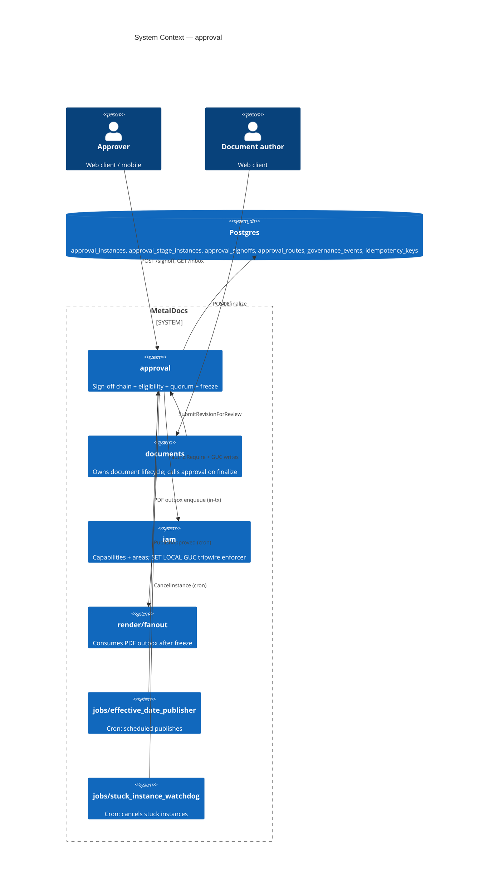
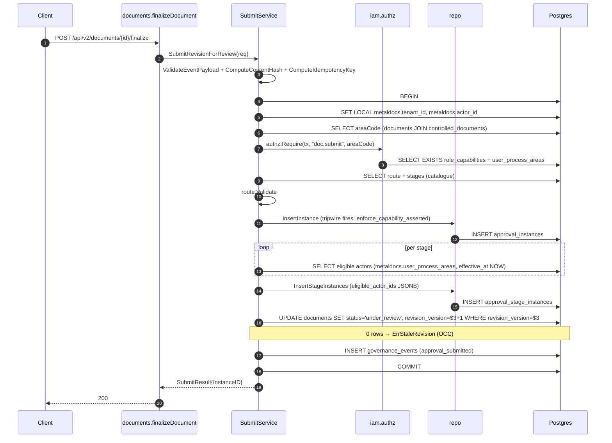
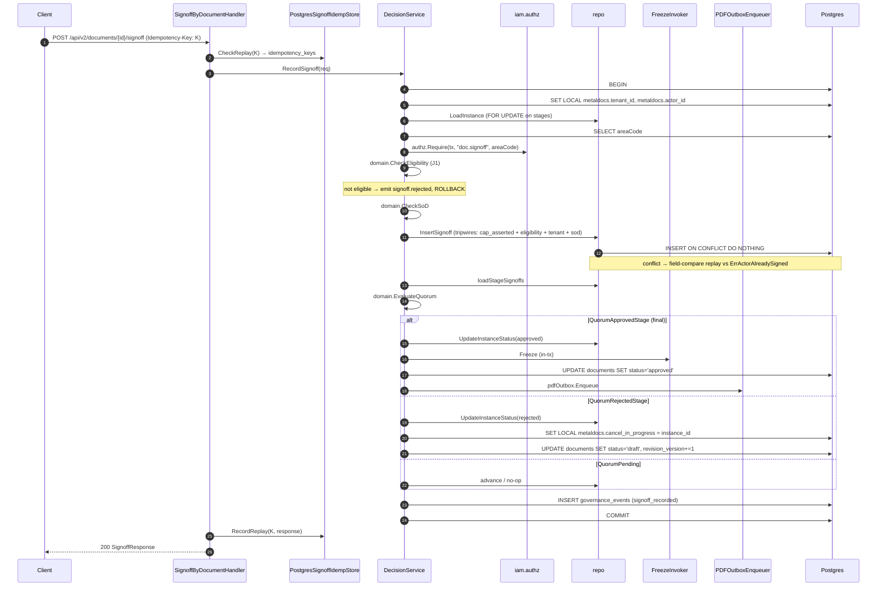

# Module: approval

> Living architecture doc. Shape: Arc42 (12 sections) + C4 (Context/Container/Component) Mermaid diagrams + ADR links.
> Generated by `metaldocs-module-doc` skill. Predecessor stub at git rev `2f11416e:wiki/modules/approval.md` is superseded by this doc.

**Last verified:** 2026-05-10 · **Owner:** unassigned · **Status:** active

---

## 1. Introduction & Goals

The approval module owns the ISO 9001 sign-off chain for controlled documents. It accepts a document's finalize request, snapshots the eligible approver pool per stage, accumulates per-stage signoffs under quorum rules, freezes the approved revision, and emits the governance audit trail. It is the only MetalDocs module today whose mutating SQL is paired with a Postgres tripwire (`enforce_capability_asserted`), making it the canonical defense-in-depth showcase.

### 1.1 Requirements overview

- ISO 9001 segregation of duties: submitter cannot record a signoff on the same revision — source: `wiki/concepts/iso-segregation.md`.
- Two-tier authz with row-level enforcement: `doc.submit` and `doc.signoff` capabilities checked in-tx — source: `wiki/decisions/0007-two-tier-authz.md`.
- Eligibility frozen at submit time (J1): only actors snapshot in `eligible_actor_ids` may sign — source: `wiki/workflows/approval.md`.
- Idempotent signoff replay window of 24h — source: `internal/platform/idempotency` + `migrations/0147_idempotency_keys.sql:16`.
- Atomic freeze + document state transition: approval and freeze occur in the same tx — source: `wiki/workflows/approval.md` "finalize→submit atomicity".

### 1.2 Quality Goals

| Rank | Goal | How verified |
|---|---|---|
| 1 | SoD + eligibility cannot be bypassed | Unit (`domain/sod_test.go`, `domain/eligibility_test.go`) + DB tripwires `enforce_signoff_eligibility_trg` (`migrations/0180:26`) and `enforce_capability_asserted` (`migrations/0142b:201,207`) + integration test `application/submit_eligible_actors_test.go` |
| 2 | Audit trail completeness on regulated path | `governance_events` insert in same tx as state transition (`application/events.go:35`) — submit, signoff (approve/reject), eligibility-rejected all emit |
| 3 | Idempotent signoff under retry | Two-layer replay: HTTP `PostgresSignoffIdempStore` (`infrastructure/postgres_signoff_idemp_store.go:25,42`) + repository `ON CONFLICT (approval_instance_id, actor_user_id) DO NOTHING` field-compare (`repository/postgres_approval_repository.go:127-173`) |

### 1.3 Stakeholders

| Role | Expectation |
|---|---|
| End user (approver) | Inbox shows only documents I'm eligible to sign; signoff is one click + password reauth; replay-safe |
| End user (author) | Reject returns my doc to draft with revision_version bumped; no manual recovery |
| Operator | Tripwire + eligibility trigger fail-closed; governance events sufficient for audit reconstruction |
| Developer | Pure-domain rules (`CheckSoD`, `CheckEligibility`, `EvaluateQuorum`) testable without DB; service layer owns tx boundaries |

---

## 2. Architecture Constraints

- Language / runtime: Go 1.25.
- Persistence: Postgres (per `wiki/architecture/persistence.md`).
- Authz: two-tier per `wiki/decisions/0007-two-tier-authz.md`, plus tier-3 Postgres tripwire on `approval_instances` + `approval_signoffs`.
- Error envelope: **legacy** `{error:{code,message,details,trace_id}}` (NOT RFC 9457 — see T-001).
- HTTP routing: `*http.ServeMux` with Go 1.22 method-prefixed patterns; no OpenAPI codegen for this module (T-002).
- Migrations: forward-only, append-only (per `wiki/architecture/system-overview.md`).
- Outbox idempotency: PDF dispatch enqueued in same tx as approval; consumer dedupes by `(tenant_id, revision_id)` (`internal/modules/render/fanout/pdf_outbox_repository.go:35`).

---

## 3. System Scope & Context (C4 Level 1)



### 3.1 Business Context

The module owns the regulated audit hop. When a document author finalizes a revision, approval freezes the eligible-approver list per stage at that moment (J1 snapshot), drives the per-stage quorum until either all stages clear (instance approved → document approved → freeze + PDF dispatch) or any stage rejects (instance rejected → document reverted to draft, revision bumped). Every transition emits a `governance_events` row in the same tx as the state change, so the audit trail is closed-loop.

### 3.2 Technical Context

Inbound interfaces (16 HTTP routes — see §5.3) plus 5 Go-package consumers per cross-deps artifact §2 (documents, documents/delivery/http, jobs/effective_date_publisher, jobs/stuck_instance_watchdog, iam test only).

Outbound: `internal/modules/iam/authz` (`Require`, `RequireAll`), `internal/modules/iam/domain` (User), `internal/modules/documents/application` (`PDFDispatchInvoker`), `internal/modules/documents/domain` (`ErrDocumentNotFound`), `internal/platform/tenant` (`FromContext`), `internal/platform/idempotency` (`Store`, `Key`), `internal/test` (e2e clock offset).

---

## 4. Solution Strategy

- **Pure-domain rules + thin services.** `domain/sod.go`, `domain/eligibility.go`, `domain/quorum.go` are pure functions, no DB. Service layer (`application/`) owns tx boundaries and translates rule sentinels (`ErrActorNotEligible`, `ErrSoDSubmitterCannotSign`) into HTTP errors. Driver: testability + reuse across submit/signoff/cancel.
- **Defense-in-depth authz on the regulated path** — driver: `wiki/decisions/0007-two-tier-authz.md` and `wiki/concepts/authz-tiers.md`. Tier-1 capability gate (HTTP middleware), tier-2 `authz.Require(ctx, tx, cap, areaCode)` in-tx, tier-3 Postgres tripwire `enforce_capability_asserted` reading GUC `metaldocs.asserted_caps`. J1 adds a 4th layer on signoff: `enforce_signoff_eligibility_trg`.
- **Snapshots over live joins** — driver: regulated audit. Eligibility (`eligible_actor_ids` JSONB), area code (`area_code_snapshot`), quorum policy (`quorum_snapshot`), required role/cap (`*_snapshot` columns) all frozen at submit time so post-fact role rotations don't retroactively mutate audit context.
- **Two-layer idempotency on signoff** — driver: Stripe IP-002 + the regulated path can never double-sign. HTTP `PostgresSignoffIdempStore` keyed by `Idempotency-Key` header; repository `ON CONFLICT (approval_instance_id, actor_user_id) DO NOTHING` + field-compare distinguishes replay from `ErrActorAlreadySigned`.
- **Transactional outbox for PDF dispatch** — driver: freeze must not double-fire if process crashes between commit and dispatch. `pdfOutbox.Enqueue` runs inside the approval tx; `render/fanout` consumes outbox rows out-of-band.

---

## 5. Building Block View (C4 Level 2 — Container)

### 5.1 Whitebox

```mermaid
C4Container
    title Container View — approval
    Container(http, "http/", "Go net/http", "16 routes on *http.ServeMux; legacy error envelope")
    Container(app, "application/", "Go", "16 services: Submit, Decision, Cancel, Publish, Schedule, Read, RouteAdmin, Cutover, Obsolete, Supersede, +helpers (authz_guc, content_hash, idempotency, events)")
    Container(domain, "domain/", "Go (pure)", "Instance, Stage, Signoff, Route + rules (SoD, Eligibility, Quorum, Drift, State)")
    Container(repo, "repository/", "Go + database/sql", "postgresApprovalRepository — 11 methods; pq error mapping")
    Container(infra1, "infra/signature/", "Go", "Pluggable signature providers (PasswordReauth)")
    Container(infra2, "infrastructure/", "Go", "PostgresSignoffIdempStore — Stripe-style idempotency")
    ContainerDb(pg, "Postgres", "5 tables owned + 6 triggers + 4 GUCs")
    ContainerExt(iam, "iam/authz", "Go", "Require, GUC helpers")
    ContainerExt(render, "render/fanout", "Go", "PDF outbox repository")

    Rel(http, app, "calls services")
    Rel(http, infra2, "CheckReplay/RecordReplay")
    Rel(app, domain, "CheckSoD, CheckEligibility, EvaluateQuorum")
    Rel(app, repo, "Insert/Load/Update")
    Rel(app, iam, "authz.Require(tx, cap, area)")
    Rel(app, render, "pdfOutbox.Enqueue (in-tx)")
    Rel(repo, pg, "SQL + tripwires")
```

### 5.2 Public surface

Source: surface scan §2 (~110 exported symbols — most undocumented, see T-010).

| File | Symbol | Kind | Purpose |
|---|---|---|---|
| `internal/modules/documents/approval/domain/sod.go:15` | `CheckSoD` | func | Pure SoD rule (submitter ≠ approver) |
| `internal/modules/documents/approval/domain/eligibility.go:11` | `CheckEligibility` | func | Pure J1 rule against `EligibleActorIDs` snapshot |
| `internal/modules/documents/approval/domain/quorum.go:33` | `EvaluateQuorum` | func | Returns `QuorumApprovedStage` / `QuorumRejectedStage` / `QuorumPending` |
| `internal/modules/documents/approval/domain/route.go:39` | `Route` + `Validate` | type/method | Route + stage structural rules |
| `internal/modules/documents/approval/domain/instance.go:58` | `Instance` | type | Aggregate root with `AdvanceStage`/`RejectHere`/`Cancel` |
| `internal/modules/documents/approval/domain/signoff.go:22` | `Signoff` | type | Private fields + getters; `MarshalJSON` |
| `internal/modules/documents/approval/domain/state.go:9` | `DocState` + `IsLegalTransition` | type/func | Document state machine rules |
| `internal/modules/documents/approval/application/submit_service.go:43` | `SubmitRevisionForReview` | method | draft → under_review + instance create + eligibility snapshot |
| `internal/modules/documents/approval/application/decision_service.go:88` | `RecordSignoff` | method | Eligibility + SoD + quorum + freeze + outbox |
| `internal/modules/documents/approval/application/cancel_service.go:47` | `CancelInstance` | method | Operator/system-initiated cancel |
| `internal/modules/documents/approval/application/publish_service.go:44` | `PublishApproved` | method | approved → published |
| `internal/modules/documents/approval/application/publish_service.go:166` | `SchedulePublish` | method | approved → scheduled with `effective_at` |
| `internal/modules/documents/approval/application/scheduler_service.go:41` | `RunDuePublishes` | method | Cron worker for scheduled publishes |
| `internal/modules/documents/approval/application/obsolete_service.go:42` | `MarkObsolete` | method | published\|superseded → obsolete |
| `internal/modules/documents/approval/application/supersede_service.go:40` | `PublishSuperseding` | method | Atomic publish-as-superseder |
| `internal/modules/documents/approval/application/cutover_service.go:39` | `ValidateLegacyCutoverReady` | method | Legacy-state purge guard |
| `internal/modules/documents/approval/application/read_service.go:153` | `ListInboxItems` | method | Inbox JOIN + signoff-count subquery |
| `internal/modules/documents/approval/application/read_service.go:224` | `CountPendingForActor` | method | Pagination total |
| `internal/modules/documents/approval/application/route_admin_service.go:16` | `RouteAdminService` | type | Create/Update/Deactivate routes |
| `internal/modules/documents/approval/application/authz_guc.go:11` | `setAuthzGUC` (private) | func | SET LOCAL `metaldocs.tenant_id` + `metaldocs.actor_id` |
| `internal/modules/documents/approval/application/content_hash.go:35` | `ComputeContentHash` | func | Canonical signoff payload hash |
| `internal/modules/documents/approval/application/idempotency.go:25` | `ComputeIdempotencyKey` | func | Submit-path idempotency derivation |
| `internal/modules/documents/approval/application/events.go:24` | `EventEmitter` | iface | Same-tx governance event sink |
| `internal/modules/documents/approval/application/services.go:29` | `Services` | type | Composition root for module services |
| `internal/modules/documents/approval/repository/approval_repository.go:28` | `ApprovalRepository` | iface | 9 methods: Insert*/Load*/Update*/ListScheduledDue |
| `internal/modules/documents/approval/repository/postgres_approval_repository.go:20` | `NewPostgresApprovalRepository` | func | Postgres impl ctor |
| `internal/modules/documents/approval/infrastructure/postgres_signoff_idemp_store.go:14` | `PostgresSignoffIdempStore` | type | Stripe-style HTTP idempotency over `metaldocs.idempotency_keys` |
| `internal/modules/documents/approval/infra/signature/password_reauth.go:53` | `PasswordReauthProvider` | type | Pluggable signature provider (rate-limited) |
| `internal/modules/documents/approval/http/handler.go:56` | `Handler` + `NewHandler` | type/func | Aggregates 16 HTTP handlers + injected services |
| `internal/modules/documents/approval/http/router.go:6` | `RegisterRoutes` | method | Mounts 16 routes onto `*http.ServeMux` |
| `internal/modules/documents/approval/http/contracts/*.go` | DTOs | types | Request/response shapes; `Decode` (strictjson); validators |

Remaining symbols enumerated in surface scan §2 (`_artifacts/01-surface.md`).

### 5.3 HTTP operations

Source: `_artifacts/01-surface.md` §3. Wired via `internal/modules/documents/approval/http/router.go:6-30`. Composition root: `apps/api/cmd/metaldocs-api/main.go:331-332`.

| Method | Path | Handler | Authz area / cap |
|---|---|---|---|
| POST | `/api/v2/documents/{id}/submit` | `SubmitHandler` (`submit_handler.go:14`) | `doc.submit` + areaCode |
| POST | `/api/v2/approval/instances/{instance_id}/stages/{stage_id}/signoffs` | `SignoffHandler` (`signoff_handler.go:18`) | `doc.signoff` + areaCode |
| POST | `/api/v2/documents/{id}/signoff` | `SignoffByDocumentHandler` (`doc_approval_handler.go:51`) | `doc.signoff` + areaCode |
| POST | `/api/v2/documents/{id}/publish` | `PublishHandler` (`publish_handler.go:30`) | `doc.publish` |
| POST | `/api/v2/documents/{id}/schedule-publish` | `SchedulePublishHandler` (`publish_handler.go:69`) | `doc.publish` |
| POST | `/api/v2/documents/{id}/supersede` | `SupersedeHandler` (`supersede_handler.go:21`) | `doc.publish` |
| POST | `/api/v2/documents/{id}/obsolete` | `ObsoleteHandler` (`obsolete_handler.go:21`) | `doc.obsolete` |
| POST | `/api/v2/approval/instances/{instance_id}/cancel` | `CancelHandler` (`cancel_handler.go:21`) | `doc.cancel` |
| POST | `/api/v2/documents/{id}/cancel` | `CancelByDocumentHandler` (`doc_approval_handler.go:146`) | `doc.cancel` |
| GET | `/api/v2/approval/instances/{instance_id}` | `GetInstanceHandler` (`get_instance_handler.go:14`) | tier-1 only |
| GET | `/api/v2/documents/{id}/approval-instance` | `GetInstanceByDocumentHandler` (`doc_approval_handler.go:16`) | tier-1 only |
| GET | `/api/v2/approval/inbox` | `InboxHandler` (`inbox_handler.go:15`) | tier-1 only (JSONB `@>` actor scoping) |
| POST | `/api/v2/approval/routes` | `CreateRouteHandler` (`route_admin_handler.go:16`) | `route.admin` |
| PUT | `/api/v2/approval/routes/{id}` | `UpdateRouteHandler` (`route_admin_handler.go:59`) | `route.admin` |
| DELETE | `/api/v2/approval/routes/{id}` | `DeactivateRouteHandler` (`route_admin_handler.go:108`) | `route.admin` |
| GET | `/api/v2/approval/routes` | `ListRoutesHandler` (`route_admin_handler.go:144`) | `route.admin` |

---

## 6. Runtime View

### 6.1 SubmitRevisionForReview (state-transition)

Source: `_artifacts/02-flow-submit.md`. Two upstream entries: documents-module `finalizeDocument` (`internal/modules/documents/delivery/http/handler.go:316`) and approval-module `SubmitHandler` (`http/submit_handler.go:14`). Both call `application/submit_service.go:43`.



State transitions:

| Entity | From | To | Trigger | Authz cap |
|---|---|---|---|---|
| `documents.status` | `draft` | `under_review` | `SubmitRevisionForReview` UPDATE (`submit_service.go:168`) | `doc.submit` |
| `approval_instances.status` | (none) | `in_progress` | `InsertInstance` (`postgres_approval_repository.go:33`) | `doc.submit` |
| `approval_stage_instances.status` | (none) | `active` (first stage) / `pending` (others) | `InsertStageInstances` | `doc.submit` |

Failure modes:

| Condition | HTTP | Error code (legacy envelope) |
|---|---|---|
| Missing `doc.submit` capability | 403 | `authz.forbidden` |
| Stale revision (concurrent edit) | 409 | `state.stale_revision` |
| Validation (route invalid, payload float) | 422 | `validation.*` |

### 6.2 RecordSignoff (write — quorum + freeze + reject)

Source: `_artifacts/02-flow-signoff.md`.



State transitions:

| Entity | From | To | Trigger | Authz cap |
|---|---|---|---|---|
| `approval_stage_instances.status` | `active` | `completed` | quorum approved (`decision_service.go:259`) | `doc.signoff` |
| `approval_instances.status` | `in_progress` | `approved` | final stage approved (`decision_service.go:275`) | `doc.signoff` |
| `documents.status` | `under_review` | `approved` | approval branch (`decision_service.go:293`) | `doc.signoff` |
| `approval_stage_instances.status` | `active` | `rejected_here` | quorum rejected (`decision_service.go:322`) | `doc.signoff` |
| `approval_instances.status` | `in_progress` | `rejected` | rejection branch (`decision_service.go:325`) | `doc.signoff` |
| `documents.status` | `under_review` | `draft` | rejection branch + cancel GUC (`decision_service.go:334,343`) | `doc.signoff` |

Failure modes:

| Condition | HTTP | Code (legacy envelope) |
|---|---|---|
| Missing `doc.signoff` | 403 | `authz.forbidden` |
| `ErrActorNotEligible` (J1) | 403 | `signoff.not_eligible` (`http/errors.go:48`) |
| `ErrSoDSubmitterCannotSign` | 403 | `signoff.sod_submitter` |
| Already signed (different content_hash) | 409 | `signoff.actor_already_signed` |
| Re-signoff after instance approved | **500** (T-003 — should be 409) | `internal.unknown` |
| Replay (same key + content_hash) | 200 | `was_replay=true` |

### 6.3 ListInboxItems (read)

Source: `_artifacts/02-flow-inbox.md`. No service-layer tx; two raw `db.QueryContext` calls. Snapshot-drift risk between list + count flagged as T-005.


No state changes. No `authz.Require` (tier-1 + JSONB containment scoping only).

---

## 7. Deployment View

- Binary: single Go server `apps/api/cmd/metaldocs-api/main.go` (port `:8081` — see `wiki/references/local-dev-startup.md`).
- Composition root wiring (`apps/api/cmd/metaldocs-api/main.go:299-352`): repository, sql emitter, Services struct, DecisionService overlay with `WithPDFOutbox`, signoff idempotency store, route registration, two cron jobs (effective_date_publisher + stuck_instance_watchdog) gated by env flags.
- Migrations: top-level `migrations/` dir (NOT module-local); 18 migrations affect approval-owned tables (see surface scan §4).
- Environment (cross-deps §4):
  - `METALDOCS_FANOUT_URL` (optional; if unset, `noopFreezeInvoker` wired and freeze-step warns)
  - `ENABLE_JOB_EFFECTIVE_DATE_PUBLISHER` (optional flag)
  - `ENABLE_JOB_STUCK_INSTANCE_WATCHDOG` (optional flag)
- No `os.Getenv` calls inside the module itself; all env reads in `main.go`.

---

## 8. Cross-cutting Concepts

### 8.1 Authentication & Authorization

Three layers on the regulated path (defense-in-depth, IP-004):

- **Tier-1 (HTTP edge):** `CapabilityService.CanDo` — applied by upstream auth middleware (`wiki/modules/auth.md`). Verifies session and capability presence before the handler runs.
- **Tier-2 (in-tx):** `authz.Require(ctx, tx, cap, areaCode)` at `submit_service.go:85` (`doc.submit`) and `decision_service.go:141` (`doc.signoff`). Sets GUC `metaldocs.asserted_caps` for the tripwire. Backed by `metaldocs.role_capabilities` + `metaldocs.user_process_areas` joins.
- **Tier-3 (Postgres tripwire):** `enforce_capability_asserted` (`migrations/0142b_role_capabilities_v2_enforce.sql:201,207`) — `BEFORE INSERT` on `public.approval_instances` + `public.approval_signoffs`. SECURITY DEFINER; reads GUC `metaldocs.asserted_caps`. Fail-closed: aborts the INSERT if the asserting capability is missing.
- **J1 eligibility (4th layer, signoff-only):** `enforce_signoff_eligibility_trg` (`migrations/0180_signoff_eligibility_trigger.sql:26`) — `BEFORE INSERT ON approval_signoffs`. Checks `eligible_actor_ids @> actor_user_id` on the parent stage row.

GUC writes by Go (`_artifacts/04-persistence.md` §3):
- `setAuthzGUC` writes `metaldocs.tenant_id` + `metaldocs.actor_id` (`application/authz_guc.go:12,15`).
- Reject branch + cancel path write `metaldocs.cancel_in_progress` (`decision_service.go:334`, `cancel_service.go:111`) — whitelisted by `enforce_document_transition` (`migrations/0144_cancel_state.sql:61`) to permit `under_review → draft`.

The iam-side `AuthorizationService` (`internal/modules/iam/application/authorization.go`) is unwired and not consumed here — see iam-tech-debt T-003 and approval-tech-debt T-012 for cross-module pointer.

### 8.2 Error envelope

Legacy `contracts.ErrorResponse{Error: ErrorBody{Code, Message, Details, TraceID}}` (`http/contracts/errors.go:3-12`). NOT RFC 9457 (T-001). Validation classifier `looksLikeValidationError` (`http/errors.go:181`) does substring match — fragile (T-003).

### 8.3 Idempotency

Two layers on signoff:
- HTTP: `Idempotency-Key` header → `PostgresSignoffIdempStore.CheckReplay` / `RecordReplay` (`infrastructure/postgres_signoff_idemp_store.go:25,42`); store backed by `metaldocs.idempotency_keys` (24h `expires_at`).
- Repository: `INSERT … ON CONFLICT (approval_instance_id, actor_user_id) DO NOTHING` + `LoadSignoffByActor` field-compare (`postgres_approval_repository.go:127-173`) — replay returns prior `Signoff`; differing stage/decision/content_hash returns `ErrActorAlreadySigned`.

Submit derives a deterministic key (`application/idempotency.go:25`) stored on `approval_instances.idempotency_key` with UNIQUE `(document_v2_id, idempotency_key)`.

### 8.4 Pagination

`limit`/`offset` only on inbox (`parseInboxLimit`/`parseInboxOffset`, `http/inbox_handler.go`). Two-query `LIMIT/OFFSET + COUNT` pattern with snapshot drift between the two SELECTs — T-005.

### 8.5 Logging & Observability

Per index IP-007: observability stack not wired in MetalDocs. Module does not assume it. Standard `log/slog` only.

### 8.6 Concurrency / Transactions

- Tx ownership: `application/` services start the tx (`db.BeginTx`); repository methods accept `*sql.Tx`.
- `LoadInstance` acquires `SELECT … FOR UPDATE` on stage rows (`postgres_approval_repository.go:316`) — J1 lock against concurrent re-snapshot.
- Submit path uses optimistic concurrency on `documents` UPDATE: `WHERE revision_version = $3` returns 0 rows on stale, surfaced as `repository.ErrStaleRevision` (`submit_service.go:184`).
- DecisionService wraps `authz.WithCapCache` on the ctx for cap-cache reuse within the tx.

### 8.7 Transactional outbox (PDF dispatch)

`pdfOutbox.Enqueue` (`internal/modules/render/fanout/pdf_outbox_repository.go:25`) runs inside the same tx as `RecordSignoff` final-stage approval. INSERT uses `ON CONFLICT (tenant_id, revision_id) DO NOTHING`. Consumer (`render/fanout` job) drains out-of-band. Deprecated post-commit `PDFDispatchInvoker` path remains compiled — T-004.

---

## 9. Architecture Decisions

| Decision | Link / Status |
|---|---|
| Two-tier authz (capability + areaCode) | `wiki/decisions/0007-two-tier-authz.md` |
| Tripwire as tier-3 enforcer on approval tables | `wiki/decisions/0007-two-tier-authz.md` (amendment); migration `0142b_role_capabilities_v2_enforce.sql:201-209` |
| ISO 9001 segregation of duties | `wiki/concepts/iso-segregation.md` |
| J1 eligibility snapshot at submit | `wiki/workflows/approval.md` (§J1); migration `0180_signoff_eligibility_trigger.sql` |
| Reject path returns doc to draft (not rolled-back instance) | `wiki/workflows/approval.md` |
| Two-layer signoff idempotency (HTTP + repo) | tech-debt: missing-ADR |
| Transactional outbox for PDF dispatch | tech-debt: missing-ADR |
| Legacy error envelope (not RFC 9457) | tech-debt: missing-ADR (T-001) |
| Routes wired manually on `*http.ServeMux` (no codegen) | tech-debt: missing-ADR (T-002) |
| Inbox uses two-query LIMIT/OFFSET+COUNT | tech-debt: missing-ADR (T-005) |
| `setAuthzGUC` over `WithMembershipContext` | tech-debt: missing-ADR (T-011) |

---

## 10. Quality Requirements

| Goal | Scenario | Pass criteria |
|---|---|---|
| SoD bypass | Author of revision attempts to sign their own revision | 403 `signoff.sod_submitter` from domain rule; if app layer bypassed, tripwire `enforce_capability_asserted` aborts INSERT; if cap forged, `enforce_signoff_eligibility_trg` checks JSONB; no row written |
| Eligibility (J1) | User not in `eligible_actor_ids` at submit time attempts signoff after being granted role | 403 `signoff.not_eligible`; `governance_events` row with `reason=not_eligible` |
| Idempotency | Same `Idempotency-Key` retried after network failure | 200 with `was_replay=true`; no duplicate row in `approval_signoffs`; original response body returned from `metaldocs.idempotency_keys` |
| Audit completeness | Successful signoff | Single `governance_events` row per state transition, in same tx as the transition (rollback drops both) |
| Stale revision under concurrent edit | Two finalize calls race on same `revision_version` | Loser receives 409 `state.stale_revision`; `documents` row reflects winner only |
| Reject atomicity | Quorum rejected on stage 2 of 3 | `approval_instances.status='rejected'`, `documents.status='draft'`, `revision_version+=1`, audit event — all in one commit |

---

## 11. Risks & Technical Debt

Pointer-only. Body lives in `wiki/modules/approval-tech-debt.md`. Severity rubric (concrete triggers) lives in the same file.

- Critical: 2
- Major: 4
- Minor: 6

Top 3 (by severity, then by blast-radius):
1. Legacy error envelope across the entire approval HTTP surface — affects every error path frontend parses — see tech-debt §T-001.
2. Signoff & cancel doc-scoped routes absent from OpenAPI — frontend hand-rolls types; future migration to codegen blocked — see tech-debt §T-002.
3. `looksLikeValidationError` substring classifier returns 500 instead of 409 on completed-instance signoff — measurable user impact on regulated path — see tech-debt §T-003.

---

## 12. Glossary

| Term | Definition |
|---|---|
| Route | Tenant-scoped catalogue entry: ordered list of stages, each with quorum policy and required capability/area |
| Stage | One step in a route; carries quorum (`any_1`, `m_of_n`, `all_of`), eligibility snapshot, drift policy |
| Instance | Live execution of a route against a specific document revision |
| Stage instance | Live execution of a stage; holds `eligible_actor_ids` snapshot taken at submit |
| Signoff | One actor's decision (approve/reject) on a stage instance, with signature method + content hash |
| Quorum | Per-stage rule that decides when stage is `completed` / `rejected_here` / `pending` |
| J1 | Eligibility-snapshot rule: only actors snapshot in `eligible_actor_ids` may sign |
| SoD | Segregation of Duties — submitter cannot sign their own revision (ISO 9001) |
| Tripwire | Postgres `BEFORE INSERT` trigger that aborts the statement if a GUC-asserted condition fails |
| GUC | Postgres "Grand Unified Configuration" — session/tx-local key/value, set via `set_config(_, _, true)` |
| Outbox | Same-tx side-effect queue (`metaldocs.pdf_dispatch_outbox`); decouples freeze from PDF dispatch |
| Cap cache | Per-tx capability-check cache (`authz.WithCapCache`) avoiding repeated `role_capabilities` joins |

---

## Cross-links

- Related ADRs: `wiki/decisions/0007-two-tier-authz.md`
- Related concepts: `wiki/concepts/iso-segregation.md`, `wiki/concepts/authz-tiers.md`, `wiki/concepts/error-ux.md`, `wiki/concepts/placeholders.md` (revision lifecycle)
- Related workflows: `wiki/workflows/approval.md`, `wiki/workflows/freeze-and-fanout.md`
- Related modules: `wiki/modules/documents.md`, `wiki/modules/auth.md`, `wiki/modules/iam.md`, `wiki/modules/iam-tech-debt.md`
- Template authoring upstream: [`wiki/modules/templates_v2.md`](templates_v2.md) — §8.7 / §1.1 defines `author_id`, `reviewer_id`, `approver_id` columns as the SoD probe surface; `TemplateAuthorChecker` in `iam.AuthorizationService` reads these to enforce submitter ≠ approver identity
- See also: [`modules/audit.md`](audit.md) — approval does not emit `audit.*` action strings today (no `approval.*` entries in the action catalogue); governance events go to `governance_events` table in the same tx instead. Latent gap if a separate regulated audit trail is required. See `wiki/modules/audit.md` §3 C4 context.
- Backlog: `wiki/backlog/approval-refactor.md`, `wiki/backlog/caixa-aprovacao.md` (frontend deferred items)
- Tech debt: `wiki/modules/approval-tech-debt.md`

## Changelog (this doc)

- 2026-05-10 — initial publish via `metaldocs-module-doc` skill (Arc42 + C4); supersedes prior stub. Inbox UI section migrated to `wiki/backlog/caixa-aprovacao.md` (already exists).
