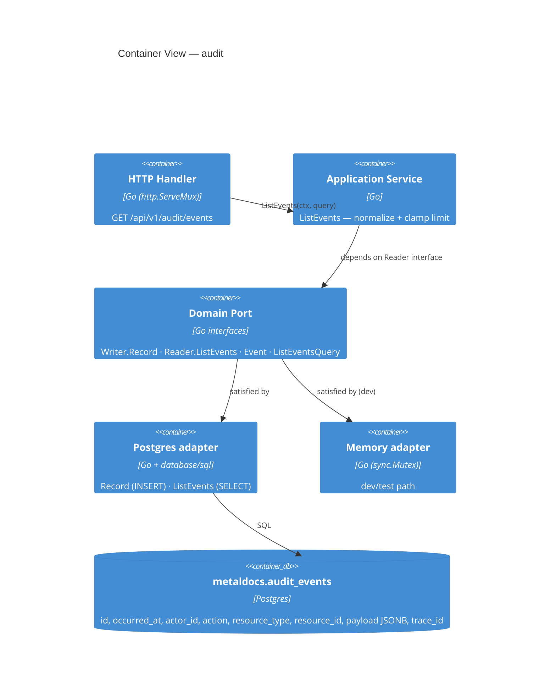
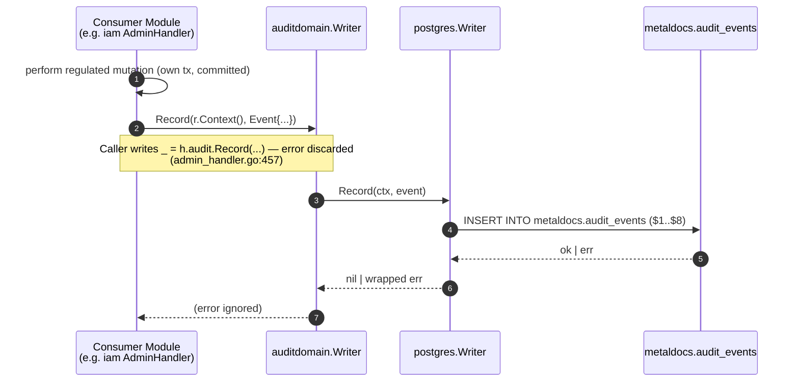
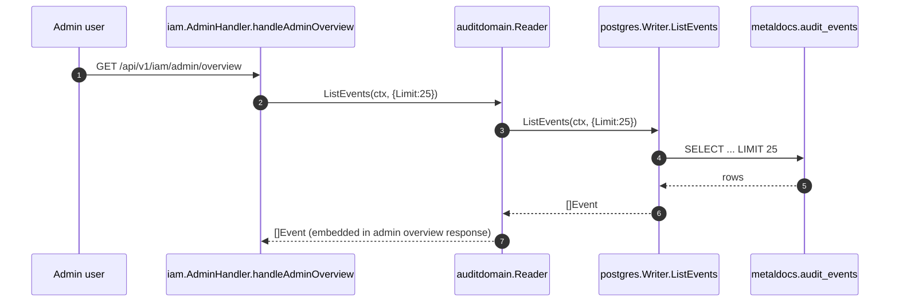

# Module: audit

> Living architecture doc. Arc42 (12 sections) + C4 (Context / Container) Mermaid diagrams + ADR links.

**Last verified:** 2026-05-12 · **Owner:** unassigned · **Status:** active (intrinsic gaps; see §11)

> **Key files:**
> - `internal/modules/audit/domain/port.go:8-31` — `Event`, `ListEventsQuery`, `Writer`, `Reader`
> - `internal/modules/audit/application/service.go:18` — `Service.ListEvents` (limit clamp [1..200] default 50)
> - `internal/modules/audit/delivery/http/handler.go:34` — `RegisterRoutes` (`GET /api/v1/audit/events`)
> - `internal/modules/audit/infrastructure/postgres/writer.go:20,44` — `Record` (INSERT) + `ListEvents` (SELECT)
> - `migrations/0004_init_audit_events.sql:1` — `metaldocs.audit_events` table
> - `migrations/0005_grant_workflow_audit_privileges.sql:2` — INSERT grant to `metaldocs_app`
> - `apps/api/cmd/metaldocs-api/main.go:193` — route registration site
> - `apps/api/cmd/metaldocs-api/main.go:445-479` — `documentsV2AuditAdapter`

---

## 1. Introduction & Goals

`internal/modules/audit` is the regulated-action **append-only event sink** plus a thin read-only query surface. Consumer modules call `auditdomain.Writer.Record(ctx, Event)` after performing a regulated mutation (IAM admin ops, document lifecycle transitions, exports); admin/IAM UIs read recent rows via `auditdomain.Reader.ListEvents`. Storage is a single Postgres table `metaldocs.audit_events` (migration 0004). The module deliberately has **no aggregate, no state machine, and no transactional boundary of its own** — it is a side-effect sink whose callers have already enforced capability.

### 1.1 Requirements overview

- **Regulated mutation logging** — ISO 9001 §7.5 / QMS controls require traceability of identity, document, and approval changes. Source: `wiki/concepts/iso-segregation.md`.
- **Append-only durability** — events are not editable or deletable through the application; `metaldocs_app` has only `INSERT` (`migrations/0005_grant_workflow_audit_privileges.sql:2`).
- **Time-ordered query** — by occurrence, by actor, or by `(resource_type, resource_id)`; three btree indexes back the access patterns (`migrations/0004_init_audit_events.sql:12-14`).
- **Trace correlation** — every event carries an HTTP `trace_id` for cross-system join (`internal/modules/audit/domain/port.go:16`).
- **Process-internal port** — `Writer`/`Reader` are Go interfaces so consumers depend on `auditdomain` and not on Postgres (`port.go:25-31`).

### 1.2 Quality Goals

| Rank | Goal | How verified |
|---|---|---|
| 1 | **Tamper-resistance of the event log** | grant audit (only INSERT to app role); see §10 — currently passes at app layer, fails at DBA layer (T-004) |
| 2 | **Coverage of regulated actions** | callers must call `Record` on every regulated mutation; see consumer registers (auth T-002, iam T-005, documents T-005) |
| 3 | **Read confidentiality** | only authorised admin can read `/api/v1/audit/events`; currently fails (T-001) |

### 1.3 Stakeholders

| Role | Expectation |
|---|---|
| Compliance auditor | Read-only access to a complete, ordered, tamper-evident trail of regulated mutations. |
| System admin | UI showing 25 most recent events on the IAM admin overview. |
| Module author (consumer) | A single port `auditdomain.Writer.Record(ctx, Event)`; failure must not roll back the regulated action. |

---

## 2. Architecture Constraints

- Language / runtime: Go 1.25
- Persistence: Postgres, table `metaldocs.audit_events` (schema-qualified, not `public`)
- API contract: OpenAPI 3.0.3 declares `/audit/events` at `api/openapi/v1/openapi.yaml:1058-1103` (no `operationId` — T-008)
- HTTP routing: `http.ServeMux.HandleFunc` directly — NOT oapi-codegen (`handler.go:35`)
- Error envelope: legacy `{error:{code,message,details,trace_id}}` (not RFC 9457 — T-002)
- Append-only by grant only — `INSERT` grant exclusively (`migrations/0005:2`); no application-layer UPDATE/DELETE path

---

## 3. System Scope & Context (C4 Level 1)


### 3.1 Business Context

A QMS auditor needs to prove **what happened, who did it, when, in what order**. The audit module is the system's only durable answer to that. Today the trail is partially populated (documents + IAM admin + exports emit events; auth identity events do not — see §11).

### 3.2 Technical Context

Inbound interfaces (Go):
- `auditdomain.Writer.Record(ctx, Event) error` — called by 4 consumer touch points (iam admin handler, documents/application service, documents/application export service, IAM admin via adapter).
- `auditdomain.Reader.ListEvents(ctx, query) ([]Event, error)` — called by iam `AdminHandler.handleAdminOverview` (`internal/modules/iam/delivery/http/admin_handler.go:128`) for the recent-25 panel.

Inbound interfaces (HTTP):
- `GET /api/v1/audit/events?resourceType=&resourceId=&limit=` — public list (T-001: no authz).

Outbound interfaces:
- DB: `metaldocs.audit_events` only — single owned table, no FKs, no triggers.
- No other Go modules called.

---

## 4. Solution Strategy

- **Domain port + concrete adapters.** `Writer`/`Reader` defined in `domain/port.go`; postgres and in-memory adapters injected via platform bootstrap. Lets consumers depend on `auditdomain` only.
- **Append-only via grant, not via trigger or RLS.** `metaldocs_app` gets `INSERT` only (`migrations/0005:2`). Simpler than a forbid-update trigger; weaker (DBA bypass — T-004). Driver: minimal complexity until tamper-evidence is needed.
- **Fire-and-forget write contract.** Caller's regulated action commits its own tx FIRST; audit Record is a separate, post-hoc call that returns an error the caller ignores. Driver: audit failure must never roll back a regulated state change. Cost: dropped audit emissions are silent (T-005).
- **One handler-mounted route, not codegen.** `handler.RegisterRoutes` wires `mux.HandleFunc` directly. Driver: pre-dates the contract-first migration (ADR 0012); audit was never re-mounted under oapi-codegen.
- **Same `*postgres.Writer` serves both `Writer` and `Reader`.** Bootstrap wires `auditpg.NewWriter(db)` into both interface slots (`bootstrap/api.go:100-101`). Driver: simplicity; cost: nothing today.

---

## 5. Building Block View (C4 Level 2 — Container)

### 5.1 Whitebox — audit



### 5.2 Public surface

| File | Symbol | Kind | Purpose |
|---|---|---|---|
| `internal/modules/audit/domain/port.go:8` | `Event` | struct | one audited mutation: `ID`, `OccurredAt`, `ActorID`, `Action`, `ResourceType`, `ResourceID`, `PayloadJSON`, `TraceID` |
| `internal/modules/audit/domain/port.go:19` | `ListEventsQuery` | struct | filter: `ResourceType`, `ResourceID`, `Limit` |
| `internal/modules/audit/domain/port.go:25` | `Writer` | iface | `Record(ctx, Event) error` |
| `internal/modules/audit/domain/port.go:29` | `Reader` | iface | `ListEvents(ctx, query) ([]Event, error)` |
| `internal/modules/audit/application/service.go:10` | `Service` | struct | wraps a `Reader` |
| `internal/modules/audit/application/service.go:14` | `NewService(reader)` | func | constructor |
| `internal/modules/audit/application/service.go:18` | `Service.ListEvents` | method | normalize + clamp `Limit` to `[1..200]`, default 50 |
| `internal/modules/audit/delivery/http/handler.go:15` | `Handler` | struct | HTTP wrapper |
| `internal/modules/audit/delivery/http/handler.go:19` | `EventResponse` | struct | wire shape: `id`, `occurredAt` (RFC3339 UTC), `actorId`, `action`, `resourceType`, `resourceId`, `payload` (decoded), `traceId` |
| `internal/modules/audit/delivery/http/handler.go:30` | `NewHandler(service)` | func | constructor |
| `internal/modules/audit/delivery/http/handler.go:34` | `Handler.RegisterRoutes` | method | mounts `GET /api/v1/audit/events` on a `*http.ServeMux` |
| `internal/modules/audit/infrastructure/postgres/writer.go:12,16,20,44` | `postgres.Writer`, `NewWriter`, `Record`, `ListEvents` | type + methods | Postgres adapter (satisfies both Writer + Reader) |
| `internal/modules/audit/infrastructure/memory/writer.go:11,16,20,27` | `memory.Writer`, `NewWriter`, `Record`, `ListEvents` | type + methods | in-process adapter for dev/tests |

### 5.3 HTTP operations

| Method | Path | OperationID | Handler | Authz |
|---|---|---|---|---|
| GET | `/api/v1/audit/events` | _missing_ (T-008) | `Handler.handleEvents` (`handler.go:38`) | **none** (T-001) |

## API Route Truth Table (Plan 8 Baseline)

| Method | Path | Runtime owner (file:line) | Handler method | Spec path | operationId | Codegen method | Status | Notes |
|---|---|---|---|---|---|---|---|---|
| GET | `/api/v1/audit/events` | `internal/modules/audit/delivery/http/handler.go:36` | `handleEvents` | `/audit/events` | — | — | Aligned | Spec server is `/api/v1`; operationId not defined. |

- Module contract status: Partial
- Owner: leandro

---

## 6. Runtime View (selected scenarios)

State transitions: **n/a — append-only sink, no aggregate lifecycle.**

### 6.1 Record (write path)



Failure modes:

| Condition | Caller observable | Trail effect |
|---|---|---|
| INSERT fails (constraint / connection) | _none — error discarded_ (T-005) | event silently lost |
| Caller's `id` generation collides (`evt_<timestamp>`) | INSERT returns `unique_violation` (PK) | event silently lost (T-006) |
| Postgres unavailable | _none_ | event lost; regulated action persisted (intentional decoupling) |

### 6.2 ListEvents (read path — `GET /api/v1/audit/events`)

```mermaid
sequenceDiagram
    autonumber
    participant C as Client (any caller; T-001)
    participant H as Handler.handleEvents
    participant S as Service.ListEvents
    participant PG as postgres.Writer.ListEvents
    participant DB as metaldocs.audit_events
    C->>H: GET /api/v1/audit/events?resourceType&resourceId&limit
    H->>H: parse limit (400 on parse fail)
    H->>S: ListEvents(ctx, query)
    S->>S: clamp Limit to [1..200] (default 50)
    S->>PG: ListEvents(ctx, normalized)
    PG->>DB: SELECT ... WHERE ($1='' OR resource_type=$1) AND ($2='' OR resource_id=$2) ORDER BY occurred_at DESC, id DESC LIMIT $3
    DB-->>PG: rows
    PG-->>S: []Event
    S-->>H: []Event
    H-->>C: 200 {"items":[EventResponse...]} | legacy {"error":{...}} on err
```

Failure modes — reference `wiki/concepts/error-ux.md`:

| Condition | HTTP | Envelope `code` | Note |
|---|---|---|---|
| Wrong method | 405 | _no body_ | `w.WriteHeader(http.StatusMethodNotAllowed)` (`handler.go:40`) |
| Bad `limit` | 400 | `VALIDATION_ERROR` | legacy envelope (T-002) |
| Repo error | 500 | `INTERNAL_ERROR` | legacy envelope (T-002) |

### 6.3 IAM admin recent-events read (internal Reader consumer)



Wiring: `iamdelivery.NewAdminHandler(..., deps.AuditWriter).WithAuditReader(deps.AuditReader)` at `apps/api/cmd/metaldocs-api/main.go:182-183`. The IAM handler holds an `auditdomain.Reader` field; this is the only second-class consumer of the Reader port today.

---

## 7. Deployment View

- Binary: single Go server (`apps/api/cmd/metaldocs-api`)
- Process: one container, port `:8081`
- Migrations: applied at startup (forward-only); files `migrations/0004_init_audit_events.sql`, `migrations/0005_grant_workflow_audit_privileges.sql`
- Environment: **no audit-specific env vars or config keys** (Phase 3 §4 found zero) — retention, max-payload, and tamper-evidence are all latent debt rather than gated by config

---

## 8. Cross-cutting Concepts

### 8.1 Authentication & Authorization
- **Tier 1 (HTTP edge):** none on `/api/v1/audit/events` — the permission resolver returns `("", false)` and the public-path checker treats unregistered paths as public (`apps/api/cmd/metaldocs-api/permissions.go:211-221`). → T-001.
- **Tier 2 (in-tx):** n/a — no `authz.Require` call paths in audit (append-only sink is outside the tripwire model; see `_artifacts/04-persistence.md` §5 footnote).
- **Postgres tripwire:** does not apply. The tripwire enforces caller-side capability before mutation; the audit Record records what already happened. The repo `Record` does NOT call `metaldocs.assert_caps` and is not expected to.

### 8.2 Error envelope
- Audit emits the **legacy** envelope `{"error":{"code","message","details","trace_id"}}` (`handler.go:97-105`). Not RFC 9457 Problem Details. → T-002.
- Success body is `{"items":[EventResponse...]}` (not a `data` wrapper — also a contract drift the API-design-system doc flags for v2 read surfaces).

### 8.3 Idempotency
- **Write path:** no idempotency key. The application generates `id = "evt_" + UTC timestamp formatted with nanos` (`admin_handler.go:458`, `main.go:467`). On high-concurrency duplicate-second writes, two emitters can collide → PK violation, event lost (T-006).
- **Read path:** idempotent by nature.

### 8.4 Pagination
- ListEvents supports a `limit` clamp only ([1..200], default 50). No cursor, no offset, no `next_cursor`. For a 25-row admin overview this is adequate; for compliance-grade trail export it is not (would require paging or a different export endpoint).

### 8.5 Logging & Observability
- `trace_id` is stored per event (`port.go:16`) — sourced from the `X-Trace-Id` request header (`handler.go:87-94`) or defaults to `"trace-local"`. Single-header correlation; structured logging is not used by the audit module itself.
- Audit-emission failure on the **adapter** path is `log.Printf`'d (`main.go:467`). Audit-emission failure on the **iam handler** path is discarded (`admin_handler.go:457`).

### 8.6 Concurrency / Transactions
- Audit module owns no transaction. `postgres.Writer.Record` calls `db.ExecContext` directly; `ListEvents` calls `db.QueryContext` directly. Neither accepts a `*sql.Tx`. Consequence: an emitter cannot bundle a regulated mutation and the audit insert in one tx today — the documents `T-005 rename audit outside tx` debt is the cross-module consequence.
- The memory adapter uses a `sync.Mutex` (`memory/writer.go:12`).

### 8.7 Append-only contract
- Achieved by **grant** (`migrations/0005:2` grants only `INSERT` to `metaldocs_app`). Not enforced by trigger or RLS. The `metaldocs` schema owner and Postgres superuser retain `UPDATE/DELETE` privileges. No hash chain, no signature, no external WORM mirror — see T-004.

---

## 9. Architecture Decisions

| Decision | Link / Status |
|---|---|
| Audit module wraps eigenpal-unrelated regulated-action logging in a port + adapter shape | `tech-debt: missing-ADR` (T-011) |
| Append-only via grant only (no trigger, no RLS, no tamper-evidence) | `tech-debt: missing-ADR` (T-011) |
| Same `*postgres.Writer` satisfies both `Writer` and `Reader` interfaces | `tech-debt: missing-ADR` (T-011, sub-bullet) |
| Two-tier authz (referenced for §8.1) | `wiki/decisions/0007-two-tier-authz.md` |
| Contract-first API (referenced for §8.2 drift) | `wiki/decisions/0012-contract-first-api.md` |
| Single `documents` table (referenced for cross-module consumer map) | `wiki/decisions/0011-cd-atomic-create.md` |

---

## 10. Quality Requirements

| Goal | Scenario | Pass criteria | Current state |
|---|---|---|---|
| **Read confidentiality** | An unauthenticated client calls `GET /api/v1/audit/events` | 401 / 403 with Problem `metaldocs.authz.forbidden`; no rows returned | **FAILS** — endpoint is unguarded (T-001). |
| **Tamper-resistance (app)** | `metaldocs_app` attempts `UPDATE` or `DELETE` on `audit_events` | DB rejects (`permission denied`) | PASSES — grants are INSERT-only (`migration 0005:2`). |
| **Tamper-resistance (DBA)** | Schema owner or superuser executes `UPDATE audit_events SET action=...` | Detected via integrity proof | **FAILS** — no hash chain / signing (T-004). |
| **Coverage of regulated mutations** | Every regulated write in iam/documents/auth has a paired `Record` call | grep over consumer modules shows zero gaps | **PARTIAL** — auth T-002, iam T-005, documents T-005 are gaps in the consumer registers. |
| **Durability of accepted events** | INSERT returns nil → event survives crash | row present after restart | PASSES — synchronous INSERT. |
| **Visibility of dropped events** | `Record` fails → operator can detect | log line or metric | **FAILS** — iam path discards error (`admin_handler.go:457`); adapter path logs but emits no metric (T-005). |
| **Multi-tenant isolation** | Tenant A reads `/api/v1/audit/events` → no Tenant B rows | tenant filter in SQL | **N/A today** — MetalDocs is single-tenant; latent gap on multi-tenant cutover (T-007). |

---

## 11. Risks & Technical Debt

Pointer-only. Body in `wiki/modules/audit-tech-debt.md`. Severity rubric: see that file.

- Critical: 2
- Major: 4
- Minor: 6

Top 3 (by severity, then by blast-radius):

1. **Unauthenticated `GET /api/v1/audit/events`** — any reachable network actor can read the full audit trail. Confidentiality breach + tampering reconnaissance. See tech-debt T-001.
2. **No tamper-evidence on the event log** — append-only is grant-enforced only; schema owner / superuser can rewrite history undetected. See tech-debt T-004.
3. **Fire-and-forget Record on regulated paths drops events silently** — IAM admin handler discards `Record`'s error; consumer-side trail coverage is best-effort. See tech-debt T-005 (audit register; consumer-side critical-rated rows live in auth T-002, iam T-005, documents T-005).

---

## 12. Glossary

| Term | Definition |
|---|---|
| Append-only sink | A write surface whose semantic contract forbids UPDATE/DELETE. In MetalDocs enforced only by `GRANT INSERT` (app role); not enforced against the schema owner. |
| Action string | Free-text identifier of the regulated event (`document.created`, `iam.user.updated`, etc.). 15 production strings catalogued in `_artifacts/03-deps.md` §6. |
| Fire-and-forget Record | Pattern where the caller invokes `Writer.Record` and ignores the returned error so audit failure cannot roll back the regulated mutation. |
| Tamper-evidence | A proof (hash chain, signature, external WORM) that the trail has not been mutated post-write. Absent in audit today (T-004). |
| `metaldocs_app` | The Postgres role the application connects as. Receives `INSERT` only on `metaldocs.audit_events`. |

---

## Cross-links

- Related ADRs: `wiki/decisions/0007-two-tier-authz.md`, `wiki/decisions/0012-contract-first-api.md`
- Related concepts: `wiki/concepts/iso-segregation.md`, `wiki/concepts/error-ux.md`, `wiki/concepts/authz-tiers.md`
- Consumer-side audit debt: `wiki/modules/auth-tech-debt.md#T-002`, `wiki/modules/iam-tech-debt.md` (T-005), `wiki/modules/documents-tech-debt.md#T-005`, `wiki/modules/documents-tech-debt.md#T-007`
- Parallel-sink peer: `wiki/modules/taxonomy.md` — taxonomy's `DBGovernanceLogger` writes regulated events to `governance_events` instead of consuming `auditdomain.Writer`; taxonomy T-010 + §8.6 document this two-sink gap; registry reuses the same logger (`registry/module.go:31`) — see also registry T-008
- See also: [`modules/registry.md §8.5`](registry.md#85-audit--governance) — registry's create path emits via the taxonomy governance-events sink (T-008: cross-module coupling); Obsolete/Supersede emit no audit event (registry T-002 Critical)
- Backlog: `wiki/backlog/audit-refactor.md`
- Tech debt: `wiki/modules/audit-tech-debt.md`
- Artifacts: `wiki/modules/audit/_artifacts/`

## Changelog (this doc)

- 2026-05-10 — initial publish (metaldocs-module-doc skill v1.2)
