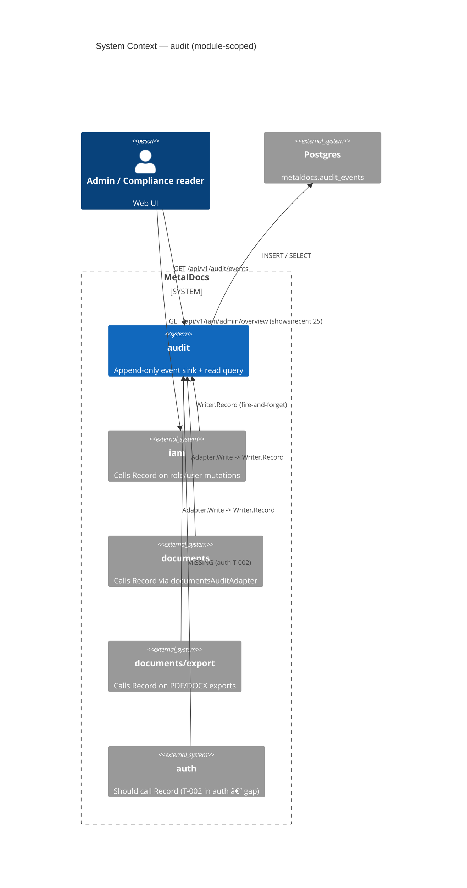
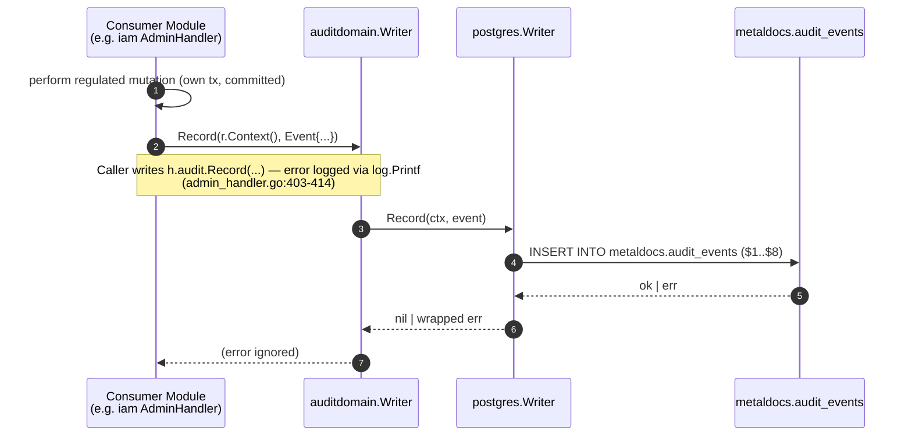
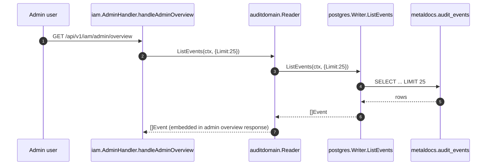

# Module: audit

> Living architecture doc. Arc42 (12 sections) + C4 (Context / Container) Mermaid diagrams + ADR links.

**Last verified:** 2026-06-11 (adversarial-verification pass 2: documentsAuditAdapter anchor corrected to main.go:773-829; operationId listAuditEvents confirmed present at openapi.yaml:745 — T-008 false-missing claim retired from §2, §5.3, and route truth table; prior pass: error-discard claim corrected to log.Printf; ID-generation corrected from timestamp to uuid.NewString; T-001 §10 row updated to PASSES; migration paths corrected to archive/migrations/; TenantID added to §5.2 Event surface; prior: 2026-06-10 Stage-1 backend audit drift patch) | **Owner:** unassigned | **Status:** active (intrinsic gaps; see §11) | **Maturity:** L3

> **Key files:**
> - `internal/modules/audit/domain/port.go:8-31` — `Event`, `ListEventsQuery`, `Writer`, `Reader`
> - `internal/modules/audit/application/service.go:94-99` — `Service.ListEvents` (limit clamp [1..100] default 50; MaxLimit=100 from pagination platform package)
> - `internal/modules/audit/delivery/http/handler.go:67` — `RegisterRoutes` (mounts `GET /api/v1/audit/events`, export routes)
> - `internal/modules/audit/delivery/http/handler.go:73` — `handleEvents` (cursor envelope `{items, page:{next_cursor, has_more}}`)
> - `internal/modules/audit/infrastructure/postgres/writer.go:20,44` — `Record` (INSERT) + `ListEvents` (SELECT)
> - `archive/migrations/0004_init_audit_events.sql:1` — `metaldocs.audit_events` table
> - `archive/migrations/0005_grant_workflow_audit_privileges.sql:2` — INSERT grant to `metaldocs_app`
> - `apps/api/cmd/metaldocs-api/main.go:193` — route registration site
> - `apps/api/cmd/metaldocs-api/main.go:773-829` — `documentsAuditAdapter`

---

## 1. Introduction & Goals

`internal/modules/audit` is the regulated-action **append-only event sink** plus a thin read-only query surface. Consumer modules call `auditdomain.Writer.Record(ctx, Event)` after performing a regulated mutation (IAM admin ops, document lifecycle transitions, exports); admin/IAM UIs read recent rows via `auditdomain.Reader.ListEvents`. Storage is a single Postgres table `metaldocs.audit_events` (migration 0004). The module deliberately has **no aggregate, no state machine, and no transactional boundary of its own** — it is a side-effect sink whose callers have already enforced capability.

### 1.1 Requirements overview

- **Regulated mutation logging** — ISO 9001 §7.5 / QMS controls require traceability of identity, document, and approval changes. Source: `wiki/concepts/iso-segregation.md`.
- **Append-only durability** — events are not editable or deletable through the application; `metaldocs_app` has only `INSERT` (`archive/migrations/0005_grant_workflow_audit_privileges.sql:2`).
- **Time-ordered query** — by occurrence, by actor, or by `(resource_type, resource_id)`; three btree indexes back the access patterns (`archive/migrations/0004_init_audit_events.sql:12-14`).
- **Trace correlation** — every event carries an HTTP `trace_id` for cross-system join (`internal/modules/audit/domain/port.go:16`).
- **Process-internal port** — `Writer`/`Reader` are Go interfaces so consumers depend on `auditdomain` and not on Postgres (`port.go:25-31`).

### 1.2 Quality Goals

| Rank | Goal | How verified |
|---|---|---|
| 1 | **Tamper-resistance of the event log** | app role has no UPDATE/DELETE + row-hash chain (`prev_hash`/`row_hash`) + integrity validator job; see section 10 |
| 2 | **Coverage of regulated actions** | callers must call `Record` on every regulated mutation; see consumer registers (auth T-002, iam T-005, documents T-005) |
| 3 | **Read confidentiality** | only authorised admin can read `/api/v1/audit/events`; `CapAuditRead` enforced in `routeRules` (`permissions.go:232`) — T-001 closed 2026-05-11 |

### 1.3 Stakeholders

| Role | Expectation |
|---|---|
| Compliance auditor | Read-only access to a complete, ordered, tamper-evident trail of regulated mutations. |
| System admin | UI showing 25 most recent events on the IAM admin overview. |
| Module author (consumer) | A single port `auditdomain.Writer.Record(ctx, Event)`; failure must not roll back the regulated action. |

---

## 2. Architecture Constraints

- Language / runtime: Go 1.25
- Persistence: Postgres, table `metaldocs.audit_events` (schema-qualified, not `public`)
- API contract: OpenAPI 3.0.3 declares `/audit/events` at `api/openapi/v1/openapi.yaml:741-745` with `operationId: listAuditEvents`
- HTTP routing: `http.ServeMux.HandleFunc` directly — NOT oapi-codegen (`handler.go:68`)
- Error envelope: RFC 9457 Problem Details (`problem.Write`) — T-002 closed Phase D/F
- Append-only by grant only — `INSERT` grant exclusively (`archive/migrations/0005:2`); no application-layer UPDATE/DELETE path

---

## 3. System Scope & Context — module-scoped (C4 Level 1)

> System-level context lives in [`wiki/diagrams/c4-context.md`](../diagrams/c4-context.md). The diagram below is **module-scoped**: it shows audit's consumer touch-points (iam, documents, export, auth) and the single owned Postgres table.



### 3.1 Business Context

A QMS auditor needs to prove **what happened, who did it, when, in what order**. The audit module is the system's only durable answer to that. Today the trail is partially populated (documents + IAM admin + exports emit events; auth identity events do not — see §11).

### 3.2 Technical Context

Inbound interfaces (Go):
- `auditdomain.Writer.Record(ctx, Event) error` — called by 4 consumer touch points (iam admin handler, documents/application service, documents/application export service, IAM admin via adapter).
- `auditdomain.Reader.ListEvents(ctx, query) ([]Event, error)` — called by iam `AdminHandler.handleAdminOverview` (`internal/modules/iam/delivery/http/admin_handler.go:128`) for the recent-25 panel.

Inbound interfaces (HTTP):
- `GET /api/v1/audit/events?resource_type=&resource_id=&limit=` — `CapAuditRead`-gated list (`permissions.go:232`); T-001 closed 2026-05-11.

Outbound interfaces:
- DB: `metaldocs.audit_events` only — single owned table, no FKs, no triggers.
- No other Go modules called.

---

## 4. Solution Strategy

- **Domain port + concrete adapters.** `Writer`/`Reader` defined in `domain/port.go`; postgres and in-memory adapters injected via platform bootstrap. Lets consumers depend on `auditdomain` only.
- **Append-only via grant plus hash-chain evidence.** `metaldocs_app` gets `INSERT` only (`archive/migrations/0005:2`), while `migrations/0193` adds `audit_sequence`, `prev_hash`, `row_hash`, and `metaldocs.audit_event_row_hash(...)`. Simpler than a forbid-update trigger; DBA/superuser changes are detected by the integrity validator job rather than prevented.
- **Fire-and-forget write contract.** Caller's regulated action commits its own tx FIRST; audit Record is a separate, post-hoc call that returns an error the caller ignores. Driver: audit failure must never roll back a regulated state change. Cost: dropped audit emissions are silent (T-005).
- **One handler-mounted route, not codegen.** `handler.RegisterRoutes` wires `mux.HandleFunc` directly. Driver: pre-dates the contract-first migration (ADR 0012); audit was never re-mounted under oapi-codegen.
- **Same `*postgres.Writer` serves both `Writer` and `Reader`.** Bootstrap wires `auditpg.NewWriter(db)` into both interface slots (`bootstrap/api.go:100-101`). Driver: simplicity; cost: nothing today.

---

## 5. Building Block View — module-scoped (C4 Level 2 — Container)

> System-level container topology lives in [`wiki/diagrams/c4-container-backend.md`](../diagrams/c4-container-backend.md). The diagram below decomposes the internal Go packages of the audit module (http/application/domain/postgres+memory adapters).

### 5.1 Whitebox — audit

```mermaid
C4Container
    title Container View — audit (module-internal packages)
    Container(http, "HTTP Handler", "Go (http.ServeMux)", "GET /api/v1/audit/events")
    Container(svc, "Application Service", "Go", "ListEvents — normalize + clamp limit")
    Container(port, "Domain Port", "Go interfaces", "Writer.Record · Reader.ListEvents · Event · ListEventsQuery")
    Container(pgw, "Postgres adapter", "Go + database/sql", "Record (INSERT) · ListEvents (SELECT)")
    Container(memw, "Memory adapter", "Go (sync.Mutex)", "dev/test path")
    ContainerDb(db, "metaldocs.audit_events", "Postgres", "id, occurred_at, actor_id, action, resource_type, resource_id, payload JSONB, trace_id")
    Rel(http, svc, "ListEvents(ctx, query)")
    Rel(svc, port, "depends on Reader interface")
    Rel(port, pgw, "satisfied by")
    Rel(port, memw, "satisfied by (dev)")
    Rel(pgw, db, "SQL")
```



### 5.2 Public surface

| File | Symbol | Kind | Purpose |
|---|---|---|---|
| `internal/modules/audit/domain/port.go:8` | `Event` | struct | one audited mutation: `ID`, `OccurredAt`, `ActorID`, `Action`, `ResourceType`, `ResourceID`, `PayloadJSON`, `TraceID`, `TenantID` |
| `internal/modules/audit/domain/port.go:19` | `ListEventsQuery` | struct | filter: `ResourceType`, `ResourceID`, `Limit` |
| `internal/modules/audit/domain/port.go:25` | `Writer` | iface | `Record(ctx, Event) error` |
| `internal/modules/audit/domain/port.go:29` | `Reader` | iface | `ListEvents(ctx, query) ([]Event, error)` |
| `internal/modules/audit/application/service.go:10` | `Service` | struct | wraps a `Reader` |
| `internal/modules/audit/application/service.go:14` | `NewService(reader)` | func | constructor |
| `internal/modules/audit/application/service.go:94-99` | `Service.ListEvents` | method | normalize + clamp `Limit` to `[1..100]`, default 50; MaxLimit=100 from pagination platform package |
| `internal/modules/audit/delivery/http/handler.go:37` | `Handler` | struct | HTTP wrapper |
| `internal/modules/audit/delivery/http/handler.go:42` | `EventResponse` | struct | wire shape: `id`, `occurred_at` (RFC3339 UTC), `actor_id`, `action`, `resource_type`, `resource_id`, `payload` (decoded), `trace_id` |
| `internal/modules/audit/delivery/http/handler.go:53` | `NewHandler(service)` | func | constructor |
| `internal/modules/audit/delivery/http/handler.go:67` | `Handler.RegisterRoutes` | method | mounts `GET /api/v1/audit/events` (+ export routes) on a `*http.ServeMux` |
| `internal/modules/audit/infrastructure/postgres/writer.go:12,16,20,44` | `postgres.Writer`, `NewWriter`, `Record`, `ListEvents` | type + methods | Postgres adapter (satisfies both Writer + Reader) |
| `internal/modules/audit/infrastructure/memory/writer.go:11,16,20,27` | `memory.Writer`, `NewWriter`, `Record`, `ListEvents` | type + methods | in-process adapter for dev/tests |

### 5.3 HTTP operations

| Method | Path | OperationID | Handler | Authz |
|---|---|---|---|---|
| GET | `/api/v1/audit/events` | `listAuditEvents` (`api/openapi/v1/openapi.yaml:745`) | `Handler.handleEvents` (`handler.go:75`) | `CapAuditRead` (`permissions.go:232`) |
| POST | `/api/v1/audit/events/export` | _missing_ | `Handler.handleExport` (`handler.go:132`) | `CapAuditRead` (`permissions.go:233`) |
| GET | `/api/v1/audit/events/export/{id}` | _missing_ | `Handler.handleExportSubresource` → status branch (`handler.go:223`) | `CapAuditRead` (`permissions.go:234`) |
| GET | `/api/v1/audit/events/export/{id}/download` | _missing_ | `Handler.handleExportSubresource` → download branch (`handler.go:239`) | `CapAuditRead` tier-1 + download token application-layer gate |

Route registration: `handler.go:69-73` mounts all four logical routes via three `mux.HandleFunc` calls; sub-resource routing is done inline by path parsing at `handler.go:232-246`.

## API Route Truth Table (Plan 8 Baseline)

| Method | Path | Runtime owner (file:line) | Handler method | Spec path | operationId | Codegen method | Status | Notes |
|---|---|---|---|---|---|---|---|---|
| GET | `/api/v1/audit/events` | `internal/modules/audit/delivery/http/handler.go:69` | `handleEvents` | `/audit/events` | `listAuditEvents` | — | Aligned | Spec server is `/api/v1`; handler wired directly via `http.ServeMux` (not oapi-codegen). |
| POST | `/api/v1/audit/events/export` | `internal/modules/audit/delivery/http/handler.go:71` | `handleExport` | _not in spec_ | — | — | Uncontracted | Export routes wired in code (`permissions.go:233`) but absent from OpenAPI spec. |
| GET | `/api/v1/audit/events/export/{id}` | `internal/modules/audit/delivery/http/handler.go:73` | `handleExportSubresource` (status branch) | _not in spec_ | — | — | Uncontracted | |
| GET | `/api/v1/audit/events/export/{id}/download` | `internal/modules/audit/delivery/http/handler.go:73` | `handleExportSubresource` (download branch) | _not in spec_ | — | — | Uncontracted | Token-gated download; path parsed inline at `handler.go:232-246`. |

- Module contract status: Partially contracted (list route only; export routes present in code and permissions.go but absent from OpenAPI spec)
- Owner: leandro

---

## 6. Runtime View (selected scenarios)

State transitions: **n/a — append-only sink, no aggregate lifecycle.**

### 6.1 Record (write path)



Failure modes:

| Condition | Caller observable | Trail effect |
|---|---|---|
| INSERT fails (constraint / connection) | logged via `log.Printf` by iam handler (`admin_handler.go:414`); caller does not propagate (T-005) | event silently lost |
| Caller's `id` generation collides (`evt_` + `uuid.NewString()`) | INSERT returns `unique_violation` (PK) — UUID collision probability is negligible but non-zero | event silently lost (T-006) |
| Postgres unavailable | _none_ | event lost; regulated action persisted (intentional decoupling) |

### 6.2 ListEvents (read path — `GET /api/v1/audit/events`)

```mermaid
sequenceDiagram
    autonumber
    participant C as Client (CapAuditRead required; T-001 closed)
    participant H as Handler.handleEvents
    participant S as Service.ListEvents
    participant PG as postgres.Writer.ListEvents
    participant DB as metaldocs.audit_events
    C->>H: GET /api/v1/audit/events?resource_type&resource_id&limit
    H->>H: parse limit (400 on parse fail)
    H->>S: ListEvents(ctx, query)
    S->>S: clamp Limit to [1..100] (default 50; MaxLimit=100 from pagination platform package)
    S->>PG: ListEvents(ctx, normalized)
    PG->>DB: SELECT ... WHERE ($1='' OR resource_type=$1) AND ($2='' OR resource_id=$2) ORDER BY occurred_at DESC, id DESC LIMIT $3
    DB-->>PG: rows
    PG-->>S: []Event
    S-->>H: []Event
    H-->>C: 200 {"items":[EventResponse...], "page":{"next_cursor":..., "has_more":...}} | RFC 9457 problem+json on err
```

Failure modes — reference `wiki/concepts/error-ux.md`:

| Condition | HTTP | Envelope `code` | Note |
|---|---|---|---|
| Wrong method | 405 | _no body_ | `w.WriteHeader(http.StatusMethodNotAllowed)` (`handler.go:79`) |
| Bad `limit` | 400 | `VALIDATION_ERROR` | RFC 9457 `problem+json` via `writeProblem` |
| Repo error | 500 | `INTERNAL_ERROR` | RFC 9457 `problem+json` via `writeProblem` |

### 6.3 IAM admin recent-events read (internal Reader consumer)



Wiring: `iamdelivery.NewAdminHandler(..., deps.AuditWriter).WithAuditReader(deps.AuditReader)` at `apps/api/cmd/metaldocs-api/main.go:182-183`. The IAM handler holds an `auditdomain.Reader` field; this is the only second-class consumer of the Reader port today.

---

## 7. Deployment View

- Binary: single Go server (`apps/api/cmd/metaldocs-api`)
- Process: one container, port `:8081`
- Migrations: applied at startup (forward-only); files `archive/migrations/0004_init_audit_events.sql`, `archive/migrations/0005_grant_workflow_audit_privileges.sql`
- Environment: **no audit-specific env vars or config keys** (Phase 3 §4 found zero) — retention, max-payload, and tamper-evidence are all latent debt rather than gated by config

---

## 8. Cross-cutting Concepts

### 8.1 Authentication & Authorization
- **Tier 1 (HTTP edge):** `GET /api/v1/audit/events` gated by `CapAuditRead` at `apps/api/cmd/metaldocs-api/permissions.go:229`; export POST/GET at `:230-231`. T-001 closed — route now explicit in routeRules.
- **Tier 2 (in-tx):** n/a — no `authz.Require` call paths in audit (append-only sink is outside the tripwire model; see `_artifacts/04-persistence.md` §5 footnote).
- **Postgres tripwire:** does not apply. The tripwire enforces caller-side capability before mutation; the audit Record records what already happened. The repo `Record` does NOT call `metaldocs.assert_caps` and is not expected to.

### 8.2 Error envelope
- Audit now emits RFC 9457 Problem Details (`application/problem+json`) via `writeProblem` / `problem.Write` — T-002 closed Phase D/F.
- Success body is `{“items”:[EventResponse...], “page”:{“next_cursor”:…, “has_more”:…}}` — canonical cursor envelope matching every other list op (closed: ADR 2026-06-03-audit-events-cursor-shape).

### 8.3 Idempotency
- **Write path:** no idempotency key. The application generates `id` as `"evt_" + uuid.NewString()` (iam handler: `admin_handler.go:404`; bypass adapter: `main.go:761`) or as a bare `uuid.NewString()` (documents adapter: `main.go:794`). UUID collision probability is negligible; however the two schemes are inconsistent across callers and neither includes a client-supplied key (T-006).
- **Read path:** idempotent by nature.

### 8.4 Pagination
- ListEvents supports `limit` ([1..100], default 50; MaxLimit=100 from `pagination` platform package — `application/service.go:94-99` + `handler.go:329`) plus an opaque keyset `cursor` (`occurred_at|id`, base64). Response includes `page.next_cursor` / `page.has_more`. The limit-only cursor shape is sufficient for the 25-row admin overview; full cursor navigation closes the export-paging gap (closed: ADR 2026-06-03-audit-events-cursor-shape).

### 8.5 Logging & Observability
- `trace_id` is stored per event (`port.go:16`) — sourced at the postgres writer from the request context / `X-Trace-Id` header; defaults to `”trace-local”`. Single-header correlation; structured logging is not used by the audit module itself.
- Audit-emission failure on the **adapter** path is `log.Printf`'d (`main.go:827`). Audit-emission failure on the **iam handler** path is also `log.Printf`'d (`admin_handler.go:414`). Neither path emits a structured log entry or a metric (T-005).

### 8.6 Concurrency / Transactions
- `postgres.Writer.Record` (`postgres/writer.go:27`) opens its own `*sql.Tx` internally via `db.BeginTx` and delegates to `RecordTx`. `ListEvents` calls `db.QueryContext` directly.
- `domain.Writer` exposes a second method `RecordTx(ctx, *sql.Tx, Event) error` (`domain/port.go:98`) that accepts a caller-supplied transaction. `postgres.Writer` implements it at `postgres/writer.go:44` (acquires `pg_advisory_xact_lock` and runs the CTE hash-chain INSERT within the caller's tx). `memory.Writer` implements it at `memory/writer.go:30` (delegates to `Record`, ignoring the tx — test-fidelity gap, flag F-04).
- `RecordTx` is actively called by `bypassAuditAdapter` (`main.go:760`) and `documentsAuditAdapter` (`main.go:793`) to bundle the audit INSERT in the same transaction as the regulated mutation.
- The memory adapter uses a `sync.Mutex` (`memory/writer.go:16`).

### 8.7 Append-only contract
- Achieved by **grant** (`archive/migrations/0005:2` grants only `INSERT` to `metaldocs_app`) plus the T-004 row-hash chain (`migrations/0193`). The `metaldocs` schema owner and Postgres superuser retain `UPDATE/DELETE` privileges, but tampering is detectable through `Writer.ValidateIntegrity` and the `audit_integrity_validator` job.

---

## 9. Architecture Decisions

| Decision | Link / Status |
|---|---|
| Audit module wraps eigenpal-unrelated regulated-action logging in a port + adapter shape | `tech-debt: missing-ADR` (T-011) |
| Append-only via grant plus row-hash chain | `tech-debt: missing-ADR` (T-011) |
| Same `*postgres.Writer` satisfies both `Writer` and `Reader` interfaces | `tech-debt: missing-ADR` (T-011, sub-bullet) |
| Two-tier authz (referenced for §8.1) | `wiki/decisions/0007-two-tier-authz.md` |
| Contract-first API (referenced for §8.2 drift) | `wiki/decisions/0012-contract-first-api.md` |
| Single `documents` table (referenced for cross-module consumer map) | `wiki/decisions/0011-cd-atomic-create.md` |

---

## 10. Quality Requirements

| Goal | Scenario | Pass criteria | Current state |
|---|---|---|---|
| **Read confidentiality** | An unauthenticated client calls `GET /api/v1/audit/events` | 401 / 403 with Problem `metaldocs.authz.forbidden`; no rows returned | PASSES — `CapAuditRead` enforced in `routeRules` (`permissions.go:232`); T-001 closed 2026-05-11. |
| **Tamper-resistance (app)** | `metaldocs_app` attempts `UPDATE` or `DELETE` on `audit_events` | DB rejects (`permission denied`) | PASSES - grants allow INSERT/SELECT only, not UPDATE/DELETE (`archive/migrations 0005 + 0193`). |
| **Tamper-resistance (DBA)** | Schema owner or superuser executes `UPDATE audit_events SET action=...` | Detected via integrity proof | PASSES for detection once `ENABLE_JOB_AUDIT_INTEGRITY_VALIDATOR` is enabled; row-hash chain added in T-004 follow-up. |
| **Coverage of regulated mutations** | Every regulated write in iam/documents/auth has a paired `Record` call | grep over consumer modules shows zero gaps | **PARTIAL** — auth T-002, iam T-005, documents T-005 are gaps in the consumer registers. |
| **Durability of accepted events** | INSERT returns nil → event survives crash | row present after restart | PASSES — synchronous INSERT. |
| **Visibility of dropped events** | `Record` fails → operator can detect | log line or metric | **PARTIAL** â€" iam path logs error via `log.Printf` (`admin_handler.go:414`); adapter path also logs (`main.go:827`); neither emits a metric or structured log entry (T-005). |
| **Multi-tenant isolation** | Tenant A reads `/api/v1/audit/events` → no Tenant B rows | tenant filter in SQL | **N/A today** — MetalDocs is single-tenant; latent gap on multi-tenant cutover (T-007). |

---

## 11. Risks & Technical Debt

Pointer-only. Body in `wiki/modules/audit-tech-debt.md`. Severity rubric: see that file.

- Critical: 2
- Major: 4
- Minor: 6

Top 3 (by severity, then by blast-radius):

1. **Unauthenticated `GET /api/v1/audit/events`** — T-001 closed 2026-05-11 (`CapAuditRead` in `routeRules`). Risk retired; listed here for historical reference.
2. **Audit event ID inconsistency across callers** — iam handler uses `”evt_” + uuid.NewString()` (`admin_handler.go:404`); bypass adapter matches (`main.go:761`); documents adapter uses bare `uuid.NewString()` (`main.go:794`). UUID collision probability is negligible but the inconsistent prefix convention is a latent contract drift. See tech-debt T-006.
3. **Audit emission errors are logged but not metered** — IAM admin handler logs `Record` failure via `log.Printf` (`admin_handler.go:414`); adapter path also logs (`main.go:827`); neither emits a metric, so silent gaps in the trail are only detectable post-hoc via the row-hash chain. Consumer-side trail coverage is best-effort. See tech-debt T-005 (consumer-side critical-rated rows in auth T-002, iam T-005, documents T-005).

---

## 12. Glossary

| Term | Definition |
|---|---|
| Append-only sink | A write surface whose semantic contract forbids UPDATE/DELETE. In MetalDocs enforced only by `GRANT INSERT` (app role); not enforced against the schema owner. |
| Action string | Free-text identifier of the regulated event (`document.created`, `iam.user.updated`, etc.). 15 production strings catalogued in `_artifacts/03-deps.md` §6. |
| Fire-and-forget Record | Pattern where the caller invokes `Writer.Record` and ignores the returned error so audit failure cannot roll back the regulated mutation. |
| Tamper-evidence | A proof that the trail has not been mutated post-write. Audit now uses a database row-hash chain (`prev_hash`/`row_hash`) plus an integrity validator job; external WORM/signing remains outside this follow-up. |
| `metaldocs_app` | The Postgres role the application connects as. Receives `INSERT` only on `metaldocs.audit_events`. |

---

## Failure modes

§6.1 already enumerates write-path failures (silent loss by design). This table covers the operational/downstream failures observable across the whole module.

| Failure | Symptom | Detection | Response |
|---|---|---|---|
| Postgres unavailable for `Record` | Error logged via `log.Printf` by iam handler (`admin_handler.go:414`); caller does not propagate — event lost | No client-visible signal; absent rows on later `ListEvents` query | T-005 tracks this gap; mitigation is the row-hash chain (`migrations/0193`) which makes post-hoc gaps detectable, not preventable |
| `id` collision on `uuid.NewString()` PK | `unique_violation` on INSERT; event lost — UUID collision probability is negligible | Server logs `pq` 23505 from `postgres.Writer.Record` | T-006; inconsistent `evt_` prefix across callers is an additional latent drift |
| Auth module never emits audit (T-002 in `auth-tech-debt.md`) | Trail has no login/logout/password-change rows | Compliance review finds gap | Implement `auth` → `Writer.Record` integration; tracked as Critical gap |
| Tamper attempt via DBA / superuser | Row mutated post-write | `audit_event_row_hash` chain validation job flags `prev_hash`/`row_hash` mismatch | Investigate operator action; restore from PITR backup |
| `GET /api/v1/audit/events` reached without authz | Any caller reads the trail | Route is `CapAuditRead`-gated in `routeRules` (`permissions.go:232`) | T-001 closed 2026-05-11 — no action required |
| Limit parse error | 400 RFC 9457 `problem+json` | `Handler.handleEvents` returns `application/problem+json` via `writeProblem` | T-003/T-002 closed Phase D/F |
| Adapter mismatch (Postgres unavailable, memory adapter selected accidentally in prod) | Trail kept in-process; lost on restart | `bootstrap/api.go:100-101` should always pick `auditpg.NewWriter` in prod | Config audit at startup; bootstrap guard |

## Cross-links

- Related ADRs: `wiki/decisions/0007-two-tier-authz.md`, `wiki/decisions/0012-contract-first-api.md`
- Related concepts: `wiki/concepts/iso-segregation.md`, `wiki/concepts/error-ux.md`, `wiki/concepts/authz-tiers.md`
- Consumer-side audit debt: `wiki/modules/auth-tech-debt.md#T-002`, `wiki/modules/iam-tech-debt.md` (T-005), `wiki/modules/documents-tech-debt.md#T-005`, `wiki/modules/documents-tech-debt.md#T-007`
- Parallel-sink peer: `wiki/modules/taxonomy.md` — taxonomy's `DBGovernanceLogger` writes regulated events to `governance_events` instead of consuming `auditdomain.Writer`; taxonomy T-010 + §8.6 document this two-sink gap; controlled-documents reuses the same logger (legacy literal code path: `registry/module.go:31`) — see also registry T-008
- See also: [`modules/controlled-documents.md §8.5`](controlled-documents.md#85-audit--governance) — controlled-documents create path emits via the taxonomy governance-events sink (T-008: cross-module coupling); Obsolete/Supersede emit no audit event (legacy literal debt key: registry T-002 Critical)
- Backlog: `wiki/backlog/audit-refactor.md`
- Tech debt: `wiki/modules/audit-tech-debt.md`
- Artifacts: `wiki/modules/audit/_artifacts/`

## Changelog (this doc)

- 2026-05-10 — initial publish (metaldocs-module-doc skill v1.2)
