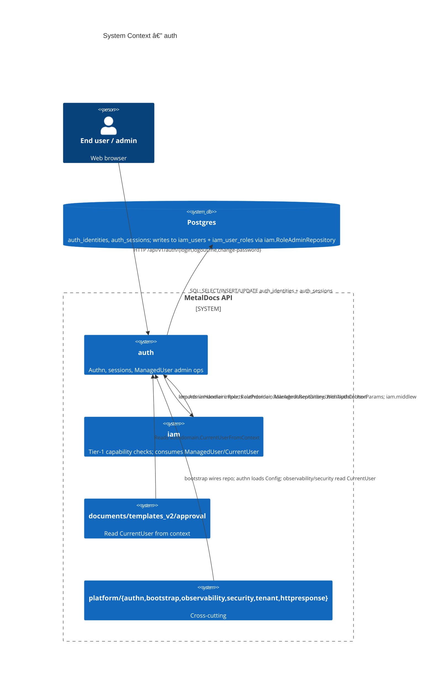
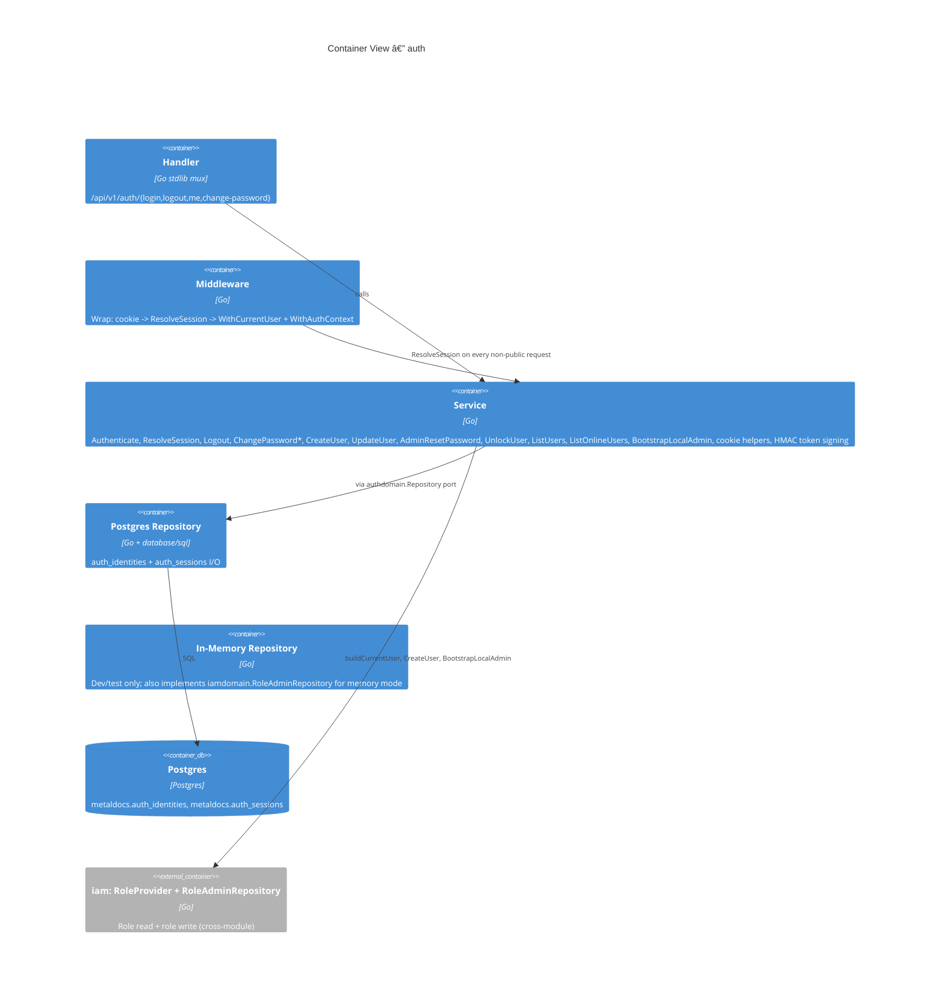
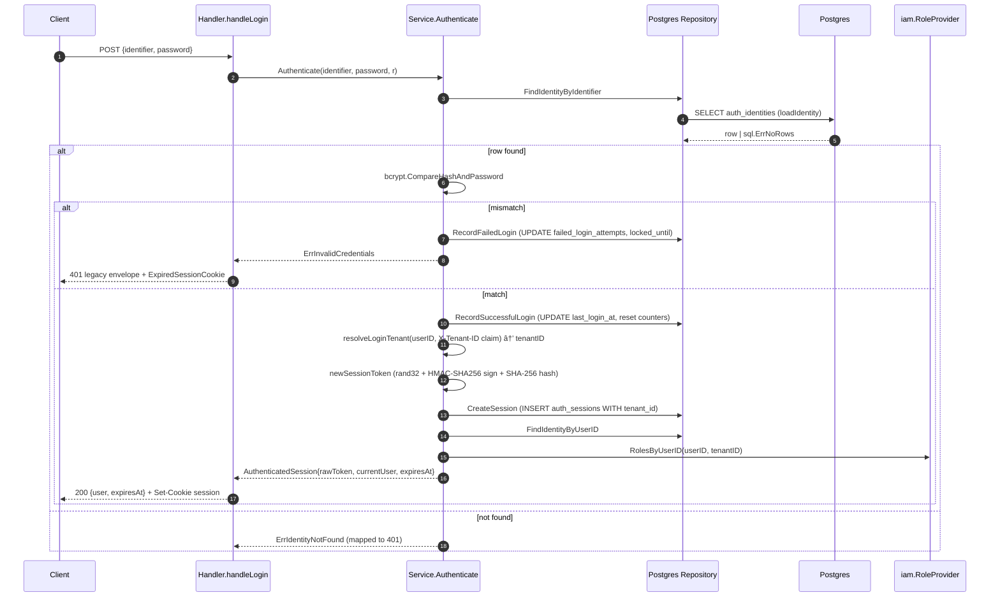
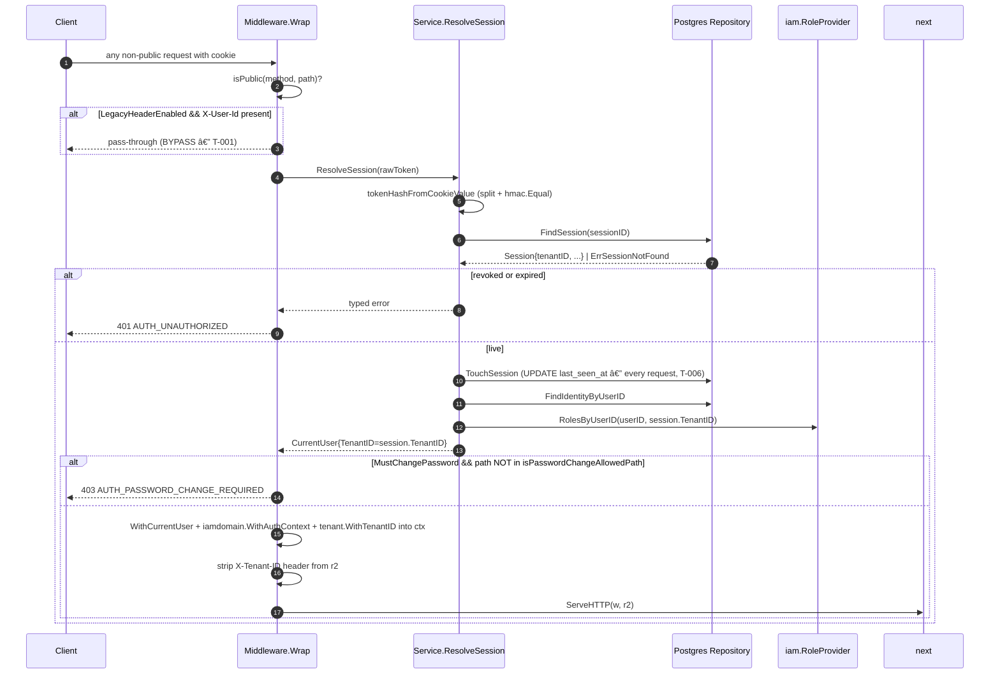

# Module: auth

> Living architecture doc. Shape: Arc42 + C4 + ADR cross-links.

**Last verified:** 2026-05-12 | **Owner:** unassigned | **Status:** active (legacy envelope; no audit-trail emission yet) | **Maturity:** L2

> **Key files:**
> - `internal/modules/auth/application/service.go:48` — `Service` (single struct holding all use cases)
> - `internal/modules/auth/application/service.go:103` — `Authenticate` (login; calls `resolveLoginTenant` to bind tenant at login)
> - `internal/modules/auth/application/service.go:172` — `resolveLoginTenant` (binds tenant from session; uses `AllowDevTenantFallback`)
> - `internal/modules/auth/application/service.go:196` — `ResolveSession` (no longer takes `tenantID`; reads from stored session)
> - `internal/modules/auth/application/service.go:470` — `newSessionToken` (HMAC-SHA256 + SHA-256 hash)
> - `internal/modules/auth/application/service.go:481` — `tokenHashFromCookieValue` (constant-time `hmac.Equal`)
> - `internal/modules/auth/delivery/http/handler.go:34` — `RegisterRoutes` (4 stdlib mux registrations)
> - `internal/modules/auth/delivery/http/handler.go:165` — `writeAPIError` (legacy envelope writer)
> - `internal/modules/auth/delivery/http/middleware.go:47` — `Wrap` (session enforcement)
> - `internal/modules/auth/delivery/http/middleware.go:58` — `LegacyHeaderEnabled` X-User-Id bypass
> - `internal/modules/auth/delivery/http/middleware.go:83-88` — injects `WithCurrentUser` + `WithAuthContext` + `WithTenantID`; strips `X-Tenant-ID` header
> - `internal/modules/auth/delivery/http/middleware.go:96` — `defaultPublicPaths` (health + login + logout)
> - `internal/modules/auth/domain/model.go:26` — `Session` (now carries `TenantID` field)
> - `internal/modules/auth/domain/model.go:93` — `CurrentUser` (now carries `TenantID` field)
> - `internal/modules/auth/domain/errors.go:18` — `ErrTenantNotPermitted` (login rejects unclaimed tenant)
> - `internal/modules/auth/domain/errors.go:21` — `ErrTenantClaimRequired` (multi-tenant user must supply X-Tenant-ID at login)
> - `internal/modules/auth/domain/port.go:23` — `GetUserTenants` (new Repository method — list tenant IDs from iam_user_roles)
> - `internal/modules/auth/infrastructure/postgres/repository.go:174` — `CreateUser` (own tx, INSERT auth_identities)
> - `internal/modules/auth/infrastructure/postgres/repository.go:103` — `TouchSession` (UPDATE per request)
> - `internal/modules/auth/infrastructure/memory/repository.go:403` — `SeedUserTenants` (test helper)
> - `internal/platform/authn/config.go:101-116` — `Config` env-var load sites
> - `internal/platform/tenant/context.go:1` — `WithTenantID` / `FromContext` / `ErrTenantMissing` (see `wiki/architecture/tenant-context.md`)
> - `internal/platform/tenant/const.go:4` — `DevTenantID` sentinel
> - `migrations/0021_init_auth_identities_and_sessions.sql:1-30` — table DDL
> - `migrations/0036_decouple_auth_identity_from_iam_user_tables.sql:1-88` — FK rewire to `auth_identities(user_id)`
> - `migrations/0184_auth_sessions_tenant_id.sql` — adds `tenant_id` column to `auth_sessions`
> - `migrations/0185_revoke_ambiguous_sessions.sql` — revokes existing sessions lacking a tenant binding

---

## 1. Introduction & Goals

`auth` owns user authentication and HTTP session lifecycle: it answers "who is this request?" via session cookie, mints sessions on credential verify, and surfaces a current-user struct other modules read from `context.Context`. It does NOT answer "can this user do X?" — that lives in `internal/modules/iam/` per ADR 0007. Auth also wraps user-administration use cases (CreateUser, UpdateUser, AdminResetPassword, UnlockUser, ListUsers) consumed by `iam`'s admin HTTP surface; ownership of `metaldocs.iam_users` rows is shared with IAM via decoupled FK (migration 0036).

### 1.1 Requirements overview

- **Cookie-based session authn** — driver: web client uses HttpOnly session cookie; source: `internal/modules/auth/delivery/http/handler.go:61`.
- **Per-account brute-force lockout** — driver: regulated-app baseline; source: `application/service.go:117-126` + `Config.LoginMaxFailedAttempts/LoginLockDuration`.
- **Bcrypt password storage** — driver: industry baseline for new deployments; source: `application/service.go:431` (`bcrypt.DefaultCost`).
- **Single source of truth for "current user"** — driver: downstream consumers (documents, templates, observability) read `authdomain.CurrentUserFromContext`; source: artifact 03 §2 (10 importers).
- **First-boot admin bootstrap** — driver: empty-DB onboarding; source: `application/service.go:56` `BootstrapLocalAdmin`, gated by `BootstrapAdminEnabled`.

### 1.2 Quality Goals

| Rank | Goal | How verified |
|---|---|---|
| 1 | Correctness — no path serves a request without a valid session (when `authn.Enabled()`) | `delivery/http/middleware_test.go`; `tests/unit/auth_password_change_flow_test.go`; `defaultPublicPaths` whitelist (`middleware.go:96-107`) |
| 2 | Credential safety — passwords stored as bcrypt; session token signed + hashed before storage | `application/service.go:431` (bcrypt cost), `:439-447` (HMAC + SHA-256), `:455` (`hmac.Equal` constant-time) |
| 3 | Lockout policy enforcement | `tests/unit/auth_login_policy_test.go`; `Config.LoginMaxFailedAttempts` consumed at `service.go:120` |

### 1.3 Stakeholders

| Role | Expectation |
|---|---|
| End user | Login with username/email + password; session persists across requests; password change required after admin reset or first login |
| Operator (admin) | Bootstrap a first admin via env; reset another user's password and force change; unlock locked accounts |
| Developer (other modules) | One way to read current user (`authdomain.CurrentUserFromContext`); one way to read tenant from context (`tenant.FromContext`); fallback sentinel `tenant.DevTenantID` in dev mode |
| Auditor (ISO) | Login / logout / password-change / admin-reset / role-replace events captured in audit sink — **gap, see §11 T-002** |

---

## 2. Architecture Constraints

- Language: Go 1.25; stdlib `net/http`, `database/sql`, `golang.org/x/crypto/bcrypt`.
- Persistence: Postgres; tables under `metaldocs.auth_identities`, `metaldocs.auth_sessions` (auth-owned) + writes to `metaldocs.iam_users` / `iam_user_roles` via injected `iamdomain.RoleAdminRepository` (cross-module).
- Identity table is **tenant-global** — `auth_identities` has no `tenant_id` column (`migrations/0021_init_auth_identities_and_sessions.sql:1-13`); roles are tenant-scoped in IAM (T-008). **Sessions are now tenant-bound** — `auth_sessions.tenant_id` added by migration 0184; `resolveLoginTenant` picks the tenant at login time and stores it in the session row. Subsequent requests read tenant from the session via `tenant.FromContext` (set by middleware) — `X-Tenant-ID` header is stripped after auth and never trusted by downstream handlers.
- Session token format: `<base64url(rand32)>.<base64url(HMAC-SHA256(secret, token))>`; cookie value carries the signed pair, DB stores the SHA-256 hash of the token half (`application/service.go:439-468`).
- Cookie attributes: `HttpOnly`, `SameSite=Lax`, `Secure` from `Config.CookieSecure` (defaults to `APP_ENV != local`), `Path=/`, `MaxAge` from `SessionTTL`.
- Auth is NOT under `oapi-codegen` — routes are registered via `mux.HandleFunc` (`delivery/http/handler.go:35-39`); no entry in `api/openapi/v1/openapi.yaml` for `/api/v1/auth/*`. Consistent with ADR 0012's partial-rollout scope.
- Error envelope is legacy `{error:{code,message,details,trace_id}}` — does NOT yet match RFC 9457 Problem Details from `wiki/architecture/api-design-system.md` (T-003).
- Auth tables (`auth_identities`, `auth_sessions`) are explicitly **outside** the `enforce_capability_asserted` tripwire scope. Plan 5 migration 0188 expanded the trigger to 10 additional tables (IAM, documents, registry, taxonomy, templates_v2) but auth tables remain unguarded — per ADR 0007 amendment.
- `LegacyHeaderEnabled` — when true, requests with `X-User-Id` header bypass session enforcement entirely (`middleware.go:58-61`); single-flag compromise vector (T-001).

---

## 3. System Scope & Context (C4 Level 1)



### 3.1 Business Context

Quality-managed app. Every controlled-document mutation must trace to a known actor; the actor identity is what `auth` produces. Login failures must lock; session must expire; admin-set passwords must force a change on next login. ISO 9001 expects authentication events themselves in the audit trail — currently a gap (T-002).

### 3.2 Technical Context

**Inbound HTTP (own surface):** see §5.3 — 4 routes.

**Inbound Go (consumers, from `_artifacts/03-deps.md` §2):**
- `apps/api/cmd/metaldocs-api/main.go:40-41` — `authapp.NewService`, `authdelivery.NewHandler`, `authdelivery.NewMiddleware`
- `apps/api/cmd/metaldocs-api/permissions.go:7` — `authdelivery.PublicPathChecker`
- `apps/api/cmd/metaldocs-e2e-seed/main.go:10-11,58` — seed binary
- `internal/platform/authn/config.go:10` — `authapp.Config`
- `internal/platform/bootstrap/api.go:16-18,74,113` — repo wiring (postgres + memory)
- `internal/platform/observability/http.go:15` — `CurrentUserFromContext`
- `internal/platform/security/ratelimit.go:12` — `CurrentUserFromContext`
- `internal/modules/iam/delivery/http/admin_handler.go:13` — `ManagedUser`, `OnlineUser`, `UpdateUserParams`, `ErrPasswordPolicy`, `ErrUserAlreadyExists`, `ErrIdentityNotFound`
- `internal/modules/iam/delivery/http/middleware.go:8` — `CurrentUserFromContext`

**Outbound Go (own imports, from `_artifacts/03-deps.md` §1):**
- `internal/modules/iam/domain` — `Role`, `RoleProvider`, `RoleAdminRepository`, `WithAuthContext`, `ErrUserNotFound`, `ErrUserInactive`, `RoleSystemAdmin` (auth ↔ iam bidirectional, T-007)
- `internal/platform/tenant` — `DevTenantID` (bootstrap/dev fallback), `WithTenantID` (middleware injects tenant into ctx), `FromContext` (ResolveSession reads tenant from session row)
- `internal/platform/httpresponse` — `WriteJSON`

**Outbound DB writes (owned):** `metaldocs.auth_identities`, `metaldocs.auth_sessions`. **Cross-module writes (via injected port):** `metaldocs.iam_users`, `metaldocs.iam_user_roles` (through `iamdomain.RoleAdminRepository`).

---

## 4. Solution Strategy

- **Cookie-based opaque session token over JWT** — driver: server-side revocation requirement (`Revoke*Session*` methods); JWT cannot be invalidated mid-TTL without an extra deny list. Stored shape: random 32-byte token + HMAC sig in cookie; only SHA-256 hash persisted server-side, so DB compromise does not leak usable tokens.
- **Single `Service` struct, no use-case split** — driver: small surface (15 methods); each method is independently testable through the `Repository` port. Trade-off accepted: `Service` mixes session, identity, and admin ops; if it grew it would need decomposition.
- **Per-account lockout, no IP-based throttle** — driver: regulated identity baseline; gap acknowledged for distributed brute-force (T-005).
- **Session secret is one process-wide HMAC key** — driver: simplicity; rotation invalidates all sessions (no key-id in cookie, no rolling window). Captured as latent — see T-010.
- **Identity is tenant-global; roles are tenant-scoped** — driver: a single human may be a member of multiple tenants under the same `user_id`; IAM enforces per-tenant role assignment. Trade-off: no row-level tenant isolation on `auth_identities`/`auth_sessions` (T-008).
- **Admin user-creation goes through auth.Service.CreateUser, not iam directly** — driver: password hashing + identity row owned by auth; role assignment delegated to injected `RoleAdminRepository`. Two distinct DB transactions (T-004).

---

## 5. Building Block View (C4 Level 2)

### 5.1 Whitebox — auth



### 5.2 Public surface (by file)

Full table in `_artifacts/01-surface.md` (98 exported symbols). Grouping:

| File | Exports |
|---|---|
| `application/service.go` | `Config` (adds `AllowDevTenantFallback`), `Service`, `NewService`, `BootstrapLocalAdmin`, `Authenticate` (calls `resolveLoginTenant`), `ResolveSession` (no longer takes `tenantID` arg), `Logout`, `ChangePassword`, `ChangePasswordForUser`, `ListUsers`, `ListOnlineUsers`, `CreateUser`, `UpdateUser`, `AdminResetPassword`, `UnlockUser`, `SessionCookie`, `SessionCookieName`, `ExpiredSessionCookie`, `CurrentUser` |
| `delivery/http/handler.go` | `Handler`, `NewHandler`, `RegisterRoutes` |
| `delivery/http/middleware.go` | `PublicPathChecker`, `Middleware`, `NewMiddleware`, `WithPublicPathChecker`, `Wrap` |
| `domain/model.go` | `Identity`, `Session`, `OnlineUser`, `ManagedUser`, `CreateUserParams`, `UpdateUserParams`, `BootstrapAdminParams`, `CurrentUser`, `AuthenticatedSession` |
| `domain/port.go` | `Repository` (15 methods) |
| `domain/context.go` | `WithCurrentUser`, `CurrentUserFromContext` |
| `domain/errors.go` | `ErrInvalidCredentials`, `ErrSessionNotFound`, `ErrSessionExpired`, `ErrSessionRevoked`, `ErrPasswordPolicy`, `ErrPasswordChangeRequired`, `ErrIdentityLocked`, `ErrIdentityInactive`, `ErrIdentityNotFound`, `ErrUserAlreadyExists`, `ErrTenantNotPermitted`, `ErrTenantClaimRequired` |
| `infrastructure/postgres/repository.go` | `Repository`, `NewRepository`, 13 methods (FindIdentityBy*, CreateSession, FindSession, TouchSession, RevokeSession*, RecordSuccessful/FailedLogin, CreateUser, ListUsers, ListOnlineUsers, UpdateUser, BootstrapAdmin) |
| `infrastructure/memory/repository.go` | `Repository`, `NewRepository`, full `Repository` impl + `iamdomain.RoleAdminRepository` impl (`HasAnyRole`, `UpsertUserAndAssignRole`, `ReplaceUserRoles`, `RolesByUserID`) for memory-mode tests; `SeedUserTenants` (test helper to pre-populate tenant list for a user) |

All exported symbols are `(undocumented)` in the surface scan — captured as T-011.

### 5.3 HTTP operations

| Method | Path | Handler | Auth requirement |
|---|---|---|---|
| POST | `/api/v1/auth/login` | `Handler.handleLogin` (`handler.go:42`) | public (in `defaultPublicPaths`) |
| POST | `/api/v1/auth/logout` | `Handler.handleLogout` (`handler.go:68`) | public (in `defaultPublicPaths`) |
| GET | `/api/v1/auth/me` | `Handler.handleMe` (`handler.go:80`) | session cookie required |
| POST | `/api/v1/auth/change-password` | `Handler.handleChangePassword` (`handler.go:94`) | session cookie required; allowed during `MustChangePassword` lock |

## API Route Truth Table (Plan 8 Baseline)

| Method | Path | Runtime owner (file:line) | Handler method | Spec path | operationId | Codegen method | Status | Notes |
|---|---|---|---|---|---|---|---|---|
| POST | `/api/v1/auth/login` | `internal/modules/auth/delivery/http/handler.go:45` | `handleLogin` | `/auth/login` | — | — | Aligned | Spec server is `/api/v1`; operationId not defined. |
| POST | `/api/v1/auth/logout` | `internal/modules/auth/delivery/http/handler.go:46` | `handleLogout` | `/auth/logout` | — | — | Aligned | Spec server is `/api/v1`; operationId not defined. |
| GET | `/api/v1/auth/me` | `internal/modules/auth/delivery/http/handler.go:47` | `handleMe` | `/auth/me` | — | — | Aligned | Spec server is `/api/v1`; operationId not defined. |
| POST | `/api/v1/auth/change-password` | `internal/modules/auth/delivery/http/handler.go:48` | `handleChangePassword` | `/auth/change-password` | — | — | Aligned | Spec server is `/api/v1`; operationId not defined. |

- Module contract status: Contracted
- Owner: leandro

Composition root may inject a `PublicPathChecker` overriding `defaultPublicPaths` (`middleware.go:35`); the API binary does so at `apps/api/cmd/metaldocs-api/main.go:171` (cross-ref `permissions.go:7`).

---

## 6. Runtime View

### 6.1 Login — POST /api/v1/auth/login



State transitions:

| Entity | From | To | Trigger | Capability |
|---|---|---|---|---|
| `metaldocs.auth_sessions` row | absent | inserted (`session_id` = SHA-256(token)) | login success | n/a (public route) |
| `metaldocs.auth_identities.failed_login_attempts` | `N` | `N+1` then locked when `>= LoginMaxFailedAttempts`; reset to `0` on success | password mismatch / success | n/a |
| `metaldocs.auth_identities.locked_until` | nullable | `now + LoginLockDuration` on threshold; cleared on success | `RecordFailedLogin` / `RecordSuccessfulLogin` | n/a |

Tripwire pairing: **N/A** — auth tables out-of-scope (artifact 04 §3,5).
Audit log emission: **NO** — only `log.Printf` on failure (`handler.go:56`). T-002.

### 6.2 Resolve session — middleware on every non-public request



State transitions:

| Entity | From | To | Trigger |
|---|---|---|---|
| `metaldocs.auth_sessions.last_seen_at` | prior timestamp | request timestamp | every authenticated request (`TouchSession`) |

Tripwire pairing: N/A. Audit emission: NO.

### 6.3 Admin create user — Service.CreateUser (invoked from iam admin handler)

```mermaid
sequenceDiagram
    autonumber
    participant H as iam.AdminHandler.handleCreateUser
    participant S as auth.Service.CreateUser
    participant R as auth.PostgresRepository
    participant RA as iam.RoleAdminRepository
    participant DB as Postgres
    H->>S: CreateUser(userID, ..., roles, createdBy)
    S->>S: validatePassword + hashPassword (bcrypt.DefaultCost)
    S->>R: CreateUser(params)
    R->>DB: BeginTx; INSERT auth_identities; COMMIT  (TX-A)
    R-->>S: nil
    S->>RA: ReplaceUserRoles(userID, displayName, tenantID, roles, createdBy)
    RA->>DB: BeginTx; UPSERT iam_users; DELETE iam_user_roles; INSERT iam_user_roles; COMMIT  (TX-B)
    RA-->>S: nil
    S-->>H: nil
    H-->>C: 201 {userId}
```

State transitions:

| Entity | From | To | Trigger | Tx |
|---|---|---|---|---|
| `metaldocs.auth_identities` row | absent | inserted | TX-A | own |
| `metaldocs.iam_users` row | absent or stale | upserted | TX-B | own |
| `metaldocs.iam_user_roles` rows for `(tenant_id, user_id)` | any | deleted then optionally one inserted | TX-B | own |

Two distinct transactions. Failure between TX-A and TX-B leaves an orphan `auth_identities` row with no role binding (T-004). Audit emission: NO on `handleCreateUser` (artifact 02-flow-create-user §6); compare `handleReplaceUserRoles` which DOES emit `recordAudit` at `iam/delivery/http/admin_handler.go:398`. T-002 covers this gap.

### 6.4 Failure modes (current envelope)

| Condition | HTTP | Body |
|---|---|---|
| Invalid credentials / identity not found | 401 | `{error:{code:"AUTH_INVALID_CREDENTIALS",...,trace_id}}` |
| Account locked | 403 | `AUTH_ACCOUNT_LOCKED` |
| Account inactive | 403 | `AUTH_ACCOUNT_INACTIVE` |
| Password policy violation | 400 | `VALIDATION_ERROR` |
| Claimed tenant not in user's IAM roles (`ErrTenantNotPermitted`) | 403 | `AUTH_TENANT_FORBIDDEN` |
| User in multiple tenants, no `X-Tenant-ID` claim at login (`ErrTenantClaimRequired`) | 403 | `AUTH_TENANT_REQUIRED` |
| Missing/invalid session cookie | 401 | `AUTH_UNAUTHORIZED` |
| Session expired or revoked | 401 | `AUTH_UNAUTHORIZED` |
| `MustChangePassword` set, path not allowed | 403 | `AUTH_PASSWORD_CHANGE_REQUIRED` |
| Internal error (DB, hashing) | 500 | `INTERNAL_ERROR` |

RFC 9457 Problem envelope: **not used** (T-003).

---

## 7. Deployment View

- Single Go binary `apps/api/cmd/metaldocs-api` (port `:8081`); seed binary `apps/api/cmd/metaldocs-e2e-seed` reuses `authapp.NewService`.
- Wiring in `apps/api/cmd/metaldocs-api/main.go:148-171`: `NewService(deps.AuthRepo, deps.RoleProvider, deps.RoleAdminRepo, authCfg)` → `NewHandler(authService)` + `NewMiddleware(authService, authCfg, authn.Enabled()).WithPublicPathChecker(...)`.
- Repository selected at boot in `internal/platform/bootstrap/api.go:74` (postgres) / `:113` (memory).
- Migrations applied externally; module's owned migrations: 0021, 0022, 0036, 0159 (artifact 04 §6).
- Config loaded from env in `internal/platform/authn/config.go:101-116` — see §8.7 below.

---

## 8. Cross-cutting Concepts

### 8.1 Authentication & Authorization

- Authentication: this module. Session cookie + bcrypt + lockout + HMAC-signed opaque token; SHA-256 hash persisted server-side.
- Authorization: NOT here. Tier-1 (`CapabilityService.CanDo`) and tier-2 (`authz.Require`) live in `iam` per ADR 0007. Auth's contribution is `iamdomain.WithAuthContext(ctx, userID, roles)` injected by middleware (`middleware.go:88`) so downstream tier checks have an actor.
- `system_admin` bypass: NOT applied here — login still requires correct password for the system_admin account (no per-role login bypass).
- `LegacyHeaderEnabled` X-User-Id bypass at `middleware.go:58-61` — disabled by default (`internal/platform/authn/config.go:107`); when true, no session check runs. T-001.

### 8.2 Error envelope

All non-2xx responses use legacy `apiErrorEnvelope` (`handler.go:148-157`). Fields: `error.code` (string enum), `error.message`, `error.details` (always `{}` today), `error.trace_id` (echoes `X-Trace-Id` or `"trace-local"`). Drift from RFC 9457 `application/problem+json` recorded as T-003.

### 8.3 Idempotency

Not applicable. Login intentionally non-idempotent (each call mints a new session row). Logout, change-password, admin-reset have no idempotency-key handling.

### 8.4 Pagination

Auth's own HTTP surface (4 routes) has no list endpoints. `Service.ListUsers` / `ListOnlineUsers` are exposed via `iam.AdminHandler` (offset-only at the IAM layer, see iam doc).

### 8.5 Logging & Observability

- `log.Printf` on login failure (`handler.go:56`) and change-password failure (`handler.go:112`).
- `internal/platform/observability/http.go:15` reads `CurrentUserFromContext` for log enrichment downstream.
- No structured log keys; no metrics. Trace-id propagation: opportunistic echo of `X-Trace-Id` header.

### 8.6 Concurrency / Transactions

- `Authenticate`, `ResolveSession`, `Logout`, `ChangePasswordForUser`, `BootstrapLocalAdmin`, `AdminResetPassword`, `UnlockUser` each issue their own `db.Exec/QueryRow` with no shared transaction.
- `Repository.CreateUser` opens its own `BeginTx` (artifact 02-flow-create-user §2); `RoleAdminRepository.ReplaceUserRoles` opens its own `BeginTx`. `Service.CreateUser` calls them sequentially without an outer tx — non-atomic across modules (T-004).

### 8.7 Configuration surface

From artifact 03 §4. Loaded in `internal/platform/authn/config.go:101-116`.

| Field | Required | Default | Notes |
|---|---|---|---|
| `SessionCookieName` | no | `metaldocs_session` | cookie name |
| `SessionTTL` | no | `12h` (`METALDOCS_AUTH_SESSION_TTL_HOURS`) | session lifetime |
| `SessionSecret` | yes when `authn.Enabled()` | none | HMAC key for token signing — rotation invalidates all sessions (T-010) |
| `PasswordMinLength` | no | `8` | enforced in `validatePassword` |
| `LoginMaxFailedAttempts` | no | `5` | lockout threshold |
| `LoginLockDuration` | no | `15m` | lockout window |
| `LegacyHeaderEnabled` | no | `false` | enables X-User-Id bypass — see T-001 |
| `AllowDevTenantFallback` | no | `false` | when true, login succeeds for users with no IAM roles by returning `DevTenantID`; dev/test only |
| `OriginProtection` | no | `authn.Enabled()` | flag declared; **enforcement site not located in repo** (T-012) |
| `TrustedOrigins` | no | empty | companion to `OriginProtection`; same gap |
| `BootstrapAdmin*` | yes when `BootstrapAdminEnabled` | `BootstrapAdminEnabled = APP_ENV==local` | first-boot admin seeding |
| `CookieSecure` | no | `APP_ENV != local` | `Secure` cookie flag |

### 8.8 Cross-deps (consumers + producers)

- **Auth → IAM (OUT):** `iamdomain.{Role, RoleProvider, RoleAdminRepository, WithAuthContext, ErrUserNotFound, ErrUserInactive, RoleSystemAdmin}` at `application/service.go:18`, `delivery/http/middleware.go:10`, `domain/model.go:6`, `infrastructure/memory/repository.go:10`.
- **IAM → Auth (IN):** `iam.AdminHandler` at `internal/modules/iam/delivery/http/admin_handler.go:13` consumes `authdomain.{ManagedUser, OnlineUser, UpdateUserParams, ErrPasswordPolicy, ErrUserAlreadyExists, ErrIdentityNotFound}`; `iam.middleware` at `:8` reads `CurrentUserFromContext`.
- Bidirectional, non-circular today (different sub-packages on each side), but coupled enough that splitting either package requires touching both. T-007.
- **Documents/templates_v2/approval (IN):** read `authdomain.CurrentUserFromContext` after middleware injection. Cross-ref `wiki/modules/documents.md` §8.1, `wiki/modules/iam.md` §3.2.
- **Platform (IN):** `bootstrap` wires repo; `authn` loads `Config`; `observability` + `security` read `CurrentUser`.

---

## 9. Architecture Decisions

| Decision | Link / Status |
|---|---|
| Two-tier authz boundary; auth owns authn only | [`wiki/decisions/0007-two-tier-authz.md`](../decisions/0007-two-tier-authz.md) |
| Cookie + HMAC-signed opaque session token over JWT | No ADR. **missing-ADR** → T-010 |
| Bcrypt at `bcrypt.DefaultCost` (= 10) for password hashing | No ADR. **missing-ADR** → T-010 |
| Per-account lockout; no IP-rate-limit | No ADR. **missing-ADR** → T-010 |
| Identity tenant-global (`auth_identities` has no `tenant_id`); roles tenant-scoped | No ADR. **missing-ADR** → T-008 |
| `CreateUser` non-atomic across `auth_identities` + `iam_user_roles` (two transactions) | No ADR. **missing-ADR** → T-004 |
| `LegacyHeaderEnabled` X-User-Id bypass retained as opt-in | No ADR. **missing-ADR** → T-001 |
| Auth NOT under oapi-codegen (consistent with ADR 0012 partial rollout) | [`wiki/decisions/0012-contract-first-api.md`](../decisions/0012-contract-first-api.md) |
| Legacy `{error:{code,...}}` envelope retained pending RFC 9457 migration | No ADR. **missing-ADR** → T-003 |
| Session cookie attributes: HttpOnly, SameSite=Lax, Secure conditional on env | No ADR. **missing-ADR** → T-010 |

---

## 10. Quality Requirements

| Goal | Scenario | Pass criteria |
|---|---|---|
| Correctness | Unauthenticated request to `/api/v1/iam/users` (non-public) | 401 `AUTH_UNAUTHORIZED`; no DB read of `iam_users` |
| Lockout | 5 consecutive bad-password attempts on same identifier | 6th login attempt returns `AUTH_INVALID_CREDENTIALS`; `locked_until` set; subsequent attempts within window return `AUTH_ACCOUNT_LOCKED` (`tests/unit/auth_login_policy_test.go`) |
| Session-token tamper | Client edits cookie sig portion | `tokenHashFromCookieValue` returns `ErrSessionNotFound` via `hmac.Equal` mismatch (constant-time) → 401 |
| Session revoke | `Logout` then reuse same cookie | `FindSession` returns row with `revoked_at != nil` → `ErrSessionRevoked` → 401 |
| Force-change-password gate | User with `must_change_password=true` requests `/api/v1/documents` | 403 `AUTH_PASSWORD_CHANGE_REQUIRED` (only `/me`, `/change-password`, `/logout` allowed) |
| Bootstrap idempotence | `BootstrapLocalAdmin` runs twice on a DB that already has a system_admin | Returns nil; no duplicate insert (`HasAnyRole` short-circuit at `service.go:65`) |

---

## 11. Risks & Technical Debt

Pointer-only. Body in [`wiki/modules/auth-tech-debt.md`](auth-tech-debt.md). Severity rubric (concrete triggers) lives in the register, not here.

Summary counts:
- Critical: 2
- Major: 3
- Minor: 7

Top 3 (by severity, then by blast-radius):
1. T-001 — `LegacyHeaderEnabled` X-User-Id bypass: misconfiguration in prod env = full authn bypass, attacker sets header. Critical.
2. T-002 — Audit-trail gap on login / logout / password-change / admin-reset / create-user: ISO 9001 QMS evidence missing for authentication events. Critical.
3. T-005 — Login endpoint missing IP-based rate limit: per-account lockout permits distributed brute-force across identifiers. Major.

Coverage stats (computed at compose):
- Public symbols undocumented: 98 / 98
- Operations missing C4 placement: 0 / 4
- Cross-deps missing in §5/§8: 0
- State transitions missing in §6: 0
- Decisions without ADR link: 8

Refactor backlog: [`wiki/backlog/auth-refactor.md`](../backlog/auth-refactor.md).

---

## 12. Glossary

| Term | Definition |
|---|---|
| Identity | Row in `metaldocs.auth_identities` — username, email, password hash, lock counters. Tenant-global. |
| Session | Row in `metaldocs.auth_sessions` keyed by SHA-256(token); has `expires_at`, `revoked_at`, `last_seen_at`. |
| Cookie value | `<base64url(rand32)>.<base64url(HMAC-SHA256(secret, token))>`; only the SHA-256 hash of the token half is persisted. |
| CurrentUser | DTO carried in `context.Context` after middleware (`authdomain.CurrentUser`) — userId, username, displayName, mustChangePassword, roles. |
| ManagedUser | Admin-listing view of an identity (`authdomain.ManagedUser`) — same identity fields plus role list. |
| BootstrapAdmin | One-shot first-boot admin seed; gated by `BootstrapAdminEnabled` (defaults `APP_ENV==local`). |
| LegacyHeaderEnabled | Config flag that, when true, lets `X-User-Id` header bypass session enforcement. Off by default. |
| MustChangePassword | Identity flag forcing the user to call `POST /api/v1/auth/change-password` before any other route returns 200. |
| `tenant.DevTenantID` | Sentinel UUID `ffffffff-...` used when `AllowDevTenantFallback=true` and the user has no IAM roles. Production sessions always carry a real tenant from `resolveLoginTenant`. |
| Session-bound tenant | `auth_sessions.tenant_id` (migration 0184) stores the tenant selected at login. Middleware reads it via `tenant.FromContext`; downstream handlers never touch `X-Tenant-ID`. |
| `ErrTenantNotPermitted` | Login rejected because the `X-Tenant-ID` claim names a tenant the user has no IAM role in. |
| `ErrTenantClaimRequired` | Login rejected because the user belongs to multiple tenants and no `X-Tenant-ID` was provided. |

---

## Cross-links

- ADRs: [`decisions/0007-two-tier-authz.md`](../decisions/0007-two-tier-authz.md), [`decisions/0012-contract-first-api.md`](../decisions/0012-contract-first-api.md)
- Concepts: [`concepts/authz-tiers.md`](../concepts/authz-tiers.md), [`concepts/iso-segregation.md`](../concepts/iso-segregation.md), [`concepts/error-ux.md`](../concepts/error-ux.md)
- Architecture: [`architecture/api-design-system.md`](../architecture/api-design-system.md), [`architecture/api-contract.md`](../architecture/api-contract.md), [`architecture/tenant-context.md`](../architecture/tenant-context.md)
- Modules: [`modules/iam.md`](iam.md) (consumer + producer), [`modules/documents.md`](documents.md) (CurrentUser consumer)
- See also: [`modules/audit.md`](audit.md) — auth is a consumer-side gap (T-002 in auth-tech-debt: login / logout / password-change events not yet emitted to the audit sink)
- Backlog: [`backlog/auth-refactor.md`](../backlog/auth-refactor.md)
- Tech debt: [`auth-tech-debt.md`](auth-tech-debt.md)
- Source artifacts: [`auth/_artifacts/00-context.md`](auth/_artifacts/00-context.md) through [`05-industry.md`](auth/_artifacts/05-industry.md)
- References: [`references/local-dev-credentials.md`](../references/local-dev-credentials.md)

## Changelog

- 2026-05-11 — Plan 3 (session-bound tenant): `Session.TenantID` + `CurrentUser.TenantID` added; `ResolveSession` drops `tenantID` arg; `resolveLoginTenant` + `AllowDevTenantFallback`; new errors `ErrTenantNotPermitted`/`ErrTenantClaimRequired`; middleware now injects `tenant.WithTenantID` + strips `X-Tenant-ID` header; migrations 0184/0185; `SeedUserTenants` helper; Key files, §2, §5.2, §6.1, §6.2, §6.4, §8.7, §12 updated.
- 2026-05-10 — initial publish; first auth module doc. Author: Claude (Opus 4.7) under metaldocs-module-doc skill.

