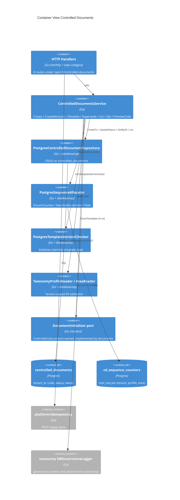
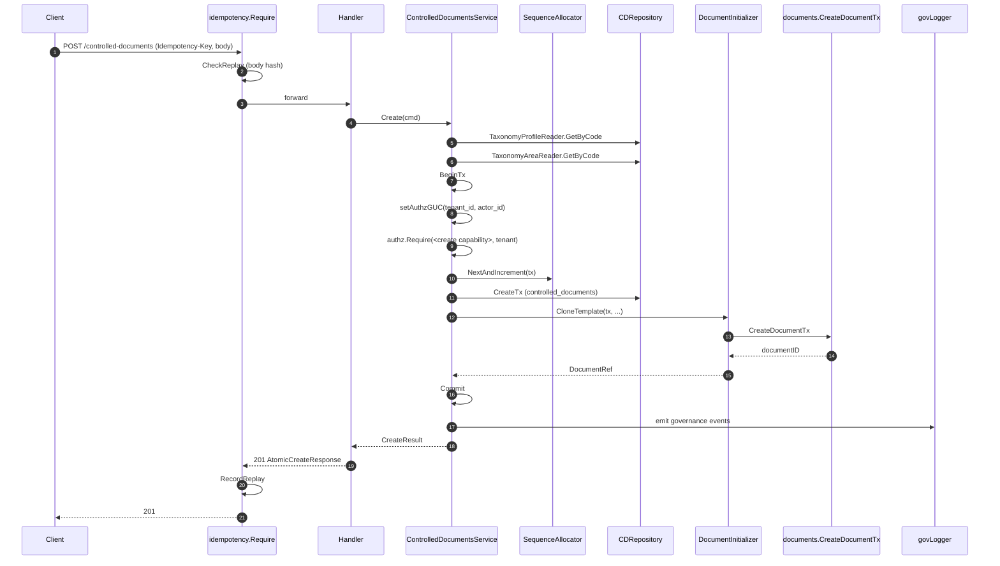
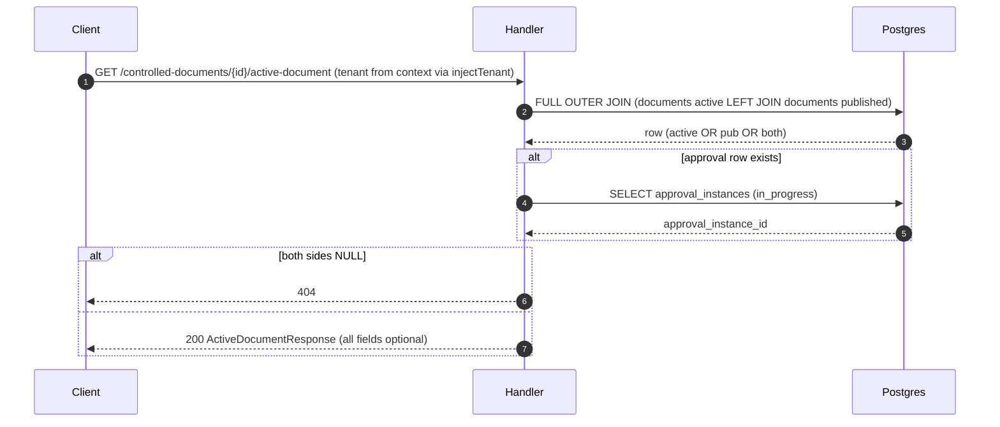
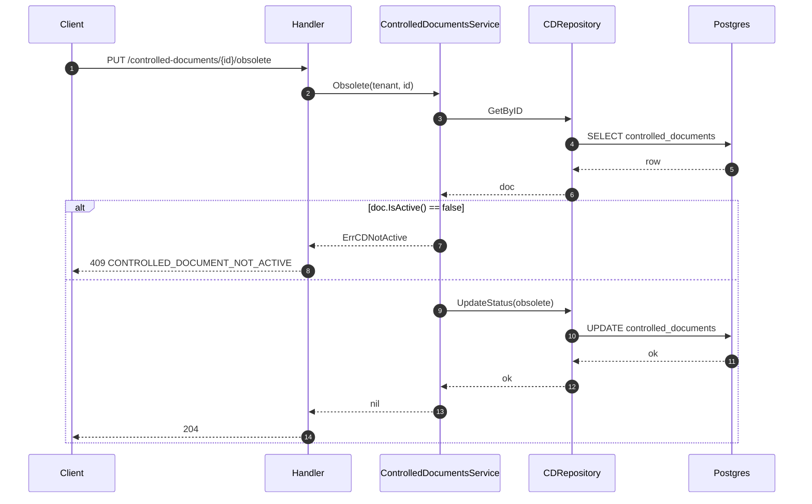

# Module: Controlled Documents

> Living architecture doc. Arc42 (12 sections) + C4 (Context/Container) Mermaid diagrams. Supersedes the 2026-05-07 stub.

**Last verified:** 2026-05-25 (backend medium quality-bar sync) | **Owner:** leandro | **Status:** active | **Maturity:** L2

> **Key files:**
> - `internal/modules/controlleddocuments/module.go:25` - module wiring (`New`, dependencies)
> - `internal/modules/controlleddocuments/application/service.go:104` - service `Create` (legacy literal struct identifier noted in Historical Literal Key Notes)
> - `internal/modules/controlleddocuments/application/service.go:293` - `Obsolete` / `Supersede` via `changeStatus`
> - `internal/modules/controlleddocuments/delivery/http/handler.go:48` - `injectTenant` middleware (reads tenant via `tenant.FromContext`)
> - `internal/modules/controlleddocuments/delivery/http/handler.go:60` - `tenantIDFromContext` (local context accessor)
> - `internal/modules/controlleddocuments/delivery/http/routes.go:43` - `AtomicCreateControlledDocument` handler
> - `internal/modules/controlleddocuments/delivery/http/routes.go:232` - `GetActiveDocument` handler (FULL OUTER JOIN)
> - `internal/modules/controlleddocuments/delivery/http/routes.go:488` - `tenantIDFromRequest` -> `tenant.FromContext`
> - `internal/modules/controlleddocuments/domain/document_initializer.go:30` - `DocumentInitializer` port (consumed by documents)
> - `internal/modules/controlleddocuments/infrastructure/repository.go:184` - `UpdateStatus` (lifecycle mutation)
> - `migrations/0124_registry_controlled_documents.sql` - initial table (legacy literal migration filename)
> - `migrations/0182_cd_sequence_per_area.sql` - per-area sequence (ADR 0011)

---

## 1. Introduction & Goals

The **controlled-documents** module owns the catalog of code-numbered Controlled Documents (CDs). Each row in `public.controlled_documents` is a numbered slot binding a (`profile_code`, `process_area_code`) pair to a chain of `documents` revisions. The CD itself carries no content - it owns the identity, the per-(tenant, profile, area) sequence number, and the lifecycle status (`active | obsolete | superseded`).

### 1.1 Requirements overview

- Atomic CD + first-revision create - source: [wiki/decisions/0011-cd-atomic-create.md](decisions/0011-cd-atomic-create.md)
- Per-(profile, area) monotonic 3-digit sequence (`DC-RH-001`) - source: [wiki/concepts/controlled-documents.md](concepts/controlled-documents.md)
- `Idempotency-Key` replay safety on creation paths - source: ADR 0011
- Preview endpoint returns next code without sequence reservation - source: ADR 0011
- Active-document lookup tolerates published-only state (FULL OUTER JOIN) - source: E10 fix (commit 1dfcf3da)

### 1.2 Quality Goals

| Rank | Goal | How verified |
|---|---|---|
| 1 | Numbering integrity          no duplicate / out-of-band CD codes | `cd_sequence_counters` PK on (tenant_id, profile_code, process_area_code); UNIQUE (tenant_id, profile_code, code) on `controlled_documents`; `domain/sequence_test.go` |
| 2 | No orphan slots          CD row + first revision either both commit or both roll back | `application/integration_test.go` covering Create+CloneTemplate in single `*sql.Tx` (`service.go:243-257`) |
| 3 | Replay safety on creation paths | `internal/platform/idempotency` middleware + body-hash check; `routes_contract_test.go` |

### 1.3 Stakeholders

| Role | Expectation |
|---|---|
| Document author | Can issue a new CD via `POST /api/v1/controlled-documents` and immediately edit the first revision |
| Quality manager | `controlled_documents.code` is stable, audit-traceable, area-isolated |
| Operator | Per-(tenant, profile, area) sequence is monotonic; lifecycle transitions are recoverable |
| Frontend developer | `GET .../active-document` returns 200 with at least one document handle whenever the CD has any revision |

---

## 2. Architecture Constraints

- Language / runtime: Go 1.25
- Persistence: Postgres (per [wiki/architecture/data-model.md](architecture/data-model.md))
- API contract: OpenAPI 3.0.3 via oapi-codegen v2 - canonical spec partial `api/openapi/v1/partials/controlled-documents.yaml`; canonical public API prefix remains `/api/v1/controlled-documents*`.
- Authz: two-tier per [wiki/decisions/0007-two-tier-authz.md](decisions/0007-two-tier-authz.md); Plan 5 wired `authz.Require` + tripwire on `controlled_documents` and `cd_sequence_counters` (T-001/T-004 closed); `Obsolete`/`Supersede` use dedicated lifecycle capability constants from `iamdomain` (legacy literal identifiers; see Historical Literal Key Notes)
- Idempotency: shared platform `internal/platform/idempotency` per ADR 0011
- Numbering: 3-segment `{PROFILE}-{AREA}-{NNN}` per ADR 0011
- Error envelope: **RFC 9457** `application/problem+json` via `httpresponse.WriteError` -> `problem.Write` (T-003 closed Plan 7); `ErrTemplateProfileMismatch` -> 422 `template_invalid` via direct `problem.Write` (T-007 closed Plan 7)

---

## 3. System Scope & Context (C4 Level 1)

### 3.1 Business Context

Controlled-documents owns the **identity** of every controlled document under QMS. A row exists from the moment a numbered slot is issued; it is the durable anchor that approval, audit, and downstream PDFs key against. Taxonomy owns the abstract classification (families -> profiles -> areas); controlled-documents owns the concrete catalog.

### 3.2 Technical Context

**Inbound:** 8 HTTP routes under `/api/v1/controlled-documents/*` (see section 5.3). Go consumers: `internal/modules/documents` (imports `controlleddocumentsdomain` for `ControlledDocument`, `DocumentInitializer`, `DocumentRef`, `CloneTemplateRequest`).

**Outbound:** Postgres (`controlled_documents`, `cd_sequence_counters`, reads of `documents`, `approval_instances`, `document_revisions`, `document_profiles`, `document_process_areas`, `templates_template_version`). Cross-module Go: `taxonomy/domain`, `taxonomy/application` (governance logger), `platform/idempotency`, `platform/authn`, `platform/httpresponse`, `platform/tenant`.

---

## 4. Solution Strategy

- **Atomic multi-row create in a single `*sql.Tx`**          driver: ADR 0011 (eliminate orphan slot risk). Controlled-documents opens the tx, allocates the sequence, inserts the CD, calls `DocumentInitializer.CloneTemplate` (documents materializes the first revision inside the same tx), commits, then emits governance events.
- **Controlled-documents-owned port for the cross-module call**          driver: avoid circular imports. `domain/document_initializer.go:30` defines the interface; `documents/application/cd_initializer.go` implements it; main.go injects via `WithDocumentInitializer` post-construction.
- **Per-(tenant, profile, area) sequence counter table**          driver: ADR 0011 (replaces single `profile_sequence_counters` keyed only on profile; no cross-area counter bleed).
- **Shared idempotency platform on POST create + revisions**          driver: ADR 0011 (Stripe-style key replay; body-hash conflict detection).
- **FULL OUTER JOIN for active-document lookup** - driver: E10 fix; published-only CDs must return 200 with `publishedDocumentId` so frontend renders download link.

---

## 5. Building Block View (C4 Level 2 - Container)

### 5.1 Whitebox - Controlled Documents

### 5.2 Public surface (selected)

Full list in `_artifacts/01-surface.md` (89 exported symbols). Anchors below:

| File | Symbol | Kind | Purpose |
|---|---|---|---|
| `module.go:15` | `Module`, `New` | type + ctor | DI entry; builds repo, allocator, readers, service, handler |
| `application/service.go:31` | service struct | type | Use-case orchestrator (legacy literal struct identifier noted in Historical Literal Key Notes) |
| `application/service.go:104` | `Create` | method | Atomic CD + first-revision create |
| `application/service.go:279` | `PreviewCode` | method | Read-only next-code peek |
| `application/service.go:293` | `Obsolete` / `Supersede` | method | Lifecycle transitions via `changeStatus` |
| `application/service.go:330` | `CreateRevision` | method | New revision on existing CD |
| `application/migration.go:13` | `BackfillLegacyDocuments` | func | Recovery-only legacy data maintenance hook |
| `domain/controlled_document.go:18` | `ControlledDocument` | struct | Domain entity |
| `domain/controlled_document.go:13-15` | `CDStatusActive/Obsolete/Superseded` | const | Status enum |
| `domain/controlled_document.go:48` | `AutoCode` | func | Format `{profile}-{area}-{NNN}` |
| `domain/document_initializer.go:30` | `DocumentInitializer` | iface | Cross-module port (documents implements) |
| `domain/document_initializer.go:20` | `NewCloneTemplateRequest` | func | Validates clone-template requests before crossing the documents port |
| `domain/document_initializer.go:38` | `NewDocumentRef` | func | Validates document handles returned by the documents port |
| `domain/sequence.go:13` | `SequenceAllocator` | iface | Counter port |
| `domain/resolution.go:30` | `Resolve` | func | Template-version resolution (default vs override) |
| `infrastructure/repository.go:137` | `CreateTx` | method | Insert in caller-owned tx |
| `infrastructure/repository.go:184` | `UpdateStatus` | method | Lifecycle UPDATE |
| `infrastructure/repository.go:239` | `NextAndIncrement` | method | Sequence allocation |

### 5.3 HTTP operations

All routes registered via `Handler.RegisterRoutes` (`delivery/http/handler.go:67`) onto the shared `http.ServeMux`.

| Method | Path | OperationID | Handler | Authz |
|---|---|---|---|---|
| POST | `/api/v1/controlled-documents` | `atomicCreateControlledDocument` | `routes.go:43` | create capability (tier-1 + in-tx `authz.Require`; sets `metaldocs.tenant_id`/`actor_id` before sequence/CD writes) |
| POST | `/api/v1/controlled-documents/{id}/revisions` | `createControlledDocumentRevision` | `routes.go:148` | create capability (tier-1) |
| GET | `/api/v1/controlled-documents/preview-code` | `previewControlledDocumentCode` | `routes.go:127` | (read; resolver mapping outside module) |
| GET | `/api/v1/controlled-documents` | `listControlledDocuments` | `routes.go:23` | (read) |
| GET | `/api/v1/controlled-documents/{id}` | `getControlledDocument` | `routes.go:190` | (read) |
| GET | `/api/v1/controlled-documents/{id}/active-document` | `getActiveDocument` | `routes.go:232` | (read; tenant from `tenant.FromContext` via `injectTenant` middleware) |
| PUT | `/api/v1/controlled-documents/{id}/obsolete` | `obsoleteControlledDocument` | `routes.go:328` | obsolete capability (legacy literal constant; see Historical Literal Key Notes)          T-001 closed Plan 5 |
| PUT | `/api/v1/controlled-documents/{id}/supersede` | `supersedeControlledDocument` | `routes.go:337` | supersede capability (legacy literal constant; see Historical Literal Key Notes)          T-001 closed Plan 5 |

## API Route Truth Table (Plan 8 Baseline)

| Method | Path | Runtime owner (file:line) | Handler method | Spec path | operationId | Codegen method | Status | Notes |
|---|---|---|---|---|---|---|---|---|
| GET | `/api/v1/controlled-documents` | `internal/modules/controlleddocuments/delivery/http/handler.go:95` | `controlleddocumentsapi.HandlerWithOptions` dispatch | `/api/v1/controlled-documents` | `listControlledDocuments` | `ListControlledDocuments` | Aligned | Generated boundary mounted |
| POST | `/api/v1/controlled-documents` | `internal/modules/controlleddocuments/delivery/http/handler.go:95` | `controlleddocumentsapi.HandlerWithOptions` dispatch | `/api/v1/controlled-documents` | `atomicCreateControlledDocument` | `AtomicCreateControlledDocument` | Aligned | Idempotency middleware wraps POST path |
| GET | `/api/v1/controlled-documents/preview-code` | `internal/modules/controlleddocuments/delivery/http/handler.go:95` | `controlleddocumentsapi.HandlerWithOptions` dispatch | `/api/v1/controlled-documents/preview-code` | `previewControlledDocumentCode` | `PreviewControlledDocumentCode` | Aligned |  |
| GET | `/api/v1/controlled-documents/{id}` | `internal/modules/controlleddocuments/delivery/http/handler.go:95` | `controlleddocumentsapi.HandlerWithOptions` dispatch | `/api/v1/controlled-documents/{id}` | `getControlledDocument` | `GetControlledDocument` | Aligned |  |
| POST | `/api/v1/controlled-documents/{id}/revisions` | `internal/modules/controlleddocuments/delivery/http/handler.go:95` | `controlleddocumentsapi.HandlerWithOptions` dispatch | `/api/v1/controlled-documents/{id}/revisions` | `createControlledDocumentRevision` | `CreateControlledDocumentRevision` | Aligned | Idempotency middleware wraps POST path |
| GET | `/api/v1/controlled-documents/{id}/active-document` | `internal/modules/controlleddocuments/delivery/http/handler.go:95` | `controlleddocumentsapi.HandlerWithOptions` dispatch | `/api/v1/controlled-documents/{id}/active-document` | `getActiveDocument` | `GetActiveDocument` | Aligned |  |
| PUT | `/api/v1/controlled-documents/{id}/obsolete` | `internal/modules/controlleddocuments/delivery/http/handler.go:95` | `controlleddocumentsapi.HandlerWithOptions` dispatch | `/api/v1/controlled-documents/{id}/obsolete` | `obsoleteControlledDocument` | `ObsoleteControlledDocument` | Aligned |  |
| PUT | `/api/v1/controlled-documents/{id}/supersede` | `internal/modules/controlleddocuments/delivery/http/handler.go:95` | `controlleddocumentsapi.HandlerWithOptions` dispatch | `/api/v1/controlled-documents/{id}/supersede` | `supersedeControlledDocument` | `SupersedeControlledDocument` | Aligned |  |

Module contract status: Generated boundary mounted
Owner: leandro

---

## 6. Runtime View

### 6.1 atomicCreateControlledDocument

State transitions:

| Entity | From | To | Trigger | Capability |
|---|---|---|---|---|
| `controlled_documents` (new row) | (none) | `active` | `CreateTx` | create capability (tier-1 IAM middleware + in-tx `authz.Require`) |
| `documents` (new row) | (none) | `draft` | `CreateDocumentTx` (in same tx) | same |
| `cd_sequence_counters.next_seq` | N | N+1 | `NextAndIncrement` | same |
| `governance_events` | (none) | event row (post-commit) | `govLogger.Log` | same |

Failure modes:

| Condition | HTTP | Code |
|---|---|---|
| Missing `Idempotency-Key` | 400 | `IDEMPOTENCY_KEY_REQUIRED` |
| Same key, different body | 422 | `IDEMPOTENCY_KEY_CONFLICT` |
| Profile/area archived | 409 | `PROFILE_ARCHIVED` / `AREA_ARCHIVED` |
| Override template mismatch | 409 | `TEMPLATE_PROFILE_MISMATCH` |
| Code uniqueness violation | 409 | `CONTROLLED_DOCUMENT_CODE_TAKEN` |
| Template/profile mismatch | 422 | `template_invalid` (`routes.go:470-471`          T-007 closed Plan 7) |

Detail: `_artifacts/02-flow-atomic-create.md`.

### 6.2 getActiveDocument

State transitions: none (read).

Tripwire pairing: VIOLATION          no `authz.Require`, no `metaldocs.assert_caps`, no GUC; tenant is now sourced from `tenant.FromContext` (via `injectTenant` middleware) rather than `X-Tenant-ID` header (Plan 3 fix). Authz gap on this read path persists          see T-006.

Detail: `_artifacts/02-flow-get-active.md`.

### 6.3 obsoleteControlledDocument / supersedeControlledDocument

State transitions:

| Entity | From | To | Trigger | Guard | Audit emitted? |
|---|---|---|---|---|---|
| `controlled_documents` | `active` | `obsolete` | `Obsolete` op | `ErrCDNotActive` if not active | **YES          T-002 closed Plan 6a** |
| `controlled_documents` | `active` | `superseded` | `Supersede` op | `ErrCDNotActive` if not active | **YES          T-002 closed Plan 6a** |

Tripwire pairing: active          `authz.Require(<obsolete-or-supersede capability>, ...)` called inside `changeStatus` tx (`service.go:327`); `trg_require_cap_asserted` on `controlled_documents` (UPDATE, OR-logic accepts either lifecycle capability, migration 0188 line 201). T-001/T-004 closed Plan 5.

Detail: `_artifacts/02-flow-obsolete.md`.

---

## 7. Deployment View

- Binary: single Go server (`apps/api/cmd/metaldocs-api`)
- Process: `:8081` (see [wiki/references/local-dev-startup.md](references/local-dev-startup.md))
- Migrations: applied at startup; files at repo-root `migrations/` (7 affect controlled-documents: 0124, 0126, 0127, 0128, 0167, 0182, 0183 - see `_artifacts/04-persistence.md` section 6)
- Legacy controlled-documents maintenance is not part of normal API startup. Use `Module.RunLegacyMaintenance` only for intentional recovery on older databases.
- Environment: module reads no env vars directly (`_artifacts/03-deps.md` section 4)

---

## 8. Cross-cutting Concepts

### 8.1 Authentication & Authorization

- Tier 1 (HTTP edge): IAM `CapabilityService` resolves create capability (legacy literal constant; see Historical Literal Key Notes) for POST routes (`apps/api/cmd/metaldocs-api/permissions.go:186-187`; reseeded in `migrations/0165_role_capabilities_reseed.sql` for `editor`, `author`, `system_admin`).
- Tier 2 (in-tx `authz.Require`): applied in `Create`/`CreateTx` (create capability) and `changeStatus` (obsolete/supersede capabilities). Plan 5 (T-001/T-004 closed).
- Tier 3 (Postgres `enforce_capability_asserted` tripwire): `migrations/0188_tripwire_extend.sql:201-208` attaches `trg_require_cap_asserted` to `controlled_documents` (INSERT + UPDATE with OR-logic) and `cd_sequence_counters`.
- See [wiki/concepts/authz-tiers.md](concepts/authz-tiers.md) and [wiki/decisions/0007-two-tier-authz.md](decisions/0007-two-tier-authz.md).

### 8.2 Error envelope

RFC 9457 `application/problem+json`. `httpresponse.WriteError` at `internal/platform/httpresponse/response.go:16-18` calls `problem.Write(w, problem.New(status, code, message))`. `ErrTemplateProfileMismatch` uses a direct `problem.Write` call at `routes.go:470-471` (422 `template_invalid`). T-003 and T-007 both closed Plan 7.

### 8.3 Idempotency

`Idempotency-Key` header required on POST create + POST revisions. Middleware: `internal/platform/idempotency/middleware.go:22`. Store: `postgres_store.go:19`. Body-hash conflict -> 422 `IDEMPOTENCY_KEY_CONFLICT`. PUT lifecycle routes are NOT covered (T-008).

### 8.4 Pagination

`List` uses domain `CDFilter` (`domain/port.go:19`)          simple LIMIT/OFFSET. No cursor pagination (not required by current consumers).

### 8.5 Audit / Governance

Create path emits governance events post-commit via `s.govLogger.Log(...)` (`service.go:267-271`), wired from `taxonomyapp.NewDBGovernanceLogger(deps.DB)` (`module.go:31`)          cross-module sink coupling (T-008). Obsolete / Supersede audit gap (T-002) is closed per Plan 6a; see tech-debt register.

### 8.6 Concurrency / Transactions

The controlled-documents service owns the transaction (`Create` on the module service struct; legacy literal identifier noted in Historical Literal Key Notes). Sequence allocator and repository transaction-oriented methods accept the module-level `domain.DBTX` abstraction (`ExecContext` / `QueryContext` / `QueryRowContext`) while runtime authz still asserts against the concrete caller-owned `*sql.Tx`. Cross-module `DocumentInitializer.CloneTemplate` runs inside the same tx          atomic CD + first revision per ADR 0011.

### 8.7 Tenant scoping

`controlled_documents.tenant_id NOT NULL`; `cd_sequence_counters` PK includes `tenant_id`. Indexes lead with `tenant_id` (`ix_controlled_documents_tenant_area`, `ix_controlled_documents_tenant_profile`). Tenant is enforced via query-argument predicate in every WHERE clause; no `SET LOCAL metaldocs.tenant_id` GUC + RLS (T-005). `migrations/0127_documents_v2_tenant_consistency_trigger.sql` cross-checks tenant on `documents_v2` writes (legacy bridge).

Tenant is sourced from `tenant.FromContext` via the `injectTenant` thin middleware (`delivery/http/handler.go:48`), which reads the value injected by auth middleware (from `auth_sessions.tenant_id`). This replaces the prior `X-Tenant-ID` header reads (Plan 3 sweep). See `wiki/architecture/tenant-context.md`.

### 8.8 Numbering invariants

- `cd_sequence_counters.next_seq` is monotonic per (tenant, profile_code, process_area_code).
- Code format `{PROFILE}-{AREA}-{NNN}` zero-padded to 3 digits (`domain/sequence.go` -> `AutoCode`).
- `controlled_documents.code` immutability is enforced by the `trg_controlled_documents_code_immutable` trigger calling `reject_code_update()` (`migrations/0124_registry_controlled_documents.sql:47-59`, legacy literal migration filename).

---

## 9. Architecture Decisions

| Decision | Link / Status |
|---|---|
| Atomic CD + first-revision create + per-area numbering + `Idempotency-Key` | [wiki/decisions/0011-cd-atomic-create.md](decisions/0011-cd-atomic-create.md) |
| Two-tier authz | [wiki/decisions/0007-two-tier-authz.md](decisions/0007-two-tier-authz.md) (tier-2/3 wired Plan 5          T-001/T-004 closed) |
| Contract-first API (OpenAPI + oapi-codegen) | [wiki/decisions/0012-contract-first-api.md](decisions/0012-contract-first-api.md) (422 `template_invalid` spec/handler drift          **CLOSED Plan 7 T-007**) |
| Which CD lifecycle events emit audit | tech-debt: missing-ADR (T-002) |
| Capability granularity (separate create / obsolete / supersede capabilities) | implemented Plan 5 (migration 0187 + dedicated lifecycle capability constants in `domain/model.go`); missing standalone ADR          ADR-TODO per Plan 13 |
| RFC 9457 envelope adoption | **CLOSED Plan 7** (T-003 + T-007) |
| GUC-based tenant scoping vs query-arg only | tech-debt: missing-ADR (T-005) |
| Read-path authz contract (e.g. `GetActiveDocument` tenant source) | tech-debt: missing-ADR (T-006) |
| Where controlled-documents audit sink should live (own logger vs shared taxonomy sink) | implementation debt closed in tech-debt (T-008); standalone ADR still missing |
| Documents DI cycle resolution (`WithDocumentInitializer` setter) | tech-debt: missing-ADR (T-010) |
| OpenAPI partial directory (`v1/` for `/api/v1/` routes) | tech-debt: missing-ADR (T-011) |
| Exported-symbol doc-comment policy | tech-debt: missing-ADR (T-012) |

---

## 10. Quality Requirements

| Goal | Scenario | Pass criteria |
|---|---|---|
| Numbering integrity | Two concurrent `POST /controlled-documents` for same (profile, area) | Both succeed with distinct sequential codes; `cd_sequence_counters.next_seq` advances by 2 |
| No orphan slot | `CreateDocumentTx` returns error mid-tx | `controlled_documents` row NOT visible; `next_seq` NOT advanced |
| Replay safety | Replay POST with same `Idempotency-Key` and body | 201 with original CD payload; no new row |
| Body-hash conflict | Same key, different body | 422 `IDEMPOTENCY_KEY_CONFLICT`; no new row |
| Active-document publish-only | CD with only published revisions | 200 with `publishedDocumentId` set; `documentId` omitted |
| Active-document empty CD | CD with no revisions | 404 |
| Lifecycle guard | `PUT .../obsolete` on already-obsolete CD | 409 `CONTROLLED_DOCUMENT_NOT_ACTIVE` |
| Code immutability | Direct SQL `UPDATE controlled_documents SET code = ...` | Postgres trigger raises (`reject_code_update`) |

---

## 11. Risks & Technical Debt

Detail in [wiki/modules/controlled-documents-tech-debt.md](modules/controlled-documents-tech-debt.md). Severity rubric: see top of that file (concrete triggers; do not invent local definitions).

- Critical: 2
- Major: 6
- Minor: 4

Top 3 (by severity, then blast-radius):

1. T-006          `GetActiveDocument` has no authz check for the read path; residual gap after Plan 3 header-trust fix.
2. T-005          Tenant scoping relies on query-arg only; no GUC + RLS backstop on controlled-documents-owned tables.
3. T-009          DI cycle resolved via post-construction setter; latent order-of-construction contract remains.
(T-001 closed Plan 5: lifecycle authz wired. T-002 closed Plan 6a: obsolete/supersede audit gap closed. T-004 closed Plan 5: tripwire attached to `controlled_documents` + `cd_sequence_counters`. T-008 closed Plan 6a per tech-debt register.)

### Coverage stats

- Public symbols undocumented: 79 / 90 (computed from `_artifacts/01-surface.md`; deferred to T-012)
- Operations missing C4 placement: 0 / 8
- Cross-deps missing in section 5/section 8: 0 / 13 (IN-edges) + 0 / 6 (OUT-edges)
- State transitions missing in section 6: 0 / 2 (Obsolete, Supersede both in section 6.3; Create in section 6.1)
- Decisions without ADR link: 9 / 12

---

## 12. Glossary

| Term | Definition |
|---|---|
| Controlled Document (CD) | A numbered slot in `controlled_documents` binding (profile_code, process_area_code) to a chain of `documents` revisions |
| Slot | A CD row before/without document content; the durable identity |
| Sequence counter | `cd_sequence_counters.next_seq`, monotonic per (tenant, profile, area) |
| AutoCode | Format `{PROFILE}-{AREA}-{NNN}` (e.g. `DC-RH-001`) |
| Active document | The current non-terminal `documents` row for a CD (draft/under_review/approved/rejected/scheduled) OR the most recent `published` row |
| `DocumentInitializer` | Controlled-documents-owned port the documents module implements to materialize the first revision inside the controlled-documents tx |

---

## Cross-links

- Related ADRs: [0011](decisions/0011-cd-atomic-create.md), [0007](decisions/0007-two-tier-authz.md), [0012](decisions/0012-contract-first-api.md)
- Related concepts: [controlled-documents](concepts/controlled-documents.md), [authz-tiers](concepts/authz-tiers.md)
- Related modules: [documents](modules/documents.md), [taxonomy](modules/taxonomy.md), [approval](modules/approval.md)
- Workflow: [user-onboarding](workflows/user-onboarding.md) Step 5
- Backlog: [controlled-documents-refactor](backlog/controlled-documents-refactor.md)
- Tech debt: [controlled-documents-tech-debt](modules/controlled-documents-tech-debt.md)

### Historical Literal Key Notes

- Legacy literal capability keys in historical artifacts/migrations: `registry.create`, `registry.obsolete`, `registry.supersede`.
- Legacy literal service/capability identifiers preserved in historical references: `RegistryService`, `CapRegistryCreate`, `CapRegistryObsolete`, `CapRegistrySupersede`.

## Changelog

- 2026-05-29 - Frontend surface removed: legacy `/controlled-documents` list/detail/explorer pages and Rail "Registro" nav entry deleted. CD identity and lifecycle (create / revise / publish / obsolete / supersede) are now driven exclusively through the Documents flow (`/documents`, `/documents/new`, `/documents/:id`). Backend module (routes, contract, authz, repositories) is unchanged; FE still consumes `features/controlled-documents/api`, `queries/`, and `types.ts` from the Documents flow.
- 2026-05-25 - Backend quality-bar sync: repository transaction ports now use the module-level `domain.DBTX` interface instead of exposing `*sql.Tx` in repository contracts; clone-template/document-ref constructors validate invalid zero-value port payloads; application/repository error paths wrap underlying errors with operation context and governance warnings use `slog.WarnContext` with tenant/actor fields.
- 2026-05-21 - Runtime mount canonicalization: controlled-documents now mounts public routes through `controlleddocumentsapi.HandlerWithOptions`; idempotency remains route-scoped to the two POST operations, and missing `Idempotency-Key` is normalized to `IDEMPOTENCY_KEY_REQUIRED`.
- 2026-05-20 - Create-revision conflict sync: `POST /api/v1/controlled-documents/{id}/revisions` now preserves the database-owned single-active-sibling invariant (`ux_documents_cd_active`) but translates that collision to `409 ACTIVE_REVISION_ALREADY_EXISTS` instead of surfacing a generic internal error when a second active revision is attempted concurrently.
- 2026-05-20 - Active-document approval-instance hardening: `GET /api/v1/controlled-documents/{id}/active-document` now treats `documents.status` as the only source of truth for `approvalState`, enriches `approvalInstanceId` only when the active lineage row is actually `under_review`, and returns `500 INTERNAL_ERROR` if that secondary lookup fails instead of silently omitting review context.
- 2026-05-20 - Active-document scheduled-state sync: `GET /api/v1/controlled-documents/{id}/active-document` now derives `approvalState` from the governed `documents.status` of the active lineage row, so a scheduled replacement remains visible to `/documents/:id` as `scheduled` instead of drifting back to `approved`.
- 2026-05-20 - Canonical sibling-state sync: `GET /api/v1/controlled-documents/{id}/active-document` remains the technical lookup consumed by `/documents/:id` to decide whether a revision branch is open; frontend now treats every returned active approval state (`draft`, `under_review`, `approved`, `scheduled`, `rejected`) as branch-active context.
- 2026-05-20 - Active-document publish-only sync: `GET /api/v1/controlled-documents/{id}/active-document` no longer synthesizes `approvalState="draft"` when a controlled document has only a published revision. The controlled-documents FULL OUTER JOIN now leaves the active side absent in publish-only state and returns just `publishedDocumentId`, matching the OpenAPI contract and the canonical `/documents/:id` publish flow.
- 2026-05-18 - Frontend contract sync: the controlled-document detail contract remains the source of truth for `visibility`, and the editor sidebar now consumes that runtime field directly through generated frontend types instead of a controlled-documents-local handwritten omission.
- 2026-05-15 - Database foundation sync: removed startup migration alias references (`RunStartupMigrations`), confirmed legacy maintenance is explicit recovery-only, and aligned startup notes with the current DB bootstrap workflow.
- 2026-05-15 - Runtime repair: atomic create now primes `metaldocs.tenant_id`/`metaldocs.actor_id` and asserts `registry.create` (legacy literal capability key) inside the caller-owned transaction before sequence/CD writes, restoring Plan 5 tripwire pairing for `/api/v1/controlled-documents`.

- 2026-05-11 - Plan 3 sweep: all `X-Tenant-ID` header reads replaced with `tenant.FromContext`; `injectTenant` middleware documented; section 5.3 T-006 note updated; section 6.2 sequence + tripwire note updated; section 8.7 tenant-scoping paragraph added; Key files updated.
- 2026-05-11 - initial Arc42 + C4 publish; supersedes 2026-05-07 stub.

