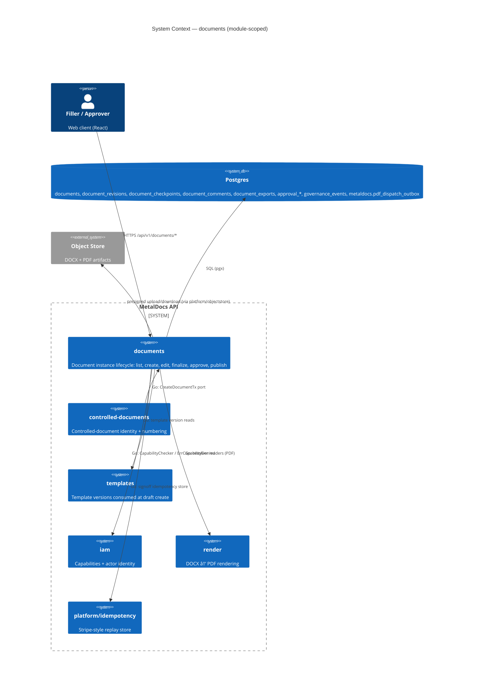

# Module: documents

> Living architecture doc. Arc42 (12 sections) + C4 (Context / Container) Mermaid diagrams + ADR links.

**Last verified:** 2026-06-14 (eigenpal vendor path updated to third_party/eigenpal/; Wave 2.12: db==nil branches removed from documents service (single-mode); fillin_service.go authz-bypass (NewFillInServiceNoAuthz + if s.db != nil) eliminated — requireDocEditDraft now unconditional at fillin_service.go:94; freeze_service.go retains ADR-0015 optional-tx-enlistment pattern annotated //cilint:allow-dualmode at lines 178/314/379 (deferred); approval reauth uses Postgres limiter unconditionally. Prior Wave 2: ForceReleaseSession+Archive audit writes in-tx WriteTx; GetFinalizePrereqs extracted; autosave/export routes rate-limited. Prior: Stage-1 backend audit drift patch: §6.2 renameDocument response corrected 204→200+body; §8.4 pagination corrected to keyset cursor, limit param default 20 cap 100, response {items,page:{next_cursor,has_more},total}; T-010 stale "not mounted" claim corrected to FLAG-03 adapter-discards-params; prior: 2026-06-09 (std-execution Family 5 path-param snake_case: document-comment routes `{libraryID}`→`{library_id}`; prior: 2026-06-08 Phase F F4/F8: handler.go + repository.go line anchors updated for keyset cursor migration and dead-code removal; prior: Phase E1 casing big-bang: `form_data_json`, `revision_number`, `current_revision_*` wire keys updated to snake_case; prior: 2026-06-01) (P2 consolidation: §3/§5 C4 fragments tagged as module-scoped with pointer to canonical diagrams; added Failure modes section) | prior: 2026-05-29 (QA `qa/documents-distribution`: `DocumentDistributionPage` wires real document identity via `useDocumentDetailQuery` (Code, RevisionNumber, Name) at honest surfaces (hero breadcrumb, hero badges, props-driven `DocRefCard`, em-breve banner). Mock distribution UI (KPIStrip / DonutCard / DistributionFacts / CoverageByArea / TimelineCard / RecipientsCard / `lib/distributionMeta.ts`) preserved as design scaffolding for unbuilt fanout/read-tracking feature — every illustrative section wrapped in `IllustrativeBlock` with `aria-hidden="true"` + `Dados ilustrativos · Em breve` watermark + `pointer-events:none` + saturate filter + diagonal-stripe overlay. `role="note"` banner above scaffolding names the real document and states numbers are illustrative. 4 hero CTAs `aria-disabled="true" title="Em breve"`. Preview proof on `PO-RH-002` / `REV00` / `DC_Template_Descricao_Cargo`: identity correct on every honest surface, 5 watermarks aria-hidden, only `GET /api/v1/documents/:id` called — zero phantom endpoints. Fanout + read-tracking Go module remains hard-stop / out of scope — see `backlog/distribuicao.md`. Previous: 2026-05-29 QA `qa/documents-detail` follow-up wired `ProcessAreaCodeSnapshot` + `ProfileCodeSnapshot` into `DocumentPublishedPage` via `useAreasQuery` + `useProfilesQuery` (5 hardcoded "—" sites replaced); removed mock `PLACEHOLDER_RELATED` + `PLACEHOLDER_COMMENTS` from §04/§05 → honest em-breve; fixed misleading status badge + wrong Iniciar-revisão title; tsc clean, 19/19 vitest. Previous: 2026-05-29 `qa/documents-editor` ambiguous-content_hash JOIN fix.) | **Owner:** unassigned | **Status:** active | **Maturity:** L3

---

## 1. Introduction & Goals

`documents` is the controlled-document instance lifecycle module: it owns the `documents` table and its revision/checkpoint/comment/export/approval surfaces. A document is an instance filled from a template version, bound to a controlled-document entry, and moves through `draft → under_review → approved → published → superseded | obsolete`. The module sits between the controlled-documents module (`internal/modules/controlleddocuments`) and the approval sub-package (which materialises approval routes against a document revision).

### 1.1 Requirements overview

- Atomic create of a controlled document + its first draft revision — `wiki/decisions/0011-cd-atomic-create.md`
- Two-tier authorization on mutations — `wiki/decisions/0007-two-tier-authz.md`
- Eigenpal DOCX editor integration for `draft` editing — `wiki/decisions/0001-eigenpal-adoption.md`
- Placeholder snapshot pinned at submit — `wiki/concepts/placeholders.md`
- `{name}` single-brace token substitution at freeze — `wiki/concepts/token-syntax.md`
- Spec-as-source-of-truth for `/api/v1/documents/*` (in progress) — `wiki/decisions/0012-contract-first-api.md`

- DOCX artifact metadata (`file_size_bytes`, `page_count`, `page_count_source`) is stored on technical `document_revisions`, exposed through document detail/autosave responses, and rendered in the editor sidebar from runtime API data.

### 1.2 Quality Goals

| Rank | Goal | How verified |
|---|---|---|
| 1 | Authz isolation on regulated mutations | Tier-1 role gate + tier-2 `authz.Require` + Postgres tripwire; **T-003 closed Plan 5** — all 5 `documents` table mutations now call `authz.Require` + tripwire present in curated baseline (`db/baseline/0001_current_schema.sql:3793`) |
| 2 | Atomic CD+draft create | `CreateDocumentTx` port; one transaction across `controlled_documents`, `documents`, `cd_sequence_counters` (ADR 0011) |
| 3 | Forward-only schema evolution | All `documents`-owned migrations are append-only (`migrations/0001..0183`); rename from `documents_v2` shipped as paired migrations 0167/0168 |

### 1.3 Stakeholders

| Role | Expectation |
|---|---|
| End user (document filler / approver) | Create / edit / submit / sign-off documents; library list filtered by ownership |
| Operator | Predictable migration story; audit trail intact; tripwire defends regulated paths |
| Developer (other modules) | Stable Go ports (`CreateDocumentTx`, `CapabilityChecker`, `SnapshotResolver`); typed errors over generic strings |

---

## 2. Architecture Constraints

- Language / runtime: Go 1.25.
- Persistence: Postgres only; row-level multi-tenancy via `tenant_id` on every owned table (`wiki/architecture/persistence.md`).
- Authz: two-tier per `wiki/decisions/0007-two-tier-authz.md`. Tripwire enforcer reads `metaldocs.asserted_caps` GUC.
- DOCX editor: `@eigenpal/docx-js-editor` from `third_party/eigenpal/` (`wiki/decisions/0001-eigenpal-adoption.md`).
- API contract: OpenAPI 3.0.3 via oapi-codegen (`wiki/decisions/0012-contract-first-api.md`) — spec-mounted via `documentsapi.HandlerWithOptions` + `ServerInterfaceWrapper` (see `internal/modules/documents/module.go:116-127`). Legacy `mux.HandleFunc` routes still exist for the small set of non-spec endpoints (fillin, view, reconstruct) and are wired beneath the generated boundary via `NewGeneratedServerAdapter`.
- Error envelope target: RFC 9457 Problem Details — current code emits legacy `{error:{code,message,…}}` (T-001, mid-migration).

---

## 3. System Scope & Context — module-scoped (C4 Level 1)

> System-level context lives in [`wiki/diagrams/c4-context.md`](../diagrams/c4-context.md). The diagram below is **module-scoped**: it shows documents' immediate Go-level collaborators (controlled-documents, templates, iam, render, idempotency platform) and the owned Postgres tables.



### 3.1 Business Context

Quality-managed documents. Each instance traces back to a template + a controlled-document code (e.g. `POP-MAN-027`). Drafts are editable; once submitted, the placeholder catalog is frozen and approval signatures gate publication. Audit trail is the QMS evidence.

### 3.2 Technical Context

**Inbound HTTP (from FE):** see §5.3.

**Inbound Go (consumers — from `_artifacts/03-deps.md`):**
- `apps/api/cmd/metaldocs-api/main.go:22` — wires services + handler + approval handler
- `apps/api/internal/wiring/documents.go:6` — `NewCapabilityChecker` adapter at `:24` (ADR 0007 J2)
- `apps/worker/cmd/metaldocs-worker/main.go:8` — worker side
- `internal/modules/iam/integration_test.go:16`
- `apps/jobs/cmd/metaldocs-jobs/main.go:1` — dedicated scheduled-publish jobs runtime built from the approval/documents scheduler path
- `internal/modules/jobs/stuck_instance_watchdog/job.go:10`
- `internal/platform/docgenv2/templates_snapshot_reader.go:8`
- `internal/platform/objectstore/document_presigner.go:17`

**Outbound Go (from `_artifacts/03-deps.md`):**
- `internal/modules/iam/domain` (`fillin_handler.go:16`) — typed `iamdomain.Capability` consts; cross-refs `iam` T-001
- `internal/modules/iam/application` (`handler.go:17`) — `ErrCapabilityDenied` sentinel; cross-refs `iam` T-009
- `internal/modules/iam/authz` (`fillin_handler.go:15`)
- `internal/modules/controlleddocuments/domain`, `internal/modules/templates/domain`
- `internal/modules/render` (`resolver_readers.go:9`)
- `internal/platform/idempotency` (`approval/infrastructure/postgres_signoff_idemp_store.go:9`)
- `internal/platform/tenant`, `internal/platform/docgenv2`, `internal/platform/httpresponse` (`handler.go:20`), `internal/platform/ratelimit` (`module.go:13`), `internal/platform/servicebus` (`export_service.go:10`)

**DB tables owned (from `_artifacts/04-persistence.md`, full schemas in artifact):**
`documents`, `editor_sessions`, `document_revisions`, `document_checkpoints`, `document_placeholder_values`, `document_exports`, `document_comments`, `approval_routes`, `approval_route_stages`, `approval_instances`, `approval_stage_instances`, `approval_signoffs`, `governance_events`, `metaldocs.pdf_dispatch_outbox`.

**Frontend counterpart:** `frontend/apps/web/src/features/documents/` — out of scope for this backend Arc42 but cross-referenced in §12.

---

## 4. Solution Strategy

- **Clean-architecture layering** (delivery / application / domain / repository) — driver: project convention enforced by api-lint rule "ports live in application".
- **Two-tier authz with a Postgres tripwire** — driver: `wiki/decisions/0007-two-tier-authz.md`. Tier-1 role gate at HTTP edge, tier-2 `authz.Require(ctx, tx, cap, area)` in transaction, GUC-driven trigger on `approval_instances` + `approval_signoffs`.
- **Atomic CD+draft via a `CreateDocumentTx` port** — driver: `wiki/decisions/0011-cd-atomic-create.md`. controlled-documents owns the call site; documents exposes only the port and the row writer.
- **Placeholder snapshot pinned at submit** — driver: `wiki/concepts/placeholders.md`. `application.SnapshotService` populates `placeholder_schema_snapshot`; trigger `enforce_snapshot_on_submit_trg` (`migrations/0152_*.sql:47`) blocks `under_review` transitions with a null snapshot.
- **Sub-package for approval mechanics** — driver: cohesion between document state transitions and the approval-instance + signoff lifecycle. Lives at `internal/modules/documents/approval/`; the top-level `internal/modules/approval/` path does **not** exist in workspace (resolved during Phase 3).
- **Spec-mounted via generated boundary** — driver: ADR 0012. `api.gen.go` is mounted in `RegisterRoutes` (`module.go:116-127`) using `documentsapi.HandlerWithOptions` + `NewGeneratedServerAdapter`, with an RFC 9457 `ErrorHandlerFunc` for wrapper-validation failures. Non-spec routes (fillin, view, reconstruct) fall through to the adapter's legacy mux beneath the generated wrapper.

---

## 5. Building Block View — module-scoped (C4 Level 2 — Container)

> System-level container topology lives in [`wiki/diagrams/c4-container-backend.md`](../diagrams/c4-container-backend.md). The diagram below decomposes the internal Go packages of the documents module (delivery/http + approval/http + application + domain + repository + jobs + generated boundary).

### 5.1 Whitebox — documents

```mermaid
C4Container
    title Container View — documents module (module-internal packages)
    Container(http, "delivery/http", "Go stdlib mux", "Handler, ExportHandler — /api/v1/documents/* + /api/v1/documents/{id}/export/* + comments")
    Container(approvalHttp, "approval/http", "Go", "ApprovalHandler — /api/v1/documents/{id}/{submit,signoff,cancel,publish,schedule-publish,supersede,obsolete} + approval admin")
    Container(app, "application", "Go", "Service, SnapshotService, FreezeService, FillinService, ViewService, ExportService, DraftResolverService, ReconstructService, CDDocumentInitializer, SubmitService, DecisionService")
    Container(domain, "domain", "Go", "Document, Revision, Checkpoint, Snapshot, Comment, Export, CompositeHash, ValuesHash, errors, state machine")
    Container(repo, "repository", "Go + pgx", "Repository, FillinRepository, ExportRepository, SnapshotRepository, ResolverReaders, postgres_approval_repository, postgres_signoff_idemp_store")
    Container(jobs, "jobs", "Go", "OrphanPendingSweeper, SessionSweeper")
    Container(api, "api/api.gen.go", "Generated", "oapi-codegen ServerInterface + HandlerWithOptions — mounted in module.go RegisterRoutes")
    ContainerDb(db, "Postgres", "Postgres", "14 owned tables (see §3.2)")
    System_Ext(iam, "iam", "Capabilities")
    System_Ext(controlledDocuments, "controlled-documents", "CD identity")
    System_Ext(templates, "templates", "Template versions")
    System_Ext(render, "render", "DOCX→PDF")
    System_Ext(idemp, "platform/idempotency", "Signoff replay store")
    Rel(http, app, "calls")
    Rel(approvalHttp, app, "calls SubmitService / DecisionService")
    Rel(app, domain, "uses")
    Rel(app, repo, "calls")
    Rel(repo, db, "SQL")
    Rel(jobs, repo, "sweeps")
    Rel(app, iam, "CapabilityChecker port adapter")
    Rel(controlledDocuments, app, "CreateDocumentTx port")
    Rel(app, templates, "template version reads")
    Rel(app, render, "resolver readers (PDF)")
    Rel(app, idemp, "signoff idempotency")
```



### 5.2 Public surface (selected)

Full enumeration in `wiki/modules/documents/_artifacts/01-surface.md` (517 exported symbols). The rows below are the cross-boundary surface — symbols imported by other modules or registered as routes/ports.

| File | Symbol | Kind | Purpose |
|---|---|---|---|
| `internal/modules/documents/module.go:1` | `New`, `RegisterRoutes`, `RegisterRoutesWithRateLimit` | func | Module wiring entry; `RegisterRoutesWithRateLimit` (**Wave 2**) applies `platform/ratelimit` limits: presign 60/min, commit 30/min, exportPDF 20/min |
| `internal/modules/documents/application/ports.go` | `CapabilityChecker` | iface | Consumer port — iam adapter implements (`apps/api/internal/wiring/documents.go:24`) |
| `internal/modules/documents/application/ports.go` | `CreateDocumentTx` | iface | Atomic CD+draft create port consumed by controlled-documents (ADR 0011) |
| `internal/modules/documents/application/service.go:26` | `Repository` | iface | Application-layer repo contract |
| `internal/modules/documents/application/service.go:81` | `Audit` | iface | Audit sink consumer port (adapter wired in main.go) |
| `internal/modules/documents/application/service.go:564` | `Service.RenameDocument` | func | Validate + UPDATE + audit (T-005: not transactional) |
| `internal/modules/documents/application/service.go:753` | `Service.UpdateDocumentStatus` | func | Status transitions; finalize tail-call lands here |
| `internal/modules/documents/application/snapshot_service.go` | `SnapshotService` | type | Populates `placeholder_schema_snapshot` (ADR 0008) |
| `internal/modules/documents/application/freeze_service.go` | `FreezeService` | type | `{name}` token substitution at freeze; aborts when values-hash JSON marshaling fails |
| `internal/modules/documents/domain/values_hash.go:11` | `ComputeValuesHash` | func | Deterministic placeholder-values hash; returns marshal errors instead of hashing nil bytes |
| `internal/modules/documents/application/fillin_service.go` | `FillinService` | type | Placeholder-value writes |
| `internal/modules/documents/application/fillin_authz.go:9` | typed `iamdomain.Capability` consts | imports | Cross-ref iam T-001 |
| `internal/modules/documents/application/cd_initializer.go` | `CDDocumentInitializer` | type | controlled-documents-side hook for atomic CD create |
| `internal/modules/documents/approval/application/submit_service.go:43` | `SubmitService.SubmitRevisionForReview` | func | Tier-2 `authz.Require(string(iamdomain.CapDocumentSubmit), areaCode)` at `:85` |
| `internal/modules/documents/approval/application/decision_service.go` | `DecisionService` | type | Signoff approve/reject/publish/supersede/obsolete |
| `internal/modules/documents/delivery/http/handler.go:100` | `NewHandlerWithSubmit` | func | Wires db + submitSvc for atomic finalize |
| `internal/modules/documents/delivery/http/handler.go:178` | `listDocuments` | func | `GET /api/v1/documents` |
| `internal/modules/documents/delivery/http/handler.go:400` | `renameDocument` | func | `PATCH /api/v1/documents/{id}` (T-002 spec gap, T-005 audit-tx gap); response is raw `*domain.Document` — see FLAG-04 |
| `internal/modules/documents/delivery/http/handler.go:435` | `finalizeDocument` | func | `POST /api/v1/documents/{id}/finalize` with HTTP idempotency header + replay support |
| `internal/modules/documents/repository/repository.go` | `GetFinalizePrereqs` | func | **Wave 2**: inline finalize SQL extracted from handler to repository; returns `(FinalizePrereqs, error)`; domain sentinels: `ErrDocumentNotFound`, `ErrNotDraftRevision`, `ErrRevisionMissing` |
| `internal/modules/documents/delivery/http/handler.go:1107` | `authorizeDocumentScope` | func | Role + ownership gate (tier-1) |
| `internal/modules/documents/delivery/http/handler.go:1158` | `mapErr` | func | Legacy envelope mapping (T-001) |
| `internal/modules/documents/repository/repository.go:124` | `CreateDocumentTx` impl | func | Tx-scoped CD+document insert (ADR 0011); asserts `document.create` before INSERT and `document.edit` before pointer/snapshot UPDATEs |
| `internal/modules/documents/repository/repository.go:305` | `UpdateDocumentName` | func | UPDATE inside tx with `authz.Require(CapDocumentEdit)` (T-003 closed Plan 5) |
| `internal/modules/documents/repository/repository.go:1504` | `MarkArchived` | func | Archive UPDATE inside tx with `authz.Require(CapDocumentEdit)` and non-zero `RowsAffected` enforcement |
| `internal/modules/documents/repository/repository.go:1542` | `Unarchive` | func | Archive reversal UPDATE inside tx with `authz.Require(CapDocumentEdit)` and non-zero `RowsAffected` enforcement |
| `internal/modules/documents/repository/snapshot_repository.go:55` | `SnapshotRepository.WriteSnapshot` family | funcs | Snapshot/freeze/final artifact UPDATEs enforce non-zero `RowsAffected` via `requireRowsAffected` |
| `internal/modules/documents/repository/repository.go:465` | `ListDocumentsPaginated` | func | Keyset cursor (FD-2); returns (items, hasMore); pageSize clamped to 100 |
| `internal/modules/documents/repository/repository.go:517` | `CountDocuments` | func | Sibling COUNT(*) for list |
| `internal/modules/documents/approval/repository/postgres_approval_repository.go:34` | `InsertInstance` | func | Tripwire-gated INSERT into `approval_instances` |
| `internal/modules/documents/approval/application/idempotency.go:20` | `ComputeIdempotencyKey` | func | Internal deterministic key for submit (NOT HTTP header) |
| `internal/modules/documents/api/api.gen.go:1` | generated stubs (`ListDocuments`, `PostApiDocumentsIdFinalize`, …) | iface | Codegen bootstrap (unmounted) |

The remaining ~480 symbols are domain DTOs, repository internal helpers, and codegen artifacts — treated as undocumented-on-purpose at module level (see tech-debt `Coverage stats`).

### 5.3 HTTP operations

Routes registered in `internal/modules/documents/delivery/http/handler.go` and `internal/modules/documents/approval/http/router.go`. **OperationID** column reflects current spec (`api/openapi/v1/openapi.yaml`); `—` = no spec op.

| Method | Path | OperationID | Handler | Authz |
|---|---|---|---|---|
| GET | `/api/v1/documents` | `listDocuments` | `Handler.listDocuments` (`handler.go:178`) | role: admin\|filler; filler scoped to `created_by` |
| GET | `/api/v1/documents/stats` | — | `Handler.documentStats` (`handler.go:224`) | role |
| GET | `/api/v1/documents/{id}` | `getDocument` | `Handler.getDocument` (`handler.go:316`) | role + ownership |
| PATCH | `/api/v1/documents/{id}` | — | `Handler.renameDocument` (`handler.go:400`) | role + ownership |
| POST | `/api/v1/documents/{id}/finalize` | `finalizeDocument` | `Handler.finalizeDocument` (`handler.go:435`) | role + ownership + tier-2 `authz.Require(string(iamdomain.CapDocumentSubmit), areaCode)` |
| GET | `/api/v1/documents/{id}/revision-history` | `getDocumentRevisionHistory` | `Handler.listRevisionHistory` (`handler.go:852`) | role + ownership |
| POST | `/api/v1/documents/{id}/archive` | — | `Handler.archiveDocument` | role |
| POST | `/api/v1/documents/{id}/duplicate` | — | `Handler.duplicateDocument` | role |
| GET/POST/PATCH/DELETE | `/api/v1/documents/{id}/comments[/{commentId}]` | — | comments CRUD | role + ownership |
| GET/POST | `/api/v1/documents/{id}/sessions` | — | session controller | role |
| GET/POST | `/api/v1/documents/{id}/checkpoints` | — | checkpoint controller | role |
| GET | `/api/v1/documents/{id}/revisions` | — | revisions URL handler | role |
| POST | `/api/v1/documents/{id}/export/pdf` | — | `ExportHandler` | role |
| GET | `/api/v1/documents/{id}/export/docx-url` | — | `ExportHandler` | role |
| POST | `/api/v1/documents/{id}/pdf-complete` | — | `PDFWebhookHandler.HandlePDFComplete` (`http/pdf_webhook_handler.go`) | HMAC signature (`X-Docgen-Signature`); canonical tenant resolved server-side by `{id}` and body `tenant_id` rejected when mismatched |
| POST | `/api/v1/documents/{id}/submit` | — | `ApprovalHandler` (`approval/http/router.go`) | tier-2 `document.submit` |
| POST | `/api/v1/documents/{id}/signoff` | — | `ApprovalHandler` | tier-2 `document.signoff` |
| POST | `/api/v1/documents/{id}/cancel` | — | `ApprovalHandler` | tier-2 |
| POST | `/api/v1/documents/{id}/publish` | — | `ApprovalHandler` | tier-2 `document.publish` |
| POST | `/api/v1/documents/{id}/schedule-publish` | — | `ApprovalHandler` | tier-2 |
| POST | `/api/v1/documents/{id}/supersede` | — | `ApprovalHandler` | tier-2 |
| POST | `/api/v1/documents/{id}/obsolete` | — | `ApprovalHandler` | tier-2 |
| GET | `/api/v1/documents/{id}/approval-instance` | `getApprovalInstanceByDocument` | `ApprovalHandler` | role |
| various | `/api/v1/approval-routes/*` | — | `ApprovalHandler` admin | role: admin |

Spec gaps (missing `operationId`s on regulated paths) are enumerated in T-002 and `wiki/backlog/contract-first-followups.md`.

## API Route Truth Table (Plan 8 Baseline)

Routes are registered once per mux via `Handler.RegisterRoutes` (`handler.go:112-140`) or the rate-limit variant (`handler.go:142-176`). Both delegate through `module.go:buildLegacyMux` to `documentsapi.HandlerWithOptions` + `NewGeneratedServerAdapter` (`module.go:118-130`). There is no duplicate registration at runtime — the T-004 concern is resolved by this adapter architecture (single `legacyMux` per request path). The `Runtime owner (file:line)` column gives the `mux.HandleFunc` registration line in `RegisterRoutes`, followed by the handler func definition line in parentheses.

| Method | Path | Runtime owner (file:line) | Handler method | Spec path | operationId | Codegen method | Status | Notes |
|---|---|---|---|---|---|---|---|---|
| GET | `/api/v1/documents` | `handler.go:113` (func `:178`) | `h.listDocuments` | `/api/v1/documents` | `listDocuments` | `ListDocuments` | Aligned | Rate-limit variant at `handler.go:143` |
| GET | `/api/v1/documents/stats` | `handler.go:114` (func `:224`) | `h.documentStats` | `/api/v1/documents/stats` | `documentStats` | `DocumentStats` | Aligned | Rate-limit variant at `handler.go:144` |
| GET | `/api/v1/documents/{id}` | `handler.go:116` (func `:316`) | `h.getDocument` | `/api/v1/documents/{id}` | `getDocument` | `GetDocument` | Aligned | 200 via `toDocumentDetailResponse`; `form_data_json` as `json.RawMessage`, validated, defaults to `{}` |
| PATCH | `/api/v1/documents/{id}` | `handler.go:117` (func `:400`) | `h.renameDocument` | `/api/v1/documents/{id}` | `renameDocument` | `RenameDocument` | Aligned | Returns raw `*domain.Document` — `form_data_json` as `[]byte` (not `json.RawMessage`); asymmetry vs `getDocument` — see FLAG-04 |
| POST | `/api/v1/documents/{id}/finalize` | `handler.go:118` (func `:435`) | `h.finalizeDocument` | `/api/v1/documents/{id}/finalize` | — | `PostApiV2DocumentsIdFinalize` | Aligned | Requires `Idempotency-Key` header; rate-limit variant at `handler.go:148` |
| POST | `/api/v1/documents/{id}/archive` | `handler.go:119` (func `:605`) | `h.archiveDocument` | `/api/v1/documents/{id}/archive` | — | `PostApiV2DocumentsIdArchive` | Aligned | Rate-limit variant at `handler.go:149` |
| POST | `/api/v1/documents/{id}/duplicate` | `handler.go:120` (func `:621`) | `h.duplicateDocument` | — | — | — | Spec missing | Rate-limit variant at `handler.go:150` |
| POST | `/api/v1/documents/{id}/session/acquire` | `handler.go:122` (func `:647`) | `h.acquireSession` | `/api/v1/documents/{id}/session/acquire` | — | `PostApiV2DocumentsIdSessionAcquire` | Aligned | Rate-limit variant at `handler.go:152` |
| POST | `/api/v1/documents/{id}/session/heartbeat` | `handler.go:123` (func `:678`) | `h.heartbeatSession` | `/api/v1/documents/{id}/session/heartbeat` | — | `PostApiV2DocumentsIdSessionHeartbeat` | Aligned | Rate-limit variant at `handler.go:153` |
| POST | `/api/v1/documents/{id}/session/release` | `handler.go:124` (func `:702`) | `h.releaseSession` | `/api/v1/documents/{id}/session/release` | — | `PostApiV2DocumentsIdSessionRelease` | Aligned | Rate-limit variant at `handler.go:154` |
| POST | `/api/v1/documents/{id}/session/force-release` | `handler.go:125` (func `:726`) | `h.forceReleaseSession` | `/api/v1/documents/{id}/session/force-release` | — | `PostApiV2DocumentsIdSessionForceRelease` | Aligned | Rate-limit variant at `handler.go:155` |
| POST | `/api/v1/documents/{id}/autosave/presign` | `handler.go:127` (func `:752`) | `h.presignAutosave` | `/api/v1/documents/{id}/autosave/presign` | — | `PostApiV2DocumentsIdAutosavePresign` | Aligned | Rate-limit wrapped at `handler.go:157-160` |
| POST | `/api/v1/documents/{id}/autosave/commit` | `handler.go:128` (func `:790`) | `h.commitAutosave` | `/api/v1/documents/{id}/autosave/commit` | — | `PostApiV2DocumentsIdAutosaveCommit` | Aligned | Rate-limit wrapped at `handler.go:161-164` |
| GET | `/api/v1/documents/{id}/checkpoints` | `handler.go:130` (func `:835`) | `h.listCheckpoints` | `/api/v1/documents/{id}/checkpoints` | — | `GetApiV2DocumentsIdCheckpoints` | Aligned | Rate-limit variant at `handler.go:166` |
| POST | `/api/v1/documents/{id}/checkpoints` | `handler.go:131` (func `:896`) | `h.createCheckpoint` | `/api/v1/documents/{id}/checkpoints` | — | `PostApiV2DocumentsIdCheckpoints` | Aligned | Rate-limit variant at `handler.go:167` |
| POST | `/api/v1/documents/{id}/checkpoints/{version}/restore` | `handler.go:132` (func `:925`) | `h.restoreCheckpoint` | `/api/v1/documents/{id}/checkpoints/{versionNum}/restore` | — | `PostApiV2DocumentsIdCheckpointsVersionNumRestore` | Signature mismatch | Runtime param `{version}` differs from spec/codegen `{versionNum}` |
| GET | `/api/v1/documents/{id}/revision-history` | `handler.go:133` (func `:852`) | `h.listRevisionHistory` | `/api/v1/documents/{id}/revision-history` | — | — | Spec missing | Rate-limit variant at `handler.go:169` |
| GET | `/api/v1/documents/{id}/revisions/{rid}/url` | `handler.go:135` (func `:953`) | `h.signedRevisionURL` | `/api/v1/documents/{id}/revisions/{rid}/url` | — | `GetApiV2DocumentsIdRevisionsRidUrl` | Aligned | Rate-limit variant at `handler.go:171` |
| GET | `/api/v1/documents/{id}/comments` | `handler.go:136` (func `:970`) | `h.listComments` | `/api/v1/documents/{id}/comments` | `listDocumentComments` | `ListDocumentComments` | Aligned | Rate-limit variant at `handler.go:172` |
| POST | `/api/v1/documents/{id}/comments` | `handler.go:137` (func `:991`) | `h.createComment` | `/api/v1/documents/{id}/comments` | `createDocumentComment` | `CreateDocumentComment` | Aligned | Rate-limit variant at `handler.go:173` |
| PATCH | `/api/v1/documents/{id}/comments/{library_id}` | `handler.go:138` (func `:1024`) | `h.updateComment` | `/api/v1/documents/{id}/comments/{library_id}` | `updateDocumentComment` | `UpdateDocumentComment` | Aligned | Rate-limit variant at `handler.go:174` |
| DELETE | `/api/v1/documents/{id}/comments/{library_id}` | `handler.go:139` (func `:1058`) | `h.deleteComment` | `/api/v1/documents/{id}/comments/{library_id}` | `deleteDocumentComment` | `DeleteDocumentComment` | Aligned | 204 no-content; rate-limit variant at `handler.go:175` |
| POST | `/api/v1/documents/{id}/export/pdf` | `export_handler.go:41` (func `:53`) | `h.exportPDF` | `/api/v1/documents/{id}/export/pdf` | `exportDocumentPDF` | `ExportDocumentPDF` | Aligned | Rate-limit wrapped variant at `export_handler.go:46-49` |
| GET | `/api/v1/documents/{id}/export/docx-url` | `export_handler.go:42` (func: see handler) | `h.exportDocxURL` | `/api/v1/documents/{id}/export/docx-url` | `getDocumentDocxURL` | `GetDocumentDocxURL` | Aligned | Rate-limit variant at `export_handler.go:50` |
| GET | `/api/v1/documents/{id}/fill-in-schema` | `fillin_handler.go:38` (func `:43`) | `h.GetFillInSchema` | — | — | — | Spec missing | Legacy `documentshttp` package |
| GET | `/api/v1/documents/{id}/placeholders` | `fillin_handler.go:39` (func: see handler) | `h.ListPlaceholderValues` | — | — | — | Spec missing | Legacy `documentshttp` package |
| PUT | `/api/v1/documents/{id}/placeholders/{pid}` | `fillin_handler.go:40` (func: see handler) | `h.PutPlaceholderValue` | — | — | — | Spec missing | Legacy `documentshttp` package |
| GET | `/api/v1/documents/{id}/view` | `view_handler.go:31` (func `:34`) | `h.HandleView` | — | — | — | Spec missing | Legacy `documentshttp` package |
| POST | `/api/v1/documents/{id}/reconstruct` | `reconstruct_handler.go:28` (func `:31`) | `h.HandleReconstruct` | — | — | — | Spec missing | Legacy `documentshttp` package |

Module contract status: Contracted
Owner: leandro

---

## 6. Runtime View

### 6.1 listDocuments (read) — `GET /api/v1/documents`


Source: `_artifacts/02-flow-listDocuments.md`. No transaction; read-only.

### 6.2 renameDocument (write) — `PATCH /api/v1/documents/{id}`

```mermaid
sequenceDiagram
    autonumber
    participant C as Client
    participant H as Handler
    participant S as Service
    participant R as Repository
    participant A as Audit sink
    participant DB as Postgres
    C->>H: PATCH /api/v1/documents/{id} {name}
    H->>H: authorizeDocumentScope (admin OR filler+owner)
    H->>H: json.Decode req.Name (400 on fail)
    H->>S: RenameDocument(tenantID, userID, docID, name)
    S->>S: validate name (≤255 chars, non-empty)
    S->>R: GetDocument
    S->>S: guard doc.Status==Draft else 409
    S->>R: UpdateDocumentName  (ExecContext — no tx)
    R->>DB: UPDATE documents SET name=$2, updated_at=now() WHERE id=$1 AND tenant_id=$3
    S->>A: audit.Write(“document.renamed”, ...)  (OUTSIDE tx — T-005)
    S-->>H: (no error)
    H->>S: GetDocument(tenantID, docID)
    S-->>H: doc
    H-->>C: 200 OK + document body (JSON)
```



Source: `_artifacts/02-flow-renameDocument.md`. Actual response is `200 OK` with the re-fetched document body via `httpresponse.WriteJSON(w, http.StatusOK, doc)` (`handler.go:426–432`), not `204 No Content`. Spec drift (T-002) — route absent from openapi.yaml. No tier-2 authz, no tripwire on `documents` table (T-003). **FLAG-04**: `renameDocument` (handler.go:400-433) returns raw `*domain.Document` serialising `FormDataJSON` as `[]byte`, while `getDocument` (handler.go:316) returns `documentDetailResponse` with `FormDataJSON` as validated `json.RawMessage`; the two handlers produce different JSON shapes for the same field on the same resource, and this asymmetry is absent from the spec (T-002). The double-`httpErr` pattern previously noted at `:303-304` is not present in current code: each error branch in `renameDocument` has an explicit `return`.

### 6.3 finalizeDocument (state transition) — `POST /api/v1/documents/{id}/finalize`

```mermaid
sequenceDiagram
    autonumber
    participant C as Client
    participant H as Handler
    participant SS as SubmitService
    participant AR as ApprovalRepo
    participant EM as EventEmitter
    participant S as Service
    participant DB as Postgres
    C->>H: POST /api/v1/documents/{id}/finalize
    H->>H: hasAnyRole(admin|filler) — 403 else
    H->>H: load draft guard (status==draft else 409)
    H->>H: resolve approval route + content hash (empty when no revision row; 500 on DB read failure)
    H->>SS: SubmitRevisionForReview(...)
    SS->>DB: BeginTx
    SS->>DB: setAuthzGUC (actor, tenant)
    SS->>SS: loadDocumentAreaCode
    SS->>DB: authz.Require(ctx, tx, string(iamdomain.CapDocumentSubmit), areaCode)
    SS->>AR: InsertInstance → INSERT approval_instances (tripwire-gated)
    SS->>AR: InsertStageInstances → INSERT approval_stage_instances (eligible_actor_ids)
    SS->>DB: UPDATE documents SET status='under_review' WHERE status='draft'  (fires enforce_snapshot_on_submit_trg)
    SS->>EM: Emit → INSERT governance_events
    SS->>DB: Commit
    SS-->>H: {InstanceID}
    H->>S: Finalize → UpdateDocumentStatus (audit-only tail call)
    H-->>C: 201 {"instance_id": ...}
```

Source: `_artifacts/02-flow-finalizeDocument.md`. Full tripwire defense-in-depth on approval tables. Runtime now enforces HTTP `Idempotency-Key`, stores replay responses through `internal/platform/idempotency`, and replays as `201 { instance_id }` with `Idempotent-Replay: true`.

### State transitions

| From | To | Trigger | Authz cap (tier-2) | Surface |
|---|---|---|---|---|
| draft | under_review | `POST .../finalize` (handler) → `SubmitService.SubmitRevisionForReview` | `document.submit` (`submit_service.go:85`) | `approval_instances` INSERT + `documents.status` UPDATE in one tx |
| under_review | approved | `POST .../signoff` final-stage | `document.signoff` | `approval_signoffs` INSERT |
| approved | published | `POST .../publish` | `document.publish` | `documents.status='published'` + governance event |
| published | superseded | `POST .../supersede` | `document.supersede` | new revision created; old marked superseded |
| published | obsolete | `POST .../obsolete` | `document.obsolete` | `documents.status='obsolete'` |
| under_review | draft (rejected) | `POST .../signoff` reject | `document.signoff` | `approval_instances.status='rejected'`; `documents.status` rollback |

### Failure modes (current legacy envelope, T-001)

| Condition | HTTP | Legacy `error.code` | Source |
|---|---|---|---|
| Missing role / ownership | 403 | `forbidden` | `handler.go:871, :887` |
| Validation (name length) | 400 | `invalid_name` | `service.go:565-567` |
| JSON decode | 400 | `invalid_body` | `handler.go:296` |
| Not found | 404 | `not_found` | `mapErr` `:966-972` |
| State guard (not draft) | 409 | `invalid_state_transition` | `service.go:572`, `handler.go:351` |
| No active approval route | 409 | route msg | `handler.go:387` |
| Capability denied (in-tx) | 403 | mapped from `iamapp.ErrCapabilityDenied` | `handler.go:17` import |
| Server error | 500 | `internal_error` | `mapErr` `:1009` |

Target shape: RFC 9457 `application/problem+json` (T-001 backlog R-001).

---

## 7. Deployment View

- Binaries: `apps/api/cmd/metaldocs-api` for HTTP ownership, `apps/jobs/cmd/metaldocs-jobs` for scheduled publish temporal work, and `apps/worker/cmd/metaldocs-worker` for PDF/outbox work.
- Process: local startup now runs API on `:8081` and starts the dedicated jobs host by default (per `scripts/start-api.ps1`).
- Migrations: applied at startup via `db/migrations/` (`apps/api/cmd/metaldocs-api/main.go:187-192`). Schema is bootstrapped from a curated baseline (`db/baseline/0001_current_schema.sql`, 4463 lines) plus 31 forward-only delta migrations (`db/migrations/0203_rename_templates_v2_objects.sql` through `db/migrations/0233_templates_template_version_revision_number.sql`). Documents-owned tables are defined in the baseline and refined by the delta set; full enumeration in `_artifacts/04-persistence.md`. Forward-only (IP-006).
- Environment: documents reads no env/config vars directly (verified in `_artifacts/03-deps.md`). All knobs come through DI from `apps/api/cmd/metaldocs-api/main.go`.
- Background jobs:
  - `metaldocs-jobs` River temporal worker — promotes scheduled → published at effective time from the dedicated jobs runtime; the API now owns only transactional enqueue
  - `internal/jobs/stuck_instance_watchdog/job.go:10` — watchdog for stalled approval instances
  - `internal/modules/documents/jobs/orphan_pending_sweeper.go`, `session_sweeper.go` — orphan + session cleanup

---

## 8. Cross-cutting Concepts

### 8.1 Authentication & Authorization
- Tier-1 (HTTP edge): role gate via `hasAnyRole(roleAdmin, roleDocumentFiller)` (`handler.go:870`) + ownership (`IsDocumentOwner` `:880`). Role strings `system_admin` / `document_filler` at `handler.go:26, :28`. `withAdminCtx` and `hasRole` derive roles only from `iamdomain.RolesFromContext`; caller-supplied `X-User-Roles` is not trusted.
- Tier-2 (in-tx): `authz.Require(ctx, tx, string(iamdomain.CapDocumentSubmit), areaCode)` (`submit_service.go:85`). Capability value `"document.submit"` (Plan 4: previously `"doc.submit"`, closed T-008 / iam T-001).
- Typed capabilities: `internal/modules/documents/application/fillin_authz.go:9` consumes `iamdomain.Capability` consts. Module now uses typed namespace exclusively (T-008 closed).
- Capability adapter: `internal/modules/documents/application/ports.go` declares `CapabilityChecker`; impl `capabilityServiceAdapter` at `apps/api/internal/wiring/documents.go:14`; `NewCapabilityChecker` factory at `:24` (ADR 0007 J2 amendment).
- Postgres tripwire: `enforce_capability_asserted` function (`migrations/0142b_role_capabilities_v2_enforce.sql:67`), triggers on `approval_instances` (`:201`) and `approval_signoffs` (`:207`). Plan 5 tripwire extension attaches `trg_require_cap_asserted` to `public.documents` (INSERT `CapDocumentCreate`; UPDATE `CapDocumentEdit`) — present in curated baseline (`db/baseline/0001_current_schema.sql:3793`); the originating migration (`archive/migrations/0188_tripwire_extend.sql`) is archived and not replayed at startup. Documents-owned tx paths now seed `metaldocs.tenant_id` + `metaldocs.actor_id` through `iam/authz.SeedTxIdentity(...)` before `authz.Require(...)` appends `metaldocs.asserted_caps`. **T-003 closed.**
- Sentinel: `iamapp.ErrCapabilityDenied` imported at `handler.go:17`; `authz.ErrCapDenied` (struct) also imported (iam T-009 closed by Plan 4 — renamed from `authz.ErrCapabilityDenied`).

### 8.2 Error envelope
- Current: legacy `{error:{code,message,details,trace_id}}` via `httpErr` + `mapErr` (`handler.go:958..1013`).
- Target: RFC 9457 Problem+JSON via `internal/platform/httpresponse.WriteProblem`.
- Status: mid-migration (T-001).

### 8.3 Idempotency
- `internal/platform/idempotency` provides Stripe-style header replay store.
- Used by signoff via `approval/infrastructure/postgres_signoff_idemp_store.go:9`.
- Used on finalize: handler requires `Idempotency-Key`, hashes the request payload, checks/records replay entries through `internal/platform/idempotency`, and returns `Idempotent-Replay: true` on replay. The submit path still computes its internal deterministic key (`approval/application/idempotency.go:20`) for approval-side consistency.

### 8.4 Pagination
- Keyset cursor: `limit` parameter (default 20, cap 100) + opaque `cursor` query param. Repo uses `(updated_at, id) < (...)` cursor predicate at `repository.go:465–474` (FD-2); no LIMIT/OFFSET path.
- Response body: `{items, page: {next_cursor, has_more}, total}` — `next_cursor` is the opaque cursor built from the last item's `(UpdatedAt, ID)`; `total` is the sibling COUNT at `repository.go:517`.
- `parseListOptions` (`handler.go:253`) reads the `limit` query parameter; `page`/`pageSize` parameters are not used by this handler.

### 8.5 Logging & Observability
- No structured trace correlation wired in this module (IP-007 system-wide gap — not documents-specific debt).
- Governance events emitted via `EventEmitter.Emit` → INSERT `governance_events` (`approval/application/events.go:35`); QMS audit trail.
- Audit sink via consumer port (`Audit` iface at `application/service.go:81`); adapter wired in main.go (T-007 latent).

### 8.6 Concurrency / Transactions
- Repository methods accept `context.Context` and accept tx where the SubmitService composes one (`approval/application/submit_service.go:68`).
- `Service.RenameDocument` does **not** wrap UPDATE + audit in a tx (T-005).
- Atomic CD+draft create uses an explicit tx via `CreateDocumentTx` port (ADR 0011). Because the Plan 5 tripwire extension (present in curated baseline `db/baseline/0001_current_schema.sql:3793`) attaches `trg_require_cap_asserted` to `documents` for INSERT (`document.create`) and UPDATE (`document.edit`), `CreateDocumentTx` asserts both capabilities in-order inside the caller-owned tx.
- One-active-instance constraint enforced by partial unique index `ux_approval_instances_active` on `approval_instances(document_id) WHERE status='in_progress'` (`migrations/0135_*.sql:33`, renamed by 0194).

### 8.7 Snapshot & freeze (placeholder lifecycle)
- `SnapshotService` populates `placeholder_schema_snapshot` (ADR 0008; `wiki/concepts/placeholders.md`).
- Trigger `enforce_snapshot_on_submit_trg` (`migrations/0152_*.sql:47`) blocks `documents.status='under_review'` UPDATE when snapshot is null. Fires in finalize tx (step §6.3 box `UPDATE documents`).
- `FreezeService` performs `{name}` token substitution at freeze (`wiki/concepts/token-syntax.md`).
- `ComputeValuesHash` sorts placeholder IDs and JSON-marshals every value; marshal failure is returned to `FreezeService` as `compute values_hash` instead of producing a silent hash over missing value bytes.
- `document_placeholder_values` schema bug surfaced: `revision_id REFERENCES documents(id)` (T-009).

### 8.8 Artifact metadata
- Technical DOCX revisions in `document_revisions` carry `file_size_bytes`, `page_count`, and `page_count_source`. `file_size_bytes` is server-authoritative for the saved object; `page_count` is currently supplied by EigenPal through `MetalDocsEditorRef.getPageCount()`; `page_count_source='eigenpal_client'` marks that provenance.
- `GET /api/v1/documents/{id}` exposes governed `revision_number` so frontend submission gates use business revision truth instead of technical `revision_version`. It also surfaces current-head artifact metadata via `current_revision_file_size_bytes`, `current_revision_page_count`, and `current_revision_page_count_source`.
- `POST /api/v1/documents/{id}/autosave/commit` accepts `page_count` and returns the persisted artifact metadata.
- The editor sidebar renders `Paginas` from document detail/autosave runtime data only. It still uses governed history from `documents` lineage by `controlled_document_id`; technical `document_revisions` never become business revision history.

---

## 9. Architecture Decisions

| Decision | Link / Status |
|---|---|
| Eigenpal DOCX editor adopted | `wiki/decisions/0001-eigenpal-adoption.md` |
| Two-tier authz (HTTP + in-tx + tripwire) | `wiki/decisions/0007-two-tier-authz.md` |
| Fixed 7-token placeholder catalog + snapshot | `wiki/concepts/placeholders.md` (ADR 0008) |
| Atomic CD+draft create via `CreateDocumentTx` port | `wiki/decisions/0011-cd-atomic-create.md` |
| Contract-first OpenAPI via oapi-codegen | `wiki/decisions/0012-contract-first-api.md` (spec-mounted via generated boundary; non-spec routes wired beneath via legacy adapter) |
| `{name}` single-brace token syntax | `wiki/concepts/token-syntax.md` (ADR 0003) |
| Route registration via adapter (`module.go:118-130`) — single ``legacyMux`` per handler; no duplicate registration at runtime | T-004 closed by adapter architecture (``NewGeneratedServerAdapter``) |
| `audit.Write` outside SQL UPDATE tx in rename | `tech-debt: missing-ADR` (T-005) |
| Audit emission via consumer-port interface (no audit/domain import) | `tech-debt: missing-ADR` (T-007) |
| Capability namespace unified to typed `iamdomain.Capability` (`document.*`); `doc.submit` literal replaced with `string(iamdomain.CapDocumentSubmit)` | Plan 4 (2026-05-11) — closed T-008 |
| `document_placeholder_values.revision_id` FK target | `tech-debt: missing-ADR` (T-009) |

---

## 10. Quality Requirements

| Goal | Scenario | Pass criteria |
|---|---|---|
| Authz isolation (approval) | A user without `document.submit` calls `POST /finalize` | 403; `approval_instances` unchanged; tripwire would fire even if tier-2 bypassed |
| Authz isolation (documents table) | A user with stale role token calls `PATCH /documents/{id}` | 403 from role gate; in-tx `authz.Require` + tripwire trigger on `documents` table (T-003 closed Plan 5) |
| Atomic CD create | Crash mid-controlled-documents insert | Whole tx rolls back; `cd_sequence_counters` unchanged (ADR 0011) |
| Audit completeness on rename | Crash between UPDATE and audit.Write | **T-005: row mutated, no audit row** — fails today |
| Replay safety on finalize | Client retries finalize with the same `Idempotency-Key` and unchanged payload | Second call replays `201 { instance_id }` with `Idempotent-Replay: true`; mismatched payload under the same key is rejected by the shared idempotency store |
| Snapshot guard on submit | Submit with null placeholder snapshot | DB trigger `enforce_snapshot_on_submit_trg` raises; 500 surfaces as mapped error |
| Values-hash integrity | Placeholder value cannot be JSON-marshaled during freeze | `ComputeValuesHash` returns an error; freeze aborts before persisting `values_hash` |
| Repository mutation outcome | Archive/unarchive or snapshot/freeze/final artifact UPDATE targets zero rows | Repository returns an error before commit/downstream success instead of silently reporting success |
| Multi-tenant isolation | Cross-tenant session, pending upload, checkpoint, or revision id guessed | `editor_sessions.tenant_id` migration plus repository tenant filters/joins reject foreign-tenant rows |

---

## 11. Risks & Technical Debt

Pointer-only. Body in `wiki/modules/documents-tech-debt.md`. Severity rubric in template `tech-debt-register.md`.

Summary counts (T-008 closed Plan 4; all rows counted by tally including closed):
- Critical: 1
- Major: 7
- Minor: 4

Top 3 (by severity, then blast radius):
1. OpenAPI spec drift on `/api/v1/documents/*` — see tech-debt T-002 (Critical; blocks RFC 9457 migration; multiple handlers without spec ops)
2. `renameDocument` audit write outside SQL tx — see tech-debt T-005 (Major; audit-trail atomicity broken) — replaces T-003 in top-3 (T-003 closed Plan 5)
3. `renameDocument` audit write outside SQL tx — see tech-debt T-005 (Major; audit-trail atomicity broken)

---

## 12. Glossary

| Term | Definition |
|---|---|
| Document | Governed revision row in `documents`, filled from a template version, bound to a controlled-document code |
| Governed revision | Business revision lineage stored in `documents`, grouped by `controlled_document_id`, with zero-based `revision_number` (`0` = `REV00`) and frozen `revision_title` captured at finalize |
| Technical revision | Autosave / artifact lineage in `document_revisions`, including saved DOCX artifact metadata (`file_size_bytes`, `page_count`, `page_count_source`); never the source of governed sidebar history |
| Checkpoint | Editor autosave point in `document_checkpoints` |
| Snapshot (placeholder schema) | Pinned placeholder catalog stored in `placeholder_schema_snapshot`; required for `under_review` |
| Approval instance | Row in `approval_instances`; one active per document via `ux_approval_instances_active` |
| Stage instance | Row in `approval_stage_instances`; materialised approval route stages with `eligible_actor_ids` |
| Signoff | Row in `approval_signoffs`; per-stage approve/reject |
| Tripwire | Postgres trigger `enforce_capability_asserted` reading `metaldocs.asserted_caps` GUC |
| `SeedTxIdentity` | Shared IAM authz helper that seeds transaction-local `metaldocs.tenant_id` and `metaldocs.actor_id` before `authz.Require` appends asserted capabilities |
| `document.submit` | Tier-2 capability string asserted at `submit_service.go:85`; renamed from `doc.submit` in Plan 4 (migration 0186) |

---

## Failure modes

| Failure | Symptom | Detection | Response |
|---|---|---|---|
| Postgres unavailable | 500 on all mutating routes (create, edit/commit, finalize, signoff, export enqueue) | `pgx` errors in `metaldocs-api` logs; `/healthz` | Restore Postgres; outbox-driven exports resume from journal on recovery |
| Stale `If-Match` on edit/commit (concurrent revision write) | 412 `state.stale_revision`; client must refetch | OCC: `WHERE revision_version = $3` returns 0 rows | Frontend refetches `useDocumentDetailQuery`, surfaces inline conflict |
| Object-store (MinIO) PUT fails mid-autosave | Commit not invoked; revision stays at prior version | Editor adapter rejects fetch; `AutosaveStatus` flips to error | User retries; if persistent, MinIO healthcheck + bucket CORS |
| Submit with null `placeholder_schema_snapshot` | 422 / rejected — Postgres trigger `enforce_snapshot_on_submit_trg` (`migrations/0152_*.sql:47`) aborts the `under_review` transition | `SnapshotService` failed to populate snapshot before transition | Investigate `application.SnapshotService`; replay submit |
| Tier-3 tripwire abort on document mutation | Mutation 500 (mapped to RFC 9457 problem); `metaldocs.asserted_caps` GUC missing the required cap | Postgres `RAISE` from `enforce_capability_asserted` | Code path bypassed `authz.Require` — fix-forward; never disable tripwire |
| Idempotency replay on signoff | 200 with `was_replay=true`; no duplicate row | `postgres_signoff_idemp_store` field-compare | Expected; safe retry |
| PDF export outbox stuck | `documents.pdf_status=pending`/`failed` past SLA | `metaldocs.pdf_dispatch_outbox` row state; worker logs | See [`render-fanout.md`](render-fanout.md) failure modes |
| `finalizeDocument` DB error misclassified | Previously echoed `err.Error()` in 500 response | Closed 2026-05-25 hardening (`finalize C1/C2`); now fails closed with `500 internal_error`, server log only | Regression test prevents reintroduction |
| Editor session tenant leak | Cross-tenant editor row visible | Migration `0211_editor_sessions_tenant_id.sql` added/backfilled tenant scoping (2026-05-25) | All editor session reads/writes now thread tenant — regression test required |
| `X-User-Roles` header spoof | Previously could bypass IAM role gate | Closed 2026-05-25 (`IAM role-header hardening sync`) — gate now reads only `iamdomain.RolesFromContext` | Regression test on role-gate path |
| Orphan pending revision | Editor crashed before commit; ghost row in `documents` / `document_revisions` | `OrphanPendingSweeper` job (`internal/modules/documents/jobs/`) | Cron sweeps; manual sweep available |
| Comment lock blocks final approval | 409 `approval.unresolved_comments` from approval module | Approval `RecordSignoff` final-stage guard | Resolve comments; retry signoff |

## Cross-links

- Related ADRs: `wiki/decisions/0001-eigenpal-adoption.md`, `wiki/decisions/0007-two-tier-authz.md`, `wiki/decisions/0011-cd-atomic-create.md`, `wiki/decisions/0012-contract-first-api.md`
- Related concepts: `wiki/concepts/placeholders.md`, `wiki/concepts/token-syntax.md`
- Upstream template publisher: [`wiki/modules/templates.md`](templates.md) — publishes the `template_version` rows (with `placeholder_schema`) that documents instantiates from; `documents` snapshots `placeholder_schema` at create time (§8.7 of that doc)
- Frontend counterpart: `frontend/apps/web/src/features/documents/` — Library, Wizard, Editor, Published view (see `wiki/architecture/frontend-structure.md`)
- Predecessor stub: `retired documents module stub` — DEPRECATED, retired by R-100
- Backlog: `wiki/backlog/documents-refactor.md`, `wiki/backlog/contract-first-followups.md`
- Tech debt: `wiki/modules/documents-tech-debt.md`
- Iam cross-refs: `wiki/modules/iam-tech-debt.md` T-001 (namespaces), T-006 (RFC 9457), T-009 (`ErrCapabilityDenied`)
- Auth cross-ref: [`wiki/modules/auth.md §8.8`](auth.md) — `authdomain.CurrentUserFromContext` is the IN-edge this module reads after middleware injection; §8.1 of auth.md covers the middleware that sets the context value
- See also: [`modules/audit.md`](audit.md) — documents emits audit events via `documentsAuditAdapter` (`main.go:477-492`); T-005 (rename outside tx) and T-007 (latent consumer port) are the open gaps in the consumer-side register
- See also: [`modules/controlled-documents.md`](controlled-documents.md) — controlled-documents owns the CD identity (`controlled_documents`); documents exposes the `CreateDocumentTx` port that controlled-documents calls inside the atomic create transaction (ADR 0011)
- See also: [`modules/taxonomy.md`](taxonomy.md) — documents reads `process_areas.name` live at document-create time for the `area_name_snapshot` column (`repository.go:94-101`); taxonomy §8.9 documents this cross-module data contract

- Research artifacts: `wiki/modules/documents/_artifacts/00-context.md` … `06-selfreview.md`

## Changelog (this doc)

- 2026-05-25 - PDF webhook tenant hardening sync: `POST /api/v1/documents/{id}/pdf-complete` now resolves canonical tenant from `documents.id` and rejects mismatched body `tenant_id` before persisting PDF metadata.
- 2026-05-25 - Finalize C1/C2 hardening sync: `finalizeDocument` now treats `sql.ErrNoRows` from the `document_revisions` content-hash lookup as an allowed empty hash but fails closed with `500 internal_error` on real DB errors; duplicate document 500 paths no longer echo `err.Error()` in HTTP responses and now log server-side details only.
- 2026-05-25 - IAM role-header hardening sync: documents HTTP role gates now derive admin/filler roles only from `iamdomain.RolesFromContext`; the prior `X-User-Roles` request-header fallback was removed.
- 2026-05-25 - Editor-session tenant isolation sync: post-baseline migration `0211_editor_sessions_tenant_id.sql` adds/backfills `editor_sessions.tenant_id`; document create/acquire/presign/commit/session paths and pending/checkpoint/revision repository reads now thread tenant scope and filter by tenant.
- 2026-05-25 - Values-hash marshal error sync: `ComputeValuesHash` now returns `(string, error)` and propagates JSON marshal failures through `FreezeService`, so unmarshalable placeholder values abort freeze instead of silently producing a hash with omitted value bytes.
- 2026-05-25 - Repository RowsAffected hardening sync: `MarkArchived`, `Unarchive`, and the `SnapshotRepository` write methods now check `sql.Result.RowsAffected()` and return an error when zero rows are updated, preventing silent success on missing, cross-tenant, or already-target-state document writes.
- 2026-05-21 - Generated-wrapper mount sync: documents module route mounting now uses `documentsapi.HandlerWithOptions` + `ServerInterfaceWrapper` via a legacy-delegating adapter, replacing manual generated-route enumeration while preserving existing handler behavior and rate-limit wiring.
- 2026-05-21 - Public route cleanup sync: retired the orphaned `POST /api/v1/documents/{id}/artifact-metadata` HTTP mount from documents handler routing. Artifact metadata remains sourced through autosave commit plus document detail current-head fields; no OpenAPI/frontend contract path exists for the retired endpoint.
- 2026-05-20 - Deep QA execution sync: canonical `/documents/:id` runtime validation now points to the dedicated wiki reference set under `wiki/references/documents-approval-deep-qa/` (`runbook.md`, `fixtures.md`, `matrix.md`) so future sessions can reuse current startup truth, evidence standards, and fixture-state guidance instead of rediscovering them manually.
- 2026-05-20 - Scheduled publish River cutover sync: scheduling a publish now increments `documents.schedule_generation`, enqueues exactly one River temporal job in the same transaction, and leaves future execution to the dedicated `metaldocs-jobs` runtime instead of the API host.
- 2026-05-20 - Scheduled supersede lineage sync: a scheduled replacement now persists the previously published lineage head on `documents.superseded_document_id`; after cutover, the new revision becomes `published` and the recorded head is transitioned to `superseded` in the same lineage.
- 2026-05-20 - Revision-title lifecycle sync: modern revision creation from `/documents/:id` now treats the composer field as the draft working document name only; the governed `documents.revision_title` remains born at finalize / submit-for-review, preserving a single source of truth on the governed lineage row instead of duplicating title capture during draft creation.
- 2026-05-20 - Canonical active-sibling gating sync: `/documents/:id` now blocks new revision creation whenever an active sibling exists in runtime (`draft`, `under_review`, `approved`, `scheduled`, `rejected`) and maps the CTA label by sibling state instead of always exposing `Iniciar revisao`.
- 2026-05-20 - Canonical publish replacement sync: the modern publish dialog now treats `published_document_id` as mandatory replacement context and always uses supersede semantics for publish-now when a lineage head is already published.
- 2026-05-19 - Modern editor submit-state sync: after `POST /api/v1/documents/{id}/finalize`, the modern editor now promotes the local screen state to `under_review`, rehydrates document detail in-place, and warms governed history / approval-instance caches on `/documents/{id}/edit`. This prevents a stale `draft` snapshot from leaving the canvas blank after the server has already moved the document to `under_review`, while still degrading safely if auxiliary rehydration retries are needed.
- 2026-05-19 - Artifact metadata runtime sync: autosave technical revisions now persist DOCX `file_size_bytes`, `page_count`, and `page_count_source`; document detail/autosave responses expose current-head metadata; document detail exposes governed `RevisionNumber`; the editor collects EigenPal page count through `MetalDocsEditorRef.getPageCount()` and renders `Paginas`/size in the sidebar from runtime data.
- 2026-05-19 - Approval signoff tripwire sync: final approve/reject now assert `document.edit` in the approval transaction before freeze/status writes touch `public.documents`, fixing the runtime 500 where modern inbox signoff passed `document.signoff` but failed the documents-table tripwire on the final state change.
- 2026-05-20 - Approval supersede tripwire sync: the approval-side supersede publish path now asserts `document.edit` before its `public.documents` updates, removing the runtime `500 internal.unknown` that appeared when the canonical `/documents/:id` flow tried to publish an approved revision over the previously published lineage head.
- 2026-05-20 - Publish-only active-document sync: after canonical publish, the technical `GET /api/v1/controlled-documents/{id}/active-document` lookup now omits `approval_state` when no draft/review revision exists, instead of drifting to a false `draft` state. This keeps `/documents/:id` aligned with runtime truth between publish and the next governed revision create.
- 2026-05-19 - Editor sidebar identification layout sync: the editor sidebar now labels document identity as `Identificacao`, renders identity fields as stacked editorial labels (`Codigo`, `Tipo`, `Area responsavel`, `Visibilidade`), and removes the extra outer sidebar padding.
- 2026-05-19 - Editor sidebar revision-title/density sync: `REV00` now uses the canonical initial governed title `Criacao do documento` when `revisionTitle` is omitted; later governed revisions still require `revisionTitle` at formal submission. The editor sidebar renders governed revision rows as code/title/date without inline workflow status, keeps draft approvers hidden, and collapses long governed histories without using technical `document_revisions`.
- 2026-05-18 - Governed sidebar sync: `documents.revision_title` is now part of the runtime model and required on `POST /api/v1/documents/{id}/finalize`; the editor sidebar reads governed history from `GET /api/v1/documents/{id}/revision-history`, and that history is sourced from `documents` lineage by `controlled_document_id`, not from technical `document_revisions`.
- 2026-05-18 - Approval/controlled-documents sidebar boundary sync: the editor consumes `GET /api/v1/documents/{id}/approval-instance` only for `under_review`, and visibility is resolved from the controlled-documents contract instead of a documents-local duplicate field.
- 2026-05-18 - Approval/review comments hardening sync: final approval now stops server-side with `approval.unresolved_comments` when active document comments remain unresolved; the signoff dialog maps that conflict inline and the editor keeps comment-load failures visible with a persistent retry banner instead of toast-only feedback.
- 2026-05-20 - Canonical `/documents/:id` hardening sync: `DocumentPublishedPage` now distinguishes `approved` from `published` in runtime UI. Approved documents render `Publicar / Agendar` using the technical `GET /api/v1/controlled-documents/{id}/active-document` lookup for publish context, while `Iniciar revisão` is withheld until the document is actually `published`, preventing false-positive create-revision attempts against `ux_documents_cd_active`.
- 2026-05-20 - Canonical published-detail sync: once a governed draft already exists for the same `controlled_document_id`, `/documents/{id}` now renders `Continuar revisão ativa` instead of offering another revision create. The page also replaced its placeholder version timeline with governed lineage from `GET /api/v1/documents/{id}/revision-history`, so the canonical surface now shows runtime `REV00/REV01` history instead of mock-era `v3.2` content.
- 2026-05-20 - Canonical revision-label sync: `DocumentPublishedPage` now renders the governed revision code from `documents.revision_number` (`REV00`, `REV01`, …) in its hero/status/KPI surfaces instead of leaking the technical `document_revisions.version_number` counter (`v1`, `v2`, …). The canonical `/documents/:id` page therefore keeps business lineage consistent across hero copy, current-version KPI, and governed history.
- 2026-05-20 - Canonical status-presentation sync: `DocumentPublishedPage` now maps hero badge/subtitle/owner-meta from the governed `documents.status` of the viewed document itself (`approved`, `scheduled`, `published`, `superseded`, `obsolete`) instead of collapsing every non-approved state to `vigente`. This keeps the canonical `/documents/:id` hero aligned with lineage truth when a revision is scheduled, published after cutover, or superseded by a newer head.
- 2026-05-20 - Canonical scheduled-cutover freshness sync: `/documents/:id` keeps the canonical `GET /api/v1/documents/{id}` detail route as source of truth and now treats scheduled lifecycle freshness as TanStack Query policy, not page-local control flow. While the governed detail is `scheduled`, the page enables selective query-layer polling for detail/history/active-document context; when the detail converges to `published`, polling stops automatically. This codifies the frontend rule that server-driven workflow transitions must stay synchronized through query hooks and invalidation, not component-level timer loops or legacy fallback calls.
- 2026-05-18 - Comments contract sync: `/api/v1/documents/{id}/comments*` now has named OpenAPI request/response schemas, generated backend/frontend types, and the editor comments wrapper consumes those generated types instead of handwritten payload rows.
- 2026-05-17 - Review comments lifecycle audit sync: recorded backend/API prerequisite that unresolved active comments must block approval/release server-side before frontend can claim enforcement.
- 2026-05-15 - Novo Documento runtime repair: `CreateDocumentTx` now asserts `document.edit` before the initial pointer/snapshot `documents` UPDATEs so the Plan 5 tripwire accepts atomic blank-template creation.

- 2026-05-10 — Full Arc42 + C4 rewrite via `metaldocs-module-doc` skill (Phases 0–8). Supersedes prior FE-leaning doc; FE Key files now live under `wiki/architecture/frontend-structure.md` cross-link.
