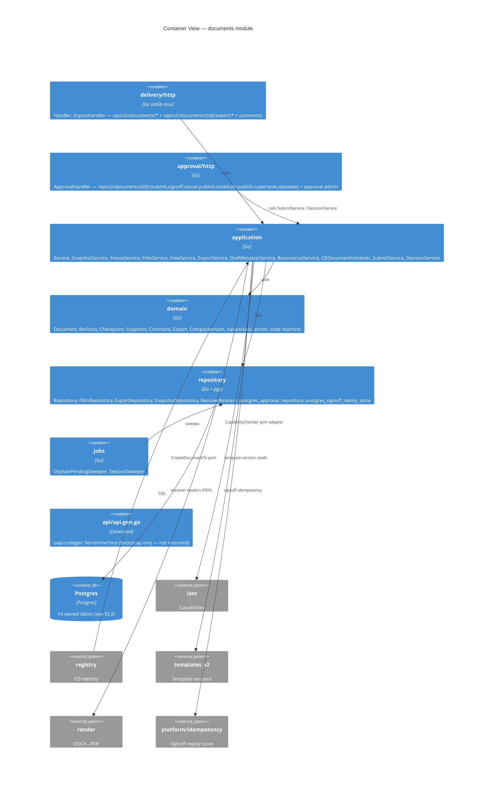
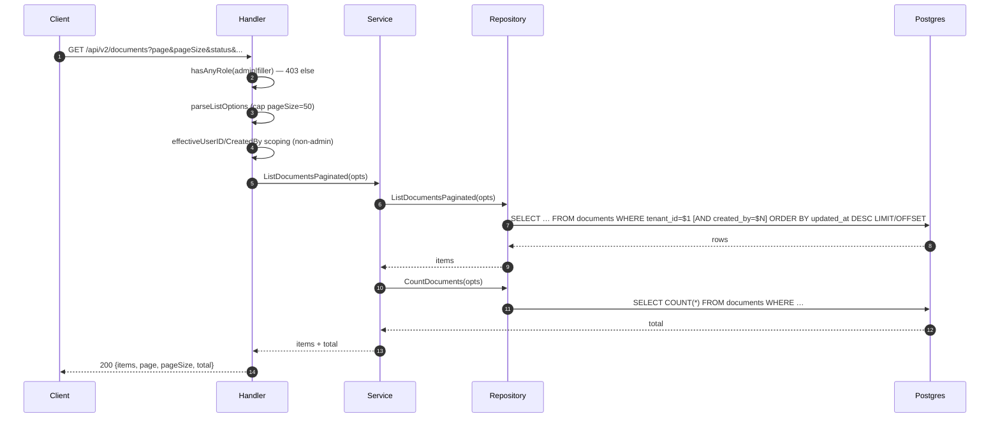
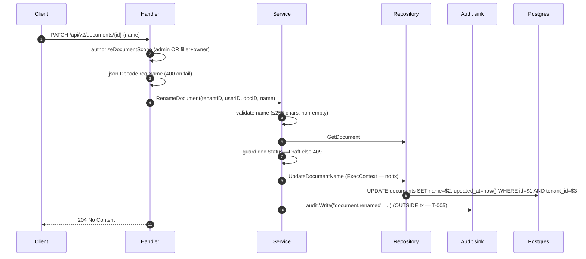
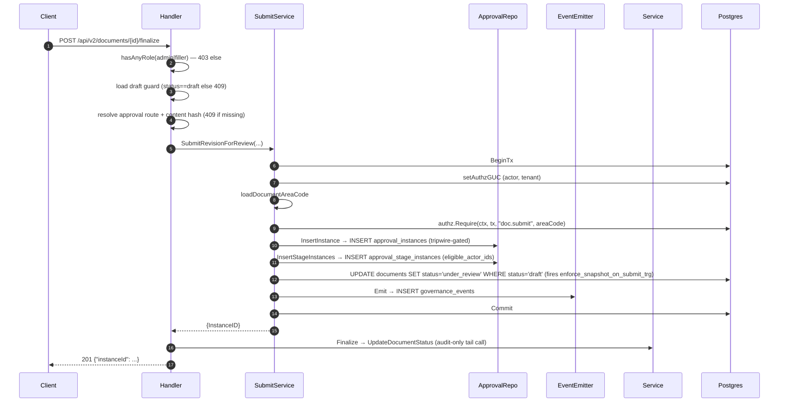

# Module: documents

> Living architecture doc. Arc42 (12 sections) + C4 (Context / Container) Mermaid diagrams + ADR links.

**Last verified:** 2026-05-10 · **Owner:** unassigned · **Status:** active

---

## 1. Introduction & Goals

`documents` is the controlled-document instance lifecycle module: it owns the `documents` table and its revision/checkpoint/comment/export/approval surfaces. A document is an instance filled from a template version, bound to a controlled-document entry, and moves through `draft → under_review → approved → published → superseded | obsolete`. The module sits between the registry module (which owns the controlled-document identity + numbering) and the approval sub-package (which materialises approval routes against a document revision).

### 1.1 Requirements overview

- Atomic create of a controlled document + its first draft revision — `wiki/decisions/0011-cd-atomic-create.md`
- Two-tier authorization on mutations — `wiki/decisions/0007-two-tier-authz.md`
- Eigenpal DOCX editor integration for `draft` editing — `wiki/decisions/0001-eigenpal-adoption.md`
- Placeholder snapshot pinned at submit — `wiki/concepts/placeholders.md`
- `{name}` single-brace token substitution at freeze — `wiki/concepts/token-syntax.md`
- Spec-as-source-of-truth for `/api/v2/documents/*` (in progress) — `wiki/decisions/0012-contract-first-api.md`

### 1.2 Quality Goals

| Rank | Goal | How verified |
|---|---|---|
| 1 | Authz isolation on regulated mutations | Tier-1 role gate + tier-2 `authz.Require` + Postgres tripwire on approval tables; gap on `documents` table itself (T-003) |
| 2 | Atomic CD+draft create | `CreateDocumentTx` port; one transaction across `controlled_documents`, `documents`, `cd_sequence_counters` (ADR 0011) |
| 3 | Forward-only schema evolution | All `documents`-owned migrations are append-only (`migrations/0001..0183`); rename from `documents_v2` shipped as paired migrations 0167/0168 |

### 1.3 Stakeholders

| Role | Expectation |
|---|---|
| End user (document filler / approver) | Create / edit / submit / sign-off documents; library list filtered by ownership |
| Operator | Predictable migration story; audit trail intact; tripwire defends regulated paths |
| Developer (other modules) | Stable Go ports (`CreateDocumentTx`, `CapabilityChecker`, `SnapshotResolver`); typed errors over generic strings |

---

## 2. Architecture Constraints

- Language / runtime: Go 1.25.
- Persistence: Postgres only; row-level multi-tenancy via `tenant_id` on every owned table (`wiki/architecture/persistence.md`).
- Authz: two-tier per `wiki/decisions/0007-two-tier-authz.md`. Tripwire enforcer reads `metaldocs.asserted_caps` GUC.
- DOCX editor: `@eigenpal/docx-js-editor` from `vendor/eigenpal/` (`wiki/decisions/0001-eigenpal-adoption.md`).
- API contract: OpenAPI 3.0.3 via oapi-codegen (`wiki/decisions/0012-contract-first-api.md`) — **bootstrap only on this module**, handlers still mounted via stdlib `mux.HandleFunc`.
- Error envelope target: RFC 9457 Problem Details — current code emits legacy `{error:{code,message,…}}` (T-001, mid-migration).

---

## 3. System Scope & Context (C4 Level 1)

### 3.1 Business Context

Quality-managed documents. Each instance traces back to a template + a controlled-document code (e.g. `POP-MAN-027`). Drafts are editable; once submitted, the placeholder catalog is frozen and approval signatures gate publication. Audit trail is the QMS evidence.

### 3.2 Technical Context

**Inbound HTTP (from FE):** see §5.3.

**Inbound Go (consumers — from `_artifacts/03-deps.md`):**
- `apps/api/cmd/metaldocs-api/main.go:22` — wires services + handler + approval handler
- `apps/api/internal/wiring/documents.go:6` — `NewCapabilityChecker` adapter at `:24` (ADR 0007 J2)
- `apps/worker/cmd/metaldocs-worker/main.go:8` — worker side
- `internal/modules/iam/integration_test.go:16`
- `internal/jobs/effective_date_publisher/job.go:8` · `internal/jobs/stuck_instance_watchdog/job.go:10`
- `internal/platform/docgenv2/templates_v2_snapshot_reader.go:8`
- `internal/platform/objectstore/document_presigner.go:17`

**Outbound Go (from `_artifacts/03-deps.md`):**
- `internal/modules/iam/domain` (`fillin_handler.go:16`) — typed `iamdomain.Capability` consts; cross-refs `iam` T-001
- `internal/modules/iam/application` (`handler.go:17`) — `ErrCapabilityDenied` sentinel; cross-refs `iam` T-009
- `internal/modules/iam/authz` (`fillin_handler.go:15`)
- `internal/modules/registry/domain`, `internal/modules/templates_v2/domain`
- `internal/modules/render` (`resolver_readers.go:9`)
- `internal/platform/idempotency` (`approval/infrastructure/postgres_signoff_idemp_store.go:9`)
- `internal/platform/tenant`, `internal/platform/docgenv2`, `internal/platform/httpresponse` (`handler.go:20`), `internal/platform/ratelimit` (`module.go:13`), `internal/platform/servicebus` (`export_service.go:10`)

**DB tables owned (from `_artifacts/04-persistence.md`, full schemas in artifact):**
`documents`, `editor_sessions`, `document_revisions`, `document_checkpoints`, `document_placeholder_values`, `document_exports`, `document_comments`, `approval_routes`, `approval_route_stages`, `approval_instances`, `approval_stage_instances`, `approval_signoffs`, `governance_events`, `metaldocs.pdf_dispatch_outbox`.

**Frontend counterpart:** `frontend/apps/web/src/features/documents/` — out of scope for this backend Arc42 but cross-referenced in §12.

---

## 4. Solution Strategy

- **Clean-architecture layering** (delivery / application / domain / repository) — driver: project convention enforced by api-lint rule "ports live in application".
- **Two-tier authz with a Postgres tripwire** — driver: `wiki/decisions/0007-two-tier-authz.md`. Tier-1 role gate at HTTP edge, tier-2 `authz.Require(ctx, tx, cap, area)` in transaction, GUC-driven trigger on `approval_instances` + `approval_signoffs`.
- **Atomic CD+draft via a `CreateDocumentTx` port** — driver: `wiki/decisions/0011-cd-atomic-create.md`. Registry owns the call site; documents exposes only the port and the row writer.
- **Placeholder snapshot pinned at submit** — driver: `wiki/concepts/placeholders.md`. `application.SnapshotService` populates `placeholder_schema_snapshot`; trigger `enforce_snapshot_on_submit_trg` (`migrations/0152_*.sql:47`) blocks `under_review` transitions with a null snapshot.
- **Sub-package for approval mechanics** — driver: cohesion between document state transitions and the approval-instance + signoff lifecycle. Lives at `internal/modules/documents/approval/`; the top-level `internal/modules/approval/` path does **not** exist in workspace (resolved during Phase 3).
- **Codegen bootstrap only** — driver: ADR 0012 + spec drift (T-002). `api.gen.go` is generated and committed but routes are still mounted via `mux.HandleFunc`.

---

## 5. Building Block View (C4 Level 2 — Container)

### 5.1 Whitebox — documents

### 5.2 Public surface (selected)

Full enumeration in `wiki/modules/documents/_artifacts/01-surface.md` (517 exported symbols). The rows below are the cross-boundary surface — symbols imported by other modules or registered as routes/ports.

| File | Symbol | Kind | Purpose |
|---|---|---|---|
| `internal/modules/documents/module.go:1` | `New`, `RegisterRoutes` | func | Module wiring entry |
| `internal/modules/documents/application/ports.go` | `CapabilityChecker` | iface | Consumer port — iam adapter implements (`apps/api/internal/wiring/documents.go:24`) |
| `internal/modules/documents/application/ports.go` | `CreateDocumentTx` | iface | Atomic CD+draft create port consumed by registry (ADR 0011) |
| `internal/modules/documents/application/service.go:26` | `Repository` | iface | Application-layer repo contract |
| `internal/modules/documents/application/service.go:81` | `Audit` | iface | Audit sink consumer port (adapter wired in main.go) |
| `internal/modules/documents/application/service.go:564` | `Service.RenameDocument` | func | Validate + UPDATE + audit (T-005: not transactional) |
| `internal/modules/documents/application/service.go:753` | `Service.UpdateDocumentStatus` | func | Status transitions; finalize tail-call lands here |
| `internal/modules/documents/application/snapshot_service.go` | `SnapshotService` | type | Populates `placeholder_schema_snapshot` (ADR 0008) |
| `internal/modules/documents/application/freeze_service.go` | `FreezeService` | type | `{name}` token substitution at freeze |
| `internal/modules/documents/application/fillin_service.go` | `FillinService` | type | Placeholder-value writes |
| `internal/modules/documents/application/fillin_authz.go:9` | typed `iamdomain.Capability` consts | imports | Cross-ref iam T-001 |
| `internal/modules/documents/application/cd_initializer.go` | `CDDocumentInitializer` | type | Registry-side hook for atomic CD create |
| `internal/modules/documents/approval/application/submit_service.go:43` | `SubmitService.SubmitRevisionForReview` | func | Tier-2 `authz.Require("doc.submit", areaCode)` at `:85` |
| `internal/modules/documents/approval/application/decision_service.go` | `DecisionService` | type | Signoff approve/reject/publish/supersede/obsolete |
| `internal/modules/documents/delivery/http/handler.go:76` | `NewHandlerWithSubmit` | func | Wires db + submitSvc for atomic finalize |
| `internal/modules/documents/delivery/http/handler.go:145` | `listDocuments` | func | `GET /api/v2/documents` |
| `internal/modules/documents/delivery/http/handler.go:285` | `renameDocument` | func | `PATCH /api/v2/documents/{id}` (T-002 spec gap, T-004 dup route, T-005 audit-tx gap) |
| `internal/modules/documents/delivery/http/handler.go:316` | `finalizeDocument` | func | `POST /api/v2/documents/{id}/finalize` (T-006 idempotency gap) |
| `internal/modules/documents/delivery/http/handler.go:869` | `authorizeDocumentScope` | func | Role + ownership gate (tier-1) |
| `internal/modules/documents/delivery/http/handler.go:958..1009` | `mapErr` | func | Legacy envelope mapping (T-001) |
| `internal/modules/documents/repository/repository.go:73` | `CreateDocumentTx` impl | func | Tx-scoped CD+document insert (ADR 0011) |
| `internal/modules/documents/repository/repository.go:216` | `UpdateDocumentName` | func | Plain UPDATE; no authz.Require (T-003) |
| `internal/modules/documents/repository/repository.go:343` | `ListDocumentsPaginated` | func | LIMIT/OFFSET; pageSize cap 50 |
| `internal/modules/documents/repository/repository.go:376` | `CountDocuments` | func | Sibling COUNT(*) for list |
| `internal/modules/documents/approval/repository/postgres_approval_repository.go:34` | `InsertInstance` | func | Tripwire-gated INSERT into `approval_instances` |
| `internal/modules/documents/approval/application/idempotency.go:20` | `ComputeIdempotencyKey` | func | Internal deterministic key for submit (NOT HTTP header) |
| `internal/modules/documents/api/api.gen.go:1` | generated stubs (`ListDocumentsV2`, `PostApiV2DocumentsIdFinalize`, …) | iface | Codegen bootstrap (unmounted) |

The remaining ~480 symbols are domain DTOs, repository internal helpers, and codegen artifacts — treated as undocumented-on-purpose at module level (see tech-debt `Coverage stats`).

### 5.3 HTTP operations

Routes registered in `internal/modules/documents/delivery/http/handler.go` and `internal/modules/documents/approval/http/router.go`. **OperationID** column reflects current spec (`api/openapi/v1/openapi.yaml`); `—` = no spec op.

| Method | Path | OperationID | Handler | Authz |
|---|---|---|---|---|
| GET | `/api/v2/documents` | `listDocumentsV2` | `Handler.listDocuments` (`handler.go:145`) | role: admin\|filler; filler scoped to `created_by` |
| GET | `/api/v2/documents/stats` | — | `Handler.documentStats` (`handler.go:174`) | role |
| GET | `/api/v2/documents/{id}` | `getDocumentV2` | `Handler.getDocument` (`handler.go:114`) | role + ownership |
| PATCH | `/api/v2/documents/{id}` | — | `Handler.renameDocument` (`handler.go:285`) | role + ownership; **dup registration at `:86`+`:115`** (T-004) |
| POST | `/api/v2/documents/{id}/finalize` | — (path at `openapi.yaml:3251`) | `Handler.finalizeDocument` (`handler.go:316`) | role + ownership + tier-2 `authz.Require("doc.submit", areaCode)` |
| POST | `/api/v2/documents/{id}/archive` | — | `Handler.archiveDocument` | role |
| POST | `/api/v2/documents/{id}/duplicate` | — | `Handler.duplicateDocument` | role |
| GET/POST/PATCH/DELETE | `/api/v2/documents/{id}/comments[/{commentId}]` | — | comments CRUD | role + ownership |
| GET/POST | `/api/v2/documents/{id}/sessions` | — | session controller | role |
| GET/POST | `/api/v2/documents/{id}/checkpoints` | — | checkpoint controller | role |
| GET | `/api/v2/documents/{id}/revisions` | — | revisions URL handler | role |
| POST | `/api/v2/documents/{id}/export/pdf` | — | `ExportHandler` | role |
| GET | `/api/v2/documents/{id}/export/docx-url` | — | `ExportHandler` | role |
| POST | `/api/v2/documents/{id}/submit` | — | `ApprovalHandler` (`approval/http/router.go`) | tier-2 `doc.submit` |
| POST | `/api/v2/documents/{id}/signoff` | — | `ApprovalHandler` | tier-2 `doc.signoff` |
| POST | `/api/v2/documents/{id}/cancel` | — | `ApprovalHandler` | tier-2 |
| POST | `/api/v2/documents/{id}/publish` | — | `ApprovalHandler` | tier-2 `doc.publish` |
| POST | `/api/v2/documents/{id}/schedule-publish` | — | `ApprovalHandler` | tier-2 |
| POST | `/api/v2/documents/{id}/supersede` | — | `ApprovalHandler` | tier-2 |
| POST | `/api/v2/documents/{id}/obsolete` | — | `ApprovalHandler` | tier-2 |
| GET | `/api/v2/documents/{id}/approval-instance` | — | `ApprovalHandler` | role |
| various | `/api/v2/approval-routes/*` | — | `ApprovalHandler` admin | role: admin |

Spec gaps (missing `operationId`s on regulated paths) are enumerated in T-002 and `wiki/backlog/contract-first-followups.md`.

---

## 6. Runtime View

### 6.1 listDocuments (read) — `GET /api/v2/documents`

Source: `_artifacts/02-flow-listDocuments.md`. No transaction; read-only.

### 6.2 renameDocument (write) — `PATCH /api/v2/documents/{id}`

Source: `_artifacts/02-flow-renameDocument.md` (corrected against `handler.go:285..308` during Phase 6.75 — response is `204 No Content`, not a re-fetched JSON body). Spec drift (T-002) — route absent from openapi.yaml. Duplicate registration (T-004). No tier-2 authz, no tripwire on `documents` table (T-003). Latent: error path at `handler.go:303-304` calls `httpErr(w, status, msg)` **twice** for a single `RenameDocument` error — second call writes a header after a status is already written; visible as a "superfluous WriteHeader" log only.

### 6.3 finalizeDocument (state transition) — `POST /api/v2/documents/{id}/finalize`

Source: `_artifacts/02-flow-finalizeDocument.md`. Full tripwire defense-in-depth on approval tables. No HTTP `Idempotency-Key` (T-006); replay collides on `ux_approval_instances_active` partial unique index.

### State transitions

| From | To | Trigger | Authz cap (tier-2) | Surface |
|---|---|---|---|---|
| draft | under_review | `POST .../finalize` (handler) → `SubmitService.SubmitRevisionForReview` | `doc.submit` (`submit_service.go:85`) | `approval_instances` INSERT + `documents.status` UPDATE in one tx |
| under_review | approved | `POST .../signoff` final-stage | `doc.signoff` | `approval_signoffs` INSERT |
| approved | published | `POST .../publish` | `doc.publish` | `documents.status='published'` + governance event |
| published | superseded | `POST .../supersede` | `doc.supersede` | new revision created; old marked superseded |
| published | obsolete | `POST .../obsolete` | `doc.obsolete` | `documents.status='obsolete'` |
| under_review | draft (rejected) | `POST .../signoff` reject | `doc.signoff` | `approval_instances.status='rejected'`; `documents.status` rollback |

### Failure modes (current legacy envelope, T-001)

| Condition | HTTP | Legacy `error.code` | Source |
|---|---|---|---|
| Missing role / ownership | 403 | `forbidden` | `handler.go:871, :887` |
| Validation (name length) | 400 | `invalid_name` | `service.go:565-567` |
| JSON decode | 400 | `invalid_body` | `handler.go:296` |
| Not found | 404 | `not_found` | `mapErr` `:966-972` |
| State guard (not draft) | 409 | `invalid_state_transition` | `service.go:572`, `handler.go:351` |
| No active approval route | 409 | route msg | `handler.go:387` |
| Capability denied (in-tx) | 403 | mapped from `iamapp.ErrCapabilityDenied` | `handler.go:17` import |
| Server error | 500 | `internal_error` | `mapErr` `:1009` |

Target shape: RFC 9457 `application/problem+json` (T-001 backlog R-001).

---

## 7. Deployment View

- Binary: `apps/api/cmd/metaldocs-api` (single Go server); worker side mounted via `apps/worker/cmd/metaldocs-worker`.
- Process: container on port `:8081` (per `scripts/start-api.ps1`).
- Migrations: applied at startup; documents-owned files live in `migrations/` chronological set (0001..0183 to date) — full enumeration in `_artifacts/04-persistence.md`. Forward-only (IP-006).
- Environment: documents reads no env/config vars directly (verified in `_artifacts/03-deps.md`). All knobs come through DI from `apps/api/cmd/metaldocs-api/main.go`.
- Background jobs:
  - `internal/jobs/effective_date_publisher/job.go:8` — promotes approved → published at effective date
  - `internal/jobs/stuck_instance_watchdog/job.go:10` — watchdog for stalled approval instances
  - `internal/modules/documents/jobs/orphan_pending_sweeper.go`, `session_sweeper.go` — orphan + session cleanup

---

## 8. Cross-cutting Concepts

### 8.1 Authentication & Authorization
- Tier-1 (HTTP edge): role gate via `hasAnyRole(roleAdmin, roleDocumentFiller)` (`handler.go:870`) + ownership (`IsDocumentOwner` `:880`). Role strings `system_admin` / `document_filler` at `handler.go:26, :28`.
- Tier-2 (in-tx): `authz.Require(ctx, tx, "doc.submit", areaCode)` (`submit_service.go:85`). Capability strings live in the `doc.*` namespace.
- Typed capabilities: `internal/modules/documents/application/fillin_authz.go:9` consumes `iamdomain.Capability` consts. Module straddles both namespaces (T-008; iam T-001).
- Capability adapter: `internal/modules/documents/application/ports.go` declares `CapabilityChecker`; impl `capabilityServiceAdapter` at `apps/api/internal/wiring/documents.go:14`; `NewCapabilityChecker` factory at `:24` (ADR 0007 J2 amendment).
- Postgres tripwire: `enforce_capability_asserted` function (`migrations/0142b_role_capabilities_v2_enforce.sql:67`), triggers on `approval_instances` (`:201`) and `approval_signoffs` (`:207`). Reads `metaldocs.asserted_caps` GUC set by `setAuthzGUC` (`approval/application/authz_guc.go:11`). **Not attached to `documents` table** — T-003.
- Sentinel: `iamapp.ErrCapabilityDenied` imported at `handler.go:17` (cross-refs iam T-009).

### 8.2 Error envelope
- Current: legacy `{error:{code,message,details,trace_id}}` via `httpErr` + `mapErr` (`handler.go:958..1013`).
- Target: RFC 9457 Problem+JSON via `internal/platform/httpresponse.WriteProblem`.
- Status: mid-migration (T-001).

### 8.3 Idempotency
- `internal/platform/idempotency` provides Stripe-style header replay store.
- Used by signoff via `approval/infrastructure/postgres_signoff_idemp_store.go:9`.
- **Not** used on finalize (T-006): submit path computes an internal deterministic `ComputeIdempotencyKey` (`approval/application/idempotency.go:20`) and relies on `ux_approval_instances_active` partial unique index for replay safety.

### 8.4 Pagination
- Offset only: `page` + `pageSize` (default 1 / 20, cap 50). Repo `LIMIT/OFFSET` at `repository.go:343`.
- Response body: `{items, page, pageSize, total}` at `handler.go:167`; generated counterpart `DocumentListResponse` at `api.gen.go:266`.
- Cursor pagination not adopted (IP-003 not-applicable today).

### 8.5 Logging & Observability
- No structured trace correlation wired in this module (IP-007 system-wide gap — not documents-specific debt).
- Governance events emitted via `EventEmitter.Emit` → INSERT `governance_events` (`approval/application/events.go:35`); QMS audit trail.
- Audit sink via consumer port (`Audit` iface at `application/service.go:81`); adapter wired in main.go (T-007 latent).

### 8.6 Concurrency / Transactions
- Repository methods accept `context.Context` and accept tx where the SubmitService composes one (`approval/application/submit_service.go:68`).
- `Service.RenameDocument` does **not** wrap UPDATE + audit in a tx (T-005).
- Atomic CD+draft create uses an explicit tx via `CreateDocumentTx` port (ADR 0011).
- One-active-instance constraint enforced by partial unique index `ux_approval_instances_active` on `approval_instances(document_v2_id) WHERE status='in_progress'` (`migrations/0135_*.sql:33`).

### 8.7 Snapshot & freeze (placeholder lifecycle)
- `SnapshotService` populates `placeholder_schema_snapshot` (ADR 0008; `wiki/concepts/placeholders.md`).
- Trigger `enforce_snapshot_on_submit_trg` (`migrations/0152_*.sql:47`) blocks `documents.status='under_review'` UPDATE when snapshot is null. Fires in finalize tx (step §6.3 box `UPDATE documents`).
- `FreezeService` performs `{name}` token substitution at freeze (`wiki/concepts/token-syntax.md`).
- `document_placeholder_values` schema bug surfaced: `revision_id REFERENCES documents(id)` (T-009).

---

## 9. Architecture Decisions

| Decision | Link / Status |
|---|---|
| Eigenpal DOCX editor adopted | `wiki/decisions/0001-eigenpal-adoption.md` |
| Two-tier authz (HTTP + in-tx + tripwire) | `wiki/decisions/0007-two-tier-authz.md` |
| Fixed 7-token placeholder catalog + snapshot | `wiki/concepts/placeholders.md` (ADR 0008) |
| Atomic CD+draft create via `CreateDocumentTx` port | `wiki/decisions/0011-cd-atomic-create.md` |
| Contract-first OpenAPI via oapi-codegen | `wiki/decisions/0012-contract-first-api.md` (bootstrap only on this module) |
| `{name}` single-brace token syntax | `wiki/concepts/token-syntax.md` (ADR 0003) |
| Duplicate route registration (`handler.go:86/:115`) | `tech-debt: missing-ADR` (T-004) |
| `audit.Write` outside SQL UPDATE tx in rename | `tech-debt: missing-ADR` (T-005) |
| Audit emission via consumer-port interface (no audit/domain import) | `tech-debt: missing-ADR` (T-007) |
| `doc.*` string capability namespace alongside typed `iamdomain.Capability` | `tech-debt: missing-ADR` (T-008) |
| `document_placeholder_values.revision_id` FK target | `tech-debt: missing-ADR` (T-009) |

---

## 10. Quality Requirements

| Goal | Scenario | Pass criteria |
|---|---|---|
| Authz isolation (approval) | A user without `doc.submit` calls `POST /finalize` | 403; `approval_instances` unchanged; tripwire would fire even if tier-2 bypassed |
| Authz isolation (documents table) | A user with stale role token calls `PATCH /documents/{id}` | 403 from role gate; **defense-in-depth gap T-003: no in-tx check** |
| Atomic CD create | Crash mid-registry insert | Whole tx rolls back; `cd_sequence_counters` unchanged (ADR 0011) |
| Audit completeness on rename | Crash between UPDATE and audit.Write | **T-005: row mutated, no audit row** — fails today |
| Replay safety on finalize | Client retries finalize over flaky network | Second call → 409 from `ux_approval_instances_active`. **T-006: not a true idempotent replay** |
| Snapshot guard on submit | Submit with null placeholder snapshot | DB trigger `enforce_snapshot_on_submit_trg` raises; 500 surfaces as mapped error |
| Multi-tenant isolation | Cross-tenant id guessed | Every owned table carries `tenant_id`; repo queries scope (`repository.go:343, :376`) |

---

## 11. Risks & Technical Debt

Pointer-only. Body in `wiki/modules/documents-tech-debt.md`. Severity rubric in template `tech-debt-register.md`.

- Critical: 1
- Major: 5
- Minor: 4

Top 3 (by severity, then blast radius):
1. OpenAPI spec drift on `/api/v2/documents/*` — see tech-debt T-002 (Critical; blocks RFC 9457 migration; multiple handlers without spec ops)
2. `documents` table mutations lack tier-2 + tripwire — see tech-debt T-003 (Major; defense-in-depth gap on regulated path)
3. `renameDocument` audit write outside SQL tx — see tech-debt T-005 (Major; audit-trail atomicity broken)

---

## 12. Glossary

| Term | Definition |
|---|---|
| Document | Instance row in `documents` table, filled from a template version, bound to a controlled-document code |
| Revision | Snapshot of document body in `document_revisions`; monotonic per document |
| Checkpoint | Editor autosave point in `document_checkpoints` |
| Snapshot (placeholder schema) | Pinned placeholder catalog stored in `placeholder_schema_snapshot`; required for `under_review` |
| Approval instance | Row in `approval_instances`; one active per document via `ux_approval_instances_active` |
| Stage instance | Row in `approval_stage_instances`; materialised approval route stages with `eligible_actor_ids` |
| Signoff | Row in `approval_signoffs`; per-stage approve/reject |
| Tripwire | Postgres trigger `enforce_capability_asserted` reading `metaldocs.asserted_caps` GUC |
| `setAuthzGUC` | Helper at `approval/application/authz_guc.go:11` that primes the GUC for tripwire |
| `doc.submit` | Tier-2 capability string asserted at `submit_service.go:85`; namespace `doc.*` |

---

## Cross-links

- Related ADRs: `wiki/decisions/0001-eigenpal-adoption.md`, `wiki/decisions/0007-two-tier-authz.md`, `wiki/decisions/0011-cd-atomic-create.md`, `wiki/decisions/0012-contract-first-api.md`
- Related concepts: `wiki/concepts/placeholders.md`, `wiki/concepts/token-syntax.md`
- Upstream template publisher: [`wiki/modules/templates_v2.md`](templates_v2.md) — publishes the `template_version` rows (with `placeholder_schema`) that documents instantiates from; `documents` snapshots `placeholder_schema` at create time (§8.7 of that doc)
- Frontend counterpart: `frontend/apps/web/src/features/documents/` — Library, Wizard, Editor, Published view (see `wiki/architecture/frontend-structure.md`)
- Predecessor stub: `wiki/modules/documents-v2.md` — DEPRECATED, retired by R-100
- Backlog: `wiki/backlog/documents-refactor.md`, `wiki/backlog/contract-first-followups.md`
- Tech debt: `wiki/modules/documents-tech-debt.md`
- Iam cross-refs: `wiki/modules/iam-tech-debt.md` T-001 (namespaces), T-006 (RFC 9457), T-009 (`ErrCapabilityDenied`)
- Auth cross-ref: [`wiki/modules/auth.md §8.8`](auth.md) — `authdomain.CurrentUserFromContext` is the IN-edge this module reads after middleware injection; §8.1 of auth.md covers the middleware that sets the context value
- See also: [`modules/audit.md`](audit.md) — documents emits audit events via `documentsV2AuditAdapter` (`main.go:445-479`); T-005 (rename outside tx) and T-007 (latent consumer port) are the open gaps in the consumer-side register
- Research artifacts: `wiki/modules/documents/_artifacts/00-context.md` … `06-selfreview.md`

## Changelog (this doc)

- 2026-05-10 — Full Arc42 + C4 rewrite via `metaldocs-module-doc` skill (Phases 0–8). Supersedes prior FE-leaning doc; FE Key files now live under `wiki/architecture/frontend-structure.md` cross-link.
