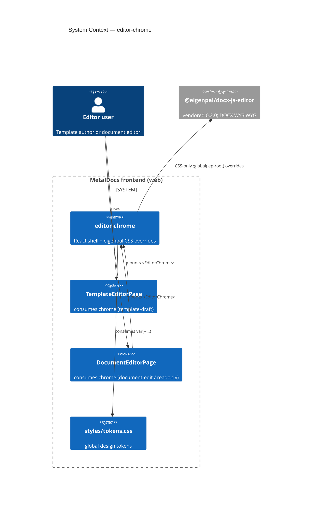
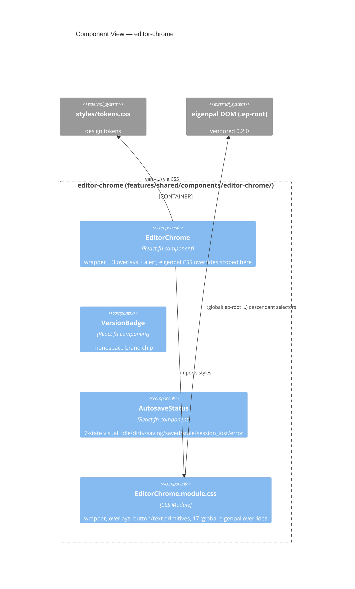

# Module: editor-chrome

> Living architecture doc. Arc42 (12 sections) + C4 Container/Component diagrams.
> Supersedes the prior stub (slot-API note, eigenpal-overrides bullet list).

**Last verified:** 2026-05-11 · **Owner:** unassigned (frontend) · **Status:** active

> **Scope:** Shared React primitive that wraps an eigenpal editor canvas, projects a custom toolbar via 3 absolute overlays, and applies MetalDocs visual contract to eigenpal DOM via scoped `:global(.ep-root ...)` CSS overrides. Mounted by `TemplateEditorPage` and `DocumentEditorPage`.
> **Out of scope:** Eigenpal internals (see [modules/editor-ui-eigenpal.md](editor-ui-eigenpal.md)), template authoring business logic (see [modules/templates_v2.md](templates_v2.md) and [modules/templates-v2.md](templates-v2.md)), document editor business logic (see [modules/documents.md](documents.md)), placeholder rendering (see [concepts/placeholders.md](../concepts/placeholders.md)).
> **Key files:**
> - `frontend/apps/web/src/features/shared/components/editor-chrome/EditorChrome.tsx:31` — `EditorChrome` component + `EditorChromeProps` slot API + `editorChromeStyles` re-export
> - `frontend/apps/web/src/features/shared/components/editor-chrome/EditorChrome.module.css:1` — wrapper, overlay layout, button/text primitives, 17 eigenpal `:global` overrides
> - `frontend/apps/web/src/features/shared/components/editor-chrome/parts/VersionBadge.tsx:13` — monospace brand chip
> - `frontend/apps/web/src/features/shared/components/editor-chrome/parts/AutosaveStatus.tsx:28` — 7-state autosave indicator
> - `frontend/apps/web/src/features/shared/components/editor-chrome/index.ts:1` — barrel
> - `frontend/apps/web/src/features/shared/components/editor-chrome/EditorChrome.test.tsx:1` — 28 RTL tests (slot truthy-collapse, 7-state autosave, aria-live, VersionBadge)
> - `frontend/apps/web/src/features/templates/pages/TemplateEditorPage.tsx:277` — consumer A (template authoring; uses center + right + alert)
> - `frontend/apps/web/src/features/documents/pages/DocumentEditorPage.tsx:214` — consumer B (document edit/readonly; uses center + right)

---

## 1. Introduction & Goals

editor-chrome is the visual shell that two editor pages share. Before its extraction, both pages re-implemented overlay placement, button primitives, and eigenpal CSS overrides in isolation, and drifted. The primitive enforces the `metaldocs-frontend` skill's `features/shared/` rule (2+ consumers ⇒ shared module) and concentrates all eigenpal coupling in one CSS module so future eigenpal refreshes touch one file.

### 1.1 Requirements overview
- Render a custom toolbar atop eigenpal's native 40px title bar — source: `wiki/decisions/0001-eigenpal-adoption.md` (eigenpal title bar insufficient for MetalDocs branding/UX).
- Preserve eigenpal click targets — `pointer-events` discipline on the centered overlay.
- Project MetalDocs branding (wine palette, gradient scrollbar) into eigenpal DOM — source: design-source `template-editor` and `documento-publicado` mockups.
- Be free of domain logic — page owns state, primitive owns layout.

### 1.2 Quality Goals

| Rank | Goal | How verified |
|---|---|---|
| 1 | Visual contract holds across both consumer pages | manual smoke on `TemplateEditorPage` and `DocumentEditorPage` (no automated visual regression today — see T-004) |
| 2 | Domain-agnostic API — chrome is unaware of templates vs documents | `EditorChromeProps` accepts only `ReactNode` slots; no template/document types reachable here |
| 3 | Eigenpal overrides survive eigenpal artifact refreshes | manual integration smoke per `references/eigenpal-controlled-package.md`; no runtime guard (see T-003) |

### 1.3 Stakeholders

| Role | Expectation |
|---|---|
| Template author / document editor user | Toolbar is legible, autosave status is visible, save button responds. |
| Frontend developer | One place to change the editor shell; CSS Module barrel re-exports button/text classes consistently. |
| Eigenpal maintainer (fork) | MetalDocs does not patch `node_modules`; coupling is CSS-only via `:global(.ep-root ...)`. |

---

## 2. Architecture Constraints

- React 18 + TypeScript + Vite + CSS Modules — per `wiki/architecture/frontend-structure.md`.
- Lives under `features/shared/components/` — `metaldocs-frontend` skill rule "used by 2+ features ⇒ shared".
- Coupling to eigenpal is CSS-only (`:global(.ep-root ...)` descendant selectors). No JS import from `@eigenpal/docx-js-editor` in this module.
- Eigenpal pinned to `vendor/eigenpal/eigenpal-docx-js-editor-0.2.0.tgz` per `wiki/references/eigenpal-controlled-package.md`. Overrides are implicit version contract — see T-003.
- Design tokens consumed via `var(--...)` from `frontend/apps/web/src/styles/tokens.css`. No hardcoded hex colors; **but** font sizes/weights, button heights, and durations remain hardcoded (see T-005).
- No HTTP, no SQL, no observability sink. Presentation-only.

---

## 3. System Scope & Context (C4 Level 1)



### 3.1 Business Context
A template author or document editor sees a consistent toolbar regardless of which surface they are on: same title typography, same autosave indicator, same primary action button styling. The chrome carries no business meaning — it is the frame around the editor.

### 3.2 Technical Context
Inbound: 2 page-level JSX mount sites (`TemplateEditorPage.tsx:277`, `DocumentEditorPage.tsx:214`).
Outbound: 3 CSS modules + global `styles/tokens.css` (design-token var lookups) + descendant-selector coupling to eigenpal DOM.

---

## 4. Solution Strategy

- **Slot-based composition** (`left / center / right / alert / children`). Driver: chrome must stay domain-agnostic.
- **CSS Module + `:global(...)`** for eigenpal overrides scoped to `.wrapper`. Driver: ADR 0001 — adopt eigenpal as packaged dependency, no `node_modules` patching.
- **Re-exported style record** (`editorChromeStyles`) so consumers reach button/text primitives without redefinition. Driver: avoid per-page duplication; trade-off is the weakly-typed record (see T-006).
- **No `pointer-events` on center overlay** to let eigenpal handle title-bar clicks. Driver: keep eigenpal interactions intact; opt-in only for interactive overlay children (see T-007).

---

## 5. Building Block View (C4 Level 2 — Component)



### 5.2 Public surface (full list — from `_artifacts/01-surface.md`)

| File | Symbol | Kind | Purpose |
|---|---|---|---|
| `EditorChrome.tsx:4` | `EditorChromeProps` | exported type | Slot API: `left/center/right/alert/children/className` (all `ReactNode`) |
| `EditorChrome.tsx:31` | `EditorChrome` | exported component | Wrapper + 3 absolute overlays + alert banner |
| `EditorChrome.tsx:47` | `editorChromeStyles` | exported const (re-export of CSS Module) | Consumer access to `.iconBtn / .ghostBtn / .primaryBtn / .docTitle / .docSep / .docMeta` |
| `parts/VersionBadge.tsx:13` | `VersionBadge` | exported component | Monospace brand chip |
| `parts/AutosaveStatus.tsx:3` | `AutosaveState` | exported type | `'idle' \| 'dirty' \| 'saving' \| 'saved' \| 'stale' \| 'session_lost' \| 'error'` |
| `parts/AutosaveStatus.tsx:28` | `AutosaveStatus` | exported component | 7-state visual indicator; `role="status"` + `aria-live` (assertive for error/session_lost, polite otherwise) |
| `index.ts` | barrel | — | re-exports the 6 above |

### 5.3 HTTP operations
**n/a** — frontend primitive. Recorded in `_artifacts/01-surface.md §3` and `_artifacts/04-persistence.md`.

### 5.4 CSS surface highlights
- **3 local CSS Modules** (15 class selectors total).
- **17 eigenpal `:global(.ep-root ...)` overrides** anchored to `[data-testid="..."]` attributes and 2 hardcoded SVG `fill` hex values (`#cbd5e1`, `#94a3b8`). All carry `!important`. See `_artifacts/01-surface.md §5.1` and `_artifacts/02-flow-eigenpal-overrides.md`.
- **22 design-token references** + **~15 hardcoded magic-value sites** (40px overlay height, 26px button height, font-size px values, animation duration, badge typography). The existing wiki claim of "fully token-driven" overstates today's state — see T-005.

---

## 6. Runtime View (selected scenarios)

### 6.1 Mount + slot composition (`TemplateEditorPage`)

```mermaid
sequenceDiagram
    autonumber
    participant P as TemplateEditorPage
    participant C as EditorChrome
    participant V as VersionBadge
    participant A as AutosaveStatus
    participant E as DocxEditor (eigenpal)
    P->>C: render <EditorChrome center={...} right={...} alert={...}>
    C->>C: wrapper div + 4 overlay divs (truthy short-circuit)
    P->>V: <VersionBadge>v{n}</VersionBadge> in center slot
    P->>A: <AutosaveStatus status={autosaveState} labels=pt-BR/> in right slot
    C->>E: children = <DocxEditor .../>; eigenpal mounts .ep-root inside .wrapper
    Note over C,E: CSS :global(.ep-root ...) overrides apply via descendant selector
```

Trace artifact: `_artifacts/02-flow-mount.md`.

State transitions: **none** — mount is pure render.

### 6.2 Autosave status rendering

```mermaid
sequenceDiagram
    autonumber
    participant H as useDocumentAutosave hook
    participant P as DocumentEditorPage
    participant A as AutosaveStatus
    H->>P: status: 'idle'|'dirty'|'saving'|'saved'|'stale'|'session_lost'|'error' (7 states)
    P->>P: autosaveState = autosave.status (direct 1:1 passthrough, line 185)
    P->>A: <AutosaveStatus status={autosaveState}/>
    A->>A: branch on status; render dot+label or check SVG
```

Trace artifact: `_artifacts/02-flow-autosave.md`.

State transitions inside `AutosaveStatus`:

| From | To | Trigger | Authz cap |
|---|---|---|---|
| `idle` | `dirty` | parent prop change (user keystroke before debounce fires) | n/a |
| `dirty` | `saving` | parent prop change (debounce fires, upload starts) | n/a |
| `saving` | `saved` | parent prop change (commit 2xx) | n/a |
| `saving` | `error` | parent prop change (commit 4xx/5xx) | n/a |
| any | `stale` | parent prop change (server signals newer revision exists) | n/a |
| any | `session_lost` | parent prop change (writer session force-released by server) | n/a |
| any | `idle` | parent prop change (reset after session recovery or page remount) | n/a |

Failure modes — n/a (no error envelope at this layer).

### 6.3 Eigenpal CSS override scope

```mermaid
sequenceDiagram
    autonumber
    participant V as Vite CSS Modules transformer
    participant B as Browser CSS engine
    participant Ep as Eigenpal DOM
    V->>V: scope .wrapper → _wrapper_hash; :global(.ep-root ...) stays global inside
    B->>B: match ._wrapper_hash .ep-root [data-testid="title-bar"] {... !important}
    Ep->>B: render <div class=ep-root>...<div data-testid="title-bar">...
    B->>B: !important defeats eigenpal inline + stylesheet
```

Trace artifact: `_artifacts/02-flow-eigenpal-overrides.md`. No JS handshake; pure DOM containment.

---

## 7. Deployment View

Ships as part of the `frontend/apps/web` Vite bundle. No separate artifact, no environment variables, no migrations.

---

## 8. Cross-cutting Concepts

### 8.1 Authentication & Authorization
n/a — primitive renders whatever JSX consumers pass. Role-gating of actions (e.g. "Submeter para revisão" disabled when not draft) lives in the consumer pages (`TemplateEditorPage.tsx:314`, `DocumentEditorPage.tsx:230`). Chrome enforces nothing.

### 8.2 Error envelope
n/a — no HTTP responses. Consumer pages use `alert` slot to surface error banners.

### 8.3 Idempotency
n/a.

### 8.4 Pagination
n/a.

### 8.5 Logging & Observability
None. No telemetry hooks. No correlation id.

### 8.6 Concurrency / Transactions
n/a — no async surface in this module.

### 8.7 Eigenpal coupling contract
Coupling is exclusively CSS via `:global(.ep-root ...)` descendant selectors. The 17 selectors target eigenpal `data-testid` attributes (`title-bar`, `formatting-bar`, `font-size-display`, `font-size-input`), `role` attributes (`combobox`, `separator`), `aria-pressed`, and 2 hardcoded SVG `fill` hex values. Every line uses `!important`. There is no runtime assertion that the selectors hit anything — silent no-op risk on eigenpal refresh (T-003).

### 8.8 Accessibility
- `AutosaveStatus` has no `role="status"` / `aria-live="polite"` — assistive tech receives no announcement when state flips from `saving` → `saved` / `error` (T-002).
- `VersionBadge` is a plain inline `<span>` — flows as text; no extra a11y annotation.
- `EditorChrome` wrapper has no landmark role.
- `.overlayCenter { pointer-events: none }` does NOT prevent keyboard focus / activation — only mouse clicks (T-007).

---

## 9. Architecture Decisions

| Decision | Link / Status |
|---|---|
| Adopt eigenpal as packaged dependency | [wiki/decisions/0001-eigenpal-adoption.md](../decisions/0001-eigenpal-adoption.md) |
| `features/shared/` placement rule (2+ consumers ⇒ extract) | [wiki/architecture/frontend-structure.md](../architecture/frontend-structure.md) — rule lives in architecture doc, no ADR; logged as `missing-ADR` (T-008) |
| Slot-based composition (`left/center/right/alert/children`) | not formally decided; in-code only — `missing-ADR` (T-008) |
| Eigenpal coupling via CSS `:global` (no node_modules patch) | derivative of ADR 0001; no standalone ADR |

---

## 10. Quality Requirements

| Goal | Scenario | Pass criteria |
|---|---|---|
| Visual contract holds | Render `TemplateEditorPage` + `DocumentEditorPage` against eigenpal 0.2.0 | overlay positions match design-source mockups; wine formatting bar tinted; gradient scrollbar visible |
| Domain-agnostic API | Chrome accepts `ReactNode` slots only | `EditorChromeProps` does not import any template/document type — verified by `_artifacts/01-surface.md §2` |
| Autosave state visible | All 7 states passed through directly; `AutosaveStatus` renders each with distinct icon/label | manual: trigger save, observe pulsing dot then check; 7-state union resolved as of T-001 closure (2026-05-11) |

---

## 11. Risks & Technical Debt

Pointer-only. Full register: [editor-chrome-tech-debt.md](editor-chrome-tech-debt.md). Severity rubric concrete triggers live there.

- Critical: 0
- Major: 4
- Minor: 5

Top 3 (by severity, then by blast-radius):
1. `AutosaveStatus` has no `aria-live` — assistive-tech users get no save-state feedback on a regulated-document editor — see tech-debt T-002
2. Eigenpal coupling fragility — 17 `:global` selectors anchored on `data-testid` + hardcoded SVG hex, all `!important`, no version guard — see tech-debt T-003
3. Zero test coverage on a primitive used by two editor pages — **partially resolved** (EditorChrome.test.tsx: 28 RTL tests added 2026-05-11); visual-regression and eigenpal-selector survival still absent — see tech-debt T-004

---

## 12. Glossary

| Term | Definition |
|---|---|
| chrome | The non-content frame around an editor — title bar, action bar, status indicators. Distinct from "Google Chrome". |
| slot | A `ReactNode` prop reserved for caller-provided JSX, rendered into a fixed layout position. |
| overlay | An absolutely-positioned `<div>` inside `.wrapper` that floats above eigenpal's title bar. |
| eigenpal | `@eigenpal/docx-js-editor`, the DOCX WYSIWYG editor MetalDocs vendors at 0.2.0. |
| `:global(...)` | CSS Modules escape hatch — selector inside is unscoped and matches eigenpal DOM. |

---

## Cross-links

- ADR: [wiki/decisions/0001-eigenpal-adoption.md](../decisions/0001-eigenpal-adoption.md)
- Concepts: [wiki/concepts/placeholders.md](../concepts/placeholders.md), [wiki/architecture/frontend-structure.md](../architecture/frontend-structure.md)
- Backlog: [wiki/backlog/editor-chrome-refactor.md](../backlog/editor-chrome-refactor.md)
- Tech debt: [wiki/modules/editor-chrome-tech-debt.md](editor-chrome-tech-debt.md)
- Sibling modules: [wiki/modules/editor-ui-eigenpal.md](editor-ui-eigenpal.md), [wiki/modules/templates_v2.md](templates_v2.md), [wiki/modules/templates-v2.md](templates-v2.md), [wiki/modules/documents.md](documents.md)
- References: [wiki/references/eigenpal-controlled-package.md](../references/eigenpal-controlled-package.md)

## Changelog (this doc)

- 2026-05-11 — T-001 closed: `AutosaveState` widened from 4 to 7 states (`dirty`, `stale`, `session_lost` added); `DocumentEditorPage` ternary-collapse removed — direct passthrough at line 185 (commit `c2a43abd`). `EditorChrome.test.tsx` added (28 RTL tests, commit `29994d7a`). Updated §5 Key Files, §5.2 surface table, §6.2 flow + state transitions, §8.1 line anchors, §10 quality row, §11 counts + Top 3. Consumer line anchors updated (TemplateEditorPage.tsx:277, DocumentEditorPage.tsx:214).
- 2026-05-10 — initial Arc42 + C4 publish; supersedes the prior slot-API stub. Codex blocked on Phase 1; surface scan run manually. Phase 5 industry comparison recorded as n/a — backend-focused index has no rows applicable to a presentation primitive.
