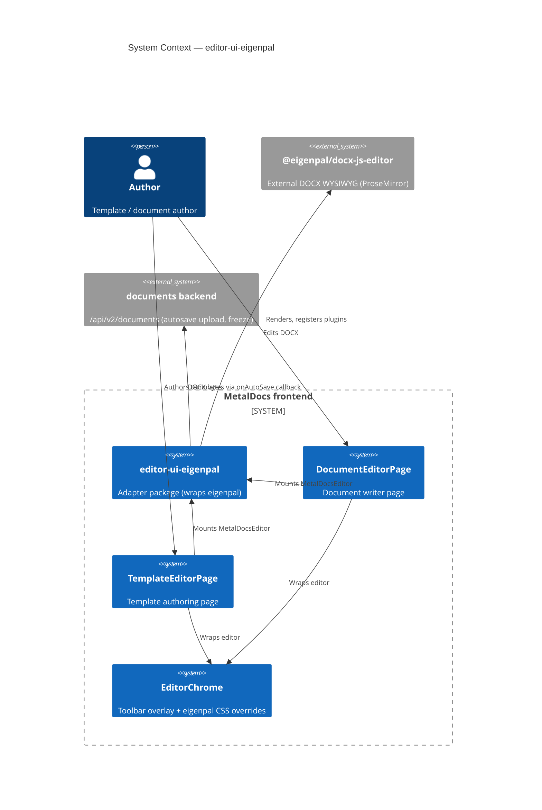
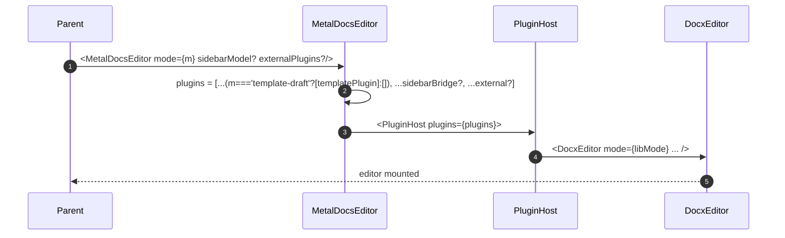
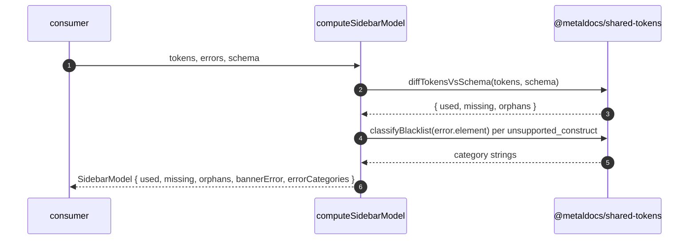

# Module: editor-ui-eigenpal

> Living architecture doc. Replaces the prior integration stub. Shape: Arc42 (12 sections) + C4 (Context + Container) Mermaid diagrams + ADR links.
>
> **Last verified:** 2026-05-11 · **Owner:** unassigned · **Status:** active (FE adapter, two production consumers)

---

## 1. Introduction & Goals

`editor-ui-eigenpal` is the MetalDocs adapter package (`packages/editor-ui/`) that wraps the external `@eigenpal/docx-js-editor` library and exposes a narrower, MetalDocs-shaped surface to consuming pages. It is an Anti-Corruption Layer: the rest of the frontend should never import from `@eigenpal/docx-js-editor` directly. The wrapper centralizes plugin selection, autosave debounce, ref-shape, and the mode discriminator the rest of the app uses (`template-draft | document-edit | readonly`).

### 1.1 Requirements overview

- **Wrap a single eigenpal version pin** — drives plugin compatibility and CSS overrides. Source: ADR 0001.
- **Provide a 3-value `EditorMode`** — `template-draft` / `document-edit` / `readonly` — that maps onto eigenpal's 2-value `editing`/`viewing`. Source: 2026-05-06 plugin-registration refactor (no ADR — see T-007).
- **Gate `templatePlugin` to `template-draft`** — so document-edit and readonly do not render meaningless sidebar chips. Source: `MetalDocsEditor.tsx:49-59` comments + `concepts/placeholders.md` (writer mode never substitutes).
- **Surface DOCX bytes via debounced autosave** — 1500ms debounce + concurrent-save guard, hand bytes to the parent. Source: `MetalDocsEditor.tsx:30-47`.
- **Re-export the eigenpal `Comment` type** — so `documents` module consumes one type-source. Source: `index.ts:3`.

### 1.2 Quality Goals

| Rank | Goal | How verified |
|---|---|---|
| 1 | Seam isolation — no `@eigenpal/docx-js-editor` import outside `packages/editor-ui/` | Repo-wide grep. Violation resolved 2026-05-11 (commit `60fa5473`) — `TemplateEditorPage` migrated to `MetalDocsEditor`; target now met |
| 2 | Tokens stay literal in writer mode — no client-side `applyVariables` call | Source grep `applyVariables` in `MetalDocsEditor.tsx` returns 0; freeze pipeline owns substitution. See `concepts/placeholders.md` |
| 3 | No save races — only one save in flight per editor instance | `inFlightRef` guard at `MetalDocsEditor.tsx:35`; covered by `MetalDocsEditor.mount.test.tsx` |

### 1.3 Stakeholders

| Role | Expectation |
|---|---|
| Template author / document author (end user) | Consistent toolbar, working autosave, no token-corruption surprises |
| FE developer | One import (`@metaldocs/editor-ui`), one type contract, one place to refresh eigenpal |
| QA / regulated-doc operator | Frozen DOCX is what the author saw; client never silently substitutes tokens |

---

## 2. Architecture Constraints

- Runtime: React 18.2 (peer dep), TypeScript 5.4, ESM-only.
- Sole runtime library coupling: `@eigenpal/docx-js-editor`, currently pinned to `0.2.0` via `vendor/eigenpal/eigenpal-docx-js-editor-0.2.0.tgz` (path declared in three `package.json` files — T-001 resolved 2026-05-11, tarball restored in Plan 3).
- Token syntax: `{name}` single-brace eigenpal-native only. Legacy `{{uuid}}` removed 2026-04-25; see `wiki/decisions/0003-token-syntax-migration.md`.
- Substitution boundary: writer never substitutes. All token resolution is server-side at freeze. Driver: ADR 0008 + `concepts/placeholders.md`.
- No HTTP, no DB, no migrations.
- No errors raised to API layer ⇒ RFC 9457 envelope: n/a.
- Distribution: source-only npm package (`main: ./src/index.ts`); consumed by `frontend/apps/web` via path alias (`vite.config.ts:36`, `tsconfig.json:21`).

---

## 3. System Scope & Context (C4 Level 1)



### 3.1 Business Context

Authors expect a Word-like editor that does not silently change the document. The adapter exists so MetalDocs can swap or upgrade the underlying eigenpal version without rippling those changes into every page that mounts an editor. The seam also keeps writer-mode honest: the rule "tokens stay literal until server freeze" is enforced in one file (no client-side `applyVariables`) instead of in every consumer.

### 3.2 Technical Context

Inbound:
- Two production mounts: `DocumentEditorPage.tsx:238`, `TemplateEditorPage.tsx:334`.
- Type-only imports of `Comment` from `useDocumentComments` and its tests.

Outbound:
- `@eigenpal/docx-js-editor` (`DocxEditor`, `PluginHost`, `templatePlugin`, type exports).
- `@metaldocs/shared-tokens` (`diffTokensVsSchema`, `classifyBlacklist`) — fuels `computeSidebarModel`.

---

## 4. Solution Strategy

- **Wrap, do not patch.** No `pnpm patch` files, no `node_modules` hacks. Refresh path is artifact-level — replace the tarball in `vendor/eigenpal/` + reinstall. Driver: ADR 0001.
- **Three modes, one prop.** A single `mode` prop drives plugin gating, autosave on/off, eigenpal `mode` mapping. Avoids per-consumer conditionals. Driver: 2026-05-06 refactor (rule has no ADR — T-007).
- **Plugins composed at mount time, not on mode change.** The plugin list is rebuilt on every render; eigenpal's `PluginHost` accepts the new array. No `useMemo` — list is tiny and identity-stable when inputs are stable. Driver: simplicity over micro-optimization.
- **Autosave is parent's problem.** The wrapper produces bytes + a single in-flight guard. The parent owns retry, conflict (409/etag), and status surfacing (via `EditorChrome` `right` slot). Driver: keep wrapper free of network/API concerns.
- **`applyVariables` deferred.** Writer never substitutes. Future "preview mode" gets its own two-buffer design. Driver: ADR 0008.

---

## 5. Building Block View (C4 Level 2 — Container)

### 5.1 Whitebox

```mermaid
C4Container
    title Container View — editor-ui-eigenpal
    Container(wrapper, "MetalDocsEditor.tsx", "React forwardRef", "mode gate, autosave debounce, imperative ref")
    Container(types, "types.ts", "TypeScript", "EditorMode, MetalDocsEditorProps, MetalDocsEditorRef")
    Container(sbBridge, "plugins/sidebarModelBridge.ts", "EditorPlugin factory", "Renders SidebarModel as eigenpal sidebar items")
    Container(sbModel, "plugins/mergefieldPlugin.ts", "Pure function", "computeSidebarModel — token/schema diff")
    Container(outline, "plugins/OutlinePlugin.tsx", "EditorPlugin factory (dormant)", "Heading navigation — exported, not registered (T-004)")
    Container(idx, "index.ts", "Barrel", "Public exports")
    ContainerExt(eig, "@eigenpal/docx-js-editor", "External lib", "DocxEditor, PluginHost, templatePlugin")
    ContainerExt(tok, "@metaldocs/shared-tokens", "Internal lib", "diffTokensVsSchema, classifyBlacklist")
    Rel(idx, wrapper, "exports")
    Rel(idx, types, "exports")
    Rel(idx, sbBridge, "exports")
    Rel(idx, sbModel, "exports")
    Rel(idx, outline, "exports")
    Rel(wrapper, eig, "DocxEditor + PluginHost + templatePlugin")
    Rel(wrapper, sbBridge, "buildSidebarModelPlugin")
    Rel(sbBridge, eig, "EditorPlugin, ReactSidebarItem types")
    Rel(sbModel, tok, "token diff math")
    Rel(outline, eig, "EditorPlugin, PluginPanelProps types")
```

### 5.2 Public surface

| File | Symbol | Kind | Purpose |
|---|---|---|---|
| `packages/editor-ui/src/MetalDocsEditor.tsx:9` | `MetalDocsEditor` | React component | Adapter component; mounts `<PluginHost><DocxEditor/></PluginHost>` |
| `packages/editor-ui/src/types.ts:5` | `EditorMode` | type | `'template-draft' \| 'document-edit' \| 'readonly'` |
| `packages/editor-ui/src/types.ts:7` | `MetalDocsEditorProps` | interface | Wrapper props (mode, buffer, comments, autosave, `onChange`, …) |
| `packages/editor-ui/src/types.ts:30` | `MetalDocsEditorProps.onChange` | optional prop | `onChange?: () => void` — lightweight synchronous change notification fired before the autosave debounce; distinct from the internal eigenpal→wrapper `onChange` that triggers the autosave debounce |
| `packages/editor-ui/src/types.ts:29` | `MetalDocsEditorRef` | interface | `getDocumentBuffer`, `focus` |
| `packages/editor-ui/src/index.ts:3` | `Comment` | type re-export | From `@eigenpal/docx-js-editor`; one type source for `documents` module |
| `packages/editor-ui/src/plugins/sidebarModelBridge.ts:26` | `buildSidebarModelPlugin` | function | Eigenpal `EditorPlugin` factory; renders `Used / Missing / Orphan / Errors` sections |
| `packages/editor-ui/src/plugins/mergefieldPlugin.ts:11` | `computeSidebarModel` | function | Pure: tokens + errors + schema → `SidebarModel` |
| `packages/editor-ui/src/plugins/mergefieldPlugin.ts:3` | `SidebarModel` | interface | `{ used, missing, orphans, bannerError, errorCategories }` |
| `packages/editor-ui/src/plugins/OutlinePlugin.tsx:88` | `createOutlinePlugin` | function | Outline panel plugin — **exported, not registered** (T-004) |

### 5.3 HTTP operations

None. Adapter has no HTTP surface. The C4 Container diagram above replaces the (absent) routes table.

### 5.4 Mode-to-eigenpal mapping

| MetalDocs `EditorMode` | eigenpal `mode` | `templatePlugin` | Autosave debounce active |
|---|---|---|---|
| `template-draft` | `editing` | included | yes |
| `document-edit` | `editing` | skipped | yes |
| `readonly` | `viewing` | skipped | no (early-return at `MetalDocsEditor.tsx:31`) |

---

## 6. Runtime View (selected scenarios)

### 6.1 Autosave (write path)

Trace source: `_artifacts/02-flow-autosave.md`.

```mermaid
sequenceDiagram
    autonumber
    participant Author
    participant Eig as eigenpal DocxEditor
    participant Wrap as MetalDocsEditor
    participant Parent as DocumentEditorPage
    Author->>Eig: keystroke / edit
    Eig-->>Wrap: onChange()
    Wrap->>Wrap: clear prev timer, schedule 1500ms
    Note right of Wrap: if mode==='readonly' OR no onAutoSave: return
    Wrap->>Wrap: timer fires; inFlightRef.current?
    Wrap->>Eig: inner.current.save()
    Eig-->>Wrap: Uint8Array | null
    Wrap->>Parent: onAutoSave(buf)
    Parent->>Parent: upload, handle 409/etag, set AutosaveStatus
    Parent-->>Wrap: resolve
    Wrap->>Wrap: inFlightRef = false
```

State transitions: n/a (no state machine; only `inFlightRef` boolean guard).

Failure modes:

| Condition | Behavior |
|---|---|
| `inner.current === null` | save skipped silently; next change reschedules |
| `save()` returns `null` | callback not invoked; no upload attempt |
| `cb(buf)` throws | error escapes the debounced callback; relies on parent's own try/catch |
| Concurrent change during in-flight save | guard returns; new timer schedules after `inFlightRef` clears |
| Mode flip writer → readonly mid-session | scheduled timer may save once after the flip (captured cb ref, not mode) — latent race, server-gated upstream |

### 6.2 Plugin registration on mount

Trace source: `_artifacts/02-flow-plugin-registration.md`.



### 6.3 SidebarModel build (read-only data path)



No production consumer currently invokes `computeSidebarModel` (verified by grep). Path is library-test-covered (`mergefieldPlugin.diff.test.ts`) and present for future sidebar adoption.

---

## 7. Deployment View

- Distribution unit: source-only npm workspace package `@metaldocs/editor-ui` (`packages/editor-ui/package.json:1`).
- No build step in CI; consumers compile source via Vite/TS path alias.
- Eigenpal artifact: `vendor/eigenpal/eigenpal-docx-js-editor-0.2.0.tgz` — declared in three `package.json` files. Path absent on `main` post-commit `0ee9160d` (2026-05-04); see T-001.
- Refresh procedure: see `wiki/references/eigenpal-controlled-package.md` § Refresh checklist (also needs a doc-cleanup pass — R-009).
- No env vars. No secrets. No runtime config.

---

## 8. Cross-cutting Concepts

### 8.1 Authentication & Authorization

n/a — adapter has no server contact. Trust boundary lives upstream: parent page gates by `isEditable` and the server enforces write authz in the `documents` module. The wrapper still respects `readonly` mode by:
- mapping to eigenpal `mode='viewing'`,
- short-circuiting autosave in `handleChange`,
- skipping `templatePlugin`.

### 8.2 Error envelope

n/a — adapter raises no Problem responses. Errors thrown by `cb(buf)` propagate uncaught (parent owns try/catch). No log emission inside the wrapper.

### 8.3 Idempotency

n/a — no HTTP. `inFlightRef` protects against concurrent saves at the client; uniqueness/idempotency at the upload layer is the parent's responsibility (typically Idempotency-Key on the upload call).

### 8.4 Token semantics & placeholder safety

Tokens are literal in writer mode. Source rule: `MetalDocsEditor.tsx` never calls `applyVariables`. Reason: eigenpal autosaves on every change; calling `applyVariables` would persist substituted output on the next autosave, destroying the original `{name}` strings. Substitution is exclusively server-side at freeze; see `concepts/placeholders.md` + `wiki/decisions/0008-placeholder-fixed-catalog.md`.

Severity note: the placeholder-escape / XSS concern that motivated severity rubric "Critical for token-syntax drift" does not apply. Legacy `{{uuid}}` tokens were removed 2026-04-25 (one syntax, one path, one detector). There is no live two-syntax window in this adapter today. If `{{uuid}}` resurfaces, escalate to Critical on a per-incident basis — captured here so future drift checks know to look.

### 8.5 Logging & Observability

The wrapper emits no logs and no metrics. Eigenpal handles its own console output. Parent pages own status surfacing through `AutosaveStatus` in the `EditorChrome` right slot.

### 8.6 Concurrency / Transactions

- Single in-flight save per editor instance (`inFlightRef`).
- `useEffect` cleanup clears the debounce timer on unmount; in-flight callback resolution post-unmount is caller-safe (caller owns state).
- No DOM/global locks. Multiple `MetalDocsEditor` instances on one page would each have independent timers and refs; eigenpal singletons (if any) live in the library — historic `cachedDoc` bug fixed in T7 spike via factory pattern (`OutlinePlugin.tsx:89`).

### 8.7 Anti-Corruption Layer

The adapter's central job is to be the only file that imports `@eigenpal/docx-js-editor` from outside the package. Violation by `TemplateEditorPage` resolved 2026-05-11 (commit `60fa5473`) — both consumer pages now mount `MetalDocsEditor`. The rule has no ADR yet (T-008).

---

## 9. Architecture Decisions

| Decision | Link / Status |
|---|---|
| Adopt eigenpal (DOCX WYSIWYG) over CKEditor / BlockNote | `wiki/decisions/0001-eigenpal-adoption.md` |
| Single-brace `{name}` token syntax (drop `{{uuid}}`) | `wiki/decisions/0003-token-syntax-migration.md` |
| Fixed 7-token computed placeholder catalog; no client-side substitution | `wiki/decisions/0008-placeholder-fixed-catalog.md` |
| `templatePlugin` gated to `mode === 'template-draft'` | `tech-debt: missing-ADR` (T-007) |
| Wrapper-only consumption rule (Anti-Corruption Layer for eigenpal) | `tech-debt: missing-ADR` (T-008) |

---

## 10. Quality Requirements

| Goal | Scenario | Pass criteria |
|---|---|---|
| Seam isolation | `grep -r "@eigenpal/docx-js-editor" frontend/apps/web/src` outside type-only positions | Returns zero results — target met (T-002 resolved 2026-05-11) |
| Tokens stay literal | Author types `{doc_code}`, autosaves, refreshes page | Stored DOCX still contains the literal string `{doc_code}` — no substitution in the buffer |
| Single in-flight save | Burst of 10 keystrokes within 1s | Exactly one `save()` invocation after debounce; no overlapping `cb(buf)` calls |
| Readonly is non-mutating | Mount `mode='readonly'`, fire `onChange` programmatically | `handleChange` early-returns at line 31; no `onAutoSave` invocation |

---

## 11. Risks & Technical Debt

Pointer-only. Body in `wiki/modules/editor-ui-eigenpal-tech-debt.md`. Severity rubric (concrete triggers) is in the same file; do not invent local definitions.

- Critical: 0
- Major: 0
- Minor: 5

Coverage stats (computed at compose time):
- Public symbols undocumented: 0 / 10
- Operations missing C4 placement: 0 / 0 (no HTTP)
- Cross-deps missing in §5/§8: 0 / 5
- State transitions missing in §6: 0 / 0 (no state machine)
- Decisions without ADR link: 6

Top 3 (by severity, then by blast-radius):
1. T-004 — `createOutlinePlugin` exported but not registered; public surface advertises a plugin with no current consumer. See tech-debt §T-004.
2. T-005 — `mergefieldPlugin.ts` filename misnames its contents; confusing for future maintainers. See tech-debt §T-005.
3. T-006 — `onLockLost` prop declared but never wired; consumers passing it receive no callback. See tech-debt §T-006.

---

## 12. Glossary

| Term | Definition |
|---|---|
| Adapter / Anti-Corruption Layer | The `packages/editor-ui/` boundary: a translation layer between MetalDocs domain types and the external eigenpal API |
| Writer mode | `template-draft` or `document-edit` — autosave is active; tokens stay literal |
| Mode gate | The conditional that includes/excludes `templatePlugin` based on `EditorMode` |
| Seam | The single point at which MetalDocs depends on eigenpal — the surface contract the adapter promises |
| Dormant plugin | A plugin source file that is still maintained but not registered in the wrapper (e.g. `OutlinePlugin`) |

---

## Cross-links

- ADRs: `wiki/decisions/0001-eigenpal-adoption.md`, `wiki/decisions/0003-token-syntax-migration.md`, `wiki/decisions/0008-placeholder-fixed-catalog.md`
- Concepts: `wiki/concepts/placeholders.md`, `wiki/concepts/token-syntax.md`
- Sibling module: `wiki/modules/editor-chrome.md` (overlay + eigenpal CSS overrides; consumes wrapper output)
- Consumers: `wiki/modules/documents.md` (DocumentEditorPage); `wiki/modules/templates-v2.md` (TemplateEditorPage — migrated to adapter 2026-05-11)
- References: `wiki/references/eigenpal-spike.md`, `wiki/references/eigenpal-controlled-package.md`
- Backlog: `wiki/backlog/editor-ui-eigenpal-refactor.md`
- Tech debt: `wiki/modules/editor-ui-eigenpal-tech-debt.md`

## Changelog (this doc)

- 2026-05-11 — Plan 11: T-002 closed — `TemplateEditorPage` migrated to `MetalDocsEditor` (commit `60fa5473`); T-003 closed — `templatePlugin.wiring.test.tsx` rewritten to 5 correct assertions gated on `template-draft` mode (commit `ce6d809a`). `onChange` prop added to `MetalDocsEditorProps` (commit `cae6da02`). §1.2 goal-1 updated; C4 context diagram updated; §3.2 IN-edges updated; §5.2 surface table extended; §8.7 ACL note updated; §10 seam-isolation row updated; §11 counts + Top 3 recomputed. Consumer anchor `TemplateEditorPage.tsx:334` added.
- 2026-05-11 — Sync pass (Plan 3): bumped Last verified; §2 vendor note updated (T-001 resolved — tarball restored); §11 Top 3 list updated to reflect T-001 closure (T-002 now #1, T-003 #2, T-004 #3).
- 2026-05-10 — Replaced integration stub with Arc42 + C4 living doc. Surfaced 1C/2M/5m debt items; documented vendored-tarball gap (T-001), wrapper-bypass drift (T-002), stale test (T-003). Two missing-ADR rows for the gating rule and the wrapper-only boundary.
