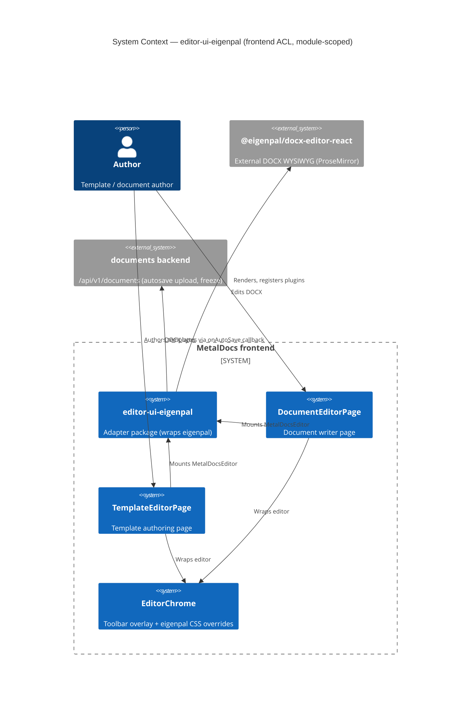
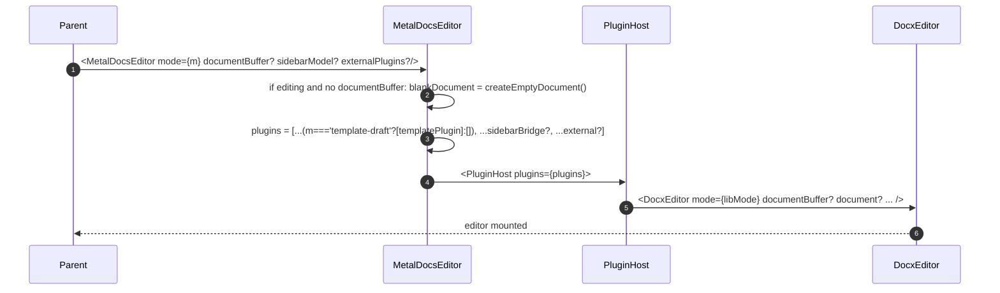
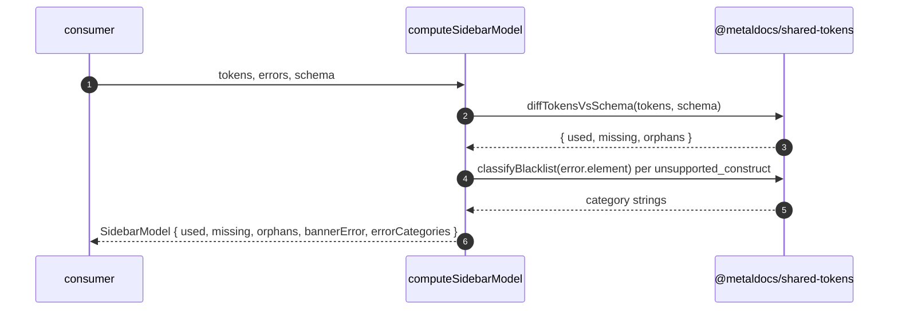

# Module: editor-ui-eigenpal

> Living architecture doc. Replaces the prior integration stub. Shape: Arc42 (12 sections) + C4 (Context + Container) Mermaid diagrams + ADR links.
>
> **Last verified:** 2026-06-27 (Task 7–9: section-aware `insertToken`, uniform multi-view `getUsedTokens`, HF-coloring vendor limitation, freeze covers header/footer; prior: 2026-06-23 eigenpal migration: vendored `@eigenpal/docx-js-editor@0.2.0` tarball retired; now `@eigenpal/docx-editor-react@1.9.0` from npm registry; import paths and version refs updated throughout; prior: 2026-06-14) | **Owner:** unassigned | **Status:** active (FE adapter, two production consumers) | **Maturity:** L2

---

## 1. Introduction & Goals

`editor-ui-eigenpal` is the MetalDocs adapter package (`packages/editor-ui/`) that wraps the external `@eigenpal/docx-editor-react` library and exposes a narrower, MetalDocs-shaped surface to consuming pages. It is an Anti-Corruption Layer: the rest of the frontend should never import from `@eigenpal/docx-editor-react` directly. The wrapper centralizes plugin selection, autosave debounce, ref-shape, and the mode discriminator the rest of the app uses (`template-draft | document-edit | readonly`).

### 1.1 Requirements overview

- **Wrap a single eigenpal version pin** — drives plugin compatibility and CSS overrides. Source: ADR 0001.
- **Provide a 3-value `EditorMode`** — `template-draft` / `document-edit` / `readonly` — that maps onto eigenpal's 2-value `editing`/`viewing`. Source: 2026-05-06 plugin-registration refactor (no ADR — see T-007).
- **Gate `templatePlugin` to `template-draft`** — so document-edit and readonly do not render meaningless sidebar chips. Source: `MetalDocsEditor.tsx:49-59` comments + `concepts/placeholders.md` (writer mode never substitutes).
- **Seed editable blank mounts with an Eigenpal empty document** - when no DOCX buffer exists, `template-draft` / `document-edit` pass `createEmptyDocument()` through the adapter so consumers see a blank page, not Eigenpal's "No document loaded" fallback. Source: `MetalDocsEditor.tsx:53-56`.
- **Surface DOCX bytes via debounced autosave** — 1500ms debounce + concurrent-save guard, hand bytes to the parent. Source: `MetalDocsEditor.tsx:30-47`.
- **Re-export the eigenpal `Comment` type** — so `documents` module consumes one type-source. Source: `index.ts:3`.

### 1.2 Quality Goals

| Rank | Goal | How verified |
|---|---|---|
| 1 | Seam isolation — no `@eigenpal/docx-editor-react` import outside `packages/editor-ui/` | Repo-wide grep. Violation resolved 2026-05-11 (commit `60fa5473`) — `TemplateEditorPage` migrated to `MetalDocsEditor`; target now met |
| 2 | Tokens stay literal in writer mode — no client-side `applyVariables` call | Source grep `applyVariables` in `MetalDocsEditor.tsx` returns 0; freeze pipeline owns substitution. See `concepts/placeholders.md` |
| 3 | Blank authoring starts as a real editable page | `MetalDocsEditor.mount.test.tsx` asserts editable no-buffer mounts receive `createEmptyDocument()`; Navegador validation on `Blank Eigenpal 1779023863221` showed toolbar + empty page and no "No document loaded" |
| 4 | No save races — only one save in flight per editor instance | `inFlightRef` guard at `MetalDocsEditor.tsx:35`; covered by `MetalDocsEditor.mount.test.tsx` |

### 1.3 Stakeholders

| Role | Expectation |
|---|---|
| Template author / document author (end user) | Consistent toolbar, working autosave, no token-corruption surprises |
| FE developer | One import (`@metaldocs/editor-ui`), one type contract, one place to refresh eigenpal |
| QA / regulated-doc operator | Frozen DOCX is what the author saw; client never silently substitutes tokens |

---

## 2. Architecture Constraints

- Runtime: React 18.2 (peer dep), TypeScript 5.4, ESM-only.
- Sole runtime library coupling: `@eigenpal/docx-editor-react`, now at `1.9.0` installed from the npm registry (tarball `third_party/eigenpal/eigenpal-docx-js-editor-0.2.0.tgz` deleted 2026-06-23; `third_party/eigenpal/NOTICE` file present in its place). T-001 resolved 2026-05-11.
- Token syntax: `{name}` single-brace eigenpal-native only. Legacy `{{uuid}}` removed 2026-04-25; see `wiki/decisions/0003-token-syntax-migration.md`.
- Substitution boundary: writer never substitutes. All token resolution is server-side at freeze. Driver: ADR 0008 + `concepts/placeholders.md`.
- No HTTP, no DB, no migrations.
- No errors raised to API layer ⇒ RFC 9457 envelope: n/a.
- Distribution: source-only npm package (`main: ./src/index.ts`); consumed by `frontend/apps/web` via path alias (`vite.config.ts:36`, `tsconfig.json:21`).

---

## 3. System Scope & Context — module-scoped (C4 Level 1)

> System-level context lives in [`wiki/diagrams/c4-context.md`](../diagrams/c4-context.md). The diagram below is **module-scoped to the frontend ACL**: it shows the adapter's two consumers (DocumentEditorPage, TemplateEditorPage), the EditorChrome sibling, the vendored eigenpal package, and the documents backend autosave surface.



### 3.1 Business Context

Authors expect a Word-like editor that does not silently change the document. The adapter exists so MetalDocs can swap or upgrade the underlying eigenpal version without rippling those changes into every page that mounts an editor. The seam also keeps writer-mode honest: the rule "tokens stay literal until server freeze" is enforced in one file (no client-side `applyVariables`) instead of in every consumer.

### 3.2 Technical Context

Inbound:
- Two production mounts: `DocumentEditorPage.tsx:238`, `TemplateEditorPage.tsx:334`.
- Type-only imports of `Comment` from `useDocumentComments` and its tests.

Outbound:
- `@eigenpal/docx-editor-react` (`DocxEditor`, `DocxEditorRef`, `EditorMode`, `createEmptyDocument`) and `@eigenpal/docx-editor-react/plugin-api` (`PluginHost`, `templatePlugin`, `EditorPlugin`, `ReactSidebarItem`).
- `@eigenpal/docx-editor-core/types/content` (`Comment` type, re-exported via wrapper).
- `@metaldocs/shared-tokens` (`diffTokensVsSchema`, `classifyBlacklist`) — fuels `computeSidebarModel`.

---

## 4. Solution Strategy

- **Wrap, do not patch.** No `pnpm patch` files, no `node_modules` hacks. Refresh path is version bump in `package.json` + reinstall from registry. Driver: ADR 0001.
- **Three modes, one prop.** A single `mode` prop drives plugin gating, autosave on/off, eigenpal `mode` mapping. Avoids per-consumer conditionals. Driver: 2026-05-06 refactor (rule has no ADR — T-007).
- **Blank document default belongs in the adapter.** Consumers pass `documentBuffer` when persisted DOCX exists; otherwise the wrapper seeds editable modes with `createEmptyDocument()` and leaves readonly empty mounts unseeded. This prevents every screen from learning Eigenpal's blank-document API and avoids writing storage rows before the first user edit.
- **Plugins composed at mount time, not on mode change.** The plugin list is rebuilt on every render; eigenpal's `PluginHost` accepts the new array. No `useMemo` — list is tiny and identity-stable when inputs are stable. Driver: simplicity over micro-optimization.
- **Autosave is parent's problem.** The wrapper produces bytes + a single in-flight guard. The parent owns retry, conflict (409/etag), and status surfacing (via `EditorChrome` `right` slot). Driver: keep wrapper free of network/API concerns.
- **`applyVariables` deferred.** Writer never substitutes. Future "preview mode" gets its own two-buffer design. Driver: ADR 0008.

---

## 5. Building Block View — module-scoped (C4 Level 2 — Container)

> System-level container topology lives in [`wiki/diagrams/c4-container-backend.md`](../diagrams/c4-container-backend.md). The diagram below decomposes the internal source files of the adapter package (wrapper, types, plugin bridges, dormant outline plugin, barrel).

### 5.1 Whitebox

```mermaid
C4Container
    title Container View — editor-ui-eigenpal (adapter-internal modules)
    Container(wrapper, "MetalDocsEditor.tsx", "React forwardRef", "mode gate, autosave debounce, imperative ref")
    Container(types, "types.ts", "TypeScript", "EditorMode, MetalDocsEditorProps, MetalDocsEditorRef")
    Container(sbBridge, "plugins/sidebarModelBridge.ts", "EditorPlugin factory", "Renders SidebarModel as eigenpal sidebar items")
    Container(sbModel, "plugins/mergefieldPlugin.ts", "Pure function", "computeSidebarModel — token/schema diff")
    Container(outline, "plugins/OutlinePlugin.tsx", "EditorPlugin factory (dormant)", "Heading navigation — exported, not registered (T-004)")
    Container(idx, "index.ts", "Barrel", "Public exports")
    ContainerExt(eig, "@eigenpal/docx-editor-react", "External lib", "DocxEditor, PluginHost, templatePlugin")
    ContainerExt(tok, "@metaldocs/shared-tokens", "Internal lib", "diffTokensVsSchema, classifyBlacklist")
    Rel(idx, wrapper, "exports")
    Rel(idx, types, "exports")
    Rel(idx, sbBridge, "exports")
    Rel(idx, sbModel, "exports")
    Rel(idx, outline, "exports")
    Rel(wrapper, eig, "DocxEditor, createEmptyDocument from @eigenpal/docx-editor-react; PluginHost, templatePlugin from /plugin-api")
    Rel(wrapper, sbBridge, "buildSidebarModelPlugin")
    Rel(sbBridge, eig, "EditorPlugin, ReactSidebarItem types from /plugin-api")
    Rel(sbModel, tok, "token diff math")
    Rel(outline, eig, "EditorPlugin, PluginPanelProps types from /plugin-api")
```

### 5.2 Public surface

| File | Symbol | Kind | Purpose |
|---|---|---|---|
| `packages/editor-ui/src/MetalDocsEditor.tsx:9` | `MetalDocsEditor` | React component | Adapter component; mounts `<PluginHost><DocxEditor/></PluginHost>` |
| `packages/editor-ui/src/types.ts:5` | `EditorMode` | type | `'template-draft' \| 'document-edit' \| 'readonly'` |
| `packages/editor-ui/src/types.ts:7` | `MetalDocsEditorProps` | interface | Wrapper props (mode, buffer, comments, autosave, `onChange`, …) |
| `packages/editor-ui/src/types.ts:30` | `MetalDocsEditorProps.onChange` | optional prop | `onChange?: () => void` — lightweight synchronous change notification fired before the autosave debounce; distinct from the internal eigenpal→wrapper `onChange` that triggers the autosave debounce |
| `packages/editor-ui/src/types.ts:29` | `MetalDocsEditorRef` | interface | `getDocumentBuffer`, `focus` |
| `packages/editor-ui/src/index.ts:3` | `Comment` | type re-export | From `@eigenpal/docx-editor-core/types/content`; one type source for `documents` module |
| `packages/editor-ui/src/plugins/sidebarModelBridge.ts:26` | `buildSidebarModelPlugin` | function | Eigenpal `EditorPlugin` factory; renders `Used / Missing / Orphan / Errors` sections |
| `packages/editor-ui/src/plugins/mergefieldPlugin.ts:11` | `computeSidebarModel` | function | Pure: tokens + errors + schema → `SidebarModel` |
| `packages/editor-ui/src/plugins/mergefieldPlugin.ts:3` | `SidebarModel` | interface | `{ used, missing, orphans, bannerError, errorCategories }` |
| `packages/editor-ui/src/plugins/OutlinePlugin.tsx:88` | `createOutlinePlugin` | function | Outline panel plugin — **exported, not registered** (T-004) |

### 5.3 HTTP operations

None. Adapter has no HTTP surface. The C4 Container diagram above replaces the (absent) routes table.

### 5.4 Mode-to-eigenpal mapping

| MetalDocs `EditorMode` | eigenpal `mode` | `templatePlugin` | Autosave debounce active |
|---|---|---|---|
| `template-draft` | `editing` | included | yes |
| `document-edit` | `editing` | skipped | yes |
| `review` | `suggesting` | skipped | yes (documents with tracked changes; autosave is active so reviewer edits are captured) |
| `readonly` | `viewing` | skipped | no (early-return at `MetalDocsEditor.tsx:31`) |
Editable modes (`template-draft`, `document-edit`, `review`) receive an Eigenpal `document={createEmptyDocument()}` seed when `documentBuffer` is absent. Persisted DOCX buffers take precedence and readonly empty mounts stay empty. The `review` mode is intended for approvers viewing a document with inline tracked changes (redlines); editor is read-only to the approver but autosave fires on any internal edits (e.g. rendering context updates).

---

## 6. Runtime View (selected scenarios)

### 6.1 Autosave (write path)

Trace source: `_artifacts/02-flow-autosave.md`.

```mermaid
sequenceDiagram
    autonumber
    participant Author
    participant Eig as eigenpal DocxEditor
    participant Wrap as MetalDocsEditor
    participant Parent as DocumentEditorPage
    Author->>Eig: keystroke / edit
    Eig-->>Wrap: onChange()
    Wrap->>Wrap: clear prev timer, schedule 1500ms
    Note right of Wrap: if mode==='readonly' OR no onAutoSave: return
    Wrap->>Wrap: timer fires; inFlightRef.current?
    Wrap->>Eig: inner.current.save()
    Eig-->>Wrap: Uint8Array | null
    Wrap->>Parent: onAutoSave(buf)
    Parent->>Parent: upload, handle 409/etag, set AutosaveStatus
    Parent-->>Wrap: resolve
    Wrap->>Wrap: inFlightRef = false
```

State transitions: n/a (no state machine; only `inFlightRef` boolean guard).

Failure modes:

| Condition | Behavior |
|---|---|
| `inner.current === null` | save skipped silently; next change reschedules |
| `save()` returns `null` | callback not invoked; no upload attempt |
| `cb(buf)` throws | error escapes the debounced callback; relies on parent's own try/catch |
| Concurrent change during in-flight save | guard returns; new timer schedules after `inFlightRef` clears |
| Mode flip writer → readonly mid-session | scheduled timer may save once after the flip (captured cb ref, not mode) — latent race, server-gated upstream |

### 6.2 Plugin registration on mount

Trace source: `_artifacts/02-flow-plugin-registration.md`.



### 6.3 SidebarModel build (read-only data path)



No production consumer currently invokes `computeSidebarModel` (verified by grep). Path is library-test-covered (`mergefieldPlugin.diff.test.ts`) and present for future sidebar adoption.

---

## 7. Deployment View

- Distribution unit: source-only npm workspace package `@metaldocs/editor-ui` (`packages/editor-ui/package.json:1`).
- No build step in CI; consumers compile source via Vite/TS path alias.
- Eigenpal dependency: `@eigenpal/docx-editor-react@1.9.0` installed from npm registry. Vendored tarball `third_party/eigenpal/eigenpal-docx-js-editor-0.2.0.tgz` deleted 2026-06-23; replaced by `third_party/eigenpal/NOTICE`. T-001 closed 2026-05-11.
- Refresh procedure: see `wiki/references/eigenpal-controlled-package.md` § Refresh checklist.
- No env vars. No secrets. No runtime config.

---

## 8. Cross-cutting Concepts

### 8.1 Authentication & Authorization

n/a — adapter has no server contact. Trust boundary lives upstream: parent page gates by `isEditable` and the server enforces write authz in the `documents` module. The wrapper still respects `readonly` mode by:
- mapping to eigenpal `mode='viewing'`,
- short-circuiting autosave in `handleChange`,
- skipping `templatePlugin`.

### 8.2 Error envelope

n/a — adapter raises no Problem responses. Errors thrown by `cb(buf)` propagate uncaught (parent owns try/catch). No log emission inside the wrapper.

### 8.3 Idempotency

n/a — no HTTP. `inFlightRef` protects against concurrent saves at the client; uniqueness/idempotency at the upload layer is the parent's responsibility (typically Idempotency-Key on the upload call).

### 8.4 Token semantics & placeholder safety

Tokens are literal in writer mode. Source rule: `MetalDocsEditor.tsx` never calls `applyVariables`. Reason: eigenpal autosaves on every change; calling `applyVariables` would persist substituted output on the next autosave, destroying the original `{name}` strings. Substitution is exclusively server-side at freeze; see `concepts/placeholders.md` + `wiki/decisions/0008-placeholder-fixed-catalog.md`.

Severity note: the placeholder-escape / XSS concern that motivated severity rubric "Critical for token-syntax drift" does not apply. Legacy `{{uuid}}` tokens were removed 2026-04-25 (one syntax, one path, one detector). There is no live two-syntax window in this adapter today. If `{{uuid}}` resurfaces, escalate to Critical on a per-incident basis — captured here so future drift checks know to look.

#### Section-aware token insert (`insertToken(key)`)

`getEditorRef().insertToken(key)` is section-aware: it dispatches the `{key}` transaction into whichever ProseMirror band the author last focused — the body view or a focused header/footer view — falling back to the body when nothing is tracked. Focus tracking is a delegated `focusin` listener on a `display:contents` wrapper that records the closest `.ProseMirror` element on each focus event. Header/footer views are resolved via `getEditorRef().getHfPmViews(): Map<rId, EditorView>`. All of this resolution lives inside `MetalDocsEditor.tsx` behind a module-local `PmView` structural type; no `EditorView` / `@eigenpal` type leaks past the ACL barrel (`index.ts` / `types.ts`), preserving the §12.1 vendor-sealed boundary.

#### Uniform multi-view token detection (`getUsedTokens()`)

`getUsedTokens()` is a uniform, vendor-independent text-parse. It scans `{name}` (regex `/\{([A-Za-z0-9_]+)\}/g`, which excludes docxtemplater control tags `{#..}` / `{/..}` / `{^..}` / `{>..}`) across the body doc and every `getHfPmViews()` doc, deduped first-seen. It no longer relies on the body-only vendor `templatePlugin` / `getTemplatePluginTags`, giving header/footer tokens one source of truth equal to the body's.

#### Header/footer edits surface as a change signal

The vendor `onChange` fires for the **body view only** — header/footer ProseMirror transactions never reach it. Without a second channel, HF edits silently miss token-usage refresh (`getUsedTokens` re-run) and autosave. `MetalDocsEditor.tsx` adds a single delegated `input` listener on the `display:contents` root (ProseMirror input events bubble out of every band) that routes to the same `handleChange` path, so edits from any view — body or HF — drive `onChange` / autosave uniformly, mirroring `collectPmViews`. Regression: `MetalDocsEditor.tokens.test.tsx` ("surfaces header/footer edits as a change signal").

#### Freeze covers header/footer

Token substitution at publish covers native header/footer tokens, not just body tokens: `apps/docx-renderer/src/render/fanout.ts` runs docxtemplater over the whole package, so header/footer `{name}` strings substitute at freeze. Proven by `apps/docx-renderer/src/render/__tests__/fanout.headerfooter.test.ts`.

### 8.5 Logging & Observability

The wrapper emits no logs and no metrics. Eigenpal handles its own console output. Parent pages own status surfacing through `AutosaveStatus` in the `EditorChrome` right slot.

### 8.6 Concurrency / Transactions

- Single in-flight save per editor instance (`inFlightRef`).
- `useEffect` cleanup clears the debounce timer on unmount; in-flight callback resolution post-unmount is caller-safe (caller owns state).
- No DOM/global locks. Multiple `MetalDocsEditor` instances on one page would each have independent timers and refs; eigenpal singletons (if any) live in the library — historic `cachedDoc` bug fixed in T7 spike via factory pattern (`OutlinePlugin.tsx:89`).

### 8.7 Anti-Corruption Layer

The adapter's central job is to be the only place that imports `@eigenpal/docx-editor-react` from outside the package. Violation by `TemplateEditorPage` resolved 2026-05-11 (commit `60fa5473`) — both consumer pages now mount `MetalDocsEditor`. The rule has no ADR yet (T-008).

---

## 9. Architecture Decisions

| Decision | Link / Status |
|---|---|
| Adopt eigenpal (DOCX WYSIWYG) over CKEditor / BlockNote | `wiki/decisions/0001-eigenpal-adoption.md` |
| Single-brace `{name}` token syntax (drop `{{uuid}}`) | `wiki/decisions/0003-token-syntax-migration.md` |
| Fixed 7-token computed placeholder catalog; no client-side substitution | `wiki/decisions/0008-placeholder-fixed-catalog.md` |
| `templatePlugin` gated to `mode === 'template-draft'` | `tech-debt: missing-ADR` (T-007) |
| Wrapper-only consumption rule (Anti-Corruption Layer for eigenpal) | `tech-debt: missing-ADR` (T-008) |

---

## 10. Quality Requirements

| Goal | Scenario | Pass criteria |
|---|---|---|
| Seam isolation | `grep -r “@eigenpal/docx-editor-react” frontend/apps/web/src` outside type-only positions | Returns zero results — target met (T-002 resolved 2026-05-11) |
| Tokens stay literal | Author types `{doc_code}`, autosaves, refreshes page | Stored DOCX still contains the literal string `{doc_code}` — no substitution in the buffer |
| Single in-flight save | Burst of 10 keystrokes within 1s | Exactly one `save()` invocation after debounce; no overlapping `cb(buf)` calls |
| Blank editable mount | New blank template has no `docx_storage_key`; `TemplateEditorPage` mounts `MetalDocsEditor` with no `documentBuffer` | Eigenpal receives `createEmptyDocument()` and renders a blank page with toolbar; no "No document loaded" fallback |
| Readonly is non-mutating | Mount `mode='readonly'`, fire `onChange` programmatically | `handleChange` early-returns at line 31; no `onAutoSave` invocation |

---

## 11. Risks & Technical Debt

Pointer-only. Body in `wiki/modules/editor-ui-eigenpal-tech-debt.md`. Severity rubric (concrete triggers) is in the same file; do not invent local definitions.

- Critical: 1
- Major: 2
- Minor: 5

Coverage stats (computed at compose time):
- Public symbols undocumented: 0 / 10
- Operations missing C4 placement: 0 / 0 (no HTTP)
- Cross-deps missing in §5/§8: 0 / 5
- State transitions missing in §6: 0 / 0 (no state machine)
- Decisions without ADR link: 6

Top 3 (by severity, then by blast-radius):
1. T-004 — `createOutlinePlugin` exported but not registered; public surface advertises a plugin with no current consumer. See tech-debt §T-004.
2. T-005 — `mergefieldPlugin.ts` filename misnames its contents; confusing for future maintainers. See tech-debt §T-005.
3. T-006 — `onLockLost` prop declared but never wired; consumers passing it receive no callback. See tech-debt §T-006.

---

## 12. Neutral comment seam (Phase 3B)

**Last verified:** 2026-06-23

### 12.1 Two-door ACL diagram

The editor-ui package enforces a vendor-sealed boundary:

```
app (frontend/apps/web)
 └─ @metaldocs/editor-ui   ← the wall (vendor-type-free public surface)
     └─ @eigenpal/docx-editor-*   ← sealed vendor
```

Consumers of the app import only from `@metaldocs/editor-ui`. The wrapper's public surface (`index.ts` and `types.ts`) contains no `@eigenpal` string references.

### 12.2 EditorComment type

The only comment type the app sees. Defined in `@eigenpal/docx-editor-core/types/content` and re-exported by the adapter.

**Fields:**
- `id: number` — unique comment ID
- `parentId?: number` — reply-to comment ID (optional)
- `author: string` — comment author name
- `createdAt?: string` — ISO-8601 timestamp (optional)
- `body: unknown` — opaque ProseMirror Paragraph[] content
- `resolved: boolean` — comment state (resolved or open)

**Mapping source:** `packages/editor-ui/src/comment-mapping.ts`

### 12.3 filterTransactionGuard

Internal to the package; not exported. Mode-driven filter that restricts editor transactions based on `EditorMode`.

**Modes:**
- `template-draft` — allows template-specific edits
- Other modes — standard editing constraints apply

**Source:** `packages/editor-ui/src/plugins/filter-transaction-guard.ts`

Note: The app no longer supplies plugins via `externalPlugins` prop.

### 12.4 Public-surface guard test

Regression test: `packages/editor-ui/test/public-surface.test.ts`

Asserts that `index.ts` and `types.ts` contain no `@eigenpal` string. Fails on future vendor leaks, enforcing the ACL wall.

### 12.5 Accepted limitations (NOT built in Phase 3B)

The following are deferred to the backend approval gate:

| Limitation | Issue | Resolution |
|---|---|---|
| Comment orphan reconciliation | Anchor deleted in editor body but thread row remains in comment state | Backend returns HTTP 409 `approval.unresolved_comments` if any unresolved comment exists |
| Add/save atomicity | Creating a comment and persisting it are not atomic at the document level | Backend approval gate validates document + comment state consistency |
| Published-artifact staleness | A published snapshot may show resolved comments that are still unresolved in the live document | Operator-gated via document approval process; background reconciliation task is future work |
| Header/footer tokens are uncolored | The vendor `templatePlugin` (amber `.docx-template-tag` decoration + sidebar chips) is installed on the BODY view only (runtime-confirmed: 3 decorations in the body PM, 0 in the HF bands). The unified-HF painter renders header/footer from `state.doc` content, not from ProseMirror decorations, so tokens typed in a header/footer are fully functional — inserted, detected, and substituted at freeze — but NOT colored. Vendor-internal wiring decision, not adapter-fixable without `@eigenpal` changes. | Operator de-scoped coloring; tracked as tech debt. Upstream ask: expose the template decoration set (or install `templatePlugin`) on HF PM views. |

**Backend enforcement:** Decision service `T-011` in `internal/modules/documents/.../decision_service.go` returns HTTP 409 if any comment is unresolved at approval time.

**Related:** `wiki/modules/documents-tech-debt.md` (comment-related future work and constraints).

---

## 13. Glossary

| Term | Definition |
|---|---|
| Adapter / Anti-Corruption Layer | The `packages/editor-ui/` boundary: a translation layer between MetalDocs domain types and the external eigenpal API |
| Writer mode | `template-draft` or `document-edit` — autosave is active; tokens stay literal |
| Mode gate | The conditional that includes/excludes `templatePlugin` based on `EditorMode` |
| Seam | The single point at which MetalDocs depends on eigenpal — the surface contract the adapter promises |
| Dormant plugin | A plugin source file that is still maintained but not registered in the wrapper (e.g. `OutlinePlugin`) |

---

## 14. Failure modes

| Failure | Symptom | Detection | Response |
|---|---|---|---|
| eigenpal npm package missing / not installed | Build fails; adapter cannot import `DocxEditor` | `pnpm install` reports missing `@eigenpal/docx-editor-react`; T-001 closed 2026-05-11 | Run `pnpm install`; package is pulled from npm registry per ADR 0001 amendment |
| Consumer bypasses wrapper and mounts eigenpal directly | ACL violated — token / mode / autosave rules not applied | Code review on PRs that import `@eigenpal/docx-editor-react` from outside the adapter | Reject; T-002 (closed; TemplateEditorPage migrated 2026-05-11) — regression rule |
| Autosave debounce fires while previous PUT in-flight | Wrapper's in-flight guard short-circuits the new emit | Console / network trace; manual rapid-edit test | Expected behavior; consumer owns retry on rejected PUT |
| `documentBuffer` absent on editable mode | Wrapper seeds with `createEmptyDocument()`; no DB row written until first edit | Adapter `MetalDocsEditor.tsx` blank-seeding path | Expected; readonly empty mounts stay unseeded by design |
| `applyVariables` called on writer mode | Writer mode silently substitutes — violates "tokens stay literal until server freeze" | No code path today (deferred per ADR 0008); rule guarded by adapter shape | Reject any PR adding client-side substitution to writer mode |
| Eigenpal upgrade changes `EditorPlugin` interface | Sidebar bridge / template plugin stops registering | Adapter typecheck fails on version bump | Update adapter wrapper; bump `@eigenpal/docx-editor-react` version in `package.json` and reinstall |
| `Comment` type drift between eigenpal and `documents` consumers | Type errors in `useDocumentComments` consumers | TypeScript strict mode | Update single re-export in `packages/editor-ui/src/index.ts:3` — chrome's "one type source" guarantee |
| OutlinePlugin re-introduced into wrapper without ADR | Plugin registered behind feature flag without governance | T-004 — plugin exported but intentionally not registered | Add ADR or keep dormant |

## Cross-links

- ADRs: `wiki/decisions/0001-eigenpal-adoption.md`, `wiki/decisions/0003-token-syntax-migration.md`, `wiki/decisions/0008-placeholder-fixed-catalog.md`
- Concepts: `wiki/concepts/placeholders.md`, `wiki/concepts/token-syntax.md`
- Sibling module: `wiki/modules/editor-chrome.md` (overlay + eigenpal CSS overrides; consumes wrapper output)
- Consumers: `wiki/modules/documents.md` (DocumentEditorPage); `wiki/modules/templates.md` (TemplateEditorPage — migrated to adapter 2026-05-11)
- References: `wiki/references/eigenpal-spike.md`, `wiki/references/eigenpal-controlled-package.md`
- Backlog: `wiki/backlog/editor-ui-eigenpal-refactor.md`
- Tech debt: `wiki/modules/editor-ui-eigenpal-tech-debt.md`

## Changelog (this doc)

- 2026-06-27 — Task 7–9: documented the section-aware `insertToken(key)` (last-focused-band tracking via delegated `focusin`; dispatch into body or focused HF view via `getHfPmViews()`; `PmView` structural type keeps `@eigenpal` off the barrel) and the uniform multi-view `getUsedTokens()` text-parse (vendor-independent `{name}` scan across body + all HF docs; replaces body-only `templatePlugin`/`getTemplatePluginTags`) in §8.4. Recorded the HF-coloring vendor limitation in §12.5 (templatePlugin body-only; HF painter renders from `state.doc` content not decorations; functional-but-uncolored; upstream ask to install/expose decorations on HF PM views; operator de-scoped). Noted freeze covers header/footer via `apps/docx-renderer/src/render/fanout.ts`, proven by `fanout.headerfooter.test.ts`. Last verified bumped to 2026-06-27.

- 2026-06-23 — eigenpal migration: vendored `@eigenpal/docx-js-editor@0.2.0` tarball retired; `@eigenpal/docx-editor-react@1.9.0` adopted from npm registry. Import paths updated: main API from `@eigenpal/docx-editor-react`, plugin API from `@eigenpal/docx-editor-react/plugin-api`, `Comment` type from `@eigenpal/docx-editor-core/types/content`. Tarball at `third_party/eigenpal/` deleted; `third_party/eigenpal/NOTICE` present. §1.1 §2 §3 §3.2 §4 §5 §7 §8.7 §10 §11 Failure modes all updated.

- 2026-05-17 - Route-memory sync: C4 context now points the documents backend relationship at the canonical `/api/v1/documents` surface. This is a documentation correction only; no adapter runtime behavior changed.

- 2026-05-17 - Blank-template authoring fix: `MetalDocsEditor` now seeds editable no-buffer mounts with `createEmptyDocument()`, keeping Eigenpal's blank-document contract inside the adapter. Updated requirements, strategy, mode mapping, plugin-registration flow, quality requirements, and dependency facts. Verified with editor-ui tests, editor-ui typecheck, frontend typecheck, and Navegador on a fresh blank template (`a93b9271-470c-4178-b557-a914733de92e`).

- 2026-06-27 — Fix: HF edits now surface as a change signal. Vendor `onChange` is body-only, so header/footer edits missed token-usage refresh + autosave; added a delegated `input` listener on the `display:contents` root routing every band's edits through `handleChange` (§8.4 new subsection). Regression test in `MetalDocsEditor.tokens.test.tsx`.
- 2026-05-11 — Plan 11: T-002 closed — `TemplateEditorPage` migrated to `MetalDocsEditor` (commit `60fa5473`); T-003 closed — `templatePlugin.wiring.test.tsx` rewritten to 5 correct assertions gated on `template-draft` mode (commit `ce6d809a`). `onChange` prop added to `MetalDocsEditorProps` (commit `cae6da02`). §1.2 goal-1 updated; C4 context diagram updated; §3.2 IN-edges updated; §5.2 surface table extended; §8.7 ACL note updated; §10 seam-isolation row updated; §11 counts + Top 3 recomputed. Consumer anchor `TemplateEditorPage.tsx:334` added.
- 2026-05-11 — Sync pass (Plan 3): bumped Last verified; §2 vendor note updated (T-001 resolved — tarball restored); §11 Top 3 list updated to reflect T-001 closure (T-002 now #1, T-003 #2, T-004 #3).
- 2026-05-10 — Replaced integration stub with Arc42 + C4 living doc. Surfaced 1C/2M/5m debt items; documented vendored-tarball gap (T-001), wrapper-bypass drift (T-002), stale test (T-003). Two missing-ADR rows for the gating rule and the wrapper-only boundary.
