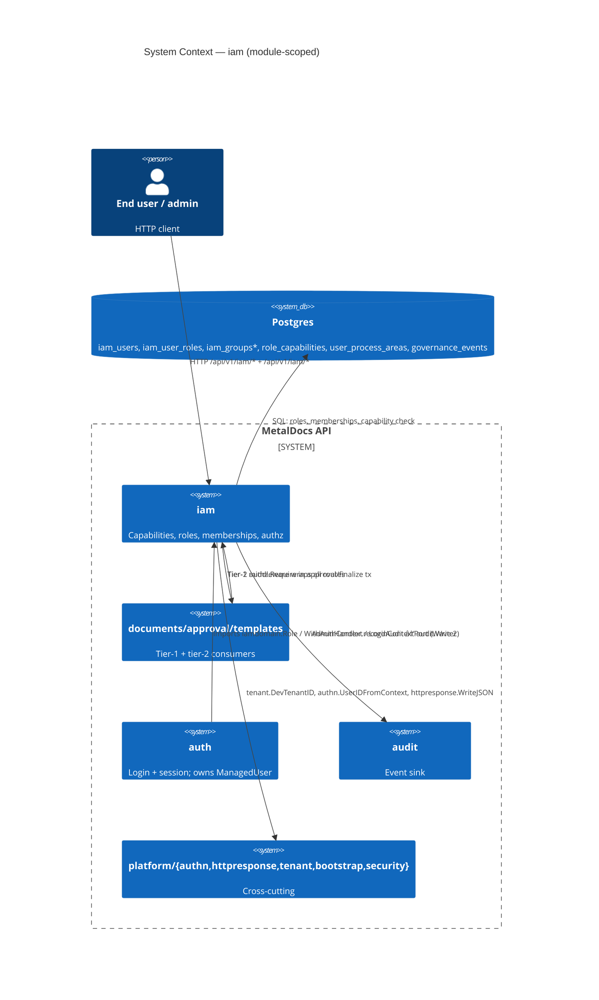
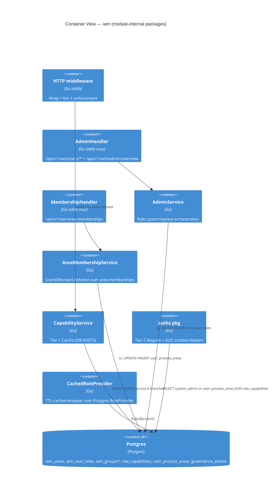
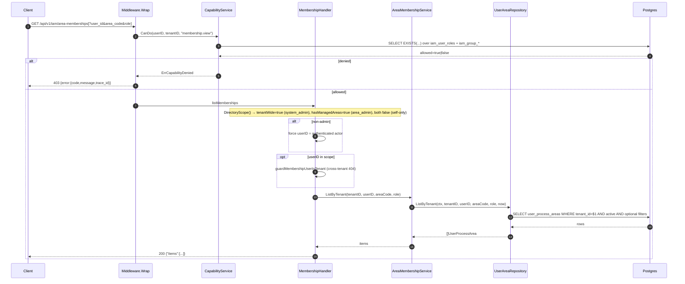

# Module: iam

> Living architecture doc. Shape: Arc42 + C4 + ADR cross-links.

**Last verified:** 2026-06-15 (M4/F4.1 — port ADR 0029 cross-link: iam now owns `UserDisplayNameReader` port; 3 cross-module `iam_users.display_name` reaches in documents/approval/controlled-documents closed) | **Prior:** 2026-06-12 (Wave 2.12 sync — RoleProvider.UserActiveInTenant added; TenantMemberChecker sibling port + PeopleService.WithTenantMemberChecker/tenantChecker/ListUsers-fallback DELETED; VerifyUserInTenant calls RoleProvider.UserActiveInTenant directly; RolesByUserIDs filters by tenantID (M-6 fix); AreaMembershipService governance logger is now REQUIRED ctor dep (panics on nil — T-007 CLOSED); membershipGovernanceLogger adapter wired in main.go:363; governance logging best-effort (warn on sink failure); prior Wave 2 sync: batch role-load, TenantMemberChecker EXISTS probe, LoginContextPort ownership transfer to iam) | **Prior:** 2026-06-11 (adversarial audit fix — corrected broken file:line anchors: `isMembershipDirectoryAdmin` replaced by `DirectoryScope()` / `tenantWide` boolean resolved at `routes_memberships.go:128`; migration 0188 does not exist — tripwire hardening is in `db/migrations/0231_db_hardening_tripwire_and_dead_schema.sql`; `user_area_repository.go` authz.Require line numbers corrected to Insert:191 / CloseActive:244 / GrantAtomic:299; `role_admin_repository.go` authz.Require corrected to UpsertUserAndAssignRole:47 / ReplaceUserRolesTx:99; `revokeMembership` handler corrected to line 249; `handleAdminOverview` function corrected to line 151; permissions.go IAM split range corrected to lines 102-116) | **Prior:** 2026-06-10 (Stage-1 backend audit drift patch — see sync-log) | **Prior:** 2026-06-03 (qa consolidation — PR #58 + PR #57 merged into `qa/iam-area-membership`; API binary REBUILT from qa via `scripts/start-api.ps1 -Build` and re-verified clean-room through the FE proxy path: login 200, tenant-wide list 7 rows / 5 users / 2 areas, `role`/`areaCode` server-filter narrows correctly, grant → 201, revoke → 204. **Root cause** of the prior "verified but rebuild-regresses" state: the PR-1 backend fix (`ListByTenant` + `isMembershipDirectoryAdmin` + `revoked_by` CHECK satisfaction) lived only on `fix/iam-memberships-pr1-backend-gaps` and was ABSENT from the PR-2 FE branch — any `start-api.ps1 -Build` from the FE branch reintroduced B1/B2/B3; the earlier e2e used a throwaway integration branch that was then discarded, leaving the running binary correct but the checked-out source broken. Consolidating both PRs into qa closes the divergence. The earlier `ERR_ALPN_NEGOTIATION_FAILED` on UI POST was a TLS-layer error emitted by the Claude-Preview MITM browser proxy — impossible on the all-plaintext `localhost:4173 → vite proxy → :8081` path, therefore a test-harness artifact, NOT an app defect.) (PR-2 of the IAM Area Membership rebuild — `feat/iam-memberships-pr2-frontend` (PR #57): full frontend rebuild folded into the IAM Admin Center as a **7th tab** (Option A) — `MembershipsTab` container (`frontend/apps/web/src/features/iam/tabs/MembershipsTab.tsx`) owns searchParams (`q`/`areaCode`/`role`/`sort`/`dir`), gates `+ Conceder` + per-row `Revogar` on `useHasCapability("membership.manage")` (route stays at `membership.view`, ADR 0016); 5 presentational components (`MembershipsDirectory`, `MembershipsFilterBar`, `GrantMembershipDialog`, `RevokeMembershipDialog`, `MembershipKpiStrip`) + CSS Modules; TanStack hooks `useMembershipsQuery` + `useGrant`/`useRevokeMembershipMutation` (`QK.iam.memberships.*` in `lib/queryKeys.ts`, mutations invalidate memberships.all + per-user key); `IAM_AREA_ROLES` const in `features/iam/constants.ts`. Orphan top-level `admin/memberships` route + legacy `AreaMembershipAdminPage`/`AreaMembershipAdminRoutePage`/`MembershipGrantDialog`/`membershipApi` DELETED; `AppShell.test.tsx` updated to the nested IA. tsc clean; 25 IAM/shell vitest + full 437-test FE suite green. The 3 Gate-3 blockers (B1 role-change 500, B2 no tenant-wide list, B3 ignored `areaCode`/`role` filters) are **CLOSED by PR #58** (`fix/iam-memberships-pr1-backend-gaps`, see clause below). **End-to-end re-verified** on the integration of PR #57 + PR #58: admin tenant-wide directory renders all 7 memberships across 5 users / 2 areas (KPIs 7/2/5), `areaCode`/`role` server-filtering narrows correctly, grant new-pair → 201 + persists, role-change grant → no longer 500, revoke → 204 + persists (verified via API; UI POST mutation is blocked only by the Claude-Preview browser-proxy `ERR_ALPN_NEGOTIATION_FAILED` quirk on POST — not an app defect, GET/list/filter/dialog all verified in-preview). PR-1 close-out preserved below.) (fix/iam-memberships-pr1-backend-gaps — PR #58 — 4 BE/contract gaps closed: `CloseActive` and `GrantAtomic` now set `revoked_by` = acting user satisfying the `revoked_by_required_when_revoked` CHECK (fixes SQLSTATE 23514 / HTTP 500 on role-change grant); new `ListByTenant(ctx, tenantID, userID, areaCode, role, now)` on `UserAreaRepository` with optional exact-match filters; `UserAreaWriteRepository` interface gained `ListByTenant`; `AreaMembershipService.ListByTenant` added; `listMemberships` handler rewritten — system_admins get tenant-wide directory with optional userId/areaCode/role filters, non-admins are restricted to their own memberships; new helper `isMembershipDirectoryAdmin`; cross-tenant 404 guard runs when a specific userId is in scope; OpenAPI `listAreaMemberships` param descriptions refreshed (no shape change); dev seed adds `qualidade`/`producao` process areas and 3 new `qualidade` memberships (`producao` intentionally empty).) (PR-1 of the IAM Area Membership rebuild — `feat/iam-memberships-pr1-contract`: OpenAPI spec at `api/openapi/v1/openapi.yaml:2103` rewritten — path renamed to server-relative `/iam/area-memberships` (matches the `/api/v1` server block); new component schemas `AreaMembershipRow` / `AreaMembershipListResponse` / `GrantAreaMembershipRequest` / `GrantAreaMembershipResponse`; full RFC 9457 `Problem` responses for 400/401/403/404/409. `frontend/apps/web/src/lib/api-types/index.d.ts` regenerated via `corepack pnpm gen:api`. `MembershipHandler` (`internal/modules/iam/delivery/http/routes_memberships.go`) now takes a `MembershipUserTenantVerifier` and an `auditdomain.Writer` — cross-tenant probes return 404 NOT 403 (mirrors PeopleHandler `guardUserInTenant`), grant + revoke emit `iam.area_membership.granted` / `.revoked` audit events, duplicate same-role grant maps to 409 `MEMBERSHIP_EXISTS` via the new `iamapp.ErrMembershipExists` sentinel, and self-grant is locked out (a `CapMembershipManage` holder can no longer hand themselves additional area roles). `apps/api/cmd/metaldocs-api/permissions.go:225` trimmed the dead PUT/PATCH routeRules and switched to `pathExact` for the three supported verbs; new `TestPermissionResolver_AreaMembershipRoutes` lock test pins the contract and asserts PUT/PATCH fall through to `VisibilitySessionRequired`. Handler integration tests at `tests/unit/iam_memberships/area_memberships_handler_test.go` cover contract shape, audit emission, cross-tenant 404, duplicate 409, tenant-isolated listing, and self-grant rejection. PR #55 QA close-out preserved below.) (Prior PR #55 close-out: `GET /api/v1/iam/area-memberships` now serializes lowerCamel via new `membershipDTO` in `internal/modules/iam/delivery/http/routes_memberships.go` (prior PascalCase from raw `iamdomain.UserProcessArea` left the FE list silently empty); FE `fetchMemberships` in `frontend/apps/web/src/features/iam/membershipApi.ts` unwraps the `{items:[]}` envelope and the `'reviewer'` phantom role was dropped from `GrantMembershipRequest`; `AreaMembershipAdminPage` now gates manage UI (Conceder / Revogar / Acoes column) on the caller's `membership.manage` capability per ADR 0016 view/manage split — route still gated at `membership.view`. PR-12b close-out preserved below.) (PR-12b close-out: duplicate migration `0219_audit_export_jobs_pr6.sql` renumbered to `0224_audit_export_jobs_pr6.sql` so the runner never silently skips one of the two PR-4/PR-6 schema changes when ledger-restored mid-sequence; `handleListMemberships` in `internal/modules/iam/delivery/http/people_handler.go` now calls `guardUserInTenant` so cross-tenant probes return 404 instead of an empty 200 (matches the PR-7b pattern; covered by `TestListMemberships_RejectsCrossTenantUserWith404`); `BumpMiddleware` gained `StartCleanup(ctx)` that ticks at `BumpDebounce*5` and evicts `lastBump` entries older than `BumpDebounce*10` so the in-memory debounce map can no longer grow unboundedly under user churn (wired in `apps/api/cmd/metaldocs-api/main.go`); FE `usePresenceStream` upgraded to a native WebSocket against `/api/v1/iam/presence/stream` with 30s heartbeat, exponential backoff (1s → 30s), and HTTP-snapshot polling fallback after 5 consecutive failed reconnects; FE `UserRole` phantoms `'admin'`/`'reviewer'` removed from `lib/types` (canonical 8-role union only — `DocumentPublishedPage` revision-init check migrated; templates workflow-role test casts at the store boundary) and the stale `AdminOverviewResponse` interface deleted (consumers import from `lib/api-types` codegen). PR-7b notes preserved below.)

**Prior verification — 2026-06-02 (PR-7b hardening):** 3 CRITICAL + 3 HIGH + 2 MEDIUM closed. Cross-tenant ATO via `handleResetPassword` / `handleUnlock` / `handlePatch` plugged with `PeopleService.VerifyUserInTenant`; bulk loop guards each user-id; `permissions.go` routeRules gained explicit entries for `POST /iam/users/invite`, `POST /iam/users/bulk`, `GET /iam/users/{user_id}/memberships` so they no longer fall through to `VisibilitySessionRequired`. LIKE-metachar escaping centralized in `internal/platform/sqlescape/like.go` and applied to `audit/.../writer.go` action+q filters; migration 0211 adds a partial index on `auth_identities.last_failed_login_at`. `Service.GetExportStatus` fails-closed on empty actor; cursor anchor misses now surface 410 `CURSOR_EXPIRED`. PR-4 baseline preserved below.)

**Prior verification — 2026-06-02 (PR-4):** People-tab backend slice — `PeopleHandler` registered via Go 1.22 typed mux patterns owns `GET /iam/users`, `POST /iam/users/invite`, `PATCH /iam/users/{user_id}`, `POST /iam/users/bulk`, `POST /iam/users/{user_id}/reset-password`, `POST /iam/users/{user_id}/unlock`, `GET /iam/users/{user_id}/memberships`; legacy `handleUserRoute` suffix dispatcher + `POST /iam/users` create retired; migration 0219 adds last-login context columns to `iam_users`; canonical-roles catalog grew to 8 (added `signer`, `area_admin`, `qms_admin` in `internal/modules/iam/domain/model.go`). T-004 noted closed — `authz.Require(CapUserManage)` already lives inside both `UpsertUserAndAssignRole` and `ReplaceUserRolesTx` in `internal/modules/iam/infrastructure/postgres/role_admin_repository.go:47,99`. Prior verification line preserved below.)
**Prior verification — 2026-06-02 (PR-2):** added `CapSessionManage`; broadened `CapAuditRead` grants to qms_admin/area_admin/approver via migration 0210; registry size 27 → 28; ADR 0019 documents the read-only-by-design naming exception.

**Prior verification — 2026-06-02 (PR-1):** T-005 (audit emission) + T-006 (RFC 9457 envelope) closed; §5.3 + §6.2 + §6.3 + §6.4 cap columns refreshed against `apps/api/cmd/metaldocs-api/permissions.go:102-116` (ADR 0016 view-grade split). | **Last verified:** 2026-06-09 (std-execution Family 5 query+path-param snake_case: route templates `{user_id}`→`{user_id}`, area-membership GET filters `?user_id&area_code&role`; prior: 2026-06-08 Phase E1 casing big-bang: grant/list membership response field names snake_case; upsertUserRole request snake_case) | **Owner:** unassigned | **Status:** active | **Maturity:** L2

**Prior verification — 2026-06-01:** Approval route admin PR-3 spike: confirmed `GET /api/v1/iam/roles` does **not** exist today — role catalogue is hard-coded in `internal/modules/iam/domain/model.go:10-16` (`approver`, `author`, `editor`, `system_admin`, `viewer`). Proposed endpoint shape `{roles:[{code,label}]}` gated by `CapMembershipView` is documented in [ADR 0018 §"IAM roles source"](../decisions/0018-approval-route-lifecycle.md); implementation deferred to PR-4 of approval route admin work or its own micro-PR. Frontend hard-codes the same list at `frontend/apps/web/src/features/approval/pages/RouteAdminPage.tsx:10` as `STAGE_ROLES`.

**Prior verification — 2026-06-01:** ADR 0016: added view-grade caps `metrics.view`, `membership.view`, `user.view`, `taxonomy.view`; registry now 24 consts; prior: P2 consolidation: §3/§5 C4 fragments tagged as module-scoped with pointer to canonical diagrams; added Failure modes section; 2026-05-26 Wave 2 authz tx seeding sync) | **Owner:** unassigned | **Status:** active (partial contract-first; defense-in-depth now two-layer on IAM writes) | **Maturity:** L2

> **Key files:**
> - `internal/modules/iam/application/capability_service.go:31` — tier-1 `CanDo` (DB-backed EXISTS over 4 branches)
> - `internal/modules/iam/authz/authz.go:44` — tier-2 `Require` (in-tx area check); system_admin bypass `:58`
> - `internal/modules/iam/authz/context.go:13` — `ErrActorContextMissing` / `ErrTenantContextMissing`; `MustActorID` `:21`, `MustTenantID` `:34`
> - `internal/modules/iam/delivery/http/middleware.go:31` — `NewMiddleware`; `Wrap` `:49`; strips trusted identity headers `X-User-ID` and `X-User-Roles`; tenant resolution: prefers `tenant.FromContext`, falls back to `X-Tenant-ID` header then `DevTenantID` (legacy-header mode only)
> - `internal/modules/iam/delivery/http/middleware.go:77` — `tenant.FromContext` call (primary tenant source post-Plan 3)
> - `internal/modules/iam/delivery/http/admin_handler.go:120` — `RegisterRoutes`; `handleAdminOverview` (implementation) at `:151`; reads `tenant.FromContext` at `:160`
> - `internal/modules/iam/delivery/http/routes_memberships.go:87` — `RegisterRoutes`; `listMemberships` at `:96` (admin-vs-non-admin scope split; directory scope resolved via `h.svc.DirectoryScope()` → `tenantWide` boolean at `:128`); `revokeMembership` handler implementation at `:249`; `tenantIDFromRequest` at `:376` delegates to `tenant.FromContext`
> - `internal/modules/iam/application/admin_service.go:23` — `UpsertUserAndAssignRole`
> - `internal/modules/iam/application/area_membership_service.go:78` — `ListActive`; `ListByTenant` at `:86`; `DirectoryScope` at `:92`; `Grant` at `:102`
> - `internal/modules/iam/application/cached_role_provider.go:18` — TTL-cached role provider
> - `internal/modules/iam/infrastructure/postgres/role_provider.go:28` — `RolesByUserID` (single LEFT JOIN, 1 round trip); `RolesByUserIDs` at `:75` (batch `= ANY($1)` for N users — Wave 2.12 M-6 fix: now filters by tenantID); `UserActiveInTenant` at `:119` (EXISTS point-lookup — Wave 2.12: replaces deleted `TenantMemberChecker` port; method added directly to `RoleProvider` interface)
> - `internal/modules/iam/domain/port.go:6` — `RoleProvider` interface includes `RolesByUserIDs(ctx, tenantID, []string) (map[string][]Role, error)` batch method and `UserActiveInTenant(ctx, tenantID, userID string) (bool, error)` (Wave 2.12 addition; `TenantMemberChecker` sibling port + `PeopleService.WithTenantMemberChecker`/`tenantChecker`/ListUsers-fallback DELETED)
> - `internal/modules/iam/domain/login_context_port.go:14` — `LoginContextPort` interface; `RecordLoginContext(ctx, userID, tenantID, ip, userAgent, deviceLabel string) error`; iam now owns this write (auth used to do it directly — Wave 2 F-06c)
> - `internal/modules/iam/infrastructure/postgres/login_context_repository.go:14` — `LoginContextRepository` implements `LoginContextPort`; UPDATE `metaldocs.iam_users` governance columns; missing row → no-op
> - `internal/modules/iam/application/people_service.go:586` — `VerifyUserInTenant` (Wave 2.12: calls `s.roles.UserActiveInTenant` directly — no `WithTenantMemberChecker` setter, no fallback full-list scan; `TenantMemberChecker` port deleted)
> - `internal/modules/iam/infrastructure/postgres/role_admin_repository.go:37` — `UpsertUserAndAssignRole` (BEGIN-authz.Require-DELETE-INSERT); `authz.Require(CapUserManage)` at `:47`; `ReplaceUserRoles` at `:82` delegates to `ReplaceUserRolesTx` at `:94`; `authz.Require(CapUserManage)` inside `ReplaceUserRolesTx` at `:99` — both paths call `authz.Require(CapUserManage)` (Plan 5 closed T-004 partial)
> - `internal/modules/iam/infrastructure/postgres/user_area_repository.go:57` — `ListByTenant` (tenant-scoped active-membership query, optional exact-match filters via `($n = '' OR col = $n)`); `MembershipDirectoryScope` at `:102`; `Insert` at `:177` (`authz.Require(CapMembershipManage)` at `:191`); `CloseActive` at `:232` (`authz.Require` at `:244`; sets `revoked_by = actorID` alongside `effective_to`, satisfies `revoked_by_required_when_revoked` CHECK); `GrantAtomic` at `:277` (`authz.Require` at `:299`; close-UPDATE sets `revoked_by`) — all three write methods have tier-2 enforcement and satisfy CHECK
> - `internal/modules/iam/domain/model.go:13` — single typed `Capability` namespace (29 consts; ADR 0019 (PR-2) added `CapSessionManage` and broadened `CapAuditRead` grants; ADR 0016 added `CapMetricsView`, `CapMembershipView`, `CapUserView`, `CapTaxonomyView`; Plan 5 added `CapControlledDocumentObsolete` + `CapControlledDocumentSupersede`; ADR 0022 Phase 10 minimized 33→29; Plan 4 closed T-001; size locked by `TestCapabilityRegistrySize`)
> - `db/migrations/0218_iam_caps_audit_session_pr2.sql` — PR-2 grants: `audit.read` → {qms_admin, area_admin, approver}; `session.manage` → {system_admin}; ADR 0019
> - `apps/api/cmd/metaldocs-api/permissions.go:112,202` — `(method,path)→Cap*` resolver (IAM users/roles at :112; area-memberships at :202)
> - `apps/api/internal/wiring/documents.go:24` — `NewCapabilityChecker` adapter (J2 fix)
> - `db/migrations/0231_db_hardening_tripwire_and_dead_schema.sql:36` — `CREATE OR REPLACE FUNCTION public.enforce_capability_asserted()` — current authoritative tripwire definition; CASE branches cover 12 tables (approval_instances, approval_signoffs, iam_user_roles, user_process_areas, documents, controlled_documents, cd_sequence_counters, document_profiles, document_process_areas, document_families, templates_template, templates_template_version); ELSE now fail-closed (RAISE) [runtime-unverified: trigger attachment state requires a live DB to confirm which tables carry `trg_require_cap_asserted`]
> - `internal/platform/tenant/const.go:4` — `DevTenantID` sentinel

---

## 1. Introduction & Goals

IAM owns identity-derived authorization for MetalDocs: it answers "can user X perform capability C in tenant T (and area A, when area-scoped)?". It does NOT authenticate (login/JWT) — that lives in `internal/modules/auth/`. IAM publishes the role catalogue, capability catalogue, role↔capability map, tenant-scoped role assignments, area-scoped membership grants, HTTP middleware that enforces tier-1, in-transaction helpers that enforce tier-2, and an admin HTTP surface for managing users + roles + memberships. The Postgres tripwire trigger that backs both tiers at the database layer is owned conceptually by IAM (migration 0142b) even though it attaches to approval tables.

### 1.1 Requirements overview

- **Tenant-scoped capability checks at the HTTP edge** — drivers: regulated QMS (ISO 9001) needs per-tenant role boundaries; source: `wiki/decisions/0007-two-tier-authz.md`.
- **Area-scoped grants for QMS process areas** — drivers: ISO segregation per process area; source: `wiki/concepts/iso-segregation.md`, `wiki/decisions/0007-two-tier-authz.md`.
- **DB-layer enforcement floor** — drivers: bug J2 (`permissiveAuthzChecker` returned nil); source: ADR 0007 amendment (J2) + `migrations/0142b_role_capabilities_v2_enforce.sql`.
- **Group-derived grants** — drivers: scale role admin to teams; source: migration 0163.
- **Tenant isolation by row** — drivers: multi-tenant data hygiene; source: Group B fix (audit 2026-05-03 B5/B6), migration 0162.

### 1.2 Quality Goals

| Rank | Goal | How verified |
|---|---|---|
| 1 | Correctness (no path bypasses authz) | `internal/modules/iam/authz/authz_bypass_test.go`; `tests/integration/iam/capability_service_test.go`; CI lint `authz-call-present` + `tripwire-pairing` (`scripts/api-lint/code_rules.go`) |
| 2 | Tenant isolation | `tests/integration/iam/tenant_isolation_test.go`; unique constraint `ux_iam_users_tenant_user`; `RolesByUserID` filters `tenant_id` (`role_provider.go:19`) |

### 1.3 Stakeholders

| Role | Expectation |
|---|---|
| End user | Cannot perform an op the role does not grant; gets a structured error |
| Operator (system_admin) | Can assign/replace user roles; can grant/revoke area memberships; mutations are audit-traceable |
| Developer | One way to ask "can this user?" at the edge (`CapabilityService.CanDo`) and one way to enforce inside a tx (`authz.Require`); typed errors for missing context |
| Auditor (ISO) | Per-area grant table with `effective_from`/`effective_to`; segregation enforced; capability matrix versioned |

---

## 2. Architecture Constraints

- Language: Go 1.25; stdlib `net/http`, `database/sql`, `chi`-free.
- Persistence: Postgres; tables under schemas `metaldocs.*` (admin) and `public.*` (process-area + governance).
- Authz model: two-tier per ADR 0007; system_admin bypass on both tiers.
- DB enforcement floor: `metaldocs.asserted_caps` GUC + `enforce_capability_asserted` trigger. The current authoritative definition is in `db/migrations/0231_db_hardening_tripwire_and_dead_schema.sql:36` (fail-closed ELSE branch hardening). The CASE branches cover 12 tables: `approval_instances`, `approval_signoffs`, `iam_user_roles`, `user_process_areas`, `documents`, `controlled_documents`, `cd_sequence_counters`, `document_profiles`, `document_process_areas`, `document_families`, `templates_template`, `templates_template_version`. [runtime-unverified: trigger attachment state per table requires a live DB]
- IAM is NOT under oapi-codegen yet (ADR 0012 documents the partial rollout). Membership routes have no `operationId`; admin POST `/api/v1/iam/users/{user_id}/roles` has request/response schemas (`api/openapi/v1/openapi.yaml:3871,3882`) but no codegen stub.
- Error envelope: IAM emits RFC 9457 Problem responses via `internal/platform/problem/problem.go` (`problem.Write` sets `Content-Type: application/problem+json`); admin handler and membership handler both route through `problem.New(...)`. Matches `wiki/architecture/api-design-system.md`. T-006 closed (Plan 7, 2026-05-12).
- Tenant sentinel: `DevTenantID = "ffffffff-ffff-ffff-ffff-ffffffffffff"` (`internal/platform/tenant/const.go:4`). Primary tenant source is `tenant.FromContext` (injected by auth middleware from `auth_sessions.tenant_id`). IAM middleware falls back to `X-Tenant-ID` header only in legacy-header mode; it strips trusted identity headers `X-User-ID` and `X-User-Roles` before downstream handlers. See `wiki/architecture/tenant-context.md` for the full pattern.

---

## 3. System Scope & Context — module-scoped (C4 Level 1)

> System-level context lives in [`wiki/diagrams/c4-context.md`](../diagrams/c4-context.md). The diagram below is **module-scoped**: it shows iam's relationship with tier-2 consumers (documents/approval/templates), auth, audit, and the platform packages that read its capability/tenant context.



### 3.1 Business Context

Auditors verify three things per controlled document: (a) only authorised roles act on it (tier-1), (b) per ISO 9001 the actor's role is bound to the document's process area (tier-2), (c) the submitter cannot sign-off their own work (SoD, enforced in approval, not here). IAM owns (a) and (b). The role↔capability matrix is the contract operators rely on; migrations 0165 (reseed) and 0169 (process-area backfill) define the current 40-row matrix.

### 3.2 Technical Context

Inbound HTTP routes (own): see §5.3. Inbound Go imports: 17 importers (`apps/api/cmd/metaldocs-api`, `apps/api/internal/wiring`, `internal/modules/documents/**` including `documents/approval`, `internal/modules/templates/delivery/http`, `internal/modules/auth/**`, `internal/platform/{bootstrap,authn,security}`, `internal/testsupport/http`). See `_artifacts/03-deps.md` §2 for full table.

Outbound Go imports: 5 packages — `internal/modules/audit/domain`, `internal/modules/auth/domain`, `internal/platform/authn`, `internal/platform/httpresponse`, `internal/platform/tenant`. Wave 2 note: `auth/application.Service` now depends on `iamdomain.LoginContextPort` (defined in iam/domain) for the last-login write — iam publishes the port; auth injects the impl at the composition root.

Outbound DB writes (owned): `iam_users`, `iam_user_roles`, `iam_groups`, `iam_group_members`, `iam_group_roles`, `role_capabilities` (read-only at runtime; reseeded by migrations), `user_process_areas`. Reads (not owned): `governance_events`, `document_process_areas` (taxonomy, via FK).

---

## 4. Solution Strategy

- **Two distinct authz tiers**, not a unification gap — driver: `wiki/decisions/0007-two-tier-authz.md`. Tier-1 reads `iam_user_roles`; tier-2 reads `user_process_areas`. Shared `role_capabilities`.
- **DB tripwire as enforcer of last resort** — driver: bug J2 + ADR 0007 codegen-rejected amendment. Originally backed approval tables only (0142b). The current authoritative function definition with 12-table CASE coverage and fail-closed ELSE is in `db/migrations/0231_db_hardening_tripwire_and_dead_schema.sql:36`. [runtime-unverified: which earlier migration first expanded coverage beyond approval tables]
- **DELETE-then-INSERT for role replacement** — driver: idempotent semantics under unique `(tenant_id, user_id)` constraint added in 0166; chosen over upsert to keep `assigned_at` truthful.
- **Tenant-scoped role provider with TTL cache** — driver: hot path on every request; `CachedRoleProvider` wraps the Postgres impl with key `userID|tenantID` and explicit `InvalidateUser` on admin writes (`application/admin_service.go:42`).

---

## 5. Building Block View — module-scoped (C4 Level 2)

> System-level container topology lives in [`wiki/diagrams/c4-container-backend.md`](../diagrams/c4-container-backend.md). The diagram below decomposes the internal Go packages of iam (middleware/handlers/services/role provider cache/authz package).

### 5.1 Whitebox — iam



### 5.2 Public surface (by file)

Full table in `_artifacts/01-surface.md` (129 exported symbols). High-level grouping:

| File | Exports |
|---|---|
| `domain/model.go` | `Role` type + 8 consts (`RoleApprover`, `RoleAreaAdmin`, `RoleAuthor`, `RoleEditor`, `RoleQmsAdmin`, `RoleSigner`, `RoleSystemAdmin`, `RoleViewer`) — 3 area-only roles (`area_admin`, `qms_admin`, `signer`) added in PR-4; `Capability` type + 29 typed consts (`CapDocument{View,Create,Edit,Submit,Signoff,Publish,Obsolete,Supersede}`, `CapTemplate{View,Create,Edit,Submit,Review,Approve,Publish,Archive}`, `CapControlledDocument{Create,Obsolete,Supersede}`, `CapTaxonomy{View,Manage}`, `CapMembership{View,Manage}`, `CapRouteManage`, `CapUser{View,Manage}`, `CapMetricsView`, `CapAuditRead`, `CapSessionManage`) — Plan 4 collapsed the dual namespace; Plan 5 added `CapControlledDocumentObsolete`/`CapControlledDocumentSupersede`; ADR 0022 Phase 10 minimized registry 33→29 (merged 4 redundant Phase-8 caps back into canonical caps) |
| `domain/context.go` | `WithAuthContext`, `UserIDFromContext`, `RolesFromContext` |
| `domain/errors.go` | `ErrUserNotFound`, `ErrUserInactive` |
| `domain/port.go` | `RoleProvider` (now includes `RolesByUserIDs` batch method — Wave 2), `RoleAdminRepository` interfaces (all methods tenant-scoped) |
| `domain/login_context_port.go` | `LoginContextPort` — `RecordLoginContext` (Wave 2 F-06c; iam owns last-login write) |
| `domain/user_area.go` | `UserProcessArea`, `(m).IsActive(now)` |
| `application/capability_service.go` | `ErrCapabilityDenied`, `CapabilityService`, `NewCapabilityService`, `CanDo` |
| `application/admin_service.go` | `RoleCacheInvalidator`, `AdminService`, `NewAdminService`, `UpsertUserAndAssignRole`, `ReplaceUserRoles` |
| `application/area_membership_service.go` | `ErrMembershipNotFound`, `ErrUnknownRole`, `ErrMembershipExists`, `UserAreaWriteRepository` (now includes `ListByTenant`), `MembershipGovernanceLogger`, `AreaMembershipService`, `NewAreaMembershipService`, `ListActive`, `ListByTenant`, `Grant`, `Revoke` |
| `application/cached_role_provider.go` | `CachedRoleProvider`, `NewCachedRoleProvider`, `RolesByUserID`, `RolesByUserIDs` (read-through batch cache — Wave 2), `InvalidateUserTenant` (renamed from `InvalidateUser` in Wave 2 to clarify per-tenant key) |
| `application/dev_role_provider.go` | `DevRoleProvider`, `NewDevRoleProvider`, `RolesByUserID` (memory-mode) |
| `authz/authz.go` | `ErrCapDenied` (struct, carries capability/area fields), `WithCapCache`, `Require`, `BypassSystem` |
| `authz/context.go` | `ErrActorContextMissing`, `ErrTenantContextMissing`, `MustActorID`, `MustTenantID` |
| `delivery/http/middleware.go` | `PermissionResolver`, `Middleware`, `NewMiddleware`, `WithPermissionResolver`, `Wrap` |
| `delivery/http/admin_handler.go` | `UserAdminService` iface, `AdminHandler`, `Upsert/Replace/Create/Update/ResetPassword` request structs, `NewAdminHandler`, `WithAuditReader`, `RegisterRoutes` |
| `delivery/http/routes_memberships.go` | `MembershipHandler`, `NewMembershipHandler`, `RegisterRoutes` |
| `infrastructure/memory/role_admin_repository.go` | `RoleAdminRepository`, `New…`, `HasAnyRole`, `UpsertUserAndAssignRole`, `ReplaceUserRoles` (dev-only) |
| `infrastructure/postgres/role_admin_repository.go` | `RoleAdminRepository`, `New…`, `HasAnyRole`, `UpsertUserAndAssignRole`, `ReplaceUserRoles` |
| `infrastructure/postgres/role_provider.go` | `RoleProvider`, `New…`, `RolesByUserID` (single LEFT JOIN — Wave 2), `RolesByUserIDs` (batch `= ANY($1)` — Wave 2), `UserActiveInTenant` (EXISTS probe — Wave 2 TenantMemberChecker impl) |
| `infrastructure/postgres/login_context_repository.go` | `LoginContextRepository`, `NewLoginContextRepository`, `RecordLoginContext` (Wave 2 F-06c) |
| `infrastructure/postgres/user_area_repository.go` | `UserAreaRepository`, `New…`, `ListActive`, `ListByTenant`, `Insert`, `CloseActive`, `GrantAtomic`, `GetActiveByUserAndArea` |

### 5.3 HTTP operations

| Method | Path | Handler | Tier-1 capability | operationId |
|---|---|---|---|---|
| GET | `/api/v1/iam/area-memberships` | `MembershipHandler.listMemberships` (`routes_memberships.go:96`) | `membership.view` (tenant-wide directory further gated by `h.svc.DirectoryScope()` → `tenantWide` boolean at `routes_memberships.go:128`) | `listAreaMemberships` |
| POST | `/api/v1/iam/area-memberships` | `MembershipHandler.grantMembership` (`routes_memberships.go:173`) | `membership.manage` | `grantAreaMembership` |
| DELETE | `/api/v1/iam/area-memberships/{user_id}/{area_code}` | `MembershipHandler.revokeMembership` (`routes_memberships.go:249`) | `membership.manage` | `revokeAreaMembership` |
| GET | `/api/v1/iam/admin/overview` | `AdminHandler.handleAdminOverview` (`admin_handler.go:151`) | `user.view` |
| GET | `/api/v1/iam/users` | `PeopleHandler.handleListUsers` (`people_handler.go`) | `user.view` |
| POST | `/api/v1/iam/users/invite` | `PeopleHandler.handleInvite` (`people_handler.go`) | `user.manage` |
| PATCH | `/api/v1/iam/users/{user_id}` | `PeopleHandler.handlePatch` (`people_handler.go`) | `user.manage` |
| POST | `/api/v1/iam/users/bulk` | `PeopleHandler.handleBulk` (`people_handler.go`) | `user.manage` |
| POST | `/api/v1/iam/users/{user_id}/reset-password` | `PeopleHandler.handleResetPassword` (`people_handler.go`) | `user.manage` |
| POST | `/api/v1/iam/users/{user_id}/unlock` | `PeopleHandler.handleUnlock` (`people_handler.go`) | `user.manage` |
| GET | `/api/v1/iam/users/{user_id}/memberships` | `PeopleHandler.handleListMemberships` (`people_handler.go`) | `membership.view` |
| POST | `/api/v1/iam/users/{user_id}/roles` | `AdminHandler.handleUserRoleUpsert` (`admin_handler.go`) | `user.manage` |
| PUT | `/api/v1/iam/users/{user_id}/roles` | `AdminHandler.handleReplaceUserRoles` (`admin_handler.go`) | `user.manage` |

PR-4 refactor: the legacy `handleUserRoute` suffix dispatcher and the `POST /api/v1/iam/users` create endpoint were retired. The new People-tab handler (`people_handler.go`) owns user list/invite/patch/bulk/reset/unlock/memberships, wired via Go 1.22 typed mux patterns (`mux.HandleFunc("METHOD /path", …)`). `POST /iam/users/invite` server-generates a 16-char temp password (returned one-time only, never logged or audited) and the role-replace endpoints stay on `AdminHandler` pending PR-5's Roles & Caps matrix.

Post-ADR-0016 split (GET = view-grade, writes = manage-grade) verified against `apps/api/cmd/metaldocs-api/permissions.go:102-116`.

## API Route Truth Table (Plan 8 Baseline)

| Method | Path | Runtime owner (file:line) | Handler method | Spec path | operationId | Codegen method | Status | Notes |
|---|---|---|---|---|---|---|---|---|
| GET | `/api/v1/iam/area-memberships` | `internal/modules/iam/delivery/http/routes_memberships.go:87` | `listMemberships` | `/iam/area-memberships` | `listAreaMemberships` | — | Aligned + Contracted | Schemas: `AreaMembershipListResponse` / `AreaMembershipRow`. Handler hand-rolled (ADR 0012 IAM pre-codegen). system_admins get tenant-wide directory (optional user_id/area_code/role filters); non-admins restricted to own rows. |
| POST | `/api/v1/iam/area-memberships` | `internal/modules/iam/delivery/http/routes_memberships.go` | `grantMembership` | `/iam/area-memberships` | `grantAreaMembership` | — | Aligned + Contracted | Schemas: `GrantAreaMembershipRequest` / `GrantAreaMembershipResponse`. 409 `MEMBERSHIP_EXISTS` on duplicate same-role grant; self-grant 403. |
| DELETE | `/api/v1/iam/area-memberships/{user_id}/{area_code}` | `internal/modules/iam/delivery/http/routes_memberships.go:92` | `revokeMembership` | `/iam/area-memberships/{user_id}/{area_code}` | `revokeAreaMembership` | — | Aligned + Contracted | Path params `{user_id}` + `{area_code}` (F-DELETE-SHAPE, api-contract-hardening Phase E2); cross-tenant probes 404. |
| GET | `/api/v1/iam/users` | `internal/modules/iam/delivery/http/people_handler.go` | `handleListUsers` | `/iam/users` | — | — | Aligned | Go 1.22 typed mux pattern (PR-4); operationId not defined. |
| POST | `/api/v1/iam/users/invite` | `internal/modules/iam/delivery/http/people_handler.go` | `handleInvite` | `/iam/users/invite` | — | — | Aligned | PR-4: replaces retired `POST /iam/users` create + `handleUserRoute` dispatcher. |
| PATCH | `/api/v1/iam/users/{user_id}` | `internal/modules/iam/delivery/http/people_handler.go` | `handlePatch` | `/iam/users/{user_id}` | — | — | Aligned | Go 1.22 typed mux (PR-4); operationId not defined. |
| POST | `/api/v1/iam/users/bulk` | `internal/modules/iam/delivery/http/people_handler.go` | `handleBulk` | `/iam/users/bulk` | — | — | Aligned | Go 1.22 typed mux (PR-4); operationId not defined. |
| POST | `/api/v1/iam/users/{user_id}/reset-password` | `internal/modules/iam/delivery/http/people_handler.go` | `handleResetPassword` | `/iam/users/{user_id}/reset-password` | — | — | Aligned | Go 1.22 typed mux (PR-4); operationId not defined. |
| POST | `/api/v1/iam/users/{user_id}/unlock` | `internal/modules/iam/delivery/http/people_handler.go` | `handleUnlock` | `/iam/users/{user_id}/unlock` | — | — | Aligned | Go 1.22 typed mux (PR-4); operationId not defined. |
| GET | `/api/v1/iam/users/{user_id}/memberships` | `internal/modules/iam/delivery/http/people_handler.go` | `handleListMemberships` | `/iam/users/{user_id}/memberships` | — | — | Aligned | Go 1.22 typed mux (PR-4); operationId not defined. |
| POST | `/api/v1/iam/users/{user_id}/roles` | `internal/modules/iam/delivery/http/admin_handler.go` | `handleUserRoleUpsert` | `/iam/users/{user_id}/roles` | — | — | Aligned | AdminHandler owns role-edit ops; operationId not defined. |
| PUT | `/api/v1/iam/users/{user_id}/roles` | `internal/modules/iam/delivery/http/admin_handler.go` | `handleReplaceUserRoles` | `/iam/users/{user_id}/roles` | — | — | Aligned | AdminHandler owns role-edit ops; operationId not defined. |
| GET | `/api/v1/iam/admin/overview` | `internal/modules/iam/delivery/http/admin_handler.go:86` | `handleAdminOverview` | `/iam/admin/overview` | — | — | Aligned | Spec server is `/api/v1`; operationId not defined. |
| GET | `/api/v1/iam/roles` | — | — | — | — | — | **Proposed (not implemented)** | Spike result from approval route admin PR-3. Catalogue lives in `internal/modules/iam/domain/model.go:10-16`. Proposal shape `{roles:[{code,label}]}` gated by `CapMembershipView` — see [ADR 0018](../decisions/0018-approval-route-lifecycle.md) §"IAM roles source". Implementation deferred to PR-4 or micro-PR. |

- Module contract status: Contracted
- Owner: leandro

Permission resolver: `apps/api/cmd/metaldocs-api/permissions.go:112,202`. None of these ops is wired through oapi-codegen; only `POST .../roles` has request+response schema components in `openapi.yaml`.

---

## 6. Runtime View

### 6.1 listAreaMemberships — GET /api/v1/iam/area-memberships



Read-only. Tripwire pairing: N/A. State transitions: none. Tier-1 capability is `membership.view` (held by every role per ADR 0016); tenant-wide directory access is further gated inside the handler by `h.svc.DirectoryScope()` → `tenantWide` boolean (system_admin) / `hasManagedAreas` (area_admin) resolved at `routes_memberships.go:128`.

### 6.2 grantAreaMembership — POST /api/v1/iam/area-memberships

```mermaid
sequenceDiagram
    autonumber
    participant C as Client
    participant MW as Middleware.Wrap
    participant H as MembershipHandler
    participant S as AreaMembershipService
    participant R as UserAreaRepository
    participant DB as Postgres
    C->>MW: POST body {user_id,area_code,role,granted_by}
    MW->>MW: tier-1 CanDo("membership.manage")
    MW->>H: grantMembership
    H->>S: Grant(userID, tenantID, areaCode, role, grantedBy)
    S->>R: GetActiveByUserAndArea
    R-->>S: existing | nil
    alt prior active
        S->>R: GrantAtomic(old, new) [tx: UPDATE close + INSERT new]
    else first grant
        S->>R: Insert(new)
    end
    R-->>S: nil
    S->>S: governance logger (wired in prod — Wave 2.12; best-effort, warn on fail)
    S-->>H: nil
    H-->>C: 201 {user_id,tenant_id,area_code,role}
```

State transitions:

| Entity | From | To | Trigger | Capability (tier-1) |
|---|---|---|---|---|
| `public.user_process_areas` row | active (`effective_to IS NULL`) | closed (`effective_to = newMembership.effective_from`) + new active row | `POST /api/v1/iam/area-memberships` via `GrantAtomic` | `membership.manage` |
| `public.user_process_areas` row | absent | new active row | `POST /api/v1/iam/area-memberships` via `Insert` | `membership.manage` |

Tripwire pairing: **active** — `trg_require_cap_asserted` attached to `user_process_areas` [runtime-unverified: trigger attachment requires live DB]. The `enforce_capability_asserted()` function with `user_process_areas` CASE branch is in `db/migrations/0231_db_hardening_tripwire_and_dead_schema.sql:61-63`. Tier-2 `authz.Require(CapMembershipManage)` is called inside each write method (`Insert` at `user_area_repository.go:191`, `CloseActive` at `:244`, `GrantAtomic` at `:299`). `CloseActive` and `GrantAtomic` also set `revoked_by = actorID` alongside `effective_to` to satisfy the `revoked_by_required_when_revoked` CHECK (previously caused SQLSTATE 23514 / HTTP 500 on role-change grant). T-004 (IAM write paths lack tier-2) partially closed for the user_area side.

### 6.3 upsertUserRole — POST /api/v1/iam/users/{user_id}/roles

```mermaid
sequenceDiagram
    autonumber
    participant C as Client
    participant MW as Middleware.Wrap
    participant H as AdminHandler
    participant S as AdminService
    participant R as RoleAdminRepository (pg)
    participant Cache as CachedRoleProvider
    participant DB as Postgres
    C->>MW: POST {role}
    MW->>MW: tier-1 CanDo("user.manage")
    MW->>H: handleUserRoleUpsert
    H->>S: UpsertUserAndAssignRole(userID, displayName, tenantID, role, assignedBy)
    S->>R: same
    R->>DB: tx: INSERT iam_users ON CONFLICT UPDATE; DELETE iam_user_roles; INSERT iam_user_roles; COMMIT
    DB-->>R: ok
    R-->>S: nil
    S->>Cache: InvalidateUser(userID) [post-commit]
    S-->>H: nil
    H-->>C: 200 {role}
```

State transitions:

| Entity | From | To | Trigger | Capability (tier-1) |
|---|---|---|---|---|
| `metaldocs.iam_user_roles` row for `(tenant_id, user_id)` | any role or none | requested role | `POST /api/v1/iam/users/{user_id}/roles` | `user.manage` |

Tripwire pairing: **active** — `trg_require_cap_asserted` attached to `iam_user_roles` [runtime-unverified: trigger attachment requires live DB]. The `enforce_capability_asserted()` function with `iam_user_roles` CASE branch is in `db/migrations/0231_db_hardening_tripwire_and_dead_schema.sql:58-60`. Tier-2 `authz.Require(CapUserManage)` is called inside `UpsertUserAndAssignRole` (`role_admin_repository.go:47`) and `ReplaceUserRolesTx` (`:99`). Audit log emission: `iam.user.role.upserted` event recorded post-write at `admin_handler.go:340` — T-005 closed (Plan 6a, 2026-05-11).

### 6.4 Failure modes (current envelope)

| Condition | HTTP | Body |
|---|---|---|
| Tier-1 capability denied | 403 | `{error:{code:"forbidden",message:...,trace_id}}` (`middleware.go:132`) |
| Tier-1 no capability mapped (`guarded=false`) | passes through | (no enforcement) |
| Validation error (admin) | 400 | `{code,message}` (`routes_memberships.go:150` analog in admin) |
| Tier-2 `authz.Require` denied | error returned to caller | typed `authz.ErrCapDenied` (`authz/authz.go:11`) |
| GUC missing in tier-2 | error returned | `authz.ErrActorContextMissing` / `ErrTenantContextMissing` |

RFC 9457 Problem envelope is now the IAM response shape: admin + membership handlers call `problem.Write(w, problem.New(...))` (`internal/platform/problem/problem.go:76-87` sets `Content-Type: application/problem+json` and serializes `Type`/`Title`/`Status`/`Detail`/`Instance`/`Code`/`Errors` per RFC 9457). T-006 closed (Plan 7, 2026-05-12).

---

## 7. Deployment View

- Single Go binary `apps/api/cmd/metaldocs-api` (port `:8081`).
- IAM constructors wired in `apps/api/cmd/metaldocs-api/main.go`: `NewCapabilityService(SQLDB)` at `:226`, `NewCachedRoleProvider(...)` at `:231`, `NewMiddleware(...)` at `:239`, `NewAdminService(...)` at `:248`, `NewAdminHandler(...)` at `:249`, `NewAreaMembershipService(NewUserAreaRepository(SQLDB), nil)` at `:325`, `NewMembershipHandler(...)` at `:345`.
- The membership service's `MembershipGovernanceLogger` is now wired via `newMembershipGovernanceLogger(deps.AuditWriter)` at `main.go:363` (Wave 2.12 — was nil in production, T-007 CLOSED). Governance logging is best-effort: sink failures are logged as warnings; they never fail the mutation.
- Migrations applied externally (forward-only). `application/startup.go` was deleted in Plan 4 (its only role was `CheckRoleCapabilitiesVersion`, closed T-012). No boot-time drift check remains.
- No env-var flags for IAM (e.g. `IAM_AUTHZ_ENFORCED` does NOT exist; the `enabled` boolean reaches `NewMiddleware` via `authn.Enabled()` — artifact 03 §3).

---

## 8. Cross-cutting Concepts

### 8.1 Authentication & Authorization

- Authentication: `auth` module owns it; IAM consumes `auth.domain.ManagedUser` only from `AdminHandler`.
- Tier-1 (edge): `CapabilityService.CanDo`. Resolver: `apps/api/cmd/metaldocs-api/permissions.go`.
- Tier-2 (in-tx): `authz.Require` — consumed BY `documents/**` (5 import sites), `controlled-documents` (changeStatus), `taxonomy` (FamilyRepository.Create/Update, ProfileRepository.Create/Update, AreaRepository.Create/Update), `templates` (CreateTemplate, SubmitForReview, Review, Approve, PublishTemplateVersion, ArchiveTemplate), AND NOW also by IAM itself (`role_admin_repository.go`, `user_area_repository.go`). See `_artifacts/03-deps.md` for full import table.
- Tier-3 (DB enforcer): `enforce_capability_asserted` trigger on 12 tables (`db/migrations/0231_db_hardening_tripwire_and_dead_schema.sql:36` is the authoritative definition). Reads `metaldocs.asserted_caps` GUC. [runtime-unverified: trigger attachment state per table]
- system_admin: bypasses tier-1 (`capability_service.go:33-45`) and tier-2 (`authz/authz.go:58`).

### 8.2 Tenant scoping

Every IAM-owned table has `tenant_id` (`iam_users` since 0130, `iam_user_roles` since 0162, `iam_groups*` since 0163, `user_process_areas` since 0125). Unique constraints are tenant-scoped (e.g. `ux_iam_users_tenant_user`, partial-unique active-membership index `ux_user_process_areas_single_active`). `DevTenantID` sentinel is the only legal value in single-tenant dev.

### 8.3 Caching

`CachedRoleProvider` (`application/cached_role_provider.go:17`) wraps the postgres provider with TTL cache keyed by `userID|tenantID`. Wave 2 added `RolesByUserIDs` read-through batch (`cached_role_provider.go:93`): cache hits are served per-user without a DB round trip; misses are fetched in a single `base.RolesByUserIDs` call and stored under TTL. `InvalidateUserTenant(userID, tenantID)` (renamed from `InvalidateUser` in Wave 2; evicts the `userID|tenantID` key) runs after every `AdminService` write. No `InvalidateGroup` exists — group-membership writes do not invalidate (T-008).

### 8.4 Cross-deps (consumers)

- `internal/modules/documents/application/fillin_authz.go:9` — tier-2 + `iamdomain.Capability`
- `internal/modules/documents/approval/application/cancel_service.go:12` — tier-2 + `BypassSystem`
- `internal/modules/documents/delivery/http/handler.go:17` — `iamapp.ErrCapabilityDenied` (sentinel from `application/capability_service.go`); `authz.ErrCapDenied` (struct from `authz/authz.go`, carries capability/area — T-009 closed by Plan 4)
- `internal/modules/templates/delivery/http/routes_lifecycle.go:8` — `iamdomain.RolesFromContext`
- `internal/modules/auth/{application,delivery,domain,infrastructure}` — 4 sites import `iamdomain.Role` (circular concern; auth shouldn't depend on iam's role enum if iam can depend on auth — see T-010)
- `internal/platform/{bootstrap,authn,security,testsupport}` — 4 sites use IAM context helpers

### 8.5 Concurrency / Transactions

- Tier-1 path: no tx (single `db.QueryRowContext`).
- Tier-2 path: requires `*sql.Tx` argument (`authz.Require(ctx, tx, cap, area)`).
- IAM mutations:
  - `RoleAdminRepository.UpsertUserAndAssignRole` opens its own tx (`role_admin_repository.go:38` `db.BeginTx`); calls `authz.Require(CapUserManage)` at `:47`.
  - `RoleAdminRepository.ReplaceUserRoles` opens its own tx (`:83`); delegates to `ReplaceUserRolesTx` (`:94`); calls `authz.Require(CapUserManage)` at `:99`.
  - `UserAreaRepository.Insert` opens its own tx (`user_area_repository.go:178`); calls `authz.Require(CapMembershipManage)` at `:191`.
  - `UserAreaRepository.CloseActive` opens its own tx (`:233`); calls `authz.Require(CapMembershipManage)` at `:244`; UPDATE sets both `effective_to` and `revoked_by = actorID` (satisfies `revoked_by_required_when_revoked` CHECK).
  - `UserAreaRepository.GrantAtomic` opens its own tx (`:278`); calls `authz.Require(CapMembershipManage)` at `:299`; close-UPDATE sets both `effective_to` and `revoked_by`; insert-INSERT unchanged.

### 8.6 Error namespace

`iamapp.ErrCapabilityDenied` (`application/capability_service.go:10`) — sentinel `var`, suitable for `errors.Is`. `authz.ErrCapDenied` (`authz/authz.go:11`) — typed struct carrying capability + area context. Names no longer collide (Plan 4, T-009 closed).

---

## 9. Architecture Decisions

| Decision | Link / Status |
|---|---|
| Two-tier authz (CapabilityService + authz.Require) | [`wiki/decisions/0007-two-tier-authz.md`](../decisions/0007-two-tier-authz.md) |
| DB tripwire (`enforce_capability_asserted`) as enforcement floor | ADR 0007 — codegen-rejected amendment (2026-05-10) |
| `document.create` via `CapabilityChecker` adapter | ADR 0007 — J2 amendment (2026-05-05) |
| `tenant_id` per IAM table (Group B) | ADR 0007 references migration 0162; tenant-isolation rule is implicit. No standalone ADR. **missing-ADR** → T-011 |
| Collapse dual capability namespaces — typed `iamdomain.Capability` wins; `capabilities.go` deleted; DB reseeded to `document.*` | Plan 4 (2026-05-11). No standalone ADR — **ADR-TODO** per Plan 13. |
| Delete `AuthorizationService` (third authz surface); Plan 5 wired tier-2 per module (IAM repos, controlled-documents, taxonomy, templates, documents) | Plan 4 (2026-05-11). No standalone ADR — **ADR-TODO** per Plan 13. |
| Delete `area_membership/` Go wrapper; canonical write surface is `UserAreaRepository.GrantAtomic`; SECURITY DEFINER SQL funcs stay for e2e seed | Plan 4 (2026-05-11). No standalone ADR — **ADR-TODO** per Plan 13. |
| Role list endpoint (`GET /api/v1/iam/roles`) shape + cap gate proposal (deferred) | [`wiki/decisions/0018-approval-route-lifecycle.md`](../decisions/0018-approval-route-lifecycle.md) §"IAM roles source" |
| `UserDisplayNameReader` port — iam owns the cross-module display-name read; 3 `iam_users.display_name` reaches in documents/approval/controlled-documents closed (M4/F4.1) | [`wiki/decisions/0029-user-display-name-reader-port.md`](../decisions/0029-user-display-name-reader-port.md) |

---

## 10. Quality Requirements

| Goal | Scenario | Pass criteria |
|---|---|---|
| Correctness — tier-1 denial | Authn'd user without `user.manage` POSTs `/api/v1/iam/users/{id}/roles` | 403 `forbidden`; no row in `iam_user_roles` |
| Correctness — tier-2 GUC missing | Caller forgets `SET LOCAL metaldocs.actor_id` before `authz.Require` | `ErrActorContextMissing` returned; tx not advanced |
| Tenant isolation | User has `author` in tenant A; `RolesByUserID(user, B)` | empty slice (verified by `tests/integration/iam/tenant_isolation_test.go`) |
| system_admin bypass | system_admin user calls any guarded route | tier-1 short-circuit at `capability_service.go:33-45`; tier-2 short-circuit at `authz/authz.go:58` |

---

## 11. Risks & Technical Debt

Pointer-only. Body in [`wiki/modules/iam-tech-debt.md`](iam-tech-debt.md). Severity rubric (concrete triggers) lives in the register, not here.

Summary counts (open + partial only; closed items retained in register with CLOSED markers):
- Critical: 0
- Major: 1 (T-004 partial)
- Minor: 3 (T-008, T-010, T-011)
- Decisions without ADR link: 11

Top 3 (by severity, then by blast-radius):
1. T-004 — `iam_users` INSERT inside `UpsertUserAndAssignRole`/`ReplaceUserRoles` still tier-1 only; no dedicated tripwire on `metaldocs.iam_users`. Residual after Plan 5 closed the `iam_user_roles`/`user_process_areas` halves. Major (partially closed).
2. T-010 — `auth` module imports `iamdomain.Role` while IAM admin handler imports `auth/domain.ManagedUser`; non-circular today but blocks future structural moves of `admin_handler`. Minor.
3. T-008 — `CachedRoleProvider` not invalidated on group membership writes. Minor (latent).

**Wave 2.12 closed:** T-007 (`MembershipGovernanceLogger` now wired, best-effort). **Deferred:** in-tx atomic membership governance via `RecordTx` — next-touch trigger for T-007 residual.

Refactor backlog: [`wiki/backlog/iam-refactor.md`](../backlog/iam-refactor.md).

---

## 12. Glossary

| Term | Definition |
|---|---|
| Capability | Fine-grained permission string (e.g. `document.view`) consumed by tier-1 CanDo. Typed as `iamdomain.Capability`; 29 consts in `model.go` (`domain/model.go:88-122`; ADR 0022 Phase 10 minimized 33→29). |
| Role | Named bundle of capabilities; 8 canonical consts in `domain/model.go:16-24` (`viewer`, `editor`, `author`, `approver`, `system_admin`, `signer`, `area_admin`, `qms_admin`) — 3 area-only roles added in PR-4. |
| Tier-1 | Edge / HTTP middleware authz check using `CapabilityService.CanDo`. |
| Tier-2 | In-tx area-scoped authz check using `authz.Require(ctx, tx, cap, areaCode)`. |
| Tripwire | DB-side `enforce_capability_asserted()` trigger that rejects mutating rows on guarded tables when `metaldocs.asserted_caps` GUC does not contain the required capability. The authoritative function definition with 12-table CASE coverage and fail-closed ELSE is in `db/migrations/0231_db_hardening_tripwire_and_dead_schema.sql:36`. Guarded tables: `approval_instances`, `approval_signoffs`, `iam_user_roles`, `user_process_areas`, `documents`, `controlled_documents`, `cd_sequence_counters`, `document_profiles`, `document_process_areas`, `document_families`, `templates_template`, `templates_template_version`. [runtime-unverified: trigger attachment state per table] |
| GUC | Grand Unified Configuration — Postgres session/local setting. IAM reads `metaldocs.actor_id`, `metaldocs.tenant_id`, `metaldocs.asserted_caps`. |
| Area membership | Row in `public.user_process_areas` granting a user a role within a process area for an `effective_from`→`effective_to` window. |
| SECURITY DEFINER | Postgres function attribute that executes with the function owner's privileges, reading `metaldocs.actor_id` GUC. Used by `metaldocs.grant_area_membership` / `revoke_area_membership` (migration 0137) — called only by e2e seed + integration tests; the Go `area_membership/` wrapper was deleted in Plan 4. |

---

## Failure modes

| Failure | Symptom | Detection | Response |
|---|---|---|---|
| Postgres unavailable for `CapabilityService.CanDo` | All non-public routes 500 (tier-1 fails closed) | Middleware logs; `/healthz` | Restore Postgres; cache miss cannot fall through — fail-closed by design |
| Tier-2 `authz.Require` ctx missing actor / tenant GUC | `ErrActorContextMissing` / `ErrTenantContextMissing` thrown | Caller did not set `metaldocs.actor_id` / `metaldocs.tenant_id` before in-tx capability check | Wrap call site in `SeedTxIdentity`; never call `Require` without GUC seeded |
| Tier-3 Postgres tripwire abort on iam write | `UpsertUserAndAssignRole` / `ReplaceUserRoles` INSERT rejected | `RAISE` from `trg_require_cap_asserted` (function in `0231_db_hardening_tripwire_and_dead_schema.sql`); caller sees 500 mapped to RFC 9457 | Bypassed `authz.Require(CapUserManage)` — fix-forward; never disable tripwire |
| `CachedRoleProvider` stale after admin role change | User keeps old roles until TTL expires | Admin handler calls `InvalidateUser(userID)` after every `assignRole`/`replaceRoles` (`application/admin_service.go:42`) | If invalidation forgotten on new write path, add it; TTL bounds blast radius |
| Spoofed `X-User-Roles` / `X-User-ID` headers | Caller attempts role escalation via headers | Closed 2026-05-25 — `Middleware.Wrap` now strips both before downstream (`Trusted role-header strip sync`) | Regression test on middleware; never restore the legacy fallback |
| Membership double-grant for `(user, area)` | UNIQUE violation on `user_process_areas` insert | `Insert` / `GrantAtomic` returns pq 23505 | Caller refetches `ListActive`; surfaces as 409 `iam.membership_exists` |
| Membership revoke race (active row already closed) | `CloseActive` returns 0 rows | `ErrMembershipNotFound` from service | Caller refetches and surfaces NO-OP to UI |
| Capability matrix drift from migrations 0165 / 0169 | Operator expects capability that no longer maps to role | Tier-1 returns 403 unexpectedly | Audit matrix vs migration order; never hand-edit `role_capabilities` rows |
| `system_admin` bypass triggered unintentionally | `authz.BypassSystem` skips tier-2 checks for system_admin | Audit log shows admin acting on tier-2 path | Expected for system_admin; restrict who holds the role |
| Tenant context default fallback (`tenant.DevTenantID`) leaks into prod | Multi-tenant data crosses boundary | `bootstrap` config check at startup | Production must reject `DevTenantID`; flag deploys that set `AllowDevTenantFallback=true` |

## Cross-links

- ADRs: [`decisions/0007-two-tier-authz.md`](../decisions/0007-two-tier-authz.md), [`decisions/0012-contract-first-api.md`](../decisions/0012-contract-first-api.md)
- Concepts: [`concepts/authz-tiers.md`](../concepts/authz-tiers.md), [`concepts/iso-segregation.md`](../concepts/iso-segregation.md)
- Architecture: [`architecture/api-design-system.md`](../architecture/api-design-system.md), [`architecture/api-contract.md`](../architecture/api-contract.md), [`architecture/tenant-context.md`](../architecture/tenant-context.md)
- Modules: [`modules/approval.md`](approval.md) (tier-2 consumer), [`modules/documents.md`](documents.md) (tier-2 consumer), [`modules/templates.md`](templates.md) (predecessor frontend doc), [`modules/templates.md`](templates.md) (Arc42 backend doc — consumer of `template.*` capability namespace; T-001 closed Plan 4), [`modules/auth.md`](auth.md) (bidirectional dep: auth imports `iamdomain`; `iam.AdminHandler` imports `authdomain.ManagedUser/OnlineUser/UpdateUserParams`)
- See also: [`modules/audit.md`](audit.md) — iam `AdminHandler.recordAudit` calls `audit.Writer.Record` for role/user admin ops including `handleUserRoleUpsert` (`admin_handler.go:369`, T-005 closed Plan 6a)
- See also: [`modules/controlled-documents.md §8.1`](controlled-documents.md#81-authentication--authorization) — controlled-documents now has tier-2 `authz.Require` for Create + changeStatus and tier-3 DB tripwire on `controlled_documents` + `cd_sequence_counters`
- Backlog: [`backlog/iam-refactor.md`](../backlog/iam-refactor.md)
- Tech debt: [`iam-tech-debt.md`](iam-tech-debt.md)
- Source artifacts: [`iam/_artifacts/00-context.md`](iam/_artifacts/00-context.md) through [`05-industry.md`](iam/_artifacts/05-industry.md)

## Changelog

- 2026-06-12 — Wave 2.12 sync: `RoleProvider.UserActiveInTenant` added (`role_provider.go:119`); `TenantMemberChecker` sibling port + `PeopleService.WithTenantMemberChecker`/`tenantChecker`/ListUsers-fallback DELETED; `VerifyUserInTenant` (`people_service.go:586`) now calls `RoleProvider.UserActiveInTenant` directly; `RolesByUserIDs` now filters by tenantID (M-6 fix). `AreaMembershipService` governance logger is a REQUIRED ctor dep; `newMembershipGovernanceLogger` adapter wired at `main.go:363` (best-effort, panics on nil writer) — T-007 CLOSED. `domain/port.go` `RoleProvider` interface updated. §5.2 public surface, §6.2 grant flow, §7 deployment view, §11 risks tally updated.
- 2026-06-12 — Wave 2 module sync: `RoleProvider` interface gained `RolesByUserIDs` batch method (`domain/port.go:12`); postgres impl uses single `= ANY($1)` query (`role_provider.go:75`); `RolesByUserID` collapsed from 2 round trips to 1 LEFT JOIN (`role_provider.go:28`). `CachedRoleProvider` gained `RolesByUserIDs` read-through batch (`cached_role_provider.go:93`); `InvalidateUser` renamed `InvalidateUserTenant`. New `LoginContextPort` (`domain/login_context_port.go:14`) + `LoginContextRepository` (`infrastructure/postgres/login_context_repository.go:14`) — iam now owns the iam_users last-login write that auth used to do directly (F-06c). New `TenantMemberChecker` port (`application/people_service.go:162`) implemented by `*iampg.RoleProvider.UserActiveInTenant` (`role_provider.go:119`); `PeopleService.VerifyUserInTenant` uses EXISTS point-lookup when wired; `WithTenantMemberChecker` builder at `people_service.go:242`. `SessionAdminQuery`/`SessionListItem` types confirmed in `auth/domain` (imported by iam delivery sessions_handler via `authdomain` alias). Cross-dep: auth/application now depends on `iamdomain.LoginContextPort`. Key files, §5.2 public surface, §3.2 cross-deps, §8.3 caching updated.
- 2026-06-11 — Adversarial audit fix: corrected all broken file:line anchors. `isMembershipDirectoryAdmin` (non-existent function) replaced throughout with `h.svc.DirectoryScope()` → `tenantWide` / `hasManagedAreas` booleans resolved at `routes_memberships.go:128`. Migration `0188_tripwire_extend.sql` (non-existent) replaced with the actual authoritative tripwire definition in `db/migrations/0231_db_hardening_tripwire_and_dead_schema.sql:36`. `user_area_repository.go` authz.Require line numbers corrected: Insert `:191`, CloseActive `:244`, GrantAtomic `:299`. `role_admin_repository.go` authz.Require corrected: UpsertUserAndAssignRole `:47`, ReplaceUserRolesTx `:99`. `revokeMembership` handler corrected to `:249` (registration is `:92`). `handleAdminOverview` function corrected to `:151` (registration is `:123`). permissions.go IAM split range corrected to `102-116`. `MembershipGovernanceLogger` nil-wiring corrected to `main.go:325`. All runtime-unverified tripwire attachment claims tagged `[runtime-unverified]`.
- 2026-05-25 - Phase 11 IAM medium sweep: shared `ParseRole` validation now backs admin-role parsing and area-membership grants, admin audit events reuse a single captured `time.Now()` and always stamp server-generated UUID trace IDs, role caches and migration follow-up TODOs were refreshed, and the postgres role provider now returns an empty role slice instead of `ErrNoRolesAssigned`.
- 2026-05-25 - Trusted role-header strip sync: `Middleware.Wrap` now deletes both `X-User-ID` and `X-User-Roles` before downstream handling, keeping role data sourced from IAM context/role providers instead of caller-controlled headers.
- 2026-05-11 — Plan 5 (tier-2 authz.Require + Postgres tripwire expansion): `role_admin_repository.go` `UpsertUserAndAssignRole`/`ReplaceUserRoles` now call `authz.Require(CapUserManage)`; `user_area_repository.go` `Insert`/`CloseActive`/`GrantAtomic` call `authz.Require(CapMembershipManage)`. Import aliased to `iamdomain`. `domain/model.go` gained `CapControlledDocumentObsolete`/`CapControlledDocumentSupersede`. Tripwire expansion to 12-table CASE coverage and fail-closed ELSE in `db/migrations/0231_db_hardening_tripwire_and_dead_schema.sql`. §2 DB floor, §6.2/§6.3 tripwire-pairing, §8.1 tiers, §8.5 concurrency, §9, §11, §12 all updated.
- 2026-05-11 — Plan 4 (capability namespace collapse + IAM dual-surface consolidation): collapsed `capabilities.go` + `model.go` into single typed `Capability` namespace (18 consts); deleted `area_membership/`, `application/authorization.go`, `domain/role_capabilities.go`, `application/startup.go`; renamed `authz.ErrCapabilityDenied` → `authz.ErrCapDenied`; §5.1 C4 updated; §5.2 file table pruned; §5.4 removed; §8.5/§8.6 updated; §9/§10/§11/§12 refreshed. Closed T-001/T-002/T-003/T-009/T-012.
- 2026-05-11 — Plan 3 (module sweep): IAM middleware now calls `tenant.FromContext` as primary tenant source; legacy fallback to `X-Tenant-ID` header preserved under `legacyHeader` mode; `handleAdminOverview` + `tenantIDFromRequest` updated; Key files, §2, cross-links updated.
- 2026-05-10 — initial publish; supersedes retired `iam-rbac.md` stub. Author: Claude (Opus 4.7) under metaldocs-module-doc skill.
