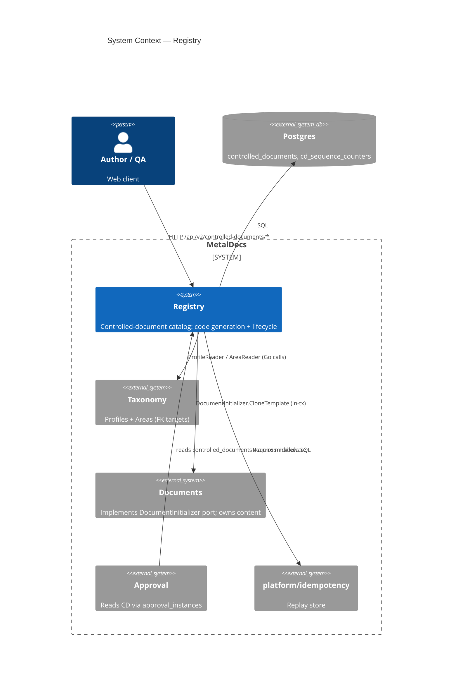
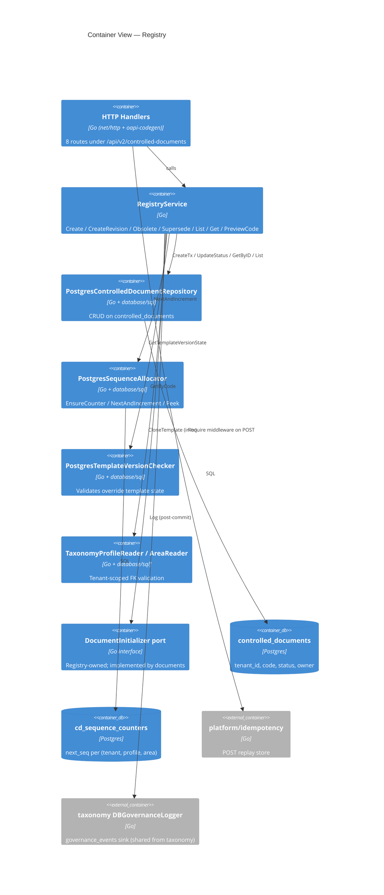
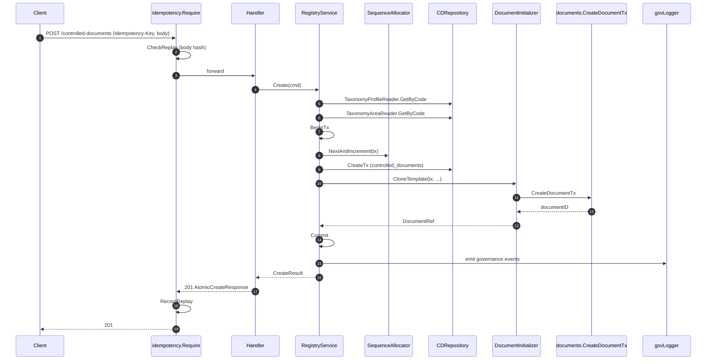
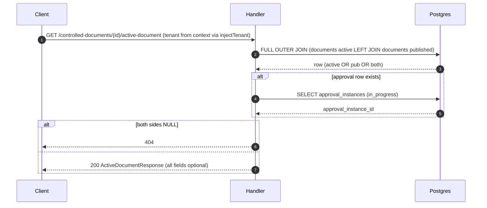
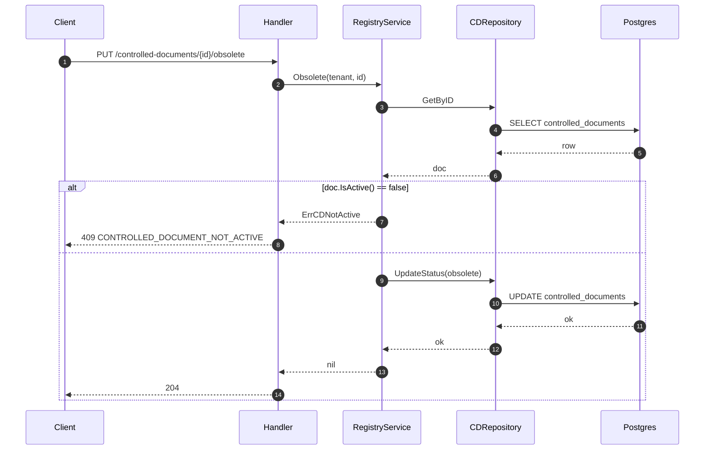

# Module: Registry (Controlled Documents)

> Living architecture doc. Arc42 (12 sections) + C4 (Context/Container) Mermaid diagrams. Supersedes the 2026-05-07 stub.

**Last verified:** 2026-05-11 (Plan 5) · **Owner:** unassigned · **Status:** active

> **Key files:**
> - `internal/modules/registry/module.go:25` — module wiring (`New`, dependencies)
> - `internal/modules/registry/application/service.go:104` — `RegistryService.Create` (atomic create)
> - `internal/modules/registry/application/service.go:293` — `Obsolete` / `Supersede` via `changeStatus`
> - `internal/modules/registry/delivery/http/handler.go:48` — `injectTenant` middleware (reads tenant via `tenant.FromContext`)
> - `internal/modules/registry/delivery/http/handler.go:60` — `tenantIDFromContext` (local context accessor)
> - `internal/modules/registry/delivery/http/routes.go:43` — `AtomicCreateControlledDocument` handler
> - `internal/modules/registry/delivery/http/routes.go:232` — `GetActiveDocument` handler (FULL OUTER JOIN)
> - `internal/modules/registry/delivery/http/routes.go:488` — `tenantIDFromRequest` → `tenant.FromContext`
> - `internal/modules/registry/domain/document_initializer.go:30` — `DocumentInitializer` port (consumed by documents)
> - `internal/modules/registry/infrastructure/repository.go:184` — `UpdateStatus` (lifecycle mutation)
> - `migrations/0124_registry_controlled_documents.sql` — initial table
> - `migrations/0182_cd_sequence_per_area.sql` — per-area sequence (ADR 0011)

---

## 1. Introduction & Goals

The **registry** module owns the catalog of code-numbered Controlled Documents (CDs). Each row in `public.controlled_documents` is a numbered slot binding a (`profile_code`, `process_area_code`) pair to a chain of `documents` revisions. The CD itself carries no content — it owns the identity, the per-(tenant, profile, area) sequence number, and the lifecycle status (`active | obsolete | superseded`).

### 1.1 Requirements overview

- Atomic CD + first-revision create — source: [wiki/decisions/0011-cd-atomic-create.md](decisions/0011-cd-atomic-create.md)
- Per-(profile, area) monotonic 3-digit sequence (`DC-RH-001`) — source: [wiki/concepts/controlled-documents.md](concepts/controlled-documents.md)
- `Idempotency-Key` replay safety on creation paths — source: ADR 0011
- Preview endpoint returns next code without sequence reservation — source: ADR 0011
- Active-document lookup tolerates published-only state (FULL OUTER JOIN) — source: E10 fix (commit 1dfcf3da)

### 1.2 Quality Goals

| Rank | Goal | How verified |
|---|---|---|
| 1 | Numbering integrity — no duplicate / out-of-band CD codes | `cd_sequence_counters` PK on (tenant_id, profile_code, process_area_code); UNIQUE (tenant_id, profile_code, code) on `controlled_documents`; `domain/sequence_test.go` |
| 2 | No orphan slots — CD row + first revision either both commit or both roll back | `application/integration_test.go` covering Create+CloneTemplate in single `*sql.Tx` (`service.go:243-257`) |
| 3 | Replay safety on creation paths | `internal/platform/idempotency` middleware + body-hash check; `routes_contract_test.go` |

### 1.3 Stakeholders

| Role | Expectation |
|---|---|
| Document author | Can issue a new CD via `POST /api/v2/controlled-documents` and immediately edit the first revision |
| Quality manager | `controlled_documents.code` is stable, audit-traceable, area-isolated |
| Operator | Per-(tenant, profile, area) sequence is monotonic; lifecycle transitions are recoverable |
| Frontend developer | `GET .../active-document` returns 200 with at least one document handle whenever the CD has any revision |

---

## 2. Architecture Constraints

- Language / runtime: Go 1.25
- Persistence: Postgres (per [wiki/architecture/data-model.md](architecture/data-model.md))
- API contract: OpenAPI 3.0.3 via oapi-codegen v2 — partial at `api/openapi/v1/partials/registry.yaml` (path prefix `/api/v2/` despite the v1 spec tree)
- Authz: two-tier per [wiki/decisions/0007-two-tier-authz.md](decisions/0007-two-tier-authz.md); Plan 5 wired `authz.Require` + tripwire on `controlled_documents` and `cd_sequence_counters` (T-001/T-004 closed); `Obsolete`/`Supersede` now pass typed `CapRegistryObsolete`/`CapRegistrySupersede` from `iamdomain` (migration 0187 seeded both caps)
- Idempotency: shared platform `internal/platform/idempotency` per ADR 0011
- Numbering: 3-segment `{PROFILE}-{AREA}-{NNN}` per ADR 0011
- Error envelope: legacy `{code, message}` today (RFC 9457 not yet adopted — T-003)

---

## 3. System Scope & Context (C4 Level 1)

### 3.1 Business Context

Registry owns the **identity** of every controlled document under QMS. A row exists from the moment a numbered slot is issued; it is the durable anchor that approval, audit, and downstream PDFs key against. Taxonomy owns the abstract classification (families → profiles → areas); registry owns the concrete catalog.

### 3.2 Technical Context

**Inbound:** 8 HTTP routes under `/api/v2/controlled-documents/*` (see §5.3). Go consumers: `internal/modules/documents` (imports `registrydomain` for `ControlledDocument`, `DocumentInitializer`, `DocumentRef`, `CloneTemplateRequest`).

**Outbound:** Postgres (`controlled_documents`, `cd_sequence_counters`, reads of `documents`, `approval_instances`, `document_revisions`, `document_profiles`, `document_process_areas`, `templates_v2_template_version`). Cross-module Go: `taxonomy/domain`, `taxonomy/application` (governance logger), `platform/idempotency`, `platform/authn`, `platform/httpresponse`, `platform/tenant`.

---

## 4. Solution Strategy

- **Atomic multi-row create in a single `*sql.Tx`** — driver: ADR 0011 (eliminate orphan slot risk). Registry opens the tx, allocates the sequence, inserts the CD, calls `DocumentInitializer.CloneTemplate` (documents materializes the first revision inside the same tx), commits, then emits governance events.
- **Registry-owned port for the cross-module call** — driver: avoid circular imports. `domain/document_initializer.go:30` defines the interface; `documents/application/cd_initializer.go` implements it; main.go injects via `WithDocumentInitializer` post-construction.
- **Per-(tenant, profile, area) sequence counter table** — driver: ADR 0011 (replaces single `profile_sequence_counters` keyed only on profile; no cross-area counter bleed).
- **Shared idempotency platform on POST create + revisions** — driver: ADR 0011 (Stripe-style key replay; body-hash conflict detection).
- **FULL OUTER JOIN for active-document lookup** — driver: E10 fix; published-only CDs must return 200 with `publishedDocumentId` so frontend renders download link.

---

## 5. Building Block View (C4 Level 2 — Container)

### 5.1 Whitebox — Registry

### 5.2 Public surface (selected)

Full list in `_artifacts/01-surface.md` (90 exported symbols). Anchors below:

| File | Symbol | Kind | Purpose |
|---|---|---|---|
| `module.go:15` | `Module`, `New` | type + ctor | DI entry; builds repo, allocator, readers, service, handler |
| `application/service.go:31` | `RegistryService` | struct | Use-case orchestrator |
| `application/service.go:104` | `Create` | method | Atomic CD + first-revision create |
| `application/service.go:279` | `PreviewCode` | method | Read-only next-code peek |
| `application/service.go:293` | `Obsolete` / `Supersede` | method | Lifecycle transitions via `changeStatus` |
| `application/service.go:330` | `CreateRevision` | method | New revision on existing CD |
| `application/migration.go:13` | `BackfillLegacyDocuments` | func | Startup data-migration hook |
| `domain/controlled_document.go:18` | `ControlledDocument` | struct | Domain entity |
| `domain/controlled_document.go:13-15` | `CDStatusActive/Obsolete/Superseded` | const | Status enum |
| `domain/controlled_document.go:48` | `AutoCode` | func | Format `{profile}-{area}-{NNN}` |
| `domain/document_initializer.go:30` | `DocumentInitializer` | iface | Cross-module port (documents implements) |
| `domain/sequence.go:13` | `SequenceAllocator` | iface | Counter port |
| `domain/resolution.go:30` | `Resolve` | func | Template-version resolution (default vs override) |
| `infrastructure/repository.go:137` | `CreateTx` | method | Insert in caller-owned tx |
| `infrastructure/repository.go:184` | `UpdateStatus` | method | Lifecycle UPDATE |
| `infrastructure/repository.go:239` | `NextAndIncrement` | method | Sequence allocation |

### 5.3 HTTP operations

All routes registered via `Handler.RegisterRoutes` (`delivery/http/handler.go:67`) onto the shared `http.ServeMux`.

| Method | Path | OperationID | Handler | Authz |
|---|---|---|---|---|
| POST | `/api/v2/controlled-documents` | `atomicCreateControlledDocument` | `routes.go:43` | `registry.create` (tier-1 only) |
| POST | `/api/v2/controlled-documents/{id}/revisions` | `createControlledDocumentRevision` | `routes.go:148` | `registry.create` (tier-1) |
| GET | `/api/v2/controlled-documents/preview-code` | `previewControlledDocumentCode` | `routes.go:127` | (read; resolver mapping outside module) |
| GET | `/api/v2/controlled-documents` | `listControlledDocuments` | `routes.go:23` | (read) |
| GET | `/api/v2/controlled-documents/{id}` | `getControlledDocument` | `routes.go:190` | (read) |
| GET | `/api/v2/controlled-documents/{id}/active-document` | `getActiveDocument` | `routes.go:232` | (read; tenant from `tenant.FromContext` via `injectTenant` middleware) |
| PUT | `/api/v2/controlled-documents/{id}/obsolete` | `obsoleteControlledDocument` | `routes.go:328` | `registry.obsolete` (`CapRegistryObsolete`) — T-001 closed Plan 5 |
| PUT | `/api/v2/controlled-documents/{id}/supersede` | `supersedeControlledDocument` | `routes.go:337` | `registry.supersede` (`CapRegistrySupersede`) — T-001 closed Plan 5 |

---

## 6. Runtime View

### 6.1 atomicCreateControlledDocument

State transitions:

| Entity | From | To | Trigger | Capability |
|---|---|---|---|---|
| `controlled_documents` (new row) | (none) | `active` | `CreateTx` | `registry.create` (tier-1 IAM middleware) |
| `documents` (new row) | (none) | `draft` | `CreateDocumentTx` (in same tx) | same |
| `cd_sequence_counters.next_seq` | N | N+1 | `NextAndIncrement` | same |
| `governance_events` | (none) | event row (post-commit) | `govLogger.Log` | same |

Failure modes:

| Condition | HTTP | Code |
|---|---|---|
| Missing `Idempotency-Key` | 400 | `IDEMPOTENCY_KEY_REQUIRED` |
| Same key, different body | 422 | `IDEMPOTENCY_KEY_CONFLICT` |
| Profile/area archived | 409 | `PROFILE_ARCHIVED` / `AREA_ARCHIVED` |
| Override template mismatch | 409 | `TEMPLATE_PROFILE_MISMATCH` |
| Code uniqueness violation | 409 | `CONTROLLED_DOCUMENT_CODE_TAKEN` |
| Spec declares 422 `template_invalid` | (no handler branch — T-007) | — |

Detail: `_artifacts/02-flow-atomic-create.md`.

### 6.2 getActiveDocument

State transitions: none (read).

Tripwire pairing: VIOLATION — no `authz.Require`, no `metaldocs.assert_caps`, no GUC; tenant is now sourced from `tenant.FromContext` (via `injectTenant` middleware) rather than `X-Tenant-ID` header (Plan 3 fix). Authz gap on this read path persists — see T-006.

Detail: `_artifacts/02-flow-get-active.md`.

### 6.3 obsoleteControlledDocument / supersedeControlledDocument

State transitions:

| Entity | From | To | Trigger | Guard | Audit emitted? |
|---|---|---|---|---|---|
| `controlled_documents` | `active` | `obsolete` | `Obsolete` op | `ErrCDNotActive` if not active | **NO — T-002** |
| `controlled_documents` | `active` | `superseded` | `Supersede` op | `ErrCDNotActive` if not active | **NO — T-002** |

Tripwire pairing: active — `authz.Require(CapRegistryObsolete|CapRegistrySupersede)` called inside `changeStatus` tx (`service.go:327`); `trg_require_cap_asserted` on `controlled_documents` (UPDATE, OR-logic accepts either cap, migration 0188 line 201). T-001/T-004 closed Plan 5.

Detail: `_artifacts/02-flow-obsolete.md`.

---

## 7. Deployment View

- Binary: single Go server (`apps/api/cmd/metaldocs-api`)
- Process: `:8081` (see [wiki/references/local-dev-startup.md](references/local-dev-startup.md))
- Migrations: applied at startup; files at repo-root `migrations/` (7 affect registry: 0124, 0126, 0127, 0128, 0167, 0182, 0183 — see `_artifacts/04-persistence.md` §6)
- Startup hook: `Module.RunStartupMigrations` runs `BackfillLegacyDocuments` (`application/migration.go:13`)
- Environment: module reads no env vars directly (`_artifacts/03-deps.md` §4)

---

## 8. Cross-cutting Concepts

### 8.1 Authentication & Authorization

- Tier 1 (HTTP edge): IAM `CapabilityService` resolves `CapRegistryCreate` (=`registry.create`) for POST routes (`apps/api/cmd/metaldocs-api/permissions.go:186-187`; reseeded in `migrations/0165_role_capabilities_reseed.sql` for `editor`, `author`, `system_admin`).
- Tier 2 (in-tx `authz.Require`): applied in `Create`/`CreateTx` (`CapRegistryCreate`) and `changeStatus` (`CapRegistryObsolete|CapRegistrySupersede`). Plan 5 (T-001/T-004 closed).
- Tier 3 (Postgres `enforce_capability_asserted` tripwire): `migrations/0188_tripwire_extend.sql:201-208` attaches `trg_require_cap_asserted` to `controlled_documents` (INSERT + UPDATE with OR-logic) and `cd_sequence_counters`.
- See [wiki/concepts/authz-tiers.md](concepts/authz-tiers.md) and [wiki/decisions/0007-two-tier-authz.md](decisions/0007-two-tier-authz.md).

### 8.2 Error envelope

All responses use legacy `{"code":"...","message":"..."}` (`internal/platform/httpresponse/response.go:14-15`). RFC 9457 Problem Details not yet adopted (T-003). `application/problem+json` content-type is never set.

### 8.3 Idempotency

`Idempotency-Key` header required on POST create + POST revisions. Middleware: `internal/platform/idempotency/middleware.go:22`. Store: `postgres_store.go:19`. Body-hash conflict → 422 `IDEMPOTENCY_KEY_CONFLICT`. PUT lifecycle routes are NOT covered (T-008).

### 8.4 Pagination

`List` uses domain `CDFilter` (`domain/port.go:19`) — simple LIMIT/OFFSET. No cursor pagination (not required by current consumers).

### 8.5 Audit / Governance

Create path emits governance events post-commit via `s.govLogger.Log(...)` (`service.go:267-271`), wired from `taxonomyapp.NewDBGovernanceLogger(deps.DB)` (`module.go:31`) — cross-module sink coupling (T-008). Obsolete / Supersede paths emit NO audit event (T-002).

### 8.6 Concurrency / Transactions

`RegistryService.Create` owns the transaction. Sequence allocator and repository accept the caller's `*sql.Tx` (`infrastructure/repository.go:137`, `:239`). Cross-module `DocumentInitializer.CloneTemplate` runs inside the same tx — atomic CD + first revision per ADR 0011.

### 8.7 Tenant scoping

`controlled_documents.tenant_id NOT NULL`; `cd_sequence_counters` PK includes `tenant_id`. Indexes lead with `tenant_id` (`ix_controlled_documents_tenant_area`, `ix_controlled_documents_tenant_profile`). Tenant is enforced via query-argument predicate in every WHERE clause; no `SET LOCAL metaldocs.tenant_id` GUC + RLS (T-005). `migrations/0127_documents_v2_tenant_consistency_trigger.sql` cross-checks tenant on `documents_v2` writes (legacy bridge).

Tenant is sourced from `tenant.FromContext` via the `injectTenant` thin middleware (`delivery/http/handler.go:48`), which reads the value injected by auth middleware (from `auth_sessions.tenant_id`). This replaces the prior `X-Tenant-ID` header reads (Plan 3 sweep). See `wiki/architecture/tenant-context.md`.

### 8.8 Numbering invariants

- `cd_sequence_counters.next_seq` is monotonic per (tenant, profile_code, process_area_code).
- Code format `{PROFILE}-{AREA}-{NNN}` zero-padded to 3 digits (`domain/sequence.go` → `AutoCode`).
- `controlled_documents.code` immutability is enforced by the `trg_controlled_documents_code_immutable` trigger calling `reject_code_update()` (`migrations/0124_registry_controlled_documents.sql:47-59`).

---

## 9. Architecture Decisions

| Decision | Link / Status |
|---|---|
| Atomic CD + first-revision create + per-area numbering + `Idempotency-Key` | [wiki/decisions/0011-cd-atomic-create.md](decisions/0011-cd-atomic-create.md) |
| Two-tier authz | [wiki/decisions/0007-two-tier-authz.md](decisions/0007-two-tier-authz.md) (tier-2/3 wired Plan 5 — T-001/T-004 closed) |
| Contract-first API (OpenAPI + oapi-codegen) | [wiki/decisions/0012-contract-first-api.md](decisions/0012-contract-first-api.md) (spec/handler drift on 422 — T-007) |
| Which CD lifecycle events emit audit | tech-debt: missing-ADR (T-002) |
| Capability granularity (separate `registry.create` / `registry.obsolete` / `registry.supersede`) | implemented Plan 5 (migration 0187 + `CapRegistryObsolete`/`CapRegistrySupersede` in `domain/model.go`); missing standalone ADR — ADR-TODO per Plan 13 |
| RFC 9457 envelope adoption schedule | tech-debt: missing-ADR (T-003) |
| GUC-based tenant scoping vs query-arg only | tech-debt: missing-ADR (T-005) |
| Read-path authz contract (e.g. `GetActiveDocument` tenant source) | tech-debt: missing-ADR (T-006) |
| Where registry audit sink should live (own logger vs shared taxonomy sink) | tech-debt: missing-ADR (T-008) |
| Documents DI cycle resolution (`WithDocumentInitializer` setter) | tech-debt: missing-ADR (T-010) |
| OpenAPI partial directory (`v1/` for `/api/v2/` routes) | tech-debt: missing-ADR (T-011) |
| Exported-symbol doc-comment policy | tech-debt: missing-ADR (T-012) |

---

## 10. Quality Requirements

| Goal | Scenario | Pass criteria |
|---|---|---|
| Numbering integrity | Two concurrent `POST /controlled-documents` for same (profile, area) | Both succeed with distinct sequential codes; `cd_sequence_counters.next_seq` advances by 2 |
| No orphan slot | `CreateDocumentTx` returns error mid-tx | `controlled_documents` row NOT visible; `next_seq` NOT advanced |
| Replay safety | Replay POST with same `Idempotency-Key` and body | 201 with original CD payload; no new row |
| Body-hash conflict | Same key, different body | 422 `IDEMPOTENCY_KEY_CONFLICT`; no new row |
| Active-document publish-only | CD with only published revisions | 200 with `publishedDocumentId` set; `documentId` omitted |
| Active-document empty CD | CD with no revisions | 404 |
| Lifecycle guard | `PUT .../obsolete` on already-obsolete CD | 409 `CONTROLLED_DOCUMENT_NOT_ACTIVE` |
| Code immutability | Direct SQL `UPDATE controlled_documents SET code = ...` | Postgres trigger raises (`reject_code_update`) |

---

## 11. Risks & Technical Debt

Detail in [wiki/modules/registry-tech-debt.md](modules/registry-tech-debt.md). Severity rubric: see top of that file (concrete triggers; do not invent local definitions).

- Critical: 2
- Major: 6
- Minor: 4

Top 3 (by severity, then blast-radius):

1. T-002 — `Obsolete` / `Supersede` mutate a regulated QMS lifecycle without emitting `governance_events` (audit-trail gap on the canonical catalog). Still open.
2. T-006 — `GetActiveDocument` has no authz check for the read path; residual gap after Plan 3 header-trust fix.
3. T-005 — Tenant scoping relies on query-arg only; no GUC + RLS backstop on registry-owned tables.
(T-001 closed Plan 5: lifecycle authz wired. T-004 closed Plan 5: tripwire attached to `controlled_documents` + `cd_sequence_counters`.)

### Coverage stats

- Public symbols undocumented: 79 / 90 (computed from `_artifacts/01-surface.md`; deferred to T-012)
- Operations missing C4 placement: 0 / 8
- Cross-deps missing in §5/§8: 0 / 13 (IN-edges) + 0 / 6 (OUT-edges)
- State transitions missing in §6: 0 / 2 (Obsolete, Supersede both in §6.3; Create in §6.1)
- Decisions without ADR link: 10 / 12

---

## 12. Glossary

| Term | Definition |
|---|---|
| Controlled Document (CD) | A numbered slot in `controlled_documents` binding (profile_code, process_area_code) to a chain of `documents` revisions |
| Slot | A CD row before/without document content; the durable identity |
| Sequence counter | `cd_sequence_counters.next_seq`, monotonic per (tenant, profile, area) |
| AutoCode | Format `{PROFILE}-{AREA}-{NNN}` (e.g. `DC-RH-001`) |
| Active document | The current non-terminal `documents` row for a CD (draft/under_review/approved/rejected/scheduled) OR the most recent `published` row |
| `DocumentInitializer` | Registry-owned port the documents module implements to materialize the first revision inside the registry tx |

---

## Cross-links

- Related ADRs: [0011](decisions/0011-cd-atomic-create.md), [0007](decisions/0007-two-tier-authz.md), [0012](decisions/0012-contract-first-api.md)
- Related concepts: [controlled-documents](concepts/controlled-documents.md), [authz-tiers](concepts/authz-tiers.md)
- Related modules: [documents](modules/documents.md), [taxonomy](modules/taxonomy.md), [approval](modules/approval.md)
- Workflow: [user-onboarding](workflows/user-onboarding.md) Step 5
- Backlog: [registry-refactor](backlog/registry-refactor.md)
- Tech debt: [registry-tech-debt](modules/registry-tech-debt.md)

## Changelog

- 2026-05-11 — Plan 3 sweep: all `X-Tenant-ID` header reads replaced with `tenant.FromContext`; `injectTenant` middleware documented; §5.3 T-006 note updated; §6.2 sequence + tripwire note updated; §8.7 tenant-scoping paragraph added; Key files updated.
- 2026-05-11 — initial Arc42 + C4 publish; supersedes 2026-05-07 stub.
